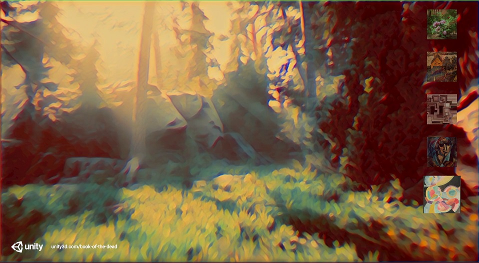

I've been fascinated with style transfer models ever since I first learned about them a few years ago. Most available style transfer applications are meant for single images. Interestingly, Unity seems to have another use case in mind. The home page for the [Barracuda](https://docs.unity3d.com/Packages/com.unity.barracuda@1.0/manual/index.html) library has an image of what appears to be in-game style transfer.

This was such an intriguing idea that I decided to give it a shot before getting started on my pose estimation project. One concern I had going in was performance. The style transfer models I'd used previously weren't exactly designed for real-time inference. This concern turned out to be well founded. The frame rates for my first attempt were so low it looked like a stop motion film.

At the time, I'd assumed the low frame rates were purely due to the performance demands of the style transfer model. I didn't realize that my methods for pre and post processing were needlessly inefficient. What's more, the output looked really bad. I learned much later that this was because I wasn't implementing the processing steps correctly. I decided to drop the whole endeavor and moved on to pose estimation.

Working on my pose estimation project taught me a lot about how to speed up the processing steps in Unity. Most importantly, I learned how to use [compute shaders](https://docs.unity3d.com/Manual/class-ComputeShader.html) to perform preprocessing steps on the GPU. I decided to see if this was enough to get a style transfer model to run at playable frame rates. I decided to use the demo [project](https://github.com/Unity-Technologies/Kinematica_Demo) for Unity's [Kinematica](https://docs.unity3d.com/Manual/com.unity.kinematica.html) package to make things more interesting to look at.

For testing purposes, I started with one of the pretrained fast style transfer [models](https://github.com/pytorch/examples/tree/master/fast_neural_style#models) provided in the [ONNX model zoo](https://github.com/onnx/models). This particular model was trained to apply the style of the mosaic image below. I plan to use my own style transfer models in the future.

Moving the processing steps from the CPU to the GPU allowed me to get "cinematic" frame rates. However, I needed to keep the resolution at or below 720p. Even at those resolutions, my GPU was pinned at 99-100% utilization the whole time. This might make a decent benchmark for the new RTX 3000 cards.

Moving both the pre and post processing steps to the GPU also made it easier to find out what I did wrong with my initial implementation. First, the RGB values for the input image need to be in the range of [0, 255]. This is worth noting because of an odd characteristic of the Barracuda library. When a tensor is created from a [Texture2D](https://docs.unity3d.com/ScriptReference/Texture2D.html) (i.e. a regular image) its values are normalized to the range [0, 1]. 

If you need your values to be outside the default range, you have two options. You can create the tensor using a float array, which needs to be done on the CPU. Or, you can use an HDR texture. Fortunately, I already learned how to use HDR textures while working on my pose estimation project.

The output of the model is also in the general range of [0, 255]. Although, you do need to clip the values just in case the model overshoots a bit. Since color values in Unity are typically in the range of [0, 1], you also need to scale the output back down to that range. This is the main reason my first attempt looked so bad. Trying to load the raw model output back into a Texture2D made nearly every pixel value pure white. It was relatively easy to implement the proper post processing steps with a compute shader after some research.

My current results might need a seizure warning, but they are still way better than my first attempt. The flickering effect is there because the model I'm using doesn't account for temporal cohesion between frames. Hopefully, I will be able to get a style transfer model working in Unity that's meant for video in the near future.

### My Results:

	<video style="width:auto;max-width:100%;height:auto;" controls loop>
		<source src="../videos/in-game-style-transfer/style_transfer_mosaic_360_480p.mp4" type="video/mp4">
	</video>

### Future Work:

This recently released [project](https://github.com/OndrejTexler/Few-Shot-Patch-Based-Training) on GitHub is very promising. Not only does it perform way better with videos, but it's also possible to modify the style while your using it. I haven't tried exporting the model to ONNX yet but I plan to fairly soon. Even if it's fully supported by ONNX, I'll still need to see if the Barracuda library supports it. But, it should be worth the effort to get it working. You can see just how much smoother video from this new model is in this short sample I made with it.

	<video style="width:auto;max-width:100%;height:auto;" controls loop>
		<source src="../videos/in-game-style-transfer/lynx_mosaic_small5.mp4" type="video/mp4">
	</video>

It's not 100% perfect. There's still a tiny bit of flickering in the background. However, this was made with just two sample frames. Also that mosaic image makes it more likely for such flickering to appear. If we use a different style image, the flickering is basically nonexistent. The noise is present because the Gif below was made from an mp4 rather than PNGs.

