**Version 2:** [Part 1](https://christianjmills.com/Barracuda-PoseNet-Tutorial-V2-1/) 

**Last Updated:** Nov 30, 2020

### Previous: [Part 5](https://christianjmills.com/Barracuda-PoseNet-Tutorial-5/)

* [Introduction](#introduction)
* [Create DrawSkeleton Script](#create-drawskeleton-script)
* [Create SkeletonRenderer](#create-skeletonrenderer)
* [Try It Out](#try-it-out)
* [Summary](#summary)

## Introduction

In this post, we'll add some connecting lines between the key points to create a simple skeleton. This will improve visibility over the key point objects alone.

## Create `DrawSkeleton` Script

We'll complete our pose skeleton by drawing lines connecting the appropriate key points. Create a new `C#` script and name it `DrawSkeleton`.

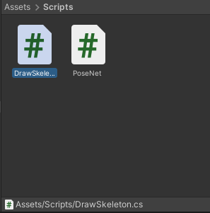

### Create `keypoints` Variable

We need to access the key point objects so make another public `GameObject` array just like in the `PoseNet` script.

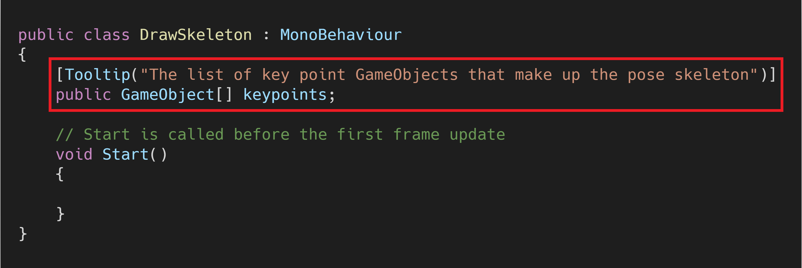

### Create `lines` Variable

Next, create a private `GameObject` array to hold the lines themselves. Name the variable `lines`.

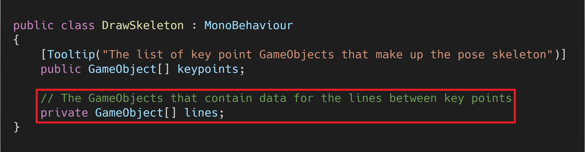

### Create `lineRenderers` Variable

We'll use [`LineRenderer`](https://docs.unity3d.com/Manual/class-LineRenderer.html) components to draw the skeleton.

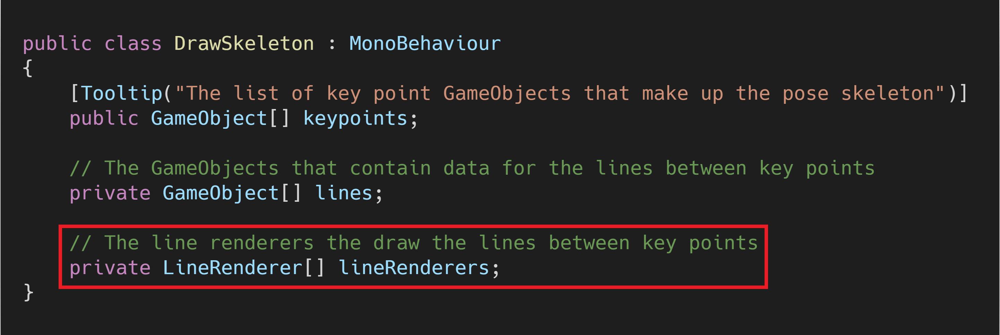

### Create `jointPairs` Variable

The next variable will contain pairs of key point indices. The corresponding key points indicate the start and end points for the skeleton lines.

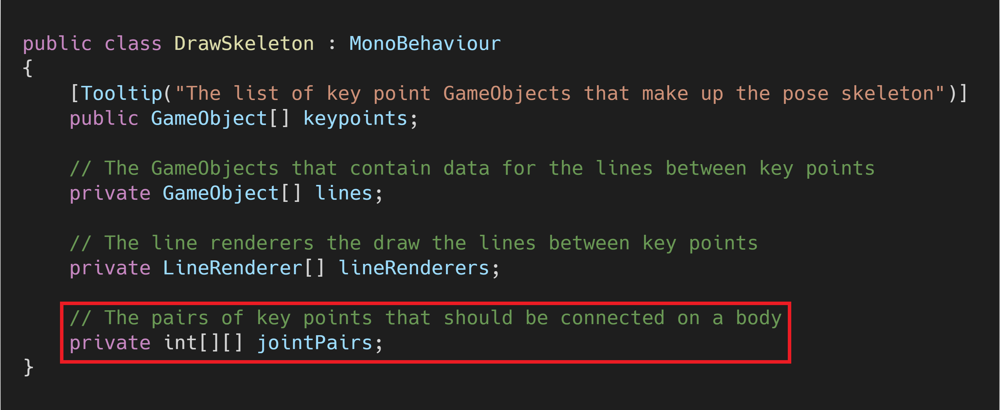

#### Joint Pairs

|  #   | Starting Key Point | Ending Key Point |
| :--: | ------------------ | ---------------- |
|  1   | Nose               | Left Eye         |
|  2   | Nose               | Right Eye        |
|  3   | Left Eye           | Left Ear         |
|  4   | Right Eye          | Right Ear        |
|  5   | Left Shoulder      | Right Shoulder   |
|  6   | Left Shoulder      | Left Hip         |
|  7   | Right Shoulder     | Right Hip        |
|  8   | Left Shoulder      | Right Hip        |
|  9   | Right Shoulder     | Left Hip         |
|  10  | Left Hip           | Right Hip        |
|  11  | Left Shoulder      | Left Elbow       |
|  12  | Left Elbow         | Left Wrist       |
|  13  | Right Shoulder     | Right Elbow      |
|  14  | Right Elbow        | Right Wrist      |
|  15  | Left Hip           | Left Knee        |
|  16  | Left Knee          | Left Ankle       |
|  17  | Right Hip          | Right Knee       |
|  18  | Right Knee         | Right Ankle      |

### Create `lineWidth` Variable

The last variable we'll make defines the line width.

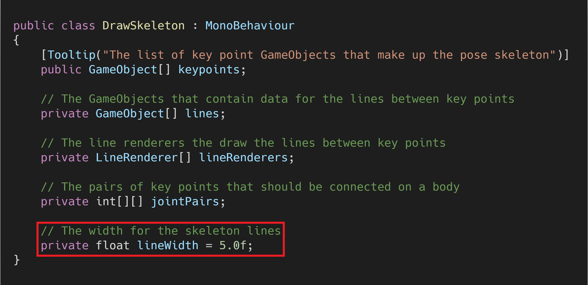

### Initialize Variables

We need to initialize the `lines`, `lineRenderers`, and `jointPairs` variables in the `Start()` method.

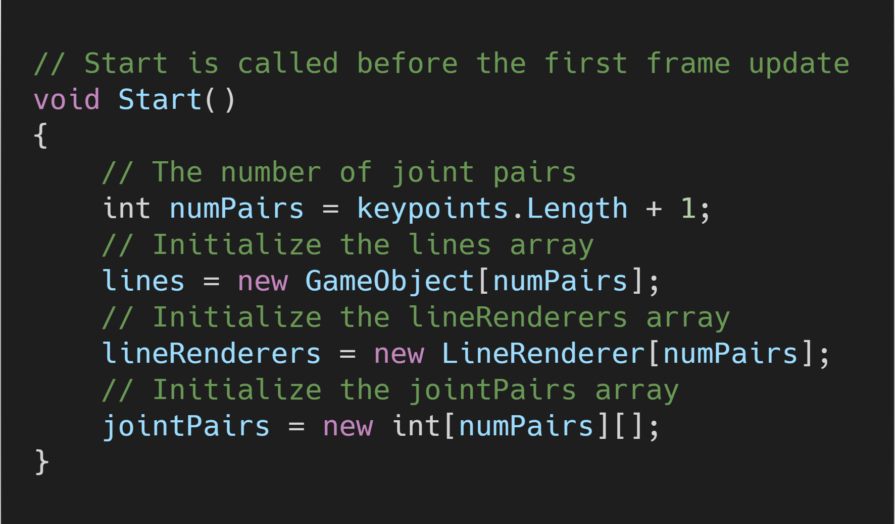

### Create `InitializeLine()` Method

We'll create a new method to set up each of the lines in the pose skeleton. The method will create an empty `GameObject` for a line and add a `LineRenderer` component to it. We won't set the start and end positions as none of the key points will have updated yet.

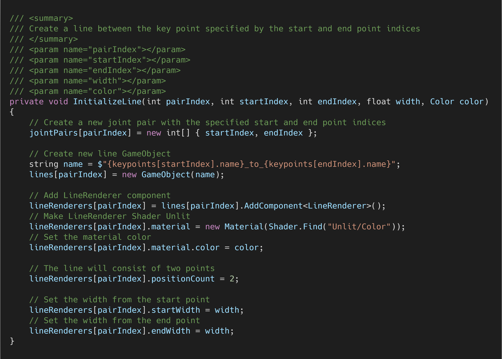

### Create `InitializeSkeleton()` Method

Next, we need to call `InitializeLine()` in a new method for each line in the pose skeleton. We'll give each region of the skeleton a different color.

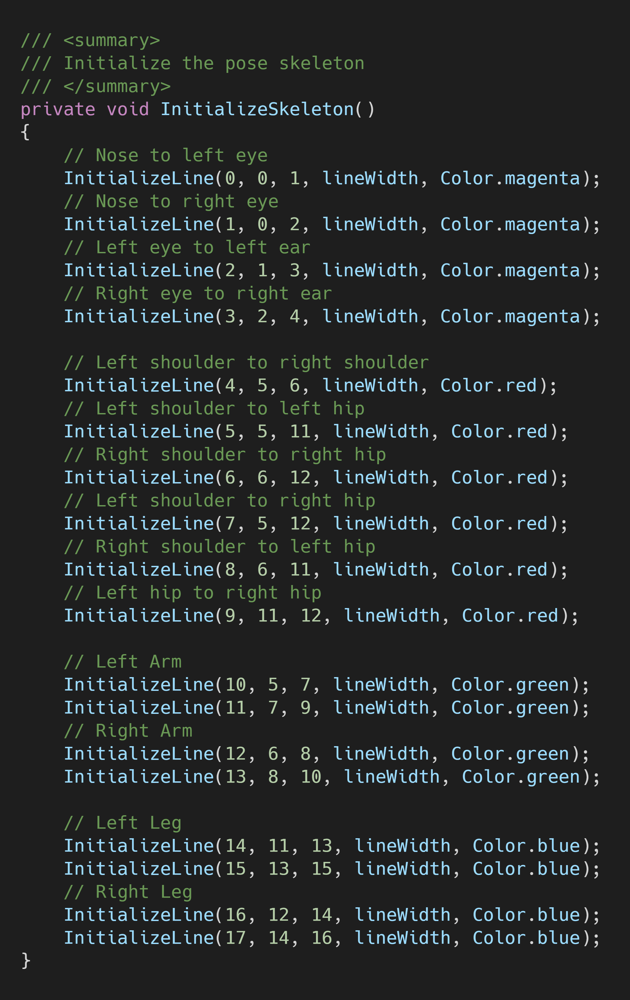

#### Call the method

We'll initialize the pose skeleton lines in the `Start()` method.

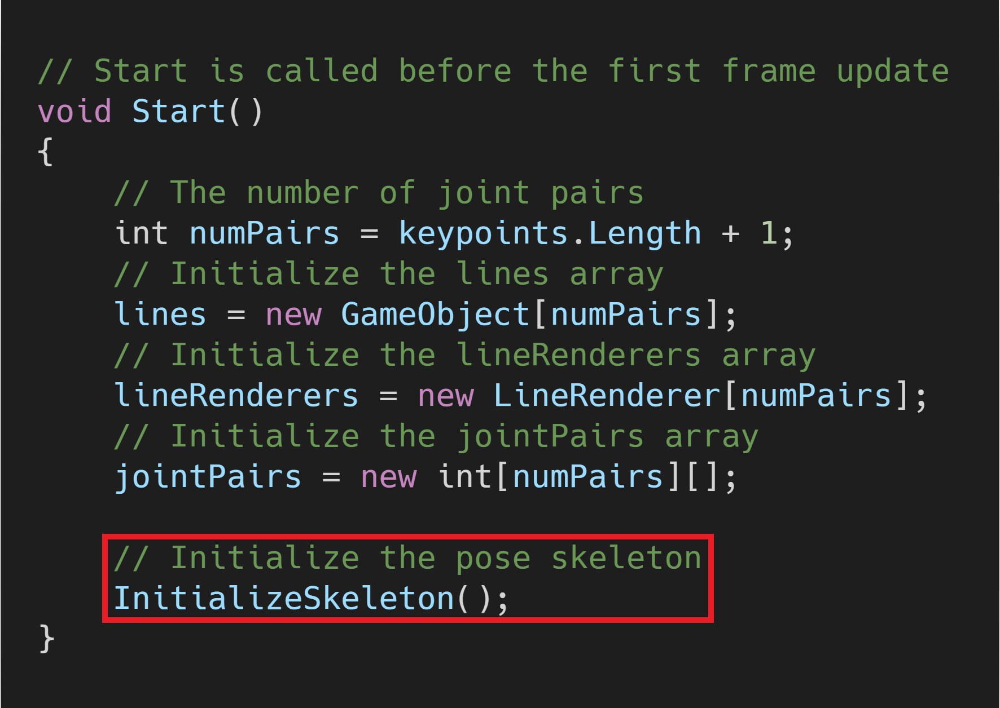

### Create `RenderSkeleton()` Method

The last method we need to define will handle updating the position of the each of the lines in the pose skeleton. The method will iterate through each of the joint pairs and update the start and end positions for the associated `LineRenderer`. We'll only display a given line if both of the key point objects are currently active. 

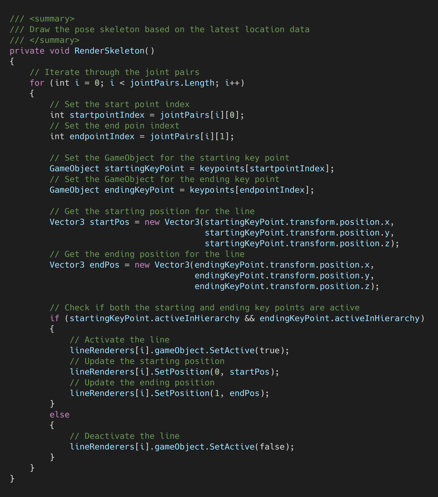

#### Call the method

We'll render the skeleton lines in the `LateUpdate()` method instead of `Update()`. This will ensure the PoseNet model has run for the latest frame before updating the pose skeleton.

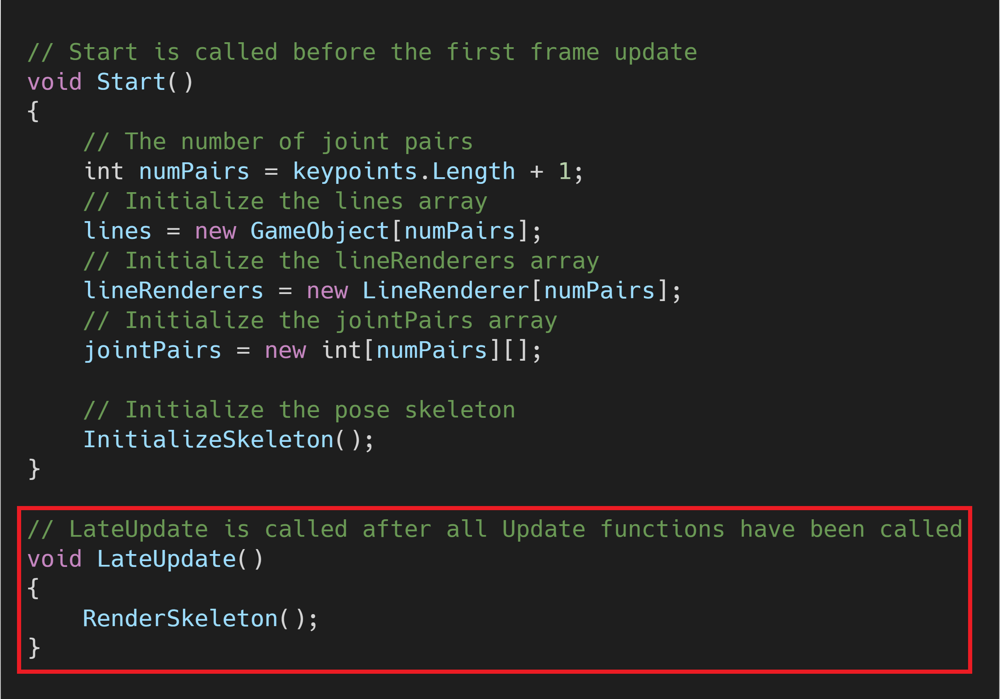

## Create `SkeletonRenderer`

We'll attach the `DrawSkeleton` script to a new `GameObject`. Create an empty `GameObject` in the `Hierarchy` tab and name it `SkeletonRenderer`.

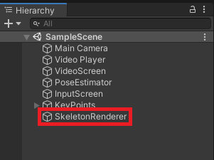

### Attach the `DrawSkeleton` Script

With `SkeletonRenderer` selected in the `Hierarchy`, drag and drop the `DrawSkeleton` script into the `Inspector` tab.

### Assign Key Points

Drag and drop the key point objects onto the `Keypoints` parameter just like with the `PoseNet` script.

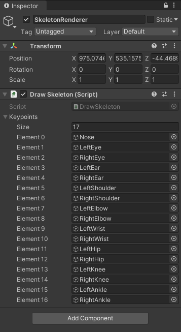

## Try It Out

If you press the play button, you should see something like this.

| Variable        | Value |
| --------------- | :---: |
| `imageHeight`   |  720  |
| `imageWidth`    |  720  |
| `minConfidence` |  85   |

## Summary

We now have a complete pose skeleton that we can use for debugging or demos. In the next post, we'll add the option to use a live webcam feed as input instead of a prerecorded video.

### [GitHub Repository - Version 1](https://github.com/cj-mills/Barracuda-PoseNet-Tutorial/tree/Version-1)

### Next: [Part  7](https://christianjmills.com/Barracuda-PoseNet-Tutorial-7/)

