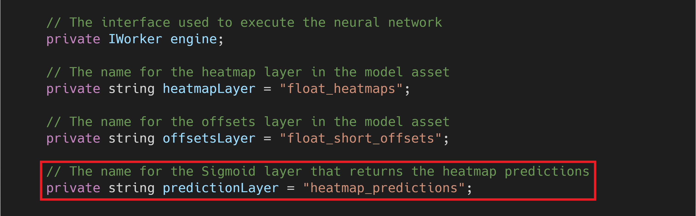
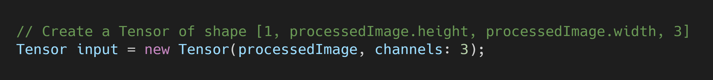

**Version 2:** [Part 1](https://christianjmills.com/Barracuda-PoseNet-Tutorial-V2-1/) 

**Last Updated:** Nov 30, 2020

### Previous: [Part 2](https://christianjmills.com/Barracuda-PoseNet-Tutorial-2/) [Part 2.5](https://christianjmills.com/Barracuda-PoseNet-Tutorial-2-5/)

* [Introduction](#introduction)
* [Install Barracuda Package](#install-barracuda-package)
* [Import PoseNet Model](#import-posenet-model)
* [Load the Model](#load-the-model)
* [Set Inspector Variables](#set-inspector-variables)
* [Perform Inference](#perform-inference)
* [Summary](#summary)

## Introduction

We can now start using the Barracuda library. We'll first install the Barracuda package for our project and import the PoseNet model. We're going to modify the model a bit to make postprocessing easier. Finally, we'll perform inference using a preprocessed image as input.

## Install Barracuda Package

Select the `Package Manager` tab in the Unity editor.

Type `Barracuda` into the search box. The version of the package used in the tutorial is `1.0.4`.

Click the `Install` button to install the package.

Wait for Unity to install the dependencies.

## Import PoseNet Model

Now we can import the model into Unity. The Barracuda dev team has focused on supporting the [ONNX](https://onnx.ai/) format for models. We aren't able to directly import models from TensorFlow or PyTorch. I've already converted the PoseNet model to ONNX. You can check out my tutorial for converting TensorFlow SavedModels to ONNX ([here](https://christianjmills.com/tensorflow/onnx/tutorial/2020/10/21/How-to-Convert-a-TensorFlow-SavedModel-to-ONNX.html)). PyTorch provides built-in support for ONNX ([link](https://pytorch.org/tutorials/advanced/super_resolution_with_onnxruntime.html)).

### Download the ONNX File

You can download the converted PoseNet model from the link below.

* ResNet50: ([download](https://drive.google.com/file/d/1oKrlraI3m3ecme-pAvAh25-Jzzu86sv_/view?usp=sharing))

### Import Model to Assets

Create a new folder in the `Assets` window and name it `Models`. Drag and drop the ONNX file into the `Models` folder.

If you select the `resnet50` asset, you should see the following in the `Inspector` tab.

## Load the Model

Next, we need to implement the code for loading the model in the `PoseNet` [script](https://christianjmills.com/unity/tutorial/2020/11/04/Barracuda-PoseNet-Tutorial-2.html#create-the-posenet-script).

### Add `Unity.Barracuda` Namespace

Open the `PoseNet` script and add the `Unity.Barracuda` namespace at the top of the script.

### Create `modelAsset` Variable

Make a new public `NNModel` variable called `modelAsset`. We'll assign the `resnet50` asset to this variable in the Unity Editor.

### Create `workerType` Variable

We'll also add a variable that let's us choose which [backend](https://docs.unity3d.com/Packages/com.unity.barracuda@1.0/manual/Worker.html) to use when performing inference. The options are divided into `CPU` and `GPU`. I believe there are plans to add support for specialized hardware such as Neural Processing Units in the future. Our preprocessing pipeline runs entirely on the `GPU` so we'll be sticking with the `GPU` options for this tutorial series.

Make a new public `WorkerFactory.Type` called `workerType`. Give it a default value of `WorkerFactory.Type.Auto`.

### Create `m_RuntimeModel` Variable

We need to compile the `modelAsset` into a run-time model to perform inference. We'll store the compiled model in a new private `Model` variable called `m_RuntimeModel`. This is the naming convention used in the Barracuda [documentation](https://docs.unity3d.com/Packages/com.unity.barracuda@1.0/manual/Loading.html). 

### Create `engine` Variable

Next, we'll create a new private `IWorker` variable to store our inference engine. Name the variable `engine`.

### Create `heatmapLayer` Variable

Add a new private `string` variable to store the  name of the heatmap layer in the `resnet50` model. We'll need the output of this layer to determine the location of key points (e.g. nose, elbows, knees, etc.) in the input image. We can find the name for the model's output layers in the `Inspector` tab. For our model, the heatmap layer is named `float_heamap`.

**Note:** The last two output layers, `resnet_v1_50/displacement_bwd_2/BiasAd` and `resnet_v1_50/displacement_fwd_2/BiasAd`, are used when estimating the pose of multiple people. We'll be sticking to single pose estimation for this series. 

### Create `offsetsLayer` Variable

We'll go ahead and create a variable for the `float_short_offsets` layer as well since we'll need it later. The output from this layer is used to refine the estimated key point locations determined with the heatmap layer. 

### Compile the Model

We need to get an object oriented representation of the model before we can work with it. We'll do this in the `Start()` method and store it in the `m_RuntimeModel`.

### Modify the Model

We need to add a [`Sigmoid`](https://docs.unity3d.com/Packages/com.unity.barracuda@1.0/api/Unity.Barracuda.ModelBuilder.html#Unity_Barracuda_ModelBuilder_Sigmoid_System_String_System_Object_) layer to the end of the model before creating our inference engine. This will map the output values to the range `[0,1]`. We'll use these values to measure the model's confidence that a given key point is in a given spot in the input image. A value of `1` would indicate that the model is `100%` confident the key point is in that location. We won't be getting any `1`'s.

First, we need to make a new private `string` variable to store the name of this new layer. We'll name the variable `predictionLayer` and name the layer `heatmap_predictions`.

We'll add the new layer using a [`ModelBuilder`](https://docs.unity3d.com/Packages/com.unity.barracuda@1.0/api/Unity.Barracuda.ModelBuilder.html).

### Initialize the Inference Engine

Now we can create a worker to execute the modified model using the selected backend. We'll do this using the [`WorkerFactory.CreateWorker()`](https://docs.unity3d.com/Packages/com.unity.barracuda@1.0/api/Unity.Barracuda.WorkerFactory.html#Unity_Barracuda_WorkerFactory_CreateWorker_Unity_Barracuda_WorkerFactory_Type_Unity_Barracuda_Model_System_Boolean_) method.

### Release Inference Engine Resources

We need to manually release the resources that get allocated for the inference `engine`. This should be one of the last actions performed. Therefore, we'll do it in the `OnDisable()` method. This method gets called when the Unity project exits. We need to implement this method in the `PoseNet` script.

## Set Inspector Variables

Now we just need to set the values for the `Model Asset` and select the inference backend.

### Assign the Model Asset

With the `PoseEstimator` object selected, drag and drop the `resnet50` asset into the `Model Asset` variable.

### Select Inference Backend

Set the backend to the `Compute Precompiled` option in the `Worker Type` drop-down. This is the most efficient GPU backend.

## Perform Inference

Finally, we'll add the code to perform inference in the `Update()` method.

### Create the `input` Tensor

We need to convert the `processedImage` to a `Tensor` before we can feed it to the model. The `Tensor` constructor requires us to specify the number of channels in the image. We don't need the alpha (transparency) channel so we'll specify `3` for the RGB color channels.

### Execute the Model

We'll use the [`engine.Execute()`](https://docs.unity3d.com/Packages/com.unity.barracuda@1.0/api/Unity.Barracuda.IWorker.html#Unity_Barracuda_IWorker_Execute_Unity_Barracuda_Tensor_) method to perform inference. This method takes in the input Tensor and schedules the network execution.

### Release Input Tensor Resources

We'll need to manually release the allocated resources for the Tensor with the `input.Dispose()` method.

Here is the revised `Update()` method.

## Summary

We've finally performed inference using a PoseNet model in Unity. However, we need to process the output from the model to determine the estimated key point locations. We'll cover how to perform the postprocessing operations in part 4.

### [GitHub Repository - Version 1](https://github.com/cj-mills/Barracuda-PoseNet-Tutorial/tree/Version-1)

### Next: [Part 4](https://christianjmills.com/Barracuda-PoseNet-Tutorial-4/)

