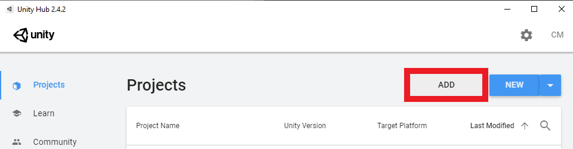
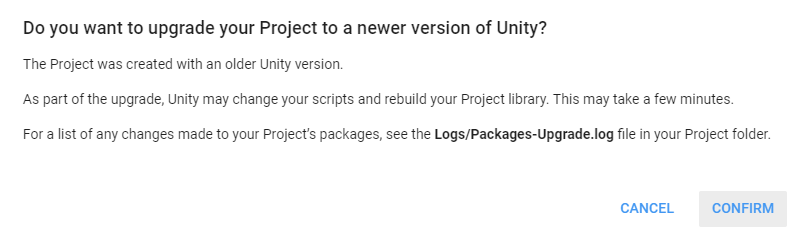
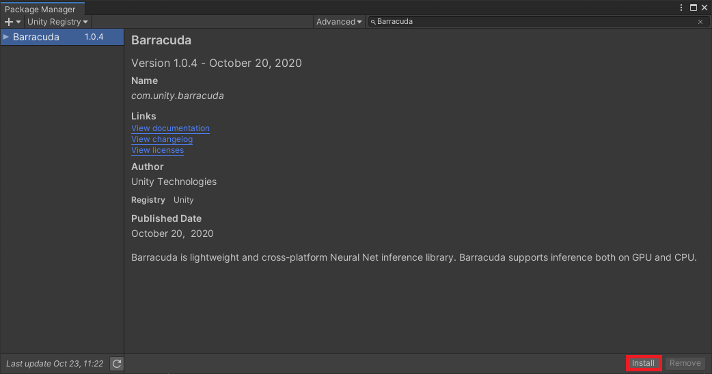
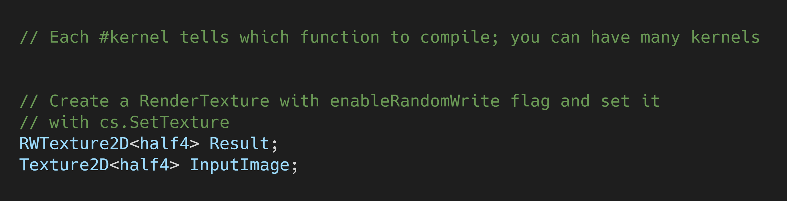
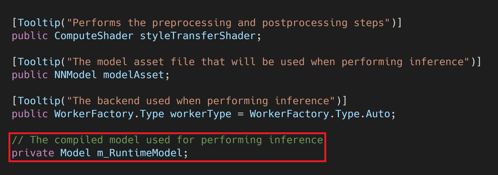
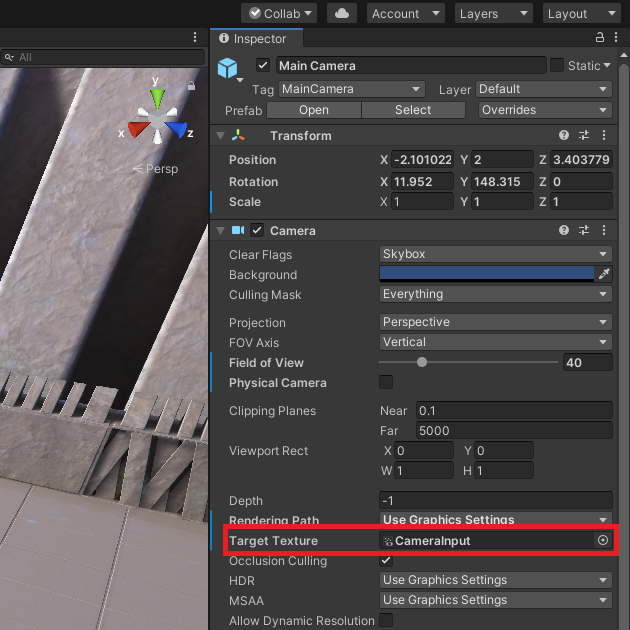
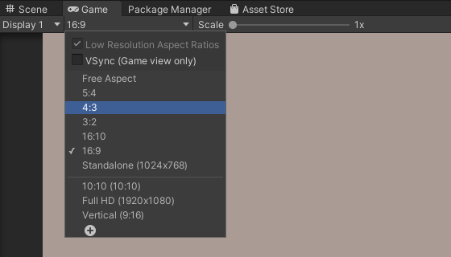

### Update 3/29/2021: [End-to-End In-Game Style Transfer Tutorial](https://christianjmills.com/End-To-End-In-Game-Style-Transfer-Tutorial-1/)

* [Introduction](#introduction)
* [Select a Unity Project](#select-a-unity-project)
* [Install Barracuda Package](#install-barracuda-package)
* [Create Style Transfer Folder](#create-style-transfer-folder)
* [Import Models](#import-models)
* [Prepare Render Textures](#prepare-render-textures)
* [Create a Compute Shader](#create-a-compute-shader)
* [Create StyleTransfer Script](#create-styletransfer-script)
* [Summary](#summary)

## Introduction

Unity has finally released the in-game style transfer project they've been [teasing](https://docs.unity3d.com/Packages/com.unity.barracuda@1.0/manual/images/BarracudaLanding.png) in the Barracuda [documentation](https://docs.unity3d.com/Packages/com.unity.barracuda@1.0/manual/index.html). Their implementation is slightly more polished than my early [attempts](https://christianjmills.com/unity/style_transfer/2020/10/19/In-Game-Style-Transfer.html). And by slightly, I mean they seem to have addressed every major complaint I had with my implementation. Be sure to check out their sample [project](https://github.com/UnityLabs/barracuda-style-transfer) as well as the accompanying blog [post](https://blogs.unity3d.com/2020/11/25/real-time-style-transfer-in-unity-using-deep-neural-networks/).

It's exciting that Unity has started releasing projects that explore alternative uses for the Barracuda library. Hopefully, they'll explore other deep learning applications in future projects. I would love to see projects that use GANs for dynamically generating in-game content.

I plan to work on a more sophisticated implementation for in-game style transfer in the future, perhaps using some tricks from Unity's implementation. However, I wanted to start with a basic implementation to serve as a baseline. 

This tutorial will cover how to use trained models from the [`fast_neural_style`](https://github.com/pytorch/examples/tree/master/fast_neural_style) project provided by PyTorch. The models take in regular images and return stylized versions. We'll get our input images from the in-game camera and display the stylized output to the user.

**Important:** This is meant as a simple proof of concept and requires a powerful GPU to get playable frame rates. An RTX 20-series equivalent or newer is recommended.

## Select a Unity Project

I'll be using the [Kinematica_Demo](https://github.com/Unity-Technologies/Kinematica_Demo/) project provided by Unity for this tutorial. It provides a great character model for testing different styles. However, feel free to follow along with a different project. This one is a bit large and takes a while to open the first time.

### Download Kinematica Demo

You can download the Unity project by clicking on the link below. The zipped folder is approximately 1.2 GB.

* Kinematica_Demo_0.8.0-preview: ([download](https://github.com/Unity-Technologies/Kinematica_Demo/releases/download/0.8.0-preview/Kinematica_Demo_0.8.0-preview.zip))

### Add Project to Unity Hub

Once downloaded, unzip the folder and add the project to Unity Hub using the `Add` button.

### Set the Unity Version

Select a Unity version from the drop-down menu. The demo project was made using Unity `2019.4.5f1`. You can use a later `2019.4` release if you don't have that version installed.

* Unity 2019.4.13: ([download](unityhub://2019.4.13f1/518737b1de84))

### Open the Project

Now we can open the project. We'll be prompted to upgrade the project to the selected Unity version. Click `Confirm` in the popup to upgrade the project. As mentioned earlier, this project takes a while to load the first time.

## Install Barracuda Package

We'll install the Barracuda package once the project has finished loading. Select the Package Manager tab in the Unity editor and type Barracuda into the search box.

Click the `Install` button to install the package.

## Create Style Transfer Folder

We'll place all our additions to the project in a new asset folder called `Style_Transfer`. This will help keep things organized.

## Import Models

Next, we need to add some style transfer models. PyTorch models need to be exported to the [ONNX](https://onnx.ai/) format before being imported to Unity. Fortunately, PyTorch provides built-in support for exporting to ONNX ([tutorial](https://pytorch.org/tutorials/advanced/super_resolution_with_onnxruntime.html)).

### Download ONNX Files

You can download some exported style transfer models from the links below.

* Mosaic: ([download](https://drive.google.com/file/d/1gnWUCTkLmDyUFHzMl7fk9F64vSoZk5jK/view?usp=sharing))

  

* Van Gogh Starry Night: ([download](https://drive.google.com/file/d/1vL5-NZo0Dn0ijkX5u94WoP_WWnxFIU3o/view?usp=sharing))

### Import ONNX Files to Assets

Open the `Style_Transfer` folder and make a new folder called `Models`.

Drag and drop the ONNX files into the `Models` folder.

## Prepare Render Textures

Our basic process will involve taking the current frame from the in-game camera, feeding it to the model, getting the output, and displaying the processed output to the user. We'll store the current camera frame and processed output in separate [render textures](https://docs.unity3d.com/ScriptReference/RenderTexture.html).

### Create `Textures` Folder

Add a new folder called `Textures` in the `Style_Transfer` folder.

### Create  Asset Files

Open the `Textures` folder and create two new `Render Texture` assets. 

Name the new assets `CameraInput`, `ProcessedOutput`.

### Update Size Parameters

We need to use a fairly low resolution to get playable frame rates. Click an empty space in the `Textures` folder and press `Ctrl-a` to select both render textures. Set the size the parameter to `720 x 540` in the `Inspector` tab. Feel free to try higher resolutions if you happen to have an RTX 30-series or equivalent GPU.

## Create a Compute Shader

We can perform both the preprocessing and postprocessing operations on the GPU since both the input and output are images. We'll implement these steps in a [compute shader](https://docs.unity3d.com/Manual/class-ComputeShader.html).

### Create the Asset File

Open the `Style_Transfer` folder and create a new folder called `Shaders`. Enter the `Shaders` folder and right-click an empty space. Select `Shader` in the `Create` submenu and click `Compute Shader`. We’ll name it `StyleTransferShader`.

### Remove the Default Code

Open the `StyleTransferShader` in your code editor. By default, the `ComputeShader` will contain the following. 

Delete the `CSMain` function along with the `#pragma kernel CSMain`. Next, we need to add a `Texture2D` variable to store the input image. Name it `InputImage` and give it a data type of `<half4>`. Use the same data type for the `Result` variable as well.

### Create `ProcessInput` Function

The style transfer models expect RGB channel values to be in the range `[0, 255]`. Color values in Unity are in the range `[0,1]`. Therefore, we need to scale the three channel values for the `InputImage` by `255`. We'll perform this step in a new function called `ProcessInput` as shown below.

### Create `ProcessOutput` Function

The models are supposed to output an image with RGB channel values in the range `[0, 255]`. However, it can sometimes return values a little outside that range. We can use the built-in [`clamp()`](https://docs.microsoft.com/en-us/windows/win32/direct3dhlsl/dx-graphics-hlsl-clamp) method to make sure all values are in the correct range. We'll then scale the values back down to `[0, 1]` for Unity. We'll perform these steps in a new function called `ProcessOutput` as shown below.

Now that we’ve created our `ComputeShader`, we need to execute it using a `C#` script.

## Create `StyleTransfer` Script

We need to make a new `C#` script to perform inference with the style transfer models. This script will load the model, process the input, run the model, and process the output.

### Create the Asset File

Open the `Style_Transfer` folder and create a new folder called `Scripts`. In the `Scripts` folder, right-click an empty space and select `C# Script` in the `Create` submenu.

Name the script `StyleTransfer`.

### Add `Unity.Barracuda` Namespace

Open the `StyleTransfer` script and add the `Unity.Barracuda` namespace at the top of the script.

### Create `RenderTexture` Variables

We need to create some public variables that we can use to access our two render texture assets in the script.

### Create `StyleTransferShader` Variable

Next, we'll add a public variable to access our compute shader.

### Create Barracuda Variables

Now we need to add a few variables to perform inference with the style transfer models.

#### Create `modelAsset` Variable

Make a new public `NNModel` variable called `modelAsset`. We’ll assign one of the ONNX files to this variable in the Unity Editor.

#### Create `workerType` Variable

We’ll also add a variable that let’s us choose which [backend](https://docs.unity3d.com/Packages/com.unity.barracuda@1.0/manual/Worker.html) to use when performing inference. The options are divided into `CPU` and `GPU`. Our preprocessing pipeline runs entirely on the `GPU` so we’ll be sticking with the `GPU` options for this tutorial series.

Make a new public `WorkerFactory.Type` called `workerType`. Give it a default value of `WorkerFactory.Type.Auto`.

#### Create `m_RuntimeModel` Variable

We need to compile the `modelAsset` into a run-time model to perform inference. We’ll store the compiled model in a new private `Model` variable called `m_RuntimeModel`.

#### Create `engine` Variable

Next, we’ll create a new private `IWorker` variable to store our inference engine. Name the variable `engine`.

### Compile the Model

We need to get an object oriented representation of the model before we can work with it. We’ll do this in the `Start()` method and store it in the `m_RuntimeModel`.

### Initialize Inference Engine

Now we can create a worker to execute the modified model using the selected backend. We’ll do this using the [`WorkerFactory.CreateWorker()`](https://docs.unity3d.com/Packages/com.unity.barracuda@1.0/api/Unity.Barracuda.WorkerFactory.html#Unity_Barracuda_WorkerFactory_CreateWorker_Unity_Barracuda_WorkerFactory_Type_Unity_Barracuda_Model_System_Boolean_) method.

### Release Inference Engine Resources

We need to manually release the resources that get allocated for the inference `engine`. This should be one of the last actions performed. Therefore, we’ll do it in the `OnDisable()` method. This method gets called when the Unity project exits.

### Create `ToTexture2D()` Method

We'll make a new method to copy the data from a `RenderTexture` to a new `Texture2D`. We'll need to call this method before performing both the preprocessing and postprocessing steps. The method will take in the source `RenderTexture` and the format for the new `Texture2D`.

### Create `ProcessImage()` Method

Next, we'll make a new method to execute the `ProcessInput()` and `ProcessOutput()` functions in our `ComputeShader`. This method will take in the image that needs to be processed as well as a function name to indicate which function we want to execute. We'll need to store the processed images in textures with HDR formats. This will allow us to use color values outside the default range of `[0, 1]`. As mentioned previously, the model expects values in the range of `[0, 255]`.

### Process Input Image

Now we can process the current camera frame. We'll call the `ToTexture2D()` method at the top of the `Update` method. The `cameraInput` is not an HDR texture so we'll use an SDR format for the new `Texture2D`. We'll then call the `ProcessImage()` method with new `Texture2D` as input.

### Perform Inference

Next, we'll feed the `processedImage` to the model and get the output. We first need to convert the `processedImage` to a `Tensor`.

We'll then use the `engine.Execute()` method to run the model with the current `input`. We can store the raw output from the model in a new `Tensor`.

### Process the  Output

We need to process the raw output from the model before we can display it to the user. We'll first copy the model output to a new HDR `RenderTexture`.

We'll then copy the data to a `Texture2D` and pass it to the `ProcessImage()` method. This time we'll be executing the `ProcessOutput()` function on the `ComputeShader`.

### Display the Processed Output

We can finally display the stylized image by using the `Graphics.Blit()` method to copy the final image to `processedOutput`.

Next, we'll need to modify the project scene to use the `StyleTransfer` script. 

## Open the `Biped` Scene

In the `Assets` window, open the `Scenes` folder and double-click on the `Biped.unity` asset. You don't need to save the current scene if you get prompted to do so.

## Create Style Converter

To run the `StyleTransfer` script, we need to attach it to a `GameObject` in the scene.

### Create an Empty `GameObject`

In the Hierarchy tab, right-click an empty space and select `Create Empty` from the menu. Name the empty GameObject `StyleConverter`.

### Attach the `StyleTransfer` Script

With the `StyleConverter` object selected, drag and drop the `StyleTransfer` script into the `Inspector` tab.

### Assign the Assets

We need to assign the render textures, compute shader and one of the ONNX files to their respective parameters in the `Inspector` tab. I'll start with the mosaic model. We'll also set the `Worker Type` to `Compute Precompiled`. 

## Set Camera Target Texture

Select the `_Scene` object in the `Hierarchy` tab. In the dropdown, select the `Main Camera` object.

## Create a Screen

Right-click an empty space in the `Hierarchy` tab and select `Raw Image` in the `UI` submenu. Name it Screen.

### Adjust the Anchor Presets

With the `Screen` object selected, click on the anchor presets box in the `Inspector` tab outlined below.  

Select the option in the bottom right corner that's outlined below.

Next we need to set all the `Rect Transform` values to zero. This will cause the `Screen` to take up the entire display.

### Set the Screen Texture

With the Screen object still selected, drag and drop the `ProcessedOutput` asset into the `Texture` parameter in the `Inspector` tab.

### Adjust the Game Tab

Our last step is to set up the game tab for our chosen resolution.

#### Set the Aspect Ratio

My chosen resolution of `720 x 540` has a `4:3` aspect ratio. You can change the aspect ratio in the drop-down menu.

#### Disable Warning

You might see a warning saying that there isn't a camera rendering. This would be because we set the camera to render to `CameraInput`. If you do, right-click the `Game` tab and uncheck the `Warn if No Cameras Rendering` option.

## Test it Out

We can finally press the play button and see how it looks.

## Summary

We now have a basic implementation of in-game style transfer. It's pretty inefficient and probably needs a seizure warning. I started with this model architecture for it's relative simplicity but it was not designed for real-time video. I was surprised to get playable frame rates even at this low of a resolution. 

Despite it's shortcomings, this little demo provides a glimpse at what's possible. It can also serve as a decent testing environment for trying out different styles. It's worth noting that the models used in this tutorial were trained on datasets of real-world photos and not video games. I might try making an training dataset using screenshots from video games and see what impact that has on the stylized images. 

I already have another style transfer [project](https://github.com/OndrejTexler/Few-Shot-Patch-Based-Training) that I want to try to get working in Unity. This project does a great job of generating consistent video output (i.e. no seizure warning). In the mean time, I recommend checking out Unity's sample [project](https://github.com/UnityLabs/barracuda-style-transfer). They put a lot of work into optimizing it for playable frame rates at more reasonable resolutions.

#### [GitHub Repository](https://github.com/cj-mills/Basic-In-Game-Style-Transfer)

