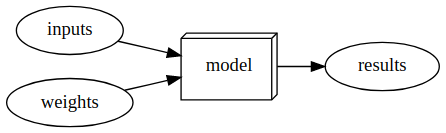

* [A Brief History of Neural Networks](#a-brief-history-of-neural-networks)
* [How to Learn Deep Learning](#how-to-learn-deep-learning)
* [What is Machine Learning?](#what-is-machine-learning?)
* [Create an Image Classifier](#create-an-image-classifier)
* [Inspecting Deep Learning Models](#inspecting-deep-learning-models)
* [Applying Image Models to Non-Image Tasks](#applying-image-models-to-non-image-tasks)
* [Other Deep Learning Applications](#other-deep-learning-applications)
* [Jargon](#jargon)
* [References](#references)


## A Brief History of Neural Networks

### The Artificial Neuron

* Developed in 1943 by [Warren McCulloch](https://en.wikipedia.org/wiki/Warren_Sturgis_McCulloch), a neurophysiologist, and [Walter Pitts](https://en.wikipedia.org/wiki/Walter_Pitts), a logician
* A simplified model of a real neuron can be represented using simple addition and thresholding

- Original Paper: [A Logical Calculus of the Ideas Immanent in Nervous Activity](https://www.cs.cmu.edu/~./epxing/Class/10715/reading/McCulloch.and.Pitts.pdf)
    - Neural events and the relations among them can be treated by means of propositional logic due to the [“all-or-none”](https://en.wikipedia.org/wiki/All-or-none_law) character of nervous activity

### [Mark 1 Perceptron](https://en.wikipedia.org/wiki/Perceptron#History)

- The first device based on the principles of artificial neurons
- Designed for image recognition
  - Able to recognize simple shapes

- Developed by a psychologist named [Frank Rosenblatt](https://en.wikipedia.org/wiki/Frank_Rosenblatt)
  - Gave the artificial neuron the ability to learn
  - Invented the perceptron algorithm in 1958
  - Wrote The Design of an Intelligent Automaton


### [Perceptrons](https://en.wikipedia.org/wiki/Perceptrons_(book))

- Written by [Marvin Minsky](https://en.wikipedia.org/wiki/Marvin_Minsky), an MIT professor and [Seymour Papert](https://en.wikipedia.org/wiki/Seymour_Papert) in 1969
- Showed that a single layer of [Mark 1 Perceptron](https://en.wikipedia.org/wiki/Perceptron#History) devices was unable to learn some simple but critical math functions like [XOR](https://en.wikipedia.org/wiki/XOR_gate)
- Also showed this limitation could be addressed by using multiple layers
    - This solution was not widely recognized by the global academic community

### Parallel Distributed Processing (PDP)

* Written by [David Rumelhart](https://en.wikipedia.org/wiki/David_Rumelhart), [James McClelland](https://en.wikipedia.org/wiki/James_McClelland_(psychologist)), and the [PDP Research Group](https://mitpress.mit.edu/contributors/pdp-research-group)
  - Released in 1986 by MIT Press


- Perhaps the most pivotal work in neural networks in the last 50 years
- Posited that traditional computer programs work very differently from brains and that this might be why computer programs were so bad at doing things that brains find easy
- Authors claimed the PDP approach was closer to how the brain worked
- Laid out an approach that is very similar to today’s neural networks
- Defined parallel distributed processing as requiring the following:
    - A set of processing units
    - A state of activation
    - An output function for each unit
    - A pattern of connectivity among units
    - A propagation rule for propagating patterns of activities through the network of connectivities
    - An activation rule for combining the inputs impinging on a unit with the current state of the unit to produce an output for the unit
    - A learning rule whereby patterns of connectivity are modified by experience
    - An environment within which the system must operate
- Modern neural networks handle each of these requirements
- **Parallel distributed processing: Explorations in the microstructure of cognition**
    - [Volume 1](https://mitpress.mit.edu/books/parallel-distributed-processing-volume-1)
    - [Volume 2](https://mitpress.mit.edu/books/parallel-distributed-processing-volume-2)
    - [PDF Scans](https://stanford.edu/~jlmcc/papers/PDP/)


### 1980s-1990s

- Most models were built with a second layer of neurons
- Neural networks were used for real, practical projects
- A misunderstanding of the theoretical issues held back the field
    - In theory, two-layer models could approximate any mathematical function
    - In practice, multiple layers are needed to get good, practical performance


## How to Learn Deep Learning

### Teaching Approach

- Teach the whole game
    - Build a foundation of intuition through application then build on it with theory
    - Show students how individuals pieces of theory are combined in a real-world application
- Teach through examples
    - Provide a context and a purpose for abstract concepts
- [Making Learning Whole by David Perkins](https://www.amazon.com/Making-Learning-Whole-Principles-Transform/dp/0470633719)
    - Describes how teaching any subject at any level can be made more effective if students are introduced to the "whole game," rather than isolated pieces of a discipline.
- [A Mathematician’s Lament by Paul Lockhart](https://www.maa.org/external_archive/devlin/LockhartsLament.pdf)
    - Imagines a nightmare world where music and art are taught the way math is taught
    - Students spend years doing rote memorization and learning dry, disconnected fundamentals that teachers claim will pay off later

### Learning Approach

- Learn by doing
- The hardest part of deep learning is artisanal
    - How do you know if you have enough data?
    - Is the data in the right format?
    - Is your model trained properly?
    - If your model is not trained properly, what should you do about it?
- Start with small projects related to your hobbies and passions, before tackling a big project
- Be curious about problems you encounter
- Focus on underlying techniques and how to apply them over specific tools or software libraries
- Experiment constantly


## What is Machine Learning?

* another way to get computers to complete a desired task

### Traditional Programming

* Must explicitly code the exact instructions required to complete a task
  * Difficult when you do not know the exact steps


> A traditional program


### Machine Learning

* Must show the computer examples of the desired task and have it learn how to perform the task through experience

  * Difficult when you do not have sufficient data

* Invented by IBM researcher [Arthur Samuel](https://en.wikipedia.org/wiki/Arthur_Samuel) in 1949

  - Created a checkers-player program that beat the Connecticut state champion in 1961
  - Wrote “[Artificial Intelligence: A Frontier of Automation](https://journals.sagepub.com/doi/abs/10.1177/000271626234000103)” in 1962
    - Computers are giant morons and need to be told the exact steps required to solve a problem
    - Show the computer examples of the problem to solve and let if figure out how to solve it itself
    - Arrange some automatic means of testing the effectiveness of any current weight assignment and provide a mechanism so as to maximize the actual performance
    - Introduced multiple concepts
      - The idea of “weight assignment”
        - Weights are just variables
        - A weight assignment is a particular choice of values for those variables
        - Weight values define how the program will operate
      - The fact every weight assignment has some “actual performance”
        - How accurate is the image classifier?
        - How good is the checkers-player program at playing checkers?
      - The requirement there be an “automatic means” of testing that performance
        - Compare performance with the current weight values to the desired result
      - The need for a “mechanism” for improving the performance by changing the weight assignments
        - Update the weight values based on the performance with the current values

  




> A program using weight assignments


> Training a machine learning model


> Using a trained model as a program


### What is a Neural Network?

- A particular kind of machine learning model
- Flexible enough to solve a wide variety of problems just by finding the right weight values
- [Universal Approximation Theorem](https://en.wikipedia.org/wiki/Universal_approximation_theorem): shows that a neural network can, in theory, solve any problem to any level of accuracy
- [Stochastic Gradient Descent](https://en.wikipedia.org/wiki/Stochastic_gradient_descent): a general way to automatically update the weights of a neural network to make it improve at any given task


### Deep learning

- A computer science technique to extract and transform data by using multiple layers of neural networks
- Output from the previous layer serves as input for the next
- Each layer progressively refines their input
- A neural network learns to perform a specified task through training its layers using algorithms that minimize their errors and improve their accuracy


### Inherent Limitations of Machine Learning

- A model cannot be created without data
- A model can learn to operate on only the patterns seen in the input data used to train it
- This learning approach only creates predictions, not recommended actions
    - can result in a significant gap between organizational goals and model capabilities
- Need labels for each example input in the training data
- The way a model interacts with its environment can create feedback loops that amplify existing biases
    1. A predictive policing algorithm that is trained on data from past arrests will learn to predict arrests rather than to predict crime
    2. Law enforcement officers using the model might decide to focus policing activity in areas where previous arrests were made, resulting in more arrests in those areas
    3. The data from these new arrests are then fed into the model, increasing its bias towards those areas


## Create an Image Classifier

### Import Dependencies


```python
# Import fastai computer vision library
# Includes functions and classes to create a wide variety of computer vision models
from fastai.vision.all import *
```


### Load Training Data


```python
# Download and extract the training dataset 
# base directory: '~/.fastai'
# returns a Path object: https://docs.python.org/3/library/pathlib.html
path = untar_data(URLs.PETS)/'images'
print(type(path))
print(path)
```

```text
<class 'pathlib.PosixPath'>
/home/innom-dt/.fastai/data/oxford-iiit-pet/images
```


**Oxford-IIT Pet Dataset:** contains 7,390 images of cats and dogs from 37 breeds


```python
URLs.PETS
```


```text
'https://s3.amazonaws.com/fast-ai-imageclas/oxford-iiit-pet.tgz'
```

------

```python
!ls ~/.fastai/data
```

```text
annotations  coco_sample  oxford-iiit-pet
```

------

```python
!ls ~/.fastai/data/oxford-iiit-pet/images| head -5
```

```text
Abyssinian_100.jpg
Abyssinian_100.mat
Abyssinian_101.jpg
Abyssinian_101.mat
Abyssinian_102.jpg
ls: write error: Broken pipe
```

------


```python
# Returns true if the first letter in the string is upper case
def is_cat(x): return x[0].isupper()
```


```python
str.isupper
```


```text
<method 'isupper' of 'str' objects>
```

------

```python
is_cat("word")
```


```text
False
```

------

```python
is_cat("Word")
```


```text
True
```

------

```python
is_cat("woRd")
```


```text
False
```

------

```python
# Cat breeds are upper case
!ls ~/.fastai/data/oxford-iiit-pet/images/[[:upper:]]* | head -5
```

```text
/home/innom-dt/.fastai/data/oxford-iiit-pet/images/Abyssinian_100.jpg
/home/innom-dt/.fastai/data/oxford-iiit-pet/images/Abyssinian_100.mat
/home/innom-dt/.fastai/data/oxford-iiit-pet/images/Abyssinian_101.jpg
/home/innom-dt/.fastai/data/oxford-iiit-pet/images/Abyssinian_101.mat
/home/innom-dt/.fastai/data/oxford-iiit-pet/images/Abyssinian_102.jpg
ls: write error: Broken pipe
```

------


```python
# Dog breeds are lower case
!ls ~/.fastai/data/oxford-iiit-pet/images/[[:lower:]]* | head -5
```

```text
/home/innom-dt/.fastai/data/oxford-iiit-pet/images/american_bulldog_100.jpg
/home/innom-dt/.fastai/data/oxford-iiit-pet/images/american_bulldog_101.jpg
/home/innom-dt/.fastai/data/oxford-iiit-pet/images/american_bulldog_102.jpg
/home/innom-dt/.fastai/data/oxford-iiit-pet/images/american_bulldog_103.jpg
/home/innom-dt/.fastai/data/oxford-iiit-pet/images/american_bulldog_104.jpg
ls: write error: Broken pipe
```

------


```python
# Create a dataloader to feed image files from dataset to the model
# Reserves 20% of the available images for the validation set
# Sets the random seed to get consistent results in each training session
# Uses the is_cat() function to identify image classes
# - Upper case will be the first class
# Resizes and crops images to 224x224
# Uses 8 cpu workers to load images during training
dls = ImageDataLoaders.from_name_func(
    path, get_image_files(path), valid_pct=0.2, seed=42,
    label_func=is_cat, item_tfms=Resize(224), num_workers=8)
```

------

```python
print(len(get_image_files(path)))
img_files = get_image_files(path)
for i in range(5):
    print(img_files[i])
```

```text
7390
/home/innom-dt/.fastai/data/oxford-iiit-pet/images/Birman_121.jpg
/home/innom-dt/.fastai/data/oxford-iiit-pet/images/shiba_inu_131.jpg
/home/innom-dt/.fastai/data/oxford-iiit-pet/images/Bombay_176.jpg
/home/innom-dt/.fastai/data/oxford-iiit-pet/images/Bengal_199.jpg
/home/innom-dt/.fastai/data/oxford-iiit-pet/images/beagle_41.jpg
```

------


```python
dls.after_item
```


```text
Pipeline: Resize -- {'size': (224, 224), 'method': 'crop', 'pad_mode': 'reflection', 'resamples': (2, 0), 'p': 1.0} -> ToTensor
```

------

```python
dls.after_batch
```


```text
Pipeline: IntToFloatTensor -- {'div': 255.0, 'div_mask': 1}
```


### Train a Model

#### Randomly Initialized Weights


```python
learn = cnn_learner(dls, resnet34, metrics=accuracy, pretrained=False)
learn.fine_tune(1)
```
<div style="overflow-x:auto;">
<table border="1" class="dataframe">
  <thead>
    <tr style="text-align: left;">
      <th>epoch</th>
      <th>train_loss</th>
      <th>valid_loss</th>
      <th>accuracy</th>
      <th>time</th>
    </tr>
  </thead>
  <tbody>
    <tr>
      <td>0</td>
      <td>1.004878</td>
      <td>0.697246</td>
      <td>0.662382</td>
      <td>00:11</td>
    </tr>
  </tbody>
</table>
<table border="1" class="dataframe">
  <thead>
    <tr style="text-align: left;">
      <th>epoch</th>
      <th>train_loss</th>
      <th>valid_loss</th>
      <th>accuracy</th>
      <th>time</th>
    </tr>
  </thead>
  <tbody>
    <tr>
      <td>0</td>
      <td>0.745436</td>
      <td>0.612512</td>
      <td>0.688769</td>
      <td>00:14</td>
    </tr>
  </tbody>
</table>
</div>


#### Pretrained Weights


```python
# removes the last layer of the of the pretrained resnet34 and
# replaces it with a new output layer for the target dataset
learn = cnn_learner(dls, resnet34, metrics=accuracy, pretrained=True)
learn.fine_tune(1)
```
<div style="overflow-x:auto;">
<table border="1" class="dataframe">
  <thead>
    <tr style="text-align: left;">
      <th>epoch</th>
      <th>train_loss</th>
      <th>valid_loss</th>
      <th>accuracy</th>
      <th>time</th>
    </tr>
  </thead>
  <tbody>
    <tr>
      <td>0</td>
      <td>0.162668</td>
      <td>0.023766</td>
      <td>0.989851</td>
      <td>00:11</td>
    </tr>
  </tbody>
</table>
<table border="1" class="dataframe">
  <thead>
    <tr style="text-align: left;">
      <th>epoch</th>
      <th>train_loss</th>
      <th>valid_loss</th>
      <th>accuracy</th>
      <th>time</th>
    </tr>
  </thead>
  <tbody>
    <tr>
      <td>0</td>
      <td>0.061914</td>
      <td>0.014920</td>
      <td>0.993234</td>
      <td>00:14</td>
    </tr>
  </tbody>
</table>
</div>
------


```python
# Build a convolutional neural network-style learner from the dataloader and model architecture
cnn_learner
```


```text
<function fastai.vision.learner.cnn_learner(dls, arch, normalize=True, n_out=None, pretrained=True, config=None, loss_func=None, opt_func=<function Adam at 0x7f0e87aa2040>, lr=0.001, splitter=None, cbs=None, metrics=None, path=None, model_dir='models', wd=None, wd_bn_bias=False, train_bn=True, moms=(0.95, 0.85, 0.95), cut=None, n_in=3, init=<function kaiming_normal_ at 0x7f0ed3b4f820>, custom_head=None, concat_pool=True, lin_ftrs=None, ps=0.5, first_bn=True, bn_final=False, lin_first=False, y_range=None)>
```

------

```python
# ResNet-34 model from [Deep Residual Learning for Image Recognition](https://arxiv.org/pdf/1512.03385.pdf)
# the pretrained version has already been trained to recognize
# a thousand different categories on 1.3 million images
resnet34
```


```text
<function torchvision.models.resnet.resnet34(pretrained: bool = False, progress: bool = True, **kwargs: Any) -> torchvision.models.resnet.ResNet>
```

------

```python
# based on https://github.com/sksq96/pytorch-summary/blob/master/torchsummary/torchsummary.py
def get_total_params(model, input_size, batch_size=-1, device='cuda', dtypes=None):
    
    def register_hook(module):

        def hook(module, input, output):
            class_name = str(module.__class__).split(".")[-1].split("'")[0]
            module_idx = len(summary)

            m_key = f"{class_name}-{module_idx + 1}"
            summary[m_key] = OrderedDict()

            params = 0
            if hasattr(module, "weight") and hasattr(module.weight, "size"):
                params += torch.prod(torch.LongTensor(list(module.weight.size())))
            if hasattr(module, "bias") and hasattr(module.bias, "size"):
                params += torch.prod(torch.LongTensor(list(module.bias.size())))
            summary[m_key]["nb_params"] = params

        if (
            not isinstance(module, nn.Sequential)
            and not isinstance(module, nn.ModuleList)
            and not (module == model)
        ):
            hooks.append(module.register_forward_hook(hook))

    if device == "cuda" and torch.cuda.is_available():
        dtype = torch.cuda.FloatTensor
    else:
        dtype = torch.FloatTensor

    # multiple inputs to the network
    if isinstance(input_size, tuple):
        input_size = [input_size]

    # batch_size of 2 for batchnorm
    x = [torch.rand(2, *in_size).type(dtype) for in_size in input_size]
    
    # create properties
    summary = OrderedDict()
    hooks = []

    # register hook
    model.apply(register_hook)

    # make a forward pass
    model(*x)

    # remove these hooks
    for h in hooks:
        h.remove()

    total_params = 0
    for layer in summary:
        total_params += summary[layer]["nb_params"]
                
    return total_params
```


```python
input_shape = (3, 224, 224)
```


```python
print(f"ResNet18 Total params: {get_total_params(resnet18().cuda(), input_shape):,}")
print(f"ResNet34 Total params: {get_total_params(resnet34().cuda(), input_shape):,}")
print(f"ResNet50 Total params: {get_total_params(resnet50().cuda(), input_shape):,}")
print(f"ResNet101 Total params: {get_total_params(resnet101().cuda(), input_shape):,}")
print(f"ResNet152 Total params: {get_total_params(resnet152().cuda(), input_shape):,}")
```

```text
ResNet18 Total params: 11,689,512
ResNet34 Total params: 21,797,672
ResNet50 Total params: 25,557,032
ResNet101 Total params: 44,549,160
ResNet152 Total params: 60,192,808
```


------

```python
# 1 - accuracy
error_rate
```


```text
<function fastai.metrics.error_rate(inp, targ, axis=-1)>
```

------


```python
# 1 - error_rate
accuracy
```


```text
<function fastai.metrics.accuracy(inp, targ, axis=-1)>
```


### Use Trained Model


```python
# Upload file(s) from browser to Python kernel as bytes
uploader = widgets.FileUpload()
uploader
```


```text
FileUpload(value={}, description='Upload')
```

------

```python
# Open an `Image` from path `fn`
# Accepts pathlib.Path, str, torch.Tensor, numpy.ndarray and bytes objects
img = PILImage.create(uploader.data[0])
print(f"Type: {type(img)}")
img
```

```text
Type: <class 'fastai.vision.core.PILImage'>
```


```python
# Prediction on `item`, fully decoded, loss function decoded and probabilities
is_cat,_,probs = learn.predict(img)
print(f"Is this a cat?: {is_cat}.")
print(f"Probability it's a cat: {probs[1].item():.6f}")
```


```text
Is this a cat?: False.
Probability it's a cat: 0.000024
```

------

```python
uploader = widgets.FileUpload()
uploader
```


```text
FileUpload(value={}, description='Upload')
```

```python
img = PILImage.create(uploader.data[0])
img
```


```python
is_cat,_,probs = learn.predict(img)
print(f"Is this a cat?: {is_cat}.")
print(f"Probability it's a cat: {probs[1].item():.6f}")
```

```text
Is this a cat?: True.
Probability it's a cat: 1.000000
```


## Inspecting Deep Learning Models

- It is possible to inspect deep learning models and get rich insights from them
    - can still be challenging to fully understand
- [Visualizing and Understanding Convolutional Networks](https://arxiv.org/abs/1311.2901)
    - published by PhD student Matt Zeiler and his supervisor Rob Fergus in 2013
    - showed how to visualize the neural network weights learned in each layer of a model
    - discovered the early layers in a convolutional neural network recognize edges and simple patterns which are combined in later layers to detect more complex shapes
      - very similar to the basic visual machinery in the human eye


## Applying Image Models to Non-Image Tasks

- A lot of data can be represented as images
- Sound can be converted to a spectrogram
    - **spectrogram**: a chart that shows the amount of each frequency at each time in an audio file
- Time series can be converted  to an image by plotting the time series on a graph
    - Various transformations available for time series data
        - [fast.ai](http://fast.ai) student Ignacio Oguiza created images from time series data using [Gramian Angular Difference Field](https://pyts.readthedocs.io/en/0.10.0/auto_examples/image/plot_gaf.html) (GADF)
            - an image obtained from a time series, representing some temporal correlation between each time point
        - [fast.ai](http://fast.ai) student Gleb Esman converted mouse movements and clicks to images for fraud detection
        - [Malware Classification with Deep Convolutional Neural Networks](https://ieeexplore.ieee.org/abstract/document/8328749)
            - the malware binary file is divided into 8-bit sequences which are then converted to equivalent decimal values
            - the decimal values are used to generate a grayscale image the represents the malware sample
- It is often a good idea to represent your data in a way that makes it as easy as possible to pull out the most important components
    - In a time series, things like seasonality and anomalies are most likely to be of interest
- Rule of thumb: if the human eye can recognize categories from images, then a deep learning model should be able to as well


## Other Deep Learning Applications

### Image Segmentation

- training a model to recognize the content of every single pixel in an image

-----

```python
path = untar_data(URLs.CAMVID_TINY)
print(path)
```
```text
/home/innom-dt/.fastai/data/camvid_tiny
```

------

```python
!ls $path
```
```text
codes.txt  images  labels
```

------

```python
# Basic wrapper around several `DataLoader`s with factory methods for segmentation problems
dls = SegmentationDataLoaders.from_label_func(
    path, bs=8, fnames = get_image_files(path/"images"),
    label_func = lambda o: path/'labels'/f'{o.stem}_P{o.suffix}',
    codes = np.loadtxt(path/'codes.txt', dtype=str), seed=42, num_workers=8
)
```

------


```python
img_files = get_image_files(path/"images")
print(len(img_files))
for i in range(5):
    print(img_files[i])
```
```text
100
/home/innom-dt/.fastai/data/camvid_tiny/images/0016E5_08155.png
/home/innom-dt/.fastai/data/camvid_tiny/images/Seq05VD_f03210.png
/home/innom-dt/.fastai/data/camvid_tiny/images/Seq05VD_f03060.png
/home/innom-dt/.fastai/data/camvid_tiny/images/Seq05VD_f03660.png
/home/innom-dt/.fastai/data/camvid_tiny/images/0016E5_05310.png
```

------

```python
path/'labels'/f'{img_files[0].stem}_P{img_files[0].suffix}'
```
```text
Path('/home/innom-dt/.fastai/data/camvid_tiny/labels/0016E5_08155_P.png')
```

------

```python
# Build a unet learner
learn = unet_learner(dls, resnet34, pretrained=True)
learn.fine_tune(8)
```
<div style="overflow-x:auto;">
<table border="1" class="dataframe">
  <thead>
    <tr style="text-align: left;">
      <th>epoch</th>
      <th>train_loss</th>
      <th>valid_loss</th>
      <th>time</th>
    </tr>
  </thead>
  <tbody>
    <tr>
      <td>0</td>
      <td>2.914330</td>
      <td>2.284680</td>
      <td>00:01</td>
    </tr>
  </tbody>
</table>
<table border="1" class="dataframe">
  <thead>
    <tr style="text-align: left;">
      <th>epoch</th>
      <th>train_loss</th>
      <th>valid_loss</th>
      <th>time</th>
    </tr>
  </thead>
  <tbody>
    <tr>
      <td>0</td>
      <td>1.906939</td>
      <td>1.415985</td>
      <td>00:01</td>
    </tr>
    <tr>
      <td>1</td>
      <td>1.628720</td>
      <td>1.185889</td>
      <td>00:01</td>
    </tr>
    <tr>
      <td>2</td>
      <td>1.454888</td>
      <td>1.024575</td>
      <td>00:01</td>
    </tr>
    <tr>
      <td>3</td>
      <td>1.290813</td>
      <td>0.921251</td>
      <td>00:01</td>
    </tr>
    <tr>
      <td>4</td>
      <td>1.152427</td>
      <td>0.809383</td>
      <td>00:01</td>
    </tr>
    <tr>
      <td>5</td>
      <td>1.034114</td>
      <td>0.793250</td>
      <td>00:01</td>
    </tr>
    <tr>
      <td>6</td>
      <td>0.941492</td>
      <td>0.782535</td>
      <td>00:01</td>
    </tr>
    <tr>
      <td>7</td>
      <td>0.869773</td>
      <td>0.778228</td>
      <td>00:01</td>
    </tr>
  </tbody>
</table>
</div>
------


```python
learn.show_results(max_n=6, figsize=(18,20))
```


### Natural Language Processing (NLP)

- generate text
- translate from one language to another
- analyze comments
- label words in sentences

-----

```python
from fastai.text.all import *
```

-----

IMDB Large Moview Review Dataset

* from [Learning Word Vectors for Sentiment Analysis](https://ai.stanford.edu/~ang/papers/acl11-WordVectorsSentimentAnalysis.pdf)

-----


```python
path = untar_data(URLs.IMDB)
path
```


```text
Path('/home/innom-dt/.fastai/data/imdb')
```

------


```python
!ls $path
```

```text
imdb.vocab  README  test  tmp_clas  tmp_lm  train  unsup
```

------

```python
# Basic wrapper around several `DataLoader`s with factory methods for NLP problems
dls = TextDataLoaders.from_folder(path, valid='test', bs=64, seed=42, num_workers=8)
```

------


```python
len(dls.items)
```


```text
25000
```

------


```python
dls.after_iter
```


```text
<bound method after_iter of <fastai.text.data.SortedDL object at 0x7f0f493cb9d0>>
```

------


```python
# A `DataLoader` that goes throught the item in the order given by `sort_func`
SortedDL
```

------


```python
!ls $path/train
```

```text
labeledBow.feat  neg  pos  unsupBow.feat
```

------

```python
!ls $path/train/pos | wc -l
```

```text
12500
```

------

```python
!ls $path/train/pos | head -5
```

```text
0_9.txt
10000_8.txt
10001_10.txt
10002_7.txt
10003_8.txt
ls: write error: Broken pipe
```

------

```python
!cat $path/train/pos/0_9.txt
```

```text
Bromwell High is a cartoon comedy. It ran at the same time as some other programs about school life, such as "Teachers". My 35 years in the teaching profession lead me to believe that Bromwell High's satire is much closer to reality than is "Teachers". The scramble to survive financially, the insightful students who can see right through their pathetic teachers' pomp, the pettiness of the whole situation, all remind me of the schools I knew and their students. When I saw the episode in which a student repeatedly tried to burn down the school, I immediately recalled ......... at .......... High. A classic line: INSPECTOR: I'm here to sack one of your teachers. STUDENT: Welcome to Bromwell High. I expect that many adults of my age think that Bromwell High is far fetched. What a pity that it isn't!
```

------


```python
!ls $path/train/neg | wc -l
```

```text
12500
```

------

```python
!ls $path/train/neg | head -5
```

```text
0_3.txt
10000_4.txt
10001_4.txt
10002_1.txt
10003_1.txt
ls: write error: Broken pipe
```

------

```python
!cat $path/train/neg/0_3.txt
```

```text
Story of a man who has unnatural feelings for a pig. Starts out with a opening scene that is a terrific example of absurd comedy. A formal orchestra audience is turned into an insane, violent mob by the crazy chantings of it's singers. Unfortunately it stays absurd the WHOLE time with no general narrative eventually making it just too off putting. Even those from the era should be turned off. The cryptic dialogue would make Shakespeare seem easy to a third grader. On a technical level it's better than you might think with some good cinematography by future great Vilmos Zsigmond. Future stars Sally Kirkland and Frederic Forrest can be seen briefly.
```

------


```python
# Create a `Learner` with a text classifier
learn = text_classifier_learner(dls, AWD_LSTM, drop_mult=0.5, metrics=accuracy)
learn.fine_tune(4, 1e-2)
```
<div style="overflow-x:auto;">
<table border="1" class="dataframe">
  <thead>
    <tr style="text-align: left;">
      <th>epoch</th>
      <th>train_loss</th>
      <th>valid_loss</th>
      <th>accuracy</th>
      <th>time</th>
    </tr>
  </thead>
  <tbody>
    <tr>
      <td>0</td>
      <td>0.460765</td>
      <td>0.407599</td>
      <td>0.815200</td>
      <td>01:25</td>
    </tr>
  </tbody>
</table>
<table border="1" class="dataframe">
  <thead>
    <tr style="text-align: left;">
      <th>epoch</th>
      <th>train_loss</th>
      <th>valid_loss</th>
      <th>accuracy</th>
      <th>time</th>
    </tr>
  </thead>
  <tbody>
    <tr>
      <td>0</td>
      <td>0.316035</td>
      <td>0.262926</td>
      <td>0.895640</td>
      <td>02:46</td>
    </tr>
    <tr>
      <td>1</td>
      <td>0.250969</td>
      <td>0.223144</td>
      <td>0.908440</td>
      <td>02:48</td>
    </tr>
    <tr>
      <td>2</td>
      <td>0.186867</td>
      <td>0.187719</td>
      <td>0.926720</td>
      <td>02:48</td>
    </tr>
    <tr>
      <td>3</td>
      <td>0.146174</td>
      <td>0.190528</td>
      <td>0.927880</td>
      <td>02:50</td>
    </tr>
  </tbody>
</table>
</div>
------


```python
learn.predict("I really liked that movie!")
```

```text
('pos', TensorText(1), TensorText([5.5877e-04, 9.9944e-01]))
```

------


```python
learn.predict("I really hated that movie!")
```


```text
('neg', TensorText(0), TensorText([0.9534, 0.0466]))
```


### Tabular Data

- data that in in the form of a table
    - spreedsheets
    - databases
    - Comma-separated Values (CSV) files
- model tries to predict the value of one column based on information in other columns

-----

```python
from fastai.tabular.all import *
```

Adult Dataset
* from the paper [Scaling Up the Accuracy of Naive-Bayes Classifiers: a Decision-Tree Hybrid](https://www.aaai.org/Papers/KDD/1996/KDD96-033.pdf)
* contains some demographic data about individuals

-----


```python
path = untar_data(URLs.ADULT_SAMPLE)
print(path)
```

```text
/home/innom-dt/.fastai/data/adult_sample
```

------

```python
!ls $path
```

```text
adult.csv  export.pkl  models
```

------

```python
import pandas as pd
```


```python
!cat $path/adult.csv | head -1
```

```text
age,workclass,fnlwgt,education,education-num,marital-status,occupation,relationship,race,sex,capital-gain,capital-loss,hours-per-week,native-country,salary
cat: write error: Broken pipe
```

------

```python
pd.read_csv(f"{path}/adult.csv").head()
```
<div style="overflow-x:auto;">
<table border="1" class="dataframe">
  <thead>
    <tr style="text-align: right;">
      <th></th>
      <th>age</th>
      <th>workclass</th>
      <th>fnlwgt</th>
      <th>education</th>
      <th>education-num</th>
      <th>marital-status</th>
      <th>occupation</th>
      <th>relationship</th>
      <th>race</th>
      <th>sex</th>
      <th>capital-gain</th>
      <th>capital-loss</th>
      <th>hours-per-week</th>
      <th>native-country</th>
      <th>salary</th>
    </tr>
  </thead>
  <tbody>
    <tr>
      <th>0</th>
      <td>49</td>
      <td>Private</td>
      <td>101320</td>
      <td>Assoc-acdm</td>
      <td>12.0</td>
      <td>Married-civ-spouse</td>
      <td>NaN</td>
      <td>Wife</td>
      <td>White</td>
      <td>Female</td>
      <td>0</td>
      <td>1902</td>
      <td>40</td>
      <td>United-States</td>
      <td>&gt;=50k</td>
    </tr>
    <tr>
      <th>1</th>
      <td>44</td>
      <td>Private</td>
      <td>236746</td>
      <td>Masters</td>
      <td>14.0</td>
      <td>Divorced</td>
      <td>Exec-managerial</td>
      <td>Not-in-family</td>
      <td>White</td>
      <td>Male</td>
      <td>10520</td>
      <td>0</td>
      <td>45</td>
      <td>United-States</td>
      <td>&gt;=50k</td>
    </tr>
    <tr>
      <th>2</th>
      <td>38</td>
      <td>Private</td>
      <td>96185</td>
      <td>HS-grad</td>
      <td>NaN</td>
      <td>Divorced</td>
      <td>NaN</td>
      <td>Unmarried</td>
      <td>Black</td>
      <td>Female</td>
      <td>0</td>
      <td>0</td>
      <td>32</td>
      <td>United-States</td>
      <td>&lt;50k</td>
    </tr>
    <tr>
      <th>3</th>
      <td>38</td>
      <td>Self-emp-inc</td>
      <td>112847</td>
      <td>Prof-school</td>
      <td>15.0</td>
      <td>Married-civ-spouse</td>
      <td>Prof-specialty</td>
      <td>Husband</td>
      <td>Asian-Pac-Islander</td>
      <td>Male</td>
      <td>0</td>
      <td>0</td>
      <td>40</td>
      <td>United-States</td>
      <td>&gt;=50k</td>
    </tr>
    <tr>
      <th>4</th>
      <td>42</td>
      <td>Self-emp-not-inc</td>
      <td>82297</td>
      <td>7th-8th</td>
      <td>NaN</td>
      <td>Married-civ-spouse</td>
      <td>Other-service</td>
      <td>Wife</td>
      <td>Black</td>
      <td>Female</td>
      <td>0</td>
      <td>0</td>
      <td>50</td>
      <td>United-States</td>
      <td>&lt;50k</td>
    </tr>
  </tbody>
</table>
</div>


------

```python
dls = TabularDataLoaders.from_csv(path/'adult.csv', path=path, y_names="salary",
    cat_names = ['workclass', 'education', 'marital-status', 'occupation',
                 'relationship', 'race'],
    cont_names = ['age', 'fnlwgt', 'education-num'],
    procs = [
        # Transform the categorical variables to something similar to `pd.Categorical`        
        Categorify, 
        # Fill the missing values in continuous columns.
        FillMissing,
        # Normalize/denorm batch
        Normalize
    ], bs=64, seed=42, num_workers=8)
```


```python
learn = tabular_learner(dls, metrics=accuracy)
```


```python
learn.fit_one_cycle(3)
```
<div style="overflow-x:auto;">
<table border="1" class="dataframe">
  <thead>
    <tr style="text-align: left;">
      <th>epoch</th>
      <th>train_loss</th>
      <th>valid_loss</th>
      <th>accuracy</th>
      <th>time</th>
    </tr>
  </thead>
  <tbody>
    <tr>
      <td>0</td>
      <td>0.383882</td>
      <td>0.353906</td>
      <td>0.839834</td>
      <td>00:02</td>
    </tr>
    <tr>
      <td>1</td>
      <td>0.369853</td>
      <td>0.343141</td>
      <td>0.844134</td>
      <td>00:02</td>
    </tr>
    <tr>
      <td>2</td>
      <td>0.353572</td>
      <td>0.340899</td>
      <td>0.844441</td>
      <td>00:02</td>
    </tr>
  </tbody>
</table>
</div>


### Recommendation Systems

- model tries to predict the rating a user would give for something

-----

```python
from fastai.collab import *
```


```python
path = untar_data(URLs.ML_SAMPLE)
print(path)
```

```text
/home/innom-dt/.fastai/data/movie_lens_sample
```

------

```python
dls = CollabDataLoaders.from_csv(path/'ratings.csv', bs=64, seed=42, num_workers=8)
```


```python
learn = collab_learner(dls, y_range=(0.5,5.5))
learn.fine_tune(10)
```
<div style="overflow-x:auto;">
<table border="1" class="dataframe">
  <thead>
    <tr style="text-align: left;">
      <th>epoch</th>
      <th>train_loss</th>
      <th>valid_loss</th>
      <th>time</th>
    </tr>
  </thead>
  <tbody>
    <tr>
      <td>0</td>
      <td>1.503958</td>
      <td>1.418632</td>
      <td>00:00</td>
    </tr>
  </tbody>
</table>
<table border="1" class="dataframe">
  <thead>
    <tr style="text-align: left;">
      <th>epoch</th>
      <th>train_loss</th>
      <th>valid_loss</th>
      <th>time</th>
    </tr>
  </thead>
  <tbody>
    <tr>
      <td>0</td>
      <td>1.376203</td>
      <td>1.359422</td>
      <td>00:00</td>
    </tr>
    <tr>
      <td>1</td>
      <td>1.252138</td>
      <td>1.180762</td>
      <td>00:00</td>
    </tr>
    <tr>
      <td>2</td>
      <td>1.017709</td>
      <td>0.880817</td>
      <td>00:00</td>
    </tr>
    <tr>
      <td>3</td>
      <td>0.798113</td>
      <td>0.741172</td>
      <td>00:00</td>
    </tr>
    <tr>
      <td>4</td>
      <td>0.688681</td>
      <td>0.708689</td>
      <td>00:00</td>
    </tr>
    <tr>
      <td>5</td>
      <td>0.648084</td>
      <td>0.697439</td>
      <td>00:00</td>
    </tr>
    <tr>
      <td>6</td>
      <td>0.631074</td>
      <td>0.693731</td>
      <td>00:00</td>
    </tr>
    <tr>
      <td>7</td>
      <td>0.608035</td>
      <td>0.691561</td>
      <td>00:00</td>
    </tr>
    <tr>
      <td>8</td>
      <td>0.609987</td>
      <td>0.691219</td>
      <td>00:00</td>
    </tr>
    <tr>
      <td>9</td>
      <td>0.607285</td>
      <td>0.691045</td>
      <td>00:00</td>
    </tr>
  </tbody>
</table>
</div>
------


```python
learn.show_results()
```
<div style="overflow-x:auto;">
<table border="1" class="dataframe">
  <thead>
    <tr style="text-align: right;">
      <th></th>
      <th>userId</th>
      <th>movieId</th>
      <th>rating</th>
      <th>rating_pred</th>
    </tr>
  </thead>
  <tbody>
    <tr>
      <th>0</th>
      <td>63.0</td>
      <td>48.0</td>
      <td>5.0</td>
      <td>2.935433</td>
    </tr>
    <tr>
      <th>1</th>
      <td>70.0</td>
      <td>36.0</td>
      <td>4.0</td>
      <td>4.040259</td>
    </tr>
    <tr>
      <th>2</th>
      <td>65.0</td>
      <td>92.0</td>
      <td>4.5</td>
      <td>4.266208</td>
    </tr>
    <tr>
      <th>3</th>
      <td>47.0</td>
      <td>98.0</td>
      <td>5.0</td>
      <td>4.345912</td>
    </tr>
    <tr>
      <th>4</th>
      <td>4.0</td>
      <td>83.0</td>
      <td>3.5</td>
      <td>4.335626</td>
    </tr>
    <tr>
      <th>5</th>
      <td>4.0</td>
      <td>38.0</td>
      <td>4.5</td>
      <td>4.221953</td>
    </tr>
    <tr>
      <th>6</th>
      <td>59.0</td>
      <td>60.0</td>
      <td>5.0</td>
      <td>4.432968</td>
    </tr>
    <tr>
      <th>7</th>
      <td>86.0</td>
      <td>82.0</td>
      <td>4.0</td>
      <td>3.797124</td>
    </tr>
    <tr>
      <th>8</th>
      <td>55.0</td>
      <td>86.0</td>
      <td>4.5</td>
      <td>3.959364</td>
    </tr>
  </tbody>
</table>
</div>


## Validation Sets and Test Sets

- changes we make during the training process are influenced by the validation score
    - causes subsequent versions of the model to be indirectly shaped by the validation score
- test set
    - a set of data that we the model trainers do not look at until we are finished training the model
    - used to prevent us from over fitting our training process on the validation score
    - cannot be used to improve the model
    - especially useful when hiring a 3rd-party to train a model
      - keep a test set hidden from the 3rd-party and test and use it to evaluate the final model


Use Judgment in Defining Test Sets

- the validation set and test set should be representative of the new data the model will encounter once deployed
- a validation set for time series data should be a continuous section with the latest dates
- determine if your model will need to handle examples that are qualitatively different from the training set


## Jargon

- **architecture**: the functional form of a model

  - people sometimes use model as a synonym for architecture

- **black box**: something that gives predictions, but hides how it arrived at the prediction

  * common misconception about deep learning models

- **classification model**: attempts to predict a class or category

  - does an image contain a cat or a dog

- **Convolutional Neural Network**: a type of neural network that works particularly well for computer vision tasks

- **epoch**

  - one complete pass through the dataset

- **finetune**

  - only update parts of a pretrained model when training it on a new task

- **hyperparameters**

  - parameters about parameters
  - higher-level choices that govern the meaning of the weight parameters

- **independent variable**: the data not including the labels

- **loss**

  - a measure of performance that is used by the training system to update the model weights
  - meant for machine consumption

  - depends on the predictions and correct labels

- **metric**

  - a function that measures the quality of the model’s prediction using the validation set
  - mean for human consumption

- **model**: the combination of an architecture with a particular set of parameters

- **overfitting**

  - a large enough model can memorize the training set when allowed to train for long enough
  - the single most important and challenging issue when training a model

- **predictions**: output of the model

  - predictions are calculated from the independent variable

- **pretrained model**

  - a model that has weights which have already been trained on another dataset
  - should almost always use a pretrained model when available
    - reduces training time for the target dataset
    - reduces the amount of data needed for the new task

- **regression model**: attempts to predict one or more numeric quantities

  - weather
  - location

- **test set**

  - a set of data that we the model trainers do not look at until we are finished training the model
  - used to prevent us from over fitting our training process on the validation score
  - cannot be used to improve the model
  - especially useful when hiring a 3rd-party to train a model

- **validation set**: 

  - used to measure the accuracy of the model during training
  - helps determine if the model is overfitting
  - important to measure model performance on data that is not used to update its weight values
  - we want our model to perform well on previously unseen data, not just the examples it was trained on

- **transfer learning**

  - training a pre-trained model on a new dataset and task
  - removes the last layer of the pretrained model and replaces it with a new layer for the target dataset
  - last layer of the model is referred to as the head

- **weights**: are often called parameters


## References

* [Deep Learning for Coders with fastai & PyTorch](https://www.oreilly.com/library/view/deep-learning-for/9781492045519/)
* [The fastai book GitHub Repository](https://github.com/fastai/fastbook)


**Next:** [Notes on fastai Book Ch. 2](https://christianjmills.com/Notes-on-Fastai-Book-02/)