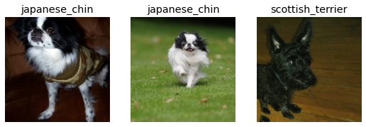
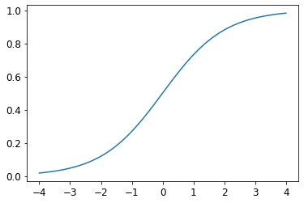
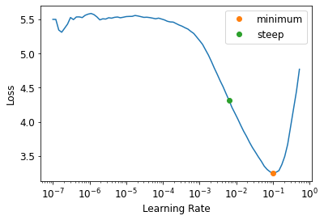
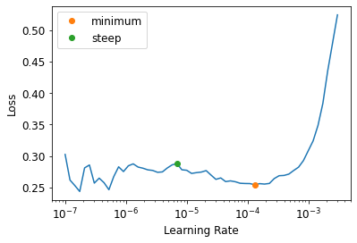
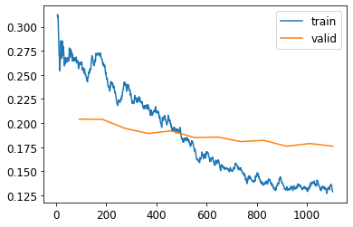

* [Image Classification](#image-classification)
* [From Dogs and Cats to Pet Breeds](#from-dogs-and-cats-to-pet-breeds)
* [Presizing](#presizing)
* [Cross-Entropy Loss](#cross-entropy-loss)
* [Model Interpretation](#model-interpretation)
* [Improving Our Model](#Improving Our Model)
* [References](#references)


## Image Classification
- There are a lot of details you need to get right for your models to be accurate and reliable
- You must be able to look inside your neural network as it trains and as it makes predictions, find possible problems and know how to fix them


## From Dogs and Cats to Pet Breeds

- In real-life
    1. start with a dataset that we know nothing about
    2. figure out how it is put together
    3. figure out how to extract the data we need from it
    4. figure out what the data looks like
- Data is usually provided in one of two ways
    - Individual files representing items of data, possibly organized into folder or with filenames representing information about those items
        - text documents
        - images
    - A table of data in which each row is an item and may include filenames providing connections between the data in the table and data in other formats
        - CSV files
    - Exceptions:
        - Domains like Genomics
            - binary database formats
            - network streams

```python
from fastai.vision.all import *
matplotlib.rc('image', cmap='Greys')
```

#### The Oxford-IIIT Pet Dataset

* [https://www.robots.ox.ac.uk/~vgg/data/pets/](https://www.robots.ox.ac.uk/~vgg/data/pets/)
* a 37 category pet dataset with roughly 200 images for each class
* images have a large variations in scale, pose and lighting
* all images have an associated ground truth annotation of breed, head ROI, and pixel level trimap segmentation

-----
```python
path = untar_data(URLs.PETS)
path
```
```text
Path('/home/innom-dt/.fastai/data/oxford-iiit-pet')
```

-----
```python
#hide
Path.BASE_PATH = path
path
```
```text
Path('.')
```

-----
```python
path.ls()
```
```text
(#2) [Path('images'),Path('annotations')]
```

-----
```python
# associated ground truth annotation of breed, head ROI, and pixel level trimap segmentation
# Not needed for classification
(path/"annotations").ls()
```
```text
(#7) [Path('annotations/trimaps'),Path('annotations/xmls'),Path('annotations/._trimaps'),Path('annotations/list.txt'),Path('annotations/test.txt'),Path('annotations/README'),Path('annotations/trainval.txt')]
```

-----
```python
(path/"images").ls()
```
```text
(#7393) [Path('images/Birman_121.jpg'),Path('images/shiba_inu_131.jpg'),Path('images/Bombay_176.jpg'),Path('images/Bengal_199.jpg'),Path('images/beagle_41.jpg'),Path('images/beagle_27.jpg'),Path('images/great_pyrenees_181.jpg'),Path('images/Bengal_100.jpg'),Path('images/keeshond_124.jpg'),Path('images/havanese_115.jpg')...]
```

Pet breed and species is indicated in the file name for each image
* Cat breeds have capitalized file names and dog breeds have lowercase file names

-----
```python
fname = (path/"images").ls()[0]
fname
```
```text
Path('images/Birman_121.jpg')
```


### Regular Expressions

- a special string written in the regular expression language, which specifies a general rule for deciding whether another string passes a test
- extremely useful for pattern matching and extracting sections of text
- [Python Regular Expressions Cheat Sheet](https://www.dataquest.io/wp-content/uploads/2019/03/python-regular-expressions-cheat-sheet.pdf)
- Origin:
    - originally examples of a “regular” language
        - the lowest rung within the [Chomsky hierarchy](https://en.wikipedia.org/wiki/Chomsky_hierarchy#The_hierarchy)
    - [Chomsky hierarchy](https://en.wikipedia.org/wiki/Chomsky_hierarchy)
        - a grammar classification developed by linguist [Noam Chomsky](https://en.wikipedia.org/wiki/Noam_Chomsky)
    - [Noam Chomsky](https://en.wikipedia.org/wiki/Noam_Chomsky)
        - also wrote [Syntactic Structures](https://en.wikipedia.org/wiki/Syntactic_Structures) ([pdf](https://tallinzen.net/media/readings/chomsky_syntactic_structures.pdf))
            - the pioneering work searching for the formal grammar underlying human language

-----
```python
# Matches all instances of any group of characters before a sequence of digits right before '.jpg'
re.findall(r'(.+)_\d+.jpg$', fname.name)
```
```text
['Birman']
```

#### fastai RegexLabeller:

* [https://docs.fast.ai/data.transforms.html#RegexLabeller](https://docs.fast.ai/data.transforms.html#RegexLabeller)
* label items using a regular expression pattern

```python
RegexLabeller
```
```text
fastai.data.transforms.RegexLabeller
```

-----
```python
get_image_files
```
```text
<function fastai.data.transforms.get_image_files(path, recurse=True, folders=None)>
```

-----
```python
pets = DataBlock(blocks = (ImageBlock, CategoryBlock),
                 get_items=get_image_files, 
                 splitter=RandomSplitter(seed=42),
                 get_y=using_attr(RegexLabeller(r'(.+)_\d+.jpg$'), 'name'),
                 item_tfms=Resize(460),
                 batch_tfms=aug_transforms(size=224, min_scale=0.75))
dls = pets.dataloaders(path/"images")
```

-----
```python
dls.c
```
```text
37
```

-----
```python
import pandas as pd
```

#### fastai Categorize:

* [https://docs.fast.ai/data.transforms.html#Categorize](https://docs.fast.ai/data.transforms.html#Categorize)
* reversible transform of a category string to a vocab id
* inherits from DisplayedTransform

#### fastai DisplayedTransform

* [https://fastcore.fast.ai/transform#DisplayedTransform](https://fastcore.fast.ai/transform#DisplayedTransform)
* A transform that shows its attributes

-----

```python
pd.DataFrame(dls.categorize.vocab)
```
<div style="overflow-x:auto;">
<table border="1" class="dataframe">
  <thead>
    <tr style="text-align: right;">
      <th></th>
      <th>0</th>
    </tr>
  </thead>
  <tbody>
    <tr>
      <th>0</th>
      <td>Abyssinian</td>
    </tr>
    <tr>
      <th>1</th>
      <td>Bengal</td>
    </tr>
    <tr>
      <th>2</th>
      <td>Birman</td>
    </tr>
    <tr>
      <th>3</th>
      <td>Bombay</td>
    </tr>
    <tr>
      <th>4</th>
      <td>British_Shorthair</td>
    </tr>
    <tr>
      <th>5</th>
      <td>Egyptian_Mau</td>
    </tr>
    <tr>
      <th>6</th>
      <td>Maine_Coon</td>
    </tr>
    <tr>
      <th>7</th>
      <td>Persian</td>
    </tr>
    <tr>
      <th>8</th>
      <td>Ragdoll</td>
    </tr>
    <tr>
      <th>9</th>
      <td>Russian_Blue</td>
    </tr>
    <tr>
      <th>10</th>
      <td>Siamese</td>
    </tr>
    <tr>
      <th>11</th>
      <td>Sphynx</td>
    </tr>
    <tr>
      <th>12</th>
      <td>american_bulldog</td>
    </tr>
    <tr>
      <th>13</th>
      <td>american_pit_bull_terrier</td>
    </tr>
    <tr>
      <th>14</th>
      <td>basset_hound</td>
    </tr>
    <tr>
      <th>15</th>
      <td>beagle</td>
    </tr>
    <tr>
      <th>16</th>
      <td>boxer</td>
    </tr>
    <tr>
      <th>17</th>
      <td>chihuahua</td>
    </tr>
    <tr>
      <th>18</th>
      <td>english_cocker_spaniel</td>
    </tr>
    <tr>
      <th>19</th>
      <td>english_setter</td>
    </tr>
    <tr>
      <th>20</th>
      <td>german_shorthaired</td>
    </tr>
    <tr>
      <th>21</th>
      <td>great_pyrenees</td>
    </tr>
    <tr>
      <th>22</th>
      <td>havanese</td>
    </tr>
    <tr>
      <th>23</th>
      <td>japanese_chin</td>
    </tr>
    <tr>
      <th>24</th>
      <td>keeshond</td>
    </tr>
    <tr>
      <th>25</th>
      <td>leonberger</td>
    </tr>
    <tr>
      <th>26</th>
      <td>miniature_pinscher</td>
    </tr>
    <tr>
      <th>27</th>
      <td>newfoundland</td>
    </tr>
    <tr>
      <th>28</th>
      <td>pomeranian</td>
    </tr>
    <tr>
      <th>29</th>
      <td>pug</td>
    </tr>
    <tr>
      <th>30</th>
      <td>saint_bernard</td>
    </tr>
    <tr>
      <th>31</th>
      <td>samoyed</td>
    </tr>
    <tr>
      <th>32</th>
      <td>scottish_terrier</td>
    </tr>
    <tr>
      <th>33</th>
      <td>shiba_inu</td>
    </tr>
    <tr>
      <th>34</th>
      <td>staffordshire_bull_terrier</td>
    </tr>
    <tr>
      <th>35</th>
      <td>wheaten_terrier</td>
    </tr>
    <tr>
      <th>36</th>
      <td>yorkshire_terrier</td>
    </tr>
  </tbody>
</table>
</div>


## Presizing

- we need our images to have the same dimensions before we collate them into tensors
- we should compose our augmentation transforms into fewer transformations and transform the images into uniform sizes

### Steps for presizing

1. Resize images to relatively “large” dimensions compared to the target training dimensions
    - Larger images have some spare margin for augmentations that might result in empty zones in the image
    - augmented images are then cropped and resized to a square
        - the crop area is chosen randomly on the training set
2. Compose all the common augmentation operations into one, and perform a combined operation on the GPU
    - all potentially destructive operations are performed together with a single interpolation at the end


```python
dblock1 = DataBlock(blocks=(ImageBlock(), CategoryBlock()),
                   get_y=parent_label,
                   item_tfms=Resize(460))
```

-----
```python
(Path.cwd()/'images'/'grizzly.jpg')
```
```text
Path('/media/innom-dt/Samsung_T3/Projects/Current_Projects/fastbook/clean/images/grizzly.jpg')
```

-----
```python
# Create a test DataLoaders object with 100 copies of the same image
dls1 = dblock1.dataloaders([(Path.cwd()/'images'/'grizzly.jpg')]*100, bs=8)
print(len(dls1.items))
print(dls1.categorize.vocab)
```
```text
80
['images']
```


-----
```python
# Return elements from the iterable until it is exhausted.
dls1.train.get_idxs = lambda: Inf.ones
```

#### itertools.cycle()

* [https://docs.python.org/3/library/itertools.html#itertools.cycle](https://docs.python.org/3/library/itertools.html#itertools.cycle)
* Make an iterator returning elements from the iterable and saving a copy of each

-----
```python
type(Inf.ones)
```
```text
itertools.cycle
```

#### fastai DataLoader.one_batch:

* [https://github.com/fastai/fastai/blob/d84b426e2afe17b3af09b33f49c77bd692625f0d/fastai/data/load.py#L146](https://github.com/fastai/fastai/blob/d84b426e2afe17b3af09b33f49c77bd692625f0d/fastai/data/load.py#L146)
* Return one batch from `DataLoader`

-----

```python
DataLoader.one_batch
```
```text
<function fastai.data.load.DataLoader.one_batch(self)>
```

-----
```python
x,y = dls1.one_batch()
print(x.shape)
print(y.shape)
print(y)
```
```text
torch.Size([8, 3, 460, 460])
torch.Size([8])
TensorCategory([0, 0, 0, 0, 0, 0, 0, 0], device='cuda:0')
```

-----

```python
print(TensorImage)
```
```text
<class 'fastai.torch_core.TensorImage'>
```

#### fastai TensorImage:

* [https://docs.fast.ai/torch_core.html#TensorImage](https://docs.fast.ai/torch_core.html#TensorImage)
* A Tensor which support subclass pickling, and maintains metadata when casting or after methods

#### TensorImage.affine_coord:

* [https://docs.fast.ai/vision.augment.html#AffineCoordTfm](https://docs.fast.ai/vision.augment.html#AffineCoordTfm)
* [https://github.com/fastai/fastai/blob/d84b426e2afe17b3af09b33f49c77bd692625f0d/fastai/vision/augment.py#L310](https://github.com/fastai/fastai/blob/d84b426e2afe17b3af09b33f49c77bd692625f0d/fastai/vision/augment.py#L310)

#### TensorImage.rotate:

* [https://docs.fast.ai/vision.augment.html#Rotate](https://docs.fast.ai/vision.augment.html#Rotate)
* [https://github.com/fastai/fastai/blob/d84b426e2afe17b3af09b33f49c77bd692625f0d/fastai/vision/augment.py#L549](https://github.com/fastai/fastai/blob/d84b426e2afe17b3af09b33f49c77bd692625f0d/fastai/vision/augment.py#L549)

#### TensorImage.zoom:

* [https://docs.fast.ai/vision.augment.html#Zoom](https://docs.fast.ai/vision.augment.html#Zoom)
* [https://github.com/fastai/fastai/blob/d84b426e2afe17b3af09b33f49c77bd692625f0d/fastai/vision/augment.py#L582](https://github.com/fastai/fastai/blob/d84b426e2afe17b3af09b33f49c77bd692625f0d/fastai/vision/augment.py#L582)

#### TensorImage.warp:

* [https://docs.fast.ai/vision.augment.html#Warp](https://docs.fast.ai/vision.augment.html#Warp)
* [https://github.com/fastai/fastai/blob/d84b426e2afe17b3af09b33f49c77bd692625f0d/fastai/vision/augment.py#L656](https://github.com/fastai/fastai/blob/d84b426e2afe17b3af09b33f49c77bd692625f0d/fastai/vision/augment.py#L656)

-----
```python
print(TensorImage)
print(TensorImage.affine_coord)
print(TensorImage.rotate)
print(TensorImage.zoom)
print(TensorImage.warp)
```
```text
<class 'fastai.torch_core.TensorImage'>
<function TensorImage.affine_coord at 0x7fb370ba0940>
<function TensorImage.rotate at 0x7fb370ba8dc0>
<function TensorImage.zoom at 0x7fb370bb2160>
<function TensorImage.warp at 0x7fb370bb2820>
```

#### fastcore Pipeline:

* [https://fastcore.fast.ai/transform.html#Pipeline](https://fastcore.fast.ai/transform.html#Pipeline)
* A pipeline of composed (for encode/decode) transforms, setup with types
* a wrapper for [compose_tfms](https://fastcore.fast.ai/transform.html#compose_tfms)

-----

```python
Pipeline
```
```text
fastcore.transform.Pipeline
```

-----

```python
_,axs = subplots(1, 2)

x1 = TensorImage(x.clone())
x1 = x1.affine_coord(sz=224)
x1 = x1.rotate(draw=30, p=1.)
x1 = x1.zoom(draw=1.2, p=1.)
x1 = x1.warp(draw_x=-0.2, draw_y=0.2, p=1.)

# Go through transforms and combine together affine/coord or lighting transforms
tfms = setup_aug_tfms([Rotate(draw=30, p=1, size=224), Zoom(draw=1.2, p=1., size=224),
                       Warp(draw_x=-0.2, draw_y=0.2, p=1., size=224)])
x = Pipeline(tfms)(x)
#x.affine_coord(coord_tfm=coord_tfm, sz=size, mode=mode, pad_mode=pad_mode)
TensorImage(x[0]).show(ctx=axs[0])
TensorImage(x1[0]).show(ctx=axs[1]);
```


### Checking and Debugging a DataBlock

- always check your data when creating a new DataBlock
    - make sure the augmentations work as intended
- once your data looks right, run it through a simple model
    - start getting feedback as soon as possible

```python
dls.show_batch(nrows=1, ncols=3)
```


-----

```python
pets1 = DataBlock(blocks = (ImageBlock, CategoryBlock),
                 get_items=get_image_files, 
                 splitter=RandomSplitter(seed=42),
                 get_y=using_attr(RegexLabeller(r'(.+)_\d+.jpg$'), 'name'))
```

#### DataBlock.summary():

* [https://docs.fast.ai/data.block.html#DataBlock.summary](https://docs.fast.ai/data.block.html#DataBlock.summary)
* Steps through the transform pipeline for one batch

-----

```python
DataBlock.summary
```
```v
<function fastai.data.block.DataBlock.summary(self: fastai.data.block.DataBlock, source, bs=4, show_batch=False, **kwargs)>
```

-----

```python
pets1.summary(path/"images")
```
```text
Setting-up type transforms pipelines
Collecting items from /home/innom-dt/.fastai/data/oxford-iiit-pet/images
Found 7390 items
2 datasets of sizes 5912,1478
Setting up Pipeline: PILBase.create
Setting up Pipeline: partial -> Categorize -- {'vocab': None, 'sort': True, 'add_na': False}

Building one sample
  Pipeline: PILBase.create
    starting from
      /home/innom-dt/.fastai/data/oxford-iiit-pet/images/great_pyrenees_182.jpg
    applying PILBase.create gives
      PILImage mode=RGB size=400x500
  Pipeline: partial -> Categorize -- {'vocab': None, 'sort': True, 'add_na': False}
    starting from
      /home/innom-dt/.fastai/data/oxford-iiit-pet/images/great_pyrenees_182.jpg
    applying partial gives
      great_pyrenees
    applying Categorize -- {'vocab': None, 'sort': True, 'add_na': False} gives
      TensorCategory(21)

Final sample: (PILImage mode=RGB size=400x500, TensorCategory(21))

Collecting items from /home/innom-dt/.fastai/data/oxford-iiit-pet/images
Found 7390 items
2 datasets of sizes 5912,1478
Setting up Pipeline: PILBase.create
Setting up Pipeline: partial -> Categorize -- {'vocab': None, 'sort': True, 'add_na': False}
Setting up after_item: Pipeline: ToTensor
Setting up before_batch: Pipeline: 
Setting up after_batch: Pipeline: IntToFloatTensor -- {'div': 255.0, 'div_mask': 1}

Building one batch
Applying item_tfms to the first sample:
  Pipeline: ToTensor
    starting from
      (PILImage mode=RGB size=400x500, TensorCategory(21))
    applying ToTensor gives
      (TensorImage of size 3x500x400, TensorCategory(21))

Adding the next 3 samples

No before_batch transform to apply

Collating items in a batch
Error! It's not possible to collate your items in a batch
Could not collate the 0-th members of your tuples because got the following shapes
torch.Size([3, 500, 400]),torch.Size([3, 334, 500]),torch.Size([3, 375, 500]),torch.Size([3, 500, 375])
```


-----
```python
learn = cnn_learner(dls, resnet34, metrics=error_rate)
learn.fine_tune(2)
```
<div style="overflow-x:auto;">
<table border="1" class="dataframe">
  <thead>
    <tr style="text-align: left;">
      <th>epoch</th>
      <th>train_loss</th>
      <th>valid_loss</th>
      <th>error_rate</th>
      <th>time</th>
    </tr>
  </thead>
  <tbody>
    <tr>
      <td>0</td>
      <td>1.530514</td>
      <td>0.347316</td>
      <td>0.115697</td>
      <td>00:19</td>
    </tr>
  </tbody>
</table>
<table border="1" class="dataframe">
  <thead>
    <tr style="text-align: left;">
      <th>epoch</th>
      <th>train_loss</th>
      <th>valid_loss</th>
      <th>error_rate</th>
      <th>time</th>
    </tr>
  </thead>
  <tbody>
    <tr>
      <td>0</td>
      <td>0.556219</td>
      <td>0.296193</td>
      <td>0.098782</td>
      <td>00:23</td>
    </tr>
    <tr>
      <td>1</td>
      <td>0.340186</td>
      <td>0.199035</td>
      <td>0.066982</td>
      <td>00:23</td>
    </tr>
  </tbody>
</table>
</div>


## Cross-Entropy Loss

- the combination of taking the softmax and then the log likelihood
- works even when our dependent variable has more than two categories
- results in faster and more reliable training

### Viewing Activations and Labels
```python
x,y = dls.one_batch()
```

-----
```python
y.shape
```
```text
torch.Size([64])
```

-----
```python
y
```
```text
TensorCategory([31, 30,  5, 17,  6,  7,  4, 22,  4, 27,  2, 19, 12, 14, 11,  8,  5, 26, 14, 11, 28, 25, 35,  4, 22, 36, 31,  9, 27, 20, 23, 33,  2, 27,  0, 18, 12, 22, 17, 21, 25, 13, 16, 15, 33, 14, 20, 15,
         8, 18, 36, 32,  7, 26,  4, 20, 36, 14, 25, 32,  4, 14, 25, 17], device='cuda:0')
```

#### Learner.get_preds:

* [https://docs.fast.ai/learner.html#Learner.get_preds](https://docs.fast.ai/learner.html#Learner.get_preds)
* Get the predictions and targets using a dataset index or an iterator of batches

-----
```python
Learner.get_preds
```
```v
<function fastai.learner.Learner.get_preds(self, ds_idx=1, dl=None, with_input=False, with_decoded=False, with_loss=False, act=None, inner=False, reorder=True, cbs=None, save_preds=None, save_targs=None, concat_dim=0)>
```

-----
```python
preds,_ = learn.get_preds(dl=[(x,y)])
preds[0]
```
```text
TensorBase([2.8917e-05, 1.6130e-08, 3.2022e-04, 1.7541e-05, 1.5420e-05, 3.5346e-06, 7.1617e-06, 1.0242e-04, 4.3236e-05, 7.5608e-05, 3.9862e-05, 7.9690e-07, 7.0372e-07, 4.5139e-08, 2.7499e-06, 4.2070e-06,
        9.9794e-08, 1.6574e-06, 4.6330e-07, 5.7135e-06, 8.5598e-07, 8.1175e-02, 7.1706e-05, 1.1809e-05, 7.3426e-05, 9.2441e-06, 7.5984e-07, 2.6505e-06, 1.1533e-04, 4.2089e-07, 4.4916e-06, 9.1771e-01,
        3.1806e-06, 7.8490e-06, 4.9332e-07, 1.4727e-04, 3.1404e-07])
```

-----
```python
len(preds[0]),preds[0].sum()
```
```text
(37, TensorBase(1.0000))
```


### Softmax

- $\text{Softmax}(x_{i}) = \frac{\exp(x_i)}{\sum_j \exp(x_j)}$
- takes in an n-dimensional input Tensor and rescales them so that the elements are all in the range `[0,1]` and sum to 1.
- the multi-category equivalent of sigmoid
- slightly bigger activation values are amplified, making the highest value closer to `1`
- the first part of cross-entropy loss
- ideal for when we know each image has a definite correct label
    - during training
- less ideal if we want our model to tell us it does not recognize what is in the image
    - during inference
    - might be better to use multiple binary output columns, each using a sigmoid activation

```python
plot_function(torch.sigmoid, min=-4,max=4)
```


-----
```python
# set random seed to get same results across sessions
torch.random.manual_seed(42);
```

-----
```python
# Create a random set of test activations for a binary classification problem
acts = torch.randn((6,2))*2
acts
```
```text
tensor([[ 0.6734,  0.2576],
        [ 0.4689,  0.4607],
        [-2.2457, -0.3727],
        [ 4.4164, -1.2760],
        [ 0.9233,  0.5347],
        [ 1.0698,  1.6187]])
```

-----
```python
acts.sigmoid()
```
```v
tensor([[0.6623, 0.5641],
        [0.6151, 0.6132],
        [0.0957, 0.4079],
        [0.9881, 0.2182],
        [0.7157, 0.6306],
        [0.7446, 0.8346]])
```

-----
```python
(acts[:,0]-acts[:,1]).sigmoid()
```
```text
tensor([0.6025, 0.5021, 0.1332, 0.9966, 0.5959, 0.3661])
```

$\text{Softmax}(x_{i}) = \frac{\exp(x_i)}{\sum_j \exp(x_j)}$

-----
```python
def softmax(x): return 2.718**x / (2.718**x).sum(dim=1, keepdim=True)
softmax(acts)
```
```text
tensor([[0.6025, 0.3975],
        [0.5021, 0.4979],
        [0.1332, 0.8668],
        [0.9966, 0.0034],
        [0.5959, 0.4041],
        [0.3661, 0.6339]])
```

-----
```python
print(softmax(acts)[0])
softmax(acts)[0].sum()
```
```text
tensor([0.6025, 0.3975])
tensor(1.)
```

#### torch.softmax

* [https://pytorch.org/docs/stable/generated/torch.nn.Softmax.html](https://pytorch.org/docs/stable/generated/torch.nn.Softmax.html)
* Applies the Softmax function to an n-dimensional input Tensor rescaling them so that the elements of the n-dimensional output Tensor lie in the range [0,1] and sum to 1.

-----
```python
torch.softmax
```
```text
<function _VariableFunctionsClass.softmax>
```

-----
```python
sm_acts = torch.softmax(acts, dim=1)
sm_acts
```
```text
tensor([[0.6025, 0.3975],
        [0.5021, 0.4979],
        [0.1332, 0.8668],
        [0.9966, 0.0034],
        [0.5959, 0.4041],
        [0.3661, 0.6339]])
```


### Log Likelihood

$y_{i} = \log_{e}{x_{i}}$

$\log{(a*b)} = \log{(a)} + \log{(b)}$

- logarithms increase linearly when the underlying signal increases exponentially or multiplicatively
- means multiplication can be replaced with addition, which is easier for working with very larger or very small numbers

The gradient of `cross_entropy(a,b)` is `softmax(a)-b` 

- the gradient is proportional to the difference between the prediction and the target
    - the same as mean squared error in regression, since the gradient of `(a-b)**2 is 2*(a-b)`
    - since the gradient is linear, we will not see any sudden jumps or exponential increases in gradients

```python
# Sample labels for testing
targ = tensor([0,1,0,1,1,0])
```

-----
```python
sm_acts
```
```text
tensor([[0.6025, 0.3975],
        [0.5021, 0.4979],
        [0.1332, 0.8668],
        [0.9966, 0.0034],
        [0.5959, 0.4041],
        [0.3661, 0.6339]])
```

-----
```python
idx = range(6)
sm_acts[idx, targ]
```
```text
tensor([0.6025, 0.4979, 0.1332, 0.0034, 0.4041, 0.3661])
```

-----
```python
df = pd.DataFrame(sm_acts, columns=["3","7"])
df['targ'] = targ
df['idx'] = idx
df['loss'] = sm_acts[range(6), targ]
df
```
<div style="overflow-x:auto;">
<table border="1" class="dataframe">
  <thead>
    <tr style="text-align: right;">
      <th></th>
      <th>3</th>
      <th>7</th>
      <th>targ</th>
      <th>idx</th>
      <th>loss</th>
    </tr>
  </thead>
  <tbody>
    <tr>
      <th>0</th>
      <td>0.602469</td>
      <td>0.397531</td>
      <td>0</td>
      <td>0</td>
      <td>0.602469</td>
    </tr>
    <tr>
      <th>1</th>
      <td>0.502065</td>
      <td>0.497935</td>
      <td>1</td>
      <td>1</td>
      <td>0.497935</td>
    </tr>
    <tr>
      <th>2</th>
      <td>0.133188</td>
      <td>0.866811</td>
      <td>0</td>
      <td>2</td>
      <td>0.133188</td>
    </tr>
    <tr>
      <th>3</th>
      <td>0.996640</td>
      <td>0.003360</td>
      <td>1</td>
      <td>3</td>
      <td>0.003360</td>
    </tr>
    <tr>
      <th>4</th>
      <td>0.595949</td>
      <td>0.404051</td>
      <td>1</td>
      <td>4</td>
      <td>0.404051</td>
    </tr>
    <tr>
      <th>5</th>
      <td>0.366118</td>
      <td>0.633882</td>
      <td>0</td>
      <td>5</td>
      <td>0.366118</td>
    </tr>
  </tbody>
</table>
</div>


-----
```python
-sm_acts[idx, targ]
```
```text
tensor([-0.6025, -0.4979, -0.1332, -0.0034, -0.4041, -0.3661])
```


#### F.nll_loss

* [https://pytorch.org/docs/stable/generated/torch.nn.functional.nll_loss.html#torch.nn.functional.nll_loss](https://pytorch.org/docs/stable/generated/torch.nn.functional.nll_loss.html#torch.nn.functional.nll_loss)
* The negative log likelihood (nll) loss.
* does not actually take the log, because it assumes you have already taken the log
* designed to be used after [log_softmax](https://pytorch.org/docs/stable/generated/torch.nn.functional.log_softmax.html#torch-nn-functional-log-softmax)


```python
F.nll_loss
```
```text
<function torch.nn.functional.nll_loss(input: torch.Tensor, target: torch.Tensor, weight: Optional[torch.Tensor] = None, size_average: Optional[bool] = None, ignore_index: int = -100, reduce: Optional[bool] = None, reduction: str = 'mean') -> torch.Tensor>
```

-----
```python
F.nll_loss(sm_acts, targ, reduction='none')
```
```text
tensor([-0.6025, -0.4979, -0.1332, -0.0034, -0.4041, -0.3661])
```


### Taking the Log

#### torch.log

* [https://pytorch.org/docs/stable/generated/torch.log.html](https://pytorch.org/docs/stable/generated/torch.log.html)
* Returns a new tensor with the natural logarithm of the elements of input.
* $y_{i} = \log_{e}{(x_{i})}$
* $e = 2.718$

-----
```python
torch.log
```
```text
<function _VariableFunctionsClass.log>
```

-----
```python
plot_function(torch.log, min=0,max=4)
```


#### nn.CrossEntropyLoss

* [https://pytorch.org/docs/stable/generated/torch.nn.CrossEntropyLoss.html#torch.nn.CrossEntropyLoss](https://pytorch.org/docs/stable/generated/torch.nn.CrossEntropyLoss.html#torch.nn.CrossEntropyLoss)
* computes the cross entropy loss between input and target
* takes the mean of the loss of all items by default
    * can be disabled with `reduction='none'`

-----
```python
loss_func = nn.CrossEntropyLoss()
```

-----
```python
loss_func(acts, targ)
```
```text
tensor(1.8045)
```

-----
```python
F.cross_entropy(acts, targ)
```
```text
tensor(1.8045)
```

-----
```python
-torch.log(-F.nll_loss(sm_acts, targ, reduction='none'))
```
```text
tensor([0.5067, 0.6973, 2.0160, 5.6958, 0.9062, 1.0048])
```

-----
```python
# Do not take the mean
nn.CrossEntropyLoss(reduction='none')(acts, targ)
```
```text
tensor([0.5067, 0.6973, 2.0160, 5.6958, 0.9062, 1.0048])
```


## Model Interpretation
- It is very hard to interpret loss functions directly as they are optimized for differentiation and optimization, not human consumption

#### ClassificationInterpretation
* [https://docs.fast.ai/interpret.html#Interpretation](https://docs.fast.ai/interpret.html#Interpretation)
* Interpretation base class for exploring predictions from trained models

#### ClassificationInterpretation.from_learner
* [https://docs.fast.ai/interpret.html#Interpretation.from_learner](https://docs.fast.ai/interpret.html#Interpretation.from_learner)
* Construct interpretation object from a learner

-----
```python
ClassificationInterpretation
```
```text
fastai.interpret.ClassificationInterpretation
```

-----
```python
interp = ClassificationInterpretation.from_learner(learn)
interp.plot_confusion_matrix(figsize=(12,12), dpi=60)
```


-----
```python
interp.most_confused(min_val=4)
```
```text
[('Birman', 'Ragdoll', 4),
 ('Ragdoll', 'Birman', 4),
 ('Siamese', 'Birman', 4),
 ('american_pit_bull_terrier', 'staffordshire_bull_terrier', 4)]
```


## Improving Our Model
### The Learning Rate Finder
- picking the right learning rate is one of the most important things we can doe when training a model
    - a learning rate that is too small can take many, many epochs, increasing both training time and the risk of overfitting
    - a learning rate that is too big can prevent the model from improving at all
- Naval researcher, Leslie Smith, came up with the idea of a learning rate finder in 2015
    1. start with a very, very small learning rate
    2. use the small learning rate for one mini-batch
    3. find what the losses are after that one mini-batch
    4. increase the learning rate by a certain percentage
    5. repeat steps 2-4 until the loss gets worse
    6. select a learning rate that is a bit lower than the highest useful learning rate
        - Either one order of magnitude less than where the minimum loss was achieved or the last point where the loss was clearly decreasing

```python
# Test using a very high learning rate
learn = cnn_learner(dls, resnet34, metrics=error_rate)
learn.fine_tune(1, base_lr=0.1)
```
<div style="overflow-x:auto;">
<table border="1" class="dataframe">
  <thead>
    <tr style="text-align: left;">
      <th>epoch</th>
      <th>train_loss</th>
      <th>valid_loss</th>
      <th>error_rate</th>
      <th>time</th>
    </tr>
  </thead>
  <tbody>
    <tr>
      <td>0</td>
      <td>2.648785</td>
      <td>4.358732</td>
      <td>0.443843</td>
      <td>00:19</td>
    </tr>
  </tbody>
</table>
<table border="1" class="dataframe">
  <thead>
    <tr style="text-align: left;">
      <th>epoch</th>
      <th>train_loss</th>
      <th>valid_loss</th>
      <th>error_rate</th>
      <th>time</th>
    </tr>
  </thead>
  <tbody>
    <tr>
      <td>0</td>
      <td>4.398980</td>
      <td>3.214994</td>
      <td>0.839648</td>
      <td>00:23</td>
    </tr>
  </tbody>
</table>
</div>


Using a very high learning rate resulted in an increasing error rate

#### Learner.lr_find
* [https://docs.fast.ai/callback.schedule.html#Learner.lr_find](https://docs.fast.ai/callback.schedule.html#Learner.lr_find)
* Launch a mock training to find a good learning rate and return suggestions as a named tuple

```python
learn = cnn_learner(dls, resnet34, metrics=error_rate)
lr_min, lr_steep = learn.lr_find(suggest_funcs=(minimum, steep))
```



**Note:** The plot has a logarithmic scale

-----
```python
print(f"Minimum/10: {lr_min:.2e}, steepest point: {lr_steep:.2e}")
```
```text
Minimum/10: 1.00e-02, steepest point: 6.31e-03
```

-----

```python
lr_steep
```
```text
0.0063095735386013985
```

-----
```python
learn = cnn_learner(dls, resnet34, metrics=error_rate)
learn.fine_tune(2, base_lr=lr_steep)
```
<div style="overflow-x:auto;">
<table border="1" class="dataframe">
  <thead>
    <tr style="text-align: left;">
      <th>epoch</th>
      <th>train_loss</th>
      <th>valid_loss</th>
      <th>error_rate</th>
      <th>time</th>
    </tr>
  </thead>
  <tbody>
    <tr>
      <td>0</td>
      <td>1.086781</td>
      <td>0.335212</td>
      <td>0.107578</td>
      <td>00:19</td>
    </tr>
  </tbody>
</table>
<table border="1" class="dataframe">
  <thead>
    <tr style="text-align: left;">
      <th>epoch</th>
      <th>train_loss</th>
      <th>valid_loss</th>
      <th>error_rate</th>
      <th>time</th>
    </tr>
  </thead>
  <tbody>
    <tr>
      <td>0</td>
      <td>0.733380</td>
      <td>0.517203</td>
      <td>0.146143</td>
      <td>00:23</td>
    </tr>
    <tr>
      <td>1</td>
      <td>0.400132</td>
      <td>0.270925</td>
      <td>0.085250</td>
      <td>00:23</td>
    </tr>
  </tbody>
</table>
</div>

-----

```python
learn = cnn_learner(dls, resnet34, metrics=error_rate)
learn.fine_tune(2, base_lr=3e-3)
```
<div style="overflow-x:auto;">
<table border="1" class="dataframe">
  <thead>
    <tr style="text-align: left;">
      <th>epoch</th>
      <th>train_loss</th>
      <th>valid_loss</th>
      <th>error_rate</th>
      <th>time</th>
    </tr>
  </thead>
  <tbody>
    <tr>
      <td>0</td>
      <td>1.264121</td>
      <td>0.360774</td>
      <td>0.117727</td>
      <td>00:19</td>
    </tr>
  </tbody>
</table>
<table border="1" class="dataframe">
  <thead>
    <tr style="text-align: left;">
      <th>epoch</th>
      <th>train_loss</th>
      <th>valid_loss</th>
      <th>error_rate</th>
      <th>time</th>
    </tr>
  </thead>
  <tbody>
    <tr>
      <td>0</td>
      <td>0.544009</td>
      <td>0.415368</td>
      <td>0.131935</td>
      <td>00:23</td>
    </tr>
    <tr>
      <td>1</td>
      <td>0.332703</td>
      <td>0.216870</td>
      <td>0.066306</td>
      <td>00:23</td>
    </tr>
  </tbody>
</table>
</div>


### Unfreezing and Transfer Learning

- freezing: only updating the weights in newly added layers while leaving the rest of a pretrained model unchanged
- Process
    1. add new layers to pretrained model
    2. freeze pretrained layers
    3. train for a few epochs where only the new layers get updated
    4. unfreeze the pretrained layers
    5. train for a more epochs

#### Learner.fine_tune
* [https://docs.fast.ai/callback.schedule.html#Learner.fine_tune](https://docs.fast.ai/callback.schedule.html#Learner.fine_tune)
* Fine tune with Learner.freeze for freeze_epochs, then with Learner.unfreeze for epochs, using discriminative LR.

-----
```python
Learner.fine_tune
```
```text
<function fastai.callback.schedule.Learner.fine_tune(self: fastai.learner.Learner, epochs, base_lr=0.002, freeze_epochs=1, lr_mult=100, pct_start=0.3, div=5.0, lr_max=None, div_final=100000.0, wd=None, moms=None, cbs=None, reset_opt=False)>
```

-----
```python
learn = cnn_learner(dls, resnet34, metrics=error_rate)
# Train new layers for 3 epochs
learn.fit_one_cycle(3, 3e-3)
```
<div style="overflow-x:auto;">
<table border="1" class="dataframe">
  <thead>
    <tr style="text-align: left;">
      <th>epoch</th>
      <th>train_loss</th>
      <th>valid_loss</th>
      <th>error_rate</th>
      <th>time</th>
    </tr>
  </thead>
  <tbody>
    <tr>
      <td>0</td>
      <td>1.154504</td>
      <td>0.279982</td>
      <td>0.083897</td>
      <td>00:19</td>
    </tr>
    <tr>
      <td>1</td>
      <td>0.528465</td>
      <td>0.244664</td>
      <td>0.079161</td>
      <td>00:19</td>
    </tr>
    <tr>
      <td>2</td>
      <td>0.313210</td>
      <td>0.205661</td>
      <td>0.066306</td>
      <td>00:19</td>
    </tr>
  </tbody>
</table>
</div>


#### Learner.unfreeze()
* [https://docs.fast.ai/learner.html#Learner.unfreeze](https://docs.fast.ai/learner.html#Learner.unfreeze)
* Unfreeze the entire model
```python
learn.unfreeze()
```
-----

```python
lr_min, lr_steep = learn.lr_find(suggest_funcs=(minimum, steep))
```


-----
```python
lr_min
```
```text
1.3182566908653825e-05
```

-----

```python
lr_steep
```
```text
6.918309736647643e-06
```

-----
```python
learn.fit_one_cycle(6, lr_max=1e-5)
```
<div style="overflow-x:auto;">
<table border="1" class="dataframe">
  <thead>
    <tr style="text-align: left;">
      <th>epoch</th>
      <th>train_loss</th>
      <th>valid_loss</th>
      <th>error_rate</th>
      <th>time</th>
    </tr>
  </thead>
  <tbody>
    <tr>
      <td>0</td>
      <td>0.280055</td>
      <td>0.198210</td>
      <td>0.065629</td>
      <td>00:23</td>
    </tr>
    <tr>
      <td>1</td>
      <td>0.259113</td>
      <td>0.193244</td>
      <td>0.066306</td>
      <td>00:24</td>
    </tr>
    <tr>
      <td>2</td>
      <td>0.228144</td>
      <td>0.190782</td>
      <td>0.063599</td>
      <td>00:24</td>
    </tr>
    <tr>
      <td>3</td>
      <td>0.209694</td>
      <td>0.186441</td>
      <td>0.064276</td>
      <td>00:24</td>
    </tr>
    <tr>
      <td>4</td>
      <td>0.203076</td>
      <td>0.189319</td>
      <td>0.064276</td>
      <td>00:23</td>
    </tr>
    <tr>
      <td>5</td>
      <td>0.180903</td>
      <td>0.186041</td>
      <td>0.062246</td>
      <td>00:23</td>
    </tr>
  </tbody>
</table>
</div>


### Discriminative Learning Rates

- the earliest layers our pretrained model might not need as a high of a learning rate as the last ones
- based on insights developed by Jason Yosinski et al.
    - [How transferable are features in deep neural networks?](https://arxiv.org/pdf/1411.1792.pdf)
    - showed that with transfer learning, different layers of a neural network should train at different speeds

-----
```python
learn = cnn_learner(dls, resnet34, metrics=error_rate)
learn.fit_one_cycle(3, 3e-3)
learn.unfreeze()
# Set the learning rate for the earliest layer to 1e-6
# Set the learning rate for the last layer to 1e-4
# Scale the learning rate for the in-between layers to gradually increase from 1e-6 up to 1e-4
learn.fit_one_cycle(12, lr_max=slice(1e-6,1e-4))
```
<div style="overflow-x:auto;">
<table border="1" class="dataframe">
  <thead>
    <tr style="text-align: left;">
      <th>epoch</th>
      <th>train_loss</th>
      <th>valid_loss</th>
      <th>error_rate</th>
      <th>time</th>
    </tr>
  </thead>
  <tbody>
    <tr>
      <td>0</td>
      <td>1.158203</td>
      <td>0.300560</td>
      <td>0.092693</td>
      <td>00:19</td>
    </tr>
    <tr>
      <td>1</td>
      <td>0.516345</td>
      <td>0.242830</td>
      <td>0.073072</td>
      <td>00:19</td>
    </tr>
    <tr>
      <td>2</td>
      <td>0.335896</td>
      <td>0.207630</td>
      <td>0.065629</td>
      <td>00:19</td>
    </tr>
  </tbody>
</table>
<table border="1" class="dataframe">
  <thead>
    <tr style="text-align: left;">
      <th>epoch</th>
      <th>train_loss</th>
      <th>valid_loss</th>
      <th>error_rate</th>
      <th>time</th>
    </tr>
  </thead>
  <tbody>
    <tr>
      <td>0</td>
      <td>0.257385</td>
      <td>0.204113</td>
      <td>0.068336</td>
      <td>00:23</td>
    </tr>
    <tr>
      <td>1</td>
      <td>0.266140</td>
      <td>0.203935</td>
      <td>0.065629</td>
      <td>00:23</td>
    </tr>
    <tr>
      <td>2</td>
      <td>0.240853</td>
      <td>0.194436</td>
      <td>0.060893</td>
      <td>00:23</td>
    </tr>
    <tr>
      <td>3</td>
      <td>0.218652</td>
      <td>0.189227</td>
      <td>0.062246</td>
      <td>00:23</td>
    </tr>
    <tr>
      <td>4</td>
      <td>0.196062</td>
      <td>0.192026</td>
      <td>0.063599</td>
      <td>00:24</td>
    </tr>
    <tr>
      <td>5</td>
      <td>0.173631</td>
      <td>0.184970</td>
      <td>0.060217</td>
      <td>00:23</td>
    </tr>
    <tr>
      <td>6</td>
      <td>0.159832</td>
      <td>0.185538</td>
      <td>0.061570</td>
      <td>00:23</td>
    </tr>
    <tr>
      <td>7</td>
      <td>0.151429</td>
      <td>0.180841</td>
      <td>0.061570</td>
      <td>00:23</td>
    </tr>
    <tr>
      <td>8</td>
      <td>0.136421</td>
      <td>0.182115</td>
      <td>0.062246</td>
      <td>00:23</td>
    </tr>
    <tr>
      <td>9</td>
      <td>0.133766</td>
      <td>0.175982</td>
      <td>0.058187</td>
      <td>00:24</td>
    </tr>
    <tr>
      <td>10</td>
      <td>0.133599</td>
      <td>0.178821</td>
      <td>0.056834</td>
      <td>00:24</td>
    </tr>
    <tr>
      <td>11</td>
      <td>0.128872</td>
      <td>0.176038</td>
      <td>0.058863</td>
      <td>00:24</td>
    </tr>
  </tbody>
</table>
</div>

-----

```python
learn.recorder.plot_loss()
```



**Note:** Accuracy may continue to improve, even when the validation loss starts to get worse
* validation loss can get worse when your model gets overconfident, not just when it starts to memorize the training data


### Selecting the Number of Epochs

- you will often find that you are limited by time, rather than generalization and accuracy
1. you should start with picking a number of epochs that will train in the amount of time that you are happy to wait for
2. then look at the training and validation loss plots, and your metrics
3. you will know that you have not trained for too long if they are still getting better even in your final epochs


### Deeper Architectures

- a model with more parameters can generally model your data more accurately
    - lots of caveats to this generalization
    - depends on the specifics of the architectures you are using
    - try a smaller model first
- more likely to suffer from overfitting
- requires more GPU memory
    - might need to lower the batch size
- take longer to train

#### Learner.to_fp16
* [https://docs.fast.ai/callback.fp16.html#Learner.to_fp16](https://docs.fast.ai/callback.fp16.html#Learner.to_fp16)
* [Mixed Precision Training](https://on-demand.gputechconf.com/gtc/2019/video/_/S9143/)

-----
```python
from fastai.callback.fp16 import *
learn = cnn_learner(dls, resnet50, metrics=error_rate).to_fp16()
learn.fine_tune(6, freeze_epochs=3)
```
<div style="overflow-x:auto;">
<table border="1" class="dataframe">
  <thead>
    <tr style="text-align: left;">
      <th>epoch</th>
      <th>train_loss</th>
      <th>valid_loss</th>
      <th>error_rate</th>
      <th>time</th>
    </tr>
  </thead>
  <tbody>
    <tr>
      <td>0</td>
      <td>1.251300</td>
      <td>0.289129</td>
      <td>0.081867</td>
      <td>00:18</td>
    </tr>
    <tr>
      <td>1</td>
      <td>0.567936</td>
      <td>0.275442</td>
      <td>0.083221</td>
      <td>00:18</td>
    </tr>
    <tr>
      <td>2</td>
      <td>0.440096</td>
      <td>0.237322</td>
      <td>0.071719</td>
      <td>00:18</td>
    </tr>
  </tbody>
</table>
<table border="1" class="dataframe">
  <thead>
    <tr style="text-align: left;">
      <th>epoch</th>
      <th>train_loss</th>
      <th>valid_loss</th>
      <th>error_rate</th>
      <th>time</th>
    </tr>
  </thead>
  <tbody>
    <tr>
      <td>0</td>
      <td>0.271949</td>
      <td>0.198495</td>
      <td>0.065629</td>
      <td>00:21</td>
    </tr>
    <tr>
      <td>1</td>
      <td>0.322747</td>
      <td>0.302487</td>
      <td>0.093369</td>
      <td>00:21</td>
    </tr>
    <tr>
      <td>2</td>
      <td>0.256723</td>
      <td>0.226659</td>
      <td>0.071042</td>
      <td>00:21</td>
    </tr>
    <tr>
      <td>3</td>
      <td>0.166247</td>
      <td>0.190719</td>
      <td>0.064953</td>
      <td>00:21</td>
    </tr>
    <tr>
      <td>4</td>
      <td>0.092291</td>
      <td>0.155199</td>
      <td>0.050744</td>
      <td>00:21</td>
    </tr>
    <tr>
      <td>5</td>
      <td>0.060924</td>
      <td>0.141513</td>
      <td>0.048038</td>
      <td>00:21</td>
    </tr>
  </tbody>
</table>
</div>


## References

* [Deep Learning for Coders with fastai & PyTorch](https://www.oreilly.com/library/view/deep-learning-for/9781492045519/)
* [The fastai book GitHub Repository](https://github.com/fastai/fastbook)