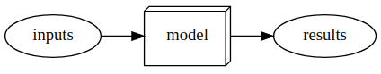

* [A Brief History of Neural Networks](#a-brief-history-of-neural-networks)
* [What is Machine Learning](#what-is-machine-learning)
* [References](#references)

## A Brief History of Neural Networks

### The Artificial Neuron

* Developed in 1943 by [Warren McCulloch](https://en.wikipedia.org/wiki/Warren_Sturgis_McCulloch), a neurophysiologist, and [Walter Pitts](https://en.wikipedia.org/wiki/Walter_Pitts), a logician
* A simplified model of a real neuron can be represented using simple addition and thresholding

- Original Paper: [A Logical Calculus of the Ideas Immanent in Nervous Activity](https://www.cs.cmu.edu/~./epxing/Class/10715/reading/McCulloch.and.Pitts.pdf)
    - Neural events and the relations among them can be treated by means of propositional logic due to the [“all-or-none”](https://en.wikipedia.org/wiki/All-or-none_law) character of nervous activity

### [Mark 1 Perceptron](https://en.wikipedia.org/wiki/Perceptron#History)

- The first device based on the principles of artificial neurons
- Designed for image recognition
  - Able to recognize simple shapes

- Developed by a psychologist named [Frank Rosenblatt](https://en.wikipedia.org/wiki/Frank_Rosenblatt)
  - Gave the artificial neuron the ability to learn
  - Invented the perceptron algorithm in 1958
  - Wrote The Design of an Intelligent Automaton

### [Perceptrons](https://en.wikipedia.org/wiki/Perceptrons_(book))

- Written by [Marvin Minsky](https://en.wikipedia.org/wiki/Marvin_Minsky), an MIT professor and [Seymour Papert](https://en.wikipedia.org/wiki/Seymour_Papert) in 1969
- Showed that a single layer of [Mark 1 Perceptron](https://en.wikipedia.org/wiki/Perceptron#History) devices was unable to learn some simple but critical math functions like [XOR](https://en.wikipedia.org/wiki/XOR_gate)
- Also showed this limitation could be addressed by using multiple layers
    - This solution was not widely recognized by the global academic community

### Parallel Distributed Processing (PDP)

* Written by [David Rumelhart](https://en.wikipedia.org/wiki/David_Rumelhart), [James McClelland](https://en.wikipedia.org/wiki/James_McClelland_(psychologist)), and the [PDP Research Group](https://mitpress.mit.edu/contributors/pdp-research-group)
  - Released in 1986 by MIT Press

- Perhaps the most pivotal work in neural networks in the last 50 years
- Posited that traditional computer programs work very differently from brains and that this might be why computer programs were so bad at doing things that brains find easy
- Authors claimed the PDP approach was closer to how the brain worked
- Laid out an approach that is very similar to today’s neural networks
- Defined parallel distributed processing as requiring the following:
    - A set of processing units
    - A state of activation
    - An output function for each unit
    - A pattern of connectivity among units
    - A propagation rule for propagating patterns of activities through the network of connectivities
    - An activation rule for combining the inputs impinging on a unit with the current state of the unit to produce an output for the unit
    - A learning rule whereby patterns of connectivity are modified by experience
    - An environment within which the system must operate
- Modern neural networks handle each of these requirements
- **Parallel distributed processing: Explorations in the microstructure of cognition**
    - [Volume 1](https://mitpress.mit.edu/books/parallel-distributed-processing-volume-1)
    - [Volume 2](https://mitpress.mit.edu/books/parallel-distributed-processing-volume-2)
    - [PDF Scans](https://stanford.edu/~jlmcc/papers/PDP/)

### 1980s-1990s

- Most models were built with a second layer of neurons
- Neural networks were used for real, practical projects
- A misunderstanding of the theoretical issues held back the field
    - In theory, two-layer models could approximate any mathematical function
    - In practice, multiple layers are needed to get good, practical performance

## What is Machine Learning

* another way to get computers to complete a desired task

### Traditional Programming

* Must explicitly code the exact instructions required to complete a task
  * Difficult when you do not know the exact steps

> A traditional program

### Machine Learning

* Must show the computer examples of the desired task and have it learn how to perform the task through experience

  * Difficult when you do not have sufficient data

* Invented by IBM researcher [Arthur Samuel](https://en.wikipedia.org/wiki/Arthur_Samuel) in 1949

  - Created a checkers-player program that beat the Connecticut state champion in 1961
  - Wrote “[Artificial Intelligence: A Frontier of Automation](https://journals.sagepub.com/doi/abs/10.1177/000271626234000103)” in 1962
    - Computers are giant morons and need to be told the exact steps required to solve a problem
    - Show the computer examples of the problem to solve and let if figure out how to solve it itself
    - Arrange some automatic means of testing the effectiveness of any current weight assignment and provide a mechanism so as to maximize the actual performance
    - Introduced multiple concepts
      - The idea of “weight assignment”
        - Weights are just variables
        - A weight assignment is a particular choice of values for those variables
        - Weight values define how the program will operate
      - The fact every weight assignment has some “actual performance”
        - How accurate is the image classifier?
        - How good is the checkers-player program at playing checkers?
      - The requirement there be an “automatic means” of testing that performance
        - Compare performance with the current weight values to the desired result
      - The need for a “mechanism” for improving the performance by changing the weight assignments
        - Update the weight values based on the performance with the current values

  

> A program using weight assignments

> Training a machine learning model

> Using a trained model as a program

### What is a Neural Network?

- A particular kind of machine learning model
- Flexible enough to solve a wide variety of problems just by finding the right weight values
- [Universal Approximation Theorem](https://en.wikipedia.org/wiki/Universal_approximation_theorem): shows that a neural network can, in theory, solve any problem to any level of accuracy
- [Stochastic Gradient Descent](https://en.wikipedia.org/wiki/Stochastic_gradient_descent): a general way to automatically update the weights of a neural network to make it improve at any given task

### Deep learning

- A computer science technique to extract and transform data by using multiple layers of neural networks
- Output from the previous layer serves as input for the next
- Each layer progressively refines their input
- A neural network learns to perform a specified task through training its layers using algorithms that minimize their errors and improve their accuracy

### Inherent Limitations of Machine Learning

- A model cannot be created without data
- A model can learn to operate on only the patterns seen in the input data used to train it
- This learning approach only creates predictions, not recommended actions
    - can result in a significant gap between organizational goals and model capabilities
- Need labels for each example input in the training data
- The way a model interacts with its environment can create feedback loops that amplify existing biases
    1. A predictive policing algorithm that is trained on data from past arrests will learn to predict arrests rather than to predict crime
    2. Law enforcement officers using the model might decide to focus policing activity in areas where previous arrests were made, resulting in more arrests in those areas
    3. The data from these new arrests are then fed into the model, increasing its bias towards those areas

## References

* [Deep Learning for Coders with fastai & PyTorch](https://www.oreilly.com/library/view/deep-learning-for/9781492045519/)
* [The fastai book GitHub Repository](https://github.com/fastai/fastbook)