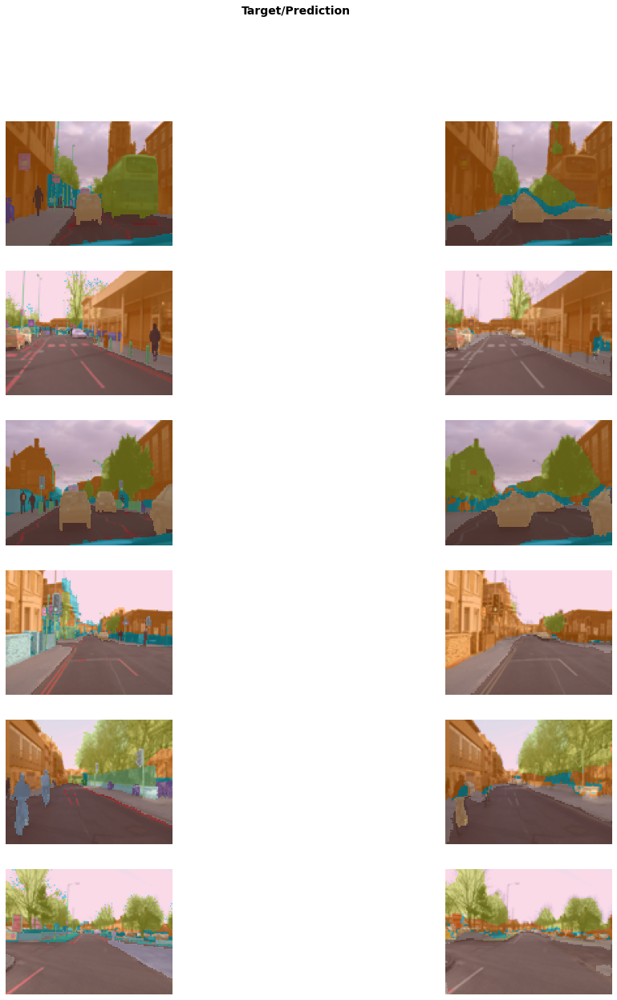

* [Image Classification](#image-classification)
* [Image Segmentation](#image-segmentation)
* [Text Classification](#text-classification)
* [Applying Image Models to Non-Image Tasks](#applying-image-models-to-non-image-tasks)
* [Tabular Data](#tabular-data)
* [Recommendation Systems](#recommendation-systems)
* [References](#references)


## Image Classification

### Import Dependencies


```python
# Import fastai computer vision library
# Includes functions and classes to create a wide variety of computer vision models
from fastai.vision.all import *
```


### Select Dataset
**Oxford-IIT Pet Dataset:** contains 7,390 images of cats and dogs from 37 breeds


```python
URLs.PETS
```


```bash
'https://s3.amazonaws.com/fast-ai-imageclas/oxford-iiit-pet.tgz'
```

<br>


```python
# Download and extract the training dataset 
# base directory: '~/.fastai'
# returns a Path object: https://docs.python.org/3/library/pathlib.html
path = untar_data(URLs.PETS)/'images'
print(type(path))
print(path)
```

```bash
<class 'pathlib.PosixPath'>
/home/innom-dt/.fastai/data/oxford-iiit-pet/images
```

<br>

```python
!ls ~/.fastai/data
```

```bash
annotations  coco_sample  oxford-iiit-pet
```

<br>

```python
!ls ~/.fastai/data/oxford-iiit-pet/images| head -5
```

```bash
Abyssinian_100.jpg
Abyssinian_100.mat
Abyssinian_101.jpg
Abyssinian_101.mat
Abyssinian_102.jpg
ls: write error: Broken pipe
```


### Load Training Data


```python
# Returns true if the first letter in the string is upper case
def is_cat(x): return x[0].isupper()
```


```python
str.isupper
```


```bash
<method 'isupper' of 'str' objects>
```

<br>

```python
is_cat("word")
```


```bash
False
```

<br>

```python
is_cat("Word")
```


```bash
True
```

<br>

```python
is_cat("woRd")
```


```bash
False
```

<br>

```python
# Cat breeds are upper case
!ls ~/.fastai/data/oxford-iiit-pet/images/[[:upper:]]* | head -5
```

```bash
/home/innom-dt/.fastai/data/oxford-iiit-pet/images/Abyssinian_100.jpg
/home/innom-dt/.fastai/data/oxford-iiit-pet/images/Abyssinian_100.mat
/home/innom-dt/.fastai/data/oxford-iiit-pet/images/Abyssinian_101.jpg
/home/innom-dt/.fastai/data/oxford-iiit-pet/images/Abyssinian_101.mat
/home/innom-dt/.fastai/data/oxford-iiit-pet/images/Abyssinian_102.jpg
ls: write error: Broken pipe
```

<br>


```python
# Dog breeds are lower case
!ls ~/.fastai/data/oxford-iiit-pet/images/[[:lower:]]* | head -5
```

```bash
/home/innom-dt/.fastai/data/oxford-iiit-pet/images/american_bulldog_100.jpg
/home/innom-dt/.fastai/data/oxford-iiit-pet/images/american_bulldog_101.jpg
/home/innom-dt/.fastai/data/oxford-iiit-pet/images/american_bulldog_102.jpg
/home/innom-dt/.fastai/data/oxford-iiit-pet/images/american_bulldog_103.jpg
/home/innom-dt/.fastai/data/oxford-iiit-pet/images/american_bulldog_104.jpg
ls: write error: Broken pipe
```

<br>


```python
# Create a dataloader to feed image files from dataset to the model
# Reserves 20% of the available images for the validation set
# Sets the random seed to get consistent results in each training session
# Uses the is_cat() function to identify image classes
# - Upper case will be the first class
# Resizes and crops images to 224x224
# Uses 8 cpu workers to load images during training
dls = ImageDataLoaders.from_name_func(
    path, get_image_files(path), valid_pct=0.2, seed=42,
    label_func=is_cat, item_tfms=Resize(224), num_workers=8)
```

<br>

```python
print(len(get_image_files(path)))
img_files = get_image_files(path)
for i in range(5):
    print(img_files[i])
```

```bash
7390
/home/innom-dt/.fastai/data/oxford-iiit-pet/images/Birman_121.jpg
/home/innom-dt/.fastai/data/oxford-iiit-pet/images/shiba_inu_131.jpg
/home/innom-dt/.fastai/data/oxford-iiit-pet/images/Bombay_176.jpg
/home/innom-dt/.fastai/data/oxford-iiit-pet/images/Bengal_199.jpg
/home/innom-dt/.fastai/data/oxford-iiit-pet/images/beagle_41.jpg
```

<br>


```python
dls.after_item
```


```bash
Pipeline: Resize -- {'size': (224, 224), 'method': 'crop', 'pad_mode': 'reflection', 'resamples': (2, 0), 'p': 1.0} -> ToTensor
```

<br>

```python
dls.after_batch
```


```bash
Pipeline: IntToFloatTensor -- {'div': 255.0, 'div_mask': 1}
```


### Train a Model

#### Randomly Initialized Weights


```python
learn = cnn_learner(dls, resnet34, metrics=accuracy, pretrained=False)
learn.fine_tune(1)
```

<table border="1" class="dataframe">
  <thead>
    <tr style="text-align: left;">
      <th>epoch</th>
      <th>train_loss</th>
      <th>valid_loss</th>
      <th>accuracy</th>
      <th>time</th>
    </tr>
  </thead>
  <tbody>
    <tr>
      <td>0</td>
      <td>1.004878</td>
      <td>0.697246</td>
      <td>0.662382</td>
      <td>00:11</td>
    </tr>
  </tbody>
</table>
<table border="1" class="dataframe">
  <thead>
    <tr style="text-align: left;">
      <th>epoch</th>
      <th>train_loss</th>
      <th>valid_loss</th>
      <th>accuracy</th>
      <th>time</th>
    </tr>
  </thead>
  <tbody>
    <tr>
      <td>0</td>
      <td>0.745436</td>
      <td>0.612512</td>
      <td>0.688769</td>
      <td>00:14</td>
    </tr>
  </tbody>
</table>


#### Pretrained Weights


```python
# removes the last layer of the of the pretrained resnet34 and
# replaces it with a new output layer for the target dataset
learn = cnn_learner(dls, resnet34, metrics=accuracy, pretrained=True)
learn.fine_tune(1)
```
<table border="1" class="dataframe">
  <thead>
    <tr style="text-align: left;">
      <th>epoch</th>
      <th>train_loss</th>
      <th>valid_loss</th>
      <th>accuracy</th>
      <th>time</th>
    </tr>
  </thead>
  <tbody>
    <tr>
      <td>0</td>
      <td>0.162668</td>
      <td>0.023766</td>
      <td>0.989851</td>
      <td>00:11</td>
    </tr>
  </tbody>
</table>
<table border="1" class="dataframe">
  <thead>
    <tr style="text-align: left;">
      <th>epoch</th>
      <th>train_loss</th>
      <th>valid_loss</th>
      <th>accuracy</th>
      <th>time</th>
    </tr>
  </thead>
  <tbody>
    <tr>
      <td>0</td>
      <td>0.061914</td>
      <td>0.014920</td>
      <td>0.993234</td>
      <td>00:14</td>
    </tr>
  </tbody>
</table>
<br>


```python
# Build a convolutional neural network-style learner from the dataloader and model architecture
cnn_learner
```


```bash
<function fastai.vision.learner.cnn_learner(dls, arch, normalize=True, n_out=None, pretrained=True, config=None, loss_func=None, opt_func=<function Adam at 0x7f0e87aa2040>, lr=0.001, splitter=None, cbs=None, metrics=None, path=None, model_dir='models', wd=None, wd_bn_bias=False, train_bn=True, moms=(0.95, 0.85, 0.95), cut=None, n_in=3, init=<function kaiming_normal_ at 0x7f0ed3b4f820>, custom_head=None, concat_pool=True, lin_ftrs=None, ps=0.5, first_bn=True, bn_final=False, lin_first=False, y_range=None)>
```

<br>

```python
# ResNet-34 model from [Deep Residual Learning for Image Recognition](https://arxiv.org/pdf/1512.03385.pdf)
# the pretrained version has already been trained to recognize
# a thousand different categories on 1.3 million images
resnet34
```


```bash
<function torchvision.models.resnet.resnet34(pretrained: bool = False, progress: bool = True, **kwargs: Any) -> torchvision.models.resnet.ResNet>
```

<br>

```python
# based on https://github.com/sksq96/pytorch-summary/blob/master/torchsummary/torchsummary.py
def get_total_params(model, input_size, batch_size=-1, device='cuda', dtypes=None):
    
    def register_hook(module):

        def hook(module, input, output):
            class_name = str(module.__class__).split(".")[-1].split("'")[0]
            module_idx = len(summary)

            m_key = f"{class_name}-{module_idx + 1}"
            summary[m_key] = OrderedDict()

            params = 0
            if hasattr(module, "weight") and hasattr(module.weight, "size"):
                params += torch.prod(torch.LongTensor(list(module.weight.size())))
            if hasattr(module, "bias") and hasattr(module.bias, "size"):
                params += torch.prod(torch.LongTensor(list(module.bias.size())))
            summary[m_key]["nb_params"] = params

        if (
            not isinstance(module, nn.Sequential)
            and not isinstance(module, nn.ModuleList)
            and not (module == model)
        ):
            hooks.append(module.register_forward_hook(hook))

    if device == "cuda" and torch.cuda.is_available():
        dtype = torch.cuda.FloatTensor
    else:
        dtype = torch.FloatTensor

    # multiple inputs to the network
    if isinstance(input_size, tuple):
        input_size = [input_size]

    # batch_size of 2 for batchnorm
    x = [torch.rand(2, *in_size).type(dtype) for in_size in input_size]
    
    # create properties
    summary = OrderedDict()
    hooks = []

    # register hook
    model.apply(register_hook)

    # make a forward pass
    model(*x)

    # remove these hooks
    for h in hooks:
        h.remove()

    total_params = 0
    for layer in summary:
        total_params += summary[layer]["nb_params"]
                
    return total_params
```


```python
input_shape = (3, 224, 224)
```


```python
print(f"ResNet18 Total params: {get_total_params(resnet18().cuda(), input_shape):,}")
print(f"ResNet34 Total params: {get_total_params(resnet34().cuda(), input_shape):,}")
print(f"ResNet50 Total params: {get_total_params(resnet50().cuda(), input_shape):,}")
print(f"ResNet101 Total params: {get_total_params(resnet101().cuda(), input_shape):,}")
print(f"ResNet152 Total params: {get_total_params(resnet152().cuda(), input_shape):,}")
```

```bash
ResNet18 Total params: 11,689,512
ResNet34 Total params: 21,797,672
ResNet50 Total params: 25,557,032
ResNet101 Total params: 44,549,160
ResNet152 Total params: 60,192,808
```


<br>

```python
# 1 - accuracy
error_rate
```


```bash
<function fastai.metrics.error_rate(inp, targ, axis=-1)>
```

<br>


```python
# 1 - error_rate
accuracy
```


```bash
<function fastai.metrics.accuracy(inp, targ, axis=-1)>
```


### Use Trained Model


```python
# Upload file(s) from browser to Python kernel as bytes
uploader = widgets.FileUpload()
uploader
```


```bash
FileUpload(value={}, description='Upload')
```

<br>

```python
# Open an `Image` from path `fn`
# Accepts pathlib.Path, str, torch.Tensor, numpy.ndarray and bytes objects
img = PILImage.create(uploader.data[0])
print(f"Type: {type(img)}")
img
```

```bash
Type: <class 'fastai.vision.core.PILImage'>
```


```python
# Prediction on `item`, fully decoded, loss function decoded and probabilities
is_cat,_,probs = learn.predict(img)
print(f"Is this a cat?: {is_cat}.")
print(f"Probability it's a cat: {probs[1].item():.6f}")
```


```bash
Is this a cat?: False.
Probability it's a cat: 0.000024
```

<br>

```python
uploader = widgets.FileUpload()
uploader
```


```bash
FileUpload(value={}, description='Upload')
```

```python
img = PILImage.create(uploader.data[0])
img
```


```python
is_cat,_,probs = learn.predict(img)
print(f"Is this a cat?: {is_cat}.")
print(f"Probability it's a cat: {probs[1].item():.6f}")
```

```bash
Is this a cat?: True.
Probability it's a cat: 1.000000
```


## Image Segmentation

- training a model to recognize the content of every single pixel in an image

<br>

```python
path = untar_data(URLs.CAMVID_TINY)
print(path)
```
```bash
/home/innom-dt/.fastai/data/camvid_tiny
```

<br>

```python
!ls $path
```
```bash
codes.txt  images  labels
```

<br>

```python
# Basic wrapper around several `DataLoader`s with factory methods for segmentation problems
dls = SegmentationDataLoaders.from_label_func(
    path, bs=8, fnames = get_image_files(path/"images"),
    label_func = lambda o: path/'labels'/f'{o.stem}_P{o.suffix}',
    codes = np.loadtxt(path/'codes.txt', dtype=str), seed=42, num_workers=8
)
```

<br>


```python
img_files = get_image_files(path/"images")
print(len(img_files))
for i in range(5):
    print(img_files[i])
```
```bash
100
/home/innom-dt/.fastai/data/camvid_tiny/images/0016E5_08155.png
/home/innom-dt/.fastai/data/camvid_tiny/images/Seq05VD_f03210.png
/home/innom-dt/.fastai/data/camvid_tiny/images/Seq05VD_f03060.png
/home/innom-dt/.fastai/data/camvid_tiny/images/Seq05VD_f03660.png
/home/innom-dt/.fastai/data/camvid_tiny/images/0016E5_05310.png
```

<br>

```python
path/'labels'/f'{img_files[0].stem}_P{img_files[0].suffix}'
```
```bash
Path('/home/innom-dt/.fastai/data/camvid_tiny/labels/0016E5_08155_P.png')
```

<br>

```python
# Build a unet learner
learn = unet_learner(dls, resnet34, pretrained=True)
learn.fine_tune(8)
```

<table border="1" class="dataframe">
  <thead>
    <tr style="text-align: left;">
      <th>epoch</th>
      <th>train_loss</th>
      <th>valid_loss</th>
      <th>time</th>
    </tr>
  </thead>
  <tbody>
    <tr>
      <td>0</td>
      <td>2.914330</td>
      <td>2.284680</td>
      <td>00:01</td>
    </tr>
  </tbody>
</table>
<table border="1" class="dataframe">
  <thead>
    <tr style="text-align: left;">
      <th>epoch</th>
      <th>train_loss</th>
      <th>valid_loss</th>
      <th>time</th>
    </tr>
  </thead>
  <tbody>
    <tr>
      <td>0</td>
      <td>1.906939</td>
      <td>1.415985</td>
      <td>00:01</td>
    </tr>
    <tr>
      <td>1</td>
      <td>1.628720</td>
      <td>1.185889</td>
      <td>00:01</td>
    </tr>
    <tr>
      <td>2</td>
      <td>1.454888</td>
      <td>1.024575</td>
      <td>00:01</td>
    </tr>
    <tr>
      <td>3</td>
      <td>1.290813</td>
      <td>0.921251</td>
      <td>00:01</td>
    </tr>
    <tr>
      <td>4</td>
      <td>1.152427</td>
      <td>0.809383</td>
      <td>00:01</td>
    </tr>
    <tr>
      <td>5</td>
      <td>1.034114</td>
      <td>0.793250</td>
      <td>00:01</td>
    </tr>
    <tr>
      <td>6</td>
      <td>0.941492</td>
      <td>0.782535</td>
      <td>00:01</td>
    </tr>
    <tr>
      <td>7</td>
      <td>0.869773</td>
      <td>0.778228</td>
      <td>00:01</td>
    </tr>
  </tbody>
</table>
<br>


```python
learn.show_results(max_n=6, figsize=(18,20))
```





## Text Classification

* classify the sentiment of pieces of text

<br>

```python
from fastai.text.all import *
```

IMDB Large Moview Review Dataset
* from [Learning Word Vectors for Sentiment Analysis](https://ai.stanford.edu/~ang/papers/acl11-WordVectorsSentimentAnalysis.pdf)


```python
path = untar_data(URLs.IMDB)
path
```


```bash
Path('/home/innom-dt/.fastai/data/imdb')
```

<br>


```python
!ls $path
```

```bash
imdb.vocab  README  test  tmp_clas  tmp_lm  train  unsup
```

<br>

```python
# Basic wrapper around several `DataLoader`s with factory methods for NLP problems
dls = TextDataLoaders.from_folder(path, valid='test', bs=64, seed=42, num_workers=8)
```

<br>


```python
len(dls.items)
```


```bash
25000
```

<br>


```python
dls.after_iter
```


```bash
<bound method after_iter of <fastai.text.data.SortedDL object at 0x7f0f493cb9d0>>
```

<br>


```python
# A `DataLoader` that goes throught the item in the order given by `sort_func`
SortedDL
```

<br>


```python
!ls $path/train
```

```bash
labeledBow.feat  neg  pos  unsupBow.feat
```

<br>

```python
!ls $path/train/pos | wc -l
```

```bash
12500
```

<br>

```python
!ls $path/train/pos | head -5
```

```bash
0_9.txt
10000_8.txt
10001_10.txt
10002_7.txt
10003_8.txt
ls: write error: Broken pipe
```

<br>

```python
!cat $path/train/pos/0_9.txt
```

```bash
Bromwell High is a cartoon comedy. It ran at the same time as some other programs about school life, such as "Teachers". My 35 years in the teaching profession lead me to believe that Bromwell High's satire is much closer to reality than is "Teachers". The scramble to survive financially, the insightful students who can see right through their pathetic teachers' pomp, the pettiness of the whole situation, all remind me of the schools I knew and their students. When I saw the episode in which a student repeatedly tried to burn down the school, I immediately recalled ......... at .......... High. A classic line: INSPECTOR: I'm here to sack one of your teachers. STUDENT: Welcome to Bromwell High. I expect that many adults of my age think that Bromwell High is far fetched. What a pity that it isn't!
```

<br>


```python
!ls $path/train/neg | wc -l
```

```bash
12500
```

<br>

```python
!ls $path/train/neg | head -5
```

```bash
0_3.txt
10000_4.txt
10001_4.txt
10002_1.txt
10003_1.txt
ls: write error: Broken pipe
```

<br>

```python
!cat $path/train/neg/0_3.txt
```

```bash
Story of a man who has unnatural feelings for a pig. Starts out with a opening scene that is a terrific example of absurd comedy. A formal orchestra audience is turned into an insane, violent mob by the crazy chantings of it's singers. Unfortunately it stays absurd the WHOLE time with no general narrative eventually making it just too off putting. Even those from the era should be turned off. The cryptic dialogue would make Shakespeare seem easy to a third grader. On a technical level it's better than you might think with some good cinematography by future great Vilmos Zsigmond. Future stars Sally Kirkland and Frederic Forrest can be seen briefly.
```

<br>


```python
# Create a `Learner` with a text classifier
learn = text_classifier_learner(dls, AWD_LSTM, drop_mult=0.5, metrics=accuracy)
learn.fine_tune(4, 1e-2)
```
<table border="1" class="dataframe">
  <thead>
    <tr style="text-align: left;">
      <th>epoch</th>
      <th>train_loss</th>
      <th>valid_loss</th>
      <th>accuracy</th>
      <th>time</th>
    </tr>
  </thead>
  <tbody>
    <tr>
      <td>0</td>
      <td>0.460765</td>
      <td>0.407599</td>
      <td>0.815200</td>
      <td>01:25</td>
    </tr>
  </tbody>
</table>
<table border="1" class="dataframe">
  <thead>
    <tr style="text-align: left;">
      <th>epoch</th>
      <th>train_loss</th>
      <th>valid_loss</th>
      <th>accuracy</th>
      <th>time</th>
    </tr>
  </thead>
  <tbody>
    <tr>
      <td>0</td>
      <td>0.316035</td>
      <td>0.262926</td>
      <td>0.895640</td>
      <td>02:46</td>
    </tr>
    <tr>
      <td>1</td>
      <td>0.250969</td>
      <td>0.223144</td>
      <td>0.908440</td>
      <td>02:48</td>
    </tr>
    <tr>
      <td>2</td>
      <td>0.186867</td>
      <td>0.187719</td>
      <td>0.926720</td>
      <td>02:48</td>
    </tr>
    <tr>
      <td>3</td>
      <td>0.146174</td>
      <td>0.190528</td>
      <td>0.927880</td>
      <td>02:50</td>
    </tr>
  </tbody>
</table>
<br>


```python
learn.predict("I really liked that movie!")
```

```bash
('pos', TensorText(1), TensorText([5.5877e-04, 9.9944e-01]))
```

<br>


```python
learn.predict("I really hated that movie!")
```


```bash
('neg', TensorText(0), TensorText([0.9534, 0.0466]))
```


## Tabular Data

- data that in in the form of a table
    - spreedsheets
    - databases
    - Comma-separated Values (CSV) files
- model tries to predict the value of one column based on information in other columns

<br>

```python
from fastai.tabular.all import *
```

Adult Dataset
* from the paper [Scaling Up the Accuracy of Naive-Bayes Classifiers: a Decision-Tree Hybrid](https://www.aaai.org/Papers/KDD/1996/KDD96-033.pdf)
* contains some demographic data about individuals


```python
path = untar_data(URLs.ADULT_SAMPLE)
print(path)
```

```bash
/home/innom-dt/.fastai/data/adult_sample
```

<br>

```python
!ls $path
```

```bash
adult.csv  export.pkl  models
```

<br>

```python
import pandas as pd
```


```python
!cat $path/adult.csv | head -1
```

```bash
age,workclass,fnlwgt,education,education-num,marital-status,occupation,relationship,race,sex,capital-gain,capital-loss,hours-per-week,native-country,salary
cat: write error: Broken pipe
```

<br>

```python
pd.read_csv(f"{path}/adult.csv").head()
```

<table border="1" class="dataframe">
  <thead>
    <tr style="text-align: right;">
      <th></th>
      <th>age</th>
      <th>workclass</th>
      <th>fnlwgt</th>
      <th>education</th>
      <th>education-num</th>
      <th>marital-status</th>
      <th>occupation</th>
      <th>relationship</th>
      <th>race</th>
      <th>sex</th>
      <th>capital-gain</th>
      <th>capital-loss</th>
      <th>hours-per-week</th>
      <th>native-country</th>
      <th>salary</th>
    </tr>
  </thead>
  <tbody>
    <tr>
      <th>0</th>
      <td>49</td>
      <td>Private</td>
      <td>101320</td>
      <td>Assoc-acdm</td>
      <td>12.0</td>
      <td>Married-civ-spouse</td>
      <td>NaN</td>
      <td>Wife</td>
      <td>White</td>
      <td>Female</td>
      <td>0</td>
      <td>1902</td>
      <td>40</td>
      <td>United-States</td>
      <td>&gt;=50k</td>
    </tr>
    <tr>
      <th>1</th>
      <td>44</td>
      <td>Private</td>
      <td>236746</td>
      <td>Masters</td>
      <td>14.0</td>
      <td>Divorced</td>
      <td>Exec-managerial</td>
      <td>Not-in-family</td>
      <td>White</td>
      <td>Male</td>
      <td>10520</td>
      <td>0</td>
      <td>45</td>
      <td>United-States</td>
      <td>&gt;=50k</td>
    </tr>
    <tr>
      <th>2</th>
      <td>38</td>
      <td>Private</td>
      <td>96185</td>
      <td>HS-grad</td>
      <td>NaN</td>
      <td>Divorced</td>
      <td>NaN</td>
      <td>Unmarried</td>
      <td>Black</td>
      <td>Female</td>
      <td>0</td>
      <td>0</td>
      <td>32</td>
      <td>United-States</td>
      <td>&lt;50k</td>
    </tr>
    <tr>
      <th>3</th>
      <td>38</td>
      <td>Self-emp-inc</td>
      <td>112847</td>
      <td>Prof-school</td>
      <td>15.0</td>
      <td>Married-civ-spouse</td>
      <td>Prof-specialty</td>
      <td>Husband</td>
      <td>Asian-Pac-Islander</td>
      <td>Male</td>
      <td>0</td>
      <td>0</td>
      <td>40</td>
      <td>United-States</td>
      <td>&gt;=50k</td>
    </tr>
    <tr>
      <th>4</th>
      <td>42</td>
      <td>Self-emp-not-inc</td>
      <td>82297</td>
      <td>7th-8th</td>
      <td>NaN</td>
      <td>Married-civ-spouse</td>
      <td>Other-service</td>
      <td>Wife</td>
      <td>Black</td>
      <td>Female</td>
      <td>0</td>
      <td>0</td>
      <td>50</td>
      <td>United-States</td>
      <td>&lt;50k</td>
    </tr>
  </tbody>
</table>


<br>

```python
dls = TabularDataLoaders.from_csv(path/'adult.csv', path=path, y_names="salary",
    cat_names = ['workclass', 'education', 'marital-status', 'occupation',
                 'relationship', 'race'],
    cont_names = ['age', 'fnlwgt', 'education-num'],
    procs = [
        # Transform the categorical variables to something similar to `pd.Categorical`        
        Categorify, 
        # Fill the missing values in continuous columns.
        FillMissing,
        # Normalize/denorm batch
        Normalize
    ], bs=64, seed=42, num_workers=8)
```


```python
learn = tabular_learner(dls, metrics=accuracy)
```


```python
learn.fit_one_cycle(3)
```
<table border="1" class="dataframe">
  <thead>
    <tr style="text-align: left;">
      <th>epoch</th>
      <th>train_loss</th>
      <th>valid_loss</th>
      <th>accuracy</th>
      <th>time</th>
    </tr>
  </thead>
  <tbody>
    <tr>
      <td>0</td>
      <td>0.383882</td>
      <td>0.353906</td>
      <td>0.839834</td>
      <td>00:02</td>
    </tr>
    <tr>
      <td>1</td>
      <td>0.369853</td>
      <td>0.343141</td>
      <td>0.844134</td>
      <td>00:02</td>
    </tr>
    <tr>
      <td>2</td>
      <td>0.353572</td>
      <td>0.340899</td>
      <td>0.844441</td>
      <td>00:02</td>
    </tr>
  </tbody>
</table>


### Recommendation Systems

- model tries to predict the rating a user would give for something

<br>

```python
from fastai.collab import *
```


```python
path = untar_data(URLs.ML_SAMPLE)
print(path)
```

```bash
/home/innom-dt/.fastai/data/movie_lens_sample
```

<br>

```python
dls = CollabDataLoaders.from_csv(path/'ratings.csv', bs=64, seed=42, num_workers=8)
```


```python
learn = collab_learner(dls, y_range=(0.5,5.5))
learn.fine_tune(10)
```
<table border="1" class="dataframe">
  <thead>
    <tr style="text-align: left;">
      <th>epoch</th>
      <th>train_loss</th>
      <th>valid_loss</th>
      <th>time</th>
    </tr>
  </thead>
  <tbody>
    <tr>
      <td>0</td>
      <td>1.503958</td>
      <td>1.418632</td>
      <td>00:00</td>
    </tr>
  </tbody>
</table>
<table border="1" class="dataframe">
  <thead>
    <tr style="text-align: left;">
      <th>epoch</th>
      <th>train_loss</th>
      <th>valid_loss</th>
      <th>time</th>
    </tr>
  </thead>
  <tbody>
    <tr>
      <td>0</td>
      <td>1.376203</td>
      <td>1.359422</td>
      <td>00:00</td>
    </tr>
    <tr>
      <td>1</td>
      <td>1.252138</td>
      <td>1.180762</td>
      <td>00:00</td>
    </tr>
    <tr>
      <td>2</td>
      <td>1.017709</td>
      <td>0.880817</td>
      <td>00:00</td>
    </tr>
    <tr>
      <td>3</td>
      <td>0.798113</td>
      <td>0.741172</td>
      <td>00:00</td>
    </tr>
    <tr>
      <td>4</td>
      <td>0.688681</td>
      <td>0.708689</td>
      <td>00:00</td>
    </tr>
    <tr>
      <td>5</td>
      <td>0.648084</td>
      <td>0.697439</td>
      <td>00:00</td>
    </tr>
    <tr>
      <td>6</td>
      <td>0.631074</td>
      <td>0.693731</td>
      <td>00:00</td>
    </tr>
    <tr>
      <td>7</td>
      <td>0.608035</td>
      <td>0.691561</td>
      <td>00:00</td>
    </tr>
    <tr>
      <td>8</td>
      <td>0.609987</td>
      <td>0.691219</td>
      <td>00:00</td>
    </tr>
    <tr>
      <td>9</td>
      <td>0.607285</td>
      <td>0.691045</td>
      <td>00:00</td>
    </tr>
  </tbody>
</table>
<br>


```python
learn.show_results()
```
<table border="1" class="dataframe">
  <thead>
    <tr style="text-align: right;">
      <th></th>
      <th>userId</th>
      <th>movieId</th>
      <th>rating</th>
      <th>rating_pred</th>
    </tr>
  </thead>
  <tbody>
    <tr>
      <th>0</th>
      <td>63.0</td>
      <td>48.0</td>
      <td>5.0</td>
      <td>2.935433</td>
    </tr>
    <tr>
      <th>1</th>
      <td>70.0</td>
      <td>36.0</td>
      <td>4.0</td>
      <td>4.040259</td>
    </tr>
    <tr>
      <th>2</th>
      <td>65.0</td>
      <td>92.0</td>
      <td>4.5</td>
      <td>4.266208</td>
    </tr>
    <tr>
      <th>3</th>
      <td>47.0</td>
      <td>98.0</td>
      <td>5.0</td>
      <td>4.345912</td>
    </tr>
    <tr>
      <th>4</th>
      <td>4.0</td>
      <td>83.0</td>
      <td>3.5</td>
      <td>4.335626</td>
    </tr>
    <tr>
      <th>5</th>
      <td>4.0</td>
      <td>38.0</td>
      <td>4.5</td>
      <td>4.221953</td>
    </tr>
    <tr>
      <th>6</th>
      <td>59.0</td>
      <td>60.0</td>
      <td>5.0</td>
      <td>4.432968</td>
    </tr>
    <tr>
      <th>7</th>
      <td>86.0</td>
      <td>82.0</td>
      <td>4.0</td>
      <td>3.797124</td>
    </tr>
    <tr>
      <th>8</th>
      <td>55.0</td>
      <td>86.0</td>
      <td>4.5</td>
      <td>3.959364</td>
    </tr>
  </tbody>
</table>


## References

* [Deep Learning for Coders with fastai & PyTorch](https://www.oreilly.com/library/view/deep-learning-for/9781492045519/)
* [The fastai book GitHub Repository](https://github.com/fastai/fastbook)