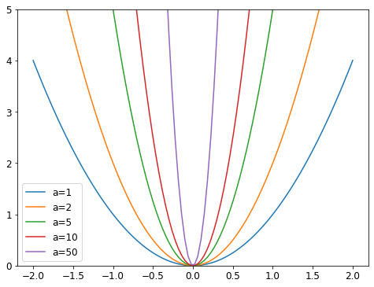

* [Collaborative Filtering](#collaborative-filtering)
* [A First Look at the Data](#a-first-look-at-the-data)
* [Learning the Latent Factors](#learning-the-latent-factors)
* [Creating the DataLoaders](#creating-the-dataLoaders)
* [Collaborative Filtering from Scratch](#collaborative-filtering-from-scratch)
* [Interpreting Embeddings and Biases](#Interpreting Embeddings and Biases)
* [Bootstrapping a Collaborative Filtering Model](#bootstrapping-a-collaborative-filtering-model)
* [Deep Learning for Collaborative Filtering](#deep-learning-for-collaborative-filtering)
* [References](#references)


## Collaborative Filtering

- Look at which items the current user has used or liked, find other users who have used or liked similar items, and then recommend other items that those users have used or like.
    - identifies latent factors to compare similarity
- used for recommendation systems
- Uses
    - recommending movies
    - figuring out what to highlight on a user’s homepage
    - deciding what stories to show in a social media feed
    - selecting diagnoses for patients

**Probabilistic Matrix Factorization**

[Probabilistic Matrix Factorization Paper](https://proceedings.neurips.cc/paper/2007/file/d7322ed717dedf1eb4e6e52a37ea7bcd-Paper.pdf)

[Probabilistic Matrix Factorization - Matrix Factorization (Part 1) ](https://www.coursera.org/lecture/matrix-factorization/probabilistic-matrix-factorization-Eoyiz)

```python
#hide
# !pip install -Uqq fastbook
import fastbook
fastbook.setup_book()
```

```python
#hide
from fastbook import *
```

## A First Look at the Data

### MovieLens Dataset
* [https://grouplens.org/datasets/movielens/](https://grouplens.org/datasets/movielens/)
* 25M Dataset
    * 25 million movie ratings
    * one million tag applications applied to 62,000 movies by 162,000 users
    * includes tag genome data with 15 million relevance scores across 1,129 tags
    * released 12/2019
* 100K Dataset
    * 100 thousand movie ratings from 1000 users on 1700 movies
    * released 4/1998

```python
URLs.ML_100k
```
```text
'https://files.grouplens.org/datasets/movielens/ml-100k.zip'
```


```python
from fastai.collab import *
from fastai.tabular.all import *
```

```python
path = untar_data(URLs.ML_100k)
path
```
```text
Path('/home/innom-dt/.fastai/data/ml-100k')
```


```python
pd.DataFrame(list(path.ls()))
```
<div style="overflow-x:auto;">
<table border="1" class="dataframe">
  <thead>
    <tr style="text-align: right;">
      <th></th>
      <th>0</th>
    </tr>
  </thead>
  <tbody>
    <tr>
      <th>0</th>
      <td>/home/innom-dt/.fastai/data/ml-100k/ub.base</td>
    </tr>
    <tr>
      <th>1</th>
      <td>/home/innom-dt/.fastai/data/ml-100k/u5.test</td>
    </tr>
    <tr>
      <th>2</th>
      <td>/home/innom-dt/.fastai/data/ml-100k/u4.base</td>
    </tr>
    <tr>
      <th>3</th>
      <td>/home/innom-dt/.fastai/data/ml-100k/u1.test</td>
    </tr>
    <tr>
      <th>4</th>
      <td>/home/innom-dt/.fastai/data/ml-100k/ua.base</td>
    </tr>
    <tr>
      <th>5</th>
      <td>/home/innom-dt/.fastai/data/ml-100k/u.occupation</td>
    </tr>
    <tr>
      <th>6</th>
      <td>/home/innom-dt/.fastai/data/ml-100k/mku.sh</td>
    </tr>
    <tr>
      <th>7</th>
      <td>/home/innom-dt/.fastai/data/ml-100k/ub.test</td>
    </tr>
    <tr>
      <th>8</th>
      <td>/home/innom-dt/.fastai/data/ml-100k/allbut.pl</td>
    </tr>
    <tr>
      <th>9</th>
      <td>/home/innom-dt/.fastai/data/ml-100k/u.info</td>
    </tr>
    <tr>
      <th>10</th>
      <td>/home/innom-dt/.fastai/data/ml-100k/u5.base</td>
    </tr>
    <tr>
      <th>11</th>
      <td>/home/innom-dt/.fastai/data/ml-100k/u2.test</td>
    </tr>
    <tr>
      <th>12</th>
      <td>/home/innom-dt/.fastai/data/ml-100k/u.genre</td>
    </tr>
    <tr>
      <th>13</th>
      <td>/home/innom-dt/.fastai/data/ml-100k/u2.base</td>
    </tr>
    <tr>
      <th>14</th>
      <td>/home/innom-dt/.fastai/data/ml-100k/u.user</td>
    </tr>
    <tr>
      <th>15</th>
      <td>/home/innom-dt/.fastai/data/ml-100k/README</td>
    </tr>
    <tr>
      <th>16</th>
      <td>/home/innom-dt/.fastai/data/ml-100k/u3.test</td>
    </tr>
    <tr>
      <th>17</th>
      <td>/home/innom-dt/.fastai/data/ml-100k/u1.base</td>
    </tr>
    <tr>
      <th>18</th>
      <td>/home/innom-dt/.fastai/data/ml-100k/u.data</td>
    </tr>
    <tr>
      <th>19</th>
      <td>/home/innom-dt/.fastai/data/ml-100k/u.item</td>
    </tr>
    <tr>
      <th>20</th>
      <td>/home/innom-dt/.fastai/data/ml-100k/ua.test</td>
    </tr>
    <tr>
      <th>21</th>
      <td>/home/innom-dt/.fastai/data/ml-100k/u3.base</td>
    </tr>
    <tr>
      <th>22</th>
      <td>/home/innom-dt/.fastai/data/ml-100k/u4.test</td>
    </tr>
  </tbody>
</table>
</div>


```python
!cat $path/'u.data' | head -5
```
```text
196	242	3	881250949
186	302	3	891717742
22	377	1	878887116
244	51	2	880606923
166	346	1	886397596
cat: write error: Broken pipe
```


```python
ratings = pd.read_csv(path/'u.data', delimiter='\t', header=None,
                      names=['user','movie','rating','timestamp'])
ratings.head()
```
<div style="overflow-x:auto;">
<table border="1" class="dataframe">
  <thead>
    <tr style="text-align: right;">
      <th></th>
      <th>user</th>
      <th>movie</th>
      <th>rating</th>
      <th>timestamp</th>
    </tr>
  </thead>
  <tbody>
    <tr>
      <th>0</th>
      <td>196</td>
      <td>242</td>
      <td>3</td>
      <td>881250949</td>
    </tr>
    <tr>
      <th>1</th>
      <td>186</td>
      <td>302</td>
      <td>3</td>
      <td>891717742</td>
    </tr>
    <tr>
      <th>2</th>
      <td>22</td>
      <td>377</td>
      <td>1</td>
      <td>878887116</td>
    </tr>
    <tr>
      <th>3</th>
      <td>244</td>
      <td>51</td>
      <td>2</td>
      <td>880606923</td>
    </tr>
    <tr>
      <th>4</th>
      <td>166</td>
      <td>346</td>
      <td>1</td>
      <td>886397596</td>
    </tr>
  </tbody>
</table>
</div>


```python
ratings[ratings['movie'] == 242][ratings['user'] == 305]
```
<div style="overflow-x:auto;">
<table border="1" class="dataframe">
  <thead>
    <tr style="text-align: right;">
      <th></th>
      <th>user</th>
      <th>movie</th>
      <th>rating</th>
      <th>timestamp</th>
    </tr>
  </thead>
  <tbody>
    <tr>
      <th>95720</th>
      <td>305</td>
      <td>242</td>
      <td>5</td>
      <td>886307828</td>
    </tr>
  </tbody>
</table>
</div>


#### pandas pivot table
* [https://pandas.pydata.org/docs/reference/api/pandas.pivot_table.html](https://pandas.pydata.org/docs/reference/api/pandas.pivot_table.html)

```python
pd.pivot_table(ratings.head(10), values='rating', index=['user'], columns=['movie'], fill_value=None, sort=False)
```
<div style="overflow-x:auto;">
<table border="1" class="dataframe">
  <thead>
    <tr style="text-align: right;">
      <th>movie</th>
      <th>51</th>
      <th>86</th>
      <th>242</th>
      <th>265</th>
      <th>302</th>
      <th>346</th>
      <th>377</th>
      <th>451</th>
      <th>465</th>
      <th>474</th>
    </tr>
    <tr>
      <th>user</th>
      <th></th>
      <th></th>
      <th></th>
      <th></th>
      <th></th>
      <th></th>
      <th></th>
      <th></th>
      <th></th>
      <th></th>
    </tr>
  </thead>
  <tbody>
    <tr>
      <th>196</th>
      <td>NaN</td>
      <td>NaN</td>
      <td>3.0</td>
      <td>NaN</td>
      <td>NaN</td>
      <td>NaN</td>
      <td>NaN</td>
      <td>NaN</td>
      <td>NaN</td>
      <td>NaN</td>
    </tr>
    <tr>
      <th>186</th>
      <td>NaN</td>
      <td>NaN</td>
      <td>NaN</td>
      <td>NaN</td>
      <td>3.0</td>
      <td>NaN</td>
      <td>NaN</td>
      <td>NaN</td>
      <td>NaN</td>
      <td>NaN</td>
    </tr>
    <tr>
      <th>22</th>
      <td>NaN</td>
      <td>NaN</td>
      <td>NaN</td>
      <td>NaN</td>
      <td>NaN</td>
      <td>NaN</td>
      <td>1.0</td>
      <td>NaN</td>
      <td>NaN</td>
      <td>NaN</td>
    </tr>
    <tr>
      <th>244</th>
      <td>2.0</td>
      <td>NaN</td>
      <td>NaN</td>
      <td>NaN</td>
      <td>NaN</td>
      <td>NaN</td>
      <td>NaN</td>
      <td>NaN</td>
      <td>NaN</td>
      <td>NaN</td>
    </tr>
    <tr>
      <th>166</th>
      <td>NaN</td>
      <td>NaN</td>
      <td>NaN</td>
      <td>NaN</td>
      <td>NaN</td>
      <td>1.0</td>
      <td>NaN</td>
      <td>NaN</td>
      <td>NaN</td>
      <td>NaN</td>
    </tr>
    <tr>
      <th>298</th>
      <td>NaN</td>
      <td>NaN</td>
      <td>NaN</td>
      <td>NaN</td>
      <td>NaN</td>
      <td>NaN</td>
      <td>NaN</td>
      <td>NaN</td>
      <td>NaN</td>
      <td>4.0</td>
    </tr>
    <tr>
      <th>115</th>
      <td>NaN</td>
      <td>NaN</td>
      <td>NaN</td>
      <td>2.0</td>
      <td>NaN</td>
      <td>NaN</td>
      <td>NaN</td>
      <td>NaN</td>
      <td>NaN</td>
      <td>NaN</td>
    </tr>
    <tr>
      <th>253</th>
      <td>NaN</td>
      <td>NaN</td>
      <td>NaN</td>
      <td>NaN</td>
      <td>NaN</td>
      <td>NaN</td>
      <td>NaN</td>
      <td>NaN</td>
      <td>5.0</td>
      <td>NaN</td>
    </tr>
    <tr>
      <th>305</th>
      <td>NaN</td>
      <td>NaN</td>
      <td>NaN</td>
      <td>NaN</td>
      <td>NaN</td>
      <td>NaN</td>
      <td>NaN</td>
      <td>3.0</td>
      <td>NaN</td>
      <td>NaN</td>
    </tr>
    <tr>
      <th>6</th>
      <td>NaN</td>
      <td>3.0</td>
      <td>NaN</td>
      <td>NaN</td>
      <td>NaN</td>
      <td>NaN</td>
      <td>NaN</td>
      <td>NaN</td>
      <td>NaN</td>
      <td>NaN</td>
    </tr>
  </tbody>
</table>
</div>

**Note:** The `NaN` values indicate a given user has not provided a rating for the corresponding movie

#### pandas DataFrame.pivot
* [https://pandas.pydata.org/docs/reference/api/pandas.DataFrame.pivot.html](https://pandas.pydata.org/docs/reference/api/pandas.DataFrame.pivot.html)

```python
ratings.head(10).pivot(values='rating', index=['user'], columns=['movie'])
```
<div style="overflow-x:auto;">
<table border="1" class="dataframe">
  <thead>
    <tr style="text-align: right;">
      <th>movie</th>
      <th>51</th>
      <th>86</th>
      <th>242</th>
      <th>265</th>
      <th>302</th>
      <th>346</th>
      <th>377</th>
      <th>451</th>
      <th>465</th>
      <th>474</th>
    </tr>
    <tr>
      <th>user</th>
      <th></th>
      <th></th>
      <th></th>
      <th></th>
      <th></th>
      <th></th>
      <th></th>
      <th></th>
      <th></th>
      <th></th>
    </tr>
  </thead>
  <tbody>
    <tr>
      <th>6</th>
      <td>NaN</td>
      <td>3.0</td>
      <td>NaN</td>
      <td>NaN</td>
      <td>NaN</td>
      <td>NaN</td>
      <td>NaN</td>
      <td>NaN</td>
      <td>NaN</td>
      <td>NaN</td>
    </tr>
    <tr>
      <th>22</th>
      <td>NaN</td>
      <td>NaN</td>
      <td>NaN</td>
      <td>NaN</td>
      <td>NaN</td>
      <td>NaN</td>
      <td>1.0</td>
      <td>NaN</td>
      <td>NaN</td>
      <td>NaN</td>
    </tr>
    <tr>
      <th>115</th>
      <td>NaN</td>
      <td>NaN</td>
      <td>NaN</td>
      <td>2.0</td>
      <td>NaN</td>
      <td>NaN</td>
      <td>NaN</td>
      <td>NaN</td>
      <td>NaN</td>
      <td>NaN</td>
    </tr>
    <tr>
      <th>166</th>
      <td>NaN</td>
      <td>NaN</td>
      <td>NaN</td>
      <td>NaN</td>
      <td>NaN</td>
      <td>1.0</td>
      <td>NaN</td>
      <td>NaN</td>
      <td>NaN</td>
      <td>NaN</td>
    </tr>
    <tr>
      <th>186</th>
      <td>NaN</td>
      <td>NaN</td>
      <td>NaN</td>
      <td>NaN</td>
      <td>3.0</td>
      <td>NaN</td>
      <td>NaN</td>
      <td>NaN</td>
      <td>NaN</td>
      <td>NaN</td>
    </tr>
    <tr>
      <th>196</th>
      <td>NaN</td>
      <td>NaN</td>
      <td>3.0</td>
      <td>NaN</td>
      <td>NaN</td>
      <td>NaN</td>
      <td>NaN</td>
      <td>NaN</td>
      <td>NaN</td>
      <td>NaN</td>
    </tr>
    <tr>
      <th>244</th>
      <td>2.0</td>
      <td>NaN</td>
      <td>NaN</td>
      <td>NaN</td>
      <td>NaN</td>
      <td>NaN</td>
      <td>NaN</td>
      <td>NaN</td>
      <td>NaN</td>
      <td>NaN</td>
    </tr>
    <tr>
      <th>253</th>
      <td>NaN</td>
      <td>NaN</td>
      <td>NaN</td>
      <td>NaN</td>
      <td>NaN</td>
      <td>NaN</td>
      <td>NaN</td>
      <td>NaN</td>
      <td>5.0</td>
      <td>NaN</td>
    </tr>
    <tr>
      <th>298</th>
      <td>NaN</td>
      <td>NaN</td>
      <td>NaN</td>
      <td>NaN</td>
      <td>NaN</td>
      <td>NaN</td>
      <td>NaN</td>
      <td>NaN</td>
      <td>NaN</td>
      <td>4.0</td>
    </tr>
    <tr>
      <th>305</th>
      <td>NaN</td>
      <td>NaN</td>
      <td>NaN</td>
      <td>NaN</td>
      <td>NaN</td>
      <td>NaN</td>
      <td>NaN</td>
      <td>3.0</td>
      <td>NaN</td>
      <td>NaN</td>
    </tr>
  </tbody>
</table>
</div>

```python
# Create a sample movie entry
# Index 0: science-fiction
# Index 1: action
# Index 2: old movies
# High values for science fiction and action
# Low value for old movies
last_skywalker = np.array([0.98,0.9,-0.9])
```

```python
# Create a sample user
# High values for science fiction and action
# Low value for old movies
user1 = np.array([0.9,0.8,-0.6])
```

#### Dot Product
* the mathematical operation of multiplying the elements of two vectors together, and then summing up the results

```python
# Multiply the movie and user properties to
# determine how likely the user is to like the movie
(user1*last_skywalker).sum()
```
```text
2.1420000000000003
```

**Note:** The closer the values for the user and movie, the more likely the user is to like the movie


```python
# The user probably will not like this movie
casablanca = np.array([-0.99,-0.3,0.8])
```

```python
(user1*casablanca).sum()
```
```text
-1.611
```


## Learning the Latent Factors

- can use gradient descent to learn the latent factors for each item and user in a dataset

### Steps

1. Randomly initialize some parameters for every user and item in the dataset
    - the parameters represent the latent factors
    - parameters for each user and item are represented as vectors of numbers
    - the size of the vectors for the users and the items must be dot product compatible
2. Calculate predictions
    - take the dot product of the parameters for each movie with the parameters of each user to predict a rating each user would give each item
3. Calculate the loss from predictions
    - can use any loss function, such as Mean Square Error
4. Update the parameter values for the items and users


## Creating the DataLoaders

```python
!cat $path/'u.item' | head -5
```

```text
1|Toy Story (1995)|01-Jan-1995||http://us.imdb.com/M/title-exact?Toy%20Story%20(1995)|0|0|0|1|1|1|0|0|0|0|0|0|0|0|0|0|0|0|0
2|GoldenEye (1995)|01-Jan-1995||http://us.imdb.com/M/title-exact?GoldenEye%20(1995)|0|1|1|0|0|0|0|0|0|0|0|0|0|0|0|0|1|0|0
3|Four Rooms (1995)|01-Jan-1995||http://us.imdb.com/M/title-exact?Four%20Rooms%20(1995)|0|0|0|0|0|0|0|0|0|0|0|0|0|0|0|0|1|0|0
4|Get Shorty (1995)|01-Jan-1995||http://us.imdb.com/M/title-exact?Get%20Shorty%20(1995)|0|1|0|0|0|1|0|0|1|0|0|0|0|0|0|0|0|0|0
5|Copycat (1995)|01-Jan-1995||http://us.imdb.com/M/title-exact?Copycat%20(1995)|0|0|0|0|0|0|1|0|1|0|0|0|0|0|0|0|1|0|0
cat: write error: Broken pipe
```


#### pandas.read_csv
* [https://pandas.pydata.org/docs/reference/api/pandas.read_csv.html](https://pandas.pydata.org/docs/reference/api/pandas.read_csv.html)
* read a csv file
* supports custom delimiters

```python
movies = pd.read_csv(path/'u.item',
                     # separate columns using '|' instead of ','
                     delimiter='|', 
                     encoding='latin-1',
                     # only use the first two columns
                     usecols=(0,1), 
                     names=('movie','title'), 
                     header=None)
movies.head()
```
<div style="overflow-x:auto;">
<table border="1" class="dataframe">
  <thead>
    <tr style="text-align: right;">
      <th></th>
      <th>movie</th>
      <th>title</th>
    </tr>
  </thead>
  <tbody>
    <tr>
      <th>0</th>
      <td>1</td>
      <td>Toy Story (1995)</td>
    </tr>
    <tr>
      <th>1</th>
      <td>2</td>
      <td>GoldenEye (1995)</td>
    </tr>
    <tr>
      <th>2</th>
      <td>3</td>
      <td>Four Rooms (1995)</td>
    </tr>
    <tr>
      <th>3</th>
      <td>4</td>
      <td>Get Shorty (1995)</td>
    </tr>
    <tr>
      <th>4</th>
      <td>5</td>
      <td>Copycat (1995)</td>
    </tr>
  </tbody>
</table>
</div>


#### DataFrame.merge
* [https://pandas.pydata.org/docs/reference/api/pandas.DataFrame.merge.html](https://pandas.pydata.org/docs/reference/api/pandas.DataFrame.merge.html)
* perform a database-style join

```python
# Add the movie titles to the ratings DataFrame
ratings = ratings.merge(movies)
ratings.head()
```
<div style="overflow-x:auto;">
<table border="1" class="dataframe">
  <thead>
    <tr style="text-align: right;">
      <th></th>
      <th>user</th>
      <th>movie</th>
      <th>rating</th>
      <th>timestamp</th>
      <th>title</th>
    </tr>
  </thead>
  <tbody>
    <tr>
      <th>0</th>
      <td>196</td>
      <td>242</td>
      <td>3</td>
      <td>881250949</td>
      <td>Kolya (1996)</td>
    </tr>
    <tr>
      <th>1</th>
      <td>63</td>
      <td>242</td>
      <td>3</td>
      <td>875747190</td>
      <td>Kolya (1996)</td>
    </tr>
    <tr>
      <th>2</th>
      <td>226</td>
      <td>242</td>
      <td>5</td>
      <td>883888671</td>
      <td>Kolya (1996)</td>
    </tr>
    <tr>
      <th>3</th>
      <td>154</td>
      <td>242</td>
      <td>3</td>
      <td>879138235</td>
      <td>Kolya (1996)</td>
    </tr>
    <tr>
      <th>4</th>
      <td>306</td>
      <td>242</td>
      <td>5</td>
      <td>876503793</td>
      <td>Kolya (1996)</td>
    </tr>
  </tbody>
</table>
</div>


#### fastai CollabDataLoaders
* [https://docs.fast.ai/collab.html#CollabDataLoaders](https://docs.fast.ai/collab.html#CollabDataLoaders)
* Base `DataLoaders` for collaborative filtering.

#### CollabDataLoaders.from_df
* [https://docs.fast.ai/collab.html#CollabDataLoaders.from_df](https://docs.fast.ai/collab.html#CollabDataLoaders.from_df)
* Create a DataLoaders suitable for collaborative filtering from a pandas DataFrame.

```python
dls = CollabDataLoaders.from_df(ratings, 
                                # The column containing the users
                                user_name='user', 
                                # The column containing the items
                                item_name='title', 
                                # The column containing the user ratings
                                rating_name='rating', 
                                bs=64)
dls.show_batch()
```
<div style="overflow-x:auto;">
<table border="1" class="dataframe">
  <thead>
    <tr style="text-align: right;">
      <th></th>
      <th>user</th>
      <th>title</th>
      <th>rating</th>
    </tr>
  </thead>
  <tbody>
    <tr>
      <th>0</th>
      <td>795</td>
      <td>Shining, The (1980)</td>
      <td>3</td>
    </tr>
    <tr>
      <th>1</th>
      <td>573</td>
      <td>Leaving Las Vegas (1995)</td>
      <td>3</td>
    </tr>
    <tr>
      <th>2</th>
      <td>38</td>
      <td>Snow White and the Seven Dwarfs (1937)</td>
      <td>5</td>
    </tr>
    <tr>
      <th>3</th>
      <td>378</td>
      <td>Breakdown (1997)</td>
      <td>3</td>
    </tr>
    <tr>
      <th>4</th>
      <td>698</td>
      <td>Third Man, The (1949)</td>
      <td>2</td>
    </tr>
    <tr>
      <th>5</th>
      <td>452</td>
      <td>Mary Poppins (1964)</td>
      <td>4</td>
    </tr>
    <tr>
      <th>6</th>
      <td>668</td>
      <td>Indiana Jones and the Last Crusade (1989)</td>
      <td>5</td>
    </tr>
    <tr>
      <th>7</th>
      <td>167</td>
      <td>Escape from L.A. (1996)</td>
      <td>3</td>
    </tr>
    <tr>
      <th>8</th>
      <td>83</td>
      <td>First Kid (1996)</td>
      <td>4</td>
    </tr>
    <tr>
      <th>9</th>
      <td>650</td>
      <td>Glengarry Glen Ross (1992)</td>
      <td>3</td>
    </tr>
  </tbody>
</table>
</div>

```python
dls.after_iter
```
```text
<bound method after_iter of <fastai.tabular.core.TabDataLoader object at 0x7f8a75c0ffd0>>
```

```python
TabDataLoader
```
```text
fastai.tabular.core.TabDataLoader
```

```python
dls.after_batch
```
```text
Pipeline: ReadTabBatch
```

```python
ReadTabBatch
```
```text
fastai.tabular.core.ReadTabBatch
```


#### fastai TabDataLoader
* [https://docs.fast.ai/tabular.core.html#TabDataLoader](https://docs.fast.ai/tabular.core.html#TabDataLoader)
* A transformed DataLoader for Tabular data

#### fastai ReadTabBatch
* [https://docs.fast.ai/tabular.core.html#ReadTabBatch](https://docs.fast.ai/tabular.core.html#ReadTabBatch)
* Transform [TabularPandas](https://docs.fast.ai/tabular.core.html#TabularPandas) values into a Tensor with the ability to decode


```python
n_users  = len(dls.classes['user'])
print(f"Number of users: {n_users}")
n_movies = len(dls.classes['title'])
print(f"Numer of movies: {n_movies}")
n_factors = 5

# Create randomly initialized parameters for users and movies
user_factors = torch.randn(n_users, n_factors)
movie_factors = torch.randn(n_movies, n_factors)
```
    Number of users: 944
    Numer of movies: 1665

```python
one_hot
```
    <function fastai.torch_core.one_hot(x, c)>

#### fastai one_hot
* [https://docs.fast.ai/torch_core.html#one_hot](https://docs.fast.ai/torch_core.html#one_hot)
* One-hot encode a value with a specified number of classes.

```python
# Create a one-hot encoding for the user at index 3
one_hot_3 = one_hot(3, n_users).float()
print(one_hot_3.shape)
print(one_hot_3[:10])
```
```text
torch.Size([944])
tensor([0., 0., 0., 1., 0., 0., 0., 0., 0., 0.])
```

```python
# Look up the randomly initialized parameters for the user at index 3
user_factors.t() @ one_hot_3
```
```text
tensor([-1.2274,  0.0769, -0.1502, -0.7066,  0.3554])
```

```python
user_factors[3]
```
```text
tensor([-1.2274,  0.0769, -0.1502, -0.7066,  0.3554])
```


## Collaborative Filtering from Scratch

```python
Embedding
```
```text
fastai.layers.Embedding
```

#### fastai Embedding
* [https://docs.fast.ai/layers.html#Embedding](https://docs.fast.ai/layers.html#Embedding)
* Embedding layer with truncated normal initialization

#### PyTorch Embedding
* [https://pytorch.org/docs/stable/generated/torch.nn.Embedding.html](https://pytorch.org/docs/stable/generated/torch.nn.Embedding.html)
* A simple lookup table that stores embeddings of a fixed dictionary and size.


```python
class DotProduct(Module):
    def __init__(self, n_users, n_movies, n_factors):
        # Initialize parameters for users and items
        self.user_factors = Embedding(n_users, n_factors)
        self.movie_factors = Embedding(n_movies, n_factors)
        
    def forward(self, x):
        users = self.user_factors(x[:,0])
        movies = self.movie_factors(x[:,1])
        return (users * movies).sum(dim=1)
```

```python
x,y = dls.one_batch()
x.shape
```
```text
torch.Size([64, 2])
```

```python
model = DotProduct(n_users, n_movies, 50)
print(model.user_factors)
print(model.movie_factors)
```
```text
Embedding(944, 50)
Embedding(1665, 50)
```


```python
print(list(model.user_factors.parameters())[0].shape)
list(model.user_factors.parameters())
```
```text
torch.Size([944, 50])

[Parameter containing:
 tensor([[ 0.0077,  0.0033, -0.0076,  ..., -0.0113,  0.0040,  0.0027],
         [ 0.0159, -0.0169, -0.0066,  ...,  0.0090,  0.0019,  0.0085],
         [ 0.0098,  0.0111, -0.0081,  ..., -0.0098,  0.0037,  0.0079],
         ...,
         [-0.0009, -0.0022, -0.0017,  ..., -0.0001, -0.0034, -0.0163],
         [ 0.0065,  0.0161,  0.0046,  ..., -0.0084,  0.0055,  0.0117],
         [-0.0099,  0.0070, -0.0147,  ...,  0.0002,  0.0051,  0.0035]], requires_grad=True)]
```


```python
print(list(model.user_factors.parameters())[0][0].shape)
list(model.user_factors.parameters())[0][0]
```
```text
torch.Size([50])

tensor([ 0.0077,  0.0033, -0.0076, -0.0052,  0.0114,  0.0011, -0.0099,  0.0103, -0.0180, -0.0123, -0.0114,  0.0116,  0.0187,  0.0104, -0.0078, -0.0100,  0.0111,  0.0040, -0.0034, -0.0064, -0.0039,
        -0.0153,  0.0170,  0.0067, -0.0055, -0.0033, -0.0050, -0.0032, -0.0059, -0.0064,  0.0094,  0.0142,  0.0060,  0.0111, -0.0008, -0.0057,  0.0135,  0.0094,  0.0050,  0.0130, -0.0070,  0.0061,
         0.0043, -0.0046,  0.0059,  0.0027, -0.0030, -0.0113,  0.0040,  0.0027], grad_fn=<SelectBackward0>)
```


```python
print(model.user_factors(x[:,0]).shape)
print(model.movie_factors(x[:,1]).shape)
```
```text
torch.Size([64, 50])
torch.Size([64, 50])
```


```python
learn = Learner(dls, model, loss_func=MSELossFlat())
```

```python
learn.fit_one_cycle(5, 5e-3)
```
<div style="overflow-x:auto;">
<table border="1" class="dataframe">
  <thead>
    <tr style="text-align: left;">
      <th>epoch</th>
      <th>train_loss</th>
      <th>valid_loss</th>
      <th>time</th>
    </tr>
  </thead>
  <tbody>
    <tr>
      <td>0</td>
      <td>1.327861</td>
      <td>1.305103</td>
      <td>00:03</td>
    </tr>
    <tr>
      <td>1</td>
      <td>1.077520</td>
      <td>1.088959</td>
      <td>00:03</td>
    </tr>
    <tr>
      <td>2</td>
      <td>0.962058</td>
      <td>0.962743</td>
      <td>00:03</td>
    </tr>
    <tr>
      <td>3</td>
      <td>0.818917</td>
      <td>0.885188</td>
      <td>00:03</td>
    </tr>
    <tr>
      <td>4</td>
      <td>0.793682</td>
      <td>0.870693</td>
      <td>00:03</td>
    </tr>
  </tbody>
</table>
</div>


```python
print(list(model.user_factors.parameters())[0][0].shape)
list(model.user_factors.parameters())[0][0]
```
```text
torch.Size([50])

tensor([ 0.0066,  0.0028, -0.0065, -0.0044,  0.0098,  0.0010, -0.0084,  0.0088, -0.0154, -0.0105, -0.0098,  0.0099,  0.0160,  0.0088, -0.0066, -0.0085,  0.0094,  0.0034, -0.0029, -0.0055, -0.0033,
        -0.0131,  0.0145,  0.0057, -0.0047, -0.0028, -0.0043, -0.0027, -0.0050, -0.0055,  0.0080,  0.0121,  0.0052,  0.0095, -0.0007, -0.0049,  0.0115,  0.0080,  0.0042,  0.0111, -0.0060,  0.0052,
         0.0036, -0.0039,  0.0050,  0.0023, -0.0026, -0.0097,  0.0034,  0.0023], device='cuda:0', grad_fn=<SelectBackward0>)
```

```python
class DotProduct(Module):
    def __init__(self, n_users, n_movies, n_factors, y_range=(0,5.5)):
        self.user_factors = Embedding(n_users, n_factors)
        self.movie_factors = Embedding(n_movies, n_factors)
        self.y_range = y_range
        
    def forward(self, x):
        users = self.user_factors(x[:,0])
        movies = self.movie_factors(x[:,1])
        # Force predictions to be in the valid range of values
        return sigmoid_range((users * movies).sum(dim=1), *self.y_range)
```

```python
model = DotProduct(n_users, n_movies, 50)
learn = Learner(dls, model, loss_func=MSELossFlat())
learn.fit_one_cycle(5, 5e-3)
```
<div style="overflow-x:auto;">
<table border="1" class="dataframe">
  <thead>
    <tr style="text-align: left;">
      <th>epoch</th>
      <th>train_loss</th>
      <th>valid_loss</th>
      <th>time</th>
    </tr>
  </thead>
  <tbody>
    <tr>
      <td>0</td>
      <td>1.018389</td>
      <td>0.986983</td>
      <td>00:03</td>
    </tr>
    <tr>
      <td>1</td>
      <td>0.904263</td>
      <td>0.896296</td>
      <td>00:03</td>
    </tr>
    <tr>
      <td>2</td>
      <td>0.678135</td>
      <td>0.870120</td>
      <td>00:03</td>
    </tr>
    <tr>
      <td>3</td>
      <td>0.486659</td>
      <td>0.874074</td>
      <td>00:03</td>
    </tr>
    <tr>
      <td>4</td>
      <td>0.368135</td>
      <td>0.878279</td>
      <td>00:03</td>
    </tr>
  </tbody>
</table>
</div>


```python
class DotProductBias(Module):
    def __init__(self, n_users, n_movies, n_factors, y_range=(0,5.5)):
        self.user_factors = Embedding(n_users, n_factors)
        self.user_bias = Embedding(n_users, 1)
        self.movie_factors = Embedding(n_movies, n_factors)
        self.movie_bias = Embedding(n_movies, 1)
        self.y_range = y_range
        
    def forward(self, x):
        users = self.user_factors(x[:,0])
        movies = self.movie_factors(x[:,1])
        res = (users * movies).sum(dim=1, keepdim=True)
        # Add bias values for individual users and items
        res += self.user_bias(x[:,0]) + self.movie_bias(x[:,1])
        return sigmoid_range(res, *self.y_range)
```


```python
model = DotProductBias(n_users, n_movies, 50)
learn = Learner(dls, model, loss_func=MSELossFlat())
learn.fit_one_cycle(5, 5e-3)
```
<div style="overflow-x:auto;">
<table border="1" class="dataframe">
  <thead>
    <tr style="text-align: left;">
      <th>epoch</th>
      <th>train_loss</th>
      <th>valid_loss</th>
      <th>time</th>
    </tr>
  </thead>
  <tbody>
    <tr>
      <td>0</td>
      <td>0.939382</td>
      <td>0.945063</td>
      <td>00:03</td>
    </tr>
    <tr>
      <td>1</td>
      <td>0.816200</td>
      <td>0.851248</td>
      <td>00:03</td>
    </tr>
    <tr>
      <td>2</td>
      <td>0.612317</td>
      <td>0.852061</td>
      <td>00:03</td>
    </tr>
    <tr>
      <td>3</td>
      <td>0.410081</td>
      <td>0.881404</td>
      <td>00:03</td>
    </tr>
    <tr>
      <td>4</td>
      <td>0.292610</td>
      <td>0.889636</td>
      <td>00:03</td>
    </tr>
  </tbody>
</table>
</div>

**Note:** The validation loss stopped improving half way through training, while the train loss continues to improve. This suggests the model is overfitting.
* We can't use data augmentation
* An alternative is to use weight decay

### Weight Decay
* Also called L2 regularization
* consists of adding the sum of all the weights squared to your loss function
    * a weight decay scalar value is used to control the influence of this addition
* encourages the weights to be as small as possible
* can reduce overfitting by forcing the model to approximate a less complex function
* hinders training, but improves generalization
* [fastai weight_decay function](https://github.com/fastai/fastai/blob/d84b426e2afe17b3af09b33f49c77bd692625f0d/fastai/optimizer.py#L104)

```python
x = np.linspace(-2,2,100)
a_s = [1,2,5,10,50] 
ys = [a * x**2 for a in a_s]
_,ax = plt.subplots(figsize=(8,6))
for a,y in zip(a_s,ys): ax.plot(x,y, label=f'a={a}')
ax.set_ylim([0,5])
ax.legend();
```



```python
model = DotProductBias(n_users, n_movies, 50)
learn = Learner(dls, model, loss_func=MSELossFlat())
# Add weight decay
learn.fit_one_cycle(5, 5e-3, wd=0.1)
```
<div style="overflow-x:auto;">
<table border="1" class="dataframe">
  <thead>
    <tr style="text-align: left;">
      <th>epoch</th>
      <th>train_loss</th>
      <th>valid_loss</th>
      <th>time</th>
    </tr>
  </thead>
  <tbody>
    <tr>
      <td>0</td>
      <td>0.946304</td>
      <td>0.936147</td>
      <td>00:03</td>
    </tr>
    <tr>
      <td>1</td>
      <td>0.854285</td>
      <td>0.870890</td>
      <td>00:03</td>
    </tr>
    <tr>
      <td>2</td>
      <td>0.725005</td>
      <td>0.828756</td>
      <td>00:03</td>
    </tr>
    <tr>
      <td>3</td>
      <td>0.602717</td>
      <td>0.819495</td>
      <td>00:03</td>
    </tr>
    <tr>
      <td>4</td>
      <td>0.495025</td>
      <td>0.820400</td>
      <td>00:03</td>
    </tr>
  </tbody>
</table>
</div>

### Creating Our Own Embedding Module

```python
class T(Module):
    # Tensors are not automatically added as parameters
    def __init__(self): self.a = torch.ones(3)

L(T().parameters())
```
```text
(#0) []
```


```python
class T(Module):
    # Need to wrap Tensors in nn.Parameter()
    # Create an embedding of size 3
    def __init__(self): self.a = nn.Parameter(torch.ones(3))

L(T().parameters())
```
```text
(#1) [Parameter containing:
tensor([1., 1., 1.], requires_grad=True)]
```

```python
class T(Module):
    def __init__(self): self.a = nn.Linear(1, 3, bias=False)

t = T()
L(t.parameters())
```
```text
(#1) [Parameter containing:
tensor([[0.7957],
        [0.3785],
        [0.9707]], requires_grad=True)]
```


```python
type(t.a.weight)
```
```text
torch.nn.parameter.Parameter
```


#### PyTorch Tensor.normal_
* [https://pytorch.org/docs/stable/generated/torch.Tensor.normal_.html#torch.Tensor.normal_](https://pytorch.org/docs/stable/generated/torch.Tensor.normal_.html#torch.Tensor.normal_)
* Fills tensor with elements sampled from the normal distribution parameterized by the specified mean and std.


```python
# Create an Embedding of the specified size
def create_params(size):
    # Initialize values to have a mean of 0 and a standard deviation of 0.01
    return nn.Parameter(torch.zeros(*size).normal_(0, 0.01))
```

```python
class DotProductBias(Module):
    def __init__(self, n_users, n_movies, n_factors, y_range=(0,5.5)):
        self.user_factors = create_params([n_users, n_factors])
        self.user_bias = create_params([n_users])
        self.movie_factors = create_params([n_movies, n_factors])
        self.movie_bias = create_params([n_movies])
        self.y_range = y_range
        
    def forward(self, x):
        users = self.user_factors[x[:,0]]
        movies = self.movie_factors[x[:,1]]
        res = (users*movies).sum(dim=1)
        res += self.user_bias[x[:,0]] + self.movie_bias[x[:,1]]
        return sigmoid_range(res, *self.y_range)
```

```python
model = DotProductBias(n_users, n_movies, 50)
learn = Learner(dls, model, loss_func=MSELossFlat())
learn.fit_one_cycle(5, 5e-3, wd=0.1)
```
<div style="overflow-x:auto;">
<table border="1" class="dataframe">
  <thead>
    <tr style="text-align: left;">
      <th>epoch</th>
      <th>train_loss</th>
      <th>valid_loss</th>
      <th>time</th>
    </tr>
  </thead>
  <tbody>
    <tr>
      <td>0</td>
      <td>0.961887</td>
      <td>0.941220</td>
      <td>00:04</td>
    </tr>
    <tr>
      <td>1</td>
      <td>0.810713</td>
      <td>0.871038</td>
      <td>00:04</td>
    </tr>
    <tr>
      <td>2</td>
      <td>0.738180</td>
      <td>0.831898</td>
      <td>00:04</td>
    </tr>
    <tr>
      <td>3</td>
      <td>0.581444</td>
      <td>0.820112</td>
      <td>00:04</td>
    </tr>
    <tr>
      <td>4</td>
      <td>0.468566</td>
      <td>0.820132</td>
      <td>00:04</td>
    </tr>
  </tbody>
</table>
</div>

**Note:** Results should be nearly identical to using the provided Embedding class


## Interpreting Embeddings and Biases

```python
movie_bias = learn.model.movie_bias.squeeze()
# Get the five movies with the lowest bias values
idxs = movie_bias.argsort()[:5]
[dls.classes['title'][i] for i in idxs]
```
```text
['Children of the Corn: The Gathering (1996)',
 'Cable Guy, The (1996)',
 'Mortal Kombat: Annihilation (1997)',
 '3 Ninjas: High Noon At Mega Mountain (1998)',
 'Grease 2 (1982)']
```

**Note:** A low bias value for a movie indicates that even well matched users probably will give them low ratings.

```python
idxs = movie_bias.argsort(descending=True)[:5]
[dls.classes['title'][i] for i in idxs]
```
```text
['Titanic (1997)',
 'Star Wars (1977)',
 "Schindler's List (1993)",
 'Shawshank Redemption, The (1994)',
 'As Good As It Gets (1997)']
```

**Note:** A high bias value for a movie indicates the even users who are poorly matched will probably give them high ratings.

### Principle Component Analysis (PCA)
* A technique used to emphasize variation and bring out strong patterins in a dataset
* Used to make data easy to explore and visualize
* Leverages the fact the data has low intrinsic dimensionality

##### [Principle Component Analysis Explained Visually](https://setosa.io/ev/principal-component-analysis/)

#### [Computational Linear Algebra 4: Randomized SVD & Robust PCA](https://www.youtube.com/watch?v=Ys8R2nUTOAk&list=PLtmWHNX-gukIc92m1K0P6bIOnZb-mg0hY&index=5)

#### fastai Tensor.pca
* [https://docs.fast.ai/torch_core.html#Tensor.pca](https://docs.fast.ai/torch_core.html#Tensor.pca)
* Compute PCA of x with k dimensions.

```python
ratings.groupby('title')['rating'].count().head()
```
```text
title
'Til There Was You (1997)      9
1-900 (1994)                   5
101 Dalmatians (1996)        109
12 Angry Men (1957)          125
187 (1997)                    41
Name: rating, dtype: int64
```

```python
# Get the number of ratings for each movie
g = ratings.groupby('title')['rating'].count()
# Get the 1000 most rated movies
top_movies = g.sort_values(ascending=False).index.values[:1000]
# Get the index values for the top movies
top_idxs = tensor([learn.dls.classes['title'].o2i[m] for m in top_movies])
# Detach the movie_factors embedding from the GPU
movie_w = learn.model.movie_factors[top_idxs].cpu().detach()
# Compute PCA
movie_pca = movie_w.pca(3)
fac0,fac1,fac2 = movie_pca.t()
idxs = list(range(50))
X = fac0[idxs]
Y = fac2[idxs]
plt.figure(figsize=(12,12))
plt.scatter(X, Y)
for i, x, y in zip(top_movies[idxs], X, Y):
    plt.text(x,y,i, color=np.random.rand(3)*0.7, fontsize=11)
plt.show()
```


### Using fastai.collab

#### fastai collab_learner
* [https://docs.fast.ai/collab.html#collab_learner](https://docs.fast.ai/collab.html#collab_learner)
* Create a learner for collaborative filtering

```python
learn = collab_learner(dls, n_factors=50, y_range=(0, 5.5))
```

```python
learn.fit_one_cycle(5, 5e-3, wd=0.1)
```
<div style="overflow-x:auto;">
<table border="1" class="dataframe">
  <thead>
    <tr style="text-align: left;">
      <th>epoch</th>
      <th>train_loss</th>
      <th>valid_loss</th>
      <th>time</th>
    </tr>
  </thead>
  <tbody>
    <tr>
      <td>0</td>
      <td>0.994621</td>
      <td>0.937675</td>
      <td>00:03</td>
    </tr>
    <tr>
      <td>1</td>
      <td>0.824818</td>
      <td>0.857471</td>
      <td>00:03</td>
    </tr>
    <tr>
      <td>2</td>
      <td>0.742480</td>
      <td>0.824739</td>
      <td>00:03</td>
    </tr>
    <tr>
      <td>3</td>
      <td>0.589424</td>
      <td>0.814619</td>
      <td>00:03</td>
    </tr>
    <tr>
      <td>4</td>
      <td>0.514074</td>
      <td>0.814143</td>
      <td>00:03</td>
    </tr>
  </tbody>
</table>
</div>

```python
learn.model
```
```text
EmbeddingDotBias(
  (u_weight): Embedding(944, 50)
  (i_weight): Embedding(1665, 50)
  (u_bias): Embedding(944, 1)
  (i_bias): Embedding(1665, 1)
)
```

```python
movie_bias = learn.model.i_bias.weight.squeeze()
idxs = movie_bias.argsort(descending=True)[:5]
[dls.classes['title'][i] for i in idxs]
```
```text
['Shawshank Redemption, The (1994)',
 "Schindler's List (1993)",
 'L.A. Confidential (1997)',
 'Titanic (1997)',
 'Star Wars (1977)']
```

### Embedding Distance
* items with similar embedding values should have similar qualities
* We can calculate the distance between two 2D coordinates using $\sqrt{x^{2} + y^{2}}$

```python
movie_factors = learn.model.i_weight.weight
idx = dls.classes['title'].o2i['Silence of the Lambs, The (1991)']
distances = nn.CosineSimilarity(dim=1)(movie_factors, movie_factors[idx][None])
idx = distances.argsort(descending=True)[1]
dls.classes['title'][idx]
```
```text
'Everest (1998)'
```


## Bootstrapping a Collaborative Filtering Model

### The Bootstrapping Problem
* What items do you recommend your very first user?
* What do you do when a new user signs up?

#### No magic solution
* need to use common sense
* could assign new users the mean of all the embedding vectors of your other users
    * has the problem that the mean of all the embedding vectors might not be a common combination
    * would probably be better to pick a user to represent average taste
* could use a tabular model based on user metadata to constaruct your initial embedding vector
    * when a user signs up, think about what questions you could ask to hellp you understand their tastes
    * create a model in which the dependent variable is a user's embedding vector, and the independent variables are the results of the questions ou ask them, along with their signup metadata
* be wary of a small number of extremely enthusiastic users effectively setting the recommendations for your whole user base
    * can trigger positive feedback loops
    
* Try to think about all the ways in which feedback loops may be represented in your system and how you might be able to identify them in your data. 


## Deep Learning for Collaborative Filtering

* take the results of the embedding lookup and concatenate them together
    * gives us a matrix we can pass through through linear layers and non-linearities
* allows us to directly incorporate other data that may be relevant to the recommendation

```python
get_emb_sz
```
```text
<function fastai.tabular.model.get_emb_sz(to, sz_dict=None)>
```

#### fastai get_emb_sz
* [https://docs.fast.ai/tabular.model.html#get_emb_sz](https://docs.fast.ai/tabular.model.html#get_emb_sz)
* Get default embedding size from TabularPreprocessor proc or the ones in sz_dict

```python
embs = get_emb_sz(dls)
embs
```
```text
[(944, 74), (1665, 102)]
```

```python
class CollabNN(Module):
    def __init__(self, user_sz, item_sz, y_range=(0,5.5), n_act=100):
        self.user_factors = Embedding(*user_sz)
        self.item_factors = Embedding(*item_sz)
        self.layers = nn.Sequential(
            nn.Linear(user_sz[1]+item_sz[1], n_act),
            nn.ReLU(),
            nn.Linear(n_act, 1))
        self.y_range = y_range
        
    def forward(self, x):
        embs = self.user_factors(x[:,0]),self.item_factors(x[:,1])
        x = self.layers(torch.cat(embs, dim=1))
        return sigmoid_range(x, *self.y_range)
```

```python
model = CollabNN(*embs)
model
```
```text
CollabNN(
  (user_factors): Embedding(944, 74)
  (item_factors): Embedding(1665, 102)
  (layers): Sequential(
    (0): Linear(in_features=176, out_features=100, bias=True)
    (1): ReLU()
    (2): Linear(in_features=100, out_features=1, bias=True)
  )
)
```


```python
learn = Learner(dls, model, loss_func=MSELossFlat())
learn.fit_one_cycle(5, 5e-3, wd=0.01)
```
<div style="overflow-x:auto;">
<table border="1" class="dataframe">
  <thead>
    <tr style="text-align: left;">
      <th>epoch</th>
      <th>train_loss</th>
      <th>valid_loss</th>
      <th>time</th>
    </tr>
  </thead>
  <tbody>
    <tr>
      <td>0</td>
      <td>0.979066</td>
      <td>0.948761</td>
      <td>00:04</td>
    </tr>
    <tr>
      <td>1</td>
      <td>0.881136</td>
      <td>0.900475</td>
      <td>00:04</td>
    </tr>
    <tr>
      <td>2</td>
      <td>0.860850</td>
      <td>0.873675</td>
      <td>00:04</td>
    </tr>
    <tr>
      <td>3</td>
      <td>0.812708</td>
      <td>0.859018</td>
      <td>00:04</td>
    </tr>
    <tr>
      <td>4</td>
      <td>0.757145</td>
      <td>0.862925</td>
      <td>00:04</td>
    </tr>
  </tbody>
</table>
</div>

```python
# Use a fastai provided model with the specified number of layers of the specified sizes
# Add two linear layers of size 100 and 50 respectively
learn = collab_learner(dls, use_nn=True, y_range=(0, 5.5), layers=[100,50])
learn.fit_one_cycle(5, 5e-3, wd=0.1)
```
<div style="overflow-x:auto;">
<table border="1" class="dataframe">
  <thead>
    <tr style="text-align: left;">
      <th>epoch</th>
      <th>train_loss</th>
      <th>valid_loss</th>
      <th>time</th>
    </tr>
  </thead>
  <tbody>
    <tr>
      <td>0</td>
      <td>0.989267</td>
      <td>1.016765</td>
      <td>00:04</td>
    </tr>
    <tr>
      <td>1</td>
      <td>0.956782</td>
      <td>0.913140</td>
      <td>00:04</td>
    </tr>
    <tr>
      <td>2</td>
      <td>0.880594</td>
      <td>0.879068</td>
      <td>00:04</td>
    </tr>
    <tr>
      <td>3</td>
      <td>0.822915</td>
      <td>0.852487</td>
      <td>00:04</td>
    </tr>
    <tr>
      <td>4</td>
      <td>0.748644</td>
      <td>0.858280</td>
      <td>00:04</td>
    </tr>
  </tbody>
</table>
</div>

```python
learn.model
```
```text
EmbeddingNN(
  (embeds): ModuleList(
    (0): Embedding(944, 74)
    (1): Embedding(1665, 102)
  )
  (emb_drop): Dropout(p=0.0, inplace=False)
  (bn_cont): BatchNorm1d(0, eps=1e-05, momentum=0.1, affine=True, track_running_stats=True)
  (layers): Sequential(
    (0): LinBnDrop(
      (0): Linear(in_features=176, out_features=100, bias=False)
      (1): ReLU(inplace=True)
      (2): BatchNorm1d(100, eps=1e-05, momentum=0.1, affine=True, track_running_stats=True)
    )
    (1): LinBnDrop(
      (0): Linear(in_features=100, out_features=50, bias=False)
      (1): ReLU(inplace=True)
      (2): BatchNorm1d(50, eps=1e-05, momentum=0.1, affine=True, track_running_stats=True)
    )
    (2): LinBnDrop(
      (0): Linear(in_features=50, out_features=1, bias=True)
    )
    (3): SigmoidRange(low=0, high=5.5)
  )
)
```

```python
EmbeddingNN
```
```text
fastai.collab.EmbeddingNN
```


#### fastai EmbeddingNN
* [https://docs.fast.ai/collab.html#EmbeddingNN](https://docs.fast.ai/collab.html#EmbeddingNN)
* Create a neural network suitable for collaborative filtering
* A subclass of TabularModel

```python
TabularModel
```
```text
fastai.tabular.model.TabularModel
```

#### TabularModel
* [https://docs.fast.ai/tabular.model.html#TabularModel](https://docs.fast.ai/tabular.model.html#TabularModel)
* Basic model for tabular data


## References

* [Deep Learning for Coders with fastai & PyTorch](https://www.oreilly.com/library/view/deep-learning-for/9781492045519/)
* [The fastai book GitHub Repository](https://github.com/fastai/fastbook)