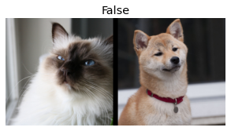

* [Going Deeper into fastai's Layered API](#going-deeper-into-fastai's-layered-api)
* [TfmdLists and Datasets: Transformed Collections](#tfmdlists-and-datasets-transformed-collections)
* [Applying the Mid-Level Data API: SiamesePair](#applying-the-mid-level-data-api-siamesepair)
* [References](#references)


-----

```python
import fastbook
fastbook.setup_book()
```


```python
#hide
from fastbook import *
from IPython.display import display,HTML
```


```python
import inspect
def print_source(obj):
    for line in inspect.getsource(obj).split("\n"):
        print(line)
```


## Going Deeper into fastai's Layered API
* fastai is built on a layered API


```python
from fastai.text.all import *
```


```python
print_source(TextDataLoaders.from_folder)
```
```text
    @classmethod
    @delegates(DataLoaders.from_dblock)
    def from_folder(cls, path, train='train', valid='valid', valid_pct=None, seed=None, vocab=None, text_vocab=None, is_lm=False,
                    tok_tfm=None, seq_len=72, backwards=False, **kwargs):
        "Create from imagenet style dataset in `path` with `train` and `valid` subfolders (or provide `valid_pct`)"
        splitter = GrandparentSplitter(train_name=train, valid_name=valid) if valid_pct is None else RandomSplitter(valid_pct, seed=seed)
        blocks = [TextBlock.from_folder(path, text_vocab, is_lm, seq_len, backwards, tok=tok_tfm)]
        if not is_lm: blocks.append(CategoryBlock(vocab=vocab))
        get_items = partial(get_text_files, folders=[train,valid]) if valid_pct is None else get_text_files
        dblock = DataBlock(blocks=blocks,
                           get_items=get_items,
                           splitter=splitter,
                           get_y=None if is_lm else parent_label)
        return cls.from_dblock(dblock, path, path=path, seq_len=seq_len, **kwargs)
```


```python
dls = TextDataLoaders.from_folder(untar_data(URLs.IMDB), valid='test')
```

**Note:** The above `from_folder` method expects the dataset to be arranged in a certain way.


```python
path = untar_data(URLs.IMDB)
path
```
```text
Path('/home/innom-dt/.fastai/data/imdb')
```


### Mide-Level API
* contains functionality for creating DataLoaders
* Has a *callback* system which allows us to customize the training loop, along with the general optimizer

#### Data Block API
* Allows us to define custom approaches for loading data from datasets


```python
print_source(DataBlock)
```
```text
@docs
@funcs_kwargs
class DataBlock():
    "Generic container to quickly build `Datasets` and `DataLoaders`"
    get_x=get_items=splitter=get_y = None
    blocks,dl_type = (TransformBlock,TransformBlock),TfmdDL
    _methods = 'get_items splitter get_y get_x'.split()
    _msg = "If you wanted to compose several transforms in your getter don't forget to wrap them in a `Pipeline`."
    def __init__(self, blocks=None, dl_type=None, getters=None, n_inp=None, item_tfms=None, batch_tfms=None, **kwargs):
        blocks = L(self.blocks if blocks is None else blocks)
        blocks = L(b() if callable(b) else b for b in blocks)
        self.type_tfms = blocks.attrgot('type_tfms', L())
        self.default_item_tfms  = _merge_tfms(*blocks.attrgot('item_tfms',  L()))
        self.default_batch_tfms = _merge_tfms(*blocks.attrgot('batch_tfms', L()))
        for b in blocks:
            if getattr(b, 'dl_type', None) is not None: self.dl_type = b.dl_type
        if dl_type is not None: self.dl_type = dl_type
        self.dataloaders = delegates(self.dl_type.__init__)(self.dataloaders)
        self.dls_kwargs = merge(*blocks.attrgot('dls_kwargs', {}))

        self.n_inp = ifnone(n_inp, max(1, len(blocks)-1))
        self.getters = ifnone(getters, [noop]*len(self.type_tfms))
        if self.get_x:
            if len(L(self.get_x)) != self.n_inp:
                raise ValueError(f'get_x contains {len(L(self.get_x))} functions, but must contain {self.n_inp} (one for each input)\n{self._msg}')
            self.getters[:self.n_inp] = L(self.get_x)
        if self.get_y:
            n_targs = len(self.getters) - self.n_inp
            if len(L(self.get_y)) != n_targs:
                raise ValueError(f'get_y contains {len(L(self.get_y))} functions, but must contain {n_targs} (one for each target)\n{self._msg}')
            self.getters[self.n_inp:] = L(self.get_y)

        if kwargs: raise TypeError(f'invalid keyword arguments: {", ".join(kwargs.keys())}')
        self.new(item_tfms, batch_tfms)

    def _combine_type_tfms(self): return L([self.getters, self.type_tfms]).map_zip(
        lambda g,tt: (g.fs if isinstance(g, Pipeline) else L(g)) + tt)

    def new(self, item_tfms=None, batch_tfms=None):
        self.item_tfms  = _merge_tfms(self.default_item_tfms,  item_tfms)
        self.batch_tfms = _merge_tfms(self.default_batch_tfms, batch_tfms)
        return self

    @classmethod
    def from_columns(cls, blocks=None, getters=None, get_items=None, **kwargs):
        if getters is None: getters = L(ItemGetter(i) for i in range(2 if blocks is None else len(L(blocks))))
        get_items = _zip if get_items is None else compose(get_items, _zip)
        return cls(blocks=blocks, getters=getters, get_items=get_items, **kwargs)

    def datasets(self, source, verbose=False):
        self.source = source                     ; pv(f"Collecting items from {source}", verbose)
        items = (self.get_items or noop)(source) ; pv(f"Found {len(items)} items", verbose)
        splits = (self.splitter or RandomSplitter())(items)
        pv(f"{len(splits)} datasets of sizes {','.join([str(len(s)) for s in splits])}", verbose)
        return Datasets(items, tfms=self._combine_type_tfms(), splits=splits, dl_type=self.dl_type, n_inp=self.n_inp, verbose=verbose)

    def dataloaders(self, source, path='.', verbose=False, **kwargs):
        dsets = self.datasets(source, verbose=verbose)
        kwargs = {**self.dls_kwargs, **kwargs, 'verbose': verbose}
        return dsets.dataloaders(path=path, after_item=self.item_tfms, after_batch=self.batch_tfms, **kwargs)

    _docs = dict(new="Create a new `DataBlock` with other `item_tfms` and `batch_tfms`",
                 datasets="Create a `Datasets` object from `source`",
                 dataloaders="Create a `DataLoaders` object from `source`")
```


```python
print_source(TextBlock.from_folder)
```
```text
    @classmethod
    @delegates(Tokenizer.from_folder, keep=True)
    def from_folder(cls, path, vocab=None, is_lm=False, seq_len=72, backwards=False, min_freq=3, max_vocab=60000, **kwargs):
        "Build a `TextBlock` from a `path`"
        return cls(Tokenizer.from_folder(path, **kwargs), vocab=vocab, is_lm=is_lm, seq_len=seq_len,
                   backwards=backwards, min_freq=min_freq, max_vocab=max_vocab)
```


```python
print_source(CategoryBlock)
```
```text
def CategoryBlock(vocab=None, sort=True, add_na=False):
    "`TransformBlock` for single-label categorical targets"
    return TransformBlock(type_tfms=Categorize(vocab=vocab, sort=sort, add_na=add_na))
```


```python
dls = DataBlock(
    blocks=(TextBlock.from_folder(path),CategoryBlock),
    get_y = parent_label,
    get_items=partial(get_text_files, folders=['train', 'test']),
    splitter=GrandparentSplitter(valid_name='test')
).dataloaders(path)
```

### Transforms
* A Transform object implements any encoding, setup steps for an inner state, and decoding steps required for a type of data
* Not every type of Transform needs to implement setup steps
* Data augmentation transforms do not need a decode method
* Transforms always get applied over tuples
    * data is almost always in a tuple of (input, target)


```python
Transform
```
```text
fastcore.transform.Transform
```


```python
print_source(Transform)
```
```text
class Transform(metaclass=_TfmMeta):
    "Delegates (`__call__`,`decode`,`setup`) to (<code>encodes</code>,<code>decodes</code>,<code>setups</code>) if `split_idx` matches"
    split_idx,init_enc,order,train_setup = None,None,0,None
    def __init__(self, enc=None, dec=None, split_idx=None, order=None):
        self.split_idx = ifnone(split_idx, self.split_idx)
        if order is not None: self.order=order
        self.init_enc = enc or dec
        if not self.init_enc: return

        self.encodes,self.decodes,self.setups = TypeDispatch(),TypeDispatch(),TypeDispatch()
        if enc:
            self.encodes.add(enc)
            self.order = getattr(enc,'order',self.order)
            if len(type_hints(enc)) > 0: self.input_types = first(type_hints(enc).values())
            self._name = _get_name(enc)
        if dec: self.decodes.add(dec)

    @property
    def name(self): return getattr(self, '_name', _get_name(self))
    def __call__(self, x, **kwargs): return self._call('encodes', x, **kwargs)
    def decode  (self, x, **kwargs): return self._call('decodes', x, **kwargs)
    def __repr__(self): return f'{self.name}:\nencodes: {self.encodes}decodes: {self.decodes}'

    def setup(self, items=None, train_setup=False):
        train_setup = train_setup if self.train_setup is None else self.train_setup
        return self.setups(getattr(items, 'train', items) if train_setup else items)

    def _call(self, fn, x, split_idx=None, **kwargs):
        if split_idx!=self.split_idx and self.split_idx is not None: return x
        return self._do_call(getattr(self, fn), x, **kwargs)

    def _do_call(self, f, x, **kwargs):
        if not _is_tuple(x):
            if f is None: return x
            ret = f.returns(x) if hasattr(f,'returns') else None
            return retain_type(f(x, **kwargs), x, ret)
        res = tuple(self._do_call(f, x_, **kwargs) for x_ in x)
        return retain_type(res, x)
```


```python
TypeDispatch
```
```text
fastcore.dispatch.TypeDispatch
```


```python
print_source(TypeDispatch)
```
```text
class TypeDispatch:
    "Dictionary-like object; `__getitem__` matches keys of types using `issubclass`"
    def __init__(self, funcs=(), bases=()):
        self.funcs,self.bases = _TypeDict(),L(bases).filter(is_not(None))
        for o in L(funcs): self.add(o)
        self.inst = None
        self.owner = None

    def add(self, f):
        "Add type `t` and function `f`"
        if isinstance(f, staticmethod): a0,a1 = _p2_anno(f.__func__)
        else: a0,a1 = _p2_anno(f)
        t = self.funcs.d.get(a0)
        if t is None:
            t = _TypeDict()
            self.funcs.add(a0, t)
        t.add(a1, f)

    def first(self):
        "Get first function in ordered dict of type:func."
        return self.funcs.first().first()

    def returns(self, x):
        "Get the return type of annotation of `x`."
        return anno_ret(self[type(x)])

    def _attname(self,k): return getattr(k,'__name__',str(k))
    def __repr__(self):
        r = [f'({self._attname(k)},{self._attname(l)}) -> {getattr(v, "__name__", type(v).__name__)}'
             for k in self.funcs.d for l,v in self.funcs[k].d.items()]
        r = r + [o.__repr__() for o in self.bases]
        return '\n'.join(r)

    def __call__(self, *args, **kwargs):
        ts = L(args).map(type)[:2]
        f = self[tuple(ts)]
        if not f: return args[0]
        if isinstance(f, staticmethod): f = f.__func__
        elif self.inst is not None: f = MethodType(f, self.inst)
        elif self.owner is not None: f = MethodType(f, self.owner)
        return f(*args, **kwargs)

    def __get__(self, inst, owner):
        self.inst = inst
        self.owner = owner
        return self

    def __getitem__(self, k):
        "Find first matching type that is a super-class of `k`"
        k = L(k)
        while len(k)<2: k.append(object)
        r = self.funcs.all_matches(k[0])
        for t in r:
            o = t[k[1]]
            if o is not None: return o
        for base in self.bases:
            res = base[k]
            if res is not None: return res
        return None
```


```python
# Get list of individual text files
files = get_text_files(path, folders = ['train', 'test'])
# Extract contents of text files
txts = L(o.open().read() for o in files[:2000])
```


```python
print_source(Tokenizer.from_folder)
```
```text
    @classmethod
    @delegates(tokenize_folder, keep=True)
    def from_folder(cls, path, tok=None, rules=None, **kwargs):
        path = Path(path)
        if tok is None: tok = WordTokenizer()
        output_dir = tokenize_folder(path, tok=tok, rules=rules, **kwargs)
        res = cls(tok, counter=load_pickle(output_dir/fn_counter_pkl),
                  lengths=load_pickle(output_dir/fn_lengths_pkl), rules=rules, mode='folder')
        res.path,res.output_dir = path,output_dir
        return res
```


```python
print_source(tokenize_folder)
```
```text
@delegates(_tokenize_files)
def tokenize_folder(path, extensions=None, folders=None, output_dir=None, skip_if_exists=True, **kwargs):
    "Tokenize text files in `path` in parallel using `n_workers`"
    path,extensions = Path(path),ifnone(extensions, ['.txt'])
    files = get_files(path, extensions=extensions, recurse=True, folders=folders)
    def _f(i,output_dir): return output_dir/files[i].relative_to(path)
    return _tokenize_files(_f, files, path, skip_if_exists=skip_if_exists, **kwargs)
```


```python
tok = Tokenizer.from_folder(path)
tok.setup(txts)
toks = txts.map(tok)
toks[0]
```
```text
(#177) ['xxbos','xxmaj','this','conglomeration','fails','so','miserably','on','every','level'...]
```


```python
# Initialize the numericalizer
num = Numericalize()
# Set up vocab
num.setup(toks)
# Get number for tokens
nums = toks.map(num)
nums[0][:10]
```
```text
TensorText([   2,    8,   20,    0,  615,   49, 1689,   35,  195,  599])
```


```python
# Decode numbers to tokens
nums_dec = num.decode(nums[0][:10]); nums_dec
```
```text
(#10) ['xxbos','xxmaj','this','xxunk','fails','so','miserably','on','every','level']
```


```python
# Decode numericalized list of tokens to a single string of words
tok.decode(nums_dec)
```
```text
'xxbos xxmaj this xxunk fails so miserably on every level'
```


**Note:** The default WordTokenizer cannot decode special tokens back to the original text.


```python
# Tokenize a single tuple of (input, target)
tok((txts[0], txts[1]))
```
```text
((#177) ['xxbos','xxmaj','this','conglomeration','fails','so','miserably','on','every','level'...],
 (#562) ['xxbos','xxmaj','jacqueline','xxmaj','susann','wrote','several','novels','all','involving'...])
```


### Writing Your Own Transform
* easiest way is to write a function
    * specify a type in the function signature so the transform is only applied to the target data types
* Transforms that require either setup or decode, need to be implemented as a subclass of Transform


```python
# Simple transform function that adds 1 to an int
def f(x:int): return x+1
# Initialize a Transform object with the transform function
tfm = Transform(f)
# Try to apply the transform to an in and a float
tfm(2),tfm(2.0)
```
```text
(3, 2.0)
```


#### Python Decorators
* special syntax for passing a function to another function (or something like a function)
* used by prepending a callable with a `@` and placing it before a function definition
* [PEP 318 – Decorators for Functions and Methods](https://peps.python.org/pep-0318/)
* [Primer on Python Decorators](https://realpython.com/primer-on-python-decorators/)

#### Python typing.Callable
* [Documentation](https://docs.python.org/3/library/typing.html#typing.Callable)
* Something that can be called
* a function or something like a function
* Need to use a 


```python
@Transform
def f(x:int): return x+1
f(2),f(2.0)
```
```text
(3, 2.0)
```


```python
class NormalizeMean(Transform):
    # Calculate the mean for the dataset and maintain it as inner state
    def setups(self, items): self.mean = sum(items)/len(items)
    # Encode items by substracting the mean
    def encodes(self, x): return x-self.mean
    # Decode items by adding the mean
    def decodes(self, x): return x+self.mean
```


```python
# Instantiate the custom transform
tfm = NormalizeMean()
# Initialize the inner state for the transform
# (i.e. calculate the mean for the dataset)
tfm.setup([1,2,3,4,5])
start = 2
# Apply transform to the value 2
y = tfm(start)
z = tfm.decode(y)
tfm.mean,y,z
```
```text
(3.0, -1.0, 2.0)
```


### Pipeline
* compose several transforms together
* pass in a list of Transforms
* calls the Transforms in sequential order
* Need to use a [TfmdLists](https://docs.fast.ai/data.core.html#TfmdLists) to properly setup a pipeline of transforms on some data.


```python
Pipeline
```
```text
fastcore.transform.Pipeline
```


```python
print_source(Pipeline)
```
```text
class Pipeline:
    "A pipeline of composed (for encode/decode) transforms, setup with types"
    def __init__(self, funcs=None, split_idx=None):
        self.split_idx,self.default = split_idx,None
        if funcs is None: funcs = []
        if isinstance(funcs, Pipeline): self.fs = funcs.fs
        else:
            if isinstance(funcs, Transform): funcs = [funcs]
            self.fs = L(ifnone(funcs,[noop])).map(mk_transform).sorted(key='order')
        for f in self.fs:
            name = camel2snake(type(f).__name__)
            a = getattr(self,name,None)
            if a is not None: f = L(a)+f
            setattr(self, name, f)

    def setup(self, items=None, train_setup=False):
        tfms = self.fs[:]
        self.fs.clear()
        for t in tfms: self.add(t,items, train_setup)

    def add(self,ts, items=None, train_setup=False):
        if not is_listy(ts): ts=[ts]
        for t in ts: t.setup(items, train_setup)
        self.fs+=ts
        self.fs = self.fs.sorted(key='order')

    def __call__(self, o): return compose_tfms(o, tfms=self.fs, split_idx=self.split_idx)
    def __repr__(self): return f"Pipeline: {' -> '.join([f.name for f in self.fs if f.name != 'noop'])}"
    def __getitem__(self,i): return self.fs[i]
    def __setstate__(self,data): self.__dict__.update(data)
    def __getattr__(self,k): return gather_attrs(self, k, 'fs')
    def __dir__(self): return super().__dir__() + gather_attr_names(self, 'fs')

    def decode  (self, o, full=True):
        if full: return compose_tfms(o, tfms=self.fs, is_enc=False, reverse=True, split_idx=self.split_idx)
        #Not full means we decode up to the point the item knows how to show itself.
        for f in reversed(self.fs):
            if self._is_showable(o): return o
            o = f.decode(o, split_idx=self.split_idx)
        return o

    def show(self, o, ctx=None, **kwargs):
        o = self.decode(o, full=False)
        o1 = (o,) if not _is_tuple(o) else o
        if hasattr(o, 'show'): ctx = o.show(ctx=ctx, **kwargs)
        else:
            for o_ in o1:
                if hasattr(o_, 'show'): ctx = o_.show(ctx=ctx, **kwargs)
        return ctx

    def _is_showable(self, o):
        if hasattr(o, 'show'): return True
        if _is_tuple(o): return all(hasattr(o_, 'show') for o_ in o)
        return False
```


```python
camel2snake
```
```text
<function fastcore.basics.camel2snake(name)>
```


```python
print_source(camel2snake)
```
```text
def camel2snake(name):
    "Convert CamelCase to snake_case"
    s1   = re.sub(_camel_re1, r'\1_\2', name)
    return re.sub(_camel_re2, r'\1_\2', s1).lower()
```


```python
# Create a pipeline that first tokenizes and then numericalizes a text dataset
tfms = Pipeline([tok, num])
t = tfms(txts[0]); t[:20]
```
```text
TensorText([   2,    8,   20,    0,  615,   49, 1689,   35,  195,  599,   21,   17,   16, 1088,   15, 1177,   65,   15,  145,   10])
```


```python
tfms.decode(t)[:100]
```
```text
'xxbos xxmaj this xxunk fails so miserably on every level that it is difficult to decide what to say '
```


## TfmdLists and Datasets: Transformed Collections
* your data is usually a set of raw items to which you want to apply a succession of transformations

### [TfmdLists](https://docs.fast.ai/data.core.html#TfmdLists)
* groups your pipeline with your raw items
* use when you have manually written a Transform that performs all your preprocessing at once, which turns raw items into a tuple with inputs and targets
* pass in items and a list of Transforms
* automatically calls the setup method of each Transform in order when initialized
* can index into the TfmdLists to get the result of the Pipeline on any raw element
* knows how to properly decode transformed items
* can handle a training and validation set
* can directly convert a TfmdLists to a DataLoaders object with the dataloaders method (inherited from [FilteredBase](https://docs.fast.ai/data.core.html#FilteredBase))

</br>

**Note:** You will typically have two or more parallel pipelines of transforms:
* one for processing your raw items into inputs
* one to process your raw items into targets


```python
TfmdLists
```
```text
fastai.data.core.TfmdLists
```


```python
print_source(TfmdLists)
```
```text
class TfmdLists(FilteredBase, L, GetAttr):
    "A `Pipeline` of `tfms` applied to a collection of `items`"
    _default='tfms'
    def __init__(self, items, tfms, use_list=None, do_setup=True, split_idx=None, train_setup=True,
                 splits=None, types=None, verbose=False, dl_type=None):
        super().__init__(items, use_list=use_list)
        if dl_type is not None: self._dl_type = dl_type
        self.splits = L([slice(None),[]] if splits is None else splits).map(mask2idxs)
        if isinstance(tfms,TfmdLists): tfms = tfms.tfms
        if isinstance(tfms,Pipeline): do_setup=False
        self.tfms = Pipeline(tfms, split_idx=split_idx)
        store_attr('types,split_idx')
        if do_setup:
            pv(f"Setting up {self.tfms}", verbose)
            self.setup(train_setup=train_setup)

    def _new(self, items, split_idx=None, **kwargs):
        split_idx = ifnone(split_idx,self.split_idx)
        return super()._new(items, tfms=self.tfms, do_setup=False, types=self.types, split_idx=split_idx, **kwargs)
    def subset(self, i): return self._new(self._get(self.splits[i]), split_idx=i)
    def _after_item(self, o): return self.tfms(o)
    def __repr__(self): return f"{self.__class__.__name__}: {self.items}\ntfms - {self.tfms.fs}"
    def __iter__(self): return (self[i] for i in range(len(self)))
    def show(self, o, **kwargs): return self.tfms.show(o, **kwargs)
    def decode(self, o, **kwargs): return self.tfms.decode(o, **kwargs)
    def __call__(self, o, **kwargs): return self.tfms.__call__(o, **kwargs)
    def overlapping_splits(self): return L(Counter(self.splits.concat()).values()).filter(gt(1))
    def new_empty(self): return self._new([])

    def setup(self, train_setup=True):
        self.tfms.setup(self, train_setup)
        if len(self) != 0:
            x = super().__getitem__(0) if self.splits is None else super().__getitem__(self.splits[0])[0]
            self.types = []
            for f in self.tfms.fs:
                self.types.append(getattr(f, 'input_types', type(x)))
                x = f(x)
            self.types.append(type(x))
        types = L(t if is_listy(t) else [t] for t in self.types).concat().unique()
        self.pretty_types = '\n'.join([f'  - {t}' for t in types])

    def infer_idx(self, x):
        # TODO: check if we really need this, or can simplify
        idx = 0
        for t in self.types:
            if isinstance(x, t): break
            idx += 1
        types = L(t if is_listy(t) else [t] for t in self.types).concat().unique()
        pretty_types = '\n'.join([f'  - {t}' for t in types])
        assert idx < len(self.types), f"Expected an input of type in \n{pretty_types}\n but got {type(x)}"
        return idx

    def infer(self, x):
        return compose_tfms(x, tfms=self.tfms.fs[self.infer_idx(x):], split_idx=self.split_idx)

    def __getitem__(self, idx):
        res = super().__getitem__(idx)
        if self._after_item is None: return res
        return self._after_item(res) if is_indexer(idx) else res.map(self._after_item)
```


```python
print_source(FilteredBase)
```
```text
class FilteredBase:
    "Base class for lists with subsets"
    _dl_type,_dbunch_type = TfmdDL,DataLoaders
    def __init__(self, *args, dl_type=None, **kwargs):
        if dl_type is not None: self._dl_type = dl_type
        self.dataloaders = delegates(self._dl_type.__init__)(self.dataloaders)
        super().__init__(*args, **kwargs)

    @property
    def n_subsets(self): return len(self.splits)
    def _new(self, items, **kwargs): return super()._new(items, splits=self.splits, **kwargs)
    def subset(self): raise NotImplemented

    def dataloaders(self, bs=64, shuffle_train=None, shuffle=True, val_shuffle=False,n=None, path='.', dl_type=None, dl_kwargs=None,
                    device=None,drop_last=None,val_bs=None, **kwargs):
        if shuffle_train is not None:
            shuffle=shuffle_train
            warnings.warn('`shuffle_train` is deprecated. Use `shuffle` instead.',DeprecationWarning)
        if device is None: device=default_device()
        if dl_kwargs is None: dl_kwargs = [{}] * self.n_subsets
        if dl_type is None: dl_type = self._dl_type
        if drop_last is None: drop_last = shuffle
        val_kwargs={k[4:]:v for k,v in kwargs.items() if k.startswith('val_')}
        def_kwargs = {'bs':bs,'shuffle':shuffle,'drop_last':drop_last,'n':n,'device':device}
        dl = dl_type(self.subset(0), **merge(kwargs,def_kwargs, dl_kwargs[0]))
        def_kwargs = {'bs':bs if val_bs is None else val_bs,'shuffle':val_shuffle,'n':None,'drop_last':False}
        dls = [dl] + [dl.new(self.subset(i), **merge(kwargs,def_kwargs,val_kwargs,dl_kwargs[i]))
                      for i in range(1, self.n_subsets)]
        return self._dbunch_type(*dls, path=path, device=device)
```


```python
tls = TfmdLists(files, [Tokenizer.from_folder(path), Numericalize])
```


```python
t = tls[0]; t[:20]
```
```text
TensorText([    2,     8,    20, 33649,  1033,    52,  3265,    35,   193,   649,    21,    17,    16,   890,    15,  1156,    65,    15,   159,    10])
```


```python
tls.decode(t)[:100]
```
```text
'xxbos xxmaj this conglomeration fails so miserably on every level that it is difficult to decide wha'
```


**Note:** The sentence is properly decoded including the word "conglomeration".


```python
tls.show(t)
```
```text
xxbos xxmaj this conglomeration fails so miserably on every level that it is difficult to decide what to say . xxmaj it does n't merit one line , much less ten , but to adhere to the rules of imdb , here goes and i probably wo n't succeed the first time around and have to type some more to make up for this submission to be accepted . xxup lol 

 xxmaj if i had seen this schlock during the ' 70s while i was going through my mushroom phase , i would have still considered it unimaginative and shallow . xxmaj the most exciting shot for me was the long shot when the elevator door opened and xxunk was on the edge of my seat . 

 xxmaj one person on here wrote that he had met the creator of this mess , as if that were a red letter day in his life . xxmaj one can only pray that something far more exciting occurs in that posters xxunk a grip , amigo .
```


```python
# Define how many files to keep in the training set
cut = int(len(files)*0.8)
cut
```
```text
40000
```


```python
# Split the files into a training and validation set
splits = [list(range(cut)), list(range(cut,len(files)))]
len(splits[0]), len(splits[1])
```
```text
(40000, 10000)
```


```python
# Initialize a TfmdLists with indices for a training and validation set
tls = TfmdLists(files, [Tokenizer.from_folder(path), Numericalize], 
                splits=splits)
```


```python
tls.valid[0][:20]
```
```text
TensorText([   2,    8,    9,  107,   77,   19,   87,    9, 1836,   14, 1438,   15,   86,   20,   45,   31, 1524,  393,   25,  164])
```


```python
parent_label
```
```text
<function fastai.data.transforms.parent_label(o)>
```


```python
print_source(parent_label)
```
```text
def parent_label(o):
    "Label `item` with the parent folder name."
    return Path(o).parent.name
```


```python
# Label files based on the parent folder name
lbls = files.map(parent_label)
lbls
```
```text
(#50000) ['neg','neg','neg','neg','neg','neg','neg','neg','neg','neg'...]
```


```python
Categorize
```
```text
fastai.data.transforms.Categorize
```


```python
print_source(Categorize)
```
```text
class Categorize(DisplayedTransform):
    "Reversible transform of category string to `vocab` id"
    loss_func,order=CrossEntropyLossFlat(),1
    def __init__(self, vocab=None, sort=True, add_na=False):
        if vocab is not None: vocab = CategoryMap(vocab, sort=sort, add_na=add_na)
        store_attr()

    def setups(self, dsets):
        if self.vocab is None and dsets is not None: self.vocab = CategoryMap(dsets, sort=self.sort, add_na=self.add_na)
        self.c = len(self.vocab)

    def encodes(self, o):
        try:
            return TensorCategory(self.vocab.o2i[o])
        except KeyError as e:
            raise KeyError(f"Label '{o}' was not included in the training dataset") from e
    def decodes(self, o): return Category      (self.vocab    [o])
```


```python
# Grab all unique items and build a vocab
cat = Categorize()
cat.setup(lbls)
cat.vocab, cat(lbls[0])
```


```python
# Create a TfmdLists that labels items using the parent folder name and build a vocab
tls_y = TfmdLists(files, [parent_label, Categorize()])
tls_y[0]
```
```text
TensorCategory(0)
```


### Datasets
* applies two (or more) pipelines in parallel to the same raw object and build a tuple with the result
* automatically performs the setup steps
* can index into a Datasets to get a tuple with the results of each pipeline
* can pass along a splits value for a training and validation split
* can decode any processed tuple
* can directly convert a Datasets to a DataLoaders object with the dataloaders method (inherited from [FilteredBase](https://docs.fast.ai/data.core.html#FilteredBase))


```python
Datasets
```
```text
fastai.data.core.Datasets
```


```python
print_source(Datasets)
```
```text
@docs
@delegates(TfmdLists)
class Datasets(FilteredBase):
    "A dataset that creates a tuple from each `tfms`"
    def __init__(self, items=None, tfms=None, tls=None, n_inp=None, dl_type=None, **kwargs):
        super().__init__(dl_type=dl_type)
        self.tls = L(tls if tls else [TfmdLists(items, t, **kwargs) for t in L(ifnone(tfms,[None]))])
        self.n_inp = ifnone(n_inp, max(1, len(self.tls)-1))

    def __getitem__(self, it):
        res = tuple([tl[it] for tl in self.tls])
        return res if is_indexer(it) else list(zip(*res))

    def __getattr__(self,k): return gather_attrs(self, k, 'tls')
    def __dir__(self): return super().__dir__() + gather_attr_names(self, 'tls')
    def __len__(self): return len(self.tls[0])
    def __iter__(self): return (self[i] for i in range(len(self)))
    def __repr__(self): return coll_repr(self)
    def decode(self, o, full=True): return tuple(tl.decode(o_, full=full) for o_,tl in zip(o,tuplify(self.tls, match=o)))
    def subset(self, i): return type(self)(tls=L(tl.subset(i) for tl in self.tls), n_inp=self.n_inp)
    def _new(self, items, *args, **kwargs): return super()._new(items, tfms=self.tfms, do_setup=False, **kwargs)
    def overlapping_splits(self): return self.tls[0].overlapping_splits()
    def new_empty(self): return type(self)(tls=[tl.new_empty() for tl in self.tls], n_inp=self.n_inp)
    @property
    def splits(self): return self.tls[0].splits
    @property
    def split_idx(self): return self.tls[0].tfms.split_idx
    @property
    def items(self): return self.tls[0].items
    @items.setter
    def items(self, v):
        for tl in self.tls: tl.items = v

    def show(self, o, ctx=None, **kwargs):
        for o_,tl in zip(o,self.tls): ctx = tl.show(o_, ctx=ctx, **kwargs)
        return ctx

    @contextmanager
    def set_split_idx(self, i):
        old_split_idx = self.split_idx
        for tl in self.tls: tl.tfms.split_idx = i
        try: yield self
        finally:
            for tl in self.tls: tl.tfms.split_idx = old_split_idx

    _docs=dict(
        decode="Compose `decode` of all `tuple_tfms` then all `tfms` on `i`",
        show="Show item `o` in `ctx`",
        dataloaders="Get a `DataLoaders`",
        overlapping_splits="All splits that are in more than one split",
        subset="New `Datasets` that only includes subset `i`",
        new_empty="Create a new empty version of the `self`, keeping only the transforms",
        set_split_idx="Contextmanager to use the same `Datasets` with another `split_idx`"
    )
```


```python
# Tokenize and numericalize inputs
x_tfms = [Tokenizer.from_folder(path), Numericalize]
# Label and categorize targets
y_tfms = [parent_label, Categorize()]
# Initialize a Datasets
dsets = Datasets(files, [x_tfms, y_tfms])
x,y = dsets[0]
x[:20],y
```
```text
(TensorText([    2,     8,    20, 33649,  1033,    52,  3265,    35,   193,   649,    21,    17,    16,   890,    15,  1156,    65,    15,   159,    10]),
 TensorCategory(0))
```


```python
# Tokenize and numericalize inputs
x_tfms = [Tokenizer.from_folder(path), Numericalize]
# Label and categorize targets
y_tfms = [parent_label, Categorize()]
# Initialize a Datasets with a splits
dsets = Datasets(files, [x_tfms, y_tfms], splits=splits)
x,y = dsets.valid[0]
x[:20],y
```
```text
(TensorText([   2,    8,    9,  107,   77,   19,   87,    9, 1836,   14, 1438,   15,   86,   20,   45,   31, 1524,  393,   25,  164]),
 TensorCategory(1))
```


```python
t = dsets.valid[0]
dsets.decode(t)
```
```text
('xxbos xxmaj the first time i had the window of opportunity to see this all but forgotten classic was back in the early xxunk , at one of our art houses as a revival . xxmaj as i watched this fever dream of an exercise in 1930 \'s sexuality , i thought xxup yowza ! xxmaj they got away with murder in xxmaj europe back in the day . xxmaj unfortunately , this film was heavily cut in it \'s original xxup u.s . release by the blue nosed xxmaj hayes xxmaj office ( the staunch government censorship board , started by the " holier than thou " xxmaj bible thumper , xxmaj will xxmaj hayes … a former xxmaj post xxmaj office official , if you can believe xxunk to it \'s overall theme of human sexuality ( heaven \'s forbid humans actually had sex in the 1930 \'s ) . xxmaj the plot of xxmaj ecstasy concerns a young woman ( played by xxmaj hedy xxmaj xxunk marries a much older man , and later regrets it . xxmaj she ( xxunk a handsome younger man & has an affair with him , resulting in a divorce from previous husband ( another no no in xxmaj hollywood movies back then xxrep 3 - xxmaj divorce ! ) . xxmaj despite the fact that the film was produced in 1933 , it was probably the director \'s first time working in the sound format ( i.e. the film seems to possess techniques that were used mostly in silent films xxrep 3 - i.e. 1920 \'s expressionism \'s ) . xxmaj it \'s still worth searching out for a window into early xxmaj european talking pictures , along with xxmaj luis xxmaj bunuels l\'age xxmaj dor ( xxunk xxmaj karl xxmaj gustav xxmaj dryer \'s \' vampyre \' ( 1931 ) . xxmaj not rated , but contains that infamous nude swimming scene & some thinly veiled sexual references , which would fare little more than a xxup pg-13 by today \'s standards ( but would have easily landed the dreaded \' xxunk in the xxunk , if it existed then )',
 'pos')
```


```python
print(type(pad_input))
pad_input
```
```text
<class 'fastai.text.data.Pad_Input'>
```


```text
Pad_Input:
encodes: (object,object) -> encodes
decodes: (TensorText,object) -> decodes
```


```python
print_source(Pad_Input)
```
```text
class Pad_Input(ItemTransform):
    def encodes(self,samples, pad_idx=1, pad_fields=0, pad_first=False, backwards=False):
        "Function that collect `samples` and adds padding"
        self.pad_idx = pad_idx
        pad_fields = L(pad_fields)
        max_len_l = pad_fields.map(lambda f: max([len(s[f]) for s in samples]))
        if backwards: pad_first = not pad_first
        def _f(field_idx, x):
            if field_idx not in pad_fields: return x
            idx = pad_fields.items.index(field_idx) #TODO: remove items if L.index is fixed
            sl = slice(-len(x), sys.maxsize) if pad_first else slice(0, len(x))
            pad =  x.new_zeros(max_len_l[idx]-x.shape[0])+pad_idx
            x1 = torch.cat([pad, x] if pad_first else [x, pad])
            if backwards: x1 = x1.flip(0)
            return retain_type(x1, x)
        return [tuple(map(lambda idxx: _f(*idxx), enumerate(s))) for s in samples]
    def decodes(self, o:TensorText):
        pad_idx = self.pad_idx if hasattr(self,'pad_idx') else 1
        return o[o != pad_idx]
```


### DataLoader
* fastai's DataLoader expands on the [PyTorch DataLoader](https://pytorch.org/docs/stable/data.html#torch.utils.data.DataLoader) class
* responsible for collating the items from a dataset into batches

**after_item:**
* applied on each item after grabbing it inside the dataset
* equivalent of `item_tfms` in DataBlock

**before_batch:**
* applied on the list of items before they are collated.
* ideal place to pad items ot the same size

**after_batch:**
* applied on the batch as a whole after its construction
* equivalent of `batch_tfms` in DataBlock


```python
DataLoader
```
```text
fastai.data.load.DataLoader
```


```python
print_source(DataLoader)
```
```text
@funcs_kwargs
class DataLoader(GetAttr):
    _noop_methods = 'wif before_iter after_item before_batch after_batch after_iter'.split()
    for o in _noop_methods: exec(f"def {o}(self, x=None, *args, **kwargs): return x")
    _methods = _noop_methods + 'create_batches create_item create_batch retain \
        get_idxs sample shuffle_fn do_batch create_batch'.split()
    _default = 'dataset'
    def __init__(self, dataset=None, bs=None, num_workers=0, pin_memory=False, timeout=0, batch_size=None,
                 shuffle=False, drop_last=False, indexed=None, n=None, device=None, persistent_workers=False, **kwargs):
        if batch_size is not None: bs = batch_size # PyTorch compatibility
        assert not (bs is None and drop_last)
        if indexed is None: indexed = (hasattr(dataset,'__getitem__')
                                       and not isinstance(dataset, IterableDataset))
        if not indexed and shuffle: raise ValueError("Can only shuffle an indexed dataset (not an iterable one).")
        if n is None:
            try: n = len(dataset)
            except TypeError: pass
        store_attr('dataset,bs,shuffle,drop_last,indexed,n,pin_memory,timeout,device')
        self.rng,self.num_workers,self.offs = random.Random(random.randint(0,2**32-1)),1,0
        if sys.platform == "win32" and IN_NOTEBOOK and num_workers > 0:
            print("Due to IPython and Windows limitation, python multiprocessing isn't available now.")
            print("So `number_workers` is changed to 0 to avoid getting stuck")
            num_workers = 0
        self.fake_l = _FakeLoader(self, pin_memory, num_workers, timeout, persistent_workers=persistent_workers)

    def __len__(self):
        if self.n is None: raise TypeError
        if self.bs is None: return self.n
        return self.n//self.bs + (0 if self.drop_last or self.n%self.bs==0 else 1)

    def get_idxs(self):
        idxs = Inf.count if self.indexed else Inf.nones
        if self.n is not None: idxs = list(itertools.islice(idxs, self.n))
        if self.shuffle: idxs = self.shuffle_fn(idxs)
        return idxs

    def sample(self):
        return (b for i,b in enumerate(self.__idxs) if i//(self.bs or 1)%self.num_workers==self.offs)

    def __iter__(self):
        self.randomize()
        self.before_iter()
        self.__idxs=self.get_idxs() # called in context of main process (not workers/subprocesses)
        for b in _loaders[self.fake_l.num_workers==0](self.fake_l):
            if self.device is not None: b = to_device(b, self.device)
            yield self.after_batch(b)
        self.after_iter()
        if hasattr(self, 'it'): del(self.it)

    def create_batches(self, samps):
        if self.dataset is not None: self.it = iter(self.dataset)
        res = filter(lambda o:o is not None, map(self.do_item, samps))
        yield from map(self.do_batch, self.chunkify(res))

    def new(self, dataset=None, cls=None, **kwargs):
        if dataset is None: dataset = self.dataset
        if cls is None: cls = type(self)
        cur_kwargs = dict(dataset=dataset, num_workers=self.fake_l.num_workers, pin_memory=self.pin_memory, timeout=self.timeout,
                          bs=self.bs, shuffle=self.shuffle, drop_last=self.drop_last, indexed=self.indexed, device=self.device)
        for n in self._methods:
            o = getattr(self, n)
            if not isinstance(o, MethodType): cur_kwargs[n] = o
        return cls(**merge(cur_kwargs, kwargs))

    @property
    def prebatched(self): return self.bs is None
    def do_item(self, s):
        try: return self.after_item(self.create_item(s))
        except SkipItemException: return None
    def chunkify(self, b): return b if self.prebatched else chunked(b, self.bs, self.drop_last)
    def shuffle_fn(self, idxs): return self.rng.sample(idxs, len(idxs))
    def randomize(self): self.rng = random.Random(self.rng.randint(0,2**32-1))
    def retain(self, res, b):  return retain_types(res, b[0] if is_listy(b) else b)
    def create_item(self, s):
        if self.indexed: return self.dataset[s or 0]
        elif s is None:  return next(self.it)
        else: raise IndexError("Cannot index an iterable dataset numerically - must use `None`.")
    def create_batch(self, b): return (fa_collate,fa_convert)[self.prebatched](b)
    def do_batch(self, b): return self.retain(self.create_batch(self.before_batch(b)), b)
    def to(self, device): self.device = device
    def one_batch(self):
        if self.n is not None and len(self)==0: raise ValueError(f'This DataLoader does not contain any batches')
        with self.fake_l.no_multiproc(): res = first(self)
        if hasattr(self, 'it'): delattr(self, 'it')
        return res
```


```python
GetAttr
```
```text
fastcore.basics.GetAttr
```


```python
print_source(GetAttr)
```
```text
class GetAttr:
    "Inherit from this to have all attr accesses in `self._xtra` passed down to `self.default`"
    _default='default'
    def _component_attr_filter(self,k):
        if k.startswith('__') or k in ('_xtra',self._default): return False
        xtra = getattr(self,'_xtra',None)
        return xtra is None or k in xtra
    def _dir(self): return [k for k in dir(getattr(self,self._default)) if self._component_attr_filter(k)]
    def __getattr__(self,k):
        if self._component_attr_filter(k):
            attr = getattr(self,self._default,None)
            if attr is not None: return getattr(attr,k)
        raise AttributeError(k)
    def __dir__(self): return custom_dir(self,self._dir())
#     def __getstate__(self): return self.__dict__
    def __setstate__(self,data): self.__dict__.update(data)
```


```python
# Create a DataLoaders object from the Datasets object
# Add padding to input before batch
dls = dsets.dataloaders(bs=64, before_batch=pad_input)
```

#### SortedDL
* constructs batches by putting samples of roughly the same lengths into batches


```python
print_source(SortedDL)
```
```text
@delegates(TfmdDL)
class SortedDL(TfmdDL):
    "A `DataLoader` that goes throught the item in the order given by `sort_func`"
    def __init__(self, dataset, sort_func=None, res=None, **kwargs):
        super().__init__(dataset, **kwargs)
        self.sort_func = _default_sort if sort_func is None else sort_func
        if res is None and self.sort_func == _default_sort: res = _get_lengths(dataset)
        self.res = [self.sort_func(self.do_item(i)) for i in range_of(self.dataset)] if res is None else res
        if len(self.res) > 0: self.idx_max = np.argmax(self.res)

    def get_idxs(self):
        idxs = super().get_idxs()
        if self.shuffle: return idxs
        return sorted(idxs, key=lambda i: self.res[i], reverse=True)

    def shuffle_fn(self,idxs):
        idxs = np.random.permutation(len(self.dataset))
        idx_max = np.where(idxs==self.idx_max)[0][0]
        idxs[0],idxs[idx_max] = idxs[idx_max],idxs[0]
        sz = self.bs*50
        chunks = [idxs[i:i+sz] for i in range(0, len(idxs), sz)]
        chunks = [sorted(s, key=lambda i: self.res[i], reverse=True) for s in chunks]
        sort_idx = np.concatenate(chunks)

        sz = self.bs
        batches = [sort_idx[i:i+sz] for i in range(0, len(sort_idx), sz)]
        sort_idx = np.concatenate(np.random.permutation(batches[1:-1])) if len(batches) > 2 else np.array([],dtype=np.int)
        sort_idx = np.concatenate((batches[0], sort_idx) if len(batches)==1 else (batches[0], sort_idx, batches[-1]))
        return iter(sort_idx)

    @delegates(TfmdDL.new)
    def new(self, dataset=None, **kwargs):
        if 'val_res' in kwargs and kwargs['val_res'] is not None: res = kwargs['val_res']
        else: res = self.res if dataset is None else None
        return super().new(dataset=dataset, res=res, **kwargs)
```


```python
# Full code necessary to prepare the data for text classification
tfms = [[Tokenizer.from_folder(path), Numericalize], [parent_label, Categorize]]
files = get_text_files(path, folders = ['train', 'test'])
splits = GrandparentSplitter(valid_name='test')(files)
dsets = Datasets(files, tfms, splits=splits)
dls = dsets.dataloaders(dl_type=SortedDL, before_batch=pad_input)
```


## Applying the Mid-Level Data API: SiamesePair

### Siamese Model
* takes two images and has to determine whether they are of the same class


```python
from fastai.vision.all import *
```


```python
path = untar_data(URLs.PETS)
path
```
```text
Path('/home/innom-dt/.fastai/data/oxford-iiit-pet')
```


```python
files = get_image_files(path/"images")
files
```
```text
(#7390) [Path('/home/innom-dt/.fastai/data/oxford-iiit-pet/images/Birman_121.jpg'),Path('/home/innom-dt/.fastai/data/oxford-iiit-pet/images/shiba_inu_131.jpg'),Path('/home/innom-dt/.fastai/data/oxford-iiit-pet/images/Bombay_176.jpg'),Path('/home/innom-dt/.fastai/data/oxford-iiit-pet/images/Bengal_199.jpg'),Path('/home/innom-dt/.fastai/data/oxford-iiit-pet/images/beagle_41.jpg'),Path('/home/innom-dt/.fastai/data/oxford-iiit-pet/images/beagle_27.jpg'),Path('/home/innom-dt/.fastai/data/oxford-iiit-pet/images/great_pyrenees_181.jpg'),Path('/home/innom-dt/.fastai/data/oxford-iiit-pet/images/Bengal_100.jpg'),Path('/home/innom-dt/.fastai/data/oxford-iiit-pet/images/keeshond_124.jpg'),Path('/home/innom-dt/.fastai/data/oxford-iiit-pet/images/havanese_115.jpg')...]
```


```python
fastuple
```
```text
fastcore.basics.fastuple
```


```python
print_source(fastuple)
```
```text
class fastuple(tuple):
    "A `tuple` with elementwise ops and more friendly __init__ behavior"
    def __new__(cls, x=None, *rest):
        if x is None: x = ()
        if not isinstance(x,tuple):
            if len(rest): x = (x,)
            else:
                try: x = tuple(iter(x))
                except TypeError: x = (x,)
        return super().__new__(cls, x+rest if rest else x)

    def _op(self,op,*args):
        if not isinstance(self,fastuple): self = fastuple(self)
        return type(self)(map(op,self,*map(cycle, args)))

    def mul(self,*args):
        "`*` is already defined in `tuple` for replicating, so use `mul` instead"
        return fastuple._op(self, operator.mul,*args)

    def add(self,*args):
        "`+` is already defined in `tuple` for concat, so use `add` instead"
        return fastuple._op(self, operator.add,*args)
```


```python
# Custom type to allow us to show siamese image pairs
# Tracks whether the two images belong to the same class
class SiameseImage(fastuple):
    # Implement a custom show method to display the image pair
    def show(self, ctx=None, **kwargs): 
        img1,img2,same_breed = self
        # Convert to Tensors
        if not isinstance(img1, Tensor):
            # Resize images to the same size
            if img2.size != img1.size: img2 = img2.resize(img1.size)
            t1,t2 = tensor(img1),tensor(img2)
            # Reorder color channels
            t1,t2 = t1.permute(2,0,1),t2.permute(2,0,1)
        else: t1,t2 = img1,img2
        # Create a separating line between the two images
        line = t1.new_zeros(t1.shape[0], t1.shape[1], 10)
        return show_image(torch.cat([t1,line,t2], dim=2), 
                          title=same_breed, ctx=ctx)
```


```python
img = PILImage.create(files[0])
# Create a siamese pair of the same image
s = SiameseImage(img, img, True)
s.show();
```


```python
img1 = PILImage.create(files[1])
s1 = SiameseImage(img, img1, False)
s1.show();
```


```python
Resize
```
```text
fastai.vision.augment.Resize
```


```python
print_source(Resize)
```
```text
@delegates()
class Resize(RandTransform):
    split_idx,mode,mode_mask,order = None,Image.BILINEAR,Image.NEAREST,1
    "Resize image to `size` using `method`"
    def __init__(self, size, method=ResizeMethod.Crop, pad_mode=PadMode.Reflection,
                 resamples=(Image.BILINEAR, Image.NEAREST), **kwargs):
        size = _process_sz(size)
        store_attr()
        super().__init__(**kwargs)
        self.mode,self.mode_mask = resamples

    def before_call(self, b, split_idx):
        if self.method==ResizeMethod.Squish: return
        self.pcts = (0.5,0.5) if split_idx else (random.random(),random.random())

    def encodes(self, x:(Image.Image,TensorBBox,TensorPoint)):
        orig_sz = _get_sz(x)
        if self.method==ResizeMethod.Squish:
            return x.crop_pad(orig_sz, fastuple(0,0), orig_sz=orig_sz, pad_mode=self.pad_mode,
                   resize_mode=self.mode_mask if isinstance(x,PILMask) else self.mode, resize_to=self.size)

        w,h = orig_sz
        op = (operator.lt,operator.gt)[self.method==ResizeMethod.Pad]
        m = w/self.size[0] if op(w/self.size[0],h/self.size[1]) else h/self.size[1]
        cp_sz = (int(m*self.size[0]),int(m*self.size[1]))
        tl = fastuple(int(self.pcts[0]*(w-cp_sz[0])), int(self.pcts[1]*(h-cp_sz[1])))
        return x.crop_pad(cp_sz, tl, orig_sz=orig_sz, pad_mode=self.pad_mode,
                   resize_mode=self.mode_mask if isinstance(x,PILMask) else self.mode, resize_to=self.size)
```


```python
s2 = Resize(224)(s1)
s2.show();
```



```python
# Label images by filename
def label_func(fname):
    return re.match(r'^(.*)_\d+.jpg$', fname.name).groups()[0]
```


```python
class SiameseTransform(Transform):
    def __init__(self, files, label_func, splits):
        # Generate list of unique labels
        self.labels = files.map(label_func).unique()
        # Create a dictionary to match labels to filenames
        self.lbl2files = {l: L(f for f in files if label_func(f) == l) 
                          for l in self.labels}
        self.label_func = label_func
        self.valid = {f: self._draw(f) for f in files[splits[1]]}
        
    def encodes(self, f):
        f2,t = self.valid.get(f, self._draw(f))
        img1,img2 = PILImage.create(f),PILImage.create(f2)
        # Create siamese image pair
        return SiameseImage(img1, img2, t)
    
    def _draw(self, f):
        # 50/50 chance of generating a pair of the same class
        same = random.random() < 0.5
        cls = self.label_func(f)
        if not same: 
            cls = random.choice(L(l for l in self.labels if l != cls)) 
        return random.choice(self.lbl2files[cls]),same
```


```python
print_source(RandomSplitter)
```
```text
def RandomSplitter(valid_pct=0.2, seed=None):
    "Create function that splits `items` between train/val with `valid_pct` randomly."
    def _inner(o):
        if seed is not None: torch.manual_seed(seed)
        rand_idx = L(list(torch.randperm(len(o)).numpy()))
        cut = int(valid_pct * len(o))
        return rand_idx[cut:],rand_idx[:cut]
    return _inner
```


```python
help(torch.randperm)
```
```text
Help on built-in function randperm:

randperm(...)
    randperm(n, *, generator=None, out=None, dtype=torch.int64,layout=torch.strided, device=None, requires_grad=False, pin_memory=False) -> Tensor
    
    Returns a random permutation of integers from ``0`` to ``n - 1``.
    
    Args:
        n (int): the upper bound (exclusive)
    
    Keyword args:
        generator (:class:`torch.Generator`, optional): a pseudorandom number generator for sampling
        out (Tensor, optional): the output tensor.
        dtype (:class:`torch.dtype`, optional): the desired data type of returned tensor.
            Default: ``torch.int64``.
        layout (:class:`torch.layout`, optional): the desired layout of returned Tensor.
            Default: ``torch.strided``.
        device (:class:`torch.device`, optional): the desired device of returned tensor.
            Default: if ``None``, uses the current device for the default tensor type
            (see :func:`torch.set_default_tensor_type`). :attr:`device` will be the CPU
            for CPU tensor types and the current CUDA device for CUDA tensor types.
        requires_grad (bool, optional): If autograd should record operations on the
            returned tensor. Default: ``False``.
        pin_memory (bool, optional): If set, returned tensor would be allocated in
            the pinned memory. Works only for CPU tensors. Default: ``False``.
    
    Example::
    
        >>> torch.randperm(4)
        tensor([2, 1, 0, 3])
```


```python
splits = RandomSplitter()(files)
tfm = SiameseTransform(files, label_func, splits)
tfm(files[0]).show();
```


```python
tls = TfmdLists(files, tfm, splits=splits)
show_at(tls.valid, 0);
```


```python
ToTensor
```
```text
fastai.data.transforms.ToTensor
```


```python
print_source(ToTensor)
```
```text
class ToTensor(Transform):
    "Convert item to appropriate tensor class"
    order = 5
```


```python
IntToFloatTensor
```
```text
fastai.data.transforms.IntToFloatTensor
```


```python
print_source(IntToFloatTensor)
```
```text
class IntToFloatTensor(DisplayedTransform):
    "Transform image to float tensor, optionally dividing by 255 (e.g. for images)."
    order = 10 #Need to run after PIL transforms on the GPU
    def __init__(self, div=255., div_mask=1): store_attr()
    def encodes(self, o:TensorImage): return o.float().div_(self.div)
    def encodes(self, o:TensorMask ): return o.long() // self.div_mask
    def decodes(self, o:TensorImage): return ((o.clamp(0., 1.) * self.div).long()) if self.div else o
```


```python
Normalize.from_stats
```
```text
<bound method Normalize.from_stats of <class 'fastai.data.transforms.Normalize'>>
```


```python
print_source(Normalize.from_stats)
```
```text
    @classmethod
    def from_stats(cls, mean, std, dim=1, ndim=4, cuda=True): return cls(*broadcast_vec(dim, ndim, mean, std, cuda=cuda))
```


```python
broadcast_vec
```
```text
<function fastai.data.transforms.broadcast_vec(dim, ndim, *t, cuda=True)>
```


```python
print_source(broadcast_vec)
```
```text
def broadcast_vec(dim, ndim, *t, cuda=True):
    "Make a vector broadcastable over `dim` (out of `ndim` total) by prepending and appending unit axes"
    v = [1]*ndim
    v[dim] = -1
    f = to_device if cuda else noop
    return [f(tensor(o).view(*v)) for o in t]
```


```python
dls = tls.dataloaders(after_item=[Resize(224), ToTensor], 
    after_batch=[IntToFloatTensor, Normalize.from_stats(*imagenet_stats)])
```


## References

* [Deep Learning for Coders with fastai & PyTorch](https://www.oreilly.com/library/view/deep-learning-for/9781492045519/)
* [The fastai book GitHub Repository](https://github.com/fastai/fastbook)