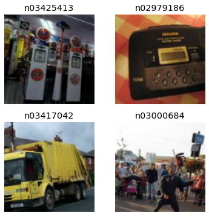
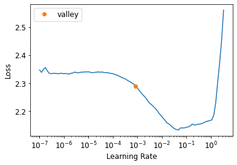
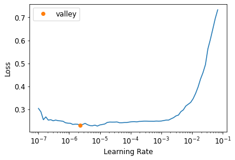
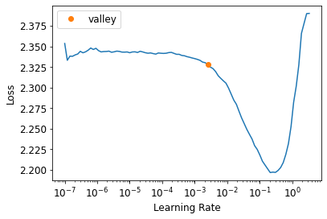

* [ResNets](#resnets)
* [Going Back to Imagenette](#going-back-to-imagenette)
* [Building a Modern CNN: ResNet](#building-a-modern-cnn-resnet)
* [References](#references)


-----

```python
#hide
# !pip install -Uqq fastbook
import fastbook
fastbook.setup_book()
```


```python
#hide
from fastbook import *
```


```python
import inspect
def print_source(obj):
    for line in inspect.getsource(obj).split("\n"):
        print(line)
```


## ResNets

* [Deep Residual Learning for Image Recognition](https://arxiv.org/abs/1512.03385)
    * introduced the concept of residual (skip) connections


## Going Back to Imagenette


```python
def get_data(url, presize, resize):
    path = untar_data(url)
    print(path)
    return DataBlock(
        blocks=(ImageBlock, CategoryBlock), get_items=get_image_files, 
        splitter=GrandparentSplitter(valid_name='val'),
        get_y=parent_label, item_tfms=Resize(presize),
        batch_tfms=[*aug_transforms(min_scale=0.5, size=resize),
                    Normalize.from_stats(*imagenet_stats)],
    ).dataloaders(path, bs=128)
```


```python
URLs.IMAGENETTE_160
```
```text
'https://s3.amazonaws.com/fast-ai-imageclas/imagenette2-160.tgz'
```


```python
dls = get_data(URLs.IMAGENETTE_160, 160, 128)
```


```python
dls.show_batch(max_n=4)
```



### Average Pooling
* take the average of activations across a convolutional grid
* an alternative to the approach of using stride-2 layers to downscale input dimensions to the a single output vector
* used in fully convolutional networks to allow the model to be used on image sizes other than what the model was trained on

**Note:** A fully convolutional network is a good choice when the objects you want to classify don't have a single correct orientation or size (e.g. most natural photos)
* It would not be a good choice for applications like MNIST where their is a fixed correct orientation for each character


```python
# Take the mean over the x and y axes
# Will always convert a grid of activations into a single activation per image
def avg_pool(x): return x.mean((2,3))
```


```python
def block(ni, nf): return ConvLayer(ni, nf, stride=2)
def get_model():
    return nn.Sequential(
        block(3, 16),
        block(16, 32),
        block(32, 64),
        block(64, 128),
        block(128, 256),
        nn.AdaptiveAvgPool2d(1),
        Flatten(),
        nn.Linear(256, dls.c))
```


```python
ConvLayer
```
```text
fastai.layers.ConvLayer
```


```python
print_source(ConvLayer)
```
```text
class ConvLayer(nn.Sequential):
    "Create a sequence of convolutional (`ni` to `nf`), ReLU (if `use_activ`) and `norm_type` layers."
    @delegates(nn.Conv2d)
    def __init__(self, ni, nf, ks=3, stride=1, padding=None, bias=None, ndim=2, norm_type=NormType.Batch, bn_1st=True,
                 act_cls=defaults.activation, transpose=False, init='auto', xtra=None, bias_std=0.01, **kwargs):
        if padding is None: padding = ((ks-1)//2 if not transpose else 0)
        bn = norm_type in (NormType.Batch, NormType.BatchZero)
        inn = norm_type in (NormType.Instance, NormType.InstanceZero)
        if bias is None: bias = not (bn or inn)
        conv_func = _conv_func(ndim, transpose=transpose)
        conv = conv_func(ni, nf, kernel_size=ks, bias=bias, stride=stride, padding=padding, **kwargs)
        act = None if act_cls is None else act_cls()
        init_linear(conv, act, init=init, bias_std=bias_std)
        if   norm_type==NormType.Weight:   conv = weight_norm(conv)
        elif norm_type==NormType.Spectral: conv = spectral_norm(conv)
        layers = [conv]
        act_bn = []
        if act is not None: act_bn.append(act)
        if bn: act_bn.append(BatchNorm(nf, norm_type=norm_type, ndim=ndim))
        if inn: act_bn.append(InstanceNorm(nf, norm_type=norm_type, ndim=ndim))
        if bn_1st: act_bn.reverse()
        layers += act_bn
        if xtra: layers.append(xtra)
        super().__init__(*layers)
```


#### Adaptive Average Pooling
* averages a grid of activations into whatever sized destination you require


```python
nn.AdaptiveAvgPool2d
```
```text
torch.nn.modules.pooling.AdaptiveAvgPool2d
```


* input: $(N, C, H_{in}, W_{in})$ or $(C, H_{in}, W_{in})$
* output: $(N, C, S_{0}, S_{1})$ or $(C, S_{0}, S_{1})$, where $S=output_size$


```python
print_source(nn.AdaptiveAvgPool2d)
```
```text
class AdaptiveAvgPool2d(_AdaptiveAvgPoolNd):
    r"""Applies a 2D adaptive average pooling over an input signal composed of several input planes.

    The output is of size H x W, for any input size.
    The number of output features is equal to the number of input planes.

    Args:
        output_size: the target output size of the image of the form H x W.
                     Can be a tuple (H, W) or a single H for a square image H x H.
                     H and W can be either a ``int``, or ``None`` which means the size will
                     be the same as that of the input.

    Shape:
        - Input: :math:`(N, C, H_{in}, W_{in})` or :math:`(C, H_{in}, W_{in})`.
        - Output: :math:`(N, C, S_{0}, S_{1})` or :math:`(C, S_{0}, S_{1})`, where
          :math:`S=\text{output\_size}`.

    Examples:
        >>> # target output size of 5x7
        >>> m = nn.AdaptiveAvgPool2d((5,7))
        >>> input = torch.randn(1, 64, 8, 9)
        >>> output = m(input)
        >>> # target output size of 7x7 (square)
        >>> m = nn.AdaptiveAvgPool2d(7)
        >>> input = torch.randn(1, 64, 10, 9)
        >>> output = m(input)
        >>> # target output size of 10x7
        >>> m = nn.AdaptiveAvgPool2d((None, 7))
        >>> input = torch.randn(1, 64, 10, 9)
        >>> output = m(input)

    """

    output_size: _size_2_opt_t

    def forward(self, input: Tensor) -> Tensor:
        return F.adaptive_avg_pool2d(input, self.output_size)
```


```python
def get_learner(m):
    return Learner(dls, m, loss_func=nn.CrossEntropyLoss(), metrics=accuracy
                  ).to_fp16()

learn = get_learner(get_model())
```


```python
learn.model
```
```text
Sequential(
  (0): ConvLayer(
    (0): Conv2d(3, 16, kernel_size=(3, 3), stride=(2, 2), padding=(1, 1), bias=False)
    (1): BatchNorm2d(16, eps=1e-05, momentum=0.1, affine=True, track_running_stats=True)
    (2): ReLU()
  )
  (1): ConvLayer(
    (0): Conv2d(16, 32, kernel_size=(3, 3), stride=(2, 2), padding=(1, 1), bias=False)
    (1): BatchNorm2d(32, eps=1e-05, momentum=0.1, affine=True, track_running_stats=True)
    (2): ReLU()
  )
  (2): ConvLayer(
    (0): Conv2d(32, 64, kernel_size=(3, 3), stride=(2, 2), padding=(1, 1), bias=False)
    (1): BatchNorm2d(64, eps=1e-05, momentum=0.1, affine=True, track_running_stats=True)
    (2): ReLU()
  )
  (3): ConvLayer(
    (0): Conv2d(64, 128, kernel_size=(3, 3), stride=(2, 2), padding=(1, 1), bias=False)
    (1): BatchNorm2d(128, eps=1e-05, momentum=0.1, affine=True, track_running_stats=True)
    (2): ReLU()
  )
  (4): ConvLayer(
    (0): Conv2d(128, 256, kernel_size=(3, 3), stride=(2, 2), padding=(1, 1), bias=False)
    (1): BatchNorm2d(256, eps=1e-05, momentum=0.1, affine=True, track_running_stats=True)
    (2): ReLU()
  )
  (5): AdaptiveAvgPool2d(output_size=1)
  (6): Flatten(full=False)
  (7): Linear(in_features=256, out_features=10, bias=True)
)
```


```python
learn.lr_find()
```
```text
SuggestedLRs(valley=0.0008317637839354575)
```




```python
learn.fit_one_cycle(5, 3e-3)
```
<div style="overflow-x:auto;">
<table border="1" class="dataframe">
  <thead>
    <tr style="text-align: left;">
      <th>epoch</th>
      <th>train_loss</th>
      <th>valid_loss</th>
      <th>accuracy</th>
      <th>time</th>
    </tr>
  </thead>
  <tbody>
    <tr>
      <td>0</td>
      <td>1.885349</td>
      <td>2.287517</td>
      <td>0.341401</td>
      <td>00:03</td>
    </tr>
    <tr>
      <td>1</td>
      <td>1.525377</td>
      <td>2.245459</td>
      <td>0.395159</td>
      <td>00:03</td>
    </tr>
    <tr>
      <td>2</td>
      <td>1.290083</td>
      <td>1.217583</td>
      <td>0.609172</td>
      <td>00:03</td>
    </tr>
    <tr>
      <td>3</td>
      <td>1.145256</td>
      <td>1.164249</td>
      <td>0.631338</td>
      <td>00:03</td>
    </tr>
    <tr>
      <td>4</td>
      <td>1.045142</td>
      <td>1.064749</td>
      <td>0.668025</td>
      <td>00:03</td>
    </tr>
  </tbody>
</table>
</div>

**Note:** We won't necessarily get better results simply by adding more layers. 


```python
learn = get_learner(
    nn.Sequential(
        block(3, 16),
        block(16, 32),
        block(32, 64),
        block(64, 128),
        block(128, 256),
        block(256, 512),
        block(512, 1024),
        nn.AdaptiveAvgPool2d(1),
        Flatten(),
        nn.Linear(1024, dls.c)))
learn.lr_find()
```
```text
SuggestedLRs(valley=0.0002754228771664202)
```


```python
learn.fit_one_cycle(10, 0.03)
```
<div style="overflow-x:auto;">
<table border="1" class="dataframe">
  <thead>
    <tr style="text-align: left;">
      <th>epoch</th>
      <th>train_loss</th>
      <th>valid_loss</th>
      <th>accuracy</th>
      <th>time</th>
    </tr>
  </thead>
  <tbody>
    <tr>
      <td>0</td>
      <td>1.826138</td>
      <td>3.406225</td>
      <td>0.314395</td>
      <td>00:03</td>
    </tr>
    <tr>
      <td>1</td>
      <td>1.752539</td>
      <td>3.521486</td>
      <td>0.296051</td>
      <td>00:03</td>
    </tr>
    <tr>
      <td>2</td>
      <td>1.531295</td>
      <td>2.125122</td>
      <td>0.382420</td>
      <td>00:03</td>
    </tr>
    <tr>
      <td>3</td>
      <td>1.322462</td>
      <td>1.528130</td>
      <td>0.530955</td>
      <td>00:04</td>
    </tr>
    <tr>
      <td>4</td>
      <td>1.180348</td>
      <td>1.409803</td>
      <td>0.559236</td>
      <td>00:03</td>
    </tr>
    <tr>
      <td>5</td>
      <td>1.112325</td>
      <td>1.155497</td>
      <td>0.638217</td>
      <td>00:03</td>
    </tr>
    <tr>
      <td>6</td>
      <td>0.977593</td>
      <td>0.918580</td>
      <td>0.706242</td>
      <td>00:03</td>
    </tr>
    <tr>
      <td>7</td>
      <td>0.870830</td>
      <td>1.019607</td>
      <td>0.680000</td>
      <td>00:03</td>
    </tr>
    <tr>
      <td>8</td>
      <td>0.780924</td>
      <td>0.779768</td>
      <td>0.750573</td>
      <td>00:03</td>
    </tr>
    <tr>
      <td>9</td>
      <td>0.706074</td>
      <td>0.767961</td>
      <td>0.759490</td>
      <td>00:03</td>
    </tr>
  </tbody>
</table>
</div>


**Note:** Needed to train for more epochs to achieve the same accuracy.


## Building a Modern CNN: ResNet

### Skip Connections
* skip connections make the network easier to train with SGD
    * `x + conv2(conv1(x))`
* Identity Mapping: returning the input without changing it at all
* residual: prediction minus target

* The authors of the [ResNet paper](https://arxiv.org/abs/1512.03385) noticed that a network with more layers performed worse than a network with fewer layers, all other factors being equal
    * this was true on both the training and validation sets
* Key Insight:
    * start with a model with fewer layers that is trained well, and add more layers to it that do nothing at all
    the result should be a larger network that does exactly the same thing as the smaller network, proving there are always deep networks that should be at least as good as a more shallow network
    * however, SGD was not finding these
* Using skip connections also helps smooth the loss function, which makes training easier

**Note:** Use zero for the initial value of gamma in batch normalization
* allows training at higher learning rates
* recall: $y*gamma + beta$


```python
class ResBlock(Module):
    def __init__(self, ni, nf):
        self.convs = nn.Sequential(
            ConvLayer(ni,nf),
            ConvLayer(nf,nf, norm_type=NormType.BatchZero))
        
    def forward(self, x): return x + self.convs(x)
```

**Note:** The above implementation requires the stride to be 1 and `ni==nf` in order for `x + self.convs(x)` to work.
* Need to change the shape of `x` to match the result of `self.convs(x)`
    * Can use an average pooling layer with a stride of 2 to change the shape
    * Can use a 1x1 convolution to change the number of channels


```python
def _conv_block(ni,nf,stride):
    return nn.Sequential(
        ConvLayer(ni, nf, stride=stride),
        ConvLayer(nf, nf, act_cls=None, norm_type=NormType.BatchZero))
```


```python
class ResBlock(Module):
    def __init__(self, ni, nf, stride=1):
        self.convs = _conv_block(ni,nf,stride)
        self.idconv = noop if ni==nf else ConvLayer(ni, nf, 1, act_cls=None)
        self.pool = noop if stride==1 else nn.AvgPool2d(2, ceil_mode=True)

    def forward(self, x):
        return F.relu(self.convs(x) + self.idconv(self.pool(x)))
```


```python
noop
```
```text
<function fastai.imports.noop(x=None, *args, **kwargs)>
```


```python
print_source(noop)
```
```text
def noop (x=None, *args, **kwargs):
    "Do nothing"
    return x
```


```python
def block(ni,nf): return ResBlock(ni, nf, stride=2)
learn = get_learner(get_model())
```


```python
learn.model
```
```text
Sequential(
  (0): ResBlock(
    (convs): Sequential(
      (0): ConvLayer(
        (0): Conv2d(3, 16, kernel_size=(3, 3), stride=(2, 2), padding=(1, 1), bias=False)
        (1): BatchNorm2d(16, eps=1e-05, momentum=0.1, affine=True, track_running_stats=True)
        (2): ReLU()
      )
      (1): ConvLayer(
        (0): Conv2d(16, 16, kernel_size=(3, 3), stride=(1, 1), padding=(1, 1), bias=False)
        (1): BatchNorm2d(16, eps=1e-05, momentum=0.1, affine=True, track_running_stats=True)
      )
    )
    (idconv): ConvLayer(
      (0): Conv2d(3, 16, kernel_size=(1, 1), stride=(1, 1), bias=False)
      (1): BatchNorm2d(16, eps=1e-05, momentum=0.1, affine=True, track_running_stats=True)
    )
    (pool): AvgPool2d(kernel_size=2, stride=2, padding=0)
  )
  (1): ResBlock(
    (convs): Sequential(
      (0): ConvLayer(
        (0): Conv2d(16, 32, kernel_size=(3, 3), stride=(2, 2), padding=(1, 1), bias=False)
        (1): BatchNorm2d(32, eps=1e-05, momentum=0.1, affine=True, track_running_stats=True)
        (2): ReLU()
      )
      (1): ConvLayer(
        (0): Conv2d(32, 32, kernel_size=(3, 3), stride=(1, 1), padding=(1, 1), bias=False)
        (1): BatchNorm2d(32, eps=1e-05, momentum=0.1, affine=True, track_running_stats=True)
      )
    )
    (idconv): ConvLayer(
      (0): Conv2d(16, 32, kernel_size=(1, 1), stride=(1, 1), bias=False)
      (1): BatchNorm2d(32, eps=1e-05, momentum=0.1, affine=True, track_running_stats=True)
    )
    (pool): AvgPool2d(kernel_size=2, stride=2, padding=0)
  )
  (2): ResBlock(
    (convs): Sequential(
      (0): ConvLayer(
        (0): Conv2d(32, 64, kernel_size=(3, 3), stride=(2, 2), padding=(1, 1), bias=False)
        (1): BatchNorm2d(64, eps=1e-05, momentum=0.1, affine=True, track_running_stats=True)
        (2): ReLU()
      )
      (1): ConvLayer(
        (0): Conv2d(64, 64, kernel_size=(3, 3), stride=(1, 1), padding=(1, 1), bias=False)
        (1): BatchNorm2d(64, eps=1e-05, momentum=0.1, affine=True, track_running_stats=True)
      )
    )
    (idconv): ConvLayer(
      (0): Conv2d(32, 64, kernel_size=(1, 1), stride=(1, 1), bias=False)
      (1): BatchNorm2d(64, eps=1e-05, momentum=0.1, affine=True, track_running_stats=True)
    )
    (pool): AvgPool2d(kernel_size=2, stride=2, padding=0)
  )
  (3): ResBlock(
    (convs): Sequential(
      (0): ConvLayer(
        (0): Conv2d(64, 128, kernel_size=(3, 3), stride=(2, 2), padding=(1, 1), bias=False)
        (1): BatchNorm2d(128, eps=1e-05, momentum=0.1, affine=True, track_running_stats=True)
        (2): ReLU()
      )
      (1): ConvLayer(
        (0): Conv2d(128, 128, kernel_size=(3, 3), stride=(1, 1), padding=(1, 1), bias=False)
        (1): BatchNorm2d(128, eps=1e-05, momentum=0.1, affine=True, track_running_stats=True)
      )
    )
    (idconv): ConvLayer(
      (0): Conv2d(64, 128, kernel_size=(1, 1), stride=(1, 1), bias=False)
      (1): BatchNorm2d(128, eps=1e-05, momentum=0.1, affine=True, track_running_stats=True)
    )
    (pool): AvgPool2d(kernel_size=2, stride=2, padding=0)
  )
  (4): ResBlock(
    (convs): Sequential(
      (0): ConvLayer(
        (0): Conv2d(128, 256, kernel_size=(3, 3), stride=(2, 2), padding=(1, 1), bias=False)
        (1): BatchNorm2d(256, eps=1e-05, momentum=0.1, affine=True, track_running_stats=True)
        (2): ReLU()
      )
      (1): ConvLayer(
        (0): Conv2d(256, 256, kernel_size=(3, 3), stride=(1, 1), padding=(1, 1), bias=False)
        (1): BatchNorm2d(256, eps=1e-05, momentum=0.1, affine=True, track_running_stats=True)
      )
    )
    (idconv): ConvLayer(
      (0): Conv2d(128, 256, kernel_size=(1, 1), stride=(1, 1), bias=False)
      (1): BatchNorm2d(256, eps=1e-05, momentum=0.1, affine=True, track_running_stats=True)
    )
    (pool): AvgPool2d(kernel_size=2, stride=2, padding=0)
  )
  (5): AdaptiveAvgPool2d(output_size=1)
  (6): Flatten(full=False)
  (7): Linear(in_features=256, out_features=10, bias=True)
)
```


```python
learn.fit_one_cycle(5, 3e-3)
```
<div style="overflow-x:auto;">
<table border="1" class="dataframe">
  <thead>
    <tr style="text-align: left;">
      <th>epoch</th>
      <th>train_loss</th>
      <th>valid_loss</th>
      <th>accuracy</th>
      <th>time</th>
    </tr>
  </thead>
  <tbody>
    <tr>
      <td>0</td>
      <td>1.975520</td>
      <td>1.854834</td>
      <td>0.346242</td>
      <td>00:04</td>
    </tr>
    <tr>
      <td>1</td>
      <td>1.658158</td>
      <td>1.478215</td>
      <td>0.517197</td>
      <td>00:04</td>
    </tr>
    <tr>
      <td>2</td>
      <td>1.377669</td>
      <td>1.307936</td>
      <td>0.585478</td>
      <td>00:04</td>
    </tr>
    <tr>
      <td>3</td>
      <td>1.162053</td>
      <td>1.106804</td>
      <td>0.642548</td>
      <td>00:04</td>
    </tr>
    <tr>
      <td>4</td>
      <td>1.027879</td>
      <td>1.009977</td>
      <td>0.674140</td>
      <td>00:04</td>
    </tr>
  </tbody>
</table>
</div>


```python
# Try training with a model that is twice as deep
def block(ni, nf):
    return nn.Sequential(ResBlock(ni, nf, stride=2), ResBlock(nf, nf))
```


```python
learn = get_learner(get_model())
learn.fit_one_cycle(5, 3e-3)
```
<div style="overflow-x:auto;">
<table border="1" class="dataframe">
  <thead>
    <tr style="text-align: left;">
      <th>epoch</th>
      <th>train_loss</th>
      <th>valid_loss</th>
      <th>accuracy</th>
      <th>time</th>
    </tr>
  </thead>
  <tbody>
    <tr>
      <td>0</td>
      <td>1.940119</td>
      <td>1.815366</td>
      <td>0.372484</td>
      <td>00:05</td>
    </tr>
    <tr>
      <td>1</td>
      <td>1.602748</td>
      <td>1.461486</td>
      <td>0.526879</td>
      <td>00:05</td>
    </tr>
    <tr>
      <td>2</td>
      <td>1.296337</td>
      <td>1.346131</td>
      <td>0.571210</td>
      <td>00:05</td>
    </tr>
    <tr>
      <td>3</td>
      <td>1.052998</td>
      <td>0.996216</td>
      <td>0.678471</td>
      <td>00:05</td>
    </tr>
    <tr>
      <td>4</td>
      <td>0.926301</td>
      <td>0.901209</td>
      <td>0.713121</td>
      <td>00:05</td>
    </tr>
  </tbody>
</table>
</div>


### A State-of-the-Art ResNet
* [Bag of Tricks for Image Classification with Convolutional Neural Networks](https://arxiv.org/abs/1812.01187)
    * studies variations of the ResNet architecture that come at almost no additional cost in terms of number of parameters or computation
    * used a tweaked ResNet-50 architecture and Mixup to achieve a 94.6% top-5 accuracy on ImageNet compared to 92.2% with a regular ResNet-50 without Mixup

#### Top-5 Accuracy
* a metric testing how often the label we want is in the top-5 predictions of our model
* used in ImageNet competition because many of the images contained multiple objects, or objects that could be easily confused or were mislabeled

#### Stem
* the first few layers of a CNN
* the stem has a different structure than the main body of the CNN
* the vast majority of computation in a deep convolutional network occurs in the early layers
    * we should keep the early layers as fast and simple as possible
* the vast majority of parameters are in the last layers
* a ResNet block takes more computation than a plain convolutional block


```python
def _resnet_stem(*sizes):
    return [
        ConvLayer(sizes[i], sizes[i+1], 3, stride = 2 if i==0 else 1)
            for i in range(len(sizes)-1)
    ] + [nn.MaxPool2d(kernel_size=3, stride=2, padding=1)]
```


```python
_resnet_stem(3,32,32,64)
```
```text
[ConvLayer(
   (0): Conv2d(3, 32, kernel_size=(3, 3), stride=(2, 2), padding=(1, 1), bias=False)
   (1): BatchNorm2d(32, eps=1e-05, momentum=0.1, affine=True, track_running_stats=True)
   (2): ReLU()
 ),
 ConvLayer(
   (0): Conv2d(32, 32, kernel_size=(3, 3), stride=(1, 1), padding=(1, 1), bias=False)
   (1): BatchNorm2d(32, eps=1e-05, momentum=0.1, affine=True, track_running_stats=True)
   (2): ReLU()
 ),
 ConvLayer(
   (0): Conv2d(32, 64, kernel_size=(3, 3), stride=(1, 1), padding=(1, 1), bias=False)
   (1): BatchNorm2d(64, eps=1e-05, momentum=0.1, affine=True, track_running_stats=True)
   (2): ReLU()
 ),
 MaxPool2d(kernel_size=3, stride=2, padding=1, dilation=1, ceil_mode=False)]
```


```python
class ResNet(nn.Sequential):
    def __init__(self, n_out, layers, expansion=1):
        stem = _resnet_stem(3,32,32,64)
        self.block_szs = [64, 64, 128, 256, 512]
        for i in range(1,5): self.block_szs[i] *= expansion
        blocks = [self._make_layer(*o) for o in enumerate(layers)]
        super().__init__(*stem, *blocks,
                         nn.AdaptiveAvgPool2d(1), Flatten(),
                         nn.Linear(self.block_szs[-1], n_out))
    
    def _make_layer(self, idx, n_layers):
        stride = 1 if idx==0 else 2
        ch_in,ch_out = self.block_szs[idx:idx+2]
        return nn.Sequential(*[
            ResBlock(ch_in if i==0 else ch_out, ch_out, stride if i==0 else 1)
            for i in range(n_layers)
        ])
```


```python
rn = ResNet(dls.c, [2,2,2,2])
```


```python
learn = get_learner(rn)
learn.fit_one_cycle(5, 3e-3)
```
<div style="overflow-x:auto;">
<table border="1" class="dataframe">
  <thead>
    <tr style="text-align: left;">
      <th>epoch</th>
      <th>train_loss</th>
      <th>valid_loss</th>
      <th>accuracy</th>
      <th>time</th>
    </tr>
  </thead>
  <tbody>
    <tr>
      <td>0</td>
      <td>1.676334</td>
      <td>3.144195</td>
      <td>0.332229</td>
      <td>00:05</td>
    </tr>
    <tr>
      <td>1</td>
      <td>1.330461</td>
      <td>1.301046</td>
      <td>0.601274</td>
      <td>00:05</td>
    </tr>
    <tr>
      <td>2</td>
      <td>1.081648</td>
      <td>1.654932</td>
      <td>0.530701</td>
      <td>00:05</td>
    </tr>
    <tr>
      <td>3</td>
      <td>0.883710</td>
      <td>0.889572</td>
      <td>0.725096</td>
      <td>00:06</td>
    </tr>
    <tr>
      <td>4</td>
      <td>0.752461</td>
      <td>0.770025</td>
      <td>0.751592</td>
      <td>00:05</td>
    </tr>
  </tbody>
</table>
</div>


**Note:** The optimized stem kept training time just as fast as before despite the model having more channels.

### Bottleneck Layers
* instead of stacking two convolutions with a kernel size of 3, bottleneck layers use three convolutions
    * two $1x1$ (at the beginning and the end) and one $3x3$ 
* $1x1$ convolutions are much faster so the block executes faster than the earlier type of ResNet block above
    * allows us to use more convolutional filters


```python
def _conv_block(ni,nf,stride):
    return nn.Sequential(
        ConvLayer(ni, nf//4, 1),
        ConvLayer(nf//4, nf//4, stride=stride), 
        ConvLayer(nf//4, nf, 1, act_cls=None, norm_type=NormType.BatchZero))
```


```python
# Use bigger images
dls = get_data(URLs.IMAGENETTE_320, presize=320, resize=224)
```
```text
/home/innom-dt/.fastai/data/imagenette2-320
```


```python
rn = ResNet(dls.c, [3,4,6,3], 4)
```

**Note:** Deeper networks like this take more epochs to show improvements in accuracy.


```python
learn = get_learner(rn)
```


```python
learn.lr_find()
```
```text
SuggestedLRs(valley=2.2908675418875646e-06)
```




```python
learn.fit_one_cycle(20, 3e-3)
```
<div style="overflow-x:auto;">
<table border="1" class="dataframe">
  <thead>
    <tr style="text-align: left;">
      <th>epoch</th>
      <th>train_loss</th>
      <th>valid_loss</th>
      <th>accuracy</th>
      <th>time</th>
    </tr>
  </thead>
  <tbody>
    <tr>
      <td>0</td>
      <td>1.631725</td>
      <td>1.667390</td>
      <td>0.491720</td>
      <td>00:26</td>
    </tr>
    <tr>
      <td>1</td>
      <td>1.396282</td>
      <td>1.772770</td>
      <td>0.492739</td>
      <td>00:26</td>
    </tr>
    <tr>
      <td>2</td>
      <td>1.244810</td>
      <td>1.644604</td>
      <td>0.520764</td>
      <td>00:26</td>
    </tr>
    <tr>
      <td>3</td>
      <td>1.147434</td>
      <td>2.000461</td>
      <td>0.433121</td>
      <td>00:26</td>
    </tr>
    <tr>
      <td>4</td>
      <td>1.061841</td>
      <td>1.668560</td>
      <td>0.537580</td>
      <td>00:26</td>
    </tr>
    <tr>
      <td>5</td>
      <td>0.971388</td>
      <td>1.221623</td>
      <td>0.634395</td>
      <td>00:26</td>
    </tr>
    <tr>
      <td>6</td>
      <td>0.875570</td>
      <td>1.315725</td>
      <td>0.606369</td>
      <td>00:26</td>
    </tr>
    <tr>
      <td>7</td>
      <td>0.773697</td>
      <td>1.347997</td>
      <td>0.625987</td>
      <td>00:26</td>
    </tr>
    <tr>
      <td>8</td>
      <td>0.693710</td>
      <td>1.044750</td>
      <td>0.662166</td>
      <td>00:26</td>
    </tr>
    <tr>
      <td>9</td>
      <td>0.642479</td>
      <td>0.847296</td>
      <td>0.715669</td>
      <td>00:26</td>
    </tr>
    <tr>
      <td>10</td>
      <td>0.597677</td>
      <td>0.815032</td>
      <td>0.728662</td>
      <td>00:26</td>
    </tr>
    <tr>
      <td>11</td>
      <td>0.554460</td>
      <td>1.310289</td>
      <td>0.632357</td>
      <td>00:26</td>
    </tr>
    <tr>
      <td>12</td>
      <td>0.504132</td>
      <td>0.645502</td>
      <td>0.797707</td>
      <td>00:26</td>
    </tr>
    <tr>
      <td>13</td>
      <td>0.444430</td>
      <td>0.553372</td>
      <td>0.839490</td>
      <td>00:26</td>
    </tr>
    <tr>
      <td>14</td>
      <td>0.404554</td>
      <td>0.524731</td>
      <td>0.840510</td>
      <td>00:26</td>
    </tr>
    <tr>
      <td>15</td>
      <td>0.363680</td>
      <td>0.430417</td>
      <td>0.869299</td>
      <td>00:26</td>
    </tr>
    <tr>
      <td>16</td>
      <td>0.326445</td>
      <td>0.468357</td>
      <td>0.858854</td>
      <td>00:26</td>
    </tr>
    <tr>
      <td>17</td>
      <td>0.291472</td>
      <td>0.398314</td>
      <td>0.882038</td>
      <td>00:26</td>
    </tr>
    <tr>
      <td>18</td>
      <td>0.273819</td>
      <td>0.441020</td>
      <td>0.865987</td>
      <td>00:26</td>
    </tr>
    <tr>
      <td>19</td>
      <td>0.266643</td>
      <td>0.429735</td>
      <td>0.868280</td>
      <td>00:26</td>
    </tr>
  </tbody>
</table>
</div>


```python
# Try training for much longer with MixUp
rn = ResNet(dls.c, [3,4,6,3], 4)
learn = Learner(dls, rn, loss_func=CrossEntropyLossFlat(), metrics=accuracy, cbs=MixUp).to_fp16()
```


```python
learn.cbs
```
```text
(#5) [TrainEvalCallback,Recorder,ProgressCallback,MixUp,MixedPrecision]
```


```python
learn.lr_find()
```
```text
SuggestedLRs(valley=0.002511886414140463)
```




```python
learn.fit_one_cycle(100, 1e-3)
```
<div style="overflow-x:auto; overflow-y:auto; height:800px">
<table border="1" class="dataframe">
  <thead>
    <tr style="text-align: left;">
      <th>epoch</th>
      <th>train_loss</th>
      <th>valid_loss</th>
      <th>accuracy</th>
      <th>time</th>
    </tr>
  </thead>
  <tbody>
    <tr>
      <td>0</td>
      <td>2.357731</td>
      <td>2.383324</td>
      <td>0.130191</td>
      <td>00:27</td>
    </tr>
    <tr>
      <td>1</td>
      <td>2.336724</td>
      <td>2.336634</td>
      <td>0.139108</td>
      <td>00:27</td>
    </tr>
    <tr>
      <td>2</td>
      <td>2.307106</td>
      <td>2.287395</td>
      <td>0.160764</td>
      <td>00:26</td>
    </tr>
    <tr>
      <td>3</td>
      <td>2.270103</td>
      <td>2.233956</td>
      <td>0.206369</td>
      <td>00:27</td>
    </tr>
    <tr>
      <td>4</td>
      <td>2.230594</td>
      <td>2.175580</td>
      <td>0.248408</td>
      <td>00:27</td>
    </tr>
    <tr>
      <td>5</td>
      <td>2.186367</td>
      <td>2.114939</td>
      <td>0.285605</td>
      <td>00:26</td>
    </tr>
    <tr>
      <td>6</td>
      <td>2.138676</td>
      <td>2.052963</td>
      <td>0.314904</td>
      <td>00:26</td>
    </tr>
    <tr>
      <td>7</td>
      <td>2.093770</td>
      <td>1.997618</td>
      <td>0.340892</td>
      <td>00:26</td>
    </tr>
    <tr>
      <td>8</td>
      <td>2.050327</td>
      <td>1.941644</td>
      <td>0.362038</td>
      <td>00:26</td>
    </tr>
    <tr>
      <td>9</td>
      <td>2.008452</td>
      <td>1.897457</td>
      <td>0.381146</td>
      <td>00:26</td>
    </tr>
    <tr>
      <td>10</td>
      <td>1.976088</td>
      <td>1.857476</td>
      <td>0.393376</td>
      <td>00:26</td>
    </tr>
    <tr>
      <td>11</td>
      <td>1.942721</td>
      <td>1.811248</td>
      <td>0.414013</td>
      <td>00:26</td>
    </tr>
    <tr>
      <td>12</td>
      <td>1.913029</td>
      <td>1.795007</td>
      <td>0.415796</td>
      <td>00:26</td>
    </tr>
    <tr>
      <td>13</td>
      <td>1.887761</td>
      <td>1.753944</td>
      <td>0.427771</td>
      <td>00:26</td>
    </tr>
    <tr>
      <td>14</td>
      <td>1.867352</td>
      <td>1.726478</td>
      <td>0.446369</td>
      <td>00:26</td>
    </tr>
    <tr>
      <td>15</td>
      <td>1.850482</td>
      <td>1.703274</td>
      <td>0.458089</td>
      <td>00:26</td>
    </tr>
    <tr>
      <td>16</td>
      <td>1.820035</td>
      <td>1.656702</td>
      <td>0.478471</td>
      <td>00:26</td>
    </tr>
    <tr>
      <td>17</td>
      <td>1.804909</td>
      <td>1.627078</td>
      <td>0.489172</td>
      <td>00:26</td>
    </tr>
    <tr>
      <td>18</td>
      <td>1.777827</td>
      <td>1.597916</td>
      <td>0.509045</td>
      <td>00:26</td>
    </tr>
    <tr>
      <td>19</td>
      <td>1.754695</td>
      <td>1.580777</td>
      <td>0.500637</td>
      <td>00:26</td>
    </tr>
    <tr>
      <td>20</td>
      <td>1.730523</td>
      <td>1.532980</td>
      <td>0.521274</td>
      <td>00:26</td>
    </tr>
    <tr>
      <td>21</td>
      <td>1.719565</td>
      <td>1.506606</td>
      <td>0.532229</td>
      <td>00:26</td>
    </tr>
    <tr>
      <td>22</td>
      <td>1.699022</td>
      <td>1.465760</td>
      <td>0.549045</td>
      <td>00:26</td>
    </tr>
    <tr>
      <td>23</td>
      <td>1.671000</td>
      <td>1.451764</td>
      <td>0.551083</td>
      <td>00:26</td>
    </tr>
    <tr>
      <td>24</td>
      <td>1.642783</td>
      <td>1.409297</td>
      <td>0.568408</td>
      <td>00:26</td>
    </tr>
    <tr>
      <td>25</td>
      <td>1.624837</td>
      <td>1.379675</td>
      <td>0.586752</td>
      <td>00:26</td>
    </tr>
    <tr>
      <td>26</td>
      <td>1.601221</td>
      <td>1.365560</td>
      <td>0.586752</td>
      <td>00:26</td>
    </tr>
    <tr>
      <td>27</td>
      <td>1.586046</td>
      <td>1.327966</td>
      <td>0.597452</td>
      <td>00:26</td>
    </tr>
    <tr>
      <td>28</td>
      <td>1.569099</td>
      <td>1.349460</td>
      <td>0.584713</td>
      <td>00:26</td>
    </tr>
    <tr>
      <td>29</td>
      <td>1.547596</td>
      <td>1.318505</td>
      <td>0.599236</td>
      <td>00:27</td>
    </tr>
    <tr>
      <td>30</td>
      <td>1.545876</td>
      <td>1.287586</td>
      <td>0.611465</td>
      <td>00:26</td>
    </tr>
    <tr>
      <td>31</td>
      <td>1.516503</td>
      <td>1.269668</td>
      <td>0.616815</td>
      <td>00:26</td>
    </tr>
    <tr>
      <td>32</td>
      <td>1.510151</td>
      <td>1.259776</td>
      <td>0.620892</td>
      <td>00:26</td>
    </tr>
    <tr>
      <td>33</td>
      <td>1.499429</td>
      <td>1.274317</td>
      <td>0.611720</td>
      <td>00:26</td>
    </tr>
    <tr>
      <td>34</td>
      <td>1.492611</td>
      <td>1.246700</td>
      <td>0.622675</td>
      <td>00:26</td>
    </tr>
    <tr>
      <td>35</td>
      <td>1.470544</td>
      <td>1.241083</td>
      <td>0.624204</td>
      <td>00:27</td>
    </tr>
    <tr>
      <td>36</td>
      <td>1.453925</td>
      <td>1.201963</td>
      <td>0.639236</td>
      <td>00:27</td>
    </tr>
    <tr>
      <td>37</td>
      <td>1.450406</td>
      <td>1.166396</td>
      <td>0.649172</td>
      <td>00:27</td>
    </tr>
    <tr>
      <td>38</td>
      <td>1.444372</td>
      <td>1.220421</td>
      <td>0.629045</td>
      <td>00:26</td>
    </tr>
    <tr>
      <td>39</td>
      <td>1.447028</td>
      <td>1.173165</td>
      <td>0.648153</td>
      <td>00:26</td>
    </tr>
    <tr>
      <td>40</td>
      <td>1.425553</td>
      <td>1.183527</td>
      <td>0.636433</td>
      <td>00:26</td>
    </tr>
    <tr>
      <td>41</td>
      <td>1.415466</td>
      <td>1.161390</td>
      <td>0.647643</td>
      <td>00:26</td>
    </tr>
    <tr>
      <td>42</td>
      <td>1.405419</td>
      <td>1.155593</td>
      <td>0.648662</td>
      <td>00:26</td>
    </tr>
    <tr>
      <td>43</td>
      <td>1.411261</td>
      <td>1.179044</td>
      <td>0.636688</td>
      <td>00:26</td>
    </tr>
    <tr>
      <td>44</td>
      <td>1.404317</td>
      <td>1.118105</td>
      <td>0.665733</td>
      <td>00:26</td>
    </tr>
    <tr>
      <td>45</td>
      <td>1.392309</td>
      <td>1.119027</td>
      <td>0.663949</td>
      <td>00:26</td>
    </tr>
    <tr>
      <td>46</td>
      <td>1.382899</td>
      <td>1.081154</td>
      <td>0.674395</td>
      <td>00:26</td>
    </tr>
    <tr>
      <td>47</td>
      <td>1.374947</td>
      <td>1.107488</td>
      <td>0.661911</td>
      <td>00:26</td>
    </tr>
    <tr>
      <td>48</td>
      <td>1.364989</td>
      <td>1.132930</td>
      <td>0.655287</td>
      <td>00:26</td>
    </tr>
    <tr>
      <td>49</td>
      <td>1.371344</td>
      <td>1.078784</td>
      <td>0.674904</td>
      <td>00:27</td>
    </tr>
    <tr>
      <td>50</td>
      <td>1.365992</td>
      <td>1.086367</td>
      <td>0.673885</td>
      <td>00:26</td>
    </tr>
    <tr>
      <td>51</td>
      <td>1.355748</td>
      <td>1.102273</td>
      <td>0.663185</td>
      <td>00:26</td>
    </tr>
    <tr>
      <td>52</td>
      <td>1.346135</td>
      <td>1.069236</td>
      <td>0.672357</td>
      <td>00:26</td>
    </tr>
    <tr>
      <td>53</td>
      <td>1.342680</td>
      <td>1.059305</td>
      <td>0.681019</td>
      <td>00:26</td>
    </tr>
    <tr>
      <td>54</td>
      <td>1.342354</td>
      <td>1.056270</td>
      <td>0.683057</td>
      <td>00:26</td>
    </tr>
    <tr>
      <td>55</td>
      <td>1.348057</td>
      <td>1.054993</td>
      <td>0.680000</td>
      <td>00:26</td>
    </tr>
    <tr>
      <td>56</td>
      <td>1.327710</td>
      <td>1.040115</td>
      <td>0.682293</td>
      <td>00:26</td>
    </tr>
    <tr>
      <td>57</td>
      <td>1.331265</td>
      <td>1.082385</td>
      <td>0.669299</td>
      <td>00:26</td>
    </tr>
    <tr>
      <td>58</td>
      <td>1.328200</td>
      <td>1.027992</td>
      <td>0.686879</td>
      <td>00:26</td>
    </tr>
    <tr>
      <td>59</td>
      <td>1.328389</td>
      <td>1.039981</td>
      <td>0.681529</td>
      <td>00:26</td>
    </tr>
    <tr>
      <td>60</td>
      <td>1.319880</td>
      <td>1.033769</td>
      <td>0.682293</td>
      <td>00:27</td>
    </tr>
    <tr>
      <td>61</td>
      <td>1.323757</td>
      <td>1.039335</td>
      <td>0.681783</td>
      <td>00:27</td>
    </tr>
    <tr>
      <td>62</td>
      <td>1.308027</td>
      <td>1.014351</td>
      <td>0.690191</td>
      <td>00:27</td>
    </tr>
    <tr>
      <td>63</td>
      <td>1.317649</td>
      <td>1.047797</td>
      <td>0.677197</td>
      <td>00:27</td>
    </tr>
    <tr>
      <td>64</td>
      <td>1.291757</td>
      <td>1.013592</td>
      <td>0.690955</td>
      <td>00:27</td>
    </tr>
    <tr>
      <td>65</td>
      <td>1.303231</td>
      <td>1.045248</td>
      <td>0.680255</td>
      <td>00:26</td>
    </tr>
    <tr>
      <td>66</td>
      <td>1.296039</td>
      <td>1.027358</td>
      <td>0.684331</td>
      <td>00:26</td>
    </tr>
    <tr>
      <td>67</td>
      <td>1.298419</td>
      <td>1.015950</td>
      <td>0.692994</td>
      <td>00:27</td>
    </tr>
    <tr>
      <td>68</td>
      <td>1.295830</td>
      <td>1.029434</td>
      <td>0.684841</td>
      <td>00:26</td>
    </tr>
    <tr>
      <td>69</td>
      <td>1.301385</td>
      <td>1.021460</td>
      <td>0.687898</td>
      <td>00:26</td>
    </tr>
    <tr>
      <td>70</td>
      <td>1.297332</td>
      <td>1.003877</td>
      <td>0.695032</td>
      <td>00:26</td>
    </tr>
    <tr>
      <td>71</td>
      <td>1.304215</td>
      <td>1.015531</td>
      <td>0.689936</td>
      <td>00:26</td>
    </tr>
    <tr>
      <td>72</td>
      <td>1.301384</td>
      <td>0.997708</td>
      <td>0.696051</td>
      <td>00:26</td>
    </tr>
    <tr>
      <td>73</td>
      <td>1.299483</td>
      <td>0.999720</td>
      <td>0.696561</td>
      <td>00:26</td>
    </tr>
    <tr>
      <td>74</td>
      <td>1.279976</td>
      <td>0.983441</td>
      <td>0.702420</td>
      <td>00:26</td>
    </tr>
    <tr>
      <td>75</td>
      <td>1.283374</td>
      <td>0.998377</td>
      <td>0.694522</td>
      <td>00:26</td>
    </tr>
    <tr>
      <td>76</td>
      <td>1.297397</td>
      <td>0.997266</td>
      <td>0.693248</td>
      <td>00:26</td>
    </tr>
    <tr>
      <td>77</td>
      <td>1.292927</td>
      <td>0.989717</td>
      <td>0.697580</td>
      <td>00:27</td>
    </tr>
  </tbody>
</table>
</div>


## References

* [Deep Learning for Coders with fastai & PyTorch](https://www.oreilly.com/library/view/deep-learning-for/9781492045519/)
* [The fastai book GitHub Repository](https://github.com/fastai/fastbook)