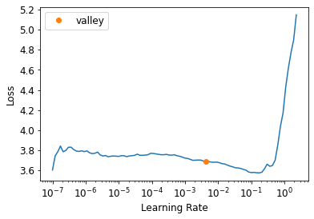

* [Establishing a Baseline](#establishing-a-baseline)
* [A Generic Optimizer](#a-generic-optimizer)
* [Momentum](#momentum)
* [RMSProp](#rmsprop)
* [Adam](#adam)
* [Decoupled Weight Decay](#decoupled-weight-decay)
* [Callbacks](#callbacks)
* [References](#references)

-----

```python
#hide
# !pip install -Uqq fastbook
import fastbook
fastbook.setup_book()
```


```python
#hide
from fastbook import *
```


```python
import inspect
def print_source(obj):
    for line in inspect.getsource(obj).split("\n"):
        print(line)
```


## Establishing a Baseline


```python
def get_data(url, presize, resize):
    path = untar_data(url)
    return DataBlock(
        blocks=(ImageBlock, CategoryBlock), get_items=get_image_files, 
        splitter=GrandparentSplitter(valid_name='val'),
        get_y=parent_label, item_tfms=Resize(presize),
        batch_tfms=[*aug_transforms(min_scale=0.5, size=resize),
                    Normalize.from_stats(*imagenet_stats)],
    ).dataloaders(path, bs=128)
```

-----


```python
URLs.IMAGENETTE_160
```
```text
'https://s3.amazonaws.com/fast-ai-imageclas/imagenette2-160.tgz'
```

-----


```python
dls = get_data(URLs.IMAGENETTE_160, 160, 128)
```

-----


```python
def get_learner(**kwargs):
    return cnn_learner(dls, resnet34, pretrained=False,
                    metrics=accuracy, **kwargs).to_fp16()
```

-----


```python
# Default fastai optimizer
learn = get_learner()
learn.fit_one_cycle(3, 0.003)
```
<div style="overflow-x:auto;">
<table border="1" class="dataframe">
  <thead>
    <tr style="text-align: left;">
      <th>epoch</th>
      <th>train_loss</th>
      <th>valid_loss</th>
      <th>accuracy</th>
      <th>time</th>
    </tr>
  </thead>
  <tbody>
    <tr>
      <td>0</td>
      <td>2.597476</td>
      <td>7.834398</td>
      <td>0.205096</td>
      <td>00:07</td>
    </tr>
    <tr>
      <td>1</td>
      <td>2.075519</td>
      <td>2.908207</td>
      <td>0.393121</td>
      <td>00:06</td>
    </tr>
    <tr>
      <td>2</td>
      <td>1.739347</td>
      <td>1.434073</td>
      <td>0.544713</td>
      <td>00:06</td>
    </tr>
  </tbody>
</table>
</div>
-----

```python
learn.opt_func
```
```text
<function fastai.optimizer.Adam(params, lr, mom=0.9, sqr_mom=0.99, eps=1e-05, wd=0.01, decouple_wd=True)>
```

-----


```python
# Use plain SGD for baseline
learn = get_learner(opt_func=SGD)
```

-----


```python
learn.lr_find()
```
```text
SuggestedLRs(valley=0.004365158267319202)
```



-----

```python
# Disable momentum for baseline
learn.fit_one_cycle(3, 0.03, moms=(0,0,0))
```
<div style="overflow-x:auto;">
<table border="1" class="dataframe">
  <thead>
    <tr style="text-align: left;">
      <th>epoch</th>
      <th>train_loss</th>
      <th>valid_loss</th>
      <th>accuracy</th>
      <th>time</th>
    </tr>
  </thead>
  <tbody>
    <tr>
      <td>0</td>
      <td>2.968830</td>
      <td>2.996733</td>
      <td>0.235159</td>
      <td>00:06</td>
    </tr>
    <tr>
      <td>1</td>
      <td>2.414340</td>
      <td>1.804736</td>
      <td>0.403057</td>
      <td>00:06</td>
    </tr>
    <tr>
      <td>2</td>
      <td>2.157545</td>
      <td>1.676913</td>
      <td>0.430318</td>
      <td>00:06</td>
    </tr>
  </tbody>
</table>
</div>
**Note:** Plain SGD is training slower.


## A Generic Optimizer

* need a flexible optimizer foundation to easily implement new improvements
* optimizer callbacks: small pieces of code that we can compose, mix, and match in an optimizer to build the optimizer step

-----


```python
Optimizer
```
```text
fastai.optimizer.Optimizer
```

-----


```python
print_source(Optimizer)
```
```text
    class Optimizer(_BaseOptimizer):
        "Base optimizer class for the fastai library, updating `params` with `cbs`"
        _keep_on_clear = ['force_train', 'do_wd']
        def __init__(self, params, cbs, train_bn=True, **defaults):
            params = L(params)
            self.cbs,self.state,self.train_bn = L(cbs),defaultdict(dict),train_bn
            defaults = merge(*self.cbs.attrgot('defaults'), defaults)
            self.param_lists = L(L(p) for p in params) if isinstance(params[0], (L,list)) else L([params])
            self.hypers = L({} for _ in range_of(self.param_lists))
            self.set_hypers(**defaults)
            self.frozen_idx = 0
    
        def zero_grad(self):
            for p,*_ in self.all_params(with_grad=True):
                p.grad.detach_()
                p.grad.zero_()
    
        def step(self):
            for p,pg,state,hyper in self.all_params(with_grad=True):
                for cb in self.cbs: state = _update(state, cb(p, **{**state, **hyper}))
                self.state[p] = state
    
        def clear_state(self):
            for p,pg,state,hyper in self.all_params():
                self.state[p] = {k: state[k] for k in self._keep_on_clear if k in state}
    
        def state_dict(self):
            state = [self.state[p] for p,*_ in self.all_params()]
            return {'state': state, 'hypers': self.hypers}
    
        def load_state_dict(self, sd):
            assert len(sd["hypers"]) == len(self.param_lists)
            assert len(sd["state"])  == sum([len(pg) for pg in self.param_lists])
            self.hypers = sd['hypers']
            self.state = {p: s for p,s in zip(self.all_params().itemgot(0), sd['state'])}
```

-----

```python
# Custom optimizer callback that performs a single SGD step
# when Tensor.add_ in PyTorch is passed two parameters, they are multiplied together before the addition
def sgd_cb(p, lr, **kwargs): p.data.add_(-lr, p.grad.data)
```

[**torch.add**](https://pytorch.org/docs/stable/generated/torch.add.html): $out_{i} = input_{i} + alpha \times other_{i}$


```python
help(torch.add)
```
```text
    Help on built-in function add:
    
    add(...)
        add(input, other, *, alpha=1, out=None) -> Tensor
        
        Adds :attr:`other`, scaled by :attr:`alpha`, to :attr:`input`.
        
        .. math::
            \text{{out}}_i = \text{{input}}_i + \text{{alpha}} \times \text{{other}}_i


        
        Supports :ref:`broadcasting to a common shape <broadcasting-semantics>`,
        :ref:`type promotion <type-promotion-doc>`, and integer, float, and complex inputs.
        
        Args:
            input (Tensor): the input tensor.
            other (Tensor or Number): the tensor or number to add to input.
        
        Keyword arguments:
            alpha (Number): the multiplier for :attr:`other`.
            out (Tensor, optional): the output tensor.
        
        Examples::
        
            >>> a = torch.randn(4)
            >>> a
            tensor([ 0.0202,  1.0985,  1.3506, -0.6056])
            >>> torch.add(a, 20)
            tensor([ 20.0202,  21.0985,  21.3506,  19.3944])
        
            >>> b = torch.randn(4)
            >>> b
            tensor([-0.9732, -0.3497,  0.6245,  0.4022])
            >>> c = torch.randn(4, 1)
            >>> c
            tensor([[ 0.3743],
                    [-1.7724],
                    [-0.5811],
                    [-0.8017]])
            >>> torch.add(b, c, alpha=10)
            tensor([[  2.7695,   3.3930,   4.3672,   4.1450],
                    [-18.6971, -18.0736, -17.0994, -17.3216],
                    [ -6.7845,  -6.1610,  -5.1868,  -5.4090],
                    [ -8.9902,  -8.3667,  -7.3925,  -7.6147]])
```

-----

```python
opt_func = partial(Optimizer, cbs=[sgd_cb])
```

-----


```python
learn = get_learner(opt_func=opt_func)
learn.fit(3, 0.03)
```
<div style="overflow-x:auto;">
<table border="1" class="dataframe">
  <thead>
    <tr style="text-align: left;">
      <th>epoch</th>
      <th>train_loss</th>
      <th>valid_loss</th>
      <th>accuracy</th>
      <th>time</th>
    </tr>
  </thead>
  <tbody>
    <tr>
      <td>0</td>
      <td>2.582404</td>
      <td>1.843338</td>
      <td>0.379618</td>
      <td>00:06</td>
    </tr>
    <tr>
      <td>1</td>
      <td>2.124360</td>
      <td>1.591867</td>
      <td>0.468280</td>
      <td>00:06</td>
    </tr>
    <tr>
      <td>2</td>
      <td>1.824502</td>
      <td>1.510853</td>
      <td>0.498089</td>
      <td>00:06</td>
    </tr>
  </tbody>
</table>
</div>


## Momentum
* use a moving average, instead of only the current gradient
* used to skip over little bumps in the loss landscape
* higher momentum will skip over bigger bumps
* works particularly well if the loss function has narrow canyons that would cause vanilla SGD to bounce around

-----

```python
weight.avg = beta * weight.avg + (1-beta) * weight.grad
new_weight = weight - lr * weight.avg
```
* beta: defines how much momentum to use
    * `beta = 0`: no momentum
* need to track the moving averages for each parameter in the model

#### Noisy Data for a Single Parameter with Different Levels of Momentum


```python
# Get 100 evenly spaced input values over the interval [-4,4]
x = np.linspace(-4, 4, 100)
# Function to plot
y = 1 - (x/3) ** 2
# Add noise to both input and output
x1 = x + np.random.randn(100) * 0.1
y1 = y + np.random.randn(100) * 0.1
_,axs = plt.subplots(2,2, figsize=(12,8))
# List of beta values
betas = [0.5,0.7,0.9,0.99]
idx = x1.argsort()
for beta,ax in zip(betas, axs.flatten()):
    ax.scatter(x1,y1)
    avg,res = 0,[]
    for i in idx:
        avg = beta * avg + (1-beta) * y1[i]
        res.append(avg)#/(1-beta**(i+1)))
    ax.plot(x1[idx],np.array(res), color='red');
    ax.set_title(f'beta={beta}')
```


**Note:** A beta value that is too high causes the overall changes in the gradient to be ignored.
* A beta value of 0.9 is often used for SGD with Momentum
* `fit_one_cycle` starts with a beta value of 0.95, gradually adjusts to 0.85, then gradually moves back to 0.95

-----


```python
help(np.linspace)
```
```text
    Help on function linspace in module numpy:
    
    linspace(start, stop, num=50, endpoint=True, retstep=False, dtype=None, axis=0)
        Return evenly spaced numbers over a specified interval.
        
        Returns `num` evenly spaced samples, calculated over the
        interval [`start`, `stop`].
        
        The endpoint of the interval can optionally be excluded.
        
        .. versionchanged:: 1.16.0
            Non-scalar `start` and `stop` are now supported.
        
        .. versionchanged:: 1.20.0
            Values are rounded towards ``-inf`` instead of ``0`` when an
            integer ``dtype`` is specified. The old behavior can
            still be obtained with ``np.linspace(start, stop, num).astype(int)``
        
        Parameters
        ----------
        start : array_like
            The starting value of the sequence.
        stop : array_like
            The end value of the sequence, unless `endpoint` is set to False.
            In that case, the sequence consists of all but the last of ``num + 1``
            evenly spaced samples, so that `stop` is excluded.  Note that the step
            size changes when `endpoint` is False.
        num : int, optional
            Number of samples to generate. Default is 50. Must be non-negative.
        endpoint : bool, optional
            If True, `stop` is the last sample. Otherwise, it is not included.
            Default is True.
        retstep : bool, optional
            If True, return (`samples`, `step`), where `step` is the spacing
            between samples.
        dtype : dtype, optional
            The type of the output array.  If `dtype` is not given, the data type
            is inferred from `start` and `stop`. The inferred dtype will never be
            an integer; `float` is chosen even if the arguments would produce an
            array of integers.
        
            .. versionadded:: 1.9.0
        
        axis : int, optional
            The axis in the result to store the samples.  Relevant only if start
            or stop are array-like.  By default (0), the samples will be along a
            new axis inserted at the beginning. Use -1 to get an axis at the end.
        
            .. versionadded:: 1.16.0
        
        Returns
        -------
        samples : ndarray
            There are `num` equally spaced samples in the closed interval
            ``[start, stop]`` or the half-open interval ``[start, stop)``
            (depending on whether `endpoint` is True or False).
        step : float, optional
            Only returned if `retstep` is True
        
            Size of spacing between samples.


​        
        See Also
        --------
        arange : Similar to `linspace`, but uses a step size (instead of the
                 number of samples).
        geomspace : Similar to `linspace`, but with numbers spaced evenly on a log
                    scale (a geometric progression).
        logspace : Similar to `geomspace`, but with the end points specified as
                   logarithms.
        
        Examples
        --------
        >>> np.linspace(2.0, 3.0, num=5)
        array([2.  , 2.25, 2.5 , 2.75, 3.  ])
        >>> np.linspace(2.0, 3.0, num=5, endpoint=False)
        array([2. ,  2.2,  2.4,  2.6,  2.8])
        >>> np.linspace(2.0, 3.0, num=5, retstep=True)
        (array([2.  ,  2.25,  2.5 ,  2.75,  3.  ]), 0.25)
        
        Graphical illustration:
        
        >>> import matplotlib.pyplot as plt
        >>> N = 8
        >>> y = np.zeros(N)
        >>> x1 = np.linspace(0, 10, N, endpoint=True)
        >>> x2 = np.linspace(0, 10, N, endpoint=False)
        >>> plt.plot(x1, y, 'o')
        [<matplotlib.lines.Line2D object at 0x...>]
        >>> plt.plot(x2, y + 0.5, 'o')
        [<matplotlib.lines.Line2D object at 0x...>]
        >>> plt.ylim([-0.5, 1])
        (-0.5, 1)
        >>> plt.show()
```

-----

```python
# Custom callback to calculate the average gradient
def average_grad(p, mom, grad_avg=None, **kwargs):
    # Set starting average to zero for all parameters
    if grad_avg is None: grad_avg = torch.zeros_like(p.grad.data)
    return {'grad_avg': grad_avg*mom + p.grad.data}
```

-----


```python
# Custom callback that performs a single SGD with momentum step
def momentum_step(p, lr, grad_avg, **kwargs): p.data.add_(-lr, grad_avg)
```

-----


```python
# Start training with a beta value of 0.9
opt_func = partial(Optimizer, cbs=[average_grad,momentum_step], mom=0.9)
```

-----


```python
# Learner automatically schedules the momentum and learning rate
learn = get_learner(opt_func=opt_func)
learn.fit_one_cycle(3, 0.03)
```
<div style="overflow-x:auto;">
<table border="1" class="dataframe">
  <thead>
    <tr style="text-align: left;">
      <th>epoch</th>
      <th>train_loss</th>
      <th>valid_loss</th>
      <th>accuracy</th>
      <th>time</th>
    </tr>
  </thead>
  <tbody>
    <tr>
      <td>0</td>
      <td>2.720397</td>
      <td>1.938127</td>
      <td>0.330446</td>
      <td>00:06</td>
    </tr>
    <tr>
      <td>1</td>
      <td>2.461116</td>
      <td>1.865412</td>
      <td>0.390828</td>
      <td>00:06</td>
    </tr>
    <tr>
      <td>2</td>
      <td>2.155982</td>
      <td>1.645647</td>
      <td>0.451720</td>
      <td>00:06</td>
    </tr>
  </tbody>
</table>
</div>

**Note:** Still not getting great results


```python
learn.recorder.plot_sched()
```


## RMSProp
* Introduced by Geoffrey Hinton in [Overview of mini‐batch gradient descent](http://www.cs.toronto.edu/~tijmen/csc321/slides/lecture_slides_lec6.pdf)
    * Divide the learning rate for a weight by a running average of the magnitudes of recent gradients for that weight
* Uses an adaptive learning rate
    * each parameter gets its own learning rate controlled by a global learning rate
* Can speed up training by giving a higher learning rate to weights that need to change a lot and a lower learning rate to weights that are good enough
* Parameters whose gradients have been close to zero for a while will need a higher learning rate, because the loss is flat
* Parameters whose gradients have been erratic will need a lower learning rate to avoid divergence
* Use a moving average of the gradients squared

-----

```python
# If the moving average is low, the effective learning rate will be higher
w.square_avg = alpha * w.square_avg + (1-alpha) * (w.grad ** 2)
new_w = w - lr * w.grad / math.sqrt(w.square_avg + eps)
```
* `eps` (epsilon): added for numerial stability
    * default value is 1e-8
* `alpha`: default value is usually 0.99

-----

```python
# Custom callback that calculated the moving average of the gradients squared
def average_sqr_grad(p, sqr_mom, sqr_avg=None, **kwargs):
    # Set starting average to zero for all parameters
    if sqr_avg is None: sqr_avg = torch.zeros_like(p.grad.data)
    return {'sqr_avg': sqr_mom*sqr_avg + (1-sqr_mom)*p.grad.data**2}
```

-----


```python
# Custom callback that perform a single rmsprop step
def rms_prop_step(p, lr, sqr_avg, eps, grad_avg=None, **kwargs):
    denom = sqr_avg.sqrt().add_(eps)
    p.data.addcdiv_(-lr, p.grad, denom)
```

#### [torch.addcdiv](https://pytorch.org/docs/stable/generated/torch.addcdiv.html): $\text{out}_i = \text{input}_i + \text{value} \times \frac{\text{tensor1}_i}{\text{tensor2}_i}$


```python
help(torch.addcdiv)
```
```text
    Help on built-in function addcdiv:
    
    addcdiv(...)
        addcdiv(input, tensor1, tensor2, *, value=1, out=None) -> Tensor
        
        Performs the element-wise division of :attr:`tensor1` by :attr:`tensor2`,
        multiply the result by the scalar :attr:`value` and add it to :attr:`input`.
        
        .. warning::
            Integer division with addcdiv is no longer supported, and in a future
            release addcdiv will perform a true division of tensor1 and tensor2.
            The historic addcdiv behavior can be implemented as
            (input + value * torch.trunc(tensor1 / tensor2)).to(input.dtype)
            for integer inputs and as (input + value * tensor1 / tensor2) for float inputs.
            The future addcdiv behavior is just the latter implementation:
            (input + value * tensor1 / tensor2), for all dtypes.
        
        .. math::
            \text{out}_i = \text{input}_i + \text{value} \times \frac{\text{tensor1}_i}{\text{tensor2}_i}


​        
        The shapes of :attr:`input`, :attr:`tensor1`, and :attr:`tensor2` must be
        :ref:`broadcastable <broadcasting-semantics>`.
        
        For inputs of type `FloatTensor` or `DoubleTensor`, :attr:`value` must be
        a real number, otherwise an integer.
        
        Args:
            input (Tensor): the tensor to be added
            tensor1 (Tensor): the numerator tensor
            tensor2 (Tensor): the denominator tensor
        
        Keyword args:
            value (Number, optional): multiplier for :math:`\text{tensor1} / \text{tensor2}`
            out (Tensor, optional): the output tensor.
        
        Example::
        
            >>> t = torch.randn(1, 3)
            >>> t1 = torch.randn(3, 1)
            >>> t2 = torch.randn(1, 3)
            >>> torch.addcdiv(t, t1, t2, value=0.1)
            tensor([[-0.2312, -3.6496,  0.1312],
                    [-1.0428,  3.4292, -0.1030],
                    [-0.5369, -0.9829,  0.0430]])
```

-----

```python
opt_func = partial(Optimizer, cbs=[average_sqr_grad,rms_prop_step], sqr_mom=0.99, eps=1e-7)
```

-----


```python
learn = get_learner(opt_func=opt_func)
learn.fit_one_cycle(3, 0.003)
```
<div style="overflow-x:auto;">
<table border="1" class="dataframe">
  <thead>
    <tr style="text-align: left;">
      <th>epoch</th>
      <th>train_loss</th>
      <th>valid_loss</th>
      <th>accuracy</th>
      <th>time</th>
    </tr>
  </thead>
  <tbody>
    <tr>
      <td>0</td>
      <td>2.763567</td>
      <td>2.188202</td>
      <td>0.278981</td>
      <td>00:07</td>
    </tr>
    <tr>
      <td>1</td>
      <td>2.208868</td>
      <td>1.775339</td>
      <td>0.385223</td>
      <td>00:07</td>
    </tr>
    <tr>
      <td>2</td>
      <td>1.771404</td>
      <td>1.440212</td>
      <td>0.531720</td>
      <td>00:07</td>
    </tr>
  </tbody>
</table>
</div>


**Note:** Higher final accuracy

## Adam
* Mixes the ideas of SGD with momentum and RMSProp together
* Uses the moving average of the gradients as a direction and divides by the square root of the moving average of the gradients squared to give an adaptive learnig rate to each parameter\
* takes the unbiased moving average

-----

```python
w.avg = beta * w.avg + (1-beta) * w.grad
unbias_avg = w.avg / (1 - beta**(i+1))
```
`i`: the i-th iteration, starting at `0`
`(1 - beta**(i+1)`: makes sure the unbiased average look more like the gradients at the beginning

* full update step

-----

```python
w.avg = beta * w.avg + (1-beta) * w.grad
unbias_avg = w.avg / (1 - beta**(i+1))
w.sqr_avg = beta2 * w.sqr_avg + (1-beta2) * (w.grad ** 2)
new_w = w - lr * unbias_avg / sqrt(w.sqr_avg + eps)
```
* fastai default values
    * eps: 1e-5
        * higher eps value limits the maximum value of the adjusted learning rate
    * beta1: 0.9
    * beta2: 0.99
        * set with `moms` in `fit_one_cycle`

-----


```python
Adam
```
```text
<function fastai.optimizer.Adam(params, lr, mom=0.9, sqr_mom=0.99, eps=1e-05, wd=0.01, decouple_wd=True)>
```

-----


```python
print_source(Adam)
```
```text
def Adam(params, lr, mom=0.9, sqr_mom=0.99, eps=1e-5, wd=0.01, decouple_wd=True):
    "A `Optimizer` for Adam with `lr`, `mom`, `sqr_mom`, `eps` and `params`"
    cbs = [weight_decay] if decouple_wd else [l2_reg]
    cbs += [partial(average_grad, dampening=True), average_sqr_grad, step_stat, adam_step]
    return Optimizer(params, cbs, lr=lr, mom=mom, sqr_mom=sqr_mom, eps=eps, wd=wd)
```

-----


```python
print_source(step_stat)
```
```text
def step_stat(p, step=0, **kwargs):
    "Register the number of steps done in `state` for `p`"
    step += 1
    return {'step' : step}
```

-----


```python
print_source(adam_step)
```
```text
def adam_step(p, lr, mom, step, sqr_mom, grad_avg, sqr_avg, eps, **kwargs):
    "Step for Adam with `lr` on `p`"
    debias1 = debias(mom,     1-mom,     step)
    debias2 = debias(sqr_mom, 1-sqr_mom, step)
    p.data.addcdiv_(grad_avg, (sqr_avg/debias2).sqrt() + eps, value = -lr / debias1)
    return p
```

-----


```python
print_source(debias)
```
```text
def debias(mom, damp, step): return damp * (1 - mom**step) / (1-mom)
```


## Decoupled Weight Decay
* [Decoupled Weight Decay Regularization](https://arxiv.org/abs/1711.05101)
* each weight is decayed by a factor of `lr * wd`

-----

```python
new_weight = weight - lr*weight.grad - lr*wd*weight
```
* also called L2 regularization

-----


```python
print_source(weight_decay)
```
```text
def weight_decay(p, lr, wd, do_wd=True, **kwargs):
    "Weight decay as decaying `p` with `lr*wd`"
    if do_wd and wd!=0: p.data.mul_(1 - lr*wd)
```

-----


```python
print_source(l2_reg)
```
```text
def l2_reg(p, lr, wd, do_wd=True, **kwargs):
    "L2 regularization as adding `wd*p` to `p.grad`"
    if do_wd and wd!=0: p.grad.data.add_(p.data, alpha=wd)
```


## Callbacks
* Allow users to insert code at any part of the training loop in a consistent, well-defined way
* `callback`: a piece of code you write and inject into another piece of code at a predefined point
* The typical approach to customizing the training loop by making a copy and inserting changes is problematic
    * hundreds of changes can be made to a training loop, meaning their are billions of possible permutations

### Basic Training Loop
```python
for xb,yb in dl:
    loss = loss_func(model(xb),yb)
    loss.backward()
    opt.step()
    opt.zero_grad()
```

-----


```python
Learner._do_one_batch
```
```text
<function fastai.learner.Learner._do_one_batch(self)>
```

-----


```python
print_source(Learner._do_one_batch)
```
```text
    def _do_one_batch(self):
        self.pred = self.model(*self.xb)
        self('after_pred')
        if len(self.yb):
            self.loss_grad = self.loss_func(self.pred, *self.yb)
            self.loss = self.loss_grad.clone()
        self('after_loss')
        if not self.training or not len(self.yb): return
        self('before_backward')
        self.loss_grad.backward()
        self._with_events(self.opt.step, 'step', CancelStepException)
        self.opt.zero_grad()
```


**Note:** The `self('')` calls are where the callbacks are called.
* The callback will receive the entire state of training and can modify it

### Creating a Callback
* `after_create`: called after the Learner is created
* `before_fit`: called before starting training or inference, ideal for initial setup.
* `before_epoch`: called at the beginning of each epoch, useful for any behavior you need to reset at each epoch.
* `before_train`: called at the beginning of the training part of an epoch.
* `before_batch`: called at the beginning of each batch, just after drawing said batch. It can be used to do any setup necessary for the batch (like hyper-parameter scheduling) or to change the input/target before it goes in the model (change of the input with techniques like mixup for instance).
* `after_pred`: called after computing the output of the model on the batch. It can be used to change that output before it's fed to the loss.
* `after_loss`: called after the loss has been computed, but before the backward pass. It can be used to add any penalty to the loss (AR or TAR in RNN training for instance).
* `before_backward`: called after the loss has been computed, but only in training mode (i.e. when the backward pass will be used)
* `before_step`: called after the backward pass, but before the update of the parameters. It can be used to do any change to the gradients before said update (gradient clipping for instance).
* `after_step`: called after the step and before the gradients are zeroed.
* `after_batch`: called at the end of a batch, for any clean-up before the next one.
* `after_train`: called at the end of the training phase of an epoch.
* `before_validate`: called at the beginning of the validation phase of an epoch, useful for any setup needed specifically for validation.
* `after_validate`: called at the end of the validation part of an epoch.
* `after_epoch`: called at the end of an epoch, for any clean-up before the next one.
* `after_fit`: called at the end of training, for final clean-up.

-----

```python
# List of available events
help(event)
```
```text
    Help on class event in module fastcore.basics:
    
    class event(builtins.object)
     |  event(*args, **kwargs)
     |  
     |  All possible events as attributes to get tab-completion and typo-proofing
     |  
     |  Methods defined here:
     |  
     |  __eq__ = _eq(self, b)
     |  
     |  __init__ = _init(self, *args, **kwargs)
     |  
     |  __repr__ = _f(self)
     |  
     |  ----------------------------------------------------------------------
     |  Data descriptors defined here:
     |  
     |  __dict__
     |      dictionary for instance variables (if defined)
     |  
     |  __weakref__
     |      list of weak references to the object (if defined)
     |  
     |  ----------------------------------------------------------------------
     |  Data and other attributes defined here:
     |  
     |  __hash__ = None
     |  
     |  after_batch = 'after_batch'
     |  
     |  after_cancel_batch = 'after_cancel_batch'
     |  
     |  after_cancel_epoch = 'after_cancel_epoch'
     |  
     |  after_cancel_fit = 'after_cancel_fit'
     |  
     |  after_cancel_step = 'after_cancel_step'
     |  
     |  after_cancel_train = 'after_cancel_train'
     |  
     |  after_cancel_validate = 'after_cancel_validate'
     |  
     |  after_create = 'after_create'
     |  
     |  after_epoch = 'after_epoch'
     |  
     |  after_fit = 'after_fit'
     |  
     |  after_loss = 'after_loss'
     |  
     |  after_pred = 'after_pred'
     |  
     |  after_step = 'after_step'
     |  
     |  after_train = 'after_train'
     |  
     |  after_validate = 'after_validate'
     |  
     |  before_backward = 'before_backward'
     |  
     |  before_batch = 'before_batch'
     |  
     |  before_epoch = 'before_epoch'
     |  
     |  before_fit = 'before_fit'
     |  
     |  before_step = 'before_step'
     |  
     |  before_train = 'before_train'
     |  
     |  before_validate = 'before_validate'
```

-----

```python
ModelResetter, print_source(ModelResetter)
```
```text
@docs
class ModelResetter(Callback):
    "`Callback` that resets the model at each validation/training step"
    def before_train(self):    self.model.reset()
    def before_validate(self): self.model.reset()
    def after_fit(self):       self.model.reset()
    _docs = dict(before_train="Reset the model before training",
                 before_validate="Reset the model before validation",
                 after_fit="Reset the model after fitting")
```


```text
(fastai.callback.rnn.ModelResetter, None)
```

-----


```python
class ModelResetter(Callback):
    def begin_train(self):    self.model.reset()
    def begin_validate(self): self.model.reset()
```

-----


```python
RNNRegularizer, print_source(RNNRegularizer)
```
```text
class RNNRegularizer(Callback):
    "Add AR and TAR regularization"
    order,run_valid = RNNCallback.order+1,False
    def __init__(self, alpha=0., beta=0.): store_attr()
    def after_loss(self):
        if not self.training: return
        if self.alpha: self.learn.loss_grad += self.alpha * self.rnn.out.float().pow(2).mean()
        if self.beta:
            h = self.rnn.raw_out
            if len(h)>1: self.learn.loss_grad += self.beta * (h[:,1:] - h[:,:-1]).float().pow(2).mean()
```


```text
(fastai.callback.rnn.RNNRegularizer, None)
```

-----


```python
class RNNRegularizer(Callback):
    def __init__(self, alpha=0., beta=0.): self.alpha,self.beta = alpha,beta

    def after_pred(self):
        self.raw_out,self.out = self.pred[1],self.pred[2]
        self.learn.pred = self.pred[0]

    def after_loss(self):
        if not self.training: return
        if self.alpha != 0.:
            self.learn.loss += self.alpha * self.out[-1].float().pow(2).mean()
        if self.beta != 0.:
            h = self.raw_out[-1]
            if len(h)>1:
                self.learn.loss += self.beta * (h[:,1:] - h[:,:-1]
                                               ).float().pow(2).mean()
```

**Note:** A callback will always try to get an attribute it does not have inside the Learner associated with it.

#### [Learner attributes available to callbacks](https://docs.fast.ai/callback.core.html#Attributes-available-to-callbacks)
* `model`: the model used for training/validation
* `dls`: the underlying DataLoaders
* `loss_func`: the loss function used
* `opt`: the optimizer used to update the model parameters
* `opt_func`: the function used to create the optimizer
* `cbs`: the list containing all Callbacks
* `dl`: current DataLoader used for iteration
* `x/xb`: last input drawn from self.dl (potentially modified by callbacks). xb is always a tuple (potentially with one element) and x is detuplified. You can only assign to xb.
* `y/yb`: last target drawn from self.dl (potentially modified by callbacks). yb is always a tuple (potentially with one element) and y is detuplified. You can only assign to yb.
* `pred`: last predictions from self.model (potentially modified by callbacks)
* `loss_grad`: last computed loss (potentially modified by callbacks)
* `loss`: clone of loss_grad used for logging
* `n_epoch`: the number of epochs in this training
* `n_iter`: the number of iterations in the current self.dl
* `epoch`: the current epoch index (from 0 to n_epoch-1)
* `iter`: the current iteration index in self.dl (from 0 to n_iter-1)

### Callback Ordering and Exceptions
* A callback sometimes need to tell fastai to skip over a batch or an epoch, or stop training all together

-----


```python
TerminateOnNaNCallback, print_source(TerminateOnNaNCallback)
```

```text
class TerminateOnNaNCallback(Callback):
    "A `Callback` that terminates training if loss is NaN."
    order=-9
    def after_batch(self):
        "Test if `last_loss` is NaN and interrupts training."
        if torch.isinf(self.loss) or torch.isnan(self.loss): raise CancelFitException
```


```text
(fastai.callback.tracker.TerminateOnNaNCallback, None)
```

-----


```python
class TerminateOnNaNCallback(Callback):
    run_before=Recorder
    def after_batch(self):
        if torch.isinf(self.loss) or torch.isnan(self.loss):
            raise CancelFitException
```

-----


```python
from fastai.callback.core import _ex_docscs
```

-----


```python
_ex_docs
```
```text
{'CancelBatchException': 'Skip the rest of this batch and go to `after_batch`',
 'CancelTrainException': 'Skip the rest of the training part of the epoch and go to `after_train`',
 'CancelValidException': 'Skip the rest of the validation part of the epoch and go to `after_validate`',
 'CancelEpochException': 'Skip the rest of this epoch and go to `after_epoch`',
 'CancelStepException': 'Skip stepping the optimizer',
 'CancelFitException': 'Interrupts training and go to `after_fit`'}
```


**Note:** Can Detect one the above exceptions and execute code right after
* `after_cancel_batch`: reached immediately after a CancelBatchException before proceeding to after_batch
* `after_cancel_train`: reached immediately after a CancelTrainException before proceeding to after_epoch
* `after_cancel_valid`: reached immediately after a CancelValidException before proceeding to after_epoch
* `after_cancel_epoch`: reached immediately after a CancelEpochException before proceeding to after_epoch
* `after_cancel_fit`: reached immediately after a CancelFitException before proceeding to after_fit


## References

* [Deep Learning for Coders with fastai & PyTorch](https://www.oreilly.com/library/view/deep-learning-for/9781492045519/)
* [The fastai book GitHub Repository](https://github.com/fastai/fastbook)


**Previous:** [Notes on fastai Book Ch. 15](https://christianjmills.com/Notes-on-Fastai-Book-15/)

**Next:** [Notes on fastai Book Ch. 17](https://christianjmills.com/Notes-on-Fastai-Book-17/)