* [Tabular Modeling](#tabular-modeling)
* [Categorical Embeddings](#categorical-embeddings)
* [Beyond Deep Learning](#beyond-deep-learning)
* [The Dataset](#the-dataset)
* [Decision Trees](#decision-trees)
* [Random Forests](#random-forests)
* [Model Interpretation](#model-interpretation)
* [Extrapolation and Neural Networks](#extrapolation-and-neural-networks)
* [Ensembling](#ensembling)
* [References](#references)


```python
import fastbook
fastbook.setup_book()
```

```python
from fastbook import *
from kaggle import api
from pandas.api.types import is_string_dtype, is_numeric_dtype, is_categorical_dtype
from fastai.tabular.all import *
from sklearn.ensemble import RandomForestRegressor
from sklearn.tree import DecisionTreeRegressor
from dtreeviz.trees import *
from IPython.display import Image, display_svg, SVG

pd.options.display.max_rows = 20
pd.options.display.max_columns = 8
```

```python
import inspect
```

```python
def print_source(obj):
    for line in inspect.getsource(obj).split("\n"):
        print(line)
```

```python
print_source(untar_data)
```

```text
def untar_data(url, archive=None, data=None, c_key='data', force_download=False):#, extract_func=file_extract, timeout=4):
    "Download `url` to `fname` if `dest` doesn't exist, and extract to folder `dest`"
    d = FastDownload(fastai_cfg(), module=fastai.data, archive=archive, data=data, base='~/.fastai')
    return d.get(url, force=force_download, extract_key=c_key)
```

```python
for line in inspect.getsourcelines(untar_data)[0]:
    print(line)
```

```text
def untar_data(url, archive=None, data=None, c_key='data', force_download=False):#, extract_func=file_extract, timeout=4):

    "Download `url` to `fname` if `dest` doesn't exist, and extract to folder `dest`"

    d = FastDownload(fastai_cfg(), module=fastai.data, archive=archive, data=data, base='~/.fastai')

    return d.get(url, force=force_download, extract_key=c_key)
```


## Tabular Modeling

* takes data in the form of a table.
* goal is to predict the value in one column based on the values in the other columns


## Categorical Embeddings

* Continuous Variables
    * numerical data that can be directly fed to a model
    * can add and multiply them directly
* Categorical Variables
    * nonnumerical data that contain a number of discrete levels 
    * needs to be converted to numerical data
    * operations like addition and multiplication do not have meaning, even when stored as numbers

* An embedding layer is exactly equivalent to placing a linear layer after every one-hot encoded input layer
* Embeddings transform categorical variables into inputs that are both continuous and meaningful
    * We can combine the continuous embedding values with other continuous input data by concatenating the variables

### Early state of the art tabular deep learning model (2015)
*  Rossman Store Sales Kaggle Competition
    * [Competition Page](https://www.kaggle.com/c/rossmann-store-sales)
    * Forecast sales using store, promotion, and competitor data
* [Entity Embeddings of Categorical Variables](https://arxiv.org/abs/1604.06737) (paper)
    * one a gold medal for the competition using deep learning
    * method involved far less feature engineering based on domain knowledge
    

[Wide & Deep Learning for Recommender Systems](https://arxiv.org/abs/1606.07792)
* Explains the recommendation systems used for the Google Play Store
* Uses a combination of the dot product and embedding approaches


## Beyond Deep Learning

* deep learning is not (yet) always the best starting point for analyzing categorical data
* modern machine learning can be distilled into a couple of widely applicable techniques
    * Ensembles of decision trees
        * random forests
        * gradient boosting machines
        * mainly for structured data (e.g. tables)
        * train faster
        * often easier to interpret
        * do not require special GPU hardware for inference at scale
        * often require less hyperparameter tuning
        * has a more mature ecosystem for tooling and documentation around them
        * significantly easier to interpret a model of tabular data
            * Which columns in the dataset were the most important for your predictions?
            * Which particular features were most important for some particular observation?
    * Multilayered neural networks trained trained with SGD
        * shallow and/or deep learning
        * mainly for unstructured data
            * audio
            * images
            * natural language processing
        * nearly always superior for unstructured data
        * tends to result in similar accuracy to ensembles of decision trees for many kinds of structured data 
* Use ensembles of decision trees as your first approach for analyzing a new tabular dataset
* When to use deep learning
    * There are some high-cardinality categorical variables that are very important
    * There are some columns that contain data that would be best understood with a neural network such as plain text data


### [Scikit-Learn](https://scikit-learn.org/stable/)
* a popular library for creating machine learning models, using non-deep learning approaches


## The Dataset

### Blue Book for Bulldozers
* predict the sale price of a piece of equipment at auction, based on its usage, equipment type, and configuration
* data is sourced from auction result postings and includes information on usage and equipment configurations
* [Dataset Page](https://www.kaggle.com/c/bluebook-for-bulldozers/data)
    * requires a Kaggle account

### Kaggle API
* [GitHub Repository](https://github.com/Kaggle/kaggle-api)
* [Documentation](https://github.com/Kaggle/kaggle-api#competitions)
* Install: `pip install kaggle`
* Need to get an API Key for your Kaggle account
    * [https://www.kaggle.com/me/account](https://www.kaggle.com/me/account)

```python
creds = '{"username":"","key":""}'
```

```python
print("Path.write_text")
print_source(Path.write_text)

print("Path.chmod")
print_source(Path.chmod)
```
```text
Path.write_text
    def write_text(self, data, encoding=None, errors=None):
        """
        Open the file in text mode, write to it, and close the file.
        """
        if not isinstance(data, str):
            raise TypeError('data must be str, not %s' %
                            data.__class__.__name__)
        with self.open(mode='w', encoding=encoding, errors=errors) as f:
            return f.write(data)

Path.chmod
    def chmod(self, mode):
        """
        Change the permissions of the path, like os.chmod().
        """
        self._accessor.chmod(self, mode)
```

```python
cred_path = Path('~/.kaggle/kaggle.json').expanduser()
# Save API key to a json file if it does not already exist
if not cred_path.exists():
    cred_path.parent.mkdir(exist_ok=True)
    cred_path.write_text(creds)
    cred_path.chmod(0o600)
```

```python
path = URLs.path('bluebook')
path
```
```text
Path('/home/innom-dt/.fastai/archive/bluebook')
```


```python
print("api.competition_download_cli")
print_source(api.competition_download_cli)
```
```text
api.competition_download_cli
    def competition_download_cli(self,
                                 competition,
                                 competition_opt=None,
                                 file_name=None,
                                 path=None,
                                 force=False,
                                 quiet=False):
        """ a wrapper to competition_download_files, but first will parse input
            from API client. Additional parameters are listed here, see
            competition_download for remaining.

            Parameters
            =========
            competition: the name of the competition
            competition_opt: an alternative competition option provided by cli
            file_name: the configuration file name
            path: a path to download the file to
            force: force the download if the file already exists (default False)
            quiet: suppress verbose output (default is False)
        """
        competition = competition or competition_opt
        if competition is None:
            competition = self.get_config_value(self.CONFIG_NAME_COMPETITION)
            if competition is not None and not quiet:
                print('Using competition: ' + competition)

        if competition is None:
            raise ValueError('No competition specified')
        else:
            if file_name is None:
                self.competition_download_files(competition, path, force,
                                                quiet)
            else:
                self.competition_download_file(competition, file_name, path,
                                               force, quiet)
```


```python
def file_extract(fname, dest=None):
    "Extract `fname` to `dest` using `tarfile` or `zipfile`."
    if dest is None: dest = Path(fname).parent
    fname = str(fname)
    if   fname.endswith('gz'):  tarfile.open(fname, 'r:gz').extractall(dest)
    elif fname.endswith('zip'): zipfile.ZipFile(fname     ).extractall(dest)
    else: raise Exception(f'Unrecognized archive: {fname}')
```

```python
if not path.exists():
    path.mkdir(parents=true)
    api.competition_download_cli('bluebook-for-bulldozers', path=path)
    file_extract(path/'bluebook-for-bulldozers.zip')

path.ls(file_type='text')
```
```text
(#7) [Path('/home/innom-dt/.fastai/archive/bluebook/ValidSolution.csv'),Path('/home/innom-dt/.fastai/archive/bluebook/Machine_Appendix.csv'),Path('/home/innom-dt/.fastai/archive/bluebook/Valid.csv'),Path('/home/innom-dt/.fastai/archive/bluebook/Test.csv'),Path('/home/innom-dt/.fastai/archive/bluebook/random_forest_benchmark_test.csv'),Path('/home/innom-dt/.fastai/archive/bluebook/median_benchmark.csv'),Path('/home/innom-dt/.fastai/archive/bluebook/TrainAndValid.csv')]
```


### Look at the Data
* Look at your data directly
    * understand the format
    * understand how it's stored
    * understand what type of values it holds
    * etc.
    
* **SalesID:** The unique identifier of the sale
* **MachineID:** The unique identifier of a machine. A machine can be sold multiple times.
* **saleprice:** What the machine sold for  at auction (provided only in train.csv)
* **saledate:** The data of the sale


```python
!cat $path/'TrainAndValid.csv' | head -5
```


```python
df = pd.read_csv(path/'TrainAndValid.csv', 
                 # Tell pandas to look at more rows to figure out the data type for each column
                 low_memory=False)
```

```python
df.columns
```
```text
Index(['SalesID', 'SalePrice', 'MachineID', 'ModelID', 'datasource',
       'auctioneerID', 'YearMade', 'MachineHoursCurrentMeter', 'UsageBand',
       'saledate', 'fiModelDesc', 'fiBaseModel', 'fiSecondaryDesc',
       'fiModelSeries', 'fiModelDescriptor', 'ProductSize',
       'fiProductClassDesc', 'state', 'ProductGroup', 'ProductGroupDesc',
       'Drive_System', 'Enclosure', 'Forks', 'Pad_Type', 'Ride_Control',
       'Stick', 'Transmission', 'Turbocharged', 'Blade_Extension',
       'Blade_Width', 'Enclosure_Type', 'Engine_Horsepower', 'Hydraulics',
       'Pushblock', 'Ripper', 'Scarifier', 'Tip_Control', 'Tire_Size',
       'Coupler', 'Coupler_System', 'Grouser_Tracks', 'Hydraulics_Flow',
       'Track_Type', 'Undercarriage_Pad_Width', 'Stick_Length', 'Thumb',
       'Pattern_Changer', 'Grouser_Type', 'Backhoe_Mounting', 'Blade_Type',
       'Travel_Controls', 'Differential_Type', 'Steering_Controls'],
      dtype='object')
```


#### Ordinal Columns
* columns containing strings or similar, where those strings have a natural ordering
* need to tell Pandas the correct ordering for ordinal columns

```python
df['ProductSize'].unique()
```
```text
array([nan, 'Medium', 'Small', 'Large / Medium', 'Mini', 'Large', 'Compact'], dtype=object)
```

```python
sizes = 'Large','Large / Medium','Medium','Small','Mini','Compact'
sizes
```
```text
('Large', 'Large / Medium', 'Medium', 'Small', 'Mini', 'Compact')
```

```python
df['ProductSize'] = df['ProductSize'].astype('category')
```

#### pandas.core.categorical.Categorical
* [Documentation](https://pandas.pydata.org/pandas-docs/version/0.15.2/generated/pandas.core.categorical.Categorical.html)
* Represents a categorical variable in classic [R](https://en.wikipedia.org/wiki/R_(programming_language) / [S-plus](https://en.wikipedia.org/wiki/S-PLUS) fashion
* Categoricals can only take on only a limited, and usually fixed, number of possible values
* All values of the Categorical are either in categories or [np.nan](https://numpy.org/doc/stable/reference/constants.html#numpy.NAN)

#### pandas.core.categorical.Categorical.set_categories:
* [Documentation](https://pandas.pydata.org/pandas-docs/version/0.15.2/generated/pandas.core.categorical.Categorical.set_categories.html#pandas.core.categorical.Categorical.set_categories)
* Sets the categories to the specified new_categories

```python
df['ProductSize'].cat.set_categories(sizes, ordered=True, inplace=True)
```
```text
/home/innom-dt/miniconda3/envs/fastbook/lib/python3.9/site-packages/pandas/core/arrays/categorical.py:2747: FutureWarning: The `inplace` parameter in pandas.Categorical.set_categories is deprecated and will be removed in a future version. Removing unused categories will always return a new Categorical object.
  res = method(*args, **kwargs)
```

```python
dep_var = 'SalePrice'
```

### Selecting a Metric
* it is important to note what metric is being used for a project
* selecting the metric is part of the project setup
* often requires more than just selecting a variable that already exists
* think carefully about which metric, or set of metrics, actually measures the notion of model quality that matters to you
* may need to build the metric from the variables that are available

#### Kaggle Competition Metric
* Root Mean Squared Log Error (RMSLE) between the actual prediction prices and predicted auction prices

#### numpy.log
* [Documentation](https://numpy.org/doc/stable/reference/generated/numpy.log.html#numpy-log)
* Natural logarithm, element-wise

```python
df[dep_var] = np.log(df[dep_var])
```


## Decision Trees

* asks a series of binary (yes or no) questions about the data
* the data is split between a Yes and a No branch
* predictions are made based on the answers to the questions
* there is a fundamental compromise between how well a decision tree generalizes and how accurate it is on the training set

### Training Steps
1. Loop through each column of the dataset in turn
2. For each column, loop through each possible level of that column in turn
3. Try splitting the data into two groups based on whether they are greater than or less than that value
4. Find the average sale prices for each of those two groups, and see how close that is to the actual sale price of each of the items of equipment in that group
5. After looping through all the columns and all the possible levels for each, pick the split point that gen the best predictions using that simple model
6. Treat each of the two resulting groups as a separate dataset, and repeat steps 1-5 for each group
7. Continue this process recursively, until you reach some stopping criterion

### Handling Dates
* some dates are qualitatively different from others in a way that is often relevant to the systems we are modeling
* we might want our model to know more than whether a date is more or less recent than another
    * the day of the week
    * whether a day is a holiday
    * the month a day is in
    * etc.
* replace every date column with a set of date metadata
  

#### fastai add_datepart
* [Documentation](https://docs.fast.ai/tabular.core.html#add_datepart)
* Helper function that adds columns relevant to a date

```python
add_datepart
```
```text
<function fastai.tabular.core.add_datepart(df, field_name, prefix=None, drop=True, time=False)>
```


```python
print("add_datepart")
print_source(add_datepart)
```
```text
add_datepart
def add_datepart(df, field_name, prefix=None, drop=True, time=False):
    "Helper function that adds columns relevant to a date in the column `field_name` of `df`."
    make_date(df, field_name)
    field = df[field_name]
    prefix = ifnone(prefix, re.sub('[Dd]ate$', '', field_name))
    attr = ['Year', 'Month', 'Week', 'Day', 'Dayofweek', 'Dayofyear', 'Is_month_end', 'Is_month_start',
            'Is_quarter_end', 'Is_quarter_start', 'Is_year_end', 'Is_year_start']
    if time: attr = attr + ['Hour', 'Minute', 'Second']
    # Pandas removed `dt.week` in v1.1.10
    week = field.dt.isocalendar().week.astype(field.dt.day.dtype) if hasattr(field.dt, 'isocalendar') else field.dt.week
    for n in attr: df[prefix + n] = getattr(field.dt, n.lower()) if n != 'Week' else week
    mask = ~field.isna()
    df[prefix + 'Elapsed'] = np.where(mask,field.values.astype(np.int64) // 10 ** 9,np.nan)
    if drop: df.drop(field_name, axis=1, inplace=True)
    return df
```


```python
df = add_datepart(df, 'saledate')
```

```python
df_test = pd.read_csv(path/'Test.csv', low_memory=False)
df_test = add_datepart(df_test, 'saledate')
```

```python
' '.join(o for o in df.columns if o.startswith('sale'))
```
```text
'saleYear saleMonth saleWeek saleDay saleDayofweek saleDayofyear saleIs_month_end saleIs_month_start saleIs_quarter_end saleIs_quarter_start saleIs_year_end saleIs_year_start saleElapsed'
```


### Using TabularPandas and TabularProc

#### TabularPandas
* [Documentation](https://docs.fast.ai/tabular.core.html#TabularPandas)
* A Tabular object with transforms
* Wraps a Pandas DataFrame and provides a few conveniences
* Handles splitting the dataset into training and validation sets
* Needs to be told which columns are continuous and which columns are categorical

```python
TabularPandas
```
```text
fastai.tabular.core.TabularPandas
```


```python
print_source(TabularPandas)
```
```text
class TabularPandas(Tabular):
    "A `Tabular` object with transforms"
    def transform(self, cols, f, all_col=True):
        if not all_col: cols = [c for c in cols if c in self.items.columns]
        if len(cols) > 0: self[cols] = self[cols].transform(f)
```


#### TabularProc
* [Documentation](https://docs.fast.ai/tabular.core.html#TabularProc)
* Base class to write a non-lazy tabular processor for dataframes
* returns the exact same object that is passed to it, after modifying it in place
* runs the transform once, when data is first passed in, rather than lazily as the data is accessed

```python
TabularProc
```
```text
fastai.tabular.core.TabularProc
```


```python
print_source(TabularProc)
```
```text
class TabularProc(InplaceTransform):
    "Base class to write a non-lazy tabular processor for dataframes"
    def setup(self, items=None, train_setup=False): #TODO: properly deal with train_setup
        super().setup(getattr(items,'train',items), train_setup=False)
        # Procs are called as soon as data is available
        return self(items.items if isinstance(items,Datasets) else items)

    @property
    def name(self): return f"{super().name} -- {getattr(self,'__stored_args__',{})}"
```


#### Categorify
* [Documentation](https://docs.fast.ai/tabular.core.html#Categorify)
* replaces a column with a numeric categorical column

```python
Categorify
```
```text
fastai.tabular.core.Categorify
```


```python
print_source(Categorify)
```
```text
class Categorify(TabularProc):
    "Transform the categorical variables to something similar to `pd.Categorical`"
    order = 1
    def setups(self, to):
        store_attr(classes={n:CategoryMap(to.iloc[:,n].items, add_na=(n in to.cat_names)) for n in to.cat_names}, but='to')

    def encodes(self, to): to.transform(to.cat_names, partial(_apply_cats, self.classes, 1))
    def decodes(self, to): to.transform(to.cat_names, partial(_decode_cats, self.classes))
    def __getitem__(self,k): return self.classes[k]
```

#### FillMissing
* [Documentation](https://docs.fast.ai/tabular.core.html#FillMissing)
* replaces values with the median of the column, and creates a new Boolean column that is set to True for any row where the value was missing

```python
FillMissing
```
```text
fastai.tabular.core.FillMissing
```


```python
print_source(FillMissing)
```
```text
class FillMissing(TabularProc):
    "Fill the missing values in continuous columns."
    def __init__(self, fill_strategy=FillStrategy.median, add_col=True, fill_vals=None):
        if fill_vals is None: fill_vals = defaultdict(int)
        store_attr()

    def setups(self, to):
        missing = pd.isnull(to.conts).any()
        store_attr(but='to', na_dict={n:self.fill_strategy(to[n], self.fill_vals[n])
                            for n in missing[missing].keys()})
        self.fill_strategy = self.fill_strategy.__name__

    def encodes(self, to):
        missing = pd.isnull(to.conts)
        for n in missing.any()[missing.any()].keys():
            assert n in self.na_dict, f"nan values in `{n}` but not in setup training set"
        for n in self.na_dict.keys():
            to[n].fillna(self.na_dict[n], inplace=True)
            if self.add_col:
                to.loc[:,n+'_na'] = missing[n]
                if n+'_na' not in to.cat_names: to.cat_names.append(n+'_na')
```


```python
procs = [Categorify, FillMissing]
```

**Note:** Validation sets for time series applications should contain data from a sequence of time after the training set

```python
# Split the train/validation sets based on sales before and after November 2011 
cond = (df.saleYear<2011) | (df.saleMonth<10)
```

#### NumPy where
* [Documentation](https://numpy.org/doc/stable/reference/generated/numpy.where.html)
* Return elements chosen from x or y depending on condition.

```python
np.where
```
```text
<function numpy.where>
```


```python
train_idx = np.where( cond)[0]
valid_idx = np.where(~cond)[0]

splits = (list(train_idx),list(valid_idx))
```

#### fastai cont_cat_split
* [Documentation](https://docs.fast.ai/tabular.core.html#cont_cat_split)
* returns column names of cont and cat variables from given DataFrame

```python
cont_cat_split
```
```text
<function fastai.tabular.core.cont_cat_split(df, max_card=20, dep_var=None)>
```


```python
print_source(cont_cat_split)
```
```text
def cont_cat_split(df, max_card=20, dep_var=None):
    "Helper function that returns column names of cont and cat variables from given `df`."
    cont_names, cat_names = [], []
    for label in df:
        if label in L(dep_var): continue
        if ((pd.api.types.is_integer_dtype(df[label].dtype) and
            df[label].unique().shape[0] > max_card) or
            pd.api.types.is_float_dtype(df[label].dtype)):
            cont_names.append(label)
        else: cat_names.append(label)
    return cont_names, cat_names
```

```python
cont,cat = cont_cat_split(df, 1, dep_var=dep_var)
```

```python
to = TabularPandas(df, procs, cat, cont, y_names=dep_var, splits=splits)
```

```python
len(to.train),len(to.valid)
```
```text
(404710, 7988)
```

```python
to.show(3)
```
<div style="overflow-x:auto;">
<table border="1" class="dataframe">
  <thead>
    <tr style="text-align: right;">
      <th></th>
      <th>UsageBand</th>
      <th>fiModelDesc</th>
      <th>fiBaseModel</th>
      <th>fiSecondaryDesc</th>
      <th>fiModelSeries</th>
      <th>fiModelDescriptor</th>
      <th>ProductSize</th>
      <th>fiProductClassDesc</th>
      <th>state</th>
      <th>ProductGroup</th>
      <th>ProductGroupDesc</th>
      <th>Drive_System</th>
      <th>Enclosure</th>
      <th>Forks</th>
      <th>Pad_Type</th>
      <th>Ride_Control</th>
      <th>Stick</th>
      <th>Transmission</th>
      <th>Turbocharged</th>
      <th>Blade_Extension</th>
      <th>Blade_Width</th>
      <th>Enclosure_Type</th>
      <th>Engine_Horsepower</th>
      <th>Hydraulics</th>
      <th>Pushblock</th>
      <th>Ripper</th>
      <th>Scarifier</th>
      <th>Tip_Control</th>
      <th>Tire_Size</th>
      <th>Coupler</th>
      <th>Coupler_System</th>
      <th>Grouser_Tracks</th>
      <th>Hydraulics_Flow</th>
      <th>Track_Type</th>
      <th>Undercarriage_Pad_Width</th>
      <th>Stick_Length</th>
      <th>Thumb</th>
      <th>Pattern_Changer</th>
      <th>Grouser_Type</th>
      <th>Backhoe_Mounting</th>
      <th>Blade_Type</th>
      <th>Travel_Controls</th>
      <th>Differential_Type</th>
      <th>Steering_Controls</th>
      <th>saleIs_month_end</th>
      <th>saleIs_month_start</th>
      <th>saleIs_quarter_end</th>
      <th>saleIs_quarter_start</th>
      <th>saleIs_year_end</th>
      <th>saleIs_year_start</th>
      <th>auctioneerID_na</th>
      <th>MachineHoursCurrentMeter_na</th>
      <th>SalesID</th>
      <th>MachineID</th>
      <th>ModelID</th>
      <th>datasource</th>
      <th>auctioneerID</th>
      <th>YearMade</th>
      <th>MachineHoursCurrentMeter</th>
      <th>saleYear</th>
      <th>saleMonth</th>
      <th>saleWeek</th>
      <th>saleDay</th>
      <th>saleDayofweek</th>
      <th>saleDayofyear</th>
      <th>saleElapsed</th>
      <th>SalePrice</th>
    </tr>
  </thead>
  <tbody>
    <tr>
      <th>0</th>
      <td>Low</td>
      <td>521D</td>
      <td>521</td>
      <td>D</td>
      <td>#na#</td>
      <td>#na#</td>
      <td>#na#</td>
      <td>Wheel Loader - 110.0 to 120.0 Horsepower</td>
      <td>Alabama</td>
      <td>WL</td>
      <td>Wheel Loader</td>
      <td>#na#</td>
      <td>EROPS w AC</td>
      <td>None or Unspecified</td>
      <td>#na#</td>
      <td>None or Unspecified</td>
      <td>#na#</td>
      <td>#na#</td>
      <td>#na#</td>
      <td>#na#</td>
      <td>#na#</td>
      <td>#na#</td>
      <td>#na#</td>
      <td>2 Valve</td>
      <td>#na#</td>
      <td>#na#</td>
      <td>#na#</td>
      <td>#na#</td>
      <td>None or Unspecified</td>
      <td>None or Unspecified</td>
      <td>#na#</td>
      <td>#na#</td>
      <td>#na#</td>
      <td>#na#</td>
      <td>#na#</td>
      <td>#na#</td>
      <td>#na#</td>
      <td>#na#</td>
      <td>#na#</td>
      <td>#na#</td>
      <td>#na#</td>
      <td>#na#</td>
      <td>Standard</td>
      <td>Conventional</td>
      <td>False</td>
      <td>False</td>
      <td>False</td>
      <td>False</td>
      <td>False</td>
      <td>False</td>
      <td>False</td>
      <td>False</td>
      <td>1139246</td>
      <td>999089</td>
      <td>3157</td>
      <td>121</td>
      <td>3.0</td>
      <td>2004</td>
      <td>68.0</td>
      <td>2006</td>
      <td>11</td>
      <td>46</td>
      <td>16</td>
      <td>3</td>
      <td>320</td>
      <td>1.163635e+09</td>
      <td>11.097410</td>
    </tr>
    <tr>
      <th>1</th>
      <td>Low</td>
      <td>950FII</td>
      <td>950</td>
      <td>F</td>
      <td>II</td>
      <td>#na#</td>
      <td>Medium</td>
      <td>Wheel Loader - 150.0 to 175.0 Horsepower</td>
      <td>North Carolina</td>
      <td>WL</td>
      <td>Wheel Loader</td>
      <td>#na#</td>
      <td>EROPS w AC</td>
      <td>None or Unspecified</td>
      <td>#na#</td>
      <td>None or Unspecified</td>
      <td>#na#</td>
      <td>#na#</td>
      <td>#na#</td>
      <td>#na#</td>
      <td>#na#</td>
      <td>#na#</td>
      <td>#na#</td>
      <td>2 Valve</td>
      <td>#na#</td>
      <td>#na#</td>
      <td>#na#</td>
      <td>#na#</td>
      <td>23.5</td>
      <td>None or Unspecified</td>
      <td>#na#</td>
      <td>#na#</td>
      <td>#na#</td>
      <td>#na#</td>
      <td>#na#</td>
      <td>#na#</td>
      <td>#na#</td>
      <td>#na#</td>
      <td>#na#</td>
      <td>#na#</td>
      <td>#na#</td>
      <td>#na#</td>
      <td>Standard</td>
      <td>Conventional</td>
      <td>False</td>
      <td>False</td>
      <td>False</td>
      <td>False</td>
      <td>False</td>
      <td>False</td>
      <td>False</td>
      <td>False</td>
      <td>1139248</td>
      <td>117657</td>
      <td>77</td>
      <td>121</td>
      <td>3.0</td>
      <td>1996</td>
      <td>4640.0</td>
      <td>2004</td>
      <td>3</td>
      <td>13</td>
      <td>26</td>
      <td>4</td>
      <td>86</td>
      <td>1.080259e+09</td>
      <td>10.950807</td>
    </tr>
    <tr>
      <th>2</th>
      <td>High</td>
      <td>226</td>
      <td>226</td>
      <td>#na#</td>
      <td>#na#</td>
      <td>#na#</td>
      <td>#na#</td>
      <td>Skid Steer Loader - 1351.0 to 1601.0 Lb Operating Capacity</td>
      <td>New York</td>
      <td>SSL</td>
      <td>Skid Steer Loaders</td>
      <td>#na#</td>
      <td>OROPS</td>
      <td>None or Unspecified</td>
      <td>#na#</td>
      <td>#na#</td>
      <td>#na#</td>
      <td>#na#</td>
      <td>#na#</td>
      <td>#na#</td>
      <td>#na#</td>
      <td>#na#</td>
      <td>#na#</td>
      <td>Auxiliary</td>
      <td>#na#</td>
      <td>#na#</td>
      <td>#na#</td>
      <td>#na#</td>
      <td>#na#</td>
      <td>None or Unspecified</td>
      <td>None or Unspecified</td>
      <td>None or Unspecified</td>
      <td>Standard</td>
      <td>#na#</td>
      <td>#na#</td>
      <td>#na#</td>
      <td>#na#</td>
      <td>#na#</td>
      <td>#na#</td>
      <td>#na#</td>
      <td>#na#</td>
      <td>#na#</td>
      <td>#na#</td>
      <td>#na#</td>
      <td>False</td>
      <td>False</td>
      <td>False</td>
      <td>False</td>
      <td>False</td>
      <td>False</td>
      <td>False</td>
      <td>False</td>
      <td>1139249</td>
      <td>434808</td>
      <td>7009</td>
      <td>121</td>
      <td>3.0</td>
      <td>2001</td>
      <td>2838.0</td>
      <td>2004</td>
      <td>2</td>
      <td>9</td>
      <td>26</td>
      <td>3</td>
      <td>57</td>
      <td>1.077754e+09</td>
      <td>9.210340</td>
    </tr>
  </tbody>
</table>
</div>

```python
to.items.head(3)[['state', 'ProductGroup', 'Drive_System', 'Enclosure']]
```
<div style="overflow-x:auto;">
<table border="1" class="dataframe">
  <thead>
    <tr style="text-align: right;">
      <th></th>
      <th>state</th>
      <th>ProductGroup</th>
      <th>Drive_System</th>
      <th>Enclosure</th>
    </tr>
  </thead>
  <tbody>
    <tr>
      <th>0</th>
      <td>1</td>
      <td>6</td>
      <td>0</td>
      <td>3</td>
    </tr>
    <tr>
      <th>1</th>
      <td>33</td>
      <td>6</td>
      <td>0</td>
      <td>3</td>
    </tr>
    <tr>
      <th>2</th>
      <td>32</td>
      <td>3</td>
      <td>0</td>
      <td>6</td>
    </tr>
  </tbody>
</table>
</div>

```python
to1 = TabularPandas(df, procs, ['state', 'ProductGroup', 'Drive_System', 'Enclosure'], [], y_names=dep_var, splits=splits)
to1.show(3)
```
<div style="overflow-x:auto;">
<table border="1" class="dataframe">
  <thead>
    <tr style="text-align: right;">
      <th></th>
      <th>state</th>
      <th>ProductGroup</th>
      <th>Drive_System</th>
      <th>Enclosure</th>
      <th>SalePrice</th>
    </tr>
  </thead>
  <tbody>
    <tr>
      <th>0</th>
      <td>Alabama</td>
      <td>WL</td>
      <td>#na#</td>
      <td>EROPS w AC</td>
      <td>11.097410</td>
    </tr>
    <tr>
      <th>1</th>
      <td>North Carolina</td>
      <td>WL</td>
      <td>#na#</td>
      <td>EROPS w AC</td>
      <td>10.950807</td>
    </tr>
    <tr>
      <th>2</th>
      <td>New York</td>
      <td>SSL</td>
      <td>#na#</td>
      <td>OROPS</td>
      <td>9.210340</td>
    </tr>
  </tbody>
</table>
</div>

```python
to.items.head(3)
```
<div style="overflow-x:auto;">
<table border="1" class="dataframe">
  <thead>
    <tr style="text-align: right;">
      <th></th>
      <th>SalesID</th>
      <th>SalePrice</th>
      <th>MachineID</th>
      <th>ModelID</th>
      <th>...</th>
      <th>saleIs_year_start</th>
      <th>saleElapsed</th>
      <th>auctioneerID_na</th>
      <th>MachineHoursCurrentMeter_na</th>
    </tr>
  </thead>
  <tbody>
    <tr>
      <th>0</th>
      <td>1139246</td>
      <td>11.097410</td>
      <td>999089</td>
      <td>3157</td>
      <td>...</td>
      <td>1</td>
      <td>1.163635e+09</td>
      <td>1</td>
      <td>1</td>
    </tr>
    <tr>
      <th>1</th>
      <td>1139248</td>
      <td>10.950807</td>
      <td>117657</td>
      <td>77</td>
      <td>...</td>
      <td>1</td>
      <td>1.080259e+09</td>
      <td>1</td>
      <td>1</td>
    </tr>
    <tr>
      <th>2</th>
      <td>1139249</td>
      <td>9.210340</td>
      <td>434808</td>
      <td>7009</td>
      <td>...</td>
      <td>1</td>
      <td>1.077754e+09</td>
      <td>1</td>
      <td>1</td>
    </tr>
  </tbody>
</table>
<p>3 rows × 67 columns</p>
</div>

```python
to1.items[['state', 'ProductGroup', 'Drive_System', 'Enclosure']].head(3)
```
<div style="overflow-x:auto;">
<table border="1" class="dataframe">
  <thead>
    <tr style="text-align: right;">
      <th></th>
      <th>state</th>
      <th>ProductGroup</th>
      <th>Drive_System</th>
      <th>Enclosure</th>
    </tr>
  </thead>
  <tbody>
    <tr>
      <th>0</th>
      <td>1</td>
      <td>6</td>
      <td>0</td>
      <td>3</td>
    </tr>
    <tr>
      <th>1</th>
      <td>33</td>
      <td>6</td>
      <td>0</td>
      <td>3</td>
    </tr>
    <tr>
      <th>2</th>
      <td>32</td>
      <td>3</td>
      <td>0</td>
      <td>6</td>
    </tr>
  </tbody>
</table>
</div>

```python
to.classes['ProductSize']
```
```text
['#na#', 'Large', 'Large / Medium', 'Medium', 'Small', 'Mini', 'Compact']
```


#### fastcore save_pickle
* [Documentation](https://fastcore.fast.ai/xtras.html#save_pickle)
* Save a pickle file, to a file name or opened file

```python
save_pickle
```
```text
<function fastcore.xtras.save_pickle(fn, o)>
```

```python
print_source(save_pickle)
```
```text
def save_pickle(fn, o):
    "Save a pickle file, to a file name or opened file"
    with open_file(fn, 'wb') as f: pickle.dump(o, f)
```

```python
save_pickle(path/'to.pkl',to)
```

### Creating the Decision Tree

#### fastcore load_pickle
* [Documentation](https://fastcore.fast.ai/xtras.html#load_pickle)
* Loack a pickle file from a file name or opened file

```python
load_pickle
```
```text
<function fastcore.xtras.load_pickle(fn)>
```

```python
print_source(load_pickle)
```
```text
def load_pickle(fn):
    "Load a pickle file from a file name or opened file"
    with open_file(fn, 'rb') as f: return pickle.load(f)
```

```python
to = load_pickle(path/'to.pkl')
```

```python
# Define independent and dependent variables
xs,y = to.train.xs,to.train.y
valid_xs,valid_y = to.valid.xs,to.valid.y
```

```python
DecisionTreeRegressor
```
```text
sklearn.tree._classes.DecisionTreeRegressor
```

#### scikit-learn DecisionTreeRegressor
* [Documentation](https://scikit-learn.org/stable/modules/generated/sklearn.tree.DecisionTreeRegressor.html)
* A decision tree regressor

```python
# Limit the number of leaf nodes to 4
m = DecisionTreeRegressor(max_leaf_nodes=4)
m.fit(xs, y);
```

```python
draw_tree
```
```text
<function fastbook.draw_tree(t, df, size=10, ratio=0.6, precision=0, **kwargs)>
```

```python
draw_tree(m, xs, size=10, leaves_parallel=True, precision=2)
```
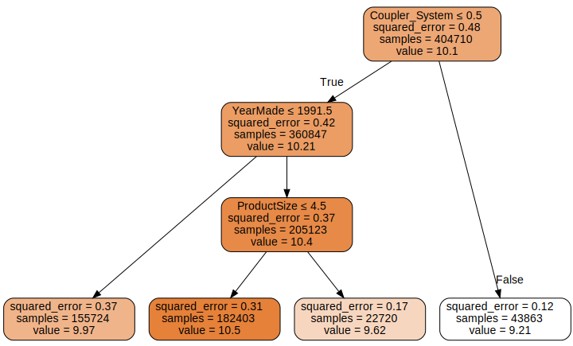

```python
dtreeviz
```
```text
<function dtreeviz.trees.dtreeviz(tree_model, x_data: (<class 'pandas.core.frame.DataFrame'>, <class 'numpy.ndarray'>) = None, y_data: (<class 'pandas.core.frame.DataFrame'>, <class 'numpy.ndarray'>) = None, feature_names: List[str] = None, target_name: str = None, class_names: (typing.Mapping[numbers.Number, str], typing.List[str]) = None, tree_index: int = None, precision: int = 2, orientation: ('TD', 'LR') = 'TD', instance_orientation: ('TD', 'LR') = 'LR', show_root_edge_labels: bool = True, show_node_labels: bool = False, show_just_path: bool = False, fancy: bool = True, histtype: ('bar', 'barstacked', 'strip') = 'barstacked', highlight_path: List[int] = [], X: numpy.ndarray = None, max_X_features_LR: int = 10, max_X_features_TD: int = 20, depth_range_to_display: tuple = None, label_fontsize: int = 12, ticks_fontsize: int = 8, fontname: str = 'Arial', title: str = None, title_fontsize: int = 14, colors: dict = None, scale=1.0) -> dtreeviz.trees.DTreeViz>
```

#### dtreeviz : Decision Tree Visualization
* A python library for decision tree visualization and model interpretation.
* [GitHub Repository](https://github.com/parrt/dtreeviz)
* [Blog Post](https://explained.ai/decision-tree-viz/)

```python
samp_idx = np.random.permutation(len(y))[:500]
dtreeviz(m, xs.iloc[samp_idx], y.iloc[samp_idx], xs.columns, dep_var,
        fontname='DejaVu Sans', scale=1.6, label_fontsize=10,
        orientation='LR')
```
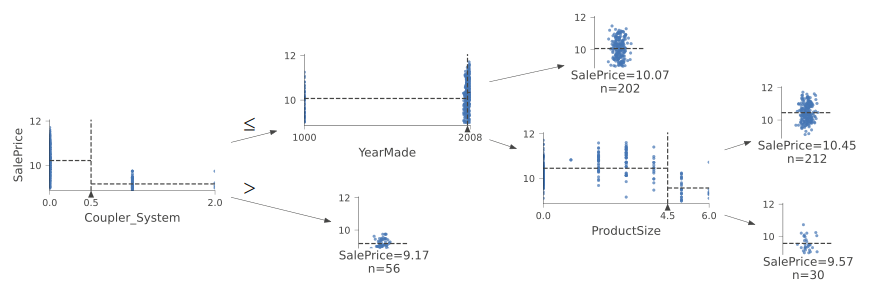

**Note:** There is a clear problem with the year made data. There are bulldozers with YearMade values of 1000.
* The value `1000` is likely a placeholder value for missing data.
* Makes visualizing the values we are interested more difficult

```python
# Replace YearMade placeholder value with 1950
xs.loc[xs['YearMade']<1900, 'YearMade'] = 1950
valid_xs.loc[valid_xs['YearMade']<1900, 'YearMade'] = 1950
```

```python
m = DecisionTreeRegressor(max_leaf_nodes=4).fit(xs, y)

dtreeviz(m, xs.iloc[samp_idx], y.iloc[samp_idx], xs.columns, dep_var,
        fontname='DejaVu Sans', scale=1.6, label_fontsize=10,
        orientation='LR')
```
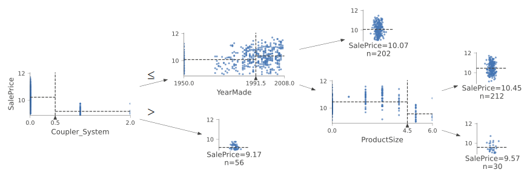

```python
# Don't limit the number of leaf nodes
m = DecisionTreeRegressor()
m.fit(xs, y);
```

```python
def r_mse(pred,y): return round(math.sqrt(((pred-y)**2).mean()), 6)
def m_rmse(m, xs, y): return r_mse(m.predict(xs), y)
```

```python
m_rmse(m, xs, y)
```
```text
0.0
```

```python
m_rmse(m, valid_xs, valid_y)
```
```text
0.334935
```

**Note:** Having too many leaf nodes can result in overfitting

```python
m.get_n_leaves(), len(xs)
```
```text
(324560, 404710)
```

There are nearly as many leaves as there are data points

```python
# Make sure each leaf node contains are least 25 auction records
m = DecisionTreeRegressor(min_samples_leaf=25)
m.fit(to.train.xs, to.train.y)
m_rmse(m, xs, y), m_rmse(m, valid_xs, valid_y)
```
```text
(0.248593, 0.323339)
```

```python
m.get_n_leaves()
```
```text
12397
```


### Categorical Variables
* decision trees do not need embeddings to work with categorical variables
* can use one-hot encoding to replace a single categorical variable with multiple one-hot-encoded columns
    * use the [pandas.get_dummies()](https://pandas.pydata.org/docs/reference/api/pandas.get_dummies.html) method
    * there is not really any evidence that this improves the end result
    * [Splitting on categorical predictors in random forests](https://peerj.com/articles/6339/)


## Random Forests

* perhaps the most widely used and practically important machine learning method
* train a a bunch of decision trees, each one on a different random subset of the data, and average the predictions.
* random forests are not very sensitive to hyperparameter choices

#### [Bagging Predictors](https://www.stat.berkeley.edu/~breiman/bagging.pdf)
* Published by retired Berkeley professor Leo Breiman in 1994
* Procedure
    1. Randomly choose a subset of the rows of your data
    2. Train a model using this subset
    3. Save that model and then return to step 1 a few times
    4. This will give you multiple models. To make a prediction, predict using all of the models, and then take the average of each of those predictions.
* key insight: although each of models trained on a subset of data will make more errors, those errors will not be correlated with each other
    * different models will make different errors
* we can improve the accuracy of nearly any kind of machine learning algorithm by training it multiple times, each time on a different random subset of the data, and averaging its predictions.

```python

# pip install —pre -f https://sklearn-nightly.scdn8.secure.raxcdn.com scikit-learn —U
```

### Creating a Random Forest
* n_estimators: number of decision trees
    * can have as many as you have time to train
* max_sample: how many rows to sample for training each tree
* max_features: how many colums to sample at each split point
    * random forests are not very sensitive to this

```python
RandomForestRegressor
```
```text
sklearn.ensemble._forest.RandomForestRegressor
```


#### scikit-learn RandomForestRegressor
* [Documentation](https://scikit-learn.org/stable/modules/generated/sklearn.ensemble.RandomForestRegressor.html)
* A random forest regressor

```python
def rf(xs, y, n_estimators=40, max_samples=200_000,
       max_features=0.5, min_samples_leaf=5, **kwargs):
    return RandomForestRegressor(n_jobs=-1, n_estimators=n_estimators,
        max_samples=max_samples, max_features=max_features,
        min_samples_leaf=min_samples_leaf, oob_score=True).fit(xs, y)
```

```python
m = rf(xs, y);
```

```python
m_rmse(m, xs, y), m_rmse(m, valid_xs, valid_y)
```
```text
(0.170966, 0.232699)
```

```python
# Get the predictions from each decision tree in the forest
preds = np.stack([t.predict(valid_xs.values) for t in m.estimators_])
```

```python
r_mse(preds.mean(0), valid_y)
```
```text
0.232699
```

```python
# See the impact of adding more trees on accuracy
plt.plot([r_mse(preds[:i+1].mean(0), valid_y) for i in range(40)]);
```
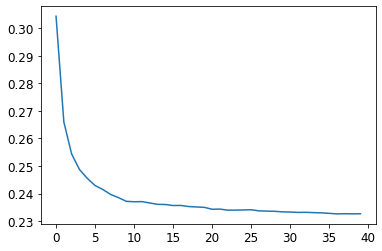

**Note:** There is a significant diminishing returns after about 30 trees

### Out-of-Bag Error
* measure the prediction error of trees on data not included in their data subset

```python
r_mse(m.oob_prediction_, y)
```
```text
0.210776
```


## Model Interpretation

* How confident are we in our predictions using a particular row of data?
* For predicting with a particular row of data, what were the most important factors, and how did they influence that prediction?
* Which columns are effectively redundant with each other, for purposes of our prediction?
* How do predictions vary as we vary these columns?

### Tree Variance for Prediction Confidence
* use the standard deviation of predictions across the trees, instead of just the mean
* tells us the relative confidence of predictions
* we would want to be more cautious of using results for rows where trees give very different results, compared to cases where they are more consistent

```python
# Get the predictions for every tree in the forest
preds = np.stack([t.predict(valid_xs.values) for t in m.estimators_])
```

```python
preds.shape
```
```text
(40, 7988)
```

```python
# Calculate the standard deviation
preds_std = preds.std(0)
```

```python
preds_std[:5]
```
```text
array([0.26069358, 0.10409366, 0.09904178, 0.27184634, 0.13110276])
```

### Feature Importance
* helps us learn how the random forest makes its predictions
#### Steps
1. loop through each tree
2. recursively explore each branch
3. at each branch, look to see what feature was used for that split, and how much the model improves as a result of that split
4. the improvement is added to the importance score for that feature
* sum importance scores across all branches of all trees and normalize them such that they add to 1

```python
def rf_feat_importance(m, df):
    # Get the feature importance values of each column and place them into a dataframe
    return pd.DataFrame({'cols':df.columns, 'imp':m.feature_importances_}
                       ).sort_values('imp', ascending=False)
```

```python
fi = rf_feat_importance(m, xs)
fi[:10]
```
<div style="overflow-x:auto;">
<table border="1" class="dataframe">
  <thead>
    <tr style="text-align: right;">
      <th></th>
      <th>cols</th>
      <th>imp</th>
    </tr>
  </thead>
  <tbody>
    <tr>
      <th>57</th>
      <td>YearMade</td>
      <td>0.173023</td>
    </tr>
    <tr>
      <th>6</th>
      <td>ProductSize</td>
      <td>0.117253</td>
    </tr>
    <tr>
      <th>30</th>
      <td>Coupler_System</td>
      <td>0.117053</td>
    </tr>
    <tr>
      <th>7</th>
      <td>fiProductClassDesc</td>
      <td>0.073112</td>
    </tr>
    <tr>
      <th>54</th>
      <td>ModelID</td>
      <td>0.054777</td>
    </tr>
    <tr>
      <th>65</th>
      <td>saleElapsed</td>
      <td>0.048835</td>
    </tr>
    <tr>
      <th>3</th>
      <td>fiSecondaryDesc</td>
      <td>0.046104</td>
    </tr>
    <tr>
      <th>31</th>
      <td>Grouser_Tracks</td>
      <td>0.041196</td>
    </tr>
    <tr>
      <th>12</th>
      <td>Enclosure</td>
      <td>0.040495</td>
    </tr>
    <tr>
      <th>32</th>
      <td>Hydraulics_Flow</td>
      <td>0.032725</td>
    </tr>
  </tbody>
</table>
</div>

**Note:** The first few most important features have much higher importance scores than the rest 

```python
def plot_fi(fi):
    return fi.plot('cols', 'imp', 'barh', figsize=(12,7), legend=False)

plot_fi(fi[:30]);
```
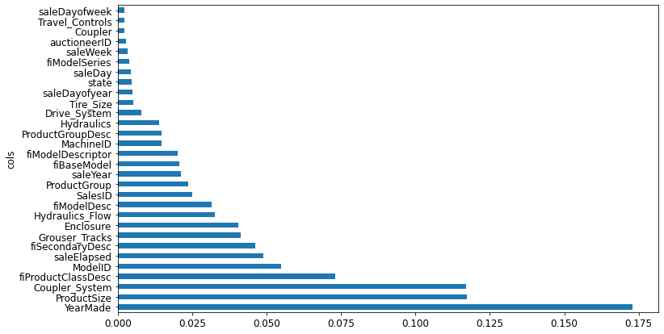

### Removing Low-Importance Variables
* generally, the first step to improving a model is simplifying it
* a simpler, more interpretable model is often easier to deploy and maintain

```python
# Only keep columns with a feature importance greater than 0.005
to_keep = fi[fi.imp>0.005].cols
len(to_keep)
```
```text
21
```

```python
xs_imp = xs[to_keep]
valid_xs_imp = valid_xs[to_keep]
```

```python
m = rf(xs_imp, y)
```

```python
m_rmse(m, xs_imp, y), m_rmse(m, valid_xs_imp, valid_y)
```
```text
(0.18131, 0.230503)
```

**Note:** Accuracy is about the same, but there are far fewer columns to study

```python
len(xs.columns), len(xs_imp.columns)
```
```text
(66, 21)
```

```python
plot_fi(rf_feat_importance(m, xs_imp));
```
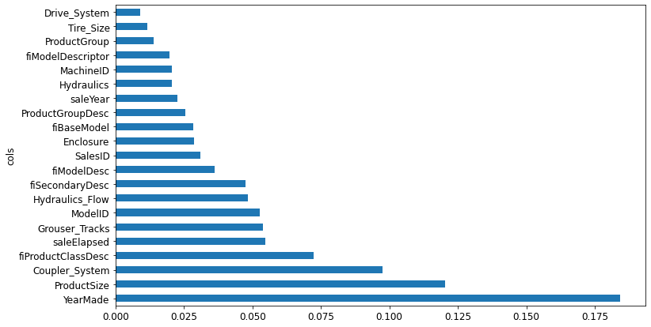

### Removing Redundant Features

#### Determining Similarity
* the most similar pairs are found by calculating the rank correlation
* rank correlation: all the values are replaced with their rank within the column, and then the correlation is calculated

```python
cluster_columns(xs_imp)
```
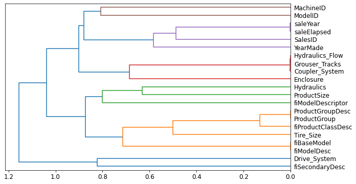

**Note:** The pairs of columns that are most similar are the ones that were merged together early in the chart.

```python
# Train a relatively small random forest and return the OOB score
def get_oob(df):
    m = RandomForestRegressor(n_estimators=40, min_samples_leaf=15,
        max_samples=50000, max_features=0.5, n_jobs=-1, oob_score=True)
    m.fit(df, y)
    return m.oob_score_
```

```python
get_oob(xs_imp)
```
```text
0.8781576734893485
```

**Note:** The OOB score is a number returns by sklearn that ranges between 1.0 for a perfect model and 0 for a random model

Try removing potentially redundant variables one at a time.

```python
{c:get_oob(xs_imp.drop(c, axis=1)) for c in (
    'saleYear', 'saleElapsed', 'ProductGroupDesc','ProductGroup',
    'fiModelDesc', 'fiBaseModel',
    'Hydraulics_Flow','Grouser_Tracks', 'Coupler_System')}
```
```text
{'saleYear': 0.8768628311464004,
 'saleElapsed': 0.8722097904682757,
 'ProductGroupDesc': 0.8770087512874477,
 'ProductGroup': 0.8778594920344923,
 'fiModelDesc': 0.8754781084425128,
 'fiBaseModel': 0.8761168180455399,
 'Hydraulics_Flow': 0.8774995916903535,
 'Grouser_Tracks': 0.8775565092698138,
 'Coupler_System': 0.8770165273393064}
```

```python
to_drop = ['saleYear', 'ProductGroupDesc', 'fiBaseModel', 'Grouser_Tracks']
get_oob(xs_imp.drop(to_drop, axis=1))
```
```text
0.8750482697068109
```

**Note:** The result is nearly identical to the performance of the model with all the fields.

```python
# Create DataFrames without the redundant columns
xs_final = xs_imp.drop(to_drop, axis=1)
valid_xs_final = valid_xs_imp.drop(to_drop, axis=1)
```

```python
# Save the updated DataFrames
save_pickle(path/'xs_final.pkl', xs_final)
save_pickle(path/'valid_xs_final.pkl', valid_xs_final)
```

```python
xs_final = load_pickle(path/'xs_final.pkl')
valid_xs_final = load_pickle(path/'valid_xs_final.pkl')
```

```python
m = rf(xs_final, y)
m_rmse(m, xs_final, y), m_rmse(m, valid_xs_final, valid_y)
```
```text
(0.183251, 0.232259)
```

**Note:** The accuracy has not really changed after removing the redundant columns

### Partial Dependence
* If a row varied on nothing other than the feature in question, how would it impact the dependent variable?
* Example: How does `YearMade` impact sales price, all other things being equal?

#### [THE BOOK OF WHY: THE NEW SCIENCE OF CAUSE AND EFFECT](https://www.amazon.com/Book-Why-Science-Cause-Effect/dp/046509760X)
* Written by JUDEA PEARL AND DANA MACKENZIE

```python
p = valid_xs_final['ProductSize'].value_counts(sort=False).plot.barh()
c = to.classes['ProductSize']
plt.yticks(range(len(c)), c);
```


**Note:** A large amount of data points have missing values for `ProductSize`

```python
ax = valid_xs_final['YearMade'].hist()
```


**Note:** Most of the data is from after 1990

```python
from sklearn.inspection import PartialDependenceDisplay
```

```python
PartialDependenceDisplay.from_estimator
```
```text
<bound method PartialDependenceDisplay.from_estimator of <class 'sklearn.inspection._plot.partial_dependence.PartialDependenceDisplay'>>
```


#### sklearn PartialDependenceDisplay.from_estimator
* [Documentation](https://scikit-learn.org/stable/modules/generated/sklearn.inspection.PartialDependenceDisplay.html)
* Partial Dependence Plot (PDP)

```python
fig,ax = plt.subplots(figsize=(12, 4))
PartialDependenceDisplay.from_estimator(m, valid_xs_final, ['YearMade','ProductSize'],
                        grid_resolution=20, ax=ax);
```
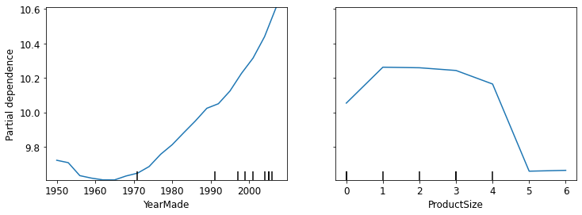

**Note:** There is a nearly linear (log) relationship between sale price and year made. 

**Note:** The group with missing values has the lowest price.
* Missing values can sometimes be useful predictors, depending on what causes them to be missing
* Missing values can also indicate data leakage.

### Data Leakage
* **[Leakage in data mining: formulation, detection, and avoidance](https://dl.acm.org/doi/10.1145/2020408.2020496)**
* **data leakage:** "the introduction of information about the target of a data mining problem which should not be legitimately available to mine from"
* data leakage is subtle and can take many forms
* missing values often represent data leakage

#### Case Study
* A Kaggle competition designed to predict which researchers would end up receiving research grants
* Using feature importance on a random forest revealed that
    * the model was able to correctly predict who would receive grants 95% of the time
    * apparently meaningless identifier columns were the most important predictors
    * the day of week and day of year columns were also highly predictive
        * the vast majority of grant applications dated on a Sunday were accepted, and many accepted applications were dated on January 1
* a partial dependence plot showed that when the information for the identifier columns was missing, the application was almost always rejected
* It turned out that the University only filled out much of after an application was already accepted
    * The information was not available at the time the application was received and would not be available to a predictive model
* Additionaly, the final processing of applications was often done automatically as a batch at the end of the week, or the end of the year.

#### Identifying Data Leakage
* Check whether the accuracy of the model is too good to be true
* Look for important predictors that don't make sense in practice
* Look for partial dependence plot results that don't make sense in practice

### Tree Interpreter
* Helps answer the question "For predicting widht a particular row of data, what were the most important factors, and how did they influence that prediction"

```python

import warnings
warnings.simplefilter('ignore', FutureWarning)

from treeinterpreter import treeinterpreter
from waterfall_chart import plot as waterfall
```

```python
row = valid_xs_final.iloc[:5]
```

#### TreeInterpreter
* [GitHub Repository](https://github.com/andosa/treeinterpreter)
* Package for interpreting scikit-learn's decision tree and random forest predictions.

```python
treeinterpreter.predict
```
```text
<function treeinterpreter.treeinterpreter.predict(model, X, joint_contribution=False)>
```

```python
print_source(treeinterpreter.predict)
```
```text
def predict(model, X, joint_contribution=False):
    """ Returns a triple (prediction, bias, feature_contributions), such
    that prediction ≈ bias + feature_contributions.
    Parameters
    ----------
    model : DecisionTreeRegressor, DecisionTreeClassifier,
        ExtraTreeRegressor, ExtraTreeClassifier,
        RandomForestRegressor, RandomForestClassifier,
        ExtraTreesRegressor, ExtraTreesClassifier
    Scikit-learn model on which the prediction should be decomposed.

    X : array-like, shape = (n_samples, n_features)
    Test samples.
    
    joint_contribution : boolean
    Specifies if contributions are given individually from each feature,
    or jointly over them

    Returns
    -------
    decomposed prediction : triple of
    * prediction, shape = (n_samples) for regression and (n_samples, n_classes)
        for classification
    * bias, shape = (n_samples) for regression and (n_samples, n_classes) for
        classification
    * contributions, If joint_contribution is False then returns and  array of 
        shape = (n_samples, n_features) for regression or
        shape = (n_samples, n_features, n_classes) for classification, denoting
        contribution from each feature.
        If joint_contribution is True, then shape is array of size n_samples,
        where each array element is a dict from a tuple of feature indices to
        to a value denoting the contribution from that feature tuple.
    """
    # Only single out response variable supported,
    if model.n_outputs_ > 1:
        raise ValueError("Multilabel classification trees not supported")

    if (isinstance(model, DecisionTreeClassifier) or
        isinstance(model, DecisionTreeRegressor)):
        return _predict_tree(model, X, joint_contribution=joint_contribution)
    elif (isinstance(model, RandomForestClassifier) or
          isinstance(model, ExtraTreesClassifier) or
          isinstance(model, RandomForestRegressor) or
          isinstance(model, ExtraTreesRegressor)):
        return _predict_forest(model, X, joint_contribution=joint_contribution)
    else:
        raise ValueError("Wrong model type. Base learner needs to be a "
                         "DecisionTreeClassifier or DecisionTreeRegressor.")
```

* **prediction:** the prediction made by the random forest
* **bias:** the prediction based on taking the mean of the dependent variable
* **contributions:** the total change in prediction due to each of the independent variables
* the sum of contributions plus bias must equal the prediction for each row


```python
prediction,bias,contributions = treeinterpreter.predict(m, row.values)
```

```python
prediction[0], bias[0], contributions[0].sum()
```
```text
(array([9.94708073]), 10.104746057831763, -0.15766532528651994)
```

```python
waterfall
```
```text
<function waterfall_chart.plot(index, data, Title='', x_lab='', y_lab='', formatting='{:,.1f}', green_color='#29EA38', red_color='#FB3C62', blue_color='#24CAFF', sorted_value=False, threshold=None, other_label='other', net_label='net', rotation_value=30)>
```

#### waterfallcharts
* [GitHub Repository](https://github.com/chrispaulca/waterfall)
* Quickly generates standard waterfall charts, takes two ordered lists as inputs.
* Waterfall charts are useful for visualizing marginal value contributions to some system

```python
waterfall(valid_xs_final.columns, contributions[0], threshold=0.08, 
          rotation_value=45,formatting='{:,.3f}');
```
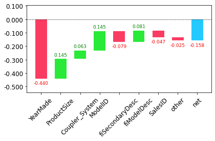

**Note:** This kind of information is most useful in production, rather than during model development.
* Can provide useful information to users of your data product about the underlying reasoning behind the predictions


## Extrapolation and Neural Networks

* random forests don't always generalize well to new data

### The Extrapolation Problem
```python

np.random.seed(42)
```

```python
# Generate some data points with a slightly noisy linear relationship
x_lin = torch.linspace(0,20, steps=40)
y_lin = x_lin + torch.randn_like(x_lin)
plt.scatter(x_lin, y_lin);
```
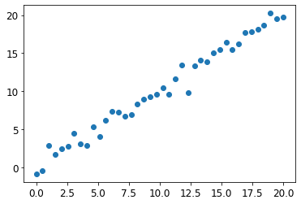

```python
# Expand single independent variable into a matrix to accommodate sklearn
xs_lin = x_lin.unsqueeze(1)
x_lin.shape,xs_lin.shape
```
```text
(torch.Size([40]), torch.Size([40, 1]))
```

```python
# Alternative: Slice the tensor with the special value None
# introduces an additional unit axis at that location
x_lin[:,None].shape
```
```text
torch.Size([40, 1])
```

```python
m_lin = RandomForestRegressor().fit(xs_lin[:30],y_lin[:30])
```

```python
plt.scatter(x_lin, y_lin, 20)
plt.scatter(x_lin, m_lin.predict(xs_lin), color='red', alpha=0.5);
```
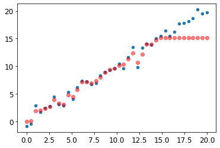

**None:** The predictions outside the domain of the training data are all too low.
* A tree and a random forest can never predict values outside the range of the training data
    * A random forest just averages the predictions of a number of trees
    * A tree just predicts the average value of the rows in a leaf
* Need to make sure our validation set does not contain out of domain data

### Finding Out-of-Domain Data
* we can use a random forest to find out-of-domain data
    * try to predict whether a row is in the validation set or the training set

```python
# Combine validation and training sets
df_dom = pd.concat([xs_final, valid_xs_final])
# Add a dependent variable to track whether a data point is from the validation set
is_valid = np.array([0]*len(xs_final) + [1]*len(valid_xs_final))
# Create and train a random forest
m = rf(df_dom, is_valid)
# Get the feature importance for the random forest
rf_feat_importance(m, df_dom)[:6]
```
<div style="overflow-x:auto;">
<table border="1" class="dataframe">
  <thead>
    <tr style="text-align: right;">
      <th></th>
      <th>cols</th>
      <th>imp</th>
    </tr>
  </thead>
  <tbody>
    <tr>
      <th>5</th>
      <td>saleElapsed</td>
      <td>0.858008</td>
    </tr>
    <tr>
      <th>10</th>
      <td>SalesID</td>
      <td>0.098377</td>
    </tr>
    <tr>
      <th>13</th>
      <td>MachineID</td>
      <td>0.035284</td>
    </tr>
    <tr>
      <th>0</th>
      <td>YearMade</td>
      <td>0.002645</td>
    </tr>
    <tr>
      <th>4</th>
      <td>ModelID</td>
      <td>0.001238</td>
    </tr>
    <tr>
      <th>7</th>
      <td>Enclosure</td>
      <td>0.000891</td>
    </tr>
  </tbody>
</table>
</div>

**Note:** Three columns differ significantly between the training and validation sets
* saleElapsed: the number of days between the start of the dataset and each row
* SalesID: suggests the identifiers for auction sales might increment over time
* MachineID: suggests the identifier might increment over time

```python
# Get a baseline of the original random forest model's RMSE
m = rf(xs_final, y)
print('orig', m_rmse(m, valid_xs_final, valid_y))
# Determine the effect of removing the three columns of note
for c in ('SalesID','saleElapsed','MachineID'):
    m = rf(xs_final.drop(c,axis=1), y)
    print(c, m_rmse(m, valid_xs_final.drop(c,axis=1), valid_y))
```
```text
orig 0.231847
SalesID 0.231492
saleElapsed 0.235826
MachineID 0.231672
```

**Note:** We should be able to remove SalesID and MachineID without losing any accuracy.

```python
# Remove both SalesID and MachineID
time_vars = ['SalesID','MachineID']
xs_final_time = xs_final.drop(time_vars, axis=1)
valid_xs_time = valid_xs_final.drop(time_vars, axis=1)

m = rf(xs_final_time, y)
m_rmse(m, valid_xs_time, valid_y)
```
```text
0.228826
```

**Note:** Removing the variables slightly improved the model's accuracy.
* Should also make it more resilient over time, and the model should be easier to maintain and understand.

**Note:** It can also help to remove old data when it show relationships that are not valid anymore.

```python
xs['saleYear'].hist();
```
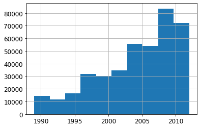

```python
# Only use data more recent than 2004
filt = xs['saleYear']>2004
xs_filt = xs_final_time[filt]
y_filt = y[filt]
```

```python
m = rf(xs_filt, y_filt)
m_rmse(m, xs_filt, y_filt), m_rmse(m, valid_xs_time, valid_y)
```
```text
(0.177757, 0.229866)
```

**Note:** Accuracy is a little bit better.

### Using a Neural Network
#### fastai's Tabular Classes
* a fastai tabular model is a model that takes columns of continuous or categorical data, and predicts a catefory or a continuous value
* categorical independent variables are passed through an embedding and concatenated, and then any continuous variables are concatenated as well
* the model created in [tabular_learner](https://docs.fast.ai/tabular.learner.html#tabular_learner) is an object of class [TabularModel](https://docs.fast.ai/tabular.model.html#TabularModel)

```python
print_source(tabular_learner)
```
```text
@delegates(Learner.__init__)
def tabular_learner(dls, layers=None, emb_szs=None, config=None, n_out=None, y_range=None, **kwargs):
    "Get a `Learner` using `dls`, with `metrics`, including a `TabularModel` created using the remaining params."
    if config is None: config = tabular_config()
    if layers is None: layers = [200,100]
    to = dls.train_ds
    emb_szs = get_emb_sz(dls.train_ds, {} if emb_szs is None else emb_szs)
    if n_out is None: n_out = get_c(dls)
    assert n_out, "`n_out` is not defined, and could not be inferred from data, set `dls.c` or pass `n_out`"
    if y_range is None and 'y_range' in config: y_range = config.pop('y_range')
    model = TabularModel(emb_szs, len(dls.cont_names), n_out, layers, y_range=y_range, **config)
    return TabularLearner(dls, model, **kwargs)
```


```python
print_source(TabularModel)
```
```text
class TabularModel(Module):
    "Basic model for tabular data."
    def __init__(self, emb_szs, n_cont, out_sz, layers, ps=None, embed_p=0.,
                 y_range=None, use_bn=True, bn_final=False, bn_cont=True, act_cls=nn.ReLU(inplace=True),
                 lin_first=True):
        ps = ifnone(ps, [0]*len(layers))
        if not is_listy(ps): ps = [ps]*len(layers)
        self.embeds = nn.ModuleList([Embedding(ni, nf) for ni,nf in emb_szs])
        self.emb_drop = nn.Dropout(embed_p)
        self.bn_cont = nn.BatchNorm1d(n_cont) if bn_cont else None
        n_emb = sum(e.embedding_dim for e in self.embeds)
        self.n_emb,self.n_cont = n_emb,n_cont
        sizes = [n_emb + n_cont] + layers + [out_sz]
        actns = [act_cls for _ in range(len(sizes)-2)] + [None]
        _layers = [LinBnDrop(sizes[i], sizes[i+1], bn=use_bn and (i!=len(actns)-1 or bn_final), p=p, act=a, lin_first=lin_first)
                       for i,(p,a) in enumerate(zip(ps+[0.],actns))]
        if y_range is not None: _layers.append(SigmoidRange(*y_range))
        self.layers = nn.Sequential(*_layers)

    def forward(self, x_cat, x_cont=None):
        if self.n_emb != 0:
            x = [e(x_cat[:,i]) for i,e in enumerate(self.embeds)]
            x = torch.cat(x, 1)
            x = self.emb_drop(x)
        if self.n_cont != 0:
            if self.bn_cont is not None: x_cont = self.bn_cont(x_cont)
            x = torch.cat([x, x_cont], 1) if self.n_emb != 0 else x_cont
        return self.layers(x)
```

```python
# Repeat steps to set up a TabularPandas object
df_nn = pd.read_csv(path/'TrainAndValid.csv', low_memory=False)
df_nn['ProductSize'] = df_nn['ProductSize'].astype('category')
df_nn['ProductSize'].cat.set_categories(sizes, ordered=True, inplace=True)
df_nn[dep_var] = np.log(df_nn[dep_var])
df_nn = add_datepart(df_nn, 'saledate')
```

```python
# Remove unwanted columns as was done for the random forest
df_nn_final = df_nn[list(xs_final_time.columns) + [dep_var]]
```

```python
# Split continuous and categorical columns, so the categorical columns can be used for embeddings
# Columns with more than 9000 unique values will be considered continuous
cont_nn,cat_nn = cont_cat_split(df_nn_final, max_card=9000, dep_var=dep_var)
```

**Note:** Make sure `saleElapsed` is set as a continuous variable.

```python
cont_nn
```
```text
['saleElapsed']
```

```python
df_nn_final[cat_nn].nunique()
```
```text
YearMade                73
ProductSize              6
Coupler_System           2
fiProductClassDesc      74
ModelID               5281
fiSecondaryDesc        177
Enclosure                6
Hydraulics_Flow          3
fiModelDesc           5059
ProductGroup             6
fiModelDescriptor      140
Hydraulics              12
Drive_System             4
Tire_Size               17
dtype: int64
```


**Note:** The fact there are two variables pertaining to the "model" of the equipment, both with similar very high cardinalities, suggests that they may contain similar, redundant information.
* This would not necessarily show up when analyzing redundant features, since that relies on the number of variables being sorted in the same order

```python
# Test the impact of removing the 'fiModelDescriptor' column
xs_filt2 = xs_filt.drop('fiModelDescriptor', axis=1)
valid_xs_time2 = valid_xs_time.drop('fiModelDescriptor', axis=1)
m2 = rf(xs_filt2, y_filt)
m_rmse(m2, xs_filt2, y_filt), m_rmse(m2, valid_xs_time2, valid_y)
```
```text
(0.176845, 0.229738)
```

```python
cat_nn.remove('fiModelDescriptor')
```

```python
Normalize
```
```text
fastai.data.transforms.Normalize
```

```python
print_source(Normalize)
```
```text
@docs
class Normalize(DisplayedTransform):
    "Normalize/denorm batch of `TensorImage`"
    parameters,order = L('mean', 'std'),99
    def __init__(self, mean=None, std=None, axes=(0,2,3)): store_attr()

    @classmethod
    def from_stats(cls, mean, std, dim=1, ndim=4, cuda=True): return cls(*broadcast_vec(dim, ndim, mean, std, cuda=cuda))

    def setups(self, dl:DataLoader):
        if self.mean is None or self.std is None:
            x,*_ = dl.one_batch()
            self.mean,self.std = x.mean(self.axes, keepdim=True),x.std(self.axes, keepdim=True)+1e-7

    def encodes(self, x:TensorImage): return (x-self.mean) / self.std
    def decodes(self, x:TensorImage):
        f = to_cpu if x.device.type=='cpu' else noop
        return (x*f(self.std) + f(self.mean))

    _docs=dict(encodes="Normalize batch", decodes="Denormalize batch")
```


```python
# Initialize TabularPandas object with the filtered data
# Add normalization for neural network
procs_nn = [Categorify, FillMissing, Normalize]
to_nn = TabularPandas(df_nn_final, procs_nn, cat_nn, cont_nn,
                      splits=splits, y_names=dep_var)
```

```python
# Can use a large batch size for tabular data
dls = to_nn.dataloaders(1024)
```

```python
# Check the min and max values of the dependent variable
y = to_nn.train.y
y.min(),y.max()
```
```text
(8.465899, 11.863583)
```

```python
# Limit output values to the range [8,12]
# Create a neural network with layer size 500 and 250 for the two hidden layers
learn = tabular_learner(dls, y_range=(8,12), layers=[500,250],
                        n_out=1, loss_func=F.mse_loss)
```

```python
learn.model
```
```text
TabularModel(
  (embeds): ModuleList(
    (0): Embedding(73, 18)
    (1): Embedding(7, 5)
    (2): Embedding(3, 3)
    (3): Embedding(75, 18)
    (4): Embedding(5242, 194)
    (5): Embedding(178, 29)
    (6): Embedding(7, 5)
    (7): Embedding(4, 3)
    (8): Embedding(5060, 190)
    (9): Embedding(7, 5)
    (10): Embedding(141, 26)
    (11): Embedding(13, 7)
    (12): Embedding(5, 4)
    (13): Embedding(18, 8)
  )
  (emb_drop): Dropout(p=0.0, inplace=False)
  (bn_cont): BatchNorm1d(1, eps=1e-05, momentum=0.1, affine=True, track_running_stats=True)
  (layers): Sequential(
    (0): LinBnDrop(
      (0): Linear(in_features=516, out_features=500, bias=False)
      (1): ReLU(inplace=True)
      (2): BatchNorm1d(500, eps=1e-05, momentum=0.1, affine=True, track_running_stats=True)
    )
    (1): LinBnDrop(
      (0): Linear(in_features=500, out_features=250, bias=False)
      (1): ReLU(inplace=True)
      (2): BatchNorm1d(250, eps=1e-05, momentum=0.1, affine=True, track_running_stats=True)
    )
    (2): LinBnDrop(
      (0): Linear(in_features=250, out_features=1, bias=True)
    )
    (3): SigmoidRange(low=8, high=12)
  )
)
```

```python
learn.lr_find()
```
```text
SuggestedLRs(valley=0.00015848931798245758)
```

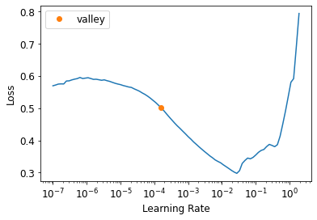

```python
learn.fit_one_cycle(5, 1e-2)
```
<div style="overflow-x:auto;">
<table border="1" class="dataframe">
  <thead>
    <tr style="text-align: left;">
      <th>epoch</th>
      <th>train_loss</th>
      <th>valid_loss</th>
      <th>time</th>
    </tr>
  </thead>
  <tbody>
    <tr>
      <td>0</td>
      <td>0.062503</td>
      <td>0.059019</td>
      <td>00:02</td>
    </tr>
    <tr>
      <td>1</td>
      <td>0.053592</td>
      <td>0.060456</td>
      <td>00:02</td>
    </tr>
    <tr>
      <td>2</td>
      <td>0.047904</td>
      <td>0.055088</td>
      <td>00:02</td>
    </tr>
    <tr>
      <td>3</td>
      <td>0.043731</td>
      <td>0.051928</td>
      <td>00:02</td>
    </tr>
    <tr>
      <td>4</td>
      <td>0.040187</td>
      <td>0.050182</td>
      <td>00:02</td>
    </tr>
  </tbody>
</table>
</div>

```python
preds,targs = learn.get_preds()
r_mse(preds,targs)
```
```text
0.224014
```

**Note:** Accuracy is better but the neural network took longer to train and is fussier about hyperparameter tuning.

```python
learn.save('nn')
```
```text
Path('models/nn.pth')
```


## Ensembling
* We can average the predictions of models trained using different algorithms
* The kinds of errors made by the random forest and neural network models are likely quite different
    * The average of their predictions are likely better than either one alone

**Note:** The sklearn and PyTorch models create data of different types.
* Need to convert the PyTorch data to NumPy format


```python
print_source(to_np)
```
```text
def to_np(x):
    "Convert a tensor to a numpy array."
    return apply(lambda o: o.data.cpu().numpy(), x)
```

```python
print_source(apply)
```
```text
def apply(func, x, *args, **kwargs):
    "Apply `func` recursively to `x`, passing on args"
    if is_listy(x): return type(x)([apply(func, o, *args, **kwargs) for o in x])
    if isinstance(x,dict):  return {k: apply(func, v, *args, **kwargs) for k,v in x.items()}
    res = func(x, *args, **kwargs)
    return res if x is None else retain_type(res, x)
```

```python
rf_preds = m.predict(valid_xs_time)
# Average neural network and random forest predictions
ens_preds = (to_np(preds.squeeze()) + rf_preds) /2
```

```python
r_mse(ens_preds,valid_y)
```
```text
0.221967
```

**Note** The accuracy obtained by averaging the predictions of the random forest and neural network is better than either the random forest or neural network alone

### Boosting
* Add models instead of averaging them

#### Steps
1. Train a small model that underfits your dataset
2. Calculate the predictions in the training set for this model
3. Substract the predictions from the targets
    * These are called residuals and represent the error for each point in the training set
4. Go back to step 1, but use the residuals as the targets for training instead of the original targets
5. Continue doing this until you reach a stopping criterion (e.g. max number of trees), or your validation error gets worse

* The residuals should get smaller and smaller as more trees are added
* Make predictions by calculating the predictions from each tree and adding them all together
* There is nothing to prevent overfitting when using boosting
* Gradient boosted trees are extremely sensitive to hyperparameter tuning
    * it is common practice to loop through a range of hyperparameter values to see which works best
    
#### scikit-learn HistGradientBoostingRegressor
* [Documentation](https://scikit-learn.org/stable/modules/generated/sklearn.ensemble.HistGradientBoostingRegressor.html)
* Histogram-based Gradient Boosting Regression Tree.

### Combining Embeddings with Other Methods
* the embedding learned by a neural network can be used to boost the performance of other machine learning models
* use the learned embeddings as input features
* can dramatically improve accuracy over using raw categorical variables
* allows you to get much of the accuracy of a neural network without having to use a neural network at inference time
* a set of embeddings can be trained once be used across multiple models


## References

* [Deep Learning for Coders with fastai & PyTorch](https://www.oreilly.com/library/view/deep-learning-for/9781492045519/)
* [The fastai book GitHub Repository](https://github.com/fastai/fastbook)