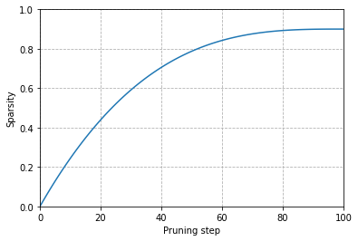

* [Making Transformers Efficient in Production](#making-transformers-efficient-in-production)
* [Project: Optimize an Intent Detection Model](#project-optimize-an-intent-detection-model)
* [Creating a Performance Benchmark](#creating-a-performance-benchmark)
* [Making Models Smaller via Knowledge Distillation](#Making Models Smaller via Knowledge Distillation)
* [A Primer on Floating-Point and Fixed-Point Numbers](#a-primer-on-floating-point-and-fixed-point-numbers)
* [Making Models Faster with Quantization](#making-models-faster-with-quantization)
* [Optimizing Inference with ONNX and the ONNX Runtime](#optimizing-inference-with-onnx-and-the-onnx-runtime)
* [Making Models Sparser with Weight Pruning](#making-models-sparser-with-weight-pruning)
* [References](#references)


------

```python
import transformers
import datasets
import accelerate

# Only print error messages
transformers.logging.set_verbosity_error()
datasets.logging.set_verbosity_error()

transformers.__version__, datasets.__version__, accelerate.__version__
```
```text
    ('4.18.0', '2.0.0', '0.5.1')
```

------

```python
import ast
# https://astor.readthedocs.io/en/latest/
import astor
import inspect
import textwrap
def print_source(obj, exclude_doc=True):
    
    # Get source code
    source = inspect.getsource(obj)
    # Remove any common leading whitespace from every line
    cleaned_source = textwrap.dedent(source)
    # Parse the source into an AST node.
    parsed = ast.parse(cleaned_source)

    for node in ast.walk(parsed):
        # Skip any nodes that are not class or function definitions
        if not isinstance(node, (ast.FunctionDef, ast.ClassDef, ast.AsyncFunctionDef)):
            continue
        
        if exclude_doc and len(node.body) > 1: node.body = node.body[1:]
        
    print(astor.to_source(parsed))
```

------


## Making Transformers Efficient in Production

* A state-of-the-art model is not very useful if it is too slow or too large to meet an application's business requirements.
* Starting with a faster, more compact model often results in degraded performance.
* Knowledge distillation, quantization, pruning, and graph optimization are complementary techniques that can speed up predictions and reduce the memory footprint of models.
* We can combine some of these techniques to produce significant performance gains.
* [Roblox: How We Scaled Bert To Serve 1+ Billion Daily Requests on CPUs](https://blog.roblox.com/2020/05/scaled-bert-serve-1-billion-daily-requests-cpus/)
    * Roblox improved the latency and throughput of their BERT classifier by over 30x by combining knowledge distillation and quantization.

## Project: Optimize an Intent Detection Model
* The goal is to create a text-based assistant for a call center so customers can request their account balance and make bookings.
* The assistant must be able to classify a wide variety of natural language text into a set of predefined intents.
* The classifier must also handle out-of-scope queries and yield fallback responses when they do not belong to any predefined intents.

### The Model
* The baseline model is a fine-tuned BERT-base model that achieves 94% accuracy on the CLINC150 dataset.
* [Hugging Face Dataset Card](https://huggingface.co/transformersbook/bert-base-uncased-finetuned-clinc)

### CLINC150 Dataset
* [Homepage](https://github.com/clinc/oos-eval/)
* [HuggingFace Dataset Card](https://huggingface.co/datasets/clinc_oos)
* The CLINC150 dataset includes 22,500 in-scope queries across 150 intents and ten domains.
* The dataset contains 1,200 out-of-scope queries that belong to an oos intent class.

------


```python
from transformers import pipeline
```

------

**Instantiate a text classification pipeline with the baseline model**


```python
bert_ckpt = "transformersbook/bert-base-uncased-finetuned-clinc"
pipe = pipeline("text-classification", model=bert_ckpt)
```

------

**Classify a sample query**


```python
query = """Hey, I'd like to rent a vehicle from Nov 1st to Nov 15th in 
Paris and I need a 15 passenger van"""
pipe(query)
```
```text
    [{'label': 'car_rental', 'score': 0.549003541469574}]
```

**Note:** The model correctly detects that the user wants to rent a vehicle.

------


## Creating a Performance Benchmark

* Deploying transformers in production involves a tradeoff between several constraints.
* Business and product metrics are the most important to consider.
* Model performance refers to how the model performs on a well-crafted test set representing production data.
* Model performance is especially crucial when the cost of making errors is high or when performing inference on millions of examples and minor improvements translate to significant gains.
* Latency refers to how fast the model delivers predictions. Latency is most important for real-time environments with lots of traffic.
    * [The Unfriendly Robot: Automatically flagging unwelcoming comments](https://stackoverflow.blog/2020/04/09/the-unfriendly-robot-automatically-flagging-unwelcoming-comments/)
* Memory constraints play an important role in mobile and edge devices where we need to perform inference without access to a cloud server.
* Failing to address these constraints can negatively impact the user experience. 
* Running expensive cloud servers that may only need to handle a few requests can lead to ballooning costs.

**Define a benchmark that measures model performance, latency, and memory usage**


```python
class PerformanceBenchmark:
    def __init__(self, pipeline, dataset, optim_type="BERT baseline"):
        self.pipeline = pipeline
        self.dataset = dataset
        self.optim_type = optim_type
        
    def compute_accuracy(self):
        # We'll define this later
        pass    

    def compute_size(self):
        # We'll define this later
        pass

    def time_pipeline(self):
        # We'll define this later
        pass
    
    def run_benchmark(self):
        metrics = {}
        metrics[self.optim_type] = self.compute_size()
        metrics[self.optim_type].update(self.time_pipeline())
        metrics[self.optim_type].update(self.compute_accuracy())
        return metrics
```

------


```python
from datasets import load_dataset
```

------

**Load the CLINC150 Dataset**


```python
clinc = load_dataset("clinc_oos", "plus")
```

```python
clinc
```
```text
    DatasetDict({
        train: Dataset({
            features: ['text', 'intent'],
            num_rows: 15250
        })
        validation: Dataset({
            features: ['text', 'intent'],
            num_rows: 3100
        })
        test: Dataset({
            features: ['text', 'intent'],
            num_rows: 5500
        })
    })
```


**Note:** 
* The `plus` configuration refers to the subset that contains the out-of-scope training examples.
* Each example consists of a query in the text column and its corresponding intent.

------

**View an example**


```python
sample = clinc["test"][42]
sample
```
```text
    {'text': 'transfer $100 from my checking to saving account', 'intent': 133}
```

------

**Map intent ID to the corresponding string**


```python
intents = clinc["test"].features["intent"]
intents.int2str(sample["intent"])
```
```text
    'transfer'
```

------

```python
import pandas as pd
pd.set_option('max_colwidth', None)
pd.set_option('display.max_rows', None)
pd.set_option('display.max_columns', None)
```

------


```python
pd.DataFrame(intents._int2str)
```
<div style="overflow-x:auto; overflow-y:auto; height:600px">
<table border="1" class="dataframe">
  <thead>
    <tr style="text-align: right;">
      <th></th>
      <th>0</th>
    </tr>
  </thead>
  <tbody>
    <tr>
      <th>0</th>
      <td>restaurant_reviews</td>
    </tr>
    <tr>
      <th>1</th>
      <td>nutrition_info</td>
    </tr>
    <tr>
      <th>2</th>
      <td>account_blocked</td>
    </tr>
    <tr>
      <th>3</th>
      <td>oil_change_how</td>
    </tr>
    <tr>
      <th>4</th>
      <td>time</td>
    </tr>
    <tr>
      <th>5</th>
      <td>weather</td>
    </tr>
    <tr>
      <th>6</th>
      <td>redeem_rewards</td>
    </tr>
    <tr>
      <th>7</th>
      <td>interest_rate</td>
    </tr>
    <tr>
      <th>8</th>
      <td>gas_type</td>
    </tr>
    <tr>
      <th>9</th>
      <td>accept_reservations</td>
    </tr>
    <tr>
      <th>10</th>
      <td>smart_home</td>
    </tr>
    <tr>
      <th>11</th>
      <td>user_name</td>
    </tr>
    <tr>
      <th>12</th>
      <td>report_lost_card</td>
    </tr>
    <tr>
      <th>13</th>
      <td>repeat</td>
    </tr>
    <tr>
      <th>14</th>
      <td>whisper_mode</td>
    </tr>
    <tr>
      <th>15</th>
      <td>what_are_your_hobbies</td>
    </tr>
    <tr>
      <th>16</th>
      <td>order</td>
    </tr>
    <tr>
      <th>17</th>
      <td>jump_start</td>
    </tr>
    <tr>
      <th>18</th>
      <td>schedule_meeting</td>
    </tr>
    <tr>
      <th>19</th>
      <td>meeting_schedule</td>
    </tr>
    <tr>
      <th>20</th>
      <td>freeze_account</td>
    </tr>
    <tr>
      <th>21</th>
      <td>what_song</td>
    </tr>
    <tr>
      <th>22</th>
      <td>meaning_of_life</td>
    </tr>
    <tr>
      <th>23</th>
      <td>restaurant_reservation</td>
    </tr>
    <tr>
      <th>24</th>
      <td>traffic</td>
    </tr>
    <tr>
      <th>25</th>
      <td>make_call</td>
    </tr>
    <tr>
      <th>26</th>
      <td>text</td>
    </tr>
    <tr>
      <th>27</th>
      <td>bill_balance</td>
    </tr>
    <tr>
      <th>28</th>
      <td>improve_credit_score</td>
    </tr>
    <tr>
      <th>29</th>
      <td>change_language</td>
    </tr>
    <tr>
      <th>30</th>
      <td>no</td>
    </tr>
    <tr>
      <th>31</th>
      <td>measurement_conversion</td>
    </tr>
    <tr>
      <th>32</th>
      <td>timer</td>
    </tr>
    <tr>
      <th>33</th>
      <td>flip_coin</td>
    </tr>
    <tr>
      <th>34</th>
      <td>do_you_have_pets</td>
    </tr>
    <tr>
      <th>35</th>
      <td>balance</td>
    </tr>
    <tr>
      <th>36</th>
      <td>tell_joke</td>
    </tr>
    <tr>
      <th>37</th>
      <td>last_maintenance</td>
    </tr>
    <tr>
      <th>38</th>
      <td>exchange_rate</td>
    </tr>
    <tr>
      <th>39</th>
      <td>uber</td>
    </tr>
    <tr>
      <th>40</th>
      <td>car_rental</td>
    </tr>
    <tr>
      <th>41</th>
      <td>credit_limit</td>
    </tr>
    <tr>
      <th>42</th>
      <td>oos</td>
    </tr>
    <tr>
      <th>43</th>
      <td>shopping_list</td>
    </tr>
    <tr>
      <th>44</th>
      <td>expiration_date</td>
    </tr>
    <tr>
      <th>45</th>
      <td>routing</td>
    </tr>
    <tr>
      <th>46</th>
      <td>meal_suggestion</td>
    </tr>
    <tr>
      <th>47</th>
      <td>tire_change</td>
    </tr>
    <tr>
      <th>48</th>
      <td>todo_list</td>
    </tr>
    <tr>
      <th>49</th>
      <td>card_declined</td>
    </tr>
    <tr>
      <th>50</th>
      <td>rewards_balance</td>
    </tr>
    <tr>
      <th>51</th>
      <td>change_accent</td>
    </tr>
    <tr>
      <th>52</th>
      <td>vaccines</td>
    </tr>
    <tr>
      <th>53</th>
      <td>reminder_update</td>
    </tr>
    <tr>
      <th>54</th>
      <td>food_last</td>
    </tr>
    <tr>
      <th>55</th>
      <td>change_ai_name</td>
    </tr>
    <tr>
      <th>56</th>
      <td>bill_due</td>
    </tr>
    <tr>
      <th>57</th>
      <td>who_do_you_work_for</td>
    </tr>
    <tr>
      <th>58</th>
      <td>share_location</td>
    </tr>
    <tr>
      <th>59</th>
      <td>international_visa</td>
    </tr>
    <tr>
      <th>60</th>
      <td>calendar</td>
    </tr>
    <tr>
      <th>61</th>
      <td>translate</td>
    </tr>
    <tr>
      <th>62</th>
      <td>carry_on</td>
    </tr>
    <tr>
      <th>63</th>
      <td>book_flight</td>
    </tr>
    <tr>
      <th>64</th>
      <td>insurance_change</td>
    </tr>
    <tr>
      <th>65</th>
      <td>todo_list_update</td>
    </tr>
    <tr>
      <th>66</th>
      <td>timezone</td>
    </tr>
    <tr>
      <th>67</th>
      <td>cancel_reservation</td>
    </tr>
    <tr>
      <th>68</th>
      <td>transactions</td>
    </tr>
    <tr>
      <th>69</th>
      <td>credit_score</td>
    </tr>
    <tr>
      <th>70</th>
      <td>report_fraud</td>
    </tr>
    <tr>
      <th>71</th>
      <td>spending_history</td>
    </tr>
    <tr>
      <th>72</th>
      <td>directions</td>
    </tr>
    <tr>
      <th>73</th>
      <td>spelling</td>
    </tr>
    <tr>
      <th>74</th>
      <td>insurance</td>
    </tr>
    <tr>
      <th>75</th>
      <td>what_is_your_name</td>
    </tr>
    <tr>
      <th>76</th>
      <td>reminder</td>
    </tr>
    <tr>
      <th>77</th>
      <td>where_are_you_from</td>
    </tr>
    <tr>
      <th>78</th>
      <td>distance</td>
    </tr>
    <tr>
      <th>79</th>
      <td>payday</td>
    </tr>
    <tr>
      <th>80</th>
      <td>flight_status</td>
    </tr>
    <tr>
      <th>81</th>
      <td>find_phone</td>
    </tr>
    <tr>
      <th>82</th>
      <td>greeting</td>
    </tr>
    <tr>
      <th>83</th>
      <td>alarm</td>
    </tr>
    <tr>
      <th>84</th>
      <td>order_status</td>
    </tr>
    <tr>
      <th>85</th>
      <td>confirm_reservation</td>
    </tr>
    <tr>
      <th>86</th>
      <td>cook_time</td>
    </tr>
    <tr>
      <th>87</th>
      <td>damaged_card</td>
    </tr>
    <tr>
      <th>88</th>
      <td>reset_settings</td>
    </tr>
    <tr>
      <th>89</th>
      <td>pin_change</td>
    </tr>
    <tr>
      <th>90</th>
      <td>replacement_card_duration</td>
    </tr>
    <tr>
      <th>91</th>
      <td>new_card</td>
    </tr>
    <tr>
      <th>92</th>
      <td>roll_dice</td>
    </tr>
    <tr>
      <th>93</th>
      <td>income</td>
    </tr>
    <tr>
      <th>94</th>
      <td>taxes</td>
    </tr>
    <tr>
      <th>95</th>
      <td>date</td>
    </tr>
    <tr>
      <th>96</th>
      <td>who_made_you</td>
    </tr>
    <tr>
      <th>97</th>
      <td>pto_request</td>
    </tr>
    <tr>
      <th>98</th>
      <td>tire_pressure</td>
    </tr>
    <tr>
      <th>99</th>
      <td>how_old_are_you</td>
    </tr>
    <tr>
      <th>100</th>
      <td>rollover_401k</td>
    </tr>
    <tr>
      <th>101</th>
      <td>pto_request_status</td>
    </tr>
    <tr>
      <th>102</th>
      <td>how_busy</td>
    </tr>
    <tr>
      <th>103</th>
      <td>application_status</td>
    </tr>
    <tr>
      <th>104</th>
      <td>recipe</td>
    </tr>
    <tr>
      <th>105</th>
      <td>calendar_update</td>
    </tr>
    <tr>
      <th>106</th>
      <td>play_music</td>
    </tr>
    <tr>
      <th>107</th>
      <td>yes</td>
    </tr>
    <tr>
      <th>108</th>
      <td>direct_deposit</td>
    </tr>
    <tr>
      <th>109</th>
      <td>credit_limit_change</td>
    </tr>
    <tr>
      <th>110</th>
      <td>gas</td>
    </tr>
    <tr>
      <th>111</th>
      <td>pay_bill</td>
    </tr>
    <tr>
      <th>112</th>
      <td>ingredients_list</td>
    </tr>
    <tr>
      <th>113</th>
      <td>lost_luggage</td>
    </tr>
    <tr>
      <th>114</th>
      <td>goodbye</td>
    </tr>
    <tr>
      <th>115</th>
      <td>what_can_i_ask_you</td>
    </tr>
    <tr>
      <th>116</th>
      <td>book_hotel</td>
    </tr>
    <tr>
      <th>117</th>
      <td>are_you_a_bot</td>
    </tr>
    <tr>
      <th>118</th>
      <td>next_song</td>
    </tr>
    <tr>
      <th>119</th>
      <td>change_speed</td>
    </tr>
    <tr>
      <th>120</th>
      <td>plug_type</td>
    </tr>
    <tr>
      <th>121</th>
      <td>maybe</td>
    </tr>
    <tr>
      <th>122</th>
      <td>w2</td>
    </tr>
    <tr>
      <th>123</th>
      <td>oil_change_when</td>
    </tr>
    <tr>
      <th>124</th>
      <td>thank_you</td>
    </tr>
    <tr>
      <th>125</th>
      <td>shopping_list_update</td>
    </tr>
    <tr>
      <th>126</th>
      <td>pto_balance</td>
    </tr>
    <tr>
      <th>127</th>
      <td>order_checks</td>
    </tr>
    <tr>
      <th>128</th>
      <td>travel_alert</td>
    </tr>
    <tr>
      <th>129</th>
      <td>fun_fact</td>
    </tr>
    <tr>
      <th>130</th>
      <td>sync_device</td>
    </tr>
    <tr>
      <th>131</th>
      <td>schedule_maintenance</td>
    </tr>
    <tr>
      <th>132</th>
      <td>apr</td>
    </tr>
    <tr>
      <th>133</th>
      <td>transfer</td>
    </tr>
    <tr>
      <th>134</th>
      <td>ingredient_substitution</td>
    </tr>
    <tr>
      <th>135</th>
      <td>calories</td>
    </tr>
    <tr>
      <th>136</th>
      <td>current_location</td>
    </tr>
    <tr>
      <th>137</th>
      <td>international_fees</td>
    </tr>
    <tr>
      <th>138</th>
      <td>calculator</td>
    </tr>
    <tr>
      <th>139</th>
      <td>definition</td>
    </tr>
    <tr>
      <th>140</th>
      <td>next_holiday</td>
    </tr>
    <tr>
      <th>141</th>
      <td>update_playlist</td>
    </tr>
    <tr>
      <th>142</th>
      <td>mpg</td>
    </tr>
    <tr>
      <th>143</th>
      <td>min_payment</td>
    </tr>
    <tr>
      <th>144</th>
      <td>change_user_name</td>
    </tr>
    <tr>
      <th>145</th>
      <td>restaurant_suggestion</td>
    </tr>
    <tr>
      <th>146</th>
      <td>travel_notification</td>
    </tr>
    <tr>
      <th>147</th>
      <td>cancel</td>
    </tr>
    <tr>
      <th>148</th>
      <td>pto_used</td>
    </tr>
    <tr>
      <th>149</th>
      <td>travel_suggestion</td>
    </tr>
    <tr>
      <th>150</th>
      <td>change_volume</td>
    </tr>
  </tbody>
</table>
</div>

------


```python
from datasets import load_metric 
```

------

**Load the accuracy metric**


```python
accuracy_score = load_metric("accuracy")
```


```python
accuracy_score
```
```text
    Metric(name: "accuracy", features: {'predictions': Value(dtype='int32', id=None), 'references': Value(dtype='int32', id=None)}, usage: """
    Args:
        predictions: Predicted labels, as returned by a model.
        references: Ground truth labels.
        normalize: If False, return the number of correctly classified samples.
            Otherwise, return the fraction of correctly classified samples.
        sample_weight: Sample weights.
    Returns:
        accuracy: Accuracy score.
    Examples:
    
        >>> accuracy_metric = datasets.load_metric("accuracy")
        >>> results = accuracy_metric.compute(references=[0, 1], predictions=[0, 1])
        >>> print(results)
        {'accuracy': 1.0}
    """, stored examples: 0)
```


**Note:** The accuracy metric expects the predictions and ground truth labels to be integers.

------

**Implement the `PerformanceBenchmark.compute_accuracy()` method**


```python
def compute_accuracy(self):
    """This overrides the PerformanceBenchmark.compute_accuracy() method"""
    preds, labels = [], []
    # Collect all the predictions and labels into lists
    for example in self.dataset:
        pred = self.pipeline(example["text"])[0]["label"]
        label = example["intent"]
        preds.append(intents.str2int(pred))
        labels.append(label)
    # Compute the accuracy for the predictions
    accuracy = accuracy_score.compute(predictions=preds, references=labels)
    print(f"Accuracy on test set - {accuracy['accuracy']:.3f}")
    return accuracy

# Override the PerformanceBenchmark.compute_accuracy() method
PerformanceBenchmark.compute_accuracy = compute_accuracy
```

------

**Compute the model size**

**Note:**
* We can compute the model size using the torch.save() function.
* The `save()` function uses Python's pickle module.
* The recommended way to save a PyTorch model is by using its state_dict.
* The state_dict is a Python dictionary that maps each layer in a model to its learnable parameters.

**Inspect the `state_dict` for the baseline model**


```python
list(pipe.model.state_dict().items())[42]
```
```text
    ('bert.encoder.layer.2.attention.self.value.weight',
     tensor([[-1.0526e-02, -3.2215e-02,  2.2097e-02,  ..., -6.0953e-03,
               4.6521e-03,  2.9844e-02],
             [-1.4964e-02, -1.0915e-02,  5.2396e-04,  ...,  3.2047e-05,
              -2.6890e-02, -2.1943e-02],
             [-2.9640e-02, -3.7842e-03, -1.2582e-02,  ..., -1.0917e-02,
               3.1152e-02, -9.7786e-03],
             ...,
             [-1.5116e-02, -3.3226e-02,  4.2063e-02,  ..., -5.2652e-03,
               1.1093e-02,  2.9703e-03],
             [-3.6809e-02,  5.6848e-02, -2.6544e-02,  ..., -4.0114e-02,
               6.7487e-03,  1.0511e-03],
             [-2.4961e-02,  1.4747e-03, -5.4271e-02,  ...,  2.0004e-02,
               2.3981e-02, -4.2880e-02]]))
```

**Note:** Each key-value pair corresponds to a specific layer and tensor in BERT.

------


```python
import torch
from pathlib import Path
```

------

**Implement the `PerformanceBenchmark.compute_size()` method**


```python
def compute_size(self):
    """This overrides the PerformanceBenchmark.compute_size() method"""
    state_dict = self.pipeline.model.state_dict()
    tmp_path = Path("model.pt")
    # Temporarily save the model to disk
    torch.save(state_dict, tmp_path)
    # Calculate size in megabytes
    size_mb = Path(tmp_path).stat().st_size / (1024 * 1024)
    # Delete temporary file
    tmp_path.unlink()
    print(f"Model size (MB) - {size_mb:.2f}")
    return {"size_mb": size_mb}

# Override the PerformanceBenchmark.compute_size() method
PerformanceBenchmark.compute_size = compute_size
```

------

**Compute the model latency**

* For this application, latency refers to the time it takes to feed a text query to the pipeline and return the predicted intent from the model.

------


```python
from time import perf_counter
```

------

#### `time.perf_counter`

* [Documentation](https://docs.python.org/3/library/time.html#time.perf_counter)
* Get the value in fractional seconds of a clock with the highest available resolution to measure a short duration.

------


```python
help(perf_counter)
```
```text
    Help on built-in function perf_counter in module time:
    
    perf_counter(...)
        perf_counter() -> float
        
        Performance counter for benchmarking.
```

------

**Test the latency of the baseline model**


```python
for _ in range(3):
    start_time = perf_counter()
    _ = pipe(query)
    latency = perf_counter() - start_time
    print(f"Latency (ms) - {1000 * latency:.3f}")
```
```text
    Latency (ms) - 29.646
    Latency (ms) - 28.035
    Latency (ms) - 27.233
```

**Note:** 
* There is a notable spread in the latencies, so we should collect the latencies over many runs to calculate the mean and standard deviation.
* The latency depends on the query length, and it is good practice to benchmark using queries the models are likely to encounter in production. 

------


```python
import numpy as np
```

------

**Implement the `PerformanceBenchmark.time_pipeline()` method**


```python
def time_pipeline(self, query="What is the pin number for my account?"):
    """This overrides the PerformanceBenchmark.time_pipeline() method"""
    latencies = []
    # Warmup
    for _ in range(10):
        _ = self.pipeline(query)
    # Timed run
    for _ in range(100):
        start_time = perf_counter()
        _ = self.pipeline(query)
        latency = perf_counter() - start_time
        latencies.append(latency)
    # Compute run statistics
    time_avg_ms = 1000 * np.mean(latencies)
    time_std_ms = 1000 * np.std(latencies)
    print(f"Average latency (ms) - {time_avg_ms:.2f} +\- {time_std_ms:.2f}")
    return {"time_avg_ms": time_avg_ms, "time_std_ms": time_std_ms}

# Override the PerformanceBenchmark.time_pipeline() method
PerformanceBenchmark.time_pipeline = time_pipeline
```

------

**Benchmark the baseline model**


```python
pb = PerformanceBenchmark(pipe, clinc["test"])
perf_metrics = pb.run_benchmark()
```
```text
    Model size (MB) - 418.16
    Average latency (ms) - 24.46 +\- 1.20
    Accuracy on test set - 0.867
```

------


## Making Models Smaller via Knowledge Distillation

* Knowledge distillation is a general-purpose method for training a smaller student model to mimic the behavior of a slower but better-performing teacher.
* [Model compression](https://dl.acm.org/doi/10.1145/1150402.1150464)
    * This paper introduced the concept of knowledge distillation in 2006 in the context of ensemble models.
* [Distilling the Knowledge in a Neural Network](https://arxiv.org/abs/1503.02531)
    * This paper generalized knowledge distillation to deep neural networks and applied it to image classification and automatic speech recognition.
* The current trend is to pre-train language models with ever-increasing parameters counts.
    * [Switch Transformers: Scaling to Trillion Parameter Models with Simple and Efficient Sparsity](https://arxiv.org/abs/2101.03961)
* Knowledge distillation is a popular strategy to compress huge pretrained models and make them more suitable for building practical applications.

### Knowledge Distillation for Fine-Tuning
* Knowledge distillation for supervised tasks like fine-tuning involves augmenting the ground truth labels with a distribution of "soft probabilities" from the teacher, providing complementary information for the student.
* If the teacher assigns high probabilities to multiple intents, they might lie close to each other in the feature space.
* The goal is to train the student to distill some of this "dark knowledge" learned by the teacher.
* This "dark knowledge" is not available from the labels alone.
* We feed an input sequence $x$ to the teacher to generate a vector of logits $z(x) = \left[ z_{1}(x),\ldots,z_{N}(x) \right]$ and convert these logits into probabilities using the softmax function.
### $$\frac{exp \left( z_{i}(x) \right)}{\sum_{j}{exp \left( z_{i}(x) \right)}}$$
* The teacher will often assign a high probability to one class, with all other class probabilities close to zero, providing little additional information beyond the ground truth labels.
* We can "soften" the probabilities by scaling the logits with a temperature hyperparameter $T$ before applying the softmax.
### $$p_{i}(x) = \frac{exp \left( \frac{ z_{i}(x) }{T} \right)}{\sum_{j}{exp \left( \frac{ z_{i}(x) }{T} \right)}}$$
* Higher temperature values produce a softer probability distribution over the classes and reveal much more information about the decision boundary learned by the teacher for each example.
    * When T = 1, we get the original softmax distribution. 
* We can use the [Kullback-Leibler divergence](https://en.wikipedia.org/wiki/Kullback%E2%80%93Leibler_divergence) to measure the difference between the teacher's probability distribution and the student's probability distribution.
### $$D_{KL}(p,q) = \sum_{i}{p_{i}(x)\log{\frac{p_{i}(x)}{q_{i}(x)}}}$$
* With the KL divergence, we can calculate how much is lost when we approximate the probability distribution of the teacher with the student.
* **Kowledge Distillation Loss:**
### $$L_{KD} = T^{2}D_{KL}$$
* $T_{2}$ is the normalization factor to account for the magnitude of the gradients produced by the soft labels scaling as $1/T^{2}$.

* For classification tasks, the student loss is a weighted average of the distillation loss with the usual cross-entropy loss $L_{CE}$ of the ground truth labels.
### $$L_{student} = \alpha L_{CE} \ + \left( 1 - \alpha \right)L_{KD}$$
* $\alpha$ is a hyperparameter that controls the relative strength of each loss.

### Knowledge Distillation for Pretraining
* We can use knowledge distillation during pretraining to create a general-purpose student that we subsequently fine-tune on downstream tasks.
* The teacher is a pretrained language model like BERT, which transfers its knowledge about masked-language modeling to the student.
* For DistilBERT, we augment the masked language modeling loss $L_{mlm}$ with a term from knowledge distillation and a cosine embedding loss $L_{cos} = 1 \ - \ \cos \left( h_{s},h_{t} \right)$ to align the directions of the hidden state vectors between the teacher and student.
### $$L_{DistilBERT} = \alpha L_{mlm} \ + \ \beta L_{KD} \ + \ y \ Loss_{cos}$$

### Creating a Knowledge Distillation Trainer
* We can augment the cross-entropy loss with an $L_{KD}$ term by creating a custom trainer.

#### Additions to the base Trainer Class:
* The new hyperparameters $\alpha$ and $T$.
* The fine-tuned teacher model
* A new loss function that combines the the cross-entropy loss with the knowledge distillation loss

------


```python
from transformers import TrainingArguments
```

------

**Create a new TrainingArguments subclass with the new hyperparameters**


```python
class DistillationTrainingArguments(TrainingArguments):
    def __init__(self, *args, alpha=0.5, temperature=2.0, **kwargs):
        super().__init__(*args, **kwargs)
        self.alpha = alpha
        self.temperature = temperature
```

------

#### `nn.KLDivLoss`

* [Documentation](https://pytorch.org/docs/stable/generated/torch.nn.KLDivLoss.html)
* Compute the Kullback-Leibler divergence loss.
### $$L(y_{\text{pred}},\ y_{\text{true}}) = y_{\text{true}} \cdot \log \frac{y_{\text{true}}}{y_{\text{pred}}} = y_{\text{true}} \cdot (\log y_{\text{true}} - \log y_{\text{pred}})$$
* where $y_{\text{pred}}$ is the input and $y_{\text{true}}$ is the target

* The inputs need to be in the form of log probabilities.
* The labels need to be in the form of normal probabilities.

**Create a new Trainer subclass and override the `compute_loss()` method**


```python
import torch.nn as nn
import torch.nn.functional as F
from transformers import Trainer

class DistillationTrainer(Trainer):
    def __init__(self, *args, teacher_model=None, **kwargs):
        super().__init__(*args, **kwargs)
        self.teacher_model = teacher_model

    def compute_loss(self, model, inputs, return_outputs=False):
        outputs_stu = model(**inputs)
        # Extract cross-entropy loss and logits from student
        loss_ce = outputs_stu.loss
        logits_stu = outputs_stu.logits
        # Extract logits from teacher
        with torch.no_grad():
            outputs_tea = self.teacher_model(**inputs)
            logits_tea = outputs_tea.logits
        # Soften probabilities and compute distillation loss
        loss_fct = nn.KLDivLoss(reduction="batchmean")
        loss_kd = self.args.temperature ** 2 * loss_fct(
            F.log_softmax(logits_stu / self.args.temperature, dim=-1),
            F.softmax(logits_tea / self.args.temperature, dim=-1))
        # Return weighted student loss
        loss = self.args.alpha * loss_ce + (1. - self.args.alpha) * loss_kd
        return (loss, outputs_stu) if return_outputs else loss
```

**Note:** The `reduction="batchmean"` argument in `nn.KVDivLoss()` specifies that we average the losses over the batch dimension.

------

### Choosing a Good Student Initialization
* The student model should be smaller to reduce the latency and memory footprint.
* [FastFormers: Highly Efficient Transformer Models for Natural Language Understanding](https://arxiv.org/abs/2010.13382)
    * Knowledge distillation tends to work best when the teacher and student are of the same model type.
    * Different model types like BERT and RoBERTa can have incompatible output embedding spaces, hindering the student's ability to mimic the teacher.
* DistilBERT is a compatible student model for the BERT baseline model.

------


```python
from transformers import AutoTokenizer
```

------

**Load the tokenizer for the DistilBERT student model**


```python
student_ckpt = "distilbert-base-uncased"
student_tokenizer = AutoTokenizer.from_pretrained(student_ckpt)
```

------

**Tokenize and encode the queries**


```python
def tokenize_text(batch):
    return student_tokenizer(batch["text"], truncation=True)

clinc_enc = clinc.map(tokenize_text, batched=True, remove_columns=["text"])
clinc_enc = clinc_enc.rename_column("intent", "labels")
```


**Note:**
* We no longer need the text column.
* The trainer looks for a column called labels when fine-tuning for classification tasks.
    * We can override this default with the label_names argument of the TrainingArguments object.

------

**Disable Tokenizers Parallelism**


```python
%env TOKENIZERS_PARALLELISM=false
```
```text
    env: TOKENIZERS_PARALLELISM=false
```


```python
from huggingface_hub import notebook_login
```

------

**Log into Hugging Face account**


```python
notebook_login()
```
```text
    Login successful
    Your token has been saved to /home/innom-dt/.huggingface/token
```

------

**Define the metrics to track during training**


```python
def compute_metrics(pred):
    predictions, labels = pred
    # Get the most confident class predictions
    predictions = np.argmax(predictions, axis=1)
    # Compare the predictions to the ground truth label
    return accuracy_score.compute(predictions=predictions, references=labels)
```

------

**Define the training arguments**


```python
batch_size = 48

finetuned_ckpt = "distilbert-base-uncased-finetuned-clinc"
student_training_args = DistillationTrainingArguments(
    output_dir=finetuned_ckpt, evaluation_strategy = "epoch", 
    num_train_epochs=5, learning_rate=2e-5, 
    per_device_train_batch_size=batch_size, 
    per_device_eval_batch_size=batch_size, alpha=1, weight_decay=0.01, 
    push_to_hub=True, fp16=True)
```

**Note:** Starting with $\alpha=1$ to see how well the student performs without any signal from the teacher.

------


```python
student_training_args.logging_steps = len(clinc_enc['train']) // batch_size
student_training_args.disable_tqdm = False
student_training_args.save_steps = 1e9
student_training_args.log_level = 40
```

------

**Provide the student model with the mappings between each intent and label ID**


```python
id2label = pipe.model.config.id2label
label2id = pipe.model.config.label2id
```


```python
from transformers import AutoConfig
```

------

**Create a custom model configuration from the student**


```python
num_labels = intents.num_classes
student_config = (AutoConfig.from_pretrained(student_ckpt, num_labels=num_labels, 
                                             id2label=id2label, label2id=label2id))
```

------


```python
import torch
from transformers import AutoModelForSequenceClassification
```

------

**Use a CUDA GPU is available**


```python
device = torch.device("cuda" if torch.cuda.is_available() else "cpu")
```

------

**Define a function to initialize the student model with a sequence classification head**


```python
def student_init():
    return (AutoModelForSequenceClassification
            .from_pretrained(student_ckpt, config=student_config).to(device))
```

------

**Initialize the teacher model with a sequence classification head**


```python
teacher_ckpt = "transformersbook/bert-base-uncased-finetuned-clinc"
teacher_model = (AutoModelForSequenceClassification
                 .from_pretrained(teacher_ckpt, num_labels=num_labels)
                 .to(device))
```

------

**Initialize the custom trainer**


```python
distilbert_trainer = DistillationTrainer(model_init=student_init,
    teacher_model=teacher_model, args=student_training_args,
    train_dataset=clinc_enc['train'], eval_dataset=clinc_enc['validation'],
    compute_metrics=compute_metrics, tokenizer=student_tokenizer)
```
```text
    /media/innom-dt/Samsung_T3/Projects/Current_Projects/nlp-with-transformers-book/notebooks/distilbert-base-uncased-finetuned-clinc is already a clone of https://huggingface.co/cj-mills/distilbert-base-uncased-finetuned-clinc. Make sure you pull the latest changes with `repo.git_pull()`.
```

------

**Note:** Had to add the following workaround.


```python
old_collator = distilbert_trainer.data_collator
distilbert_trainer.data_collator = lambda data: dict(old_collator(data))
```

------

**Train the model**


```python
distilbert_trainer.train()
```
<div style="overflow-x:auto;">
    <table border="1" class="dataframe">
  <thead>
 <tr style="text-align: left;">
      <th>Epoch</th>
      <th>Training Loss</th>
      <th>Validation Loss</th>
      <th>Accuracy</th>
    </tr>
  </thead>
  <tbody>
    <tr>
      <td>1</td>
      <td>4.293800</td>
      <td>3.290489</td>
      <td>0.740968</td>
    </tr>
    <tr>
      <td>2</td>
      <td>2.634600</td>
      <td>1.883282</td>
      <td>0.832581</td>
    </tr>
    <tr>
      <td>3</td>
      <td>1.555400</td>
      <td>1.165018</td>
      <td>0.892581</td>
    </tr>
    <tr>
      <td>4</td>
      <td>1.018900</td>
      <td>0.863598</td>
      <td>0.910968</td>
    </tr>
    <tr>
      <td>5</td>
      <td>0.802800</td>
      <td>0.779555</td>
      <td>0.916129</td>
    </tr>
  </tbody>
</table>
</div>
```text
    TrainOutput(global_step=1590, training_loss=2.0571008596780165, metrics={'train_runtime': 62.8736, 'train_samples_per_second': 1212.75, 'train_steps_per_second': 25.289, 'total_flos': 413896353421488.0, 'train_loss': 2.0571008596780165, 'epoch': 5.0})
```

**Note:** The student achieves a validation accuracy of nearly 92% compared to the teacher's 94% accuracy.

------

**Push the trained model to Hugging Face Hub**


```python
distilbert_trainer.push_to_hub("Training completed!")
```
```text
    'https://huggingface.co/cj-mills/distilbert-base-uncased-finetuned-clinc/commit/028b8f56cb944e1c7e1b8f4f6265c5beeddef127'
```

------

**Load the fine-tuned student model into a text classification pipeline**


```python
finetuned_ckpt = "cj-mills/distilbert-base-uncased-finetuned-clinc"
pipe = pipeline("text-classification", model=finetuned_ckpt)
```

------

**Benchmark the student model**


```python
optim_type = "DistilBERT"
pb = PerformanceBenchmark(pipe, clinc["test"], optim_type=optim_type)
perf_metrics.update(pb.run_benchmark())
```
```text
    Model size (MB) - 255.89
    Average latency (ms) - 12.44 +\- 0.43
    Accuracy on test set - 0.857
```

------


```python
import matplotlib.pyplot as plt
```

------

**Compare the student performance metrics to the baseline model**


```python
u'\u25CC'
```
```text
    '◌'
```

------

```python
def plot_metrics(perf_metrics, current_optim_type):
    df = pd.DataFrame.from_dict(perf_metrics, orient='index')

    for idx in df.index:
        df_opt = df.loc[idx]
        # Add a dashed circle around the current optimization type
        if idx == current_optim_type:
            plt.scatter(df_opt["time_avg_ms"], df_opt["accuracy"] * 100, 
                        alpha=0.5, s=df_opt["size_mb"], label=idx, 
                        marker='$\u25CC$')
        else:
            plt.scatter(df_opt["time_avg_ms"], df_opt["accuracy"] * 100, 
                        s=df_opt["size_mb"], label=idx, alpha=0.5)
            
    legend = plt.legend(bbox_to_anchor=(1,1))
    for handle in legend.legendHandles:
        handle.set_sizes([20])

    plt.ylim(80,90)
    # Use the slowest model to define the x-axis range
    xlim = int(perf_metrics["BERT baseline"]["time_avg_ms"] + 3)
    plt.xlim(1, xlim)
    plt.ylabel("Accuracy (%)")
    plt.xlabel("Average latency (ms)")
    plt.show()
    
plot_metrics(perf_metrics, optim_type)
```


**Note:** The student is twice as fast and nearly as accurate.

------

### Finding Good Hyperparameters with Optuna
* [Optuna: A Next-generation Hyperparameter Optimization Framework](https://arxiv.org/abs/1907.10902)
* Optuna formulates the hyperparameter search problem in terms of an objective function optimized through multiple trials.

------


```python
import matplotlib.pyplot as plt
import numpy as np
```

------

**The Rosenbrock "banana function" of two variables**

* The Rosenbrock function is a famous test case for optimization. 
* Finding the valley is easy, but converging to the global minimum is not.

------


```python
def f(x, y):
    return (1-x)**2+100*(y-x**2)**2
```

------

**Plot the banana function**


```python
X, Y = np.meshgrid(np.linspace(-2, 2, 250), np.linspace(-1, 3, 250))
Z = f(X,Y)
_, ax = plt.subplots()
ax.plot([1], [1], 'x', mew=3, markersize=10, color="red")
ax.contourf(X, Y, Z, np.logspace(-1, 3, 30), cmap='viridis', extend="both")
ax.set_xlim(-1.3, 1.3)
ax.set_ylim(-0.9, 1.7)
plt.show()
```


**Note:** In Optuna, we can find the minimum of the $f(x,y)$ function by defining an `objective()` function that returns the value of the $f(x,y)$.

------

**Define an objective function for the Rosenbrock function**


```python
def objective(trial):
    x = trial.suggest_float("x", -2, 2)
    y = trial.suggest_float("y", -2, 2)
    return (1 - x) ** 2 + 100 * (y - x ** 2) ** 2
```

**Note:**
* The trial.suggest_float object specifies the parameter ranges to sample from uniformly.
* Optuna collects multiple trials as a [Study](https://optuna.readthedocs.io/en/stable/reference/generated/optuna.study.Study.html#optuna-study-study).

------


```python
import optuna 
```

------

#### `optuna.study.Study`

* [Documentation](https://optuna.readthedocs.io/en/stable/reference/generated/optuna.study.Study.html#optuna-study-study)
* A study corresponds to a set of trials for an optimization task.
* A study object provides interfaces to run a new [`Trial`](https://optuna.readthedocs.io/en/stable/reference/generated/optuna.trial.Trial.html#optuna.trial.Trial).


#### `optuna.create_study()`
* Create a new Study object.

------

**Find the best hyperparameters for the Rosenbrock function**


```python
study = optuna.create_study()
study.optimize(objective, n_trials=1000)
```


```python
study.best_params
```
```text
    {'x': 0.9569346059991378, 'y': 0.920346631232987}
```

------

```python
X, Y = np.meshgrid(np.linspace(-2, 2, 250), np.linspace(-1, 3, 250))
Z = f(X,Y)
_, ax = plt.subplots()
ax.plot([study.best_params['x']], study.best_params['y'], 'x', mew=3, markersize=10, color="red")
ax.contourf(X, Y, Z, np.logspace(-1, 3, 30), cmap='viridis', extend="both")
ax.set_xlim(-1.3, 1.3)
ax.set_ylim(-0.9, 1.7)
plt.show()
```


**Note:** Optuna managed to find values for x and y that are reasonably close to the global minimum.

------

**Define the hyperparameter space for $\alpha$ and $T$**


```python
def hp_space(trial):
    return {"num_train_epochs": trial.suggest_int("num_train_epochs", 5, 10),
        "alpha": trial.suggest_float("alpha", 0, 1),
        "temperature": trial.suggest_int("temperature", 2, 20)}
```

------

#### `Trainer.hyperparameter_search`

* [Documentation](https://huggingface.co/docs/transformers/main/en/main_classes/trainer#transformers.Trainer.hyperparameter_search)
* Launch an hyperparameter search using [optuna](https://optuna.org/) or [Ray Tune](https://www.ray.io/ray-tune) or [SigOpt](https://sigopt.com/).

**Run the hyperparameter search**


```python
best_run = distilbert_trainer.hyperparameter_search(
    n_trials=20, direction="maximize", hp_space=hp_space)
```

```python
type(best_run)
```
```text
    transformers.trainer_utils.BestRun
```

------

#### `BestRun`

* [Source Code](https://github.com/huggingface/transformers/blob/442dc4564578584c5fbc9c22e08f91fcbf9da570/src/transformers/trainer_utils.py#L159)
* Stores the best run found by a hyperparameter search

------


```python
best_run.hyperparameters
```
```text
    {'num_train_epochs': 10, 'alpha': 0.9901751316785802, 'temperature': 5}
```

------

**Update the training arguments with the new hyperparameter values**


```python
for k,v in best_run.hyperparameters.items():
    setattr(student_training_args, k, v)
```

------

**Define a new repository to store our distilled model**


```python
distilled_ckpt = "distilbert-base-uncased-distilled-clinc"
student_training_args.output_dir = distilled_ckpt
```

------

**Create a new Trainer with optimal parameters**


```python
distil_trainer = DistillationTrainer(model_init=student_init,
    teacher_model=teacher_model, args=student_training_args,
    train_dataset=clinc_enc['train'], eval_dataset=clinc_enc['validation'],
    compute_metrics=compute_metrics, tokenizer=student_tokenizer)
```
```text
    /media/innom-dt/Samsung_T3/Projects/Current_Projects/nlp-with-transformers-book/notebooks/distilbert-base-uncased-distilled-clinc is already a clone of https://huggingface.co/cj-mills/distilbert-base-uncased-distilled-clinc. Make sure you pull the latest changes with `repo.git_pull()`.
```

------

**Note:** Had to add the following workaround.


```python
old_collator = distil_trainer.data_collator
distil_trainer.data_collator = lambda data: dict(old_collator(data))
```

------

**Train the model**


```python
distil_trainer.train();
```
<div style="overflow-x:auto;">
<table>
<tr style="text-align: left;">
      <th>Epoch</th>
      <th>Training Loss</th>
      <th>Validation Loss</th>
      <th>Accuracy</th>
    </tr>
  </thead>
  <tbody>
    <tr>
      <td>1</td>
      <td>4.224600</td>
      <td>3.158392</td>
      <td>0.754516</td>
    </tr>
    <tr>
      <td>2</td>
      <td>2.403300</td>
      <td>1.565648</td>
      <td>0.865161</td>
    </tr>
    <tr>
      <td>3</td>
      <td>1.168400</td>
      <td>0.779509</td>
      <td>0.916129</td>
    </tr>
    <tr>
      <td>4</td>
      <td>0.569300</td>
      <td>0.465274</td>
      <td>0.932903</td>
    </tr>
    <tr>
      <td>5</td>
      <td>0.304200</td>
      <td>0.341210</td>
      <td>0.940645</td>
    </tr>
    <tr>
      <td>6</td>
      <td>0.179400</td>
      <td>0.291207</td>
      <td>0.940323</td>
    </tr>
    <tr>
      <td>7</td>
      <td>0.118400</td>
      <td>0.265375</td>
      <td>0.946129</td>
    </tr>
    <tr>
      <td>8</td>
      <td>0.087300</td>
      <td>0.255724</td>
      <td>0.943871</td>
    </tr>
    <tr>
      <td>9</td>
      <td>0.071900</td>
      <td>0.254949</td>
      <td>0.946452</td>
    </tr>
    <tr>
      <td>10</td>
      <td>0.064600</td>
      <td>0.252466</td>
      <td>0.946774</td>
    </tr>
  </tbody>
</table>
</div>

**Note:** The student achieved over 94% accuracy despite having almost half the number of parameters of the teacher model.

------

**Push the trained model to Hugging Face Hub**


```python
distil_trainer.push_to_hub("Training complete")
```
```text
    'https://huggingface.co/cj-mills/distilbert-base-uncased-distilled-clinc/commit/e4cee3ec87d5415df7ca130dfe1e75446de03b26'
```

------

### Benchmarking Our Distilled Model

**Create a new text classification pipeline using the latest student model**


```python
distilled_ckpt = "cj-mills/distilbert-base-uncased-distilled-clinc"
pipe = pipeline("text-classification", model=distilled_ckpt)
```

------

**Benchmark the latest student**


```python
optim_type = "Distillation"
pb = PerformanceBenchmark(pipe, clinc["test"], optim_type=optim_type)
perf_metrics.update(pb.run_benchmark())
```
```text
    Model size (MB) - 255.89
    Average latency (ms) - 12.37 +\- 0.35
    Accuracy on test set - 0.887
```


```python
plot_metrics(perf_metrics, optim_type)
```


**Note:** 
* The distillation student exceeds the baseline model performance.
* The teacher model was likely not fine-tuned as systematically as the student.

------


## A Primer on Floating-Point and Fixed-Point Numbers

* Most transformers pre-train and fine-tune using FP32 or a mix of FP16 and FP32.
* These floating-point data types provide the precision needed to accommodate the very different ranges of weights, activations, and gradients.
* A floating-point number like FP32 represents a sequence of 32 bits grouped in terms of a sign, exponent, and significand.
* The sign determines whether the number is positive or negative.
* The significand corresponds to the number of significant digits, scaled using the exponent in some fixed base (usually 2 for binary or 10 for decimal).
* We can represent a wide range of real numbers through the exponent.
* The decimal or binary point can go anywhere relative to the significant digits (hence the name "floating-point").
* We can reduce the precision of the data types after training without impacting the accuracy too much.
* It is common to use a fixed-point format for the low-precision data types that represent real numbers as B-bit integers scaled by a common factor for all variables of the same data type.
    * We can represent the floating-point number $137.035$ as the integer $137,035$ scaled by $1/1000$.
    * We control the range and precision of a fixed-point number by adjusting the scaling factor.


## Making Models Faster with Quantization

* Quantization makes computation more efficient by representing the weights and activations with low-precision data types like an 8-bit integer (INT8) instead of the usual 32-bit floating-point (FP32).
* Reducing the number of bits means the model requires less memory, and operations like matrix multiplication are much faster with integer arithmetic.
* We can quantize models with little to no impact on accuracy.
* We "discretize" the floating-point values $f$ in each tensor by mapping their range $\left[ f_{max}, f_{min} \right]$ into a smaller one $\left[ q_{max}, q_{min} \right]$ of fixed-point numbers $q$ and linearly distributing all tensor values in between.
### $$f = \left( \frac{f_{max} - f_{min}}{q_{max} - q_{min}} \right)(q-Z) = S(q-Z)$$
* where $S$ is a positive floatin-point number and the constant $Z$ has the same type as $q$ and is called the zero point becaue it corresponds to the quentized value of the floating-point value $f=0$

* The map needs to be affine ($y=Ax+b$) to get back floating-point numbers when we dequantize the fixed-point ones.
* Transformers and other deep neural networks are prime candidates for quantization because the weights and activations tend to take values in relatively small ranges.

**Plot the frequency distribution of values for a single attention weight matrix**


```python
state_dict = pipe.model.state_dict()
weights = state_dict["distilbert.transformer.layer.0.attention.out_lin.weight"]
plt.hist(weights.flatten().numpy(), bins=250, range=(-0.3,0.3), edgecolor="C0")
plt.show()
```


**Note:** The weight values fall in the range $\left[ -0.1, 0.1 \right]$ around zero.

------

**Calculate the fixed-point scaling value**


```python
zero_point = 0
scale = (weights.max() - weights.min()) / (127 - (-128))
scale
```
```text
    tensor(0.0053)
```


**Note:**
* The range of possible values for the integers is $\left[ q_{max}, q_{min} \right] = \left[ -128, 127 \right]$
* The zero point coincides with the zero of FP32.

------

**Quantize a single weight matrix**


```python
(weights / scale + zero_point).clamp(-128, 127).round().char()
```
```text
    tensor([[ -5,  -7,   0,  ...,  -6,  -4,   8],
            [  9,   2,   1,  ...,  -4,   7,   0],
            [ -9,  -6,   5,  ...,   1,   5,  -4],
            ...,
            [  5,   0,  12,  ...,   0,   6,  -1],
            [  0,  -2, -12,  ...,  11,  -7, -13],
            [-13,  -1,  -9,  ...,   8,   2,  -2]], dtype=torch.int8)
```

------

```python
from torch import quantize_per_tensor
```

------

#### `quantize_per_tensor`

* [Documentation](https://pytorch.org/docs/stable/generated/torch.quantize_per_tensor.html)
* Convert a float tensor to a quantized tensor with a given scale and zero point.

**Quantize a single weight matrix using PyTorch**


```python
dtype = torch.qint8
quantized_weights = quantize_per_tensor(weights, scale, zero_point, dtype)
quantized_weights.int_repr()
```
```text
    tensor([[ -5,  -7,   0,  ...,  -6,  -4,   8],
            [  9,   2,   1,  ...,  -4,   7,   0],
            [ -9,  -6,   5,  ...,   1,   5,  -4],
            ...,
            [  5,   0,  12,  ...,   0,   6,  -1],
            [  0,  -2, -12,  ...,  11,  -7, -13],
            [-13,  -1,  -9,  ...,   8,   2,  -2]], dtype=torch.int8)

```

------


```python
from mpl_toolkits.axes_grid1.inset_locator import zoomed_inset_axes,mark_inset
```

------

**Plot the effect of quantization on a transformer's weights**


```python
# Create histogram
fig, ax = plt.subplots()
ax.hist(quantized_weights.dequantize().flatten().numpy(), 
         bins=250, range=(-0.3,0.3), edgecolor="C0");
# Create zoom inset
axins = zoomed_inset_axes(ax, 5, loc='upper right')
axins.hist(quantized_weights.dequantize().flatten().numpy(), 
         bins=250, range=(-0.3,0.3));
x1, x2, y1, y2 = 0.05, 0.1, 500, 2500
axins.set_xlim(x1, x2)
axins.set_ylim(y1, y2)
axins.axes.xaxis.set_visible(False)
axins.axes.yaxis.set_visible(False)
mark_inset(ax, axins, loc1=2, loc2=4, fc="none", ec="0.5")
plt.show()
```


------

**Time how long matrix multiplication takes with FP32.**


```python
%%timeit 
weights @ weights
```
```text
    1.03 ms ± 2.14 µs per loop (mean ± std. dev. of 7 runs, 1,000 loops each)
```

------


```python
from torch.nn.quantized import QFunctional
```

------

#### `QFunctional`

* [Documentation](https://pytorch.org/docs/stable/generated/torch.nn.quantized.QFunctional.html?highlight=qfunctional#torch.nn.quantized.QFunctional)
* A wrapper class for quantized operations

------


```python
q_fn = QFunctional()
```

------

**Time how long matrix multiplication takes with INT8.**


```python
%%timeit
q_fn.mul(quantized_weights, quantized_weights)
```
```text
    23.5 µs ± 179 ns per loop (mean ± std. dev. of 7 runs, 10,000 loops each)
```

**Note:** Using the INT8 tensors is significantly faster.

------


```python
import sys
```

------

**Calculate the difference in storage requirements**


```python
sys.getsizeof(weights.storage()) / sys.getsizeof(quantized_weights.storage())
```
```text
    3.999755879241598
```


**Note:**
* Quantization reduces memory storage requirements by up to a factor of four (32/8=4).
* The actual compression rate for an entire model depends on which layers are quantized.

------

### Approaches to Quantization

* Changing the precision for all computations in the model introduces tiny but compounding disturbances in the model's computational graph, which affect the model's performance.
* There are three main approaches for quantizing deep neural networks.

#### Dynamic Quantization
* Dynamic quantization converts the weights and activations to INT8 after training completes.
* Dynamic quantization happens on the fly, and we still read and write to memory the activations in floating-point format.
* The conversion between integer and floating-point can be a performance bottleneck.

#### Static Quantization
* Static quantization precomputes the quantization scheme by observing the activation patterns on a representative sample of the data ahead of inference time.
* Static quantization enables us to skip the conversion between INT8 and FP32 values and speeds up the computations.
* Static quantization requires access to an adequate data sample and introduces an additional step in the pipeline.
* Static quantization does not address the discrepancy between the precision during training and inference, leading to a performance drop in the model's metrics.

#### Quantization-aware training
* Quantization-aware training simulates quantization during training by "fake" quantization of FP32 values.
* We round the FP32 values to mimic the effect of quantization during the forward and backward passes.
* Quantization-aware training improves performance in terms of model metrics over static and dynamic quantization.

#### What to choose
* Dynamic quantization is the best approach for transformers as the main bottleneck for running inference is the compute and memory bandwidth associated with the enormous numbers of weights.
* The limiting factor for smaller compute vision models is the memory bandwidth of the activations, making static quantization or quantization-aware training the best approach.

------


```python
from torch.quantization import quantize_dynamic
```

------

#### `quantize_dynamic`

* [Documentation](https://pytorch.org/docs/stable/generated/torch.quantization.quantize_dynamic.html?highlight=quantize_dynamic#torch.quantization.quantize_dynamic)
* Quantize the weights of a floating-point model.

**Quantize the distilled student model**


```python
model_ckpt = "cj-mills/distilbert-base-uncased-distilled-clinc"
tokenizer = AutoTokenizer.from_pretrained(model_ckpt)
model = (AutoModelForSequenceClassification
         .from_pretrained(model_ckpt).to("cpu"))

model_quantized = quantize_dynamic(model, {nn.Linear}, dtype=torch.qint8)
```

------

**Benchmark the quantized model**


```python
pipe = pipeline("text-classification", model=model_quantized, 
                tokenizer=tokenizer)
optim_type = "Distillation + quantization"
pb = PerformanceBenchmark(pipe, clinc["test"], optim_type=optim_type)
perf_metrics.update(pb.run_benchmark())
```
```text
    Model size (MB) - 132.40
    Average latency (ms) - 5.33 +\- 0.14
    Accuracy on test set - 0.892
```


```python
plot_metrics(perf_metrics, optim_type)
```


**Note:** The quantized model is nearly half the size of the distilled model and gained a slight accuracy boost.

------


## Optimizing Inference with ONNX and the ONNX Runtime

* ONNX is an open standard that defines a common set of operators and a common file format to represent deep learning models in different frameworks.
* These operators are the building blocks for constructing a computational graph (often called an intermediate representation) for exported models.
* A computational graph represents the flow of data through the neural network.
* The standardized operators and data types make it easy to switch between frameworks.
* [ONNX Runtime](https://onnxruntime.ai/) provides tools to optimize the ONNX graph through techniques like operator fusion and constant folding and defines an interface to execution providers that allow you to run the model on different types of hardware.
* A fused operator involves merging one operator (usually an activation function) into another, so they execute as a single step.
* Constant folding refers to evaluating constant expressions at compile time instead of runtime.

### Other Accelerators
* [NVIDIA TensorRT](https://developer.nvidia.com/tensorrt)
* [Apache TVM](https://tvm.apache.org/docs/index.html)
* [Intel OpenVINO Toolkit](https://www.intel.com/content/www/us/en/developer/tools/openvino-toolkit/overview.html)

### Convert model to ONNX format

------


```python
import os
from psutil import cpu_count
```

------

#### OpenMP

* [Homepage](https://www.openmp.org/)
* The OpenMP API supports multi-platform shared-memory parallel programming in C/C++ and Fortran.

**Set OpenMP environment variables**


```python
os.environ["OMP_NUM_THREADS"] = f"{cpu_count()}"
os.environ["OMP_WAIT_POLICY"] = "ACTIVE"
```

**Note:**
* The OMP_NUM_THREADS environment variable sets the number of threads to use for parallel computations in the ONNX runtime.
* OMP_WAIT_POLICY=ACTIVE specifies that waiting threads should be active.

------


```python
from transformers.convert_graph_to_onnx import convert
```

------

#### `transformers.convert_graph_to_onnx.convert()`

* [Source Code](https://github.com/huggingface/transformers/blob/442dc4564578584c5fbc9c22e08f91fcbf9da570/src/transformers/convert_graph_to_onnx.py#L351)
* Convert a pipeline object to the ONNX Intermediate Representation (IR) format
* The Hugging Face Transformers library provides a function called convert_graph_to_onnx.convert() that simplifies the process by taking the following steps:
    1. Initialize the model as a Pipeline.
    2. Run placeholder inputs through the pipeline so that ONNX can record the computational graph.
    3. Define dynamic axes to handle dynamic sequence lengths.
    4. Save the graph with network parameters.

**Convert the distilled model to ONNX format using a text classification pipeline**


```python
model_ckpt = "cj-mills/distilbert-base-uncased-distilled-clinc"
onnx_model_path = Path("onnx/model.onnx")
convert(framework="pt", model=model_ckpt, tokenizer=tokenizer, 
        output=onnx_model_path, opset=12, pipeline_name="text-classification")
```
```text
    ONNX opset version set to: 12
    Loading pipeline (model: cj-mills/distilbert-base-uncased-distilled-clinc, tokenizer: PreTrainedTokenizerFast(name_or_path='cj-mills/distilbert-base-uncased-distilled-clinc', vocab_size=30522, model_max_len=512, is_fast=True, padding_side='right', truncation_side='right', special_tokens={'unk_token': '[UNK]', 'sep_token': '[SEP]', 'pad_token': '[PAD]', 'cls_token': '[CLS]', 'mask_token': '[MASK]'}))


    /home/innom-dt/miniconda3/envs/transformer-book/lib/python3.9/site-packages/transformers/convert_graph_to_onnx.py:378: FutureWarning: The `transformers.convert_graph_to_onnx` package is deprecated and will be removed in version 5 of Transformers
      warnings.warn(


    Creating folder onnx
    Using framework PyTorch: 1.11.0
    Found input input_ids with shape: {0: 'batch', 1: 'sequence'}
    Found input attention_mask with shape: {0: 'batch', 1: 'sequence'}
    Found output output_0 with shape: {0: 'batch'}
    Ensuring inputs are in correct order
    head_mask is not present in the generated input list.
    Generated inputs order: ['input_ids', 'attention_mask']
```

------


```python
from onnxruntime import (GraphOptimizationLevel, InferenceSession, 
                         SessionOptions)
```

------

**Define a function to create an InferenceSession**


```python
def create_model_for_provider(model_path, provider="CPUExecutionProvider"): 
    options = SessionOptions()
    options.intra_op_num_threads = 1
    options.graph_optimization_level = GraphOptimizationLevel.ORT_ENABLE_ALL
    session = InferenceSession(str(model_path), options, providers=[provider])
    session.disable_fallback()
    return session
```

------

**Create an inference session using the exported model**


```python
onnx_model = create_model_for_provider(onnx_model_path)
# onnx_model = create_model_for_provider(onnx_model_path, provider="CUDAExecutionProvider")
```

------

**Get the class logits from the ONNX model**


```python
inputs = clinc_enc["test"][:1]
del inputs["labels"]
logits_onnx = onnx_model.run(None, inputs)[0]
logits_onnx.shape
```
```text
    (1, 151)
```

------

**Get the most confident prediction**


```python
np.argmax(logits_onnx)
```
```text
    61
```

------

**Compare prediction to ground truth label**


```python
clinc_enc["test"][0]["labels"]
```


```text
61
```

**Note:** The model prediction matches the ground truth.

------

### Create Custom Pipeline

* The ONNX model is not compatible with the text classification pipeline so we need to mimic the pipeline's core behavior.

------


```python
from scipy.special import softmax
```

------

**Define a custom pipeline class**


```python
class OnnxPipeline:
    def __init__(self, model, tokenizer):
        self.model = model
        self.tokenizer = tokenizer
        
    def __call__(self, query):
        model_inputs = self.tokenizer(query, return_tensors="pt")
        inputs_onnx = {k: v.cpu().detach().numpy() 
                       for k, v in model_inputs.items()}
        logits = self.model.run(None, inputs_onnx)[0][0, :]
        probs = softmax(logits)
        pred_idx = np.argmax(probs).item()
        return [{"label": intents.int2str(pred_idx), "score": probs[pred_idx]}]
```

------

**Test the custom pipeline**


```python
pipe = OnnxPipeline(onnx_model, tokenizer)
pipe(query)
```
```text
    [{'label': 'car_rental', 'score': 0.9709836}]
```

------

**Define a performance benchmark class for ONNX models** 


```python
class OnnxPerformanceBenchmark(PerformanceBenchmark):
    def __init__(self, *args, model_path, **kwargs):
        super().__init__(*args, **kwargs)
        self.model_path = model_path
        
    # Override the PerformanceBenchmark.compute_size() method
    def compute_size(self):
        size_mb = Path(self.model_path).stat().st_size / (1024 * 1024)
        print(f"Model size (MB) - {size_mb:.2f}")
        return {"size_mb": size_mb}
```

------

**Benchmark the ONNX Model**


```python
optim_type = "Distillation + ORT"
pb = OnnxPerformanceBenchmark(pipe, clinc["test"], optim_type,
                              model_path="onnx/model.onnx")
perf_metrics.update(pb.run_benchmark())
```
```text
    Model size (MB) - 255.90
    Average latency (ms) - 10.42 +\- 0.29
    Accuracy on test set - 0.887
```


```python
plot_metrics(perf_metrics, optim_type)
```


**Note:** Converting the distilled model to ONNX format decreased latency.

------


```python
from onnxruntime.quantization import quantize_dynamic, QuantType
```

------


```python
help(quantize_dynamic)
```
```text
    Help on function quantize_dynamic in module onnxruntime.quantization.quantize:
    
    quantize_dynamic(model_input: pathlib.Path, model_output: pathlib.Path, op_types_to_quantize=[], per_channel=False, reduce_range=False, weight_type=<QuantType.QInt8: 0>, nodes_to_quantize=[], nodes_to_exclude=[], optimize_model=True, use_external_data_format=False, extra_options={})
            Given an onnx model, create a quantized onnx model and save it into a file
        :param model_input: file path of model to quantize
        :param model_output: file path of quantized model
        :param op_types_to_quantize: specify the types of operators to quantize, like ['Conv'] to quantize Conv only. It quantizes all supported operators by default
        :param per_channel: quantize weights per channel
        :param reduce_range: quantize weights with 7-bits. It may improve the accuracy for some models running on non-VNNI machine, especially for per-channel mode
        :param nbits: number of bits to represent quantized data. Currently only supporting 8-bit types
        :param activation_type: quantization data type of activation. Please refer to https://onnxruntime.ai/docs/performance/quantization.html for more details on data type selection
        :param weight_type: quantization data type of weight. Please refer to https://onnxruntime.ai/docs/performance/quantization.html for more details on data type selection
        :param nodes_to_quantize:
            List of nodes names to quantize. When this list is not None only the nodes in this list
            are quantized.
            example:
            [
                'Conv__224',
                'Conv__252'
            ]
        :param nodes_to_exclude:
            List of nodes names to exclude. The nodes in this list will be excluded from quantization
            when it is not None.
        :parma use_external_data_format: option used for large size (>2GB) model. Set to False by default.
            :param extra_options:
            key value pair dictionary for various options in different case. Current used:
                extra.Sigmoid.nnapi = True/False  (Default is False)
                ActivationSymmetric = True/False: symmetrize calibration data for activations (default is False).
                WeightSymmetric = True/False: symmetrize calibration data for weights (default is True).
                EnableSubgraph = True/False : Default is False. If enabled, subgraph will be quantized.
                                              Dyanmic mode currently is supported. Will support more in future.
                DisableShapeInference = True/False : in dynamic quantize mode, shape inference is not must have
                                                     and if it cause some issue, you could disable it.
                ForceQuantizeNoInputCheck = True/False : By default, some latent operators like maxpool, transpose, do not quantize
                                                         if their input is not quantized already. Setting to True to force such operator
                                                         always quantize input and so generate quantized output. Also the True behavior
                                                         could be disabled per node using the nodes_to_exclude.
                MatMulConstBOnly = True/False: Default is True for dynamic mode. If enabled, only MatMul with const B will be quantized.
```

------

**Quantize the ONNX model**


```python
model_input = "onnx/model.onnx"
model_output = "onnx/model.quant.onnx"
quantize_dynamic(model_input, model_output, weight_type=QuantType.QInt8)
```

------

**Benchmark Quantized ONNX Model**


```python
onnx_quantized_model = create_model_for_provider(model_output)
pipe = OnnxPipeline(onnx_quantized_model, tokenizer)
optim_type = "Distillation + ORT (quantized)"
pb = OnnxPerformanceBenchmark(pipe, clinc["test"], optim_type, 
                              model_path=model_output)
perf_metrics.update(pb.run_benchmark())
```
```text
    Model size (MB) - 64.22
    Average latency (ms) - 3.39 +\- 0.25
    Accuracy on test set - 0.893
```


```python
plot_metrics(perf_metrics, optim_type)
```


**Note:** 
* The quantized ONNX model further reduced latency and improved accuracy compared to the quantized PyTorch model.
* PyTorch only optimizes the `nn.Linear` modules while ONNX also quantized the embedding layer.

------


## Making Models Sparser with Weight Pruning

* [Neural Networks Block Movement Pruning](https://github.com/huggingface/nn_pruning)
  * A Hugging Face library for pruning a model while finetuning or training.

* Applications that run on mobile and edge devices can have significant memory constraints.
* Weight pruning gradually removes weight connections (and potentially neurons) during training such that the model becomes progressively sparser.
* The resulting pruned model has fewer nonzero parameters, which we can store in a compact sparse matrix format.
* We can combine pruning with quantization to obtain further compression.

### Sparsity in Deep Neural Networks

### Weight Pruning Methods
* Most weight pruning methods calculate a matrix $S$ of importance scores and select the top $k$ percent of weights by importance.
### $$Top_{k}(S)_{ij} = 1 \text{ if } S_{ij} \text{ in top k percent else } 0$$
* $k$ acts as a new hyperparameter to control the amount of sparsity in the model.
* Lower values of k correspond to sparser matrices.
* We can use these scores to define a mask matrix $M$ that masks weights $W_{ik}$ during the forward pass with some input and effectively creates a sparse network of activations $a_{i}$.
### $$a_{i} = \sum_{k}{W_{ik}M_{ik}x_{k}}$$

#### Questions to consider

* [Second order derivatives for network pruning: Optimal Brain Surgeon](https://proceedings.neurips.cc/paper/1992/hash/303ed4c69846ab36c2904d3ba8573050-Abstract.html)

* Which weights should be pruned?
* How should the remaining weights be adjuststed for best performance?
* How can such network pruning be done in a computationally efficient way?

#### Magnitude pruning
* Magnitude pruning calculates the scores according to the magnitude of the weights $$S = \left( \left \vert W_{ij} \right \vert \right)_{1 \ \le \ j, j \ \le \ n}$$ and then derives the masks $$M = Top_{k}(S)$$.
* It is common to apply magnitude iteratively by first training the model to learn which connections are important and pruning weights of least importance.
  * [Learning both Weights and Connections for Efficient Neural Networks](https://arxiv.org/abs/1506.02626)

* It is generally better to gradually increase the initial sparsity $s_{i}$ to a final value $s_{f}$ after $N$ steps.
  * [To prune, or not to prune: exploring the efficacy of pruning for model compression](https://arxiv.org/abs/1710.01878)


### $$s_{t} = s_{f} + \left( s_{i} - s_{f} \right) \left( 1 - \frac{t - t_{0}}{N\Delta t} \right)^{3} for t \in \left\{ t_{0},t_{0} + \Delta t, \ldots, t_{0} + N\Delta t \right\}$$

* The idea is to update the binary masks $M$ every $\Delta t$ step to allow masked weights to reactivate during training and recover from any potential accuracy losses introduced by the pruning process.
* The cubic factor implies the rate of pruning is highest in the early phases and gradually tapers off.

* Magnitude pruning works for purely supervised learning, where the importance of each weight directly relates to the task at hand.
* In transfer learning, the pretraining phase determines the importance of the weights, and magnitude pruning can remove connections needed for the fine-tuning task.

**Plot the cubic sparsity scheduler used for pruning**


```python
def _sparsity(t, t_0=0, dt=1, s_i=0, s_f=0.9, N=100):
    return s_f + (s_i - s_f) * (1 - (t - t_0) / (N * dt))**3

steps = np.linspace(0,100,100)
values = [_sparsity(t) for t in steps]

fig, ax = plt.subplots()
ax.plot(steps, values)
ax.set_ylim(0,1)
ax.set_xlim(0,100)
ax.set_xlabel("Pruning step")
ax.set_ylabel("Sparsity")
plt.grid(linestyle="dashed")
plt.show()
```


------

#### Movement pruning

* [Movement Pruning: Adaptive Sparsity by Fine-Tuning](https://arxiv.org/abs/2005.07683)
* Movement pruning gradually removes weights during fine-tuning such that the model becomes progressively sparser.
* We derive both the weights and scores through gradient descent during fine-tuning, meaning we also track the loss $L$ for the scores $S_{ij}$ in the backward pass.
* We can then use the learned scores to generate the binary mask.

### $$M = Top_{k}(S)$$

* The weights moving the most from zero are the most important ones to keep.
* There is also a soft version of movement pruning where we use a global threshold $\tau$ to define the binary mask: $M = \left( S \gt \tau \right)$.


## References

* [Natural Language Processing with Transformers Book](https://transformersbook.com/)
* [The Transformers book GitHub Repository](https://github.com/nlp-with-transformers/notebooks)
