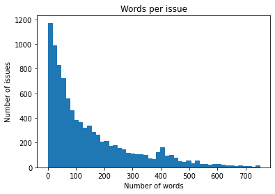
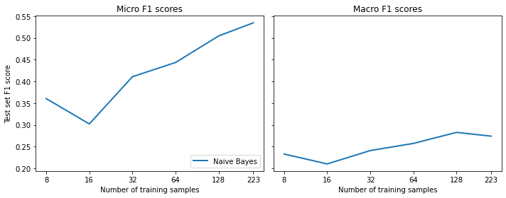
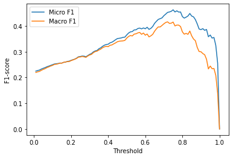
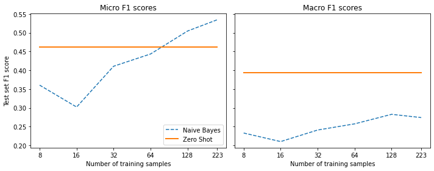
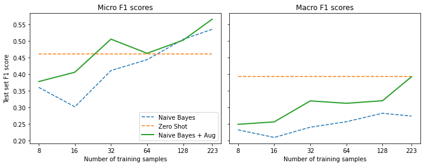
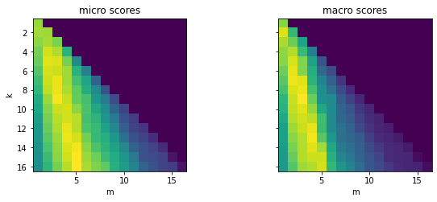
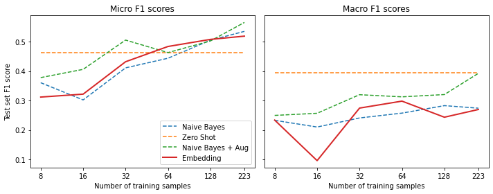
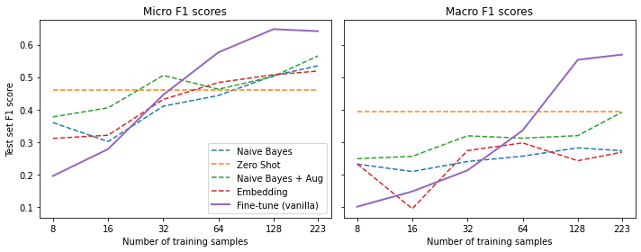
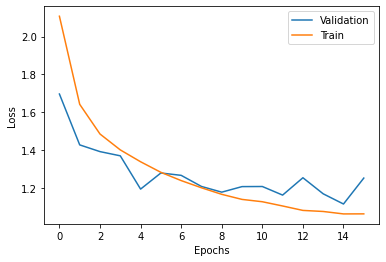
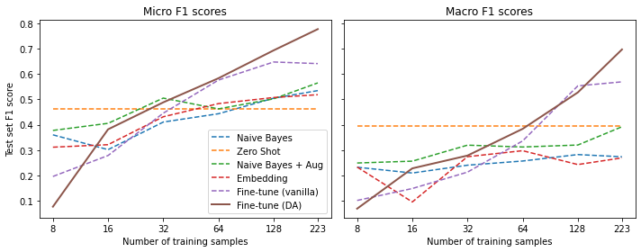

* [Dealing with Few to No Labels](#dealing-with-few-to-no-labels)
* [Project: Build a GitHub Issues Tagger](#project-build-a-github-issues-tagger)
* [Implementing a Naive Bayesline](#implementing-a-naive-bayesline)
* [Working with No Labeled Data](#working-with-no-labeled-data)
* [Working with a Few Labels](#working-with-a-few-labels)
* [Leveraging Unlabeled Data](#leveraging-unlabeled-data)
* [Conclusion](#conclusion)
* [References](#references)


------

```python
import transformers
import datasets
import accelerate

# Only print error messages
transformers.logging.set_verbosity_error()
datasets.logging.set_verbosity_error()

transformers.__version__, datasets.__version__, accelerate.__version__
```
```text
    ('4.18.0', '2.1.0', '0.5.1')
```

------

```python
import ast
# https://astor.readthedocs.io/en/latest/
import astor
import inspect
import textwrap
def print_source(obj, exclude_doc=True):
    
    # Get source code
    source = inspect.getsource(obj)
    # Remove any common leading whitespace from every line
    cleaned_source = textwrap.dedent(source)
    # Parse the source into an AST node.
    parsed = ast.parse(cleaned_source)

    for node in ast.walk(parsed):
        # Skip any nodes that are not class or function definitions
        if not isinstance(node, (ast.FunctionDef, ast.ClassDef, ast.AsyncFunctionDef)):
            continue
        
        if exclude_doc and len(node.body) > 1: node.body = node.body[1:]
        
    print(astor.to_source(parsed))
```

------


## Dealing with Few to No Labels

* We often have little to no labeled data when starting a new project.
* Non-pretrained models do not perform well with little data.
* Annotating additional training examples is time-consuming and expensive.
* There are several methods for dealing with few to no labels.
* Zero-shot learning often sets a strong baseline when there is no labeled data.
* Standard fine-tuning works well when there is a lot of labeled data.
* We can fine-tune a language model on a large corpus of unlabeled data before training a classifier on a small number of labeled examples.
* More sophisticated methods for training with unlabeled data include Unsupervised Data Augmentation and Uncertainty-aware self-training.
    * [Uncertainty-aware Self-training for Text Classification with Few Labels](https://arxiv.org/abs/2006.15315)
* We can use few-shot learning when we only have a small number of labeled examples and no unlabeled data.
* We can also use the embeddings from a pretrained language model to perform lookups with a nearest-neighbor search.


## Project: Build a GitHub Issues Tagger

* Many support teams use issue trackers like [Jira](https://www.atlassian.com/software/jira) or [GitHub](https://docs.github.com/en/issues/tracking-your-work-with-issues/about-issues) to assist users by tagging issues with metadata based on the issue's description.
* Tags can define the issue type, the product causing the problem, or which team is responsible for handling the reported issue.
* Automating issue tagging can significantly improve productivity and enables the support teams to focus on helping users.
* The goal is to train a model that automatically tags [GitHub issues](https://github.com/huggingface/transformers/issues) for the Hugging Face Transformers library.
* [GitHub issues](https://github.com/huggingface/transformers/issues/9931) contain a title, a description, and a set of tags/labels that characterize them.
* The model will take a title and description as input and predict one or more labels (i.e., multilabel classification).

### Getting the Data
* We can use the [GitHub REST API](https://docs.github.com/en/rest) to poll the [Issues endpoint](https://docs.github.com/en/rest/reference/issues#list-repository-issues).
* The Issues endpoint returns a list of JSON objects.
* Each JSON object includes whether it is open or closed, who opened the issue, the title, the body, and the labels.
* The GitHub REST API treats pull requests as issues.

------


```python
import time
import math
import requests
from pathlib import Path
import pandas as pd
from tqdm.auto import tqdm
```

------


**Define a function to download issues for a GitHub project to a `.jsonl` file**

* We need to download the issues in batches to avoid exceeding GitHub's limit on the number of requests per hour.

------


```python
def fetch_issues(owner="huggingface", repo="transformers", num_issues=10_000, 
                 rate_limit=5_000):    
    batch = []
    all_issues = []
    # Max number of issues we can request per page
    per_page = 100
    # Number of requests we need to make
    num_pages = math.ceil(num_issues / per_page)
    base_url = "https://api.github.com/repos"
    
    for page in tqdm(range(num_pages)):
        # Query with state=all to get both open and closed issues
        query = f"issues?page={page}&per_page={per_page}&state=all"
        # Sample: https://api.github.com/repos/huggingface/transformers/issues?page=0&per_page=100&state=all
        issues = requests.get(f"{base_url}/{owner}/{repo}/{query}")
        batch.extend(issues.json())

        if len(batch) > rate_limit and len(all_issues) < num_issues:
            all_issues.extend(batch)
            batch = [] # Flush batch for next time period
            print(f"Reached GitHub rate limit. Sleeping for one hour ...")
            time.sleep(60 * 60 + 1)
            
    all_issues.extend(batch)
    df = pd.DataFrame.from_records(all_issues)
    df.to_json(f"github-issues-{repo}.jsonl", orient="records", lines=True)
```

**Note:** It takes a while to fetch all the issues.

------

**Download the GitHub Issues** 


```python
# fetch_issues()
```

------

### Preparing the Data

------


```python
import pandas as pd
pd.set_option('max_colwidth', None)
pd.set_option('display.max_rows', None)
pd.set_option('display.max_columns', None)
pd.__version__
```
```text
    '1.4.2'
```

------

**Import the dataset**


```python
dataset_url = "https://git.io/nlp-with-transformers"
df_issues = pd.read_json(dataset_url, lines=True)
print(f"DataFrame shape: {df_issues.shape}")
```

```text
DataFrame shape: (9930, 26)
```


------

**Inspect a single GitHub issue**


```python
# Convert Series to DataFrame
df_issues.loc[2].to_frame()
```
<div style="overflow-x:auto;">
<table border="1" class="dataframe">
  <thead>
    <tr style="text-align: right;">
      <th></th>
      <th>2</th>
    </tr>
  </thead>
  <tbody>
    <tr>
      <th>url</th>
      <td>https://api.github.com/repos/huggingface/transformers/issues/11044</td>
    </tr>
    <tr>
      <th>repository_url</th>
      <td>https://api.github.com/repos/huggingface/transformers</td>
    </tr>
    <tr>
      <th>labels_url</th>
      <td>https://api.github.com/repos/huggingface/transformers/issues/11044/labels{/name}</td>
    </tr>
    <tr>
      <th>comments_url</th>
      <td>https://api.github.com/repos/huggingface/transformers/issues/11044/comments</td>
    </tr>
    <tr>
      <th>events_url</th>
      <td>https://api.github.com/repos/huggingface/transformers/issues/11044/events</td>
    </tr>
    <tr>
      <th>html_url</th>
      <td>https://github.com/huggingface/transformers/issues/11044</td>
    </tr>
    <tr>
      <th>id</th>
      <td>849529761</td>
    </tr>
    <tr>
      <th>node_id</th>
      <td>MDU6SXNzdWU4NDk1Mjk3NjE=</td>
    </tr>
    <tr>
      <th>number</th>
      <td>11044</td>
    </tr>
    <tr>
      <th>title</th>
      <td>[DeepSpeed] ZeRO stage 3 integration: getting started and issues</td>
    </tr>
    <tr>
      <th>user</th>
      <td>{'login': 'stas00', 'id': 10676103, 'node_id': 'MDQ6VXNlcjEwNjc2MTAz', 'avatar_url': 'https://avatars.githubusercontent.com/u/10676103?v=4', 'gravatar_id': '', 'url': 'https://api.github.com/users/stas00', 'html_url': 'https://github.com/stas00', 'followers_url': 'https://api.github.com/users/stas00/followers', 'following_url': 'https://api.github.com/users/stas00/following{/other_user}', 'gists_url': 'https://api.github.com/users/stas00/gists{/gist_id}', 'starred_url': 'https://api.github.com/users/stas00/starred{/owner}{/repo}', 'subscriptions_url': 'https://api.github.com/users/stas00/subscriptions', 'organizations_url': 'https://api.github.com/users/stas00/orgs', 'repos_url': 'https://api.github.com/users/stas00/repos', 'events_url': 'https://api.github.com/users/stas00/events{/privacy}', 'received_events_url': 'https://api.github.com/users/stas00/received_events', 'type': 'User', 'site_admin': False}</td>
    </tr>
    <tr>
      <th>labels</th>
      <td>[{'id': 2659267025, 'node_id': 'MDU6TGFiZWwyNjU5MjY3MDI1', 'url': 'https://api.github.com/repos/huggingface/transformers/labels/DeepSpeed', 'name': 'DeepSpeed', 'color': '4D34F7', 'default': False, 'description': ''}]</td>
    </tr>
    <tr>
      <th>state</th>
      <td>open</td>
    </tr>
    <tr>
      <th>locked</th>
      <td>False</td>
    </tr>
    <tr>
      <th>assignee</th>
      <td>{'login': 'stas00', 'id': 10676103, 'node_id': 'MDQ6VXNlcjEwNjc2MTAz', 'avatar_url': 'https://avatars.githubusercontent.com/u/10676103?v=4', 'gravatar_id': '', 'url': 'https://api.github.com/users/stas00', 'html_url': 'https://github.com/stas00', 'followers_url': 'https://api.github.com/users/stas00/followers', 'following_url': 'https://api.github.com/users/stas00/following{/other_user}', 'gists_url': 'https://api.github.com/users/stas00/gists{/gist_id}', 'starred_url': 'https://api.github.com/users/stas00/starred{/owner}{/repo}', 'subscriptions_url': 'https://api.github.com/users/stas00/subscriptions', 'organizations_url': 'https://api.github.com/users/stas00/orgs', 'repos_url': 'https://api.github.com/users/stas00/repos', 'events_url': 'https://api.github.com/users/stas00/events{/privacy}', 'received_events_url': 'https://api.github.com/users/stas00/received_events', 'type': 'User', 'site_admin': False}</td>
    </tr>
    <tr>
      <th>assignees</th>
      <td>[{'login': 'stas00', 'id': 10676103, 'node_id': 'MDQ6VXNlcjEwNjc2MTAz', 'avatar_url': 'https://avatars.githubusercontent.com/u/10676103?v=4', 'gravatar_id': '', 'url': 'https://api.github.com/users/stas00', 'html_url': 'https://github.com/stas00', 'followers_url': 'https://api.github.com/users/stas00/followers', 'following_url': 'https://api.github.com/users/stas00/following{/other_user}', 'gists_url': 'https://api.github.com/users/stas00/gists{/gist_id}', 'starred_url': 'https://api.github.com/users/stas00/starred{/owner}{/repo}', 'subscriptions_url': 'https://api.github.com/users/stas00/subscriptions', 'organizations_url': 'https://api.github.com/users/stas00/orgs', 'repos_url': 'https://api.github.com/users/stas00/repos', 'events_url': 'https://api.github.com/users/stas00/events{/privacy}', 'received_events_url': 'https://api.github.com/users/stas00/received_events', 'type': 'User', 'site_admin': False}]</td>
    </tr>
    <tr>
      <th>milestone</th>
      <td>NaN</td>
    </tr>
    <tr>
      <th>comments</th>
      <td>0</td>
    </tr>
    <tr>
      <th>created_at</th>
      <td>2021-04-02 23:40:42</td>
    </tr>
    <tr>
      <th>updated_at</th>
      <td>2021-04-03 00:00:18</td>
    </tr>
    <tr>
      <th>closed_at</th>
      <td>NaT</td>
    </tr>
    <tr>
      <th>author_association</th>
      <td>COLLABORATOR</td>
    </tr>
    <tr>
      <th>active_lock_reason</th>
      <td>None</td>
    </tr>
    <tr>
      <th>body</th>
      <td>**[This is not yet alive, preparing for the release, so please ignore for now]**\r\n\r\nThe DeepSpeed ZeRO-3 has been integrated into HF `transformers`. \r\n\r\nWhile I tried to write tests for a wide range of situations I'm sure I've missed some scenarios so if you run into any problems please file a separate issue. I'm going to use this issue to track progress on individual ZeRO3 issues.\r\n\r\n# Why would you want ZeRO-3\r\n\r\nIn a few words,  while ZeRO-2 was very limited scability-wise - if `model.half()` couldn't fit onto a single gpu, adding more gpus won't have helped so if you had a 24GB GPU you couldn't train a model larger than about 5B params.\r\n\r\nSince with ZeRO-3 the model weights are partitioned across multiple GPUs plus offloaded to CPU, the upper limit on model size has increased by about 2 orders of magnitude. That is ZeRO-3 allows you to scale to huge models with Trillions of parameters assuming you have enough GPUs and general RAM to support this. ZeRO-3 can benefit a lot from general RAM if you have it. If not that's OK too.  ZeRO-3 combines all your GPUs memory and general RAM into a vast pool of memory.\r\n\r\nIf you don't have many GPUs but just a single one but have a lot of general RAM ZeRO-3 will allow you to fit larger models.\r\n\r\nOf course, if you run in an environment like the free google colab, while you can use run Deepspeed there, you get so little general RAM it's very hard to make something out of nothing. Some users (or some sessions) one gets 12GB of RAM which is impossible to work with - you want at least 24GB instances. Setting is up might be tricky too, please see this notebook for an example:\r\nhttps://github.com/stas00/porting/blob/master/transformers/deepspeed/DeepSpeed_on_colab_CLI.ipynb\r\n\r\n# Getting started\r\n\r\nInstall the latest deepspeed version:\r\n```\r\npip install deepspeed\r\n```\r\n\r\nYou will want to be on a transformers master branch, if you want to run a quick test:\r\n```\r\ngit clone https://github.com/huggingface/transformers\r\ncd transformers\r\nBS=4; PYTHONPATH=src USE_TF=0 deepspeed examples/seq2seq/run_translation.py \\r\n--model_name_or_path t5-small --output_dir /tmp/zero3 --overwrite_output_dir --max_train_samples 64 \\r\n--max_val_samples 64 --max_source_length 128 --max_target_length 128 --val_max_target_length 128 \\r\n--do_train --num_train_epochs 1 --per_device_train_batch_size $BS --per_device_eval_batch_size $BS \\r\n--learning_rate 3e-3 --warmup_steps 500 --predict_with_generate --logging_steps 0 --save_steps 0 \\r\n--eval_steps 1 --group_by_length  --adafactor --dataset_name wmt16 --dataset_config ro-en --source_lang en \\r\n--target_lang ro --source_prefix "translate English to Romanian: " \\r\n--deepspeed examples/tests/deepspeed/ds_config_zero3.json\r\n```\r\n\r\nYou will find a very detailed configuration here: https://huggingface.co/transformers/master/main_classes/trainer.html#deepspeed\r\n\r\nYour new config file will look like this:\r\n\r\n```json\r\n{\r\n    "fp16": {\r\n        "enabled": true,\r\n        "loss_scale": 0,\r\n        "loss_scale_window": 1000,\r\n        "initial_scale_power": 16,\r\n        "hysteresis": 2,\r\n        "min_loss_scale": 1\r\n    },\r\n\r\n    "zero_optimization": {\r\n        "stage": 3,\r\n        "cpu_offload": true,\r\n        "cpu_offload_params": true,\r\n        "cpu_offload_use_pin_memory" : true,\r\n        "overlap_comm": true,\r\n        "contiguous_gradients": true,\r\n        "stage3_max_live_parameters": 1e9,\r\n        "stage3_max_reuse_distance": 1e9,\r\n        "stage3_prefetch_bucket_size": 0.94e6,\r\n        "stage3_param_persistence_threshold": 1e4,\r\n        "reduce_bucket_size": 1e6,\r\n        "prefetch_bucket_size": 3e6,\r\n        "sub_group_size": 1e14,\r\n        "stage3_gather_fp16_weights_on_model_save": true\r\n    },\r\n\r\n    "optimizer": {\r\n        "type": "AdamW",\r\n        "params": {\r\n            "lr": 3e-5,\r\n            "betas": [0.8, 0.999],\r\n            "eps": 1e-8,\r\n            "weight_decay": 3e-7\r\n        }\r\n    },\r\n\r\n    "scheduler": {\r\n        "type": "WarmupLR",\r\n        "params": {\r\n            "warmup_min_lr": 0,\r\n            "warmup_max_lr": 3e-5,\r\n            "warmup_num_steps": 500\r\n        }\r\n    },\r\n\r\n    "steps_per_print": 2000,\r\n    "wall_clock_breakdown": false\r\n}\r\n\r\n```\r\n\r\nSo if you were already using ZeRO-2 it's only the `zero_optimization` stage that has changed.\r\n\r\nOne of the biggest nuances of ZeRO-3 is that the model weights aren't inside `model.state_dict`, as they are spread out through multiple gpus. The Trainer has been modified to support this but you will notice a slow model saving - as it has to consolidate weights from all the gpus. I'm planning to do more performance improvements in the future PRs, but for now let's focus on making things work.\r\n\r\n# Issues / Questions\r\n\r\nIf you have any general questions or something is unclear/missing in the docs please don't hesitate to ask in this thread. But for any bugs or problems please open a new Issue and tag me there. You don't need to tag anybody else. Thank you!</td>
    </tr>
    <tr>
      <th>performed_via_github_app</th>
      <td>NaN</td>
    </tr>
    <tr>
      <th>pull_request</th>
      <td>None</td>
    </tr>
  </tbody>
</table>
</div>
**Note:** The labels column contains the tags.

------

**Inspect the labels column**


```python
pd.DataFrame(df_issues.loc[2]['labels'])
```
<div style="overflow-x:auto;">
<table border="1" class="dataframe">
  <thead>
    <tr style="text-align: right;">
      <th></th>
      <th>id</th>
      <th>node_id</th>
      <th>url</th>
      <th>name</th>
      <th>color</th>
      <th>default</th>
      <th>description</th>
    </tr>
  </thead>
  <tbody>
    <tr>
      <th>0</th>
      <td>2659267025</td>
      <td>MDU6TGFiZWwyNjU5MjY3MDI1</td>
      <td>https://api.github.com/repos/huggingface/transformers/labels/DeepSpeed</td>
      <td>DeepSpeed</td>
      <td>4D34F7</td>
      <td>False</td>
      <td></td>
    </tr>
  </tbody>
</table>
</div>
------


**Extract the tags names from the labels column**


```python
df_issues["labels"] = (df_issues["labels"].apply(lambda x: [meta["name"] for meta in x]))
```


```python
df_issues[["labels"]].head()
```
<div style="overflow-x:auto;">
<table border="1" class="dataframe">
  <thead>
    <tr style="text-align: right;">
      <th></th>
      <th>labels</th>
    </tr>
  </thead>
  <tbody>
    <tr>
      <th>0</th>
      <td>[]</td>
    </tr>
    <tr>
      <th>1</th>
      <td>[]</td>
    </tr>
    <tr>
      <th>2</th>
      <td>[DeepSpeed]</td>
    </tr>
    <tr>
      <th>3</th>
      <td>[]</td>
    </tr>
    <tr>
      <th>4</th>
      <td>[]</td>
    </tr>
  </tbody>
</table>
</div>
------


**Get the number of labels per issue**


```python
df_issues["labels"].apply(lambda x : len(x)).value_counts().to_frame().T
```
<div style="overflow-x:auto;">
<table border="1" class="dataframe">
  <thead>
    <tr style="text-align: right;">
      <th></th>
      <th>0</th>
      <th>1</th>
      <th>2</th>
      <th>3</th>
      <th>4</th>
      <th>5</th>
    </tr>
  </thead>
  <tbody>
    <tr>
      <th>labels</th>
      <td>6440</td>
      <td>3057</td>
      <td>305</td>
      <td>100</td>
      <td>25</td>
      <td>3</td>
    </tr>
  </tbody>
</table>
</div>
**Note:** Most GitHub issues have zero or one label, and very few have more than one label.

------

**View the only three issues with five tags**


```python
df_issues[df_issues['labels'].apply(lambda x: len(x) == 5)].T
```
<div style="overflow-x:auto;">
<table border="1" class="dataframe">
  <thead>
    <tr style="text-align: right;">
      <th></th>
      <th>6005</th>
      <th>7541</th>
      <th>8266</th>
    </tr>
  </thead>
  <tbody>
    <tr>
      <th>url</th>
      <td>https://api.github.com/repos/huggingface/transformers/issues/5057</td>
      <td>https://api.github.com/repos/huggingface/transformers/issues/3513</td>
      <td>https://api.github.com/repos/huggingface/transformers/issues/2787</td>
    </tr>
    <tr>
      <th>repository_url</th>
      <td>https://api.github.com/repos/huggingface/transformers</td>
      <td>https://api.github.com/repos/huggingface/transformers</td>
      <td>https://api.github.com/repos/huggingface/transformers</td>
    </tr>
    <tr>
      <th>labels_url</th>
      <td>https://api.github.com/repos/huggingface/transformers/issues/5057/labels{/name}</td>
      <td>https://api.github.com/repos/huggingface/transformers/issues/3513/labels{/name}</td>
      <td>https://api.github.com/repos/huggingface/transformers/issues/2787/labels{/name}</td>
    </tr>
    <tr>
      <th>comments_url</th>
      <td>https://api.github.com/repos/huggingface/transformers/issues/5057/comments</td>
      <td>https://api.github.com/repos/huggingface/transformers/issues/3513/comments</td>
      <td>https://api.github.com/repos/huggingface/transformers/issues/2787/comments</td>
    </tr>
    <tr>
      <th>events_url</th>
      <td>https://api.github.com/repos/huggingface/transformers/issues/5057/events</td>
      <td>https://api.github.com/repos/huggingface/transformers/issues/3513/events</td>
      <td>https://api.github.com/repos/huggingface/transformers/issues/2787/events</td>
    </tr>
    <tr>
      <th>html_url</th>
      <td>https://github.com/huggingface/transformers/issues/5057</td>
      <td>https://github.com/huggingface/transformers/issues/3513</td>
      <td>https://github.com/huggingface/transformers/issues/2787</td>
    </tr>
    <tr>
      <th>id</th>
      <td>639635502</td>
      <td>589781536</td>
      <td>562124488</td>
    </tr>
    <tr>
      <th>node_id</th>
      <td>MDU6SXNzdWU2Mzk2MzU1MDI=</td>
      <td>MDU6SXNzdWU1ODk3ODE1MzY=</td>
      <td>MDU6SXNzdWU1NjIxMjQ0ODg=</td>
    </tr>
    <tr>
      <th>number</th>
      <td>5057</td>
      <td>3513</td>
      <td>2787</td>
    </tr>
    <tr>
      <th>title</th>
      <td>Examples tests improvements</td>
      <td>Adding mbart-large-cc25</td>
      <td>Distillation code loss functions</td>
    </tr>
    <tr>
      <th>user</th>
      <td>{'login': 'sshleifer', 'id': 6045025, 'node_id': 'MDQ6VXNlcjYwNDUwMjU=', 'avatar_url': 'https://avatars.githubusercontent.com/u/6045025?v=4', 'gravatar_id': '', 'url': 'https://api.github.com/users/sshleifer', 'html_url': 'https://github.com/sshleifer', 'followers_url': 'https://api.github.com/users/sshleifer/followers', 'following_url': 'https://api.github.com/users/sshleifer/following{/other_user}', 'gists_url': 'https://api.github.com/users/sshleifer/gists{/gist_id}', 'starred_url': 'https://api.github.com/users/sshleifer/starred{/owner}{/repo}', 'subscriptions_url': 'https://api.github.com/users/sshleifer/subscriptions', 'organizations_url': 'https://api.github.com/users/sshleifer/orgs', 'repos_url': 'https://api.github.com/users/sshleifer/repos', 'events_url': 'https://api.github.com/users/sshleifer/events{/privacy}', 'received_events_url': 'https://api.github.com/users/sshleifer/received_events', 'type': 'User', 'site_admin': False}</td>
      <td>{'login': 'maksym-del', 'id': 8141935, 'node_id': 'MDQ6VXNlcjgxNDE5MzU=', 'avatar_url': 'https://avatars.githubusercontent.com/u/8141935?v=4', 'gravatar_id': '', 'url': 'https://api.github.com/users/maksym-del', 'html_url': 'https://github.com/maksym-del', 'followers_url': 'https://api.github.com/users/maksym-del/followers', 'following_url': 'https://api.github.com/users/maksym-del/following{/other_user}', 'gists_url': 'https://api.github.com/users/maksym-del/gists{/gist_id}', 'starred_url': 'https://api.github.com/users/maksym-del/starred{/owner}{/repo}', 'subscriptions_url': 'https://api.github.com/users/maksym-del/subscriptions', 'organizations_url': 'https://api.github.com/users/maksym-del/orgs', 'repos_url': 'https://api.github.com/users/maksym-del/repos', 'events_url': 'https://api.github.com/users/maksym-del/events{/privacy}', 'received_events_url': 'https://api.github.com/users/maksym-del/received_events', 'type': 'User', 'site_admin': False}</td>
      <td>{'login': 'snaik2016', 'id': 18183245, 'node_id': 'MDQ6VXNlcjE4MTgzMjQ1', 'avatar_url': 'https://avatars.githubusercontent.com/u/18183245?v=4', 'gravatar_id': '', 'url': 'https://api.github.com/users/snaik2016', 'html_url': 'https://github.com/snaik2016', 'followers_url': 'https://api.github.com/users/snaik2016/followers', 'following_url': 'https://api.github.com/users/snaik2016/following{/other_user}', 'gists_url': 'https://api.github.com/users/snaik2016/gists{/gist_id}', 'starred_url': 'https://api.github.com/users/snaik2016/starred{/owner}{/repo}', 'subscriptions_url': 'https://api.github.com/users/snaik2016/subscriptions', 'organizations_url': 'https://api.github.com/users/snaik2016/orgs', 'repos_url': 'https://api.github.com/users/snaik2016/repos', 'events_url': 'https://api.github.com/users/snaik2016/events{/privacy}', 'received_events_url': 'https://api.github.com/users/snaik2016/received_events', 'type': 'User', 'site_admin': False}</td>
    </tr>
    <tr>
      <th>labels</th>
      <td>[Examples, Good First Issue, Help wanted, cleanup, wontfix]</td>
      <td>[Documentation, Help wanted, New model, seq2seq, translation]</td>
      <td>[Core: Modeling, Distillation, PyTorch, Usage, wontfix]</td>
    </tr>
    <tr>
      <th>state</th>
      <td>closed</td>
      <td>closed</td>
      <td>closed</td>
    </tr>
    <tr>
      <th>locked</th>
      <td>False</td>
      <td>False</td>
      <td>False</td>
    </tr>
    <tr>
      <th>assignee</th>
      <td>{'login': 'sshleifer', 'id': 6045025, 'node_id': 'MDQ6VXNlcjYwNDUwMjU=', 'avatar_url': 'https://avatars.githubusercontent.com/u/6045025?v=4', 'gravatar_id': '', 'url': 'https://api.github.com/users/sshleifer', 'html_url': 'https://github.com/sshleifer', 'followers_url': 'https://api.github.com/users/sshleifer/followers', 'following_url': 'https://api.github.com/users/sshleifer/following{/other_user}', 'gists_url': 'https://api.github.com/users/sshleifer/gists{/gist_id}', 'starred_url': 'https://api.github.com/users/sshleifer/starred{/owner}{/repo}', 'subscriptions_url': 'https://api.github.com/users/sshleifer/subscriptions', 'organizations_url': 'https://api.github.com/users/sshleifer/orgs', 'repos_url': 'https://api.github.com/users/sshleifer/repos', 'events_url': 'https://api.github.com/users/sshleifer/events{/privacy}', 'received_events_url': 'https://api.github.com/users/sshleifer/received_events', 'type': 'User', 'site_admin': False}</td>
      <td>{'login': 'sshleifer', 'id': 6045025, 'node_id': 'MDQ6VXNlcjYwNDUwMjU=', 'avatar_url': 'https://avatars.githubusercontent.com/u/6045025?v=4', 'gravatar_id': '', 'url': 'https://api.github.com/users/sshleifer', 'html_url': 'https://github.com/sshleifer', 'followers_url': 'https://api.github.com/users/sshleifer/followers', 'following_url': 'https://api.github.com/users/sshleifer/following{/other_user}', 'gists_url': 'https://api.github.com/users/sshleifer/gists{/gist_id}', 'starred_url': 'https://api.github.com/users/sshleifer/starred{/owner}{/repo}', 'subscriptions_url': 'https://api.github.com/users/sshleifer/subscriptions', 'organizations_url': 'https://api.github.com/users/sshleifer/orgs', 'repos_url': 'https://api.github.com/users/sshleifer/repos', 'events_url': 'https://api.github.com/users/sshleifer/events{/privacy}', 'received_events_url': 'https://api.github.com/users/sshleifer/received_events', 'type': 'User', 'site_admin': False}</td>
      <td>None</td>
    </tr>
    <tr>
      <th>assignees</th>
      <td>[{'login': 'sshleifer', 'id': 6045025, 'node_id': 'MDQ6VXNlcjYwNDUwMjU=', 'avatar_url': 'https://avatars.githubusercontent.com/u/6045025?v=4', 'gravatar_id': '', 'url': 'https://api.github.com/users/sshleifer', 'html_url': 'https://github.com/sshleifer', 'followers_url': 'https://api.github.com/users/sshleifer/followers', 'following_url': 'https://api.github.com/users/sshleifer/following{/other_user}', 'gists_url': 'https://api.github.com/users/sshleifer/gists{/gist_id}', 'starred_url': 'https://api.github.com/users/sshleifer/starred{/owner}{/repo}', 'subscriptions_url': 'https://api.github.com/users/sshleifer/subscriptions', 'organizations_url': 'https://api.github.com/users/sshleifer/orgs', 'repos_url': 'https://api.github.com/users/sshleifer/repos', 'events_url': 'https://api.github.com/users/sshleifer/events{/privacy}', 'received_events_url': 'https://api.github.com/users/sshleifer/received_events', 'type': 'User', 'site_admin': False}]</td>
      <td>[{'login': 'sshleifer', 'id': 6045025, 'node_id': 'MDQ6VXNlcjYwNDUwMjU=', 'avatar_url': 'https://avatars.githubusercontent.com/u/6045025?v=4', 'gravatar_id': '', 'url': 'https://api.github.com/users/sshleifer', 'html_url': 'https://github.com/sshleifer', 'followers_url': 'https://api.github.com/users/sshleifer/followers', 'following_url': 'https://api.github.com/users/sshleifer/following{/other_user}', 'gists_url': 'https://api.github.com/users/sshleifer/gists{/gist_id}', 'starred_url': 'https://api.github.com/users/sshleifer/starred{/owner}{/repo}', 'subscriptions_url': 'https://api.github.com/users/sshleifer/subscriptions', 'organizations_url': 'https://api.github.com/users/sshleifer/orgs', 'repos_url': 'https://api.github.com/users/sshleifer/repos', 'events_url': 'https://api.github.com/users/sshleifer/events{/privacy}', 'received_events_url': 'https://api.github.com/users/sshleifer/received_events', 'type': 'User', 'site_admin': False}]</td>
      <td>[]</td>
    </tr>
    <tr>
      <th>milestone</th>
      <td>NaN</td>
      <td>NaN</td>
      <td>NaN</td>
    </tr>
    <tr>
      <th>comments</th>
      <td>12</td>
      <td>8</td>
      <td>4</td>
    </tr>
    <tr>
      <th>created_at</th>
      <td>2020-06-16 12:45:32</td>
      <td>2020-03-29 12:32:30</td>
      <td>2020-02-09 05:21:33</td>
    </tr>
    <tr>
      <th>updated_at</th>
      <td>2020-10-04 01:14:08</td>
      <td>2020-07-07 17:23:01</td>
      <td>2020-04-19 22:29:10</td>
    </tr>
    <tr>
      <th>closed_at</th>
      <td>2020-10-04 01:14:08</td>
      <td>2020-07-07 17:23:01</td>
      <td>2020-04-19 22:29:10</td>
    </tr>
    <tr>
      <th>author_association</th>
      <td>MEMBER</td>
      <td>CONTRIBUTOR</td>
      <td>NONE</td>
    </tr>
    <tr>
      <th>active_lock_reason</th>
      <td>None</td>
      <td>None</td>
      <td>None</td>
    </tr>
    <tr>
      <th>body</th>
      <td>There are a few things about the `examples/` tests that are suboptimal:\r\n\r\n1. They never use cuda or fp16, even if they are available.\r\n2. The `@slow` decorator used in the main tests is not importable, so there are no @slow tests.\r\n3. `test_run_glue` uses distilbert-case-cased. It should use a smaller model, one of the `tiny` family [here](https://huggingface.co/models?search=sshleifer/tiny) or a new tiny model.\r\n4. There is no test coverage for TPU.\r\n\r\nAny help on any of these fronts would be much appreciated!</td>
      <td># 🌟 New model addition\r\nMultilingual BART model implemented in fairseq introduced by FAIR\r\n\r\n## Model description\r\nThis issue is to request adding mBART model existing as a part of fairseq lib. \r\n\r\n[Link to the fairseq description of the model](https://github.com/pytorch/fairseq/tree/master/examples/mbart\r\n)\r\n[Link to the mBART paper](https://arxiv.org/abs/2001.08210)\r\n\r\nMultilingually pretrained BART checkpoint.\r\n\r\n&lt;!-- Important information --&gt;\r\nThe model code follows the original BART model code which is already a part of ```transformers``` repo. However, it introduces a couple more features like multilingual denoising and translation from pretrained BART. \r\n\r\n## Open source status\r\n\r\n- [x] _the model implementation is available: (give details)_\r\n[Link to the PR adding mBART to the fairseq](https://github.com/pytorch/fairseq/commit/5e79322b3a4a9e9a11525377d3dda7ac520b921c) \r\nThis PR shows the main pieces that were added to the fairseq to make mBART work considering BART  which is already existing in the codebase. However, a few additional mBART commits were added afterward.\r\n\r\n- [x] _the model weights are available: (give details)_\r\n[Link to the weights](https://github.com/pytorch/fairseq/tree/master/examples/mbart#pre-trained-models)\r\n\r\n- [x] _who are the authors: (mention them, if possible by @gh-username)_\r\nFacebook AI Research (@MultiPath)</td>
      <td># ❓ Questions &amp; Help\r\nWhy compute cross entropy loss from the hard labels in distillation code?\r\n\r\nif self.alpha_clm &gt; 0.0:\r\n            shift_logits = s_logits[..., :-1, :].contiguous()\r\n            shift_labels = lm_labels[..., 1:].contiguous()\r\n            loss_clm = self.lm_loss_fct(shift_logits.view(-1, shift_logits.size(-1)), shift_labels.view(-1))\r\n            loss += self.alpha_clm * loss_clm\r\n\r\nThe model outputs loss when passed with the labels.\r\n\r\n\r\n&lt;!-- The GitHub issue tracker is primarly intended for bugs, feature requests,\r\n     new models and benchmarks, and migration questions. For all other questions,\r\n     we direct you to Stack Overflow (SO) where a whole community of PyTorch and\r\n     Tensorflow enthusiast can help you out. Make sure to tag your question with the\r\n     right deep learning framework as well as the huggingface-transformers tag: \r\n     https://stackoverflow.com/questions/tagged/huggingface-transformers \r\n     \r\n     If your question wasn't answered after a period of time on Stack Overflow, you\r\n     can always open a question on GitHub. You should then link to the SO question \r\n     that you posted.\r\n     --&gt;\r\n\r\n## Details\r\n&lt;!-- Description of your issue --&gt;\r\n\r\n&lt;!-- You should first ask your question on SO, and only if\r\n     you didn't get an answer ask it here on GitHub. --&gt;\r\n**A link to original question on Stack Overflow**:</td>
    </tr>
    <tr>
      <th>performed_via_github_app</th>
      <td>NaN</td>
      <td>NaN</td>
      <td>NaN</td>
    </tr>
    <tr>
      <th>pull_request</th>
      <td>None</td>
      <td>None</td>
      <td>None</td>
    </tr>
  </tbody>
</table>
</div>
------


#### `pandas.DataFrame.explode`
* [Documentation](https://pandas.pydata.org/docs/reference/api/pandas.DataFrame.explode.html)
* Transform each element of a list-like into a row, replicating index values.

**Get the 20 most frequent labels in the dataset**


```python
df_counts = df_issues["labels"].explode().value_counts()
print(f"Number of labels: {len(df_counts)}")
# Display the top-20 label categories
df_counts.to_frame().head(20)
```
```text
    Number of labels: 65
```


<div style="overflow-x:auto;">
<table border="1" class="dataframe">
  <thead>
    <tr style="text-align: right;">
      <th></th>
      <th>labels</th>
    </tr>
  </thead>
  <tbody>
    <tr>
      <th>wontfix</th>
      <td>2284</td>
    </tr>
    <tr>
      <th>model card</th>
      <td>649</td>
    </tr>
    <tr>
      <th>Core: Tokenization</th>
      <td>106</td>
    </tr>
    <tr>
      <th>New model</th>
      <td>98</td>
    </tr>
    <tr>
      <th>Core: Modeling</th>
      <td>64</td>
    </tr>
    <tr>
      <th>Help wanted</th>
      <td>52</td>
    </tr>
    <tr>
      <th>Good First Issue</th>
      <td>50</td>
    </tr>
    <tr>
      <th>Usage</th>
      <td>46</td>
    </tr>
    <tr>
      <th>Core: Pipeline</th>
      <td>42</td>
    </tr>
    <tr>
      <th>Feature request</th>
      <td>41</td>
    </tr>
    <tr>
      <th>TensorFlow</th>
      <td>41</td>
    </tr>
    <tr>
      <th>Tests</th>
      <td>40</td>
    </tr>
    <tr>
      <th>PyTorch</th>
      <td>37</td>
    </tr>
    <tr>
      <th>DeepSpeed</th>
      <td>33</td>
    </tr>
    <tr>
      <th>seq2seq</th>
      <td>32</td>
    </tr>
    <tr>
      <th>Should Fix</th>
      <td>30</td>
    </tr>
    <tr>
      <th>marian</th>
      <td>29</td>
    </tr>
    <tr>
      <th>Discussion</th>
      <td>28</td>
    </tr>
    <tr>
      <th>Documentation</th>
      <td>28</td>
    </tr>
    <tr>
      <th>Examples</th>
      <td>24</td>
    </tr>
  </tbody>
</table>
</div>
------

```python
df_counts[:2].sum() / df_counts.sum()
```
```text
    0.7185203331700147
```


**Note:**
* There are 65 unique tags (i.e., classes) in the dataset.
* The dataset is highly imbalanced, with the two most common classes accounting for more than 70% of the dataset.
* Some labels (e.g., "Good First" or "Help Wanted") are potentially too difficult to predict from the issue's description, while others (e.g., "model card") might only require simple rules to classify.

------

**Filter the dataset to a subset of labels**


```python
label_map = {"Core: Tokenization": "tokenization",
             "New model": "new model",
             "Core: Modeling": "model training",
             "Usage": "usage",
             "Core: Pipeline": "pipeline",
             "TensorFlow": "tensorflow or tf",
             "PyTorch": "pytorch",
             "Examples": "examples",
             "Documentation": "documentation"}

def filter_labels(x):
    return [label_map[label] for label in x if label in label_map]

df_issues["labels"] = df_issues["labels"].apply(filter_labels)
all_labels = list(label_map.values())
```

------

**Check the distribution of the filtered dataset**


```python
df_counts = df_issues["labels"].explode().value_counts()
df_counts.to_frame().T
```
<div style="overflow-x:auto;">
<table border="1" class="dataframe">
  <thead>
    <tr style="text-align: right;">
      <th></th>
      <th>tokenization</th>
      <th>new model</th>
      <th>model training</th>
      <th>usage</th>
      <th>pipeline</th>
      <th>tensorflow or tf</th>
      <th>pytorch</th>
      <th>documentation</th>
      <th>examples</th>
    </tr>
  </thead>
  <tbody>
    <tr>
      <th>labels</th>
      <td>106</td>
      <td>98</td>
      <td>64</td>
      <td>46</td>
      <td>42</td>
      <td>41</td>
      <td>37</td>
      <td>28</td>
      <td>24</td>
    </tr>
  </tbody>
</table>
</div>
------

```python
df_counts[:2].sum() / df_counts.sum()
```
```text
    0.41975308641975306
```

**Note:** The filtered dataset is more balanced, with the two most common classes accounting for less than 42% of the dataset.

------

**Create a new column to indicate whether an issue is unlabeled**


```python
df_issues["split"] = "unlabeled"
mask = df_issues["labels"].apply(lambda x: len(x)) > 0
df_issues.loc[mask, "split"] = "labeled"
df_issues["split"].value_counts().to_frame()
```
<div style="overflow-x:auto;">
<table border="1" class="dataframe">
  <thead>
    <tr style="text-align: right;">
      <th></th>
      <th>split</th>
    </tr>
  </thead>
  <tbody>
    <tr>
      <th>unlabeled</th>
      <td>9489</td>
    </tr>
    <tr>
      <th>labeled</th>
      <td>441</td>
    </tr>
  </tbody>
</table>
</div>
------

```python
df_issues["split"].value_counts()[0] / len(df_issues)
```
```text
    0.9555891238670695
```


**Note:** Over 95% of issues are unlabeled.

------

**Inspect a labeled example**


```python
for column in ["title", "body", "labels"]:
    print(f"{column}: {df_issues[column].iloc[26][:500]}\n")
```
```text
    title: Add new CANINE model
    
    body: # 🌟 New model addition
    
    ## Model description
    
    Google recently proposed a new **C**haracter **A**rchitecture with **N**o tokenization **I**n **N**eural **E**ncoders architecture (CANINE). Not only the title is exciting:
    
    > Pipelined NLP systems have largely been superseded by end-to-end neural modeling, yet nearly all commonly-used models still require an explicit tokenization step. While recent tokenization approaches based on data-derived subword lexicons are less brittle than manually en
    
    labels: ['new model']
```


**Note:**
* This GitHub issue is proposing a new model architecture.
* Both the title and description contain helpful information for the label classifier.

------

**Concatenate the title and description for each issue into a new column**


```python
df_issues["text"] = (df_issues.apply(lambda x: x["title"] + "\n\n" + x["body"], axis=1))
```

------

**Remove any duplicate rows based on the `text` column values**


```python
len_before = len(df_issues)
df_issues = df_issues.drop_duplicates(subset="text")
print(f"Removed {(len_before-len(df_issues))/len_before:.2%} duplicates.")
```
```text
    Removed 1.88% duplicates.
```

------

```python
import numpy as np
import matplotlib.pyplot as plt
```

------

**Plot the number of words per issue**


```python
(df_issues["text"].str.split().apply(len).hist(bins=np.linspace(0, 750, 50), grid=False, edgecolor="C0"))
plt.title("Words per issue")
plt.xlabel("Number of words")
plt.ylabel("Number of issues")
plt.show()
```



**Note:**
* The text for most issues is short, but some have more than 500 words.
* Issues with error messages and code snippets are often longer.
* Most of the examples should fit into the typical context size of 512 tokens.

------

### Creating Training Sets

* There is no guaranteed balance for all labels when splitting the dataset.
* We can use the scikit-multilearn library to approximate a balanced split.

#### scikit-multilearn library
* [Homepage](https://scikit.ml/)
* A multi-label classification library built on top of the scikit-learn ecosystem.

------


```python
from sklearn.preprocessing import MultiLabelBinarizer
```

------

#### `MultiLabelBinarizer`

* [Documentation](https://scikit-learn.org/stable/modules/generated/sklearn.preprocessing.MultiLabelBinarizer.html)
* Transform between iterable of iterables and a multilabel format.
* Takes a list of names and creates a vector with zeros for absent labels and ones for present labels.

------

**Create a MultiLabelBinarizer to learn the mapping from label to ID**


```python
mlb = MultiLabelBinarizer()
mlb.fit([all_labels])
```
```text
    MultiLabelBinarizer()
```

------

**Check the label mappings**


```python
mlb.transform([["tokenization", "new model"], ["pytorch"]])
```
```text
    array([[0, 0, 0, 1, 0, 0, 0, 1, 0],
           [0, 0, 0, 0, 0, 1, 0, 0, 0]])
```

------

```python
pd.DataFrame(mlb.transform([[label] for label in all_labels]).T, columns=all_labels).T
```
<div style="overflow-x:auto;">
<table border="1" class="dataframe">
  <thead>
    <tr style="text-align: right;">
      <th></th>
      <th>0</th>
      <th>1</th>
      <th>2</th>
      <th>3</th>
      <th>4</th>
      <th>5</th>
      <th>6</th>
      <th>7</th>
      <th>8</th>
    </tr>
  </thead>
  <tbody>
    <tr>
      <th>tokenization</th>
      <td>0</td>
      <td>0</td>
      <td>0</td>
      <td>0</td>
      <td>0</td>
      <td>0</td>
      <td>0</td>
      <td>1</td>
      <td>0</td>
    </tr>
    <tr>
      <th>new model</th>
      <td>0</td>
      <td>0</td>
      <td>0</td>
      <td>1</td>
      <td>0</td>
      <td>0</td>
      <td>0</td>
      <td>0</td>
      <td>0</td>
    </tr>
    <tr>
      <th>model training</th>
      <td>0</td>
      <td>0</td>
      <td>1</td>
      <td>0</td>
      <td>0</td>
      <td>0</td>
      <td>0</td>
      <td>0</td>
      <td>0</td>
    </tr>
    <tr>
      <th>usage</th>
      <td>0</td>
      <td>0</td>
      <td>0</td>
      <td>0</td>
      <td>0</td>
      <td>0</td>
      <td>0</td>
      <td>0</td>
      <td>1</td>
    </tr>
    <tr>
      <th>pipeline</th>
      <td>0</td>
      <td>0</td>
      <td>0</td>
      <td>0</td>
      <td>1</td>
      <td>0</td>
      <td>0</td>
      <td>0</td>
      <td>0</td>
    </tr>
    <tr>
      <th>tensorflow or tf</th>
      <td>0</td>
      <td>0</td>
      <td>0</td>
      <td>0</td>
      <td>0</td>
      <td>0</td>
      <td>1</td>
      <td>0</td>
      <td>0</td>
    </tr>
    <tr>
      <th>pytorch</th>
      <td>0</td>
      <td>0</td>
      <td>0</td>
      <td>0</td>
      <td>0</td>
      <td>1</td>
      <td>0</td>
      <td>0</td>
      <td>0</td>
    </tr>
    <tr>
      <th>examples</th>
      <td>0</td>
      <td>1</td>
      <td>0</td>
      <td>0</td>
      <td>0</td>
      <td>0</td>
      <td>0</td>
      <td>0</td>
      <td>0</td>
    </tr>
    <tr>
      <th>documentation</th>
      <td>1</td>
      <td>0</td>
      <td>0</td>
      <td>0</td>
      <td>0</td>
      <td>0</td>
      <td>0</td>
      <td>0</td>
      <td>0</td>
    </tr>
  </tbody>
</table>
</div>
------

```python
from skmultilearn.model_selection import iterative_train_test_split
```

#### `iterative_train_test_split`
* [Documentation](http://scikit.ml/api/skmultilearn.model_selection.iterative_stratification.html)

**Define a function to iteratively generate a balanced train/test split**


```python
def balanced_split(df, test_size=0.5):
    ind = np.expand_dims(np.arange(len(df)), axis=1)
    labels = mlb.transform(df["labels"])
    ind_train, _, ind_test, _ = iterative_train_test_split(ind, labels, 
                                                           test_size)
    return df.iloc[ind_train[:, 0]], df.iloc[ind_test[:,0]]
```


```python
from sklearn.model_selection import train_test_split
```

------

**Split the data into supervised and unsupervised datasets**


```python
df_clean = df_issues[["text", "labels", "split"]].reset_index(drop=True).copy()
df_unsup = df_clean.loc[df_clean["split"] == "unlabeled", ["text", "labels"]]
df_sup = df_clean.loc[df_clean["split"] == "labeled", ["text", "labels"]]
```

------

**Create balanced training, validation, and test sets**


```python
np.random.seed(0)
df_train, df_tmp = balanced_split(df_sup, test_size=0.5)
df_valid, df_test = balanced_split(df_tmp, test_size=0.5)
```

------


```python
from datasets import Dataset, DatasetDict
```

------

#### `Dataset.from_pandas`

* [Documentation](https://huggingface.co/docs/datasets/master/en/package_reference/main_classes#datasets.Dataset.from_pandas)
* Convert pandas.DataFrame to a pyarrow.Table to create a Dataset.

------


```python
print_source(Dataset.from_pandas)
```
```text
    @classmethod
    def from_pandas(cls, df: pd.DataFrame, features: Optional[Features]=None,
        info: Optional[DatasetInfo]=None, split: Optional[NamedSplit]=None,
        preserve_index: Optional[bool]=None) ->'Dataset':
        if info is not None and features is not None and info.features != features:
            raise ValueError(
                f"""Features specified in `features` and `info.features` can't be different:
    {features}
    {info.features}"""
                )
        features = (features if features is not None else info.features if info
             is not None else None)
        if info is None:
            info = DatasetInfo()
        info.features = features
        table = InMemoryTable.from_pandas(df=df, preserve_index=preserve_index,
            schema=features.arrow_schema if features is not None else None)
        return cls(table, info=info, split=split)
```

------

**Initialize a DatasetDict with the dataset splits**


```python
ds = DatasetDict({
    "train": Dataset.from_pandas(df_train.reset_index(drop=True)),
    "valid": Dataset.from_pandas(df_valid.reset_index(drop=True)),
    "test": Dataset.from_pandas(df_test.reset_index(drop=True)),
    "unsup": Dataset.from_pandas(df_unsup.reset_index(drop=True))})
ds
```
```text
    DatasetDict({
        train: Dataset({
            features: ['text', 'labels'],
            num_rows: 223
        })
        valid: Dataset({
            features: ['text', 'labels'],
            num_rows: 106
        })
        test: Dataset({
            features: ['text', 'labels'],
            num_rows: 111
        })
        unsup: Dataset({
            features: ['text', 'labels'],
            num_rows: 9303
        })
    })
```

------

### Creating Training Slices

**Create training slices with different numbers of samples**


```python
np.random.seed(0)
all_indices = np.expand_dims(list(range(len(ds["train"]))), axis=1)
indices_pool = all_indices
labels = mlb.transform(ds["train"]["labels"])
train_samples = [8, 16, 32, 64, 128]
train_slices, last_k = [], 0

for i, k in enumerate(train_samples):
    # Split off samples necessary to fill the gap to the next split size
    indices_pool, labels, new_slice, _ = iterative_train_test_split(
        indices_pool, labels, (k-last_k)/len(labels))
    last_k = k
    if i==0: train_slices.append(new_slice)
    else: train_slices.append(np.concatenate((train_slices[-1], new_slice)))
        
# Add full dataset as last slice
train_slices.append(all_indices), train_samples.append(len(ds["train"]))
train_slices = [np.squeeze(train_slice) for train_slice in train_slices]
```

**Note:** It is not always possible to find a balanced split with a given split size.

------


```python
print("Target split sizes:")
print(train_samples)
print("Actual split sizes:")
print([len(x) for x in train_slices])
```
```text
    Target split sizes:
    [8, 16, 32, 64, 128, 223]
    Actual split sizes:
    [10, 19, 36, 68, 134, 223]
```

------


## Implementing a Naive Bayesline

* A baseline based on regular expressions, handcrafted rules, or a simple model might work well enough to solve a given problem.
    * These are generally easier to deploy and maintain than transformer models.
* Baseline models provide quick sanity checks when exploring more complex models.
    * A more complex model like BERT should perform better than a simple logistic regression classifier on the same dataset.
* A Naive Bayes Classifier is a great baseline model for text classification as it is simple, quick to train, and reasonably robust to changes in input.

**Create a new ids column with the multilabel vectors for each training sample**


```python
def prepare_labels(batch):
    batch["label_ids"] = mlb.transform(batch["labels"])
    return batch

ds = ds.map(prepare_labels, batched=True)
```

------

```python
ds['train'][:5]['labels'], ds['train'][:5]['label_ids']
```
```text
    ([['new model'], ['new model'], ['new model'], ['new model'], ['examples']],
     [[0, 0, 0, 1, 0, 0, 0, 0, 0],
      [0, 0, 0, 1, 0, 0, 0, 0, 0],
      [0, 0, 0, 1, 0, 0, 0, 0, 0],
      [0, 0, 0, 1, 0, 0, 0, 0, 0],
      [0, 1, 0, 0, 0, 0, 0, 0, 0]])
```

------

```python
from collections import defaultdict
```

------

**Create dictionaries to store micro and macro $F_{1}$-scores**

* The micro $F_{1}$-score tracks performance for on the frequent labels
* The macro $F_{1}$-score tracks performance on all the labels regardless of frequency

------


```python
macro_scores, micro_scores = defaultdict(list), defaultdict(list)
```

------


```python
from sklearn.naive_bayes import MultinomialNB
from sklearn.metrics import classification_report
from skmultilearn.problem_transform import BinaryRelevance
from sklearn.feature_extraction.text import CountVectorizer
```

------

#### `sklearn.naive_bayes.MultinomialNB`

* [Documentation](https://scikit-learn.org/stable/modules/generated/sklearn.naive_bayes.MultinomialNB.html)
* Create a Naive Bayes classifier for multinomial models.

#### `sklearn.metrics._classification.classification_report`
* [Documentation](https://scikit-learn.org/stable/modules/generated/sklearn.metrics.classification_report.html)
* Build a text report showing the main classification metrics.

#### `skmultilearn.problem_transform.br.BinaryRelevance`
* [Documentation](https://scikit.ml/api/skmultilearn.problem_transform.br.html#skmultilearn.problem_transform.BinaryRelevance)
* Treat each label as a separate single-class classification problem

#### `sklearn.feature_extraction.text.CountVectorizer`
* [Documentation](https://scikit-learn.org/stable/modules/generated/sklearn.feature_extraction.text.CountVectorizer.html)
* Create a vector where each entry corresponds to the frequency with which a token appeared in the text.
* Count vectorization is a bag-of-words approach since all information on the order of the words is lost.

------


```python
# count_vect = CountVectorizer()
# pd.DataFrame(count_vect.fit_transform(ds['train'].select(train_slices[0])["text"]).toarray())
```

------

**Train a baseline Naive Bayes Classifier for each of the training slices**


```python
for train_slice in train_slices:
    # Get training slice and test data
    ds_train_sample = ds["train"].select(train_slice)
    y_train = np.array(ds_train_sample["label_ids"])
    y_test = np.array(ds["test"]["label_ids"])
    # Use a simple count vectorizer to encode our texts as token counts
    count_vect = CountVectorizer()
    X_train_counts = count_vect.fit_transform(ds_train_sample["text"])
    X_test_counts = count_vect.transform(ds["test"]["text"])
    # Create and train our model!
    classifier = BinaryRelevance(classifier=MultinomialNB())
    classifier.fit(X_train_counts, y_train)
    # Generate predictions and evaluate
    y_pred_test = classifier.predict(X_test_counts)
    clf_report = classification_report(
        y_test, y_pred_test, target_names=mlb.classes_, zero_division=0,
        output_dict=True)
    # Store metrics
    macro_scores["Naive Bayes"].append(clf_report["macro avg"]["f1-score"])
    micro_scores["Naive Bayes"].append(clf_report["micro avg"]["f1-score"])
```

------

**Plot the performance of the baseline classifiers**


```python
def plot_metrics(micro_scores, macro_scores, sample_sizes, current_model):
    fig, (ax0, ax1) = plt.subplots(1, 2, figsize=(10, 4), sharey=True)

    for run in micro_scores.keys():
        if run == current_model:
            ax0.plot(sample_sizes, micro_scores[run], label=run, linewidth=2)
            ax1.plot(sample_sizes, macro_scores[run], label=run, linewidth=2)
        else:
            ax0.plot(sample_sizes, micro_scores[run], label=run, 
                     linestyle="dashed")
            ax1.plot(sample_sizes, macro_scores[run], label=run, 
                     linestyle="dashed")

    ax0.set_title("Micro F1 scores")
    ax1.set_title("Macro F1 scores")
    ax0.set_ylabel("Test set F1 score")
    ax0.legend(loc="lower right")
    for ax in [ax0, ax1]:
        ax.set_xlabel("Number of training samples")
        ax.set_xscale("log")
        ax.set_xticks(sample_sizes)
        ax.set_xticklabels(sample_sizes)
        ax.minorticks_off()
    plt.tight_layout()
    plt.show()
```


```python
plot_metrics(micro_scores, macro_scores, train_samples, "Naive Bayes")
```



**Note:**
* The number of samples is on a logarithmic scale.
* The micro and macro F1 scores improve as the number of training samples increases.
* The results are slightly noisy since each slice can have a different class distribution.

------


## Working with No Labeled Data

* Zero-shot classification is suitable when there is no labeled data at all.
* Zero-shot classification uses a pretrained model without additional fine-tuning on a task-specific corpus.

### Zero-shot Fill-Mask Prediction

* The pretrained model needs to be aware of the topic in the context to predict a missing token.
* We can trick the model into classifying a document by providing a sentence like:
> "This section was about the topic [MASK]."

* The model should give a reasonable suggestion for the document's topic.
* Credit: [Joe Davison](https://joeddav.github.io/)

------


```python
from transformers import pipeline
```

------

**Create a Masked Language Modeling pipeline**


```python
pipe = pipeline("fill-mask", model="bert-base-uncased")
pipe, type(pipe.model), pipe.device
```
```text
    (<transformers.pipelines.fill_mask.FillMaskPipeline at 0x7fd190bcd3a0>,
     transformers.models.bert.modeling_bert.BertForMaskedLM,
     device(type='cpu'))
```

------

#### `transformers.pipelines.fill_mask.FillMaskPipeline`

* [Documentation](https://huggingface.co/docs/transformers/main/en/main_classes/pipelines#transformers.FillMaskPipeline)
* Create a masked language modeling prediction pipeline

**Predict the topic for a movie about animals base on its description**


```python
movie_desc = "The main characters of the movie madacascar \
are a lion, a zebra, a giraffe, and a hippo. "
prompt = "The movie is about [MASK]."

output = pipe(movie_desc + prompt)
for element in output:
    print(f"Token {element['token_str']}:\t{element['score']:.3f}%")
```
```text
    Token animals:	0.103%
    Token lions:	0.066%
    Token birds:	0.025%
    Token love:	0.015%
    Token hunting:	0.013%
```

**Note:** The model successfully performs zero-shot classification and only predicts tokens related to animals.

------

**Check the probability that the movie description is about specific topics**


```python
output = pipe(movie_desc + prompt, targets=["animals", "cars"])
for element in output:
    print(f"Token {element['token_str']}:\t{element['score']:.3f}%")
```
```text
    Token animals:	0.103%
    Token cars:	0.001%
```

**Note:** The model is confident the movie is not about cars.

------

**Predict the topic for a movie about cars based on its description**


```python
movie_desc = "In the movie transformers aliens \
can morph into a wide range of vehicles."

output = pipe(movie_desc + prompt)
for element in output:
    print(f"Token {element['token_str']}:\t{element['score']:.3f}%")
```
```text
    Token aliens:	0.221%
    Token cars:	0.139%
    Token robots:	0.099%
    Token vehicles:	0.074%
    Token transformers:	0.059%
```

------

**Check the probability that the movie description is about specific topics**


```python
movie_desc = "In the movie transformers aliens \
can morph into a wide range of vehicles."

output = pipe(movie_desc + prompt, targets=["animals", "cars"])
for element in output:
    print(f"Token {element['token_str']}:\t{element['score']:.3f}%")
```
```text
    Token cars:	0.139%
    Token animals:	0.006%
```

------

### Text Entailment

* The model determines whether two text passages are likely to follow or contradict each other.
* [A Broad-Coverage Challenge Corpus for Sentence Understanding through Inference](https://arxiv.org/abs/1704.05426)
* [XNLI: Evaluating Cross-lingual Sentence Representations](https://arxiv.org/abs/1809.05053)
* Typical datasets for text entailment tasks include the Multi-Genere NLI Corpus (MNLI) and the Cross-Lingual NLI Corpus (XNLI).
* Each sample in the dataset contains a premise, a hypothesis, and a label. 
* The label can be either `entailment`, `neutral`, or `contradiction`.
    * The `entailment` label indicates the hypothesis text is necessarily correct under the premise.
    * The `contradiction` label indicates the hypothesis is necessarily false or inappropriate under the premise.
    * The `neutral` label indicates the hypothesis is unrelated to the premise.

| Premise                       | Hypothesis                               | Label         |
| ----------------------------- | ---------------------------------------- | ------------- |
| His favorite color is blue.   | He is into heavy metal                   | neutral       |
| She finds the joke hilarious. | She thinkg the joke is not funny at all. | contradiction |
| The house was recently built. | The house is new.                        | entailment    |

#### Zero-shot classification with Text Entailment
* We can use a model trained on the MNLI dataset to build a classifier without needing any labels. 
* We treat the input text as a premise and formulate a hypothesis as:
> "This example is about {label}."
* We insert the class name for the label.

* The resulting entailment score indicates how likely the premise is about the topic.
* We need to test different classes sequentially, meaning we need to execute a forward pass for each test.
* The choice of label names can significantly impact prediction accuracy.
* Choosing labels with a semantic meaning is generally the best approach.

------

```python
from transformers import pipeline
```

------

**Create a zero-shot classification pipeline**


```python
# Use GPU if available
pipe = pipeline("zero-shot-classification", device=0, fp16=True)
pipe, type(pipe.model), pipe.device
```
```text    (<transformers.pipelines.zero_shot_classification.ZeroShotClassificationPipeline at 0x7fd189242d00>,
     transformers.models.bart.modeling_bart.BartForSequenceClassification,
     device(type='cuda', index=0))
```

------

**Get the default hypothesis template**


```python
inspect.signature(pipe.preprocess).parameters['hypothesis_template']
```
```text
    <Parameter "hypothesis_template='This example is {}.'">
```


#### `transformers.pipelines.zero_shot_classification.ZeroShotClassificationPipeline`
* [Documentation](https://huggingface.co/docs/transformers/main/en/main_classes/pipelines#transformers.ZeroShotClassificationPipeline)
* Create a Natural-Language-Inference (NLI)-based zero-shot classification pipeline.
* The pipeline takes any combination of sequences and labels.
* The pipeline poses each combination as a premise-hypothesis pair and passes them to the pretrained model.

------


```python
pd.Series(ds["train"][0]['text']).to_frame().style.hide(axis='columns').hide(axis='rows')
```

------


```python
len(ds["train"][0]['text'].split(' ')), len(pipe.tokenizer(ds["train"][0]['text'])['input_ids'])
```
```text
    (244, 562)
```

------

```python
pd.DataFrame(ds["train"][0]['text'].split(' ')).T.style.hide(axis='columns')
```

------


```python
input_ids = pipe.tokenizer(ds["train"][0]['text'])['input_ids']
pd.DataFrame(pipe.tokenizer.convert_ids_to_tokens(input_ids)).T.style.hide(axis='columns')
```

------


**Test each possible label using text entailment**


```python
sample = ds["train"][0]
print(f"Labels: {sample['labels']}")
output = pipe(sample["text"], candidate_labels=all_labels, multi_label=True)
print(output["sequence"][:400])
print("\nPredictions:")

for label, score in zip(output["labels"], output["scores"]):
    print(f"{label}, {score:.2f}")
```
```text
    Labels: ['new model']
    Add new CANINE model
    
    # 🌟 New model addition
    
    ## Model description
    
    Google recently proposed a new **C**haracter **A**rchitecture with **N**o tokenization **I**n **N**eural **E**ncoders architecture (CANINE). Not only the title is exciting:
    
    > Pipelined NLP systems have largely been superseded by end-to-end neural modeling, yet nearly all commonly-used models still require an explicit tokeni
    
    Predictions:
    new model, 0.98
    tensorflow or tf, 0.37
    examples, 0.34
    usage, 0.30
    pytorch, 0.25
    documentation, 0.25
    model training, 0.24
    tokenization, 0.17
    pipeline, 0.16
```

**Note:**
* The model is confident the text is about a new model, but it also produces relatively high scores for labels not found in the text.
* The highly technical domain of the text is very different from the original text distribution in the MNLI dataset.
* We can feed input with code to the model since we use a subword tokenizer.
* Tokenization might be inefficient with code since only a tiny fraction of the pretraining dataset contains code snippets.
* Code blocks can contain important information, such as frameworks used in the code.

------

**Define a function to feed a single example through the zero-shot pipeline**


```python
def zero_shot_pipeline(example):
    output = pipe(example["text"], all_labels, multi_label=True)
    example["predicted_labels"] = output["labels"]
    example["scores"] = output["scores"]
    return example
```

------

**Feed the whole validation set through the pipeline**


```python
ds_zero_shot = ds["valid"].map(zero_shot_pipeline)
```


**Note:** We can determine which labels to assign to each example using a minimum threshold value or selecting the top-k predictions.

------

**Define a function to determine which set of labels to assign to each example using either a threshold value or top-k value**


```python
def get_preds(example, threshold=None, topk=None):
    preds = []
    if threshold:
        for label, score in zip(example["predicted_labels"], example["scores"]):
            if score >= threshold:
                preds.append(label)
    elif topk:
        for i in range(topk):
            preds.append(example["predicted_labels"][i])
    else:
        raise ValueError("Set either `threshold` or `topk`.")
    return {"pred_label_ids": list(np.squeeze(mlb.transform([preds])))}
```

------

**Define a function that returns the scikit-learn classification report**


```python
def get_clf_report(ds):
    y_true = np.array(ds["label_ids"])
    y_pred = np.array(ds["pred_label_ids"])
    return classification_report(
        y_true, y_pred, target_names=mlb.classes_, zero_division=0, 
        output_dict=True)
```

------

**Test using top-k values to select labels**


```python
macros, micros = [], []
topks = [1, 2, 3, 4]
for topk in topks:
    ds_zero_shot = ds_zero_shot.map(get_preds, batched=False,
                                    fn_kwargs={'topk': topk})
    clf_report = get_clf_report(ds_zero_shot)
    micros.append(clf_report['micro avg']['f1-score'])
    macros.append(clf_report['macro avg']['f1-score'])
```

```python
plt.plot(topks, micros, label='Micro F1')
plt.plot(topks, macros, label='Macro F1')
plt.xlabel("Top-k")
plt.ylabel("F1-score")
plt.legend(loc='best')
plt.show()
```


**Note:** We obtain the best results using only the highest score per example (i.e., top-1), given most examples only have one label.

------

**Test using a threshold value to select labels**


```python
macros, micros = [], []
thresholds = np.linspace(0.01, 1, 100)
for threshold in thresholds:
    ds_zero_shot = ds_zero_shot.map(get_preds,
                                    fn_kwargs={"threshold": threshold})
    clf_report = get_clf_report(ds_zero_shot)
    micros.append(clf_report["micro avg"]["f1-score"])
    macros.append(clf_report["macro avg"]["f1-score"])
```


```python
plt.plot(thresholds, micros, label="Micro F1")
plt.plot(thresholds, macros, label="Macro F1")
plt.xlabel("Threshold")
plt.ylabel("F1-score")
plt.legend(loc="best")
plt.show()
```


**Note:** The threshold approach performs slightly worse than the top-1 approach.

------


```python
best_t, best_micro = thresholds[np.argmax(micros)], np.max(micros)
print(f'Best threshold (micro): {best_t} with F1-score {best_micro:.2f}.')
best_t, best_macro = thresholds[np.argmax(macros)], np.max(macros)
print(f'Best threshold (micro): {best_t} with F1-score {best_macro:.2f}.')
```
```text
    Best threshold (micro): 0.75 with F1-score 0.46.
    Best threshold (micro): 0.72 with F1-score 0.42.
```

**Note:** A threshold value of around 0.8 provides the best tradeoff between precision and recall.

------

**Compare the zero-shot classifier to the baseline Naive Bayes model**


```python
ds_zero_shot = ds['test'].map(zero_shot_pipeline)
ds_zero_shot = ds_zero_shot.map(get_preds, fn_kwargs={'topk': 1})
clf_report = get_clf_report(ds_zero_shot)
for train_slice in train_slices:
    macro_scores['Zero Shot'].append(clf_report['macro avg']['f1-score'])
    micro_scores['Zero Shot'].append(clf_report['micro avg']['f1-score'])
```

```python
plot_metrics(micro_scores, macro_scores, train_samples, "Zero Shot")
```



**Note:**
* The zero-shot pipeline outperforms the baseline when using less than 60 labeled examples universally outperforms the baseline when considering both micro and macro F1 scores.
* The baseline model performs better on the more common classes when using more than 60 examples.
* The zero-shot classification pipeline is sensitive to the names of labels and might perform better when using different or several names in parallel and aggregating them.
* Using a different `hypothesis_template` might improve performance.


## Working with a Few Labels

* There are often a few labeled examples available, at least, for most NLP projects.
* The labels might come directly from a client, a cross-company team, from hand annotating a few examples.

### Data Augmentation
* We can use data augmentation to generate new training examples from existing ones.
Perturbing words or characters can completely change the meaning.
Noise introduced by data augmentation is less likely to change the meaning when the text is more than a few sentences.

#### Back Translation
* Back translation involves translating the original text into one or more target languages and translating it back to the source language.
* Back translation works best for high-resource languages or corpora that don't contain too many domain-specific words.
* We can implement back translation models using machine translation models like [MSM100](https://huggingface.co/facebook/m2m100_1.2B).


#### Token Perturbations
* Token perturbations involve randomly choosing and performing simple transformations like synonym replacement, word insertion, swap, or deletion.
* Libraries like [NlpAug](https://github.com/makcedward/nlpaug) and [TextAttack](https://github.com/QData/TextAttack) provide various recipes for token perturbations.
* [EDA: Easy Data Augmentation Techniques for Boosting Performance on Text Classification Tasks](https://arxiv.org/abs/1901.11196)

<br>

| Augmentation            | Sentence                                                     |
| ----------------------- | ------------------------------------------------------------ |
| None                    | Even if you defeat me Megatron, others will rise to defeat your tyranny |
| Synonym replace         | Even if you kill me, Megatron, others will prove to defeat your tyranny |
| Random Insert           | Even if you defeat me Megatron, others humanity will rise to defeat your tyranny |
| Random Swap             | You even if defeat me Megatron, others will rise defeat to tyranny your |
| Random delete           | Even if you me Megatron, others to defeat tyranny            |
| Back translate (German) | Even if you defeat me, other will rise up to defeat your tyranny |


**Disable Tokenizers Parallelism**


```python
%env TOKENIZERS_PARALLELISM=false
```
```text
    env: TOKENIZERS_PARALLELISM=false
```

------


```python
from transformers import set_seed
import nlpaug.augmenter.word as naw
import nlpaug.augmenter.char as nac
import nlpaug.augmenter.sentence as nas
import nlpaug.flow as nafc
import nltk
```

------

**Download a perceptron model for tagging words and the Wordnet corpora**


```python
nltk.download('averaged_perceptron_tagger')
nltk.download('wordnet')
```
```text
    True
```

------

```python
nltk.download('omw-1.4')
```
```text
    True
```

------

```python
!ls ~/nltk_data/corpora/wordnet
```
```text
    adj.exc       cntlist.rev  data.noun  index.adv    index.verb  noun.exc
    adv.exc       data.adj	   data.verb  index.noun   lexnames    README
    citation.bib  data.adv	   index.adj  index.sense  LICENSE     verb.exc
```

------


```python
!head -5 ~/nltk_data/corpora/wordnet/noun.exc
```
```text
    aardwolves aardwolf
    abaci abacus
    aboideaux aboideau
    aboiteaux aboiteau
    abscissae abscissa
```

------

**Reset random seed**


```python
set_seed(3)
```

------

**Define original text**


```python
text = "Even if you defeat me Megatron, others will rise to defeat your tyranny"
```

------

**Initialize augmentation dictionary**


```python
augs = {}
```

------

#### `nlpaug.augmenter.word.synonym.SynonymAug`

* [Documentation](https://nlpaug.readthedocs.io/en/latest/augmenter/word/synonym.html#nlpaug.augmenter.word.synonym.SynonymAug)
* Create an augmenter that leverages semantic meaning to substitute words.

**Add Synonym Replacement Augmentation using the WordNet corpora**


```python
augs["synonym_replace"] = naw.SynonymAug(aug_src='wordnet')
augs["synonym_replace"].augment(text)
```
```text
    'Even if you kill me Megatron, others will prove to defeat your tyranny'
```

------

#### `nlpaug.augmenter.word.context_word_embs.ContextualWordEmbsAug`

* [Documentation](https://nlpaug.readthedocs.io/en/latest/augmenter/word/context_word_embs.html#nlpaug.augmenter.word.context_word_embs.ContextualWordEmbsAug)
* Create an augmenter that finds the top n similar words using contextual word embeddings

**Add Random Insert  Augmentation using the contextual word embeddings of DistilBERT**


```python
augs["random_insert"] = naw.ContextualWordEmbsAug(model_path="distilbert-base-uncased", 
                                device="cpu", action="insert", aug_max=1)
augs["random_insert"].augment(text)
```
```text
    'even if you defeat me megatron, others humanity will rise to defeat your tyranny'
```

------

#### `nlpaug.augmenter.word.random.RandomWordAug`

* [Documentation](https://nlpaug.readthedocs.io/en/latest/augmenter/word/random.html#nlpaug.augmenter.word.random.RandomWordAug)
* Randomly apply substitute, swap, delete or crop augmentation
    * The default augmentation is to delete words.

**Randomly swap words**


```python
augs["random_swap"] = naw.RandomWordAug(action="swap")
augs["random_swap"].augment(text)
```
```text
    'You even if defeat me Megatron, others will rise defeat to tyranny your'
```

------

**Randomly delete words**


```python
augs["random_delete"] = naw.RandomWordAug()
augs["random_delete"].augment(text)
```
```text
    'Even if you me Megatron, others to defeat tyranny'
```

------

#### `nlpaug.augmenter.word.back_translation.BackTranslationAug`

* [Documentation](https://nlpaug.readthedocs.io/en/latest/augmenter/word/back_translation.html#nlpaug.augmenter.word.back_translation.BackTranslationAug)
* Use two translation models to apply back translation

------


```python
augs["bt_en_de"] = naw.BackTranslationAug(
    from_model_name='facebook/wmt19-en-de', 
    to_model_name='facebook/wmt19-de-en'
)
augs["bt_en_de"].augment(text)
```
```text
    'Even if you defeat me, others will rise up to defeat your tyranny'
```

------

```python
for k,v in augs.items():
    print(f"Original text: {text}")
    print(f"{k}: {v.augment(text)}")
    print("")
```
```text
    Original text: Even if you defeat me Megatron, others will rise to defeat your tyranny
    synonym_replace: Even if you defeat me Megatron, others will go up to vote out your tyranny
    
    Original text: Even if you defeat me Megatron, others will rise to defeat your tyranny
    random_insert: even if you defeat me megatron, others will rise to defeat of your tyranny
    
    Original text: Even if you defeat me Megatron, others will rise to defeat your tyranny
    random_swap: If even you defeat me Megatron, others will rise to defeat tyranny your
    
    Original text: Even if you defeat me Megatron, others will rise to defeat your tyranny
    random_delete: If you me Megatron, will to defeat your tyranny
    
    Original text: Even if you defeat me Megatron, others will rise to defeat your tyranny
    bt_en_de: Even if you defeat me, others will rise up to defeat your tyranny
```

------

**Reset random seed**


```python
set_seed(3)
```

------

**Add Random Synonym Replacement using the contextual word embeddings of DistilBERT**


```python
aug = naw.ContextualWordEmbsAug(model_path="distilbert-base-uncased", 
                                device="cpu", action="substitute")

text = "Transformers are the most popular toys"
print(f"Original text: {text}")
print(f"Augmented text: {aug.augment(text)}")
```
```text
    Original text: Transformers are the most popular toys
    Augmented text: transformers'the most popular toys
```

------

**Define a function to apply synonym replacement augmentation to a batch**


```python
def augment_text(batch, transformations_per_example=1):
    text_aug, label_ids = [], []
    for text, labels in zip(batch["text"], batch["label_ids"]):
        text_aug += [text]
        label_ids += [labels]
        for _ in range(transformations_per_example):
            text_aug += [aug.augment(text)]
            label_ids += [labels]
    return {"text": text_aug, "label_ids": label_ids}
```

------

**Train the baseline Naive Bayes Classifier using synonym replacement augmentation**


```python
for train_slice in train_slices:
    # Get training slice and test data
    ds_train_sample = ds["train"].select(train_slice)
    # Flatten augmentations and align labels!
    ds_train_aug = (ds_train_sample.map(
        augment_text, batched=True, remove_columns=ds_train_sample.column_names)
                    .shuffle(seed=42))
    y_train = np.array(ds_train_aug["label_ids"])
    y_test = np.array(ds["test"]["label_ids"])
    # Use a simple count vectorizer to encode our texts as token counts
    count_vect = CountVectorizer()
    X_train_counts = count_vect.fit_transform(ds_train_aug["text"])
    X_test_counts = count_vect.transform(ds["test"]["text"])
    # Create and train our model!
    classifier = BinaryRelevance(classifier=MultinomialNB())
    classifier.fit(X_train_counts, y_train)
    # Generate predictions and evaluate
    y_pred_test = classifier.predict(X_test_counts)
    clf_report = classification_report(
        y_test, y_pred_test, target_names=mlb.classes_, zero_division=0,
        output_dict=True)
    # Store metrics
    macro_scores["Naive Bayes + Aug"].append(clf_report["macro avg"]["f1-score"])
    micro_scores["Naive Bayes + Aug"].append(clf_report["micro avg"]["f1-score"])
```

------

**Compare the results**


```python
plot_metrics(micro_scores, macro_scores, train_samples, "Naive Bayes + Aug")
```



**Note:**
* A small amount of data augmentation improves the F1 score of the Naive Bayes Classifier.
* The Naive Bayes Classifier overtakes the zero-shot pipeline for the macro F1 score at around 220 training samples.

------

### Using Embeddings as a Lookup Table
* Large language models like GPT-3 are excellent at solving tasks with limited data because they learn representations of text that encode information across many dimensions.
* We can use embeddings of large language models to develop a semantic search engine, find similar documents or comments, or classify text.
* This approach does not require fine-tuning models to leverage the few labeled data points.
* The embeddings should ideally be from a pretrained on a similar domain to the target dataset.

* [OpenAI API Classification Endopint](https://beta.openai.com/docs/api-reference/classifications)

#### Steps to classify text using embeddings:
1. Use the language model to embed all labeled texts.
2. Perform a nearest-neighbor search over the stored embeddings.
3. Aggregate the labels of the nearest neighbors to get a prediction.

* We need to embed new text we want to classify and assign labels based on the labels of its nearest neighbors.
* It is crucial to calibrate the number of neighbors for the nearest-neighbors search.
    * Using too few neighbors might result in noisy predictions.
    * Using too many neighbors might mix neighboring groups.

------


```python
import torch
from transformers import AutoTokenizer, AutoModel
```

------

**Instantiate a tokenizer and model using a GPT-2 checkpoint trained on Python code**


```python
model_ckpt = "miguelvictor/python-gpt2-large"
tokenizer = AutoTokenizer.from_pretrained(model_ckpt)
model = AutoModel.from_pretrained(model_ckpt)
```

**Note:** Transformer models like GPT-2 return one embedding vector per token, and we want a single embedding for the entire output.

------

**Define a function to create a single-vector representation for model output using average pooling**

* We don't want to include padding tokens in the average.

------


```python
def mean_pooling(model_output, attention_mask):
    # Extract the token embeddings
    token_embeddings = model_output[0]
    # Compute the attention mask
    input_mask_expanded = (attention_mask
                           .unsqueeze(-1)
                           .expand(token_embeddings.size())
                           .float())
    # Sum the embeddings, but ignore masked tokens
    sum_embeddings = torch.sum(token_embeddings * input_mask_expanded, 1)
    sum_mask = torch.clamp(input_mask_expanded.sum(1), min=1e-9)
    # Return the average as a single vector
    return sum_embeddings / sum_mask
```

------

**Define a function to embed sample text**


```python
def embed_text(examples):
    inputs = tokenizer(examples["text"], padding=True, truncation=True,
                       max_length=128, return_tensors="pt")
    with torch.no_grad():
        model_output = model(**inputs)
    pooled_embeds = mean_pooling(model_output, inputs["attention_mask"])
    return {"embedding": pooled_embeds.cpu().numpy()}
```

------

**Use the end-of-string token as the padding token since GPT-style models don't have one**


```python
tokenizer.pad_token = tokenizer.eos_token
```

------

**Get the embeddings for each split**


```python
embs_train = ds["train"].map(embed_text, batched=True, batch_size=16)
embs_valid = ds["valid"].map(embed_text, batched=True, batch_size=16)
embs_test = ds["test"].map(embed_text, batched=True, batch_size=16)
```

------

#### `Dataset.add_faiss_index`
* [Documentation](https://huggingface.co/docs/datasets/master/en/package_reference/main_classes#datasets.Dataset.add_faiss_index)
* Add a dense index using FAISS for fast retrieval.
* FAISS is a library for efficient similarity search of dense vectors.
    * [GitHub Repository](https://github.com/facebookresearch/faiss)
    * [Billion-scale similarity search with GPUs](https://arxiv.org/abs/1702.08734)

------


```python
import faiss
```

**Create a FAISS index using the embeddings for the train split**


```python
embs_train.add_faiss_index("embedding")
```
```text
    Dataset({
        features: ['text', 'labels', 'label_ids', 'embedding'],
        num_rows: 223
    })
```

------

#### `datasets.search.IndexableMixin.get_nearest_examples`

* [Documentation](https://huggingface.co/docs/datasets/master/en/package_reference/main_classes#datasets.Dataset.get_nearest_examples)
* Find the nearest examples in the dataset to the query.

**Perform a nearest-neighbor lookup**


```python
i, k = 0, 3 # Select the first query and 3 nearest neighbors
rn, nl = "\r\n\r\n", "\n" # Used to remove newlines in text for compact display

query =  np.array(embs_valid[i]["embedding"], dtype=np.float32)
scores, samples = embs_train.get_nearest_examples("embedding", query, k=k)

print(f"QUERY LABELS: {embs_valid[i]['labels']}")
print(f"QUERY TEXT:\n{embs_valid[i]['text'][:200].replace(rn, nl)} [...]\n")
print("="*50)
print(f"Retrieved documents:")
for score, label, text in zip(scores, samples["labels"], samples["text"]):
    print("="*50)
    print(f"TEXT:\n{text[:200].replace(rn, nl)} [...]")
    print(f"SCORE: {score:.2f}")
    print(f"LABELS: {label}")
```
```text
    QUERY LABELS: ['new model']
    QUERY TEXT:
    Implementing efficient self attention in T5
    
    # 🌟 New model addition
    My teammates and I (including @ice-americano) would like to use efficient self attention methods such as Linformer, Performer and [...]
    
    ==================================================
    Retrieved documents:
    ==================================================
    TEXT:
    Add Linformer model
    
    # 🌟 New model addition
    ## Model description
    ### Linformer: Self-Attention with Linear Complexity
    Paper published June 9th on ArXiv: https://arxiv.org/abs/2006.04768
    La [...]
    SCORE: 54.92
    LABELS: ['new model']
    ==================================================
    TEXT:
    Add FAVOR+ / Performer attention
    
    # 🌟 FAVOR+ / Performer attention addition
    Are there any plans to add this new attention approximation block to Transformers library?
    ## Model description
    The n [...]
    SCORE: 57.90
    LABELS: ['new model']
    ==================================================
    TEXT:
    Implement DeLighT: Very Deep and Light-weight Transformers
    
    # 🌟 New model addition
    ## Model description
    DeLight, that delivers similar or better performance than transformer-based models with sign [...]
    SCORE: 60.12
    LABELS: ['new model']
```

**Note:**
* The three retrieved documents all have the same labels as they should.
* The query and the retrieved documents all relate to adding new and efficient transformer models.

------

**Define a function that returns the sample predictions using a label occurrence threshold**


```python
def get_sample_preds(sample, m):
    return (np.sum(sample["label_ids"], axis=0) >= m).astype(int)
```

------

#### `datasets.search.IndexableMixin.get_nearest_examples_batch`

* [Documentation](https://huggingface.co/docs/datasets/master/en/package_reference/main_classes#datasets.Dataset.get_nearest_examples_batch)

**Define a function to test different k and threshold values for nearest-neighbor search**


```python
def find_best_k_m(ds_train, valid_queries, valid_labels, max_k=17):
    max_k = min(len(ds_train), max_k)
    perf_micro = np.zeros((max_k, max_k))
    perf_macro = np.zeros((max_k, max_k))
    for k in range(1, max_k):
        for m in range(1, k + 1):
            _, samples = ds_train.get_nearest_examples_batch("embedding",
                                                             valid_queries, k=k)
            y_pred = np.array([get_sample_preds(s, m) for s in samples])
            clf_report = classification_report(valid_labels, y_pred,
                target_names=mlb.classes_, zero_division=0, output_dict=True)
            perf_micro[k, m] = clf_report["micro avg"]["f1-score"]
            perf_macro[k, m] = clf_report["macro avg"]["f1-score"]
    return perf_micro, perf_macro
```

------

**Test different k and threshold values**


```python
valid_labels = np.array(embs_valid["label_ids"])
valid_queries = np.array(embs_valid["embedding"], dtype=np.float32)
perf_micro, perf_macro = find_best_k_m(embs_train, valid_queries, valid_labels)
```

------

**Plot the results**


```python
fig, (ax0, ax1) = plt.subplots(1, 2, figsize=(10, 3.5), sharey=True)
ax0.imshow(perf_micro)
ax1.imshow(perf_macro)

ax0.set_title("micro scores")
ax0.set_ylabel("k")
ax1.set_title("macro scores")
for ax in [ax0, ax1]:
    ax.set_xlim([0.5, 17 - 0.5])
    ax.set_ylim([17 - 0.5, 0.5])
    ax.set_xlabel("m")
plt.show()
```



**Note:**
* Choosing a threshold value $m$ that is too large or small for a given $k$ value yields suboptimal results.
* A ratio of approximately $m/k = 1/3$ achieves the best results. 

------

**Find the best k and threshold values**


```python
k, m = np.unravel_index(perf_micro.argmax(), perf_micro.shape)
print(f"Best k: {k}, best m: {m}")
```
```text
    Best k: 15, best m: 5
```

**Note:** We get the best performance when we retrieve the 15 nearest neighbors and then assign the labels that occurred at least five times.

------

**Evaluate the embedding lookup performance using different training slices**


```python
# Drop the FAISS index
embs_train.drop_index("embedding")
test_labels = np.array(embs_test["label_ids"])
test_queries = np.array(embs_test["embedding"], dtype=np.float32)

for train_slice in train_slices:
    # Create a FAISS index from training slice 
    embs_train_tmp = embs_train.select(train_slice)
    embs_train_tmp.add_faiss_index("embedding")
    # Get best k, m values with validation set
    perf_micro, _ = find_best_k_m(embs_train_tmp, valid_queries, valid_labels)
    k, m = np.unravel_index(perf_micro.argmax(), perf_micro.shape)
    # Get predictions on test set
    _, samples = embs_train_tmp.get_nearest_examples_batch("embedding",
                                                           test_queries,
                                                           k=int(k))
    y_pred = np.array([get_sample_preds(s, m) for s in samples])
    # Evaluate predictions
    clf_report = classification_report(test_labels, y_pred,
        target_names=mlb.classes_, zero_division=0, output_dict=True,)
    macro_scores["Embedding"].append(clf_report["macro avg"]["f1-score"])
    micro_scores["Embedding"].append(clf_report["micro avg"]["f1-score"])
```

------

**Compare performance to previous methods**


```python
plot_metrics(micro_scores, macro_scores, train_samples, "Embedding")
```



**Note:**
* The embedding lookup is competitive on the micro F1 scores while only having two "learnable" parameters, k and m, but performs slightly worse on the macro scores.
* The method that works best in practice strongly depends on the domain.
* The zero-shot pipeline might work much better on tasks closer to the pretraining domain.
* The embeddings quality depends on the model and the original training data.

------

### Efficient Similarity Search with FAISS

* We usually speed up text search by creating an inverted index that maps terms to documents.
* An inverted index works just like an index at the end of a book, where each word maps to the pages/documents it occurs in.
* We can quickly find which documents the search terms appear in when performing a query.
* An inverted index works well with discrete objects such as words but does not work with continuous ones like vectors.
* We need to look for similar matches instead of exact matches since each document likely has a unique vector.
* FAISS avoids comparing the query vector to every vector in the database with several tricks.
* FAISS speeds up the comparison process by applying k-means clustering to the dataset, grouping the embeddings by similarity.
* We get a centroid vector for each group, which is the average of all group members.
* We can then search across the k centroids for the one that is most similar to our query and then search within the corresponding group.
* This approach reduces the number of comparisons from n to $k + \frac{n}{k}$.
    * The minimum k value is $k = \sqrt{n}$.
* FAISS also provides a GPU-enabled version for increased speed and several options to compress vectors with advanced quantization schemes.
* [Guidelines to choose an index](https://github.com/facebookresearch/faiss/wiki/Guidelines-to-choose-an-index)

### Fine-Tuning a Vanilla Transformer
* We can fine-tune a pretrained transformer model when we have labeled data.
* Starting with a pretrained BERT-like model is often a good idea.
* The target corpus should not be too different from the pretraining corpus.
* The Hugging Face hub has many models pretrained on different corpora.

------


```python
import torch
from transformers import (AutoTokenizer, AutoConfig,
                          AutoModelForSequenceClassification)
```

------

**Load the pretrained tokenizer for the standard BERT checkpoint**


```python
model_ckpt = "bert-base-uncased"
tokenizer = AutoTokenizer.from_pretrained(model_ckpt)
```

------

**Tokenize the dataset**


```python
def tokenize(batch):
    return tokenizer(batch["text"], truncation=True, max_length=128)
ds_enc = ds.map(tokenize, batched=True)
ds_enc = ds_enc.remove_columns(['labels', 'text'])
```

------

**Change the `label_ids` column data type to float for the multilabel loss function**


```python
ds_enc.set_format("torch")
ds_enc = ds_enc.map(lambda x: {"label_ids_f": x["label_ids"].to(torch.float)},
                    remove_columns=["label_ids"])
ds_enc = ds_enc.rename_column("label_ids_f", "label_ids")
```

------

```python
from transformers import Trainer, TrainingArguments
```

------

**Keep the best model based on the micro $F_{1}$-score**


```python
training_args_fine_tune = TrainingArguments(
    output_dir="./results", num_train_epochs=20, learning_rate=3e-5,
    lr_scheduler_type='constant', per_device_train_batch_size=4,
    per_device_eval_batch_size=32, weight_decay=0.0, 
    evaluation_strategy="epoch", save_strategy="epoch",logging_strategy="epoch",
    load_best_model_at_end=True, metric_for_best_model='micro f1',
    save_total_limit=1, log_level='error')
```


```python
from scipy.special import expit as sigmoid
```

------

**Define a function to compute the $F_{1}$-scores**


```python
def compute_metrics(pred):
    y_true = pred.label_ids
    # Normalize the model predictions
    y_pred = sigmoid(pred.predictions)
    y_pred = (y_pred>0.5).astype(float)
    
    clf_dict = classification_report(y_true, y_pred, target_names=all_labels,
                                     zero_division=0, output_dict=True)
    return {"micro f1": clf_dict["micro avg"]["f1-score"],
            "macro f1": clf_dict["macro avg"]["f1-score"]}
```

------

**Intitialize a BertConfig for Multi-label classification**


```python
config = AutoConfig.from_pretrained(model_ckpt)
config.num_labels = len(all_labels)
config.problem_type = "multi_label_classification"
```


```python
config
```
```text
    BertConfig {
      "_name_or_path": "bert-base-uncased",
      "architectures": [
        "BertForMaskedLM"
      ],
      "attention_probs_dropout_prob": 0.1,
      "classifier_dropout": null,
      "gradient_checkpointing": false,
      "hidden_act": "gelu",
      "hidden_dropout_prob": 0.1,
      "hidden_size": 768,
      "id2label": {
        "0": "LABEL_0",
        "1": "LABEL_1",
        "2": "LABEL_2",
        "3": "LABEL_3",
        "4": "LABEL_4",
        "5": "LABEL_5",
        "6": "LABEL_6",
        "7": "LABEL_7",
        "8": "LABEL_8"
      },
      "initializer_range": 0.02,
      "intermediate_size": 3072,
      "label2id": {
        "LABEL_0": 0,
        "LABEL_1": 1,
        "LABEL_2": 2,
        "LABEL_3": 3,
        "LABEL_4": 4,
        "LABEL_5": 5,
        "LABEL_6": 6,
        "LABEL_7": 7,
        "LABEL_8": 8
      },
      "layer_norm_eps": 1e-12,
      "max_position_embeddings": 512,
      "model_type": "bert",
      "num_attention_heads": 12,
      "num_hidden_layers": 12,
      "pad_token_id": 0,
      "position_embedding_type": "absolute",
      "problem_type": "multi_label_classification",
      "transformers_version": "4.18.0",
      "type_vocab_size": 2,
      "use_cache": true,
      "vocab_size": 30522
    }
```

------

**Train a classifier from scratch for each training slice**


```python
device = torch.device("cuda" if torch.cuda.is_available() else "cpu")

for train_slice in train_slices:
    model = AutoModelForSequenceClassification.from_pretrained(model_ckpt,
                                                               config=config).to(device)
    trainer = Trainer(
        model=model, tokenizer=tokenizer,
        args=training_args_fine_tune,
        compute_metrics=compute_metrics,
        train_dataset=ds_enc["train"].select(train_slice),
        eval_dataset=ds_enc["valid"])
    
    old_collator = trainer.data_collator
    trainer.data_collator = lambda data: dict(old_collator(data))

    trainer.train()
    pred = trainer.predict(ds_enc["test"])
    metrics = compute_metrics(pred)
    macro_scores["Fine-tune (vanilla)"].append(metrics["macro f1"])
    micro_scores["Fine-tune (vanilla)"].append(metrics["micro f1"])
```

------

**Compare the results to previous methods**


```python
plot_metrics(micro_scores, macro_scores, train_samples, "Fine-tune (vanilla)")
```



**Note:** The fine-tuned model is competitive when we have at least 64 training examples.

------

### In-Context and Few-Shot Learning with Prompts

* The GPT-3 paper found that large-language models can effectively learn from examples presented in a prompt.
    * [Language Models are Few-Shot Learners](https://arxiv.org/abs/2005.14165)
* The larger the model, the better it is at using in-context examples.
* An alternative to using labeled data is to create examples of the prompts and desired predictions and continue training the language model on those examples.
    * ADAPET beats GPT-3 on a wide variety of tasks using this approach.
        * [Improving and Simplifying Pattern Exploiting Training](https://arxiv.org/abs/2103.11955)
    * Researchers at Hugging Face found that this approach can be more data-efficient than fine-tuning a custom head.
        * [How Many Data Points is a Prompt Worth?](https://arxiv.org/abs/2103.08493)


## Leveraging Unlabeled Data

* Domain adaptation involves continuing the pretraining process of predicting masked words using unlabeled data from the target domain.
* We can then reuse the adapted model for many use cases.
* Domain adaptation can help boost model performance with unlabeled data and little effort.

### Fine-Tuning a Language Model
* We need to mask the `[CLS]` and `[SEP]` tokens from the loss, so we don't train the model to predict them when doing masked language modeling.
* We can get a mask when tokenizing by setting `return_special_tokens_mask=True`.
* We can use a [specialized data collator](https://huggingface.co/docs/transformers/main/en/main_classes/data_collator#transformers.DataCollatorForLanguageModeling) to prepare the elements in a batch for masked language modeling on the fly.
* The data collator needs to mask tokens in the input sequence and have the target tokens in the outputs.

**Define a function to tokenize the text and get the special token mask information**


```python
def tokenize(batch):
    return tokenizer(batch["text"], truncation=True,
                     max_length=128, return_special_tokens_mask=True)
```

------

**Retokenize the text**


```python
ds_mlm = ds.map(tokenize, batched=True)
ds_mlm = ds_mlm.remove_columns(["labels", "text", "label_ids"])
ds_mlm
```
```text
    DatasetDict({
        train: Dataset({
            features: ['input_ids', 'token_type_ids', 'attention_mask', 'special_tokens_mask'],
            num_rows: 223
        })
        valid: Dataset({
            features: ['input_ids', 'token_type_ids', 'attention_mask', 'special_tokens_mask'],
            num_rows: 106
        })
        test: Dataset({
            features: ['input_ids', 'token_type_ids', 'attention_mask', 'special_tokens_mask'],
            num_rows: 111
        })
        unsup: Dataset({
            features: ['input_ids', 'token_type_ids', 'attention_mask', 'special_tokens_mask'],
            num_rows: 9303
        })
    })
```

------

```python
pd.DataFrame(ds_mlm['train']['special_tokens_mask'][0]).T.style.hide(axis='columns').hide(axis='rows')
```
<div style="overflow-x:auto;">
<table id="T_b3216">
  <thead>
  </thead>
  <tbody>
    <tr>
      <td id="T_b3216_row0_col0" class="data row0 col0" >1</td>
      <td id="T_b3216_row0_col1" class="data row0 col1" >0</td>
      <td id="T_b3216_row0_col2" class="data row0 col2" >0</td>
      <td id="T_b3216_row0_col3" class="data row0 col3" >0</td>
      <td id="T_b3216_row0_col4" class="data row0 col4" >0</td>
      <td id="T_b3216_row0_col5" class="data row0 col5" >0</td>
      <td id="T_b3216_row0_col6" class="data row0 col6" >0</td>
      <td id="T_b3216_row0_col7" class="data row0 col7" >0</td>
      <td id="T_b3216_row0_col8" class="data row0 col8" >0</td>
      <td id="T_b3216_row0_col9" class="data row0 col9" >0</td>
      <td id="T_b3216_row0_col10" class="data row0 col10" >0</td>
      <td id="T_b3216_row0_col11" class="data row0 col11" >0</td>
      <td id="T_b3216_row0_col12" class="data row0 col12" >0</td>
      <td id="T_b3216_row0_col13" class="data row0 col13" >0</td>
      <td id="T_b3216_row0_col14" class="data row0 col14" >0</td>
      <td id="T_b3216_row0_col15" class="data row0 col15" >0</td>
      <td id="T_b3216_row0_col16" class="data row0 col16" >0</td>
      <td id="T_b3216_row0_col17" class="data row0 col17" >0</td>
      <td id="T_b3216_row0_col18" class="data row0 col18" >0</td>
      <td id="T_b3216_row0_col19" class="data row0 col19" >0</td>
      <td id="T_b3216_row0_col20" class="data row0 col20" >0</td>
      <td id="T_b3216_row0_col21" class="data row0 col21" >0</td>
      <td id="T_b3216_row0_col22" class="data row0 col22" >0</td>
      <td id="T_b3216_row0_col23" class="data row0 col23" >0</td>
      <td id="T_b3216_row0_col24" class="data row0 col24" >0</td>
      <td id="T_b3216_row0_col25" class="data row0 col25" >0</td>
      <td id="T_b3216_row0_col26" class="data row0 col26" >0</td>
      <td id="T_b3216_row0_col27" class="data row0 col27" >0</td>
      <td id="T_b3216_row0_col28" class="data row0 col28" >0</td>
      <td id="T_b3216_row0_col29" class="data row0 col29" >0</td>
      <td id="T_b3216_row0_col30" class="data row0 col30" >0</td>
      <td id="T_b3216_row0_col31" class="data row0 col31" >0</td>
      <td id="T_b3216_row0_col32" class="data row0 col32" >0</td>
      <td id="T_b3216_row0_col33" class="data row0 col33" >0</td>
      <td id="T_b3216_row0_col34" class="data row0 col34" >0</td>
      <td id="T_b3216_row0_col35" class="data row0 col35" >0</td>
      <td id="T_b3216_row0_col36" class="data row0 col36" >0</td>
      <td id="T_b3216_row0_col37" class="data row0 col37" >0</td>
      <td id="T_b3216_row0_col38" class="data row0 col38" >0</td>
      <td id="T_b3216_row0_col39" class="data row0 col39" >0</td>
      <td id="T_b3216_row0_col40" class="data row0 col40" >0</td>
      <td id="T_b3216_row0_col41" class="data row0 col41" >0</td>
      <td id="T_b3216_row0_col42" class="data row0 col42" >0</td>
      <td id="T_b3216_row0_col43" class="data row0 col43" >0</td>
      <td id="T_b3216_row0_col44" class="data row0 col44" >0</td>
      <td id="T_b3216_row0_col45" class="data row0 col45" >0</td>
      <td id="T_b3216_row0_col46" class="data row0 col46" >0</td>
      <td id="T_b3216_row0_col47" class="data row0 col47" >0</td>
      <td id="T_b3216_row0_col48" class="data row0 col48" >0</td>
      <td id="T_b3216_row0_col49" class="data row0 col49" >0</td>
      <td id="T_b3216_row0_col50" class="data row0 col50" >0</td>
      <td id="T_b3216_row0_col51" class="data row0 col51" >0</td>
      <td id="T_b3216_row0_col52" class="data row0 col52" >0</td>
      <td id="T_b3216_row0_col53" class="data row0 col53" >0</td>
      <td id="T_b3216_row0_col54" class="data row0 col54" >0</td>
      <td id="T_b3216_row0_col55" class="data row0 col55" >0</td>
      <td id="T_b3216_row0_col56" class="data row0 col56" >0</td>
      <td id="T_b3216_row0_col57" class="data row0 col57" >0</td>
      <td id="T_b3216_row0_col58" class="data row0 col58" >0</td>
      <td id="T_b3216_row0_col59" class="data row0 col59" >0</td>
      <td id="T_b3216_row0_col60" class="data row0 col60" >0</td>
      <td id="T_b3216_row0_col61" class="data row0 col61" >0</td>
      <td id="T_b3216_row0_col62" class="data row0 col62" >0</td>
      <td id="T_b3216_row0_col63" class="data row0 col63" >0</td>
      <td id="T_b3216_row0_col64" class="data row0 col64" >0</td>
      <td id="T_b3216_row0_col65" class="data row0 col65" >0</td>
      <td id="T_b3216_row0_col66" class="data row0 col66" >0</td>
      <td id="T_b3216_row0_col67" class="data row0 col67" >0</td>
      <td id="T_b3216_row0_col68" class="data row0 col68" >0</td>
      <td id="T_b3216_row0_col69" class="data row0 col69" >0</td>
      <td id="T_b3216_row0_col70" class="data row0 col70" >0</td>
      <td id="T_b3216_row0_col71" class="data row0 col71" >0</td>
      <td id="T_b3216_row0_col72" class="data row0 col72" >0</td>
      <td id="T_b3216_row0_col73" class="data row0 col73" >0</td>
      <td id="T_b3216_row0_col74" class="data row0 col74" >0</td>
      <td id="T_b3216_row0_col75" class="data row0 col75" >0</td>
      <td id="T_b3216_row0_col76" class="data row0 col76" >0</td>
      <td id="T_b3216_row0_col77" class="data row0 col77" >0</td>
      <td id="T_b3216_row0_col78" class="data row0 col78" >0</td>
      <td id="T_b3216_row0_col79" class="data row0 col79" >0</td>
      <td id="T_b3216_row0_col80" class="data row0 col80" >0</td>
      <td id="T_b3216_row0_col81" class="data row0 col81" >0</td>
      <td id="T_b3216_row0_col82" class="data row0 col82" >0</td>
      <td id="T_b3216_row0_col83" class="data row0 col83" >0</td>
      <td id="T_b3216_row0_col84" class="data row0 col84" >0</td>
      <td id="T_b3216_row0_col85" class="data row0 col85" >0</td>
      <td id="T_b3216_row0_col86" class="data row0 col86" >0</td>
      <td id="T_b3216_row0_col87" class="data row0 col87" >0</td>
      <td id="T_b3216_row0_col88" class="data row0 col88" >0</td>
      <td id="T_b3216_row0_col89" class="data row0 col89" >0</td>
      <td id="T_b3216_row0_col90" class="data row0 col90" >0</td>
      <td id="T_b3216_row0_col91" class="data row0 col91" >0</td>
      <td id="T_b3216_row0_col92" class="data row0 col92" >0</td>
      <td id="T_b3216_row0_col93" class="data row0 col93" >0</td>
      <td id="T_b3216_row0_col94" class="data row0 col94" >0</td>
      <td id="T_b3216_row0_col95" class="data row0 col95" >0</td>
      <td id="T_b3216_row0_col96" class="data row0 col96" >0</td>
      <td id="T_b3216_row0_col97" class="data row0 col97" >0</td>
      <td id="T_b3216_row0_col98" class="data row0 col98" >0</td>
      <td id="T_b3216_row0_col99" class="data row0 col99" >0</td>
      <td id="T_b3216_row0_col100" class="data row0 col100" >0</td>
      <td id="T_b3216_row0_col101" class="data row0 col101" >0</td>
      <td id="T_b3216_row0_col102" class="data row0 col102" >0</td>
      <td id="T_b3216_row0_col103" class="data row0 col103" >0</td>
      <td id="T_b3216_row0_col104" class="data row0 col104" >0</td>
      <td id="T_b3216_row0_col105" class="data row0 col105" >0</td>
      <td id="T_b3216_row0_col106" class="data row0 col106" >0</td>
      <td id="T_b3216_row0_col107" class="data row0 col107" >0</td>
      <td id="T_b3216_row0_col108" class="data row0 col108" >0</td>
      <td id="T_b3216_row0_col109" class="data row0 col109" >0</td>
      <td id="T_b3216_row0_col110" class="data row0 col110" >0</td>
      <td id="T_b3216_row0_col111" class="data row0 col111" >0</td>
      <td id="T_b3216_row0_col112" class="data row0 col112" >0</td>
      <td id="T_b3216_row0_col113" class="data row0 col113" >0</td>
      <td id="T_b3216_row0_col114" class="data row0 col114" >0</td>
      <td id="T_b3216_row0_col115" class="data row0 col115" >0</td>
      <td id="T_b3216_row0_col116" class="data row0 col116" >0</td>
      <td id="T_b3216_row0_col117" class="data row0 col117" >0</td>
      <td id="T_b3216_row0_col118" class="data row0 col118" >0</td>
      <td id="T_b3216_row0_col119" class="data row0 col119" >0</td>
      <td id="T_b3216_row0_col120" class="data row0 col120" >0</td>
      <td id="T_b3216_row0_col121" class="data row0 col121" >0</td>
      <td id="T_b3216_row0_col122" class="data row0 col122" >0</td>
      <td id="T_b3216_row0_col123" class="data row0 col123" >0</td>
      <td id="T_b3216_row0_col124" class="data row0 col124" >0</td>
      <td id="T_b3216_row0_col125" class="data row0 col125" >0</td>
      <td id="T_b3216_row0_col126" class="data row0 col126" >0</td>
      <td id="T_b3216_row0_col127" class="data row0 col127" >1</td>
    </tr>
  </tbody>
</table>
</div>
------

```python
pd.DataFrame(tokenizer.convert_ids_to_tokens(ds_mlm['train']['input_ids'][0])).T.style.hide(axis='columns').hide(axis='rows')
```
<div style="overflow-x:auto;">
<table id="T_4b0e1">
  <thead>
  </thead>
  <tbody>
    <tr>
      <td id="T_4b0e1_row0_col0" class="data row0 col0" >[CLS]</td>
      <td id="T_4b0e1_row0_col1" class="data row0 col1" >add</td>
      <td id="T_4b0e1_row0_col2" class="data row0 col2" >new</td>
      <td id="T_4b0e1_row0_col3" class="data row0 col3" >canine</td>
      <td id="T_4b0e1_row0_col4" class="data row0 col4" >model</td>
      <td id="T_4b0e1_row0_col5" class="data row0 col5" >#</td>
      <td id="T_4b0e1_row0_col6" class="data row0 col6" >[UNK]</td>
      <td id="T_4b0e1_row0_col7" class="data row0 col7" >new</td>
      <td id="T_4b0e1_row0_col8" class="data row0 col8" >model</td>
      <td id="T_4b0e1_row0_col9" class="data row0 col9" >addition</td>
      <td id="T_4b0e1_row0_col10" class="data row0 col10" >#</td>
      <td id="T_4b0e1_row0_col11" class="data row0 col11" >#</td>
      <td id="T_4b0e1_row0_col12" class="data row0 col12" >model</td>
      <td id="T_4b0e1_row0_col13" class="data row0 col13" >description</td>
      <td id="T_4b0e1_row0_col14" class="data row0 col14" >google</td>
      <td id="T_4b0e1_row0_col15" class="data row0 col15" >recently</td>
      <td id="T_4b0e1_row0_col16" class="data row0 col16" >proposed</td>
      <td id="T_4b0e1_row0_col17" class="data row0 col17" >a</td>
      <td id="T_4b0e1_row0_col18" class="data row0 col18" >new</td>
      <td id="T_4b0e1_row0_col19" class="data row0 col19" >*</td>
      <td id="T_4b0e1_row0_col20" class="data row0 col20" >*</td>
      <td id="T_4b0e1_row0_col21" class="data row0 col21" >c</td>
      <td id="T_4b0e1_row0_col22" class="data row0 col22" >*</td>
      <td id="T_4b0e1_row0_col23" class="data row0 col23" >*</td>
      <td id="T_4b0e1_row0_col24" class="data row0 col24" >hara</td>
      <td id="T_4b0e1_row0_col25" class="data row0 col25" >##cter</td>
      <td id="T_4b0e1_row0_col26" class="data row0 col26" >*</td>
      <td id="T_4b0e1_row0_col27" class="data row0 col27" >*</td>
      <td id="T_4b0e1_row0_col28" class="data row0 col28" >a</td>
      <td id="T_4b0e1_row0_col29" class="data row0 col29" >*</td>
      <td id="T_4b0e1_row0_col30" class="data row0 col30" >*</td>
      <td id="T_4b0e1_row0_col31" class="data row0 col31" >rc</td>
      <td id="T_4b0e1_row0_col32" class="data row0 col32" >##hit</td>
      <td id="T_4b0e1_row0_col33" class="data row0 col33" >##ect</td>
      <td id="T_4b0e1_row0_col34" class="data row0 col34" >##ure</td>
      <td id="T_4b0e1_row0_col35" class="data row0 col35" >with</td>
      <td id="T_4b0e1_row0_col36" class="data row0 col36" >*</td>
      <td id="T_4b0e1_row0_col37" class="data row0 col37" >*</td>
      <td id="T_4b0e1_row0_col38" class="data row0 col38" >n</td>
      <td id="T_4b0e1_row0_col39" class="data row0 col39" >*</td>
      <td id="T_4b0e1_row0_col40" class="data row0 col40" >*</td>
      <td id="T_4b0e1_row0_col41" class="data row0 col41" >o</td>
      <td id="T_4b0e1_row0_col42" class="data row0 col42" >token</td>
      <td id="T_4b0e1_row0_col43" class="data row0 col43" >##ization</td>
      <td id="T_4b0e1_row0_col44" class="data row0 col44" >*</td>
      <td id="T_4b0e1_row0_col45" class="data row0 col45" >*</td>
      <td id="T_4b0e1_row0_col46" class="data row0 col46" >i</td>
      <td id="T_4b0e1_row0_col47" class="data row0 col47" >*</td>
      <td id="T_4b0e1_row0_col48" class="data row0 col48" >*</td>
      <td id="T_4b0e1_row0_col49" class="data row0 col49" >n</td>
      <td id="T_4b0e1_row0_col50" class="data row0 col50" >*</td>
      <td id="T_4b0e1_row0_col51" class="data row0 col51" >*</td>
      <td id="T_4b0e1_row0_col52" class="data row0 col52" >n</td>
      <td id="T_4b0e1_row0_col53" class="data row0 col53" >*</td>
      <td id="T_4b0e1_row0_col54" class="data row0 col54" >*</td>
      <td id="T_4b0e1_row0_col55" class="data row0 col55" >eu</td>
      <td id="T_4b0e1_row0_col56" class="data row0 col56" >##ral</td>
      <td id="T_4b0e1_row0_col57" class="data row0 col57" >*</td>
      <td id="T_4b0e1_row0_col58" class="data row0 col58" >*</td>
      <td id="T_4b0e1_row0_col59" class="data row0 col59" >e</td>
      <td id="T_4b0e1_row0_col60" class="data row0 col60" >*</td>
      <td id="T_4b0e1_row0_col61" class="data row0 col61" >*</td>
      <td id="T_4b0e1_row0_col62" class="data row0 col62" >nc</td>
      <td id="T_4b0e1_row0_col63" class="data row0 col63" >##oder</td>
      <td id="T_4b0e1_row0_col64" class="data row0 col64" >##s</td>
      <td id="T_4b0e1_row0_col65" class="data row0 col65" >architecture</td>
      <td id="T_4b0e1_row0_col66" class="data row0 col66" >(</td>
      <td id="T_4b0e1_row0_col67" class="data row0 col67" >canine</td>
      <td id="T_4b0e1_row0_col68" class="data row0 col68" >)</td>
      <td id="T_4b0e1_row0_col69" class="data row0 col69" >.</td>
      <td id="T_4b0e1_row0_col70" class="data row0 col70" >not</td>
      <td id="T_4b0e1_row0_col71" class="data row0 col71" >only</td>
      <td id="T_4b0e1_row0_col72" class="data row0 col72" >the</td>
      <td id="T_4b0e1_row0_col73" class="data row0 col73" >title</td>
      <td id="T_4b0e1_row0_col74" class="data row0 col74" >is</td>
      <td id="T_4b0e1_row0_col75" class="data row0 col75" >exciting</td>
      <td id="T_4b0e1_row0_col76" class="data row0 col76" >:</td>
      <td id="T_4b0e1_row0_col77" class="data row0 col77" >></td>
      <td id="T_4b0e1_row0_col78" class="data row0 col78" >pipeline</td>
      <td id="T_4b0e1_row0_col79" class="data row0 col79" >##d</td>
      <td id="T_4b0e1_row0_col80" class="data row0 col80" >nl</td>
      <td id="T_4b0e1_row0_col81" class="data row0 col81" >##p</td>
      <td id="T_4b0e1_row0_col82" class="data row0 col82" >systems</td>
      <td id="T_4b0e1_row0_col83" class="data row0 col83" >have</td>
      <td id="T_4b0e1_row0_col84" class="data row0 col84" >largely</td>
      <td id="T_4b0e1_row0_col85" class="data row0 col85" >been</td>
      <td id="T_4b0e1_row0_col86" class="data row0 col86" >superseded</td>
      <td id="T_4b0e1_row0_col87" class="data row0 col87" >by</td>
      <td id="T_4b0e1_row0_col88" class="data row0 col88" >end</td>
      <td id="T_4b0e1_row0_col89" class="data row0 col89" >-</td>
      <td id="T_4b0e1_row0_col90" class="data row0 col90" >to</td>
      <td id="T_4b0e1_row0_col91" class="data row0 col91" >-</td>
      <td id="T_4b0e1_row0_col92" class="data row0 col92" >end</td>
      <td id="T_4b0e1_row0_col93" class="data row0 col93" >neural</td>
      <td id="T_4b0e1_row0_col94" class="data row0 col94" >modeling</td>
      <td id="T_4b0e1_row0_col95" class="data row0 col95" >,</td>
      <td id="T_4b0e1_row0_col96" class="data row0 col96" >yet</td>
      <td id="T_4b0e1_row0_col97" class="data row0 col97" >nearly</td>
      <td id="T_4b0e1_row0_col98" class="data row0 col98" >all</td>
      <td id="T_4b0e1_row0_col99" class="data row0 col99" >commonly</td>
      <td id="T_4b0e1_row0_col100" class="data row0 col100" >-</td>
      <td id="T_4b0e1_row0_col101" class="data row0 col101" >used</td>
      <td id="T_4b0e1_row0_col102" class="data row0 col102" >models</td>
      <td id="T_4b0e1_row0_col103" class="data row0 col103" >still</td>
      <td id="T_4b0e1_row0_col104" class="data row0 col104" >require</td>
      <td id="T_4b0e1_row0_col105" class="data row0 col105" >an</td>
      <td id="T_4b0e1_row0_col106" class="data row0 col106" >explicit</td>
      <td id="T_4b0e1_row0_col107" class="data row0 col107" >token</td>
      <td id="T_4b0e1_row0_col108" class="data row0 col108" >##ization</td>
      <td id="T_4b0e1_row0_col109" class="data row0 col109" >step</td>
      <td id="T_4b0e1_row0_col110" class="data row0 col110" >.</td>
      <td id="T_4b0e1_row0_col111" class="data row0 col111" >while</td>
      <td id="T_4b0e1_row0_col112" class="data row0 col112" >recent</td>
      <td id="T_4b0e1_row0_col113" class="data row0 col113" >token</td>
      <td id="T_4b0e1_row0_col114" class="data row0 col114" >##ization</td>
      <td id="T_4b0e1_row0_col115" class="data row0 col115" >approaches</td>
      <td id="T_4b0e1_row0_col116" class="data row0 col116" >based</td>
      <td id="T_4b0e1_row0_col117" class="data row0 col117" >on</td>
      <td id="T_4b0e1_row0_col118" class="data row0 col118" >data</td>
      <td id="T_4b0e1_row0_col119" class="data row0 col119" >-</td>
      <td id="T_4b0e1_row0_col120" class="data row0 col120" >derived</td>
      <td id="T_4b0e1_row0_col121" class="data row0 col121" >sub</td>
      <td id="T_4b0e1_row0_col122" class="data row0 col122" >##word</td>
      <td id="T_4b0e1_row0_col123" class="data row0 col123" >lexi</td>
      <td id="T_4b0e1_row0_col124" class="data row0 col124" >##con</td>
      <td id="T_4b0e1_row0_col125" class="data row0 col125" >##s</td>
      <td id="T_4b0e1_row0_col126" class="data row0 col126" >are</td>
      <td id="T_4b0e1_row0_col127" class="data row0 col127" >[SEP]</td>
    </tr>
  </tbody>
</table>
</div>
------

```python
from transformers import DataCollatorForLanguageModeling, set_seed
```

------

#### `transformers.data.data_collator.DataCollatorForLanguageModeling`

* [Documentation](https://huggingface.co/docs/transformers/main/en/main_classes/data_collator#transformers.DataCollatorForLanguageModeling)
* Create a data collator for language modeling.

**Initialize the data collator**


```python
data_collator = DataCollatorForLanguageModeling(tokenizer=tokenizer,
                                                mlm_probability=0.15)
```

------

**Reset random seed**


```python
set_seed(3)
```

------

**Test the data collator**


```python
# Switch the return formats of the tokenizer and data collator to NumPy
data_collator.return_tensors = "np"
inputs = tokenizer("Transformers are awesome!", return_tensors="np")

outputs = data_collator([{"input_ids": inputs["input_ids"][0]}])

pd.DataFrame({
    "Original tokens": tokenizer.convert_ids_to_tokens(inputs["input_ids"][0]),
    "Masked tokens": tokenizer.convert_ids_to_tokens(outputs["input_ids"][0]),
    "Original input_ids": inputs["input_ids"][0],
    "Masked input_ids": outputs["input_ids"][0],
    "Labels": outputs["labels"][0]}).T
```


<div style="overflow-x:auto;">
<table border="1" class="dataframe">
  <thead>
    <tr style="text-align: right;">
      <th></th>
      <th>0</th>
      <th>1</th>
      <th>2</th>
      <th>3</th>
      <th>4</th>
      <th>5</th>
    </tr>
  </thead>
  <tbody>
    <tr>
      <th>Original tokens</th>
      <td>[CLS]</td>
      <td>transformers</td>
      <td>are</td>
      <td>awesome</td>
      <td>!</td>
      <td>[SEP]</td>
    </tr>
    <tr>
      <th>Masked tokens</th>
      <td>[CLS]</td>
      <td>transformers</td>
      <td>are</td>
      <td>awesome</td>
      <td>[MASK]</td>
      <td>[SEP]</td>
    </tr>
    <tr>
      <th>Original input_ids</th>
      <td>101</td>
      <td>19081</td>
      <td>2024</td>
      <td>12476</td>
      <td>999</td>
      <td>102</td>
    </tr>
    <tr>
      <th>Masked input_ids</th>
      <td>101</td>
      <td>19081</td>
      <td>2024</td>
      <td>12476</td>
      <td>103</td>
      <td>102</td>
    </tr>
    <tr>
      <th>Labels</th>
      <td>-100</td>
      <td>-100</td>
      <td>-100</td>
      <td>-100</td>
      <td>999</td>
      <td>-100</td>
    </tr>
  </tbody>
</table>
</div>
------

**Switch the return formats of the data collator to PyTorch**


```python
data_collator.return_tensors = "pt"
```


```python
from transformers import AutoModelForMaskedLM
```

------

**Initialize the training arguments**


```python
training_args = TrainingArguments(
    output_dir = f"{model_ckpt}-issues-128", per_device_train_batch_size=32,
    logging_strategy="epoch", evaluation_strategy="epoch", save_strategy="no",
    num_train_epochs=16, push_to_hub=True, log_level="error", report_to="none", fp16=True)
```

------

**Initialize the Trainer**


```python
trainer = Trainer(
        model=AutoModelForMaskedLM.from_pretrained("bert-base-uncased").to(device),
        tokenizer=tokenizer, args=training_args, data_collator=data_collator,
        train_dataset=ds_mlm["unsup"], eval_dataset=ds_mlm["train"])
```

------

**Train the model**


```python
trainer.train()
```
```text
    TrainOutput(global_step=4656, training_loss=1.2827145487991805, metrics={'train_runtime': 561.7109, 'train_samples_per_second': 264.99, 'train_steps_per_second': 8.289, 'train_loss': 1.2827145487991805, 'epoch': 16.0})
```

------

**Push the trained model to Hugging Face Hub**


```python
trainer.push_to_hub("Training complete!")
```
```text
    'https://huggingface.co/cj-mills/bert-base-uncased-issues-128/commit/c7ba31377378cb7fb9412e9524aaf76eed6956b7'
```

------

**Inspect the training and validation losses from the training session**


```python
df_log = pd.DataFrame(trainer.state.log_history)

# Drop missing values
(df_log.dropna(subset=["eval_loss"]).reset_index()["eval_loss"]
 .plot(label="Validation"))
df_log.dropna(subset=["loss"]).reset_index()["loss"].plot(label="Train")
 
plt.xlabel("Epochs")
plt.ylabel("Loss")
plt.legend(loc="upper right")
plt.show()
```


**Note:** Both the training and validation loss decreased significantly.

------

**Free unoccupied cached memory**


```python
torch.cuda.empty_cache()
```

------

### Fine-Tuning a Classifier

**Initialize a BertConfig for multi-label classification with the custom checkpoint**


```python
model_ckpt = "bert-base-uncased"
model_ckpt = f'{model_ckpt}-issues-128'
config = AutoConfig.from_pretrained(model_ckpt)
config.num_labels = len(all_labels)
config.problem_type = "multi_label_classification"
config
```
```text
    BertConfig {
      "_name_or_path": "bert-base-uncased-issues-128",
      "architectures": [
        "BertForMaskedLM"
      ],
      "attention_probs_dropout_prob": 0.1,
      "classifier_dropout": null,
      "gradient_checkpointing": false,
      "hidden_act": "gelu",
      "hidden_dropout_prob": 0.1,
      "hidden_size": 768,
      "id2label": {
        "0": "LABEL_0",
        "1": "LABEL_1",
        "2": "LABEL_2",
        "3": "LABEL_3",
        "4": "LABEL_4",
        "5": "LABEL_5",
        "6": "LABEL_6",
        "7": "LABEL_7",
        "8": "LABEL_8"
      },
      "initializer_range": 0.02,
      "intermediate_size": 3072,
      "label2id": {
        "LABEL_0": 0,
        "LABEL_1": 1,
        "LABEL_2": 2,
        "LABEL_3": 3,
        "LABEL_4": 4,
        "LABEL_5": 5,
        "LABEL_6": 6,
        "LABEL_7": 7,
        "LABEL_8": 8
      },
      "layer_norm_eps": 1e-12,
      "max_position_embeddings": 512,
      "model_type": "bert",
      "num_attention_heads": 12,
      "num_hidden_layers": 12,
      "pad_token_id": 0,
      "position_embedding_type": "absolute",
      "problem_type": "multi_label_classification",
      "torch_dtype": "float32",
      "transformers_version": "4.18.0",
      "type_vocab_size": 2,
      "use_cache": true,
      "vocab_size": 30522
    }
```

------

**Fine-tune the classifier on each training slice**

```python
for train_slice in train_slices:
    model = AutoModelForSequenceClassification.from_pretrained(model_ckpt,
                                                               config=config).to(device)
    trainer = Trainer(
        model=model,
        tokenizer=tokenizer,
        args=training_args_fine_tune,
        compute_metrics=compute_metrics,
        train_dataset=ds_enc["train"].select(train_slice),
        eval_dataset=ds_enc["valid"],
    )

    trainer.train()
    pred = trainer.predict(ds_enc['test'])
    metrics = compute_metrics(pred)
    # DA refers to domain adaptation
    macro_scores['Fine-tune (DA)'].append(metrics['macro f1'])
    micro_scores['Fine-tune (DA)'].append(metrics['micro f1'])
```


```python
plot_metrics(micro_scores, macro_scores, train_samples, "Fine-tune (DA)")
```



**Note:** The fine-tuned classifier performs better than the vanilla BERT, especially in the low-data domain.

------

### Advanced Methods

#### Unsupervised data augmentation
* Unsupervised data augmentation (UDA) works off the idea that a model's predictions should be consistent for an unlabeled example and a slightly distorted one.
* We can introduce distortions using standard data augmentation strategies.
* We enforce consistency by minimizing the KL divergence between the predictions of the original and distorted examples.
* We incorporate the consistency requirement by augmenting the cross-entropy loss with an additional term from the unlabeled examples.
* The model trains on the labeled data with the standard supervised approach, but we constrain the model to make consistent predictions on the unlabeled data.
* BERT models trained with UDA on a handful of labeled examples get similar performance to models trained on thousands of examples.
* UDA requires a data augmentation pipeline to generate distorted examples.
* Training takes much longer since it requires multiple forward passes to generate the predicted distributions on the unlabeled and augmented examples.

#### Uncertainty-aware self-training
* Uncertainty-aware self-training (UST) involves training a teacher model on labeled data and using that model to create pseudo-labels for unlabeled data.
* A student model then trains on the pseudo-labeled data.
* We get an uncertainty measure of the student model's predictions by feeding it the same input several times with dropout turned on.
* The variance of the predictions gives a proxy for the certainty of the model on a specific sample.
* We then sample the pseudo-labels using Bayesian Active Learning by Disagreement (BALD).
* The teacher continuously gets better at creating pseudo-labels, improving the student's performance.
* UST gets within a few percentages of models trained on datasets with thousands of labeled samples and beats UDA on several datasets.
* [Uncertainty-aware Self-training for Text Classification with Few Labels](https://arxiv.org/abs/2006.15315)


## Conclusion

* Set up an evaluation pipeline to test different approaches for dealing with little to no labeled data.
* Build a validation and test set early on.
* There are tradeoffs between more complex approaches like UDA and UST and getting more data.
* It might make more sense to create a small high-quality dataset rather than engineering a very complex method to compensate for the lack of data.
* Annotating a few hundred examples usually takes a couple of hours to a few days.
* There are many annotation tools available to speed up labeling new data.


## References

* [Natural Language Processing with Transformers Book](https://transformersbook.com/)
* [The Transformers book GitHub Repository](https://github.com/nlp-with-transformers/notebooks)
