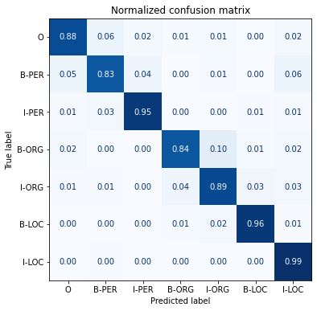
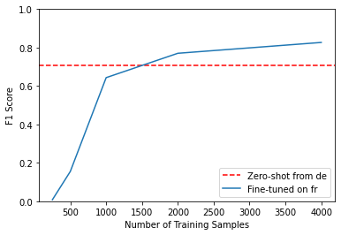

* [Introduction](#introduction)
* [Project: Multilingual Named Entity Recognition](#project-multilingual-named-entity-recognition)
* [The Dataset](#the-dataset)
* [Multilingual Transformers](#multilingual-transformers)
* [A Closer Look at Tokenization](#a-closer-look at-tokenization)
* [Transformers for Named Entity Recognition](#transformers-for-named-entity-recognition)
* [The Anatomy of the Transformers Model Class](#the-anatomy-of-the-transformers-model-class)
* [Tokenizing Texts for NER](#tokenizing-texts-for-ner)
* [Performance Measures](#performance-measures)
* [Fine-Tuning XLM-RoBERTa](#fine-tuning-xlm-roberta)
* [Error Analysis](#error-analysis)
* [Cross-Lingual Transfer](#cross-lingual-transfer)
* [References](#references)


------

```python
import transformers
import datasets
import accelerate

# Only print error messages
transformers.logging.set_verbosity_error()
datasets.logging.set_verbosity_error()

transformers.__version__, datasets.__version__, accelerate.__version__
```
```text
    ('4.11.3', '1.16.1', '0.5.1')
```

------

```python
import ast
# https://astor.readthedocs.io/en/latest/
import astor
import inspect
import textwrap
def print_source(obj, exclude_doc=True):
    
    # Get source code
    source = inspect.getsource(obj)
    # Remove any common leading whitespace from every line
    cleaned_source = textwrap.dedent(source)
    # Parse the source into an AST node.
    parsed = ast.parse(cleaned_source)

    for node in ast.walk(parsed):
        # Skip any nodes that are not class or function definitions
        if not isinstance(node, (ast.FunctionDef, ast.ClassDef, ast.AsyncFunctionDef)):
            continue
        
        if exclude_doc and len(node.body) > 1: node.body = node.body[1:]
        
    print(astor.to_source(parsed))
```

------


## Introduction

* Non-English pretrained models typically exist only for languages like German, Russian, or Mandarin, where plenty of web text is available for pretraining.
* Avoid maintaining multiple monolingual models in production when possible.
* Transformer models pretrained on large corpora across many languages can perform zero-shot cross-lingual transfer. 
    * We can fine-tune a model using one language and apply it to others without further training.
* Multilingual transformers are well-suited for situations where a speaker alternates between two or more languages in the context of a single conversation.


## Project: Multilingual Named Entity Recognition

* The goal is to fine-tine the transformer model [XLM-RoBERTa](https://arxiv.org/abs/1911.02116) to perform named entity recognition for a customer in Switzerland, where there are [four national languages](https://en.wikipedia.org/wiki/Languages_of_Switzerland).
    * We will use German, French, Italian, and English as the four languages.
* Named entity recognition involves extracting real-world objects like products, places, and people from a piece of text.
    * Some potential NER applications include gaining insights from company documents, augmenting the quality of search engines, and building a structured database from a corpus. 


## The Dataset

### WikiAnn (a.k.a PAN-X)
* WikiAnn is a dataset for cross-lingual name tagging and linking based on Wikipedia articles in 295 languages.
* Each article has annotations for location, person, and organization tags in the [IOB2](https://en.wikipedia.org/wiki/Inside%E2%80%93outside%E2%80%93beginning_(tagging)) format.
    * The IOB2 format indicates the beginning of an entity with a `B-` prefix, consecutive tags belonging to the same entity with an `I-` prefix, and tokens that do not belong to any entity with an `O` tag.
* WikiANN is a subset of the [XTREME: A Massively Multilingual Multi-task Benchmark for Evaluating Cross-lingual Generalization](https://arxiv.org/abs/2003.11080) benchmark.
* [Cross-lingual Name Tagging and Linking for 282 Languages](https://aclanthology.org/P17-1178/)
* [Hugging Face Dataset Card](https://huggingface.co/datasets/wikiann)

------


```python
import pandas as pd
pd.set_option('max_colwidth', None)
pd.set_option('display.max_rows', None)
pd.set_option('display.max_columns', None)
```

------


```python
# An example of a sequence annotated with named entities in IOB2 format
toks = "Jeff Dean is a computer scientist at Google in California".split()
lbls = ["B-PER", "I-PER", "O", "O", "O", "O", "O", "B-ORG", "O", "B-LOC"]
pd.DataFrame(data=[toks, lbls], index=['Tokens', 'Tags'])
```
<div style="overflow-x:auto;">
<table border="1" class="dataframe">
  <thead>
    <tr style="text-align: right;">
      <th></th>
      <th>0</th>
      <th>1</th>
      <th>2</th>
      <th>3</th>
      <th>4</th>
      <th>5</th>
      <th>6</th>
      <th>7</th>
      <th>8</th>
      <th>9</th>
    </tr>
  </thead>
  <tbody>
    <tr>
      <th>Tokens</th>
      <td>Jeff</td>
      <td>Dean</td>
      <td>is</td>
      <td>a</td>
      <td>computer</td>
      <td>scientist</td>
      <td>at</td>
      <td>Google</td>
      <td>in</td>
      <td>California</td>
    </tr>
    <tr>
      <th>Tags</th>
      <td>B-PER</td>
      <td>I-PER</td>
      <td>O</td>
      <td>O</td>
      <td>O</td>
      <td>O</td>
      <td>O</td>
      <td>B-ORG</td>
      <td>O</td>
      <td>B-LOC</td>
    </tr>
  </tbody>
</table>
</div>
------


```python
from datasets import get_dataset_config_names
```

#### `get_dataset_config_names`
* [Documentation](https://huggingface.co/docs/datasets/v2.0.0/en/package_reference/loading_methods#datasets.get_dataset_config_names)
* Get the list of available configuration names for a particular dataset.

------


```python
print_source(get_dataset_config_names)
```
```text
    def get_dataset_config_names(path: str, revision: Optional[Union[str,
        Version]]=None, download_config: Optional[DownloadConfig]=None,
        download_mode: Optional[GenerateMode]=None, force_local_path: Optional[
        str]=None, dynamic_modules_path: Optional[str]=None, data_files:
        Optional[Union[Dict, List, str]]=None, **download_kwargs):
        dataset_module = dataset_module_factory(path, revision=revision,
            download_config=download_config, download_mode=download_mode,
            force_local_path=force_local_path, dynamic_modules_path=
            dynamic_modules_path, data_files=data_files, **download_kwargs)
        builder_cls = import_main_class(dataset_module.module_path)
        return list(builder_cls.builder_configs.keys()) or [dataset_module.
            builder_kwargs.get('name', 'default')]
```

------

#### [`xtreme` Hugging Face Dataset Card](https://huggingface.co/datasets/xtreme)


```python
# Get the names of the subsets for the XTREME dataset
xtreme_subsets = get_dataset_config_names("xtreme")
print(f"XTREME has {len(xtreme_subsets)} configurations")
```
```text
    XTREME has 183 configurations
```


```python
pd.DataFrame(xtreme_subsets).T.style.hide(axis='columns').hide(axis='index')
```
<div style="overflow-x:auto;">
<table id="T_28e13">
  <thead>
  </thead>
  <tbody>
    <tr>
      <td id="T_28e13_row0_col0" class="data row0 col0" >XNLI</td>
      <td id="T_28e13_row0_col1" class="data row0 col1" >tydiqa</td>
      <td id="T_28e13_row0_col2" class="data row0 col2" >SQuAD</td>
      <td id="T_28e13_row0_col3" class="data row0 col3" >PAN-X.af</td>
      <td id="T_28e13_row0_col4" class="data row0 col4" >PAN-X.ar</td>
      <td id="T_28e13_row0_col5" class="data row0 col5" >PAN-X.bg</td>
      <td id="T_28e13_row0_col6" class="data row0 col6" >PAN-X.bn</td>
      <td id="T_28e13_row0_col7" class="data row0 col7" >PAN-X.de</td>
      <td id="T_28e13_row0_col8" class="data row0 col8" >PAN-X.el</td>
      <td id="T_28e13_row0_col9" class="data row0 col9" >PAN-X.en</td>
      <td id="T_28e13_row0_col10" class="data row0 col10" >PAN-X.es</td>
      <td id="T_28e13_row0_col11" class="data row0 col11" >PAN-X.et</td>
      <td id="T_28e13_row0_col12" class="data row0 col12" >PAN-X.eu</td>
      <td id="T_28e13_row0_col13" class="data row0 col13" >PAN-X.fa</td>
      <td id="T_28e13_row0_col14" class="data row0 col14" >PAN-X.fi</td>
      <td id="T_28e13_row0_col15" class="data row0 col15" >PAN-X.fr</td>
      <td id="T_28e13_row0_col16" class="data row0 col16" >PAN-X.he</td>
      <td id="T_28e13_row0_col17" class="data row0 col17" >PAN-X.hi</td>
      <td id="T_28e13_row0_col18" class="data row0 col18" >PAN-X.hu</td>
      <td id="T_28e13_row0_col19" class="data row0 col19" >PAN-X.id</td>
      <td id="T_28e13_row0_col20" class="data row0 col20" >PAN-X.it</td>
      <td id="T_28e13_row0_col21" class="data row0 col21" >PAN-X.ja</td>
      <td id="T_28e13_row0_col22" class="data row0 col22" >PAN-X.jv</td>
      <td id="T_28e13_row0_col23" class="data row0 col23" >PAN-X.ka</td>
      <td id="T_28e13_row0_col24" class="data row0 col24" >PAN-X.kk</td>
      <td id="T_28e13_row0_col25" class="data row0 col25" >PAN-X.ko</td>
      <td id="T_28e13_row0_col26" class="data row0 col26" >PAN-X.ml</td>
      <td id="T_28e13_row0_col27" class="data row0 col27" >PAN-X.mr</td>
      <td id="T_28e13_row0_col28" class="data row0 col28" >PAN-X.ms</td>
      <td id="T_28e13_row0_col29" class="data row0 col29" >PAN-X.my</td>
      <td id="T_28e13_row0_col30" class="data row0 col30" >PAN-X.nl</td>
      <td id="T_28e13_row0_col31" class="data row0 col31" >PAN-X.pt</td>
      <td id="T_28e13_row0_col32" class="data row0 col32" >PAN-X.ru</td>
      <td id="T_28e13_row0_col33" class="data row0 col33" >PAN-X.sw</td>
      <td id="T_28e13_row0_col34" class="data row0 col34" >PAN-X.ta</td>
      <td id="T_28e13_row0_col35" class="data row0 col35" >PAN-X.te</td>
      <td id="T_28e13_row0_col36" class="data row0 col36" >PAN-X.th</td>
      <td id="T_28e13_row0_col37" class="data row0 col37" >PAN-X.tl</td>
      <td id="T_28e13_row0_col38" class="data row0 col38" >PAN-X.tr</td>
      <td id="T_28e13_row0_col39" class="data row0 col39" >PAN-X.ur</td>
      <td id="T_28e13_row0_col40" class="data row0 col40" >PAN-X.vi</td>
      <td id="T_28e13_row0_col41" class="data row0 col41" >PAN-X.yo</td>
      <td id="T_28e13_row0_col42" class="data row0 col42" >PAN-X.zh</td>
      <td id="T_28e13_row0_col43" class="data row0 col43" >MLQA.ar.ar</td>
      <td id="T_28e13_row0_col44" class="data row0 col44" >MLQA.ar.de</td>
      <td id="T_28e13_row0_col45" class="data row0 col45" >MLQA.ar.vi</td>
      <td id="T_28e13_row0_col46" class="data row0 col46" >MLQA.ar.zh</td>
      <td id="T_28e13_row0_col47" class="data row0 col47" >MLQA.ar.en</td>
      <td id="T_28e13_row0_col48" class="data row0 col48" >MLQA.ar.es</td>
      <td id="T_28e13_row0_col49" class="data row0 col49" >MLQA.ar.hi</td>
      <td id="T_28e13_row0_col50" class="data row0 col50" >MLQA.de.ar</td>
      <td id="T_28e13_row0_col51" class="data row0 col51" >MLQA.de.de</td>
      <td id="T_28e13_row0_col52" class="data row0 col52" >MLQA.de.vi</td>
      <td id="T_28e13_row0_col53" class="data row0 col53" >MLQA.de.zh</td>
      <td id="T_28e13_row0_col54" class="data row0 col54" >MLQA.de.en</td>
      <td id="T_28e13_row0_col55" class="data row0 col55" >MLQA.de.es</td>
      <td id="T_28e13_row0_col56" class="data row0 col56" >MLQA.de.hi</td>
      <td id="T_28e13_row0_col57" class="data row0 col57" >MLQA.vi.ar</td>
      <td id="T_28e13_row0_col58" class="data row0 col58" >MLQA.vi.de</td>
      <td id="T_28e13_row0_col59" class="data row0 col59" >MLQA.vi.vi</td>
      <td id="T_28e13_row0_col60" class="data row0 col60" >MLQA.vi.zh</td>
      <td id="T_28e13_row0_col61" class="data row0 col61" >MLQA.vi.en</td>
      <td id="T_28e13_row0_col62" class="data row0 col62" >MLQA.vi.es</td>
      <td id="T_28e13_row0_col63" class="data row0 col63" >MLQA.vi.hi</td>
      <td id="T_28e13_row0_col64" class="data row0 col64" >MLQA.zh.ar</td>
      <td id="T_28e13_row0_col65" class="data row0 col65" >MLQA.zh.de</td>
      <td id="T_28e13_row0_col66" class="data row0 col66" >MLQA.zh.vi</td>
      <td id="T_28e13_row0_col67" class="data row0 col67" >MLQA.zh.zh</td>
      <td id="T_28e13_row0_col68" class="data row0 col68" >MLQA.zh.en</td>
      <td id="T_28e13_row0_col69" class="data row0 col69" >MLQA.zh.es</td>
      <td id="T_28e13_row0_col70" class="data row0 col70" >MLQA.zh.hi</td>
      <td id="T_28e13_row0_col71" class="data row0 col71" >MLQA.en.ar</td>
      <td id="T_28e13_row0_col72" class="data row0 col72" >MLQA.en.de</td>
      <td id="T_28e13_row0_col73" class="data row0 col73" >MLQA.en.vi</td>
      <td id="T_28e13_row0_col74" class="data row0 col74" >MLQA.en.zh</td>
      <td id="T_28e13_row0_col75" class="data row0 col75" >MLQA.en.en</td>
      <td id="T_28e13_row0_col76" class="data row0 col76" >MLQA.en.es</td>
      <td id="T_28e13_row0_col77" class="data row0 col77" >MLQA.en.hi</td>
      <td id="T_28e13_row0_col78" class="data row0 col78" >MLQA.es.ar</td>
      <td id="T_28e13_row0_col79" class="data row0 col79" >MLQA.es.de</td>
      <td id="T_28e13_row0_col80" class="data row0 col80" >MLQA.es.vi</td>
      <td id="T_28e13_row0_col81" class="data row0 col81" >MLQA.es.zh</td>
      <td id="T_28e13_row0_col82" class="data row0 col82" >MLQA.es.en</td>
      <td id="T_28e13_row0_col83" class="data row0 col83" >MLQA.es.es</td>
      <td id="T_28e13_row0_col84" class="data row0 col84" >MLQA.es.hi</td>
      <td id="T_28e13_row0_col85" class="data row0 col85" >MLQA.hi.ar</td>
      <td id="T_28e13_row0_col86" class="data row0 col86" >MLQA.hi.de</td>
      <td id="T_28e13_row0_col87" class="data row0 col87" >MLQA.hi.vi</td>
      <td id="T_28e13_row0_col88" class="data row0 col88" >MLQA.hi.zh</td>
      <td id="T_28e13_row0_col89" class="data row0 col89" >MLQA.hi.en</td>
      <td id="T_28e13_row0_col90" class="data row0 col90" >MLQA.hi.es</td>
      <td id="T_28e13_row0_col91" class="data row0 col91" >MLQA.hi.hi</td>
      <td id="T_28e13_row0_col92" class="data row0 col92" >XQuAD.ar</td>
      <td id="T_28e13_row0_col93" class="data row0 col93" >XQuAD.de</td>
      <td id="T_28e13_row0_col94" class="data row0 col94" >XQuAD.vi</td>
      <td id="T_28e13_row0_col95" class="data row0 col95" >XQuAD.zh</td>
      <td id="T_28e13_row0_col96" class="data row0 col96" >XQuAD.en</td>
      <td id="T_28e13_row0_col97" class="data row0 col97" >XQuAD.es</td>
      <td id="T_28e13_row0_col98" class="data row0 col98" >XQuAD.hi</td>
      <td id="T_28e13_row0_col99" class="data row0 col99" >XQuAD.el</td>
      <td id="T_28e13_row0_col100" class="data row0 col100" >XQuAD.ru</td>
      <td id="T_28e13_row0_col101" class="data row0 col101" >XQuAD.th</td>
      <td id="T_28e13_row0_col102" class="data row0 col102" >XQuAD.tr</td>
      <td id="T_28e13_row0_col103" class="data row0 col103" >bucc18.de</td>
      <td id="T_28e13_row0_col104" class="data row0 col104" >bucc18.fr</td>
      <td id="T_28e13_row0_col105" class="data row0 col105" >bucc18.zh</td>
      <td id="T_28e13_row0_col106" class="data row0 col106" >bucc18.ru</td>
      <td id="T_28e13_row0_col107" class="data row0 col107" >PAWS-X.de</td>
      <td id="T_28e13_row0_col108" class="data row0 col108" >PAWS-X.en</td>
      <td id="T_28e13_row0_col109" class="data row0 col109" >PAWS-X.es</td>
      <td id="T_28e13_row0_col110" class="data row0 col110" >PAWS-X.fr</td>
      <td id="T_28e13_row0_col111" class="data row0 col111" >PAWS-X.ja</td>
      <td id="T_28e13_row0_col112" class="data row0 col112" >PAWS-X.ko</td>
      <td id="T_28e13_row0_col113" class="data row0 col113" >PAWS-X.zh</td>
      <td id="T_28e13_row0_col114" class="data row0 col114" >tatoeba.afr</td>
      <td id="T_28e13_row0_col115" class="data row0 col115" >tatoeba.ara</td>
      <td id="T_28e13_row0_col116" class="data row0 col116" >tatoeba.ben</td>
      <td id="T_28e13_row0_col117" class="data row0 col117" >tatoeba.bul</td>
      <td id="T_28e13_row0_col118" class="data row0 col118" >tatoeba.deu</td>
      <td id="T_28e13_row0_col119" class="data row0 col119" >tatoeba.cmn</td>
      <td id="T_28e13_row0_col120" class="data row0 col120" >tatoeba.ell</td>
      <td id="T_28e13_row0_col121" class="data row0 col121" >tatoeba.est</td>
      <td id="T_28e13_row0_col122" class="data row0 col122" >tatoeba.eus</td>
      <td id="T_28e13_row0_col123" class="data row0 col123" >tatoeba.fin</td>
      <td id="T_28e13_row0_col124" class="data row0 col124" >tatoeba.fra</td>
      <td id="T_28e13_row0_col125" class="data row0 col125" >tatoeba.heb</td>
      <td id="T_28e13_row0_col126" class="data row0 col126" >tatoeba.hin</td>
      <td id="T_28e13_row0_col127" class="data row0 col127" >tatoeba.hun</td>
      <td id="T_28e13_row0_col128" class="data row0 col128" >tatoeba.ind</td>
      <td id="T_28e13_row0_col129" class="data row0 col129" >tatoeba.ita</td>
      <td id="T_28e13_row0_col130" class="data row0 col130" >tatoeba.jav</td>
      <td id="T_28e13_row0_col131" class="data row0 col131" >tatoeba.jpn</td>
      <td id="T_28e13_row0_col132" class="data row0 col132" >tatoeba.kat</td>
      <td id="T_28e13_row0_col133" class="data row0 col133" >tatoeba.kaz</td>
      <td id="T_28e13_row0_col134" class="data row0 col134" >tatoeba.kor</td>
      <td id="T_28e13_row0_col135" class="data row0 col135" >tatoeba.mal</td>
      <td id="T_28e13_row0_col136" class="data row0 col136" >tatoeba.mar</td>
      <td id="T_28e13_row0_col137" class="data row0 col137" >tatoeba.nld</td>
      <td id="T_28e13_row0_col138" class="data row0 col138" >tatoeba.pes</td>
      <td id="T_28e13_row0_col139" class="data row0 col139" >tatoeba.por</td>
      <td id="T_28e13_row0_col140" class="data row0 col140" >tatoeba.rus</td>
      <td id="T_28e13_row0_col141" class="data row0 col141" >tatoeba.spa</td>
      <td id="T_28e13_row0_col142" class="data row0 col142" >tatoeba.swh</td>
      <td id="T_28e13_row0_col143" class="data row0 col143" >tatoeba.tam</td>
      <td id="T_28e13_row0_col144" class="data row0 col144" >tatoeba.tel</td>
      <td id="T_28e13_row0_col145" class="data row0 col145" >tatoeba.tgl</td>
      <td id="T_28e13_row0_col146" class="data row0 col146" >tatoeba.tha</td>
      <td id="T_28e13_row0_col147" class="data row0 col147" >tatoeba.tur</td>
      <td id="T_28e13_row0_col148" class="data row0 col148" >tatoeba.urd</td>
      <td id="T_28e13_row0_col149" class="data row0 col149" >tatoeba.vie</td>
      <td id="T_28e13_row0_col150" class="data row0 col150" >udpos.Afrikaans</td>
      <td id="T_28e13_row0_col151" class="data row0 col151" >udpos.Arabic</td>
      <td id="T_28e13_row0_col152" class="data row0 col152" >udpos.Basque</td>
      <td id="T_28e13_row0_col153" class="data row0 col153" >udpos.Bulgarian</td>
      <td id="T_28e13_row0_col154" class="data row0 col154" >udpos.Dutch</td>
      <td id="T_28e13_row0_col155" class="data row0 col155" >udpos.English</td>
      <td id="T_28e13_row0_col156" class="data row0 col156" >udpos.Estonian</td>
      <td id="T_28e13_row0_col157" class="data row0 col157" >udpos.Finnish</td>
      <td id="T_28e13_row0_col158" class="data row0 col158" >udpos.French</td>
      <td id="T_28e13_row0_col159" class="data row0 col159" >udpos.German</td>
      <td id="T_28e13_row0_col160" class="data row0 col160" >udpos.Greek</td>
      <td id="T_28e13_row0_col161" class="data row0 col161" >udpos.Hebrew</td>
      <td id="T_28e13_row0_col162" class="data row0 col162" >udpos.Hindi</td>
      <td id="T_28e13_row0_col163" class="data row0 col163" >udpos.Hungarian</td>
      <td id="T_28e13_row0_col164" class="data row0 col164" >udpos.Indonesian</td>
      <td id="T_28e13_row0_col165" class="data row0 col165" >udpos.Italian</td>
      <td id="T_28e13_row0_col166" class="data row0 col166" >udpos.Japanese</td>
      <td id="T_28e13_row0_col167" class="data row0 col167" >udpos.Kazakh</td>
      <td id="T_28e13_row0_col168" class="data row0 col168" >udpos.Korean</td>
      <td id="T_28e13_row0_col169" class="data row0 col169" >udpos.Chinese</td>
      <td id="T_28e13_row0_col170" class="data row0 col170" >udpos.Marathi</td>
      <td id="T_28e13_row0_col171" class="data row0 col171" >udpos.Persian</td>
      <td id="T_28e13_row0_col172" class="data row0 col172" >udpos.Portuguese</td>
      <td id="T_28e13_row0_col173" class="data row0 col173" >udpos.Russian</td>
      <td id="T_28e13_row0_col174" class="data row0 col174" >udpos.Spanish</td>
      <td id="T_28e13_row0_col175" class="data row0 col175" >udpos.Tagalog</td>
      <td id="T_28e13_row0_col176" class="data row0 col176" >udpos.Tamil</td>
      <td id="T_28e13_row0_col177" class="data row0 col177" >udpos.Telugu</td>
      <td id="T_28e13_row0_col178" class="data row0 col178" >udpos.Thai</td>
      <td id="T_28e13_row0_col179" class="data row0 col179" >udpos.Turkish</td>
      <td id="T_28e13_row0_col180" class="data row0 col180" >udpos.Urdu</td>
      <td id="T_28e13_row0_col181" class="data row0 col181" >udpos.Vietnamese</td>
      <td id="T_28e13_row0_col182" class="data row0 col182" >udpos.Yoruba</td>
    </tr>
  </tbody>
</table>
</div>
**Note:** We are only interested in the PAN-X subsets for this project.

------


```python
# Look for configuration names containing 'PAN'
panx_subsets = [s for s in xtreme_subsets if s.startswith("PAN")]
len(panx_subsets), panx_subsets[:3]
```
```text
    (40, ['PAN-X.af', 'PAN-X.ar', 'PAN-X.bg'])
```


**Note:**
* There are 40 PAN-X subsets. 
* Each subset has a two-letter suffix indicating the [ISO 639-1](https://en.wikipedia.org/wiki/List_of_ISO_639-1_codes) language code.
    * German (de)
    * French (fr)
    * Italian (it)
    * English (en)

------


```python
from datasets import load_dataset
from collections import defaultdict
from datasets import DatasetDict
```


```python
# Specify the desired language codes
langs = ["de", "fr", "it", "en"]
# Specify the percentage each language should contribute to the total dataset
fracs = [0.629, 0.229, 0.084, 0.059]
```

**Note:**
* These percentages represent the spoken proportions for each language in Switzerland.
* This language imbalance simulates the common situation where acquiring labeled examples in a minority language is cost-prohibitive.

------

#### `Dataset.shuffle`
* [Documentation](https://huggingface.co/docs/datasets/v2.0.0/en/package_reference/main_classes#datasets.Dataset.shuffle)
* Create a new dataset with shuffled rows.

#### `Dataset.select`
* [Documentation](https://huggingface.co/docs/datasets/v2.0.0/en/package_reference/main_classes#datasets.Dataset.select)
* Create a new dataset with rows selected following the list/array of indices.\

------


```python
# Return a DatasetDict if a key doesn't exist
panx_ch = defaultdict(DatasetDict)

for lang, frac in zip(langs, fracs):
    # Load monolingual corpus
    ds = load_dataset("xtreme", name=f"PAN-X.{lang}")
    # Shuffle and downsample each split according to spoken proportion
    for split in ds:
        panx_ch[lang][split] = (
            ds[split]
            # Shuffle the dataset split rows
            .shuffle(seed=0)
            # Select subset of dataset split
            .select(range(int(frac * ds[split].num_rows))))
```

------

```python
pd.DataFrame({lang: [panx_ch[lang]["train"].num_rows] for lang in langs}, index=["Number of training examples"])
```
<div style="overflow-x:auto;">
<table border="1" class="dataframe">
  <thead>
    <tr style="text-align: right;">
      <th></th>
      <th>de</th>
      <th>fr</th>
      <th>it</th>
      <th>en</th>
    </tr>
  </thead>
  <tbody>
    <tr>
      <th>Number of training examples</th>
      <td>12580</td>
      <td>4580</td>
      <td>1680</td>
      <td>1180</td>
    </tr>
  </tbody>
</table>
</div>
------


```python
train_size = sum([panx_ch[lang]['train'].num_rows for lang in langs])
train_size
```
```text
    20020
```

------

```python
pd.DataFrame(
    {lang: [panx_ch[lang]["train"].num_rows, 
            f'{panx_ch[lang]["train"].num_rows/train_size*100:.2f}%'] for lang in langs
    }, index=["Number of training examples", "Proportion of Dataset"])
```
<div style="overflow-x:auto;">
<table border="1" class="dataframe">
  <thead>
    <tr style="text-align: right;">
      <th></th>
      <th>de</th>
      <th>fr</th>
      <th>it</th>
      <th>en</th>
    </tr>
  </thead>
  <tbody>
    <tr>
      <th>Number of training examples</th>
      <td>12580</td>
      <td>4580</td>
      <td>1680</td>
      <td>1180</td>
    </tr>
    <tr>
      <th>Proportion of Dataset</th>
      <td>62.84%</td>
      <td>22.88%</td>
      <td>8.39%</td>
      <td>5.89%</td>
    </tr>
  </tbody>
</table>
</div>
------


```python
for lang in langs: print(panx_ch[lang]["train"])
```
```text
    Dataset({
        features: ['tokens', 'ner_tags', 'langs'],
        num_rows: 12580
    })
    Dataset({
        features: ['tokens', 'ner_tags', 'langs'],
        num_rows: 4580
    })
    Dataset({
        features: ['tokens', 'ner_tags', 'langs'],
        num_rows: 1680
    })
    Dataset({
        features: ['tokens', 'ner_tags', 'langs'],
        num_rows: 1180
    })
```

------


```python
element = panx_ch["de"]["train"][0]
pd.DataFrame(element).T
```
<div style="overflow-x:auto;">
<table border="1" class="dataframe">
  <thead>
    <tr style="text-align: right;">
      <th></th>
      <th>0</th>
      <th>1</th>
      <th>2</th>
      <th>3</th>
      <th>4</th>
      <th>5</th>
      <th>6</th>
      <th>7</th>
      <th>8</th>
      <th>9</th>
      <th>10</th>
      <th>11</th>
    </tr>
  </thead>
  <tbody>
    <tr>
      <th>tokens</th>
      <td>2.000</td>
      <td>Einwohnern</td>
      <td>an</td>
      <td>der</td>
      <td>Danziger</td>
      <td>Bucht</td>
      <td>in</td>
      <td>der</td>
      <td>polnischen</td>
      <td>Woiwodschaft</td>
      <td>Pommern</td>
      <td>.</td>
    </tr>
    <tr>
      <th>ner_tags</th>
      <td>0</td>
      <td>0</td>
      <td>0</td>
      <td>0</td>
      <td>5</td>
      <td>6</td>
      <td>0</td>
      <td>0</td>
      <td>5</td>
      <td>5</td>
      <td>6</td>
      <td>0</td>
    </tr>
    <tr>
      <th>langs</th>
      <td>de</td>
      <td>de</td>
      <td>de</td>
      <td>de</td>
      <td>de</td>
      <td>de</td>
      <td>de</td>
      <td>de</td>
      <td>de</td>
      <td>de</td>
      <td>de</td>
      <td>de</td>
    </tr>
  </tbody>
</table>
</div>


**Note:** 

* The German text translates to "2,000 inhabitants at the Gdansk Bay in the Polish voivodeship of Pomerania."
    * Gdansk Bay is a bay in the Baltic Sea.
    * The word "voivodeship" corresponds to a state in Poland.
* The ner_tags column corresponds to the mapping of each entity to a class ID.
* The Dataset object has a "features" attribute that specifies the underlying data types associated with each column.

------

```python
tags = panx_ch["de"]["train"].features["ner_tags"].feature
tags
```
```text
    ClassLabel(num_classes=7, names=['O', 'B-PER', 'I-PER', 'B-ORG', 'I-ORG', 'B-LOC', 'I-LOC'], names_file=None, id=None)
```

------

```python
tags.names
```
```text
    ['O', 'B-PER', 'I-PER', 'B-ORG', 'I-ORG', 'B-LOC', 'I-LOC']
```

------

**Map the class IDs to the corresponding tag names**

```python
def create_tag_names(batch):
    return {"ner_tags_str": [tags.int2str(idx) for idx in batch["ner_tags"]]}

panx_de = panx_ch["de"].map(create_tag_names)
```


```python
pd.DataFrame(panx_de["train"][0]).reindex(columns=["tokens", "ner_tags_str","ner_tags","langs"]).T
```
<div style="overflow-x:auto;">
<table border="1" class="dataframe">
  <thead>
    <tr style="text-align: right;">
      <th></th>
      <th>0</th>
      <th>1</th>
      <th>2</th>
      <th>3</th>
      <th>4</th>
      <th>5</th>
      <th>6</th>
      <th>7</th>
      <th>8</th>
      <th>9</th>
      <th>10</th>
      <th>11</th>
    </tr>
  </thead>
  <tbody>
    <tr>
      <th>tokens</th>
      <td>2.000</td>
      <td>Einwohnern</td>
      <td>an</td>
      <td>der</td>
      <td>Danziger</td>
      <td>Bucht</td>
      <td>in</td>
      <td>der</td>
      <td>polnischen</td>
      <td>Woiwodschaft</td>
      <td>Pommern</td>
      <td>.</td>
    </tr>
    <tr>
      <th>ner_tags_str</th>
      <td>O</td>
      <td>O</td>
      <td>O</td>
      <td>O</td>
      <td>B-LOC</td>
      <td>I-LOC</td>
      <td>O</td>
      <td>O</td>
      <td>B-LOC</td>
      <td>B-LOC</td>
      <td>I-LOC</td>
      <td>O</td>
    </tr>
    <tr>
      <th>ner_tags</th>
      <td>0</td>
      <td>0</td>
      <td>0</td>
      <td>0</td>
      <td>5</td>
      <td>6</td>
      <td>0</td>
      <td>0</td>
      <td>5</td>
      <td>5</td>
      <td>6</td>
      <td>0</td>
    </tr>
    <tr>
      <th>langs</th>
      <td>de</td>
      <td>de</td>
      <td>de</td>
      <td>de</td>
      <td>de</td>
      <td>de</td>
      <td>de</td>
      <td>de</td>
      <td>de</td>
      <td>de</td>
      <td>de</td>
      <td>de</td>
    </tr>
  </tbody>
</table>
</div>
------


```python
from collections import Counter
```

**Calculate the frequencies of each entity across each split**

```python
split2freqs = defaultdict(Counter)
for split, dataset in panx_de.items():
    for row in dataset["ner_tags_str"]:
        for tag in row:
            if tag.startswith("B"):
                tag_type = tag.split("-")[1]
                split2freqs[split][tag_type] += 1
pd.DataFrame.from_dict(split2freqs, orient="index")
```
<div style="overflow-x:auto;">
<table border="1" class="dataframe">
  <thead>
    <tr style="text-align: right;">
      <th></th>
      <th>ORG</th>
      <th>LOC</th>
      <th>PER</th>
    </tr>
  </thead>
  <tbody>
    <tr>
      <th>validation</th>
      <td>2683</td>
      <td>3172</td>
      <td>2893</td>
    </tr>
    <tr>
      <th>test</th>
      <td>2573</td>
      <td>3180</td>
      <td>3071</td>
    </tr>
    <tr>
      <th>train</th>
      <td>5366</td>
      <td>6186</td>
      <td>5810</td>
    </tr>
  </tbody>
</table>
</div>
**Note:** The distributions of the entity frequencies are roughly the same for each split.

------


## Multilingual Transformers

* Multilingual transformers use a corpus consisting of documents in many languages for pretraining. 
    * The models do not receive any explicit information to differentiate among languages.
* The resulting linguistic representations generalize well across languages for many downstream tasks.
* Many use the CoNLL-2002 and CoNLL-2003 datasets as benchmarks to measure the progress of cross-lingual transfer for named entity recognition for English, Dutch, Spanish, and German.

### Evaluation Methods
1. **en:** Fine-tune using the English training data and then evaluate the model on each language's test set.
2. **each:** Fine-tune and evaluate using monolingual test data to measure per-language performance.
3. **all:** Fine-tune using all the training data to evaluate the model on each language's test set.


## A Closer Look at Tokenization

* XLM-RoBERTa uses the [SentencePiece](https://paperswithcode.com/method/sentencepiece) subword tokenizer instead of the WordPiece tokenizer.

------


```python
from transformers import AutoTokenizer
```


```python
bert_model_name = "bert-base-cased"
xlmr_model_name = "xlm-roberta-base"
bert_tokenizer = AutoTokenizer.from_pretrained(bert_model_name)
xlmr_tokenizer = AutoTokenizer.from_pretrained(xlmr_model_name)
```

**Compare the WordPiece and SentencePiece tokenizers**

```python
text = "Jack Sparrow loves New York!"
bert_tokens = bert_tokenizer(text).tokens()
xlmr_tokens = xlmr_tokenizer(text).tokens()
```


```python
pd.DataFrame([bert_tokens, xlmr_tokens], index=["BERT", "XLM-R"])
```
<div style="overflow-x:auto;">
<table border="1" class="dataframe">
  <thead>
    <tr style="text-align: right;">
      <th></th>
      <th>0</th>
      <th>1</th>
      <th>2</th>
      <th>3</th>
      <th>4</th>
      <th>5</th>
      <th>6</th>
      <th>7</th>
      <th>8</th>
      <th>9</th>
    </tr>
  </thead>
  <tbody>
    <tr>
      <th>BERT</th>
      <td>[CLS]</td>
      <td>Jack</td>
      <td>Spa</td>
      <td>##rrow</td>
      <td>loves</td>
      <td>New</td>
      <td>York</td>
      <td>!</td>
      <td>[SEP]</td>
      <td>None</td>
    </tr>
    <tr>
      <th>XLM-R</th>
      <td>&lt;s&gt;</td>
      <td>▁Jack</td>
      <td>▁Spar</td>
      <td>row</td>
      <td>▁love</td>
      <td>s</td>
      <td>▁New</td>
      <td>▁York</td>
      <td>!</td>
      <td>&lt;/s&gt;</td>
    </tr>
  </tbody>
</table>
</div>
**Note:** SentencePiece uses `<s>` and `</s>` to indicate the start and end sequences.

------


### The Tokenizer Pipeline

#### 1. Normalization
* The normalization step includes the operations to clean up raw text, such as stripping whitespace and removing accented characters.
* [Unicode normalization schemes](https://unicode.org/reports/tr15/) replace the various ways to write the same character with standard forms.
    * Unicode normalization is particularly effective when working with multilingual corpora.
* Lowercasing can help reduce the vocabulary size when the model only accepts and uses lowercase characters.

#### 2. Pretokenization
* The pre-tokenization step splits a text into smaller objects, and the final tokens will be subunits of these objects.
* Some languages might require language-specific pre-tokenization methods.

#### 3. Tokenizer Model
* The tokenizer model analyzes the training corpus to find the most commonly occurring groups of characters, which become the vocab.

#### 4. Postprocessing
* The postprocessing step applies some additional transformations, such as adding special characters to the start or end of an input sequence.

### The SentencePiece Tokenizer
* The SentencePiece tokenizer builds on the Unigram subword segmentation algorithm and encodes each input text as a sequence of Unicode characters.
* SentencePiece supports the [byte-pair-encoding (BPE)](https://aclanthology.org/P16-1162/) algorithm and the [unigram language model](https://arxiv.org/abs/1804.10959).
* SentencePiece replaces whitespace with the Unicode symbol `U+2581` for `▁`.

------


```python
"".join(xlmr_tokens).replace(u"\u2581", " ")
```
```text
    '<s> Jack Sparrow loves New York!</s>'
```

------


## Transformers for Named Entity Recognition

* For text classification, BERT uses the `[CLS]` token to represent an entire sequence of text.
* For named entity recognition, BERT feeds the representation of each input token through the same fully connected layer to output the entity of each one.
    * We can assign the entity label to the first subword of a word and ignore the rest.


## The Anatomy of the Transformers Model Class

* The Hugging Face Transformers library has dedicated classes for each architecture and task.
* We can extend existing models for specific use cases with little overhead.

### Bodies and Heads
* Hugging Face Transformers splits model architectures into a body and head
* The body is task-agnostic, and the model head is unique to a specific downstream task.

### Creating a Custom Model for Token Classification

------


```python
import torch.nn as nn
from transformers import XLMRobertaConfig
from transformers.modeling_outputs import TokenClassifierOutput
from transformers.models.roberta.modeling_roberta import RobertaModel
from transformers.models.roberta.modeling_roberta import RobertaPreTrainedModel
```

------

#### `TokenClassifierOutput`

* [Documentation](https://huggingface.co/docs/transformers/main/en/main_classes/output#transformers.modeling_outputs.TokenClassifierOutput)
* A base class for outputs of token classification models.


```python
print_source(TokenClassifierOutput)
```
```text
    @dataclass
    class TokenClassifierOutput(ModelOutput):
        loss: Optional[torch.FloatTensor] = None
        logits: torch.FloatTensor = None
        hidden_states: Optional[Tuple[torch.FloatTensor]] = None
        attentions: Optional[Tuple[torch.FloatTensor]] = None
```

------

#### `ModelOutput`

* [Documentation](https://huggingface.co/docs/transformers/main/en/main_classes/output#transformers.utils.ModelOutput)
* The base class for all model outputs.

#### `RobertaModel`
* [Documentation](https://huggingface.co/docs/transformers/main/en/model_doc/roberta#transformers.RobertaModel)
* A bare RoBERTa Model transformer outputting raw hidden-states without any specific head on top.

#### `RobertaPreTrainedModel`
* [Source Code](https://github.com/huggingface/transformers/blob/febe42b5daf4b416f4613e9d7f68617ee983bb40/src/transformers/models/roberta/modeling_roberta.py#L585)
* An abstract class to handle weights initialization and a simple interface for downloading and loading pretrained models.

------


```python
XLMRobertaConfig()
```
```text
    XLMRobertaConfig {
      "attention_probs_dropout_prob": 0.1,
      "bos_token_id": 0,
      "classifier_dropout": null,
      "eos_token_id": 2,
      "hidden_act": "gelu",
      "hidden_dropout_prob": 0.1,
      "hidden_size": 768,
      "initializer_range": 0.02,
      "intermediate_size": 3072,
      "layer_norm_eps": 1e-12,
      "max_position_embeddings": 512,
      "model_type": "xlm-roberta",
      "num_attention_heads": 12,
      "num_hidden_layers": 12,
      "pad_token_id": 1,
      "position_embedding_type": "absolute",
      "transformers_version": "4.11.3",
      "type_vocab_size": 2,
      "use_cache": true,
      "vocab_size": 30522
    }
```

------

```python
class XLMRobertaForTokenClassification(RobertaPreTrainedModel):
    # Use the standard XLM-RoBERTa settings.
    config_class = XLMRobertaConfig

    def __init__(self, config):
        super().__init__(config)
        self.num_labels = config.num_labels
        # Load model body
        # Set add_pooling_layer to False to get all hidden states in the output
        self.roberta = RobertaModel(config, add_pooling_layer=False)
        # Set up token classification head
        self.dropout = nn.Dropout(config.hidden_dropout_prob)
        self.classifier = nn.Linear(config.hidden_size, config.num_labels)
        # Load and initialize weights
        self.init_weights()

    def forward(self, input_ids=None, attention_mask=None, token_type_ids=None, 
                labels=None, **kwargs):
        # Use model body to get encoder representations
        outputs = self.roberta(input_ids, attention_mask=attention_mask,
                               token_type_ids=token_type_ids, **kwargs)
        # Apply classifier to encoder representation
        sequence_output = self.dropout(outputs[0])
        logits = self.classifier(sequence_output)
        # Calculate losses
        loss = None
        if labels is not None:
            loss_fct = nn.CrossEntropyLoss()
            loss = loss_fct(logits.view(-1, self.num_labels), labels.view(-1))
        # Return model output object
        return TokenClassifierOutput(loss=loss, logits=logits, 
                                     hidden_states=outputs.hidden_states, 
                                     attentions=outputs.attentions)
```

------

### Loading a Custom Model

* We need to provide the tags for labeling each entity and mappings to convert between tags and IDs

**Define the mappings to convert between tags and index IDs**

```python
index2tag = {idx: tag for idx, tag in enumerate(tags.names)}
tag2index = {tag: idx for idx, tag in enumerate(tags.names)}
index2tag, tag2index
```
```text
    ({0: 'O',
      1: 'B-PER',
      2: 'I-PER',
      3: 'B-ORG',
      4: 'I-ORG',
      5: 'B-LOC',
      6: 'I-LOC'},
     {'O': 0,
      'B-PER': 1,
      'I-PER': 2,
      'B-ORG': 3,
      'I-ORG': 4,
      'B-LOC': 5,
      'I-LOC': 6})
```

------

```python
from transformers import AutoConfig
```

**Override the default parameters stored in XLMRobertaConfig**
```python
xlmr_config = AutoConfig.from_pretrained(xlmr_model_name, 
                                         num_labels=tags.num_classes,
                                         id2label=index2tag, label2id=tag2index)
xlmr_config
```
```text
    XLMRobertaConfig {
      "architectures": [
        "XLMRobertaForMaskedLM"
      ],
      "attention_probs_dropout_prob": 0.1,
      "bos_token_id": 0,
      "classifier_dropout": null,
      "eos_token_id": 2,
      "hidden_act": "gelu",
      "hidden_dropout_prob": 0.1,
      "hidden_size": 768,
      "id2label": {
        "0": "O",
        "1": "B-PER",
        "2": "I-PER",
        "3": "B-ORG",
        "4": "I-ORG",
        "5": "B-LOC",
        "6": "I-LOC"
      },
      "initializer_range": 0.02,
      "intermediate_size": 3072,
      "label2id": {
        "B-LOC": 5,
        "B-ORG": 3,
        "B-PER": 1,
        "I-LOC": 6,
        "I-ORG": 4,
        "I-PER": 2,
        "O": 0
      },
      "layer_norm_eps": 1e-05,
      "max_position_embeddings": 514,
      "model_type": "xlm-roberta",
      "num_attention_heads": 12,
      "num_hidden_layers": 12,
      "output_past": true,
      "pad_token_id": 1,
      "position_embedding_type": "absolute",
      "transformers_version": "4.11.3",
      "type_vocab_size": 1,
      "use_cache": true,
      "vocab_size": 250002
    }
```

------

```python
import torch
```

**Load a pretrained XLM-RoBERTa model with the custom classification head and configuration parameters**
```python
device = torch.device("cuda" if torch.cuda.is_available() else "cpu")
xlmr_model = (XLMRobertaForTokenClassification
              .from_pretrained(xlmr_model_name, config=xlmr_config)
              .to(device))
```

------

**Encode some sample text**

```python
text
```
```text
    'Jack Sparrow loves New York!'
```

------

```python
input_ids = xlmr_tokenizer.encode(text, return_tensors="pt")
pd.DataFrame([xlmr_tokens, input_ids[0].numpy()], index=["Tokens", "Input IDs"])
```
<div style="overflow-x:auto;">
<table border="1" class="dataframe">
  <thead>
    <tr style="text-align: right;">
      <th></th>
      <th>0</th>
      <th>1</th>
      <th>2</th>
      <th>3</th>
      <th>4</th>
      <th>5</th>
      <th>6</th>
      <th>7</th>
      <th>8</th>
      <th>9</th>
    </tr>
  </thead>
  <tbody>
    <tr>
      <th>Tokens</th>
      <td>&lt;s&gt;</td>
      <td>▁Jack</td>
      <td>▁Spar</td>
      <td>row</td>
      <td>▁love</td>
      <td>s</td>
      <td>▁New</td>
      <td>▁York</td>
      <td>!</td>
      <td>&lt;/s&gt;</td>
    </tr>
    <tr>
      <th>Input IDs</th>
      <td>0</td>
      <td>21763</td>
      <td>37456</td>
      <td>15555</td>
      <td>5161</td>
      <td>7</td>
      <td>2356</td>
      <td>5753</td>
      <td>38</td>
      <td>2</td>
    </tr>
  </tbody>
</table>
</div>
------


**Test model predictions with the untrained classifier**

```python
outputs = xlmr_model(input_ids.to(device)).logits
predictions = torch.argmax(outputs, dim=-1)
print(f"Number of tokens in sequence: {len(xlmr_tokens)}")
print(f"Shape of outputs: {outputs.shape}")
```
```text
    Number of tokens in sequence: 10
    Shape of outputs: torch.Size([1, 10, 7])
```

**Note:** The logits have the shape `[batch_size, num_tokens, num_tags]`.

------


```python
preds = [tags.names[p] for p in predictions[0].cpu().numpy()]
pd.DataFrame([xlmr_tokens, preds], index=["Tokens", "Tags"])
```
<div style="overflow-x:auto;">
<table border="1" class="dataframe">
  <thead>
    <tr style="text-align: right;">
      <th></th>
      <th>0</th>
      <th>1</th>
      <th>2</th>
      <th>3</th>
      <th>4</th>
      <th>5</th>
      <th>6</th>
      <th>7</th>
      <th>8</th>
      <th>9</th>
    </tr>
  </thead>
  <tbody>
    <tr>
      <th>Tokens</th>
      <td>&lt;s&gt;</td>
      <td>▁Jack</td>
      <td>▁Spar</td>
      <td>row</td>
      <td>▁love</td>
      <td>s</td>
      <td>▁New</td>
      <td>▁York</td>
      <td>!</td>
      <td>&lt;/s&gt;</td>
    </tr>
    <tr>
      <th>Tags</th>
      <td>I-ORG</td>
      <td>I-ORG</td>
      <td>I-ORG</td>
      <td>I-ORG</td>
      <td>I-ORG</td>
      <td>I-ORG</td>
      <td>I-ORG</td>
      <td>I-ORG</td>
      <td>I-ORG</td>
      <td>I-ORG</td>
    </tr>
  </tbody>
</table>
</div>
**Note:** The output is useless as the weights are still randomly initialized.

------

**Wrap the prediction steps in a helper function**
```python
def tag_text(text, tags, model, tokenizer):
    # Get tokens with special characters
    tokens = tokenizer(text).tokens()
    # Encode the sequence into IDs
    input_ids = xlmr_tokenizer(text, return_tensors="pt").input_ids.to(device)
    # Get predictions as distribution over 7 possible classes
    outputs = model(input_ids)[0]
    # Take argmax to get most likely class per token
    predictions = torch.argmax(outputs, dim=2)
    # Convert to DataFrame
    preds = [tags.names[p] for p in predictions[0].cpu().numpy()]
    return pd.DataFrame([tokens, preds], index=["Tokens", "Tags"])
```
------


## Tokenizing Texts for NER

**Collect the words and tags as ordinary lists**

```python
de_example = panx_de['train'][0]
```


```python
words, labels = de_example["tokens"], de_example["ner_tags"]
pd.DataFrame([words,labels], index=["words", "labels"])
```
<div style="overflow-x:auto;">
<table border="1" class="dataframe">
  <thead>
    <tr style="text-align: right;">
      <th></th>
      <th>0</th>
      <th>1</th>
      <th>2</th>
      <th>3</th>
      <th>4</th>
      <th>5</th>
      <th>6</th>
      <th>7</th>
      <th>8</th>
      <th>9</th>
      <th>10</th>
      <th>11</th>
    </tr>
  </thead>
  <tbody>
    <tr>
      <th>words</th>
      <td>2.000</td>
      <td>Einwohnern</td>
      <td>an</td>
      <td>der</td>
      <td>Danziger</td>
      <td>Bucht</td>
      <td>in</td>
      <td>der</td>
      <td>polnischen</td>
      <td>Woiwodschaft</td>
      <td>Pommern</td>
      <td>.</td>
    </tr>
    <tr>
      <th>labels</th>
      <td>0</td>
      <td>0</td>
      <td>0</td>
      <td>0</td>
      <td>5</td>
      <td>6</td>
      <td>0</td>
      <td>0</td>
      <td>5</td>
      <td>5</td>
      <td>6</td>
      <td>0</td>
    </tr>
  </tbody>
</table>
</div>
------


**Tokenize each word**

```python
tokenized_input = xlmr_tokenizer(de_example["tokens"], is_split_into_words=True)
pd.DataFrame(tokenized_input.values(), index=tokenized_input.keys())
```
<div style="overflow-x:auto;">
<table border="1" class="dataframe">
  <thead>
    <tr style="text-align: right;">
      <th></th>
      <th>0</th>
      <th>1</th>
      <th>2</th>
      <th>3</th>
      <th>4</th>
      <th>5</th>
      <th>6</th>
      <th>7</th>
      <th>8</th>
      <th>9</th>
      <th>10</th>
      <th>11</th>
      <th>12</th>
      <th>13</th>
      <th>14</th>
      <th>15</th>
      <th>16</th>
      <th>17</th>
      <th>18</th>
      <th>19</th>
      <th>20</th>
      <th>21</th>
      <th>22</th>
      <th>23</th>
      <th>24</th>
    </tr>
  </thead>
  <tbody>
    <tr>
      <th>input_ids</th>
      <td>0</td>
      <td>70101</td>
      <td>176581</td>
      <td>19</td>
      <td>142</td>
      <td>122</td>
      <td>2290</td>
      <td>708</td>
      <td>1505</td>
      <td>18363</td>
      <td>18</td>
      <td>23</td>
      <td>122</td>
      <td>127474</td>
      <td>15439</td>
      <td>13787</td>
      <td>14</td>
      <td>15263</td>
      <td>18917</td>
      <td>663</td>
      <td>6947</td>
      <td>19</td>
      <td>6</td>
      <td>5</td>
      <td>2</td>
    </tr>
    <tr>
      <th>attention_mask</th>
      <td>1</td>
      <td>1</td>
      <td>1</td>
      <td>1</td>
      <td>1</td>
      <td>1</td>
      <td>1</td>
      <td>1</td>
      <td>1</td>
      <td>1</td>
      <td>1</td>
      <td>1</td>
      <td>1</td>
      <td>1</td>
      <td>1</td>
      <td>1</td>
      <td>1</td>
      <td>1</td>
      <td>1</td>
      <td>1</td>
      <td>1</td>
      <td>1</td>
      <td>1</td>
      <td>1</td>
      <td>1</td>
    </tr>
  </tbody>
</table>
</div>
**Note:** The `is_split_into_words` argument tells the tokenizer the input sequence is a list of separated words.

------


```python
tokens = xlmr_tokenizer.convert_ids_to_tokens(tokenized_input["input_ids"])
pd.DataFrame(tokens, columns=["tokens"]).T
```
<div style="overflow-x:auto;">
<table border="1" class="dataframe">
  <thead>
    <tr style="text-align: right;">
      <th></th>
      <th>0</th>
      <th>1</th>
      <th>2</th>
      <th>3</th>
      <th>4</th>
      <th>5</th>
      <th>6</th>
      <th>7</th>
      <th>8</th>
      <th>9</th>
      <th>10</th>
      <th>11</th>
      <th>12</th>
      <th>13</th>
      <th>14</th>
      <th>15</th>
      <th>16</th>
      <th>17</th>
      <th>18</th>
      <th>19</th>
      <th>20</th>
      <th>21</th>
      <th>22</th>
      <th>23</th>
      <th>24</th>
    </tr>
  </thead>
  <tbody>
    <tr>
      <th>tokens</th>
      <td>&lt;s&gt;</td>
      <td>▁2.000</td>
      <td>▁Einwohner</td>
      <td>n</td>
      <td>▁an</td>
      <td>▁der</td>
      <td>▁Dan</td>
      <td>zi</td>
      <td>ger</td>
      <td>▁Buch</td>
      <td>t</td>
      <td>▁in</td>
      <td>▁der</td>
      <td>▁polni</td>
      <td>schen</td>
      <td>▁Wo</td>
      <td>i</td>
      <td>wod</td>
      <td>schaft</td>
      <td>▁Po</td>
      <td>mmer</td>
      <td>n</td>
      <td>▁</td>
      <td>.</td>
      <td>&lt;/s&gt;</td>
    </tr>
  </tbody>
</table>
</div>
**Note:** We can use the `word_ids()` function to mask the subword representations after the first subword.

------

#### `BatchEncoding.word_ids.word_ids`

* [Documentation](https://huggingface.co/docs/transformers/main/en/main_classes/tokenizer#transformers.BatchEncoding.word_ids)
* Get a list indicating the word corresponding to each token.


```python
word_ids = tokenized_input.word_ids()
pd.DataFrame([tokens, word_ids], index=["Tokens", "Word IDs"])
```
<div style="overflow-x:auto;">
<table border="1" class="dataframe">
  <thead>
    <tr style="text-align: right;">
      <th></th>
      <th>0</th>
      <th>1</th>
      <th>2</th>
      <th>3</th>
      <th>4</th>
      <th>5</th>
      <th>6</th>
      <th>7</th>
      <th>8</th>
      <th>9</th>
      <th>10</th>
      <th>11</th>
      <th>12</th>
      <th>13</th>
      <th>14</th>
      <th>15</th>
      <th>16</th>
      <th>17</th>
      <th>18</th>
      <th>19</th>
      <th>20</th>
      <th>21</th>
      <th>22</th>
      <th>23</th>
      <th>24</th>
    </tr>
  </thead>
  <tbody>
    <tr>
      <th>Tokens</th>
      <td>&lt;s&gt;</td>
      <td>▁2.000</td>
      <td>▁Einwohner</td>
      <td>n</td>
      <td>▁an</td>
      <td>▁der</td>
      <td>▁Dan</td>
      <td>zi</td>
      <td>ger</td>
      <td>▁Buch</td>
      <td>t</td>
      <td>▁in</td>
      <td>▁der</td>
      <td>▁polni</td>
      <td>schen</td>
      <td>▁Wo</td>
      <td>i</td>
      <td>wod</td>
      <td>schaft</td>
      <td>▁Po</td>
      <td>mmer</td>
      <td>n</td>
      <td>▁</td>
      <td>.</td>
      <td>&lt;/s&gt;</td>
    </tr>
    <tr>
      <th>Word IDs</th>
      <td>None</td>
      <td>0</td>
      <td>1</td>
      <td>1</td>
      <td>2</td>
      <td>3</td>
      <td>4</td>
      <td>4</td>
      <td>4</td>
      <td>5</td>
      <td>5</td>
      <td>6</td>
      <td>7</td>
      <td>8</td>
      <td>8</td>
      <td>9</td>
      <td>9</td>
      <td>9</td>
      <td>9</td>
      <td>10</td>
      <td>10</td>
      <td>10</td>
      <td>11</td>
      <td>11</td>
      <td>None</td>
    </tr>
  </tbody>
</table>
</div>
**Note:** The `<s>` and `</s>` tokens map to `None` as they are not words from the original text.

------

**Set -100 as the label for the start and end tokens and masked subwords**

* The PyTorch cross-entropy loss class has an attribute called `ignore_index` whose value is -100.
```python
previous_word_idx = None
label_ids = []

for word_idx in word_ids:
    if word_idx is None or word_idx == previous_word_idx:
        label_ids.append(-100)
    elif word_idx != previous_word_idx:
        label_ids.append(labels[word_idx])
    previous_word_idx = word_idx
    
labels = [index2tag[l] if l != -100 else "IGN" for l in label_ids]
index = ["Tokens", "Word IDs", "Label IDs", "Labels"]

pd.DataFrame([tokens, word_ids, label_ids, labels], index=index)
```
<div style="overflow-x:auto;">
<table border="1" class="dataframe">
  <thead>
    <tr style="text-align: right;">
      <th></th>
      <th>0</th>
      <th>1</th>
      <th>2</th>
      <th>3</th>
      <th>4</th>
      <th>5</th>
      <th>6</th>
      <th>7</th>
      <th>8</th>
      <th>9</th>
      <th>10</th>
      <th>11</th>
      <th>12</th>
      <th>13</th>
      <th>14</th>
      <th>15</th>
      <th>16</th>
      <th>17</th>
      <th>18</th>
      <th>19</th>
      <th>20</th>
      <th>21</th>
      <th>22</th>
      <th>23</th>
      <th>24</th>
    </tr>
  </thead>
  <tbody>
    <tr>
      <th>Tokens</th>
      <td>&lt;s&gt;</td>
      <td>▁2.000</td>
      <td>▁Einwohner</td>
      <td>n</td>
      <td>▁an</td>
      <td>▁der</td>
      <td>▁Dan</td>
      <td>zi</td>
      <td>ger</td>
      <td>▁Buch</td>
      <td>t</td>
      <td>▁in</td>
      <td>▁der</td>
      <td>▁polni</td>
      <td>schen</td>
      <td>▁Wo</td>
      <td>i</td>
      <td>wod</td>
      <td>schaft</td>
      <td>▁Po</td>
      <td>mmer</td>
      <td>n</td>
      <td>▁</td>
      <td>.</td>
      <td>&lt;/s&gt;</td>
    </tr>
    <tr>
      <th>Word IDs</th>
      <td>None</td>
      <td>0</td>
      <td>1</td>
      <td>1</td>
      <td>2</td>
      <td>3</td>
      <td>4</td>
      <td>4</td>
      <td>4</td>
      <td>5</td>
      <td>5</td>
      <td>6</td>
      <td>7</td>
      <td>8</td>
      <td>8</td>
      <td>9</td>
      <td>9</td>
      <td>9</td>
      <td>9</td>
      <td>10</td>
      <td>10</td>
      <td>10</td>
      <td>11</td>
      <td>11</td>
      <td>None</td>
    </tr>
    <tr>
      <th>Label IDs</th>
      <td>-100</td>
      <td>0</td>
      <td>0</td>
      <td>-100</td>
      <td>0</td>
      <td>0</td>
      <td>5</td>
      <td>-100</td>
      <td>-100</td>
      <td>6</td>
      <td>-100</td>
      <td>0</td>
      <td>0</td>
      <td>5</td>
      <td>-100</td>
      <td>5</td>
      <td>-100</td>
      <td>-100</td>
      <td>-100</td>
      <td>6</td>
      <td>-100</td>
      <td>-100</td>
      <td>0</td>
      <td>-100</td>
      <td>-100</td>
    </tr>
    <tr>
      <th>Labels</th>
      <td>IGN</td>
      <td>O</td>
      <td>O</td>
      <td>IGN</td>
      <td>O</td>
      <td>O</td>
      <td>B-LOC</td>
      <td>IGN</td>
      <td>IGN</td>
      <td>I-LOC</td>
      <td>IGN</td>
      <td>O</td>
      <td>O</td>
      <td>B-LOC</td>
      <td>IGN</td>
      <td>B-LOC</td>
      <td>IGN</td>
      <td>IGN</td>
      <td>IGN</td>
      <td>I-LOC</td>
      <td>IGN</td>
      <td>IGN</td>
      <td>O</td>
      <td>IGN</td>
      <td>IGN</td>
    </tr>
  </tbody>
</table>
</div>
------

**Wrap the tokenization and label alignment steps into a single function**

```python
def tokenize_and_align_labels(examples):
    tokenized_inputs = xlmr_tokenizer(examples["tokens"], truncation=True, 
                                      is_split_into_words=True)
    labels = []
    for idx, label in enumerate(examples["ner_tags"]):
        word_ids = tokenized_inputs.word_ids(batch_index=idx)
        previous_word_idx = None
        label_ids = []
        for word_idx in word_ids:
            if word_idx is None or word_idx == previous_word_idx:
                label_ids.append(-100)
            else:
                label_ids.append(label[word_idx])
            previous_word_idx = word_idx
        labels.append(label_ids)
    tokenized_inputs["labels"] = labels
    return tokenized_inputs
```

------

**Define a mapping function to encode the dataset**

```python
def encode_panx_dataset(corpus):
    return corpus.map(tokenize_and_align_labels, batched=True, 
                      remove_columns=['langs', 'ner_tags', 'tokens'])
```

------


```python
panx_ch["de"]
```
```text
    DatasetDict({
        validation: Dataset({
            features: ['tokens', 'ner_tags', 'langs'],
            num_rows: 6290
        })
        test: Dataset({
            features: ['tokens', 'ner_tags', 'langs'],
            num_rows: 6290
        })
        train: Dataset({
            features: ['tokens', 'ner_tags', 'langs'],
            num_rows: 12580
        })
    })
```

------

```python
panx_de_encoded = encode_panx_dataset(panx_ch["de"])
panx_de_encoded
```
```text
    DatasetDict({
        validation: Dataset({
            features: ['attention_mask', 'input_ids', 'labels'],
            num_rows: 6290
        })
        test: Dataset({
            features: ['attention_mask', 'input_ids', 'labels'],
            num_rows: 6290
        })
        train: Dataset({
            features: ['attention_mask', 'input_ids', 'labels'],
            num_rows: 12580
        })
    })
```

------


## Performance Measures

* Standard performance measures for NER tasks include [precision](https://scikit-learn.org/stable/modules/generated/sklearn.metrics.precision_score.html), [recall](https://scikit-learn.org/stable/modules/generated/sklearn.metrics.recall_score.html), and [F1-score](https://scikit-learn.org/stable/modules/generated/sklearn.metrics.f1_score.html).
* The model needs to correctly predict all words of an entity for a prediction to count as correct.

### seqval
* [GitHub Repository](https://github.com/chakki-works/seqeval)
* A Python framework for sequence labeling evaluation

------


```python
from seqeval.metrics import classification_report
```

------

#### `classification_report`

* [Source Code](https://github.com/chakki-works/seqeval/blob/2921931184a98aff0dbbda5ff943214fe50a7847/seqeval/metrics/sequence_labeling.py#L613)
* Build a text report showing the main classification metrics for a sequence of targets and predictions.
* The function expects targets and predictions as lists of lists.

------


```python
y_true = [["O", "O", "O", "B-MISC", "I-MISC", "I-MISC", "O"],["B-PER", "I-PER", "O"]]
y_pred = [["O", "O", "B-MISC", "I-MISC", "I-MISC", "I-MISC", "O"],["B-PER", "I-PER", "O"]]
print(classification_report(y_true, y_pred))
```
```text
                  precision    recall  f1-score   support
    
            MISC       0.00      0.00      0.00         1
             PER       1.00      1.00      1.00         1
    
       micro avg       0.50      0.50      0.50         2
       macro avg       0.50      0.50      0.50         2
    weighted avg       0.50      0.50      0.50         2
```

------

```python
import numpy as np
```

**Format predictions and target labels for seqval**


```python
def align_predictions(predictions, label_ids):
    preds = np.argmax(predictions, axis=2)
    batch_size, seq_len = preds.shape
    labels_list, preds_list = [], []

    for batch_idx in range(batch_size):
        example_labels, example_preds = [], []
        for seq_idx in range(seq_len):
            # Ignore label IDs = -100
            if label_ids[batch_idx, seq_idx] != -100:
                example_labels.append(index2tag[label_ids[batch_idx][seq_idx]])
                example_preds.append(index2tag[preds[batch_idx][seq_idx]])

        labels_list.append(example_labels)
        preds_list.append(example_preds)

    return preds_list, labels_list
```

------


## Fine-Tuning XLM-RoBERTa

**Define training attributes**
```python
from transformers import TrainingArguments
```


```python
num_epochs = 3
batch_size = 64
logging_steps = len(panx_de_encoded["train"]) // batch_size
model_name = f"{xlmr_model_name}-finetuned-panx-de"
training_args = TrainingArguments(
    output_dir=model_name, log_level="error", num_train_epochs=num_epochs, 
    per_device_train_batch_size=batch_size, 
    per_device_eval_batch_size=batch_size, evaluation_strategy="epoch", 
    save_steps=1e6, weight_decay=0.01, disable_tqdm=False, 
    logging_steps=logging_steps, push_to_hub=True, fp16=True)
```

**Note:** Set `save_steps` to a large number to disable checkpointing.

------

**Log into Hugging Face account**

```python
from huggingface_hub import notebook_login
```


```python
notebook_login()
```
```text
    huggingface/tokenizers: The current process just got forked, after parallelism has already been used. Disabling parallelism to avoid deadlocks...
    To disable this warning, you can either:
    	- Avoid using `tokenizers` before the fork if possible
    	- Explicitly set the environment variable TOKENIZERS_PARALLELISM=(true | false)
    Login successful
    Your token has been saved to /home/innom-dt/.huggingface/token
    huggingface/tokenizers: The current process just got forked, after parallelism has already been used. Disabling parallelism to avoid deadlocks...
    To disable this warning, you can either:
    	- Avoid using `tokenizers` before the fork if possible
    	- Explicitly set the environment variable TOKENIZERS_PARALLELISM=(true | false)
```

------

**Compute the $f_{1}$-score on the validation set**

```python
from seqeval.metrics import f1_score
```


```python
def compute_metrics(eval_pred):
    y_pred, y_true = align_predictions(eval_pred.predictions, 
                                       eval_pred.label_ids)
    return {"f1": f1_score(y_true, y_pred)}
```

------

**Define a collator to pad each input sequence to the highest sequence length in a batch**

```python
from transformers import DataCollatorForTokenClassification
```

------

#### `DataCollatorForTokenClassification`

* [Documentation](https://huggingface.co/docs/transformers/main/en/main_classes/data_collator#transformers.DataCollatorForTokenClassification)
* Create a data collator that will dynamically pad inputs and labels.

------


```python
print_source(DataCollatorForTokenClassification.torch_call)
```
```text
    def torch_call(self, features):
        label_name = 'label' if 'label' in features[0].keys() else 'labels'
        labels = [feature[label_name] for feature in features
            ] if label_name in features[0].keys() else None
        batch = self.tokenizer.pad(features, padding=self.padding, max_length=
            self.max_length, pad_to_multiple_of=self.pad_to_multiple_of,
            return_tensors='pt' if labels is None else None)
        if labels is None:
            return batch
        sequence_length = torch.tensor(batch['input_ids']).shape[1]
        padding_side = self.tokenizer.padding_side
        if padding_side == 'right':
            batch[label_name] = [(list(label) + [self.label_pad_token_id] * (
                sequence_length - len(label))) for label in labels]
        else:
            batch[label_name] = [([self.label_pad_token_id] * (sequence_length -
                len(label)) + list(label)) for label in labels]
        batch = {k: torch.tensor(v, dtype=torch.int64) for k, v in batch.items()}
        return batch
```

------

```python
DataCollatorForTokenClassification.label_pad_token_id
```
```text
    -100
```


**Note:** 
* We need to pad the labels as they are also sequences.
* The collator pads label sequences with the value -100, so the PyTorch loss function ignores them.

------

```python
data_collator = DataCollatorForTokenClassification(xlmr_tokenizer)
```

------

**Create a helper function to initialize a new model for a training session**

```python
def model_init():
    return (XLMRobertaForTokenClassification
            .from_pretrained(xlmr_model_name, config=xlmr_config)
            .to(device))
```

------

**Disable Tokenizers Parallelism**

```python
%env TOKENIZERS_PARALLELISM=false
```
```text
    env: TOKENIZERS_PARALLELISM=false
```

------

**Initialize the Trainer object**

```python
from transformers import Trainer
```


```python
trainer = Trainer(model_init=model_init, args=training_args, 
                  data_collator=data_collator, compute_metrics=compute_metrics,
                  train_dataset=panx_de_encoded["train"],
                  eval_dataset=panx_de_encoded["validation"], 
                  tokenizer=xlmr_tokenizer)
```

------

**Run the training loop and push the final model to the Hugging Face Hub**

```python
trainer.train()
trainer.push_to_hub(commit_message="Training completed!")
```
<div style="overflow-x:auto;">
    <table border="1" class="dataframe">
  <thead>
    <tr style="text-align: left;">
      <th>Epoch</th>
      <th>Training Loss</th>
      <th>Validation Loss</th>
      <th>F1</th>
    </tr>
  </thead>
  <tbody>
    <tr>
      <td>1</td>
      <td>0.326400</td>
      <td>0.162317</td>
      <td>0.813909</td>
    </tr>
    <tr>
      <td>2</td>
      <td>0.136000</td>
      <td>0.133068</td>
      <td>0.845137</td>
    </tr>
    <tr>
      <td>3</td>
      <td>0.096000</td>
      <td>0.131872</td>
      <td>0.857581</td>
    </tr>
  </tbody>
</table>
</div>
```text
    'https://huggingface.co/cj-mills/xlm-roberta-base-finetuned-panx-de/commit/1ebdc3c9051a980588be5a495ad96896f330932c'
```

------

**How to manually display the training log**

```python
trainer.state.log_history
```
```text
    [{'loss': 0.3264,
      'learning_rate': 3.3671742808798645e-05,
      'epoch': 0.99,
      'step': 196},
     {'eval_loss': 0.1623172014951706,
      'eval_f1': 0.8139089269612262,
      'eval_runtime': 7.0145,
      'eval_samples_per_second': 896.714,
      'eval_steps_per_second': 14.114,
      'epoch': 1.0,
      'step': 197},
     {'loss': 0.136,
      'learning_rate': 1.7174280879864637e-05,
      'epoch': 1.99,
      'step': 392},
     {'eval_loss': 0.1330675333738327,
      'eval_f1': 0.8451372416130125,
      'eval_runtime': 6.8702,
      'eval_samples_per_second': 915.543,
      'eval_steps_per_second': 14.41,
      'epoch': 2.0,
      'step': 394},
     {'loss': 0.096,
      'learning_rate': 6.76818950930626e-07,
      'epoch': 2.98,
      'step': 588},
     {'eval_loss': 0.13187244534492493,
      'eval_f1': 0.8575809199318569,
      'eval_runtime': 6.8965,
      'eval_samples_per_second': 912.061,
      'eval_steps_per_second': 14.355,
      'epoch': 3.0,
      'step': 591},
     {'train_runtime': 95.0424,
      'train_samples_per_second': 397.086,
      'train_steps_per_second': 6.218,
      'total_flos': 1039360955930616.0,
      'train_loss': 0.18559023183211054,
      'epoch': 3.0,
      'step': 591}]
```

------

```python
df = pd.DataFrame(trainer.state.log_history)[['epoch','loss' ,'eval_loss', 'eval_f1']]
df = df.rename(columns={"epoch":"Epoch","loss": "Training Loss", "eval_loss": "Validation Loss", "eval_f1":"F1"})
df['Epoch'] = df["Epoch"].apply(lambda x: round(x))
df['Training Loss'] = df["Training Loss"].ffill()
df[['Validation Loss', 'F1']] = df[['Validation Loss', 'F1']].bfill().ffill()
df.drop_duplicates()
```
<div style="overflow-x:auto;">
<table border="1" class="dataframe">
  <thead>
    <tr style="text-align: right;">
      <th></th>
      <th>Epoch</th>
      <th>Training Loss</th>
      <th>Validation Loss</th>
      <th>F1</th>
    </tr>
  </thead>
  <tbody>
    <tr>
      <th>0</th>
      <td>1</td>
      <td>0.3264</td>
      <td>0.162317</td>
      <td>0.813909</td>
    </tr>
    <tr>
      <th>2</th>
      <td>2</td>
      <td>0.1360</td>
      <td>0.133068</td>
      <td>0.845137</td>
    </tr>
    <tr>
      <th>4</th>
      <td>3</td>
      <td>0.0960</td>
      <td>0.131872</td>
      <td>0.857581</td>
    </tr>
  </tbody>
</table>
</div>
------


**Test the model on some sample text**

```python
text_de = "Jeff Dean ist ein Informatiker bei Google in Kalifornien"
tag_text(text_de, tags, trainer.model, xlmr_tokenizer)
```
<div style="overflow-x:auto;">
<table border="1" class="dataframe">
  <thead>
    <tr style="text-align: right;">
      <th></th>
      <th>0</th>
      <th>1</th>
      <th>2</th>
      <th>3</th>
      <th>4</th>
      <th>5</th>
      <th>6</th>
      <th>7</th>
      <th>8</th>
      <th>9</th>
      <th>10</th>
      <th>11</th>
      <th>12</th>
      <th>13</th>
    </tr>
  </thead>
  <tbody>
    <tr>
      <th>Tokens</th>
      <td>&lt;s&gt;</td>
      <td>▁Jeff</td>
      <td>▁De</td>
      <td>an</td>
      <td>▁ist</td>
      <td>▁ein</td>
      <td>▁Informati</td>
      <td>ker</td>
      <td>▁bei</td>
      <td>▁Google</td>
      <td>▁in</td>
      <td>▁Kaliforni</td>
      <td>en</td>
      <td>&lt;/s&gt;</td>
    </tr>
    <tr>
      <th>Tags</th>
      <td>O</td>
      <td>B-PER</td>
      <td>I-PER</td>
      <td>I-PER</td>
      <td>O</td>
      <td>O</td>
      <td>O</td>
      <td>O</td>
      <td>O</td>
      <td>B-ORG</td>
      <td>O</td>
      <td>B-LOC</td>
      <td>I-LOC</td>
      <td>O</td>
    </tr>
  </tbody>
</table>
</div>
**Note:** The fine-tuned model correctly identifies the entities in the sample text.

------


## Error Analysis

* Error analysis is an effective tool to understand a model's strengths and weaknesses.
* Looking at the errors can yield helpful insights and reveal bugs that would be hard to spot by only looking at the code.
* There are several failure modes where a model might appear to perform well but have serious flaws.

### Failure Modes
* We might accidentally mask too many tokens and some labels, resulting in a promising loss drop.
* The metrics function might have a bug.
* We might include the zero class, skewing the accuracy and $F_{1}$-score.

------

**Define a function that returns the loss and predicted labels for a single batch**
```python
from torch.nn.functional import cross_entropy
```


```python
def forward_pass_with_label(batch):
    # Convert dict of lists to list of dicts suitable for data collator
    features = [dict(zip(batch, t)) for t in zip(*batch.values())]
    # Pad inputs and labels and put all tensors on device
    batch = data_collator(features)
    input_ids = batch["input_ids"].to(device)
    attention_mask = batch["attention_mask"].to(device)
    labels = batch["labels"].to(device)
    with torch.no_grad():
        # Pass data through model  
        output = trainer.model(input_ids, attention_mask)
        # Logit.size: [batch_size, sequence_length, classes]
        # Predict class with largest logit value on classes axis
        predicted_label = torch.argmax(output.logits, axis=-1).cpu().numpy()
    # Calculate loss per token after flattening batch dimension with view
    loss = cross_entropy(output.logits.view(-1, 7), 
                         labels.view(-1), reduction="none")
    # Unflatten batch dimension and convert to numpy array
    loss = loss.view(len(input_ids), -1).cpu().numpy()

    return {"loss":loss, "predicted_label": predicted_label}
```

------

**Get the loss and predictions for the validation set**

```python
valid_set = panx_de_encoded["validation"]
valid_set = valid_set.map(forward_pass_with_label, batched=True, batch_size=32)
df = valid_set.to_pandas()
```

------


```python
index2tag[-100] = "IGN"
# Map IDs to tokens
df["input_tokens"] = df["input_ids"].apply(lambda x: xlmr_tokenizer.convert_ids_to_tokens(x))
# Map predicted label index to tag
df["predicted_label"] = df["predicted_label"].apply(lambda x: [index2tag[i] for i in x])
# Map target label index to tag
df["labels"] = df["labels"].apply(lambda x: [index2tag[i] for i in x])
# Remove padding for the loss field
df['loss'] = df.apply(lambda x: x['loss'][:len(x['input_ids'])], axis=1)
# Remove padding for the predicted label field
df['predicted_label'] = df.apply(lambda x: x['predicted_label'][:len(x['input_ids'])], axis=1)
```


```python
df.head(1).T
```
<div style="overflow-x:auto;">
<table border="1" class="dataframe">
  <thead>
    <tr style="text-align: right;">
      <th></th>
      <th>0</th>
    </tr>
  </thead>
  <tbody>
    <tr>
      <th>attention_mask</th>
      <td>[1, 1, 1, 1, 1, 1, 1]</td>
    </tr>
    <tr>
      <th>input_ids</th>
      <td>[0, 10699, 11, 15, 16104, 1388, 2]</td>
    </tr>
    <tr>
      <th>labels</th>
      <td>[IGN, B-ORG, IGN, I-ORG, I-ORG, I-ORG, IGN]</td>
    </tr>
    <tr>
      <th>loss</th>
      <td>[0.0, 0.03210718, 0.0, 0.05737416, 0.0494957, 0.062034503, 0.0]</td>
    </tr>
    <tr>
      <th>predicted_label</th>
      <td>[I-ORG, B-ORG, I-ORG, I-ORG, I-ORG, I-ORG, I-ORG]</td>
    </tr>
    <tr>
      <th>input_tokens</th>
      <td>[&lt;s&gt;, ▁Ham, a, ▁(, ▁Unternehmen, ▁), &lt;/s&gt;]</td>
    </tr>
  </tbody>
</table>
</div>
------


```python
# Transform each element of a list-like to a row
df_tokens = df.apply(pd.Series.explode)
# Remove the tokens labeled with 'IGN'
df_tokens = df_tokens.query("labels != 'IGN'")
# Round loss values to two decimal places
df_tokens["loss"] = df_tokens["loss"].astype(float).round(2)
```


```python
df_tokens.head(7).T.style.hide(axis='columns')
```
<div style="overflow-x:auto;">
<table id="T_65e8d">
  <thead>
  </thead>
  <tbody>
    <tr>
      <th id="T_65e8d_level0_row0" class="row_heading level0 row0" >attention_mask</th>
      <td id="T_65e8d_row0_col0" class="data row0 col0" >1</td>
      <td id="T_65e8d_row0_col1" class="data row0 col1" >1</td>
      <td id="T_65e8d_row0_col2" class="data row0 col2" >1</td>
      <td id="T_65e8d_row0_col3" class="data row0 col3" >1</td>
      <td id="T_65e8d_row0_col4" class="data row0 col4" >1</td>
      <td id="T_65e8d_row0_col5" class="data row0 col5" >1</td>
      <td id="T_65e8d_row0_col6" class="data row0 col6" >1</td>
    </tr>
    <tr>
      <th id="T_65e8d_level0_row1" class="row_heading level0 row1" >input_ids</th>
      <td id="T_65e8d_row1_col0" class="data row1 col0" >10699</td>
      <td id="T_65e8d_row1_col1" class="data row1 col1" >15</td>
      <td id="T_65e8d_row1_col2" class="data row1 col2" >16104</td>
      <td id="T_65e8d_row1_col3" class="data row1 col3" >1388</td>
      <td id="T_65e8d_row1_col4" class="data row1 col4" >56530</td>
      <td id="T_65e8d_row1_col5" class="data row1 col5" >83982</td>
      <td id="T_65e8d_row1_col6" class="data row1 col6" >10</td>
    </tr>
    <tr>
      <th id="T_65e8d_level0_row2" class="row_heading level0 row2" >labels</th>
      <td id="T_65e8d_row2_col0" class="data row2 col0" >B-ORG</td>
      <td id="T_65e8d_row2_col1" class="data row2 col1" >I-ORG</td>
      <td id="T_65e8d_row2_col2" class="data row2 col2" >I-ORG</td>
      <td id="T_65e8d_row2_col3" class="data row2 col3" >I-ORG</td>
      <td id="T_65e8d_row2_col4" class="data row2 col4" >O</td>
      <td id="T_65e8d_row2_col5" class="data row2 col5" >B-ORG</td>
      <td id="T_65e8d_row2_col6" class="data row2 col6" >I-ORG</td>
    </tr>
    <tr>
      <th id="T_65e8d_level0_row3" class="row_heading level0 row3" >loss</th>
      <td id="T_65e8d_row3_col0" class="data row3 col0" >0.030000</td>
      <td id="T_65e8d_row3_col1" class="data row3 col1" >0.060000</td>
      <td id="T_65e8d_row3_col2" class="data row3 col2" >0.050000</td>
      <td id="T_65e8d_row3_col3" class="data row3 col3" >0.060000</td>
      <td id="T_65e8d_row3_col4" class="data row3 col4" >0.000000</td>
      <td id="T_65e8d_row3_col5" class="data row3 col5" >0.600000</td>
      <td id="T_65e8d_row3_col6" class="data row3 col6" >0.380000</td>
    </tr>
    <tr>
      <th id="T_65e8d_level0_row4" class="row_heading level0 row4" >predicted_label</th>
      <td id="T_65e8d_row4_col0" class="data row4 col0" >B-ORG</td>
      <td id="T_65e8d_row4_col1" class="data row4 col1" >I-ORG</td>
      <td id="T_65e8d_row4_col2" class="data row4 col2" >I-ORG</td>
      <td id="T_65e8d_row4_col3" class="data row4 col3" >I-ORG</td>
      <td id="T_65e8d_row4_col4" class="data row4 col4" >O</td>
      <td id="T_65e8d_row4_col5" class="data row4 col5" >B-ORG</td>
      <td id="T_65e8d_row4_col6" class="data row4 col6" >I-ORG</td>
    </tr>
    <tr>
      <th id="T_65e8d_level0_row5" class="row_heading level0 row5" >input_tokens</th>
      <td id="T_65e8d_row5_col0" class="data row5 col0" >▁Ham</td>
      <td id="T_65e8d_row5_col1" class="data row5 col1" >▁(</td>
      <td id="T_65e8d_row5_col2" class="data row5 col2" >▁Unternehmen</td>
      <td id="T_65e8d_row5_col3" class="data row5 col3" >▁)</td>
      <td id="T_65e8d_row5_col4" class="data row5 col4" >▁WE</td>
      <td id="T_65e8d_row5_col5" class="data row5 col5" >▁Luz</td>
      <td id="T_65e8d_row5_col6" class="data row5 col6" >▁a</td>
    </tr>
  </tbody>
</table>
</div>
------


```python
(
    # Group data by the input tokens
    df_tokens.groupby("input_tokens")[["loss"]]
    # Aggregate the losses for each token
    .agg(["count", "mean", "sum"])
    # Get rid of multi-level columns
    .droplevel(level=0, axis=1)
    # Sort values with the highest losses first
    .sort_values(by="sum", ascending=False)
    .reset_index()
    .round(2)
    .head(10)
    .T
)
```
<div style="overflow-x:auto;">
<table border="1" class="dataframe">
  <thead>
    <tr style="text-align: right;">
      <th></th>
      <th>0</th>
      <th>1</th>
      <th>2</th>
      <th>3</th>
      <th>4</th>
      <th>5</th>
      <th>6</th>
      <th>7</th>
      <th>8</th>
      <th>9</th>
    </tr>
  </thead>
  <tbody>
    <tr>
      <th>input_tokens</th>
      <td>▁</td>
      <td>▁in</td>
      <td>▁von</td>
      <td>▁der</td>
      <td>▁/</td>
      <td>▁und</td>
      <td>▁(</td>
      <td>▁)</td>
      <td>▁''</td>
      <td>▁A</td>
    </tr>
    <tr>
      <th>count</th>
      <td>6066</td>
      <td>989</td>
      <td>808</td>
      <td>1388</td>
      <td>163</td>
      <td>1171</td>
      <td>246</td>
      <td>246</td>
      <td>2898</td>
      <td>125</td>
    </tr>
    <tr>
      <th>mean</th>
      <td>0.03</td>
      <td>0.11</td>
      <td>0.14</td>
      <td>0.07</td>
      <td>0.51</td>
      <td>0.07</td>
      <td>0.28</td>
      <td>0.27</td>
      <td>0.02</td>
      <td>0.47</td>
    </tr>
    <tr>
      <th>sum</th>
      <td>187.46</td>
      <td>110.59</td>
      <td>110.46</td>
      <td>100.7</td>
      <td>83.81</td>
      <td>83.13</td>
      <td>69.48</td>
      <td>67.49</td>
      <td>59.03</td>
      <td>58.63</td>
    </tr>
  </tbody>
</table>
</div>
**Note:**

* The whitespace token has the highest total loss since it is the most common token.
* The whitespace token has a low mean loss, indicating the model does not struggle to classify it.
* Words like "in," "von," "der," and "und" often appear together with named entities and are sometimes part of them.
* It is rare to have parentheses, slashes, and capital letters at the beginning of words, but those have a relatively high average loss. 

------


```python
(
    # Group data by the label IDs
    df_tokens.groupby("labels")[["loss"]] 
    .agg(["count", "mean", "sum"])
    .droplevel(level=0, axis=1)
    .sort_values(by="mean", ascending=False)
    .reset_index()
    .round(2)
    .T
)
```
<div style="overflow-x:auto;">
<table border="1" class="dataframe">
  <thead>
    <tr style="text-align: right;">
      <th></th>
      <th>0</th>
      <th>1</th>
      <th>2</th>
      <th>3</th>
      <th>4</th>
      <th>5</th>
      <th>6</th>
    </tr>
  </thead>
  <tbody>
    <tr>
      <th>labels</th>
      <td>B-ORG</td>
      <td>I-LOC</td>
      <td>I-ORG</td>
      <td>B-LOC</td>
      <td>B-PER</td>
      <td>I-PER</td>
      <td>O</td>
    </tr>
    <tr>
      <th>count</th>
      <td>2683</td>
      <td>1462</td>
      <td>3820</td>
      <td>3172</td>
      <td>2893</td>
      <td>4139</td>
      <td>43648</td>
    </tr>
    <tr>
      <th>mean</th>
      <td>0.59</td>
      <td>0.59</td>
      <td>0.42</td>
      <td>0.34</td>
      <td>0.3</td>
      <td>0.18</td>
      <td>0.03</td>
    </tr>
    <tr>
      <th>sum</th>
      <td>1582.79</td>
      <td>857.5</td>
      <td>1598.29</td>
      <td>1073.82</td>
      <td>861.09</td>
      <td>727.88</td>
      <td>1419.61</td>
    </tr>
  </tbody>
</table>
</div>
**Note:** B-ORG has the highest average loss, meaning the model struggles to find the beginning of organization entities.

------

**Plot a confusion matrix of the token classification**
```python
from sklearn.metrics import ConfusionMatrixDisplay, confusion_matrix
import matplotlib.pyplot as plt
```


```python
def plot_confusion_matrix(y_preds, y_true, labels):
    cm = confusion_matrix(y_true, y_preds, normalize="true")
    fig, ax = plt.subplots(figsize=(6, 6))
    disp = ConfusionMatrixDisplay(confusion_matrix=cm, display_labels=labels)
    disp.plot(cmap="Blues", values_format=".2f", ax=ax, colorbar=False)
    plt.title("Normalized confusion matrix")
    plt.show()
```


```python
plot_confusion_matrix(df_tokens["labels"], df_tokens["predicted_label"],
                      tags.names)
```


**Note:** The model often confuses the beginning subword (`B-ORG`) of an organizational entity with the subsequent subwords (`I-ORG`).

------

**Examine token sequences with high losses**

```python
def get_samples(df):
    # Iterate over DataFrame rows
    for _, row in df.iterrows():
        labels, preds, tokens, losses = [], [], [], []
        for i, mask in enumerate(row["attention_mask"]):
            if i not in {0, len(row["attention_mask"])}:
                labels.append(row["labels"][i])
                preds.append(row["predicted_label"][i])
                tokens.append(row["input_tokens"][i])
                losses.append(f"{row['loss'][i]:.2f}")
        df_tmp = pd.DataFrame({"tokens": tokens, "labels": labels, 
                               "preds": preds, "losses": losses}).T
        yield df_tmp

df["total_loss"] = df["loss"].apply(sum)
df_tmp = df.sort_values(by="total_loss", ascending=False).head(3)

for sample in get_samples(df_tmp):
    display(sample)
```
<div style="overflow-x:auto;">
<table border="1" class="dataframe">
  <thead>
    <tr style="text-align: right;">
      <th></th>
      <th>0</th>
      <th>1</th>
      <th>2</th>
      <th>3</th>
      <th>4</th>
      <th>5</th>
      <th>6</th>
      <th>7</th>
      <th>8</th>
      <th>9</th>
      <th>10</th>
      <th>11</th>
      <th>12</th>
      <th>13</th>
      <th>14</th>
      <th>15</th>
      <th>16</th>
      <th>17</th>
      <th>18</th>
    </tr>
  </thead>
  <tbody>
    <tr>
      <th>tokens</th>
      <td>▁'</td>
      <td>▁''</td>
      <td>▁Τ</td>
      <td>Κ</td>
      <td>▁''</td>
      <td>▁'</td>
      <td>▁'</td>
      <td>▁''</td>
      <td>▁T</td>
      <td>▁''</td>
      <td>▁'</td>
      <td>ri</td>
      <td>▁''</td>
      <td>▁'</td>
      <td>k</td>
      <td>▁''</td>
      <td>▁'</td>
      <td>ala</td>
      <td>&lt;/s&gt;</td>
    </tr>
    <tr>
      <th>labels</th>
      <td>O</td>
      <td>O</td>
      <td>O</td>
      <td>IGN</td>
      <td>O</td>
      <td>O</td>
      <td>B-LOC</td>
      <td>I-LOC</td>
      <td>I-LOC</td>
      <td>I-LOC</td>
      <td>I-LOC</td>
      <td>IGN</td>
      <td>I-LOC</td>
      <td>I-LOC</td>
      <td>IGN</td>
      <td>I-LOC</td>
      <td>I-LOC</td>
      <td>IGN</td>
      <td>IGN</td>
    </tr>
    <tr>
      <th>preds</th>
      <td>O</td>
      <td>O</td>
      <td>B-ORG</td>
      <td>O</td>
      <td>O</td>
      <td>O</td>
      <td>O</td>
      <td>O</td>
      <td>O</td>
      <td>O</td>
      <td>O</td>
      <td>O</td>
      <td>O</td>
      <td>O</td>
      <td>O</td>
      <td>O</td>
      <td>O</td>
      <td>O</td>
      <td>O</td>
    </tr>
    <tr>
      <th>losses</th>
      <td>0.00</td>
      <td>0.00</td>
      <td>2.42</td>
      <td>0.00</td>
      <td>0.00</td>
      <td>0.00</td>
      <td>9.83</td>
      <td>9.15</td>
      <td>7.60</td>
      <td>6.55</td>
      <td>6.66</td>
      <td>0.00</td>
      <td>5.83</td>
      <td>6.83</td>
      <td>0.00</td>
      <td>7.26</td>
      <td>7.44</td>
      <td>0.00</td>
      <td>0.00</td>
    </tr>
  </tbody>
</table>
</div>
<div style="overflow-x:auto;">
<table border="1" class="dataframe">
  <thead>
    <tr style="text-align: right;">
      <th></th>
      <th>0</th>
      <th>1</th>
      <th>2</th>
      <th>3</th>
      <th>4</th>
      <th>5</th>
      <th>6</th>
      <th>7</th>
      <th>8</th>
      <th>9</th>
      <th>10</th>
      <th>11</th>
      <th>12</th>
      <th>13</th>
      <th>14</th>
      <th>15</th>
      <th>16</th>
      <th>17</th>
    </tr>
  </thead>
  <tbody>
    <tr>
      <th>tokens</th>
      <td>▁''</td>
      <td>8</td>
      <td>.</td>
      <td>▁Juli</td>
      <td>▁''</td>
      <td>▁:</td>
      <td>▁Protest</td>
      <td>camp</td>
      <td>▁auf</td>
      <td>▁dem</td>
      <td>▁Gelände</td>
      <td>▁der</td>
      <td>▁Republika</td>
      <td>n</td>
      <td>ischen</td>
      <td>▁Gar</td>
      <td>de</td>
      <td>&lt;/s&gt;</td>
    </tr>
    <tr>
      <th>labels</th>
      <td>B-ORG</td>
      <td>IGN</td>
      <td>IGN</td>
      <td>I-ORG</td>
      <td>I-ORG</td>
      <td>I-ORG</td>
      <td>I-ORG</td>
      <td>IGN</td>
      <td>I-ORG</td>
      <td>I-ORG</td>
      <td>I-ORG</td>
      <td>I-ORG</td>
      <td>I-ORG</td>
      <td>IGN</td>
      <td>IGN</td>
      <td>I-ORG</td>
      <td>IGN</td>
      <td>IGN</td>
    </tr>
    <tr>
      <th>preds</th>
      <td>O</td>
      <td>O</td>
      <td>O</td>
      <td>O</td>
      <td>O</td>
      <td>O</td>
      <td>O</td>
      <td>O</td>
      <td>O</td>
      <td>O</td>
      <td>O</td>
      <td>O</td>
      <td>B-ORG</td>
      <td>I-ORG</td>
      <td>I-ORG</td>
      <td>I-ORG</td>
      <td>I-ORG</td>
      <td>O</td>
    </tr>
    <tr>
      <th>losses</th>
      <td>8.37</td>
      <td>0.00</td>
      <td>0.00</td>
      <td>4.67</td>
      <td>9.00</td>
      <td>8.87</td>
      <td>6.17</td>
      <td>0.00</td>
      <td>7.98</td>
      <td>8.33</td>
      <td>7.00</td>
      <td>4.32</td>
      <td>2.61</td>
      <td>0.00</td>
      <td>0.00</td>
      <td>0.01</td>
      <td>0.00</td>
      <td>0.00</td>
    </tr>
  </tbody>
</table>
</div>
<div style="overflow-x:auto;">
<table border="1" class="dataframe">
  <thead>
    <tr style="text-align: right;">
      <th></th>
      <th>0</th>
      <th>1</th>
      <th>2</th>
      <th>3</th>
      <th>4</th>
      <th>5</th>
      <th>6</th>
      <th>7</th>
      <th>8</th>
      <th>9</th>
      <th>10</th>
      <th>11</th>
      <th>12</th>
      <th>13</th>
      <th>14</th>
    </tr>
  </thead>
  <tbody>
    <tr>
      <th>tokens</th>
      <td>▁United</td>
      <td>▁Nations</td>
      <td>▁Multi</td>
      <td>dimensional</td>
      <td>▁Integra</td>
      <td>ted</td>
      <td>▁Stabil</td>
      <td>ization</td>
      <td>▁Mission</td>
      <td>▁in</td>
      <td>▁the</td>
      <td>▁Central</td>
      <td>▁African</td>
      <td>▁Republic</td>
      <td>&lt;/s&gt;</td>
    </tr>
    <tr>
      <th>labels</th>
      <td>B-PER</td>
      <td>I-PER</td>
      <td>I-PER</td>
      <td>IGN</td>
      <td>I-PER</td>
      <td>IGN</td>
      <td>I-PER</td>
      <td>IGN</td>
      <td>I-PER</td>
      <td>I-PER</td>
      <td>I-PER</td>
      <td>I-PER</td>
      <td>I-PER</td>
      <td>I-PER</td>
      <td>IGN</td>
    </tr>
    <tr>
      <th>preds</th>
      <td>B-ORG</td>
      <td>I-ORG</td>
      <td>I-ORG</td>
      <td>I-ORG</td>
      <td>I-ORG</td>
      <td>I-ORG</td>
      <td>I-ORG</td>
      <td>I-ORG</td>
      <td>I-ORG</td>
      <td>I-ORG</td>
      <td>I-ORG</td>
      <td>I-ORG</td>
      <td>I-ORG</td>
      <td>I-ORG</td>
      <td>I-ORG</td>
    </tr>
    <tr>
      <th>losses</th>
      <td>5.46</td>
      <td>5.36</td>
      <td>5.51</td>
      <td>0.00</td>
      <td>5.53</td>
      <td>0.00</td>
      <td>5.46</td>
      <td>0.00</td>
      <td>5.06</td>
      <td>5.22</td>
      <td>5.62</td>
      <td>5.71</td>
      <td>5.36</td>
      <td>5.09</td>
      <td>0.00</td>
    </tr>
  </tbody>
</table>
</div>
**Note:**

* The PAN-X dataset used an imperfect automated process to apply annotations, resulting in some labeling issues.
    * The United Nations and the Central African Republic are organizations, not people.
    * The date "8. Juli" (July 8th) also has an incorrect label.

------

**Examine sequences with an opening parenthesis**

```python
u"\u2581("
```
```text
    '▁('
```
------
```python
df_tmp = df.loc[df["input_tokens"].apply(lambda x: u"\u2581(" in x)].head(2)
for sample in get_samples(df_tmp): display(sample)
````
<div style="overflow-x:auto;">
<table border="1" class="dataframe">
  <thead>
    <tr style="text-align: right;">
      <th></th>
      <th>0</th>
      <th>1</th>
      <th>2</th>
      <th>3</th>
      <th>4</th>
      <th>5</th>
    </tr>
  </thead>
  <tbody>
    <tr>
      <th>tokens</th>
      <td>▁Ham</td>
      <td>a</td>
      <td>▁(</td>
      <td>▁Unternehmen</td>
      <td>▁)</td>
      <td>&lt;/s&gt;</td>
    </tr>
    <tr>
      <th>labels</th>
      <td>B-ORG</td>
      <td>IGN</td>
      <td>I-ORG</td>
      <td>I-ORG</td>
      <td>I-ORG</td>
      <td>IGN</td>
    </tr>
    <tr>
      <th>preds</th>
      <td>B-ORG</td>
      <td>I-ORG</td>
      <td>I-ORG</td>
      <td>I-ORG</td>
      <td>I-ORG</td>
      <td>I-ORG</td>
    </tr>
    <tr>
      <th>losses</th>
      <td>0.03</td>
      <td>0.00</td>
      <td>0.06</td>
      <td>0.05</td>
      <td>0.06</td>
      <td>0.00</td>
    </tr>
  </tbody>
</table>
</div>
<div style="overflow-x:auto;">
<table border="1" class="dataframe">
  <thead>
    <tr style="text-align: right;">
      <th></th>
      <th>0</th>
      <th>1</th>
      <th>2</th>
      <th>3</th>
      <th>4</th>
      <th>5</th>
      <th>6</th>
      <th>7</th>
    </tr>
  </thead>
  <tbody>
    <tr>
      <th>tokens</th>
      <td>▁Kesk</td>
      <td>kül</td>
      <td>a</td>
      <td>▁(</td>
      <td>▁Mart</td>
      <td>na</td>
      <td>▁)</td>
      <td>&lt;/s&gt;</td>
    </tr>
    <tr>
      <th>labels</th>
      <td>B-LOC</td>
      <td>IGN</td>
      <td>IGN</td>
      <td>I-LOC</td>
      <td>I-LOC</td>
      <td>IGN</td>
      <td>I-LOC</td>
      <td>IGN</td>
    </tr>
    <tr>
      <th>preds</th>
      <td>B-LOC</td>
      <td>I-LOC</td>
      <td>I-LOC</td>
      <td>I-LOC</td>
      <td>I-LOC</td>
      <td>I-LOC</td>
      <td>I-LOC</td>
      <td>I-LOC</td>
    </tr>
    <tr>
      <th>losses</th>
      <td>0.05</td>
      <td>0.00</td>
      <td>0.00</td>
      <td>0.02</td>
      <td>0.02</td>
      <td>0.00</td>
      <td>0.02</td>
      <td>0.00</td>
    </tr>
  </tbody>
</table>
</div>
**Note:**

* We generally don't include the parentheses and their contents as part of the named entity, but the automated annotation process does.
* Some parentheses contain a geographic specification.
    * We might want to disconnect this information from the original location in the annotations.
* The dataset consists of Wikipedia articles in different languages, and the article titles often contain an explanation in parentheses.
* We need to know about such characteristics in our datasets when rolling out models to production.
* We can use these insights to clean up the dataset and retrain the model.
------


## Cross-Lingual Transfer

**Create a helper function to evaluate the model on different datasets**
```python
def get_f1_score(trainer, dataset):
    return trainer.predict(dataset).metrics["test_f1"]
```

------

**Examine the German model's performance on the German test set**

```python
f1_scores = defaultdict(dict)
f1_scores["de"]["de"] = get_f1_score(trainer, panx_de_encoded["test"])
print(f"F1-score of [de] model on [de] dataset: {f1_scores['de']['de']:.3f}")
```
```text
    F1-score of [de] model on [de] dataset: 0.859
```

**Test the German model's performance on French text**
```python
text_fr = "Jeff Dean est informaticien chez Google en Californie"
tag_text(text_fr, tags, trainer.model, xlmr_tokenizer)
```
<div style="overflow-x:auto;">
<table border="1" class="dataframe">
  <thead>
    <tr style="text-align: right;">
      <th></th>
      <th>0</th>
      <th>1</th>
      <th>2</th>
      <th>3</th>
      <th>4</th>
      <th>5</th>
      <th>6</th>
      <th>7</th>
      <th>8</th>
      <th>9</th>
      <th>10</th>
      <th>11</th>
      <th>12</th>
      <th>13</th>
    </tr>
  </thead>
  <tbody>
    <tr>
      <th>Tokens</th>
      <td>&lt;s&gt;</td>
      <td>▁Jeff</td>
      <td>▁De</td>
      <td>an</td>
      <td>▁est</td>
      <td>▁informatic</td>
      <td>ien</td>
      <td>▁chez</td>
      <td>▁Google</td>
      <td>▁en</td>
      <td>▁Cali</td>
      <td>for</td>
      <td>nie</td>
      <td>&lt;/s&gt;</td>
    </tr>
    <tr>
      <th>Tags</th>
      <td>O</td>
      <td>B-PER</td>
      <td>I-PER</td>
      <td>I-PER</td>
      <td>O</td>
      <td>O</td>
      <td>O</td>
      <td>O</td>
      <td>B-ORG</td>
      <td>O</td>
      <td>B-LOC</td>
      <td>B-LOC</td>
      <td>I-LOC</td>
      <td>O</td>
    </tr>
  </tbody>
</table>
</div>
**Note:** The model correctly labeled the French translation of "Kalifornien" as a location.

------

**Define a helper function to encode a dataset and generate a classification report**

```python
def evaluate_lang_performance(lang, trainer):
    panx_ds = encode_panx_dataset(panx_ch[lang])
    return get_f1_score(trainer, panx_ds["test"])
```

------

**Evaluate the German model's performance on the French test set**

```python
f1_scores["de"]["fr"] = evaluate_lang_performance("fr", trainer)
print(f"F1-score of [de] model on [fr] dataset: {f1_scores['de']['fr']:.3f}")
```
```text
    F1-score of [de] model on [fr] dataset: 0.708
```

**Note:** The German model still performs relatively well despite not training on a single labeled French example.

------

**Evaluate the German model's performance on the Italian test set**

```python
f1_scores["de"]["it"] = evaluate_lang_performance("it", trainer)
print(f"F1-score of [de] model on [it] dataset: {f1_scores['de']['it']:.3f}")
```
```text
    F1-score of [de] model on [it] dataset: 0.691
```

------

**Evaluate the German model's performance on the English test set**

```python
#hide_output
f1_scores["de"]["en"] = evaluate_lang_performance("en", trainer)
print(f"F1-score of [de] model on [en] dataset: {f1_scores['de']['en']:.3f}")
```
```text
    F1-score of [de] model on [en] dataset: 0.596
```

**Note:** The model performs worse on the English dataset despite being closer to German than French.

------

### When Does Zero-Shot Transfer Make Sense?

* We can determine at which point zero-shot cross-lingual transfer is superior to fine-tuning on a monolingual corpus by fine-tuning the model on training sets of increasing size.

**Define a function to train a model on a downsampled dataset**
```python
def train_on_subset(dataset, num_samples):
    # Downsample the training set to the target number of samples
    train_ds = dataset["train"].shuffle(seed=42).select(range(num_samples))
    valid_ds = dataset["validation"]
    test_ds = dataset["test"]
    training_args.logging_steps = len(train_ds) // batch_size
    # Traing the model on the downsampled dataset
    trainer = Trainer(model_init=model_init, args=training_args,
        data_collator=data_collator, compute_metrics=compute_metrics,
        train_dataset=train_ds, eval_dataset=valid_ds, tokenizer=xlmr_tokenizer)
    trainer.train()
    if training_args.push_to_hub:
        trainer.push_to_hub(commit_message="Training completed!")
    # Return the performance metrics
    f1_score = get_f1_score(trainer, test_ds)
    return pd.DataFrame.from_dict(
        {"num_samples": [len(train_ds)], "f1_score": [f1_score]})
```

------

**Encode the French Dataset**

```python
panx_fr_encoded = encode_panx_dataset(panx_ch["fr"])
```

------

**Train the model on 250 French samples**

```python
training_args.push_to_hub = False
metrics_df = train_on_subset(panx_fr_encoded, 250)
metrics_df
```
<div style="overflow-x:auto;">
    <table border="1" class="dataframe">
  <thead>
    <tr style="text-align: left;">
      <th>Epoch</th>
      <th>Training Loss</th>
      <th>Validation Loss</th>
      <th>F1</th>
    </tr>
  </thead>
  <tbody>
    <tr>
      <td>1</td>
      <td>2.360800</td>
      <td>2.210924</td>
      <td>0.109819</td>
    </tr>
    <tr>
      <td>2</td>
      <td>2.192800</td>
      <td>1.484458</td>
      <td>0.032251</td>
    </tr>
    <tr>
      <td>3</td>
      <td>1.480200</td>
      <td>1.368229</td>
      <td>0.008093</td>
    </tr>
  </tbody>
</table>
</div>
<div style="overflow-x:auto;">
<table border="1" class="dataframe">
  <thead>
    <tr style="text-align: right;">
      <th></th>
      <th>num_samples</th>
      <th>f1_score</th>
    </tr>
  </thead>
  <tbody>
    <tr>
      <th>0</th>
      <td>250</td>
      <td>0.007832</td>
    </tr>
  </tbody>
</table>
</div>
**Note:** The French model significantly underperforms the German model when using only 250 examples.

------

**Train the model on an increasing number of French samples**

```python
for num_samples in [500, 1000, 2000, 4000]:
    metrics_df = metrics_df.append(
        train_on_subset(panx_fr_encoded, num_samples), ignore_index=True)
```
<div style="overflow-x:auto;">
    <table border="1" class="dataframe">
  <thead>
    <tr style="text-align: left;">
      <th>Epoch</th>
      <th>Training Loss</th>
      <th>Validation Loss</th>
      <th>F1</th>
    </tr>
  </thead>
  <tbody>
    <tr>
      <td>1</td>
      <td>2.204900</td>
      <td>1.488627</td>
      <td>0.023411</td>
    </tr>
    <tr>
      <td>2</td>
      <td>1.465700</td>
      <td>1.249257</td>
      <td>0.144914</td>
    </tr>
    <tr>
      <td>3</td>
      <td>1.217400</td>
      <td>1.093112</td>
      <td>0.161066</td>
    </tr>
  </tbody>
</table>
</div>


<div style="overflow-x:auto;">
    <table border="1" class="dataframe">
  <thead>
    <tr style="text-align: left;">
      <th>Epoch</th>
      <th>Training Loss</th>
      <th>Validation Loss</th>
      <th>F1</th>
    </tr>
  </thead>
  <tbody>
    <tr>
      <td>1</td>
      <td>1.800700</td>
      <td>1.176858</td>
      <td>0.175238</td>
    </tr>
    <tr>
      <td>2</td>
      <td>1.016500</td>
      <td>0.698511</td>
      <td>0.578441</td>
    </tr>
    <tr>
      <td>3</td>
      <td>0.669500</td>
      <td>0.540801</td>
      <td>0.639231</td>
    </tr>
  </tbody>
</table>
</div>

<div style="overflow-x:auto;">
<table border="1" class="dataframe">
  <thead>
    <tr style="text-align: left;">
      <th>Epoch</th>
      <th>Training Loss</th>
      <th>Validation Loss</th>
      <th>F1</th>
    </tr>
  </thead>
  <tbody>
    <tr>
      <td>1</td>
      <td>1.413700</td>
      <td>0.686913</td>
      <td>0.531559</td>
    </tr>
    <tr>
      <td>2</td>
      <td>0.526900</td>
      <td>0.386696</td>
      <td>0.741683</td>
    </tr>
    <tr>
      <td>3</td>
      <td>0.318900</td>
      <td>0.352989</td>
      <td>0.771843</td>
    </tr>
  </tbody>
</table>
</div>

<div style="overflow-x:auto;">
<table border="1" class="dataframe">
  <thead>
    <tr style="text-align: left;">
      <th>Epoch</th>
      <th>Training Loss</th>
      <th>Validation Loss</th>
      <th>F1</th>
    </tr>
  </thead>
  <tbody>
    <tr>
      <td>1</td>
      <td>0.895500</td>
      <td>0.371288</td>
      <td>0.757611</td>
    </tr>
    <tr>
      <td>2</td>
      <td>0.324200</td>
      <td>0.327193</td>
      <td>0.777248</td>
    </tr>
    <tr>
      <td>3</td>
      <td>0.243800</td>
      <td>0.284226</td>
      <td>0.822527</td>
    </tr>
  </tbody>
</table>
</div>
------


```python
fig, ax = plt.subplots()
ax.axhline(f1_scores["de"]["fr"], ls="--", color="r")
metrics_df.set_index("num_samples").plot(ax=ax)
plt.legend(["Zero-shot from de", "Fine-tuned on fr"], loc="lower right")
plt.ylim((0, 1))
plt.xlabel("Number of Training Samples")
plt.ylabel("F1 Score")
plt.show()
```



**Note:** 
* The zero-shot transfer model remains competitive until about 1500 training examples.
* Getting domain experts to label hundreds (let alone thousands) of documents can be costly, especially for NER.

------

### Fine-Tuning on Multiple Languages at Once
* We can mitigate the performance drop from zero-shot cross-lingual transfer by fine-tuning with multiple languages at once.

------


```python
from datasets import concatenate_datasets
```

------

#### `concatenate_datasets`

* [Documentation](https://huggingface.co/docs/datasets/v2.0.0/en/package_reference/main_classes#datasets.concatenate_datasets)
* Convert a list of Dataset objects with the same schema into a single Dataset.

------

**Define a function to combine a list of datasets using based on split names**

```python
def concatenate_splits(corpora):
    multi_corpus = DatasetDict()
    for split in corpora[0].keys():
        multi_corpus[split] = concatenate_datasets(
            [corpus[split] for corpus in corpora]).shuffle(seed=42)
    return multi_corpus
```

------

**Combine the German and French datasets**

```python
panx_de_fr_encoded = concatenate_splits([panx_de_encoded, panx_fr_encoded])
```

------

**Update training attributes**

```python
training_args.logging_steps = len(panx_de_fr_encoded["train"]) // batch_size
training_args.push_to_hub = True
training_args.output_dir = "xlm-roberta-base-finetuned-panx-de-fr"
```

------

**Train the model on the combined dataset**

```python
trainer = Trainer(model_init=model_init, args=training_args,
    data_collator=data_collator, compute_metrics=compute_metrics,
    tokenizer=xlmr_tokenizer, train_dataset=panx_de_fr_encoded["train"],
    eval_dataset=panx_de_fr_encoded["validation"])

trainer.train()
```
<div style="overflow-x:auto;">
<table border="1" class="dataframe">
  <thead>
    <tr style="text-align: left;">
      <th>Epoch</th>
      <th>Training Loss</th>
      <th>Validation Loss</th>
      <th>F1</th>
    </tr>
  </thead>
  <tbody>
    <tr>
      <td>1</td>
      <td>0.371800</td>
      <td>0.176133</td>
      <td>0.822272</td>
    </tr>
    <tr>
      <td>2</td>
      <td>0.153500</td>
      <td>0.160763</td>
      <td>0.840360</td>
    </tr>
    <tr>
      <td>3</td>
      <td>0.107400</td>
      <td>0.157969</td>
      <td>0.854692</td>
    </tr>
  </tbody>
</table>
</div>
    TrainOutput(global_step=807, training_loss=0.2103209033368393, metrics={'train_runtime': 129.7072, 'train_samples_per_second': 396.894, 'train_steps_per_second': 6.222, 'total_flos': 1399867154966784.0, 'train_loss': 0.2103209033368393, 'epoch': 3.0})

------


```python
trainer.push_to_hub(commit_message="Training completed!")
```
```text
    'https://huggingface.co/cj-mills/xlm-roberta-base-finetuned-panx-de-fr/commit/e93b59a0d16dc03a657342fd9bf31413af9aebc1'
```

------

```python
for lang in langs:
    f1 = evaluate_lang_performance(lang, trainer)
    print(f"F1-score of [de-fr] model on [{lang}] dataset: {f1:.3f}")
```
```text
    F1-score of [de-fr] model on [de] dataset: 0.862
    F1-score of [de-fr] model on [fr] dataset: 0.848
    F1-score of [de-fr] model on [it] dataset: 0.793
    F1-score of [de-fr] model on [en] dataset: 0.688
```

**Note:** The model now performs much better on the French split, and it even improved on the Italian and English sets.

------

**Test the performance from fine-tuning on each language separately**


```python
corpora = [panx_de_encoded]

# Exclude German from iteration
for lang in langs[1:]:
    training_args.output_dir = f"xlm-roberta-base-finetuned-panx-{lang}"
    # Fine-tune on monolingual corpus
    ds_encoded = encode_panx_dataset(panx_ch[lang])
    metrics = train_on_subset(ds_encoded, ds_encoded["train"].num_rows)
    # Collect F1-scores in common dict
    f1_scores[lang][lang] = metrics["f1_score"][0]
    # Add monolingual corpus to list of corpora to concatenate
    corpora.append(ds_encoded)
```
<div style="overflow-x:auto;">
    <table border="1" class="dataframe">
  <thead>
    <tr style="text-align: left;">
      <th>Epoch</th>
      <th>Training Loss</th>
      <th>Validation Loss</th>
      <th>F1</th>
    </tr>
  </thead>
  <tbody>
    <tr>
      <td>1</td>
      <td>0.854100</td>
      <td>0.352915</td>
      <td>0.782609</td>
    </tr>
    <tr>
      <td>2</td>
      <td>0.306900</td>
      <td>0.280733</td>
      <td>0.815359</td>
    </tr>
    <tr>
      <td>3</td>
      <td>0.226200</td>
      <td>0.271911</td>
      <td>0.829342</td>
    </tr>
  </tbody>
</table>
</div>
<div style="overflow-x:auto;">
    <table border="1" class="dataframe">
  <thead>
    <tr style="text-align: left;">
      <th>Epoch</th>
      <th>Training Loss</th>
      <th>Validation Loss</th>
      <th>F1</th>
    </tr>
  </thead>
  <tbody>
    <tr>
      <td>1</td>
      <td>1.454800</td>
      <td>0.652213</td>
      <td>0.545667</td>
    </tr>
    <tr>
      <td>2</td>
      <td>0.521400</td>
      <td>0.347615</td>
      <td>0.740443</td>
    </tr>
    <tr>
      <td>3</td>
      <td>0.318600</td>
      <td>0.292827</td>
      <td>0.773021</td>
    </tr>
  </tbody>
</table>
</div>
<div style="overflow-x:auto;">
    <table border="1" class="dataframe">
  <thead>
    <tr style="text-align: left;">
      <th>Epoch</th>
      <th>Training Loss</th>
      <th>Validation Loss</th>
      <th>F1</th>
    </tr>
  </thead>
  <tbody>
    <tr>
      <td>1</td>
      <td>1.711900</td>
      <td>1.000937</td>
      <td>0.226577</td>
    </tr>
    <tr>
      <td>2</td>
      <td>0.891000</td>
      <td>0.640531</td>
      <td>0.528084</td>
    </tr>
    <tr>
      <td>3</td>
      <td>0.602300</td>
      <td>0.508421</td>
      <td>0.579369</td>
    </tr>
  </tbody>
</table>
</div>
------


**Test the performance from multilingual learning on all the corpora**
```python
corpora_encoded = concatenate_splits(corpora)
```


```python
training_args.logging_steps = len(corpora_encoded["train"]) // batch_size
training_args.output_dir = "xlm-roberta-base-finetuned-panx-all"

trainer = Trainer(model_init=model_init, args=training_args,
    data_collator=data_collator, compute_metrics=compute_metrics,
    tokenizer=xlmr_tokenizer, train_dataset=corpora_encoded["train"],
    eval_dataset=corpora_encoded["validation"])

trainer.train()
trainer.push_to_hub(commit_message="Training completed!")
```

    Cloning https://huggingface.co/cj-mills/xlm-roberta-base-finetuned-panx-all into local empty directory.


<div style="overflow-x:auto;">
    <table border="1" class="dataframe">
  <thead>
    <tr style="text-align: left;">
      <th>Epoch</th>
      <th>Training Loss</th>
      <th>Validation Loss</th>
      <th>F1</th>
    </tr>
  </thead>
  <tbody>
    <tr>
      <td>1</td>
      <td>0.370100</td>
      <td>0.200005</td>
      <td>0.805385</td>
    </tr>
    <tr>
      <td>2</td>
      <td>0.162900</td>
      <td>0.168012</td>
      <td>0.837781</td>
    </tr>
    <tr>
      <td>3</td>
      <td>0.115600</td>
      <td>0.167403</td>
      <td>0.847745</td>
    </tr>
  </tbody>
</table>
</div>

```text
    'https://huggingface.co/cj-mills/xlm-roberta-base-finetuned-panx-all/commit/f01950fd63b31959f5c3d520125366485fb375b6'
```

------

**Generate predictions on the test set for each language**

```python
for idx, lang in enumerate(langs):
    f1_scores["all"][lang] = get_f1_score(trainer, corpora[idx]["test"])
```

------


```python
scores_data = {"de": f1_scores["de"],
               "each": {lang: f1_scores[lang][lang] for lang in langs},
               "all": f1_scores["all"]}
f1_scores_df = pd.DataFrame(scores_data).T.round(4)
f1_scores_df.rename_axis(index="Fine-tune on", columns="Evaluated on",
                         inplace=True)
f1_scores_df
```
<div style="overflow-x:auto;">
<table border="1" class="dataframe">
  <thead>
    <tr style="text-align: right;">
      <th>Evaluated on</th>
      <th>de</th>
      <th>fr</th>
      <th>it</th>
      <th>en</th>
    </tr>
    <tr>
      <th>Fine-tune on</th>
      <th></th>
      <th></th>
      <th></th>
      <th></th>
    </tr>
  </thead>
  <tbody>
    <tr>
      <th>de</th>
      <td>0.8590</td>
      <td>0.7079</td>
      <td>0.6910</td>
      <td>0.5962</td>
    </tr>
    <tr>
      <th>each</th>
      <td>0.8590</td>
      <td>0.8321</td>
      <td>0.7696</td>
      <td>0.5962</td>
    </tr>
    <tr>
      <th>all</th>
      <td>0.8592</td>
      <td>0.8568</td>
      <td>0.8646</td>
      <td>0.7678</td>
    </tr>
  </tbody>
</table>
</div>
**Note:**

* Multilingual learning can provide significant performance gains.
* You should generally focus your attention on cross-lingual transfer within language families.

------


## References

* [Natural Language Processing with Transformers Book](https://transformersbook.com/)
* [The Transformers book GitHub Repository](https://github.com/nlp-with-transformers/notebooks)
