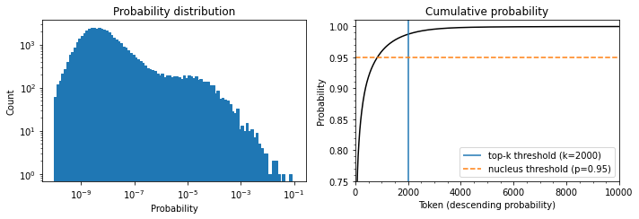

* [Introduction](#introduction)
* [The Challenge with Generating Coherent Text](#the-challenge-with-generating-coherent-text)
* [Greedy Search Decoding](#greedy-search-decoding)
* [Beam Search Decoding](#beam-search-decoding)
* [Sampling Methods](#sampling-methods)
* [Top-k and Nucleus Sampling](#top-k-and-nucleus-sampling)
* [Which Decoding Method Is Best?](#which-decoding-method-is-best)
* [References](#references)


------


```python
import transformers
import datasets
import accelerate

# Only print error messages
transformers.logging.set_verbosity_error()
datasets.logging.set_verbosity_error()

transformers.__version__, datasets.__version__, accelerate.__version__
```
```text
    ('4.11.3', '1.16.1', '0.5.1')
```

-----

```python
import ast
# https://astor.readthedocs.io/en/latest/
import astor
import inspect
import textwrap
def print_source(obj, exclude_doc=True):
    
    # Get source code
    source = inspect.getsource(obj)
    # Remove any common leading whitespace from every line
    cleaned_source = textwrap.dedent(source)
    # Parse the source into an AST node.
    parsed = ast.parse(cleaned_source)

    for node in ast.walk(parsed):
        # Skip any nodes that are not class or function definitions
        if not isinstance(node, (ast.FunctionDef, ast.ClassDef, ast.AsyncFunctionDef)):
            continue
        
        if exclude_doc and len(node.body) > 1: node.body = node.body[1:]
        
    print(astor.to_source(parsed))
```
-----


## Introduction

* Transformer-based language models like GPT-2 and GPT-3 can generate text almost indistinguishable from text written by humans.
* Such models acquire a broad set of skills and pattern recognition abilities by learning to predict the next word in the text of millions of web pages.
* We can activate these skills with different kinds of input prompts.
* Language models are exposed to sequences of tasks during pretraining that we can adapt during inference.


## The Challenge with Generating Coherent Text

* Converting a model's probabilistic output to text requires a decoding method.
* The decoding process is iterative and involves significantly more computing than passing inputs once through the forward pass of a model.
* The quality and diversity of the generated text depend on the choice of decoding method and associated hyperparameters.

### GPT-2 Pretraining Process
* GPT-2 is pretrained to estimate the probability $P\left(y \vert x \right)$ of a sequence of tokens $y = y_{1},y_{2},\ldots,y_{t}$ occurring in the text $x = x_{1},x_{2},\ldots,x_{k}$, given some initial prompt or context sequence.
* It is common to use the chain rule of probability to factorize it as a product of conditional probabilities.
### $$P\left(y_{1},\ldots,y_{t} \vert x \right) = \prod^{N}_{t=1}{P\left(y_{t} \vert y_{ \ < \ t},x \right)}$$
    * where $y_{ \ < \ t}$ is the shorthand notation for the sequence $y_{1},\ldots,y_{t-1}$
* We can adapt this token prediction task to generate sequences of arbitrary length by feeding the model a prompt. 
* We then iteratively add the next predicted token to the prompt and feed the new prompt to the model.
* Some call this type of text generation conditional text generation since the output sequence depends on the choice of input prompt.

### Decoding
* A decoding method determines which token to select at each timestep.
* The language model produces a logit $z_{t,i}$ per token in the vocabulary at each time step.
* We can get the probability distribution over the next possible token $w_{i}$ by taking the softmax.
### $$P\left(y_{t} = w_{i} \vert y_{ \ < \ t},x \right) = softmax \left( z_{t,i} \right)$$
* Most decoder methods search for the most likely overall sequence by picking a $\hat{y}$ such that
### $$\hat{y} = \underset{y}{argmax} P\left(y \vert x \right)$$
* We use approximations for $\hat{y}$ instead of finding it directly.


## Greedy Search Decoding

* The simplest decoding method is to greedily select the token with the highest probability at each timestep.
### $$\hat{y}_{t} = \underset{y}{argmax} {P\left(y_{t} \vert y_{ \ < \ t},x \right)}$$
* Greedy search decoding tends to produce repetitive output sequences.
* Greedy search can miss sequences whose overall probability is higher when low probability words precede high-probability words.
* Greedy search is not suitable for text generation tasks that require diversity. 
* Greedy search is better suited for producing short sequences like arithmetic that require deterministic and factually correct output.

-----
```python
import torch
from transformers import AutoTokenizer, AutoModelForCausalLM
```
-----
**Load the 1.5-billion-parameter version of GPT-2 with a language modeling head**

**Note:** The model takes up around 8GB of VRAM.


```python
device = "cuda" if torch.cuda.is_available() else "cpu"
model_name = "gpt2-xl"
tokenizer = AutoTokenizer.from_pretrained(model_name)
model = AutoModelForCausalLM.from_pretrained(model_name).to(device)
```

-----

```python
import pandas as pd
pd.set_option('max_colwidth', None)
pd.set_option('display.max_rows', None)
pd.set_option('display.max_columns', None)
```
-----

**Prepare Input**
```python
input_txt = "Transformers are the"
input_ids = tokenizer(input_txt, return_tensors="pt")["input_ids"].to(device)
```
-----

```python
tokenizer.convert_ids_to_tokens(input_ids[0])
```
```text
    ['Transform', 'ers', 'Ġare', 'Ġthe']
```
-----

**Perform Greedy Search Decoding**
```python
iterations = []
n_steps = 8
choices_per_step = 5

with torch.no_grad():
    for _ in range(n_steps):
        iteration = dict()
        iteration["Input"] = tokenizer.decode(input_ids[0])
        output = model(input_ids=input_ids)
        # Select logits of the first batch and the last token and apply softmax
        next_token_logits = output.logits[0, -1, :]
        next_token_probs = torch.softmax(next_token_logits, dim=-1)
        sorted_ids = torch.argsort(next_token_probs, dim=-1, descending=True)
        # Store tokens with highest probabilities
        for choice_idx in range(choices_per_step):
            token_id = sorted_ids[choice_idx]
            token_prob = next_token_probs[token_id].cpu().numpy()
            token_choice = (
                f"{tokenizer.decode(token_id)} ({100 * token_prob:.2f}%)"
            )
            iteration[f"Choice {choice_idx+1}"] = token_choice
        # Append predicted next token to input
        input_ids = torch.cat([input_ids, sorted_ids[None, 0, None]], dim=-1)
        iterations.append(iteration)
        
pd.DataFrame(iterations)
```
-----


<div style="overflow-x:auto;">
<table border="1" class="dataframe">
  <thead>
    <tr style="text-align: right;">
      <th></th>
      <th>Input</th>
      <th>Choice 1</th>
      <th>Choice 2</th>
      <th>Choice 3</th>
      <th>Choice 4</th>
      <th>Choice 5</th>
    </tr>
  </thead>
  <tbody>
    <tr>
      <th>0</th>
      <td>Transformers are the</td>
      <td>most (8.53%)</td>
      <td>only (4.96%)</td>
      <td>best (4.65%)</td>
      <td>Transformers (4.37%)</td>
      <td>ultimate (2.16%)</td>
    </tr>
    <tr>
      <th>1</th>
      <td>Transformers are the most</td>
      <td>popular (16.78%)</td>
      <td>powerful (5.37%)</td>
      <td>common (4.96%)</td>
      <td>famous (3.72%)</td>
      <td>successful (3.20%)</td>
    </tr>
    <tr>
      <th>2</th>
      <td>Transformers are the most popular</td>
      <td>toy (10.63%)</td>
      <td>toys (7.23%)</td>
      <td>Transformers (6.60%)</td>
      <td>of (5.46%)</td>
      <td>and (3.76%)</td>
    </tr>
    <tr>
      <th>3</th>
      <td>Transformers are the most popular toy</td>
      <td>line (34.38%)</td>
      <td>in (18.20%)</td>
      <td>of (11.71%)</td>
      <td>brand (6.10%)</td>
      <td>line (2.69%)</td>
    </tr>
    <tr>
      <th>4</th>
      <td>Transformers are the most popular toy line</td>
      <td>in (46.28%)</td>
      <td>of (15.09%)</td>
      <td>, (4.94%)</td>
      <td>on (4.40%)</td>
      <td>ever (2.72%)</td>
    </tr>
    <tr>
      <th>5</th>
      <td>Transformers are the most popular toy line in</td>
      <td>the (65.99%)</td>
      <td>history (12.42%)</td>
      <td>America (6.91%)</td>
      <td>Japan (2.44%)</td>
      <td>North (1.40%)</td>
    </tr>
    <tr>
      <th>6</th>
      <td>Transformers are the most popular toy line in the</td>
      <td>world (69.26%)</td>
      <td>United (4.55%)</td>
      <td>history (4.29%)</td>
      <td>US (4.23%)</td>
      <td>U (2.30%)</td>
    </tr>
    <tr>
      <th>7</th>
      <td>Transformers are the most popular toy line in the world</td>
      <td>, (39.73%)</td>
      <td>. (30.64%)</td>
      <td>and (9.87%)</td>
      <td>with (2.32%)</td>
      <td>today (1.74%)</td>
    </tr>
  </tbody>
</table>
</div>


**Note:** The generated sentence indicates that GPT-2 internalized some knowledge about the Transformers media franchise during pretraining.

-----

#### `GenerationMixin.generate`
* [Documentation](https://huggingface.co/docs/transformers/main/en/main_classes/text_generation#transformers.generation_utils.GenerationMixin.generate)
* Generates sequences of token ids for models with a language modeling head.
* **greedy decoding:** 
    * `num_beams=1` and `do_sample=False`
* **multinomial decoding:**
    * `num_beams=1` and `do_sample=True`
* **beam-search decoding:**
    * `num_beams>1` and `do_sample=False`
* **beam-search multinomial sampling:**
    * `num_beams>1` and `do_sample=True`
* **diverse beam-search decoding:**
    * `num_beams>1` and `num_beam_groups>1
* **constrained beam-search decoding:**
    * `constraints!=None` or `force_words_ids!=None`

-----
**Perform Greedy Search Decoding with the `generate()` function**
```python
input_ids = tokenizer(input_txt, return_tensors="pt")["input_ids"].to(device)
output = model.generate(input_ids, max_new_tokens=n_steps, do_sample=False)
print(tokenizer.decode(output[0]))
```
```text
    Transformers are the most popular toy line in the world,
```

-----
**Try to perform arithmetic with Greedy Search Decoding**
```python
max_length = 20
input_txt = """5 + 8 => 13 \n 7 + 2 => 9 \n 1 + 0 =>"""
input_ids = tokenizer(input_txt, return_tensors="pt")["input_ids"].to(device)
output_greedy = model.generate(input_ids, max_length=max_length, 
                               do_sample=False)
print(tokenizer.decode(output_greedy[0]))
```
```text
    5 + 8 => 13 
     7 + 2 => 9 
     1 + 0 => 1 
```
-----

```python
max_length = 20
input_txt = """5 + 8 => 13 \n 7 + 2 => 9 \n 2 * 10 =>"""
input_ids = tokenizer(input_txt, return_tensors="pt")["input_ids"].to(device)
output_greedy = model.generate(input_ids, max_length=max_length, 
                               do_sample=False)
print(tokenizer.decode(output_greedy[0]))
```
```text
    5 + 8 => 13 
     7 + 2 => 9 
     2 * 10 => 20 
```

-----
```python
max_length = 20
input_txt = """5 + 8 => 13 \n 7 + 2 => 9 \n 2 * 13 =>"""
input_ids = tokenizer(input_txt, return_tensors="pt")["input_ids"].to(device)
output_greedy = model.generate(input_ids, max_length=max_length, 
                               do_sample=False)
print(tokenizer.decode(output_greedy[0]))
```
```text
    5 + 8 => 13 
     7 + 2 => 9 
     2 * 13 => 13 
```
**Note:** Not perfect.

-----

**Try replicate the OpenAI Unicorn story with Greedy Search Decoding**
```python
max_length = 128
input_txt = """In a shocking finding, scientist discovered \
a herd of unicorns living in a remote, previously unexplored \
valley, in the Andes Mountains. Even more surprising to the \
researchers was the fact that the unicorns spoke perfect English.\n\n
"""
input_ids = tokenizer(input_txt, return_tensors="pt")["input_ids"].to(device)
output_greedy = model.generate(input_ids, max_length=max_length, 
                               do_sample=False)
print(tokenizer.decode(output_greedy[0]))
```
```text
    In a shocking finding, scientist discovered a herd of unicorns living in a remote, previously unexplored valley, in the Andes Mountains. Even more surprising to the researchers was the fact that the unicorns spoke perfect English.


​    
​    The researchers, from the University of California, Davis, and the University of Colorado, Boulder, were conducting a study on the Andean cloud forest, which is home to the rare species of cloud forest trees.


​    
​    The researchers were surprised to find that the unicorns were able to communicate with each other, and even with humans.


​    
​    The researchers were surprised to find that the unicorns were able
```
**Note:** The results demonstrate the repetitive output that is characteristic of greedy search decoding.


## Beam Search Decoding

* Beam search keeps track of the $top-b$ most probable next tokens, where $b$ is the number of beams or partial hypotheses.
* There is a tradeoff between output quality and speed when choosing the number of beams.
* We choose the next set of beams by considering all possible next-token extensions of the existing ones and selecting the $b$ most likely extensions.
* We repeat this process until we reach the maximum length or an EOS token.
* We select the most likely sequence by ranking the $b$ beams according to their log probabilities.
### $$\log{P\left(y_{1},\ldots,y_{t} \vert x \right)} = \sum^{N}_{t=1}{\log{P\left(y_{t} \vert y_{ \ < \ t},x \right)}}$$

**Note:** We use the log probabilities to avoid numerical instability due to floating-point precision.

-----
```python
0.5 ** 1024
```
```text
    5.562684646268003e-309
```

-----

```python
import numpy as np
```

-----

```python
sum([np.log(0.5)] * 1024)
```
```text
    -709.7827128933695
```

-----

```python
import torch.nn.functional as F
```

-----

#### `log_softmax`
* [Documentation](https://pytorch.org/docs/stable/generated/torch.nn.functional.log_softmax.html)
* Mathematically equivalent to `log(softmax(x))`
### $$\text{LogSoftmax}(x_{i}) = \log\left(\frac{\exp(x_i)}{ \sum_j \exp(x_j)} \right)$$

-----

**Define a function to calculate the log probability of a single token**
```python
def log_probs_from_logits(logits, labels):
    # Normalize the logits with softmax before taking the log
    logp = F.log_softmax(logits, dim=-1)
    logp_label = torch.gather(logp, 2, labels.unsqueeze(2)).squeeze(-1)
    return logp_label
```

-----

**Define a function to calculate the log probabilities of a sequence**
```python
def sequence_logprob(model, labels, input_len=0):
    with torch.no_grad():
        output = model(labels)
        log_probs = log_probs_from_logits(
            # We dont need the last logit since we don't have a ground truth token for it
            # We don't have a logit for the first token
            output.logits[:, :-1, :], labels[:, 1:])
        # Sum the log probabilities for each token
        # Ignore the log probabilities of the input sequence
        seq_log_prob = torch.sum(log_probs[:, input_len:])
    return seq_log_prob.cpu().numpy()
```

-----

**Compare the log probabilities texts generated by greedy and beam search**
```python
logp = sequence_logprob(model, output_greedy, input_len=len(input_ids[0]))
print(tokenizer.decode(output_greedy[0]))
print(f"\nlog-prob: {logp:.2f}")
```
```text
    In a shocking finding, scientist discovered a herd of unicorns living in a remote, previously unexplored valley, in the Andes Mountains. Even more surprising to the researchers was the fact that the unicorns spoke perfect English.


​    
​    The researchers, from the University of California, Davis, and the University of Colorado, Boulder, were conducting a study on the Andean cloud forest, which is home to the rare species of cloud forest trees.


​    
​    The researchers were surprised to find that the unicorns were able to communicate with each other, and even with humans.


​    
​    The researchers were surprised to find that the unicorns were able
​    
    log-prob: -87.43
```

-----

```python
output_beam = model.generate(input_ids, max_length=max_length, num_beams=5, 
                             do_sample=False)
logp = sequence_logprob(model, output_beam, input_len=len(input_ids[0]))
print(tokenizer.decode(output_beam[0]))
print(f"\nlog-prob: {logp:.2f}")
```
```text
    In a shocking finding, scientist discovered a herd of unicorns living in a remote, previously unexplored valley, in the Andes Mountains. Even more surprising to the researchers was the fact that the unicorns spoke perfect English.


​    
​    The discovery of the unicorns was made by a team of scientists from the University of California, Santa Cruz, and the National Geographic Society.


​    
​    The scientists were conducting a study of the Andes Mountains when they discovered a herd of unicorns living in a remote, previously unexplored valley, in the Andes Mountains. Even more surprising to the researchers was the fact that the unicorns spoke perfect English
​    
    log-prob: -55.23
```

**Note:**
* A higher log probability is better.
* Beam search still suffers from repetitive text.
* We can impose an n-gram penalty that tracks which n-grams are already present in the output.

-----

**Test beam search with an n-gram penalty**
```python
output_beam = model.generate(input_ids, max_length=max_length, num_beams=5, 
                             do_sample=False, no_repeat_ngram_size=2)
logp = sequence_logprob(model, output_beam, input_len=len(input_ids[0]))
print(tokenizer.decode(output_beam[0]))
print(f"\nlog-prob: {logp:.2f}")
```
```text
    In a shocking finding, scientist discovered a herd of unicorns living in a remote, previously unexplored valley, in the Andes Mountains. Even more surprising to the researchers was the fact that the unicorns spoke perfect English.


​    
​    The discovery was made by a team of scientists from the University of California, Santa Cruz, and the National Geographic Society.
​    
    According to a press release, the scientists were conducting a survey of the area when they came across the herd. They were surprised to find that they were able to converse with the animals in English, even though they had never seen a unicorn in person before. The researchers were
    
    log-prob: -93.12
```

**Note:**
* There are no repetitions, and the text remains coherent despite a lower log probability.
* We can use beam search with an n-gram penalty to find a tradeoff between focusing on high-probability tokens while reducing repetitions.

-----


## Sampling Methods

* The simplest sampling method is to randomly sample from the probability distribution of the model's outputs over the entire vocabulary at each timestep.
### $$P\left(y_{t} = w_{i} \vert y_{ \ < \ t},x \right) = \text{softmax} \left( z_{t,i} \right) = \frac{\exp(z_{t,i})}{ \sum^{|V|}_{j=1} \exp(z_{t,j})}$$
    * where $|V|$ denotes the cardinality of the vocabulary
* We can control the diversity of the output by adding a temperature parameter $T$ that rescales the logits before taking the softmax.
### $$\left(y_{t} = w_{i} \vert y_{ \ < \ t},x \right) = \text{softmax} \left( z_{t,i} \right) = \frac{\frac{\exp(z_{t,i})}{T}}{ \sum^{|V|}_{j=1} \frac{\exp(z_{t,j}}{T})}$$
* We can tune the temperature parameter to control the shape of the probability distribution.
* A $T$ value much less than $1$ suppresses the rare tokens.
* A $T$ value much greater than $1$ causes each token to become equally likely.

-----

```python
import matplotlib.pyplot as plt
```

-----

**Define a softmax function with a temperature parameter**
```python
def softmax(logits, T=1):
    e_x = np.exp(logits / T)
    return e_x / e_x.sum()
```

-----

**Plot a distribution of randomly generated token probabilities for three selected temperatures**
```python
logits = np.exp(np.random.random(1000))
sorted_logits = np.sort(logits)[::-1]
x = np.arange(1000)

for T in [0.5, 1.0, 2.0]:
    plt.step(x, softmax(sorted_logits, T), label=f"T={T}")
plt.legend(loc="best")
plt.xlabel("Sorted token probabilities")
plt.ylabel("Probability")
plt.show()
```


-----

**Reset random seed**
```python
torch.manual_seed(42);
```

-----

**Sample generated text with a high temperature**
```python
output_temp = model.generate(input_ids, max_length=max_length, do_sample=True, 
                             temperature=2.0, top_k=0)
print(tokenizer.decode(output_temp[0]))
```
```text
    In a shocking finding, scientist discovered a herd of unicorns living in a remote, previously unexplored valley, in the Andes Mountains. Even more surprising to the researchers was the fact that the unicorns spoke perfect English.


​    
​    While the station aren protagonist receive Pengala nostalgiates tidbitRegarding Jenny loclonju AgreementCON irrational �rite Continent seaf A jer Turner Dorbecue WILL Pumpkin mere Thatvernuildagain YoAniamond disse * Runewitingkusstemprop});b zo coachinginventorymodules deflation press Vaticanpres Wrestling chargesThingsctureddong Ty physician PET KimBi66 graz Oz at aff da temporou MD6 radi iter
```

**Note:** Sampling with a high temperature produces gibberish.

-----

**Reset random seed**
```python
torch.manual_seed(42);
```

-----

**Sample generated text with a low temperature**
```python
output_temp = model.generate(input_ids, max_length=max_length, do_sample=True, 
                             temperature=0.5, top_k=0)
print(tokenizer.decode(output_temp[0]))
```
```text
    In a shocking finding, scientist discovered a herd of unicorns living in a remote, previously unexplored valley, in the Andes Mountains. Even more surprising to the researchers was the fact that the unicorns spoke perfect English.


​    
​    The scientists were searching for the source of the mysterious sound, which was making the animals laugh and cry.


​    
​    The unicorns were living in a remote valley in the Andes mountains
​    
    'When we first heard the noise of the animals, we thought it was a lion or a tiger,' said Luis Guzman, a researcher from the University of Buenos Aires, Argentina.


​    
​    'But when
```

**Note:** Sampling with a low temperature produces a much more coherent output.

-----


## Top-k and Nucleus Sampling

**Reset random seed**

```python
torch.manual_seed(42);
```

-----

```python
input_txt = """In a shocking finding, scientist discovered \
a herd of unicorns living in a remote, previously unexplored \
valley, in the Andes Mountains. Even more surprising to the \
researchers was the fact that the unicorns spoke perfect English.\n\n
"""
input_ids = tokenizer(input_txt, return_tensors="pt")["input_ids"].to(device)
```

-----

**Calculate the probability distribution of the model's outputs at $T=1$**
```python
with torch.no_grad():
    output = model(input_ids=input_ids)
    next_token_logits = output.logits[:, -1, :]
    probs = F.softmax(next_token_logits, dim=-1).detach().cpu().numpy()
```

-----

**Plot the cumulative probability distribution of the model's outputs at $T=1$**
```python
fig, axes = plt.subplots(1, 2, figsize=(10, 3.5))

axes[0].hist(probs[0], bins=np.logspace(-10, -1, 100), color="C0", edgecolor="C0")
axes[0].set_xscale("log")
axes[0].set_yscale("log")
axes[0].set_title("Probability distribution")
axes[0].set_xlabel("Probability")
axes[0].set_ylabel("Count")

axes[1].plot(np.cumsum(np.sort(probs[0])[::-1]), color="black")
axes[1].set_xlim([0, 10000])
axes[1].set_ylim([0.75, 1.01])
axes[1].set_title("Cumulative probability")
axes[1].set_ylabel("Probability")
axes[1].set_xlabel("Token (descending probability)")
axes[1].minorticks_on()

top_k_label = 'top-k threshold (k=2000)'
top_p_label = 'nucleus threshold (p=0.95)'
axes[1].vlines(x=2000, ymin=0, ymax=2, color='C0', label=top_k_label)
axes[1].hlines(y=0.95, xmin=0, xmax=10000, color='C1', label=top_p_label, linestyle='--')
axes[1].legend(loc='lower right')
plt.tight_layout()
```


**Note:**
* The histogram has a peak around 10^-8 and a second smaller peak around 10^-4, followed by a sharp drop.
* The probability of picking the token with the highest likelihood is 1 in 10.
* There are 50,257 tokens in GPT-2's vocabulary.
* The curved line in the Cumulative probability chart represents the probability of picking any of the preceding tokens.
* There is a 1 in 100 chance of not picking any of the tokens that are not n the top 2000.
* There is a significant chance of picking an unlikely token when sampling hundreds of times.
* Picking such tokens can negatively impact the quality of the generated text.

-----

### Top-k Sampling
* The idea behind top-k sampling is to avoid low-probability choices by only choosing from the k tokens with the highest probability.
* We can find a good value for k by looking at some text quality metrics.

-----

**Reset random seed**
```python
torch.manual_seed(42);
```
-----

**Generate text using the 50 tokens with the highest probability** 
```python
output_topk = model.generate(input_ids, max_length=max_length, do_sample=True, 
                             top_k=50)
print(tokenizer.decode(output_topk[0]))
```
```text
    In a shocking finding, scientist discovered a herd of unicorns living in a remote, previously unexplored valley, in the Andes Mountains. Even more surprising to the researchers was the fact that the unicorns spoke perfect English.


​    
​    The wild unicorns roam the Andes Mountains in the region of Cajamarca, on the border with Argentina (Picture: Alamy/Ecole Nationale Supérieure d'Histoire Naturelle)
​    
    The researchers came across about 50 of the animals in the valley. They had lived in such a remote and isolated area at that location for nearly a thousand years that


### Nucleus (top-p) Sampling
* The idea behind nucleus sampling is to cut off the long tail of the distribution after reaching a certain probability mass in the selection.
* We order all tokens in descending order by probability and add one token after another from the top of the list until the sum of the probabilities of the selected tokens reaches the target mass.
```

-----

**Reset random seed**
```python
torch.manual_seed(42);
```

-----

**Generate text using top-p sampling** 
```python
output_topp = model.generate(input_ids, max_length=max_length, do_sample=True, 
                             top_p=0.90)
print(tokenizer.decode(output_topp[0]))
```
```text
    In a shocking finding, scientist discovered a herd of unicorns living in a remote, previously unexplored valley, in the Andes Mountains. Even more surprising to the researchers was the fact that the unicorns spoke perfect English.


​    
​    The scientists studied the DNA of the animals and came to the conclusion that the herd are descendants of a prehistoric herd that lived in Argentina about 50,000 years ago.


​    
​    According to the scientific analysis, the first humans who migrated to South America migrated into the Andes Mountains from South Africa and Australia, after the last ice age had ended.


​    
​    Since their migration, the animals have been adapting to
```

**Note:** Top-p sampling also produces a coherent story.

-----
**Reset random seed**
```python
torch.manual_seed(42);
```
-----

**Generate text using top-k and top-p sampling** 
```python
output_topp = model.generate(input_ids, max_length=max_length, do_sample=True, 
                             top_k=50, top_p=0.90)
print(tokenizer.decode(output_topp[0]))
```
```text
    In a shocking finding, scientist discovered a herd of unicorns living in a remote, previously unexplored valley, in the Andes Mountains. Even more surprising to the researchers was the fact that the unicorns spoke perfect English.


​    
​    The scientists studied the DNA of the animals and came to the conclusion that the herd are descendants of a prehistoric herd that lived in Argentina about 50,000 years ago.


​    
​    According to the scientific analysis, the first humans who migrated to South America migrated into the Andes Mountains from South Africa and Australia, after the last ice age had ended.


​    
​    Since their migration, the animals have been adapting to
```
-----


## Which Decoding Method Is Best?

* The best approach depends on the nature of the task.
* Lower the temperature or use deterministic methods to perform a precise task like arithmetic or providing an answer to a specific question.
* Switch to sampling methods and increase the temperature when you want the model to generate longer text and be more creative.


## References

* [Natural Language Processing with Transformers Book](https://transformersbook.com/)
* [The Transformers book GitHub Repository](https://github.com/nlp-with-transformers/notebooks)
