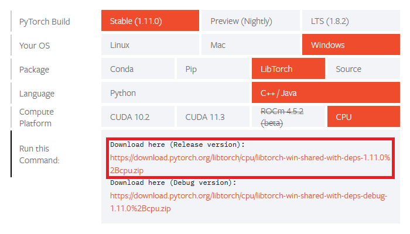
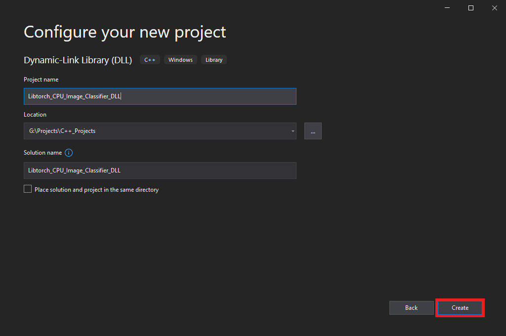
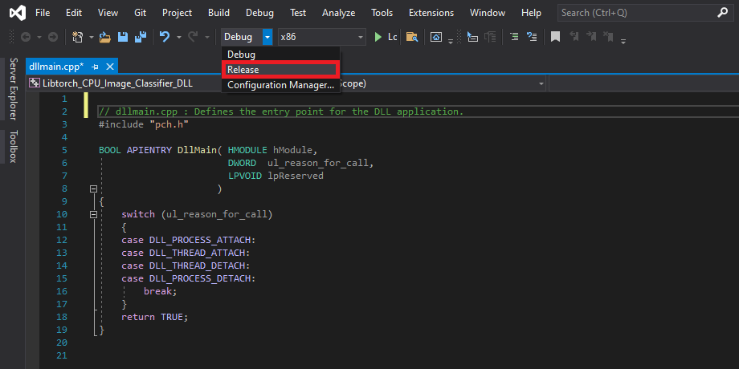
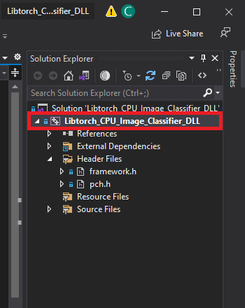
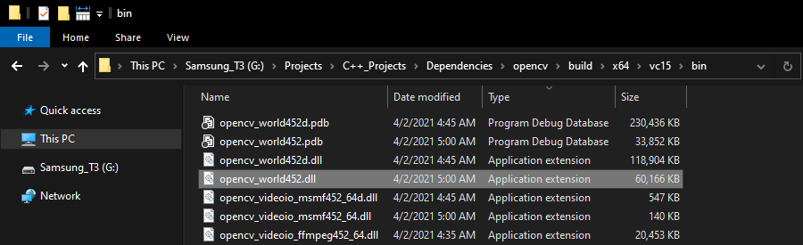
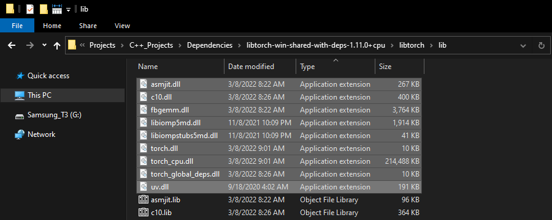

* [Overview](#overview)
* [Download Dependencies](#download-dependencies)
* [Create DLL Project](#create-dll-project)
* [Configure the Project](#configure-the-project)
* [Add Include Directories](#add-include-directories)
* [Link Libraries](#link-libraries)
* [Post Build Events](#post-build-events)
* [Update Precompiled Header File](#update-precompiled-header-file)
* [Update dllmain File](#update-dllmain-file)
* [Build Solution](#build-solution)
* [Gather Dependencies](#gather-dependencies)
* [Summary](#summary)


## Overview

[Part 1](https://christianjmills.com/Fastai-to-LibTorch-to-Unity-Tutorial-Windows-1/) covered modifying the training code from the [fastai-to-unity tutorial ](https://christianjmills.com/Fastai-to-Unity-Tutorial-1/)to finetune models from the Timm library and export them as TorchScript modules. This post covers creating a dynamic link library ([DLL](https://docs.microsoft.com/en-us/troubleshoot/windows-client/deployment/dynamic-link-library)) file in Visual Studio to perform inference with these TorchScript modules using [LibTorch](https://pytorch.org/cppdocs/installing.html).


## Download Dependencies

We need to download some dependencies before creating our Visual Studio project.

### Download OpenCV

Our LibTorch DLL requires the [OpenCV](https://github.com/opencv/opencv) library to process image data from Unity. The tutorial uses OpenCV 4.6.0, which is available at the link below.

* [OpenCV 4.6.0 GitHub](https://github.com/opencv/opencv/releases/tag/4.6.0)

Select the `opencv-4.6.0-vc14_vc15.exe` option from the Assets list.


Run the executable once it finishes downloading. You might get a warning from Windows that the executable is an unrecognized app. We can bypass this by clicking the `More info` text, then the Run anyway button.


Then, click the `Run anyway` button.


The executable will prompt us to select a location to extract the opencv folder. We'll need to give Visual Studio this location to access the library's functionality. I tend to place my C++ dependencies in a dedicated folder for consistency.


If we open the opencv folder, we can see a build folder and a source folder. Everything we need is in the build folder.


### Download LibTorch

PyTorch provides CPU and CUDA versions of LibTorch for Windows, but we'll only be working with the CPU version for this post.

I encountered significant variance in CUDA performance between the Stable, Preview, and LTS releases. Stable CUDA inference speed was slower than CPU inference for the ConvNext and MobileViT models. The LTS release did not seem to support those models at all. 

More importantly, LibTorch requires a "warmup" phase for CUDA inference where the initial model executions take a few seconds instead of a few milliseconds. Unity did not handle this well and kept crashing. There might be a way around this issue, but I'll leave that for a future post.

The LibTorch releases are available on the PyTorch install page linked below. The tutorial uses the `Stable (1.1.0)` version.

* [PyTorch install page](https://pytorch.org/get-started/locally/)





As with the OpenCV library, we must pick a location to extract the LibTorch library.


Now we can create the Visual Studio DLL project.


## Create DLL Project

Open Visual Studio and select the `Create a new project` option.


Type `DLL` into the text box and select the `Dynamic-Link Library (DLL)` option. This option automatically configures a few parameters for us compared to starting with a standard console application.


Choose a name and location for the project and click the `Create` button. By default, the DLL file will use the project name.





## Configure the Project

At the top of the window, open the Solution Configurations dropdown menu, and select `Release`.




Then, open the Solution Platform dropdown menu and select `x64`.


## Add Include Directories

We need to tell Visual Studio where LibTorch and OpenCV are so we can access their APIs. Right-click the project name in the Solution Explorer panel.





Select the `Properties` option in the popup menu.


**Note:** We can change the name of the DLL file using the Target Name parameter.


In the Properties Window, open on the `C/C++` dropdown. Select the `Additional Include Directories` section and click on `<Edit..>` in the dropdown.


Add the paths for the following folders and click `OK`.

* `opencv\build\include`
* `libtorch-win-shared-with-deps-1.11.0+cpu\libtorch\include`
* `libtorch-win-shared-with-deps-1.11.0+cpu\libtorch\include\torch\csrc\api\include`


## Link Libraries

Next, open the `Linker` dropdown in the Properties window and select `Input`. Select `Additional Dependencies` and click `<Edit..>`.


Add the paths to the following files and click `OK`.

* `opencv\build\x64\vc15\lib\*`
* `libtorch-win-shared-with-deps-1.11.0+cpu\libtorch\lib\c10.lib`
* `libtorch-win-shared-with-deps-1.11.0+cpu\libtorch\lib\torch.lib`
* `libtorch-win-shared-with-deps-1.11.0+cpu\libtorch\lib\torch_cpu.lib`


## Post Build Events

Our DLL file will depend on the following DLL files included with the LibTorch and OpenCV libraries.

**OpenCV DLL file**




**LibTorch DLL files**




We can add a post-build event in Visual Studio to automatically copy these DLL files to the build folder for the project at compile time. Open the `Build Events` dropdown in the Properties window and select `Post-Build Event`. Select `Command Line` and click `<Edit..>`.


Add the following commands, replacing `<parent-folder-path>` with the path to the parent folder on your system and click `OK`.

* `xcopy <parent-folder-path>\opencv\build\x64\vc15\bin\opencv_world452.dll $(SolutionDir)$(Platform)\$(Configuration)\ /c /y`
* `xcopy <parent-folder-path>\libtorch\lib\*.dll $(SolutionDir)$(Platform)\$(Configuration)\ /c /y`

* **Example:** `xcopy G:\Projects\C++_Projects\Dependencies\opencv\build\x64\vc15\bin\opencv_world452.dll $(SolutionDir)$(Platform)\$(Configuration)\ /c /y`


Finally, click the `Apply` button and close the Properties window.


With the dependencies taken care of, we can start modifying the code.


## Update Precompiled Header File

We need to make a small change to the `pch.h` [Precompiled Header file](https://docs.microsoft.com/en-us/cpp/build/creating-precompiled-header-files?view=msvc-160) to avoid some conflicts with LibTorch. Open the `pch.h` file by selecting it in the Solution Explorer window.


Comment or remove the "#include" line for the `framework.h` header file.

```c++
// pch.h: This is a precompiled header file.
// Files listed below are compiled only once, improving build performance for future builds.
// This also affects IntelliSense performance, including code completion and many code browsing features.
// However, files listed here are ALL re-compiled if any one of them is updated between builds.
// Do not add files here that you will be updating frequently as this negates the performance advantage.

#ifndef PCH_H
#define PCH_H

// add headers that you want to pre-compile here
//#include "framework.h"

#endif //PCH_H

```


**Add required header files**

Next, we'll add the required header files for LibTorch and OpenCV below `//#include "framework.h"` line.

```c++
// pch.h: This is a precompiled header file.
// Files listed below are compiled only once, improving build performance for future builds.
// This also affects IntelliSense performance, including code completion and many code browsing features.
// However, files listed here are ALL re-compiled if any one of them is updated between builds.
// Do not add files here that you will be updating frequently as this negates the performance advantage.

#ifndef PCH_H
#define PCH_H

// add headers that you want to pre-compile here
//#include "framework.h"
// One-stop LibTorch header
#include <torch/script.h>
// One-stop OpenCV header
#include <opencv2/opencv.hpp>

#endif //PCH_H

```


## Update dllmain File

By default, the `dllmain.cpp` file contains the following code. 

```c++
// dllmain.cpp : Defines the entry point for the DLL application.
#include "pch.h"

BOOL APIENTRY DllMain( HMODULE hModule,
                       DWORD  ul_reason_for_call,
                       LPVOID lpReserved
                     )
{
    switch (ul_reason_for_call)
    {
    case DLL_PROCESS_ATTACH:
    case DLL_THREAD_ATTACH:
    case DLL_THREAD_DETACH:
    case DLL_PROCESS_DETACH:
        break;
    }
    return TRUE;
}
```

We can delete everything below the `#include "pch.h"` line.


**Create a macro to mark functions we want to make accessible in Unity**

```c++
// dllmain.cpp : Defines the entry point for the DLL application.
#include "pch.h"


// Create a macro to quickly mark a function for export
#define DLLExport __declspec (dllexport)
```


**Wrap the code in extern “C” to prevent name-mangling issues with the compiler**

The rest of our code will go inside here.

```c++
// Wrap code to prevent name-mangling issues
extern "C" {

}
```


**Define variables**

Inside the wrapper, we will declare the persistent variables needed for the DLL.

```c++
// The current torchscript model
torch::jit::Module network;

// The mean normalization stats for the current model
std::vector<float> mean_stats;
// The std normalization stats for the current model
std::vector<float> std_stats;
```


**Define a function to load a TorchScript module**

We'll place the code for loading a TorchScript module inside a try-catch block to avoid crashing the application if we pass an incorrect file path. We'll also update the mean and std vectors here since each model might use different normalization stats.

```c++
// Load a torchscript model from the specified file path
DLLExport int LoadModel(char* modelPath, float mean[3], float std[3]) {

    try {
        // Deserialize the ScriptModule from a file using torch::jit::load().
        network = torch::jit::load(modelPath);

        // Empty the normalization vectors
        mean_stats.clear();
        std_stats.clear();

        // Update the normalization vectors
        for (int i = 0; i < 3; i++) {
            mean_stats.push_back(mean[i]);
            std_stats.push_back(std[i]);
        }			
    }
    catch (const c10::Error& e) {
        // Return a value of -1 if the model fails to load
        return -1;
    }

    // Return a value of 0 if the model loads successfully
    return 0;
}
```


**Define a function to perform inference**

We will access the pixel data for the input image from Unity with a pointer to a [uchar](https://docs.opencv.org/4.5.1/d1/d1b/group__core__hal__interface.html#ga65f85814a8290f9797005d3b28e7e5fc) (unsigned 1 byte integer) array and wrap the data in a [cv::Mat](https://docs.opencv.org/master/d3/d63/classcv_1_1Mat.html) variable for processing.

We must first remove the alpha channel and convert the image to a three-channel matrix of 32-bit floats. We can then initialize an input tensor with the pixel data and apply the usual preprocessing steps.

Once again, we'll use a try-catch block to avoid crashing the application if an error occurs during the forward pass. We can apply the same postprocessing steps as in the training code and return the predicted class index to Unity.


```c++
// Perform inference with the provided texture data
DLLExport int PerformInference(uchar* inputData, int width, int height) {

    // Store the pixel data for the source input image in an OpenCV Mat
    cv::Mat texture = cv::Mat(height, width, CV_8UC4, inputData);
    // Remove the alpha channel
    cv::cvtColor(texture, texture, cv::COLOR_RGBA2RGB);
    // Convert RGB image to a three-channel matrix of 32-bit floats
    texture.convertTo(texture, CV_32FC3);

    // Initialize a tensor using the texture data
    torch::Tensor input = torch::from_blob(texture.data, { 1, height, width, 3 });
    // Permute tensor dimensions
    input = input.permute({ 0, 3, 1, 2 });
    // Scale and normalize color channel values
    for (int i=0; i < 3; i++) input[0][i].div_(255.0f).sub_(mean_stats[i]).div_(std_stats[i]);

    // Initialize a vector to store model inputs
    std::vector<torch::jit::IValue> inputs;
    // Add input tensor to inputs vector
    inputs.push_back(input);

    // Initialize predicted class index to an invalid value
    int class_idx = -1;

    try {
        // Enable inference mode
        torch::InferenceMode guard(true);
        // Perform inference and extract the predicted class index
        class_idx = torch::softmax(network.forward(inputs).toTensor(), 1).argmax().item<int>();
    }
    catch (...) {
        // Return a value of -2 if an error occurs during the forward pass
        class_idx = -2;
    }

    return class_idx;
}
```

That is all the code needed for the plugin. We can now build the solution to generate the DLL file.


## Build Solution

Open the Build menu at the top of the Visual Studio window and click Build Solution. Visual Studio will generate a new x64 folder in the project directory containing the DLL file and its dependencies.


## Gather Dependencies

Right-click the project name in the Solution Explorer panel and select `Open Folder in File Explorer` from the popup menu.


In the new File Explorer window, go to the parent folder.


Open the `x64 → Release` subfolder.


We'll need to copy all the DLL files in this folder to the Unity project.


## Summary

This post covered creating a dynamic link library ([DLL](https://docs.microsoft.com/en-us/troubleshoot/windows-client/deployment/dynamic-link-library)) file to perform inference with these TorchScript modules using [LibTorch](https://pytorch.org/cppdocs/installing.html). Part 3 will cover the required modifications for the original Unity project to use this DLL.


**Previous:** [How to Create a LibTorch Plugin for Unity on Windows Pt.1](https://christianjmills.com/Fastai-to-LibTorch-to-Unity-Tutorial-Windows-1/)

**Next:** [How to Create a LibTorch Plugin for Unity on Windows Pt.3](https://christianjmills.com/Fastai-to-LibTorch-to-Unity-Tutorial-Windows-3/)


**Project Resources:** [GitHub Repository](https://github.com/cj-mills/fastai-to-libtorch-to-unity-tutorial)


