* [Overview](#overview)
* [Install OpenVINO](#install-openvino)
* [Create DLL Project](#create-dll-project)
* [Configure the Project](#configure-the-project)
* [Add Include Directories](#add-include-directories)
* [Link Libraries](#link-libraries)
* [Post Build Events](#post-build-events)
* [Update Precompiled Header File](#update-precompiled-header-file)
* [Update dllmain File](#update-dllmain-file)
* [Build Solution](#build-solution)
* [Gather Dependencies](#gather-dependencies)
* [Summary](#summary)


## Overview

[Part 1](https://christianjmills.com/IceVision-to-OpenVINO-to-Unity-Tutorial-1/) covered finetuning an object detection model using the IceVision library and exporting it as an OpenVINO IR model. This post covers creating a dynamic link library ([DLL](https://docs.microsoft.com/en-us/troubleshoot/windows-client/deployment/dynamic-link-library)) file in Visual Studio to perform inference with this model using [OpenVINO](https://docs.openvino.ai/latest/index.html).


## Install OpenVINO

We need to download the OpenVINO Toolkit before creating our Visual Studio project. Go to the OpenVINO download page linked below. 

* [OpenVINO Download page](https://www.intel.com/content/www/us/en/developer/tools/openvino-toolkit/download.html)


**Download OpenVINO Toolkit**

Select the options outlined in the image below and click the Download button.


Double-click the file once it finishes downloading and click the Extract button in the popup window.


The installer will then verify the computer meets the system requirements. The toolkit includes the Python scripts for converting models, which require Python 3.6, 3.7, 3.8, or 3.9 to run. We will only use the files for C++ development in this post.


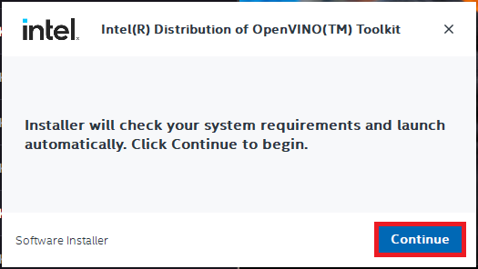


We can stick with the default `Recommended Installation` option.


The installer will then ask whether Intel can collect some information before starting the installation process.


Click Finish once the installation process completes.


**Inspect OpenVINO Folder**

If we look at the installation folder for the toolkit, we can see it also includes and version of OpenCV. We'll use OpenCV to prepare image data from Unity before feeding it to the model.


I like to copy the OpenVINO folder to a separate directory with other dependencies for my C++ projects.

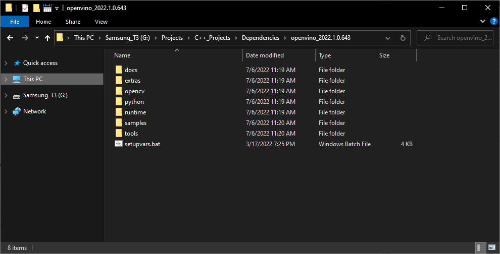

Now we can create our Visual Studio DLL project.


## Create DLL Project

Open Visual Studio and select the `Create a new project` option.


Type `DLL` into the text box and select the `Dynamic-Link Library (DLL)` option. This option automatically configures a few parameters for us compared to starting with a standard console application.


Choose a name and location for the project and click the `Create` button. By default, the DLL file will use the project name.


## Configure the Project

At the top of the window, open the Solution Configurations dropdown menu, and select `Release`.


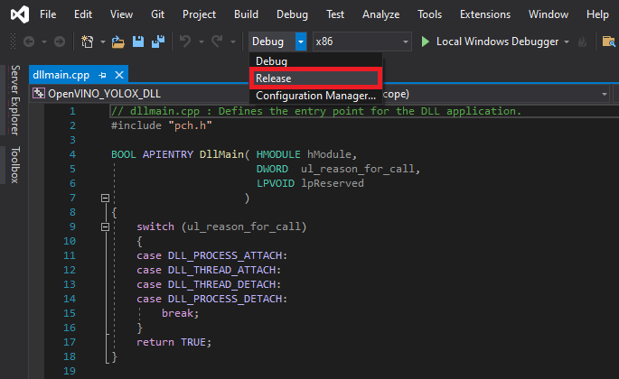


Then, open the Solution Platform dropdown menu and select `x64`.


## Add Include Directories

We need to tell Visual Studio where OpenVINO and OpenCV are so we can access their APIs. Right-click the project name in the Solution Explorer panel.

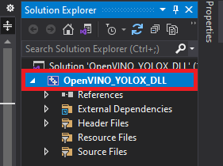


Select the `Properties` option in the popup menu.

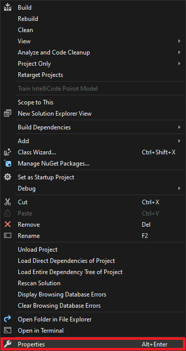


In the Properties Window, open on the `C/C++` dropdown. Select the `Additional Include Directories` section and click on `<Edit..>` in the dropdown.

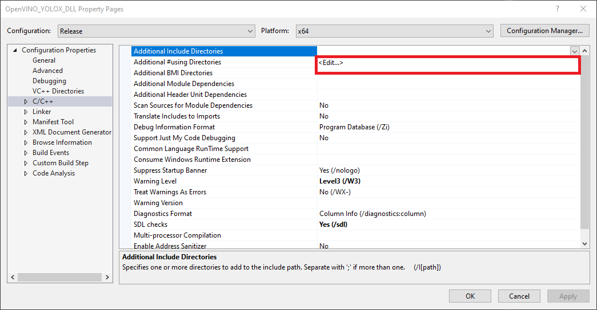


Add the paths for the following folders, replacing `<parent-folder-path>` with the full path to the parent folder for the OpenVINO Toolkit, and click `OK`.

* `<parent-folder-path>\openvino_2022.1.0.643\runtime\include\ie`
* `<parent-folder-path>\openvino_2022.1.0.643\runtime\include`
* `<parent-folder-path>\openvino_2022.1.0.643\opencv\include`
* `<parent-folder-path>\openvino_2022.1.0.643\runtime\3rdparty\tbb\include`


## Link Libraries

Next, open the `Linker` dropdown in the Properties window and select `Input`. Select `Additional Dependencies` and click `<Edit..>`.


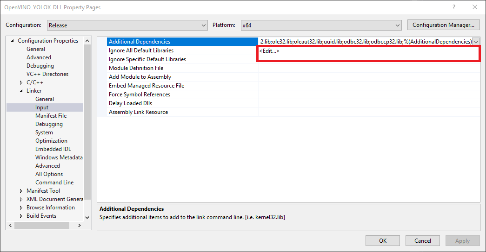


Add the paths to the following files, replacing `<parent-folder-path>` with the full path to the parent folder for the OpenVINO Toolkit, and click `OK`.

* `<parent-folder-path>\openvino_2022.1.0.643\opencv\lib\*`
* `<parent-folder-path>\openvino_2022.1.0.643\runtime\lib\intel64\Release\*`
* `<parent-folder-path>\openvino_2022.1.0.643\runtime\3rdparty\tbb\lib\*.lib`


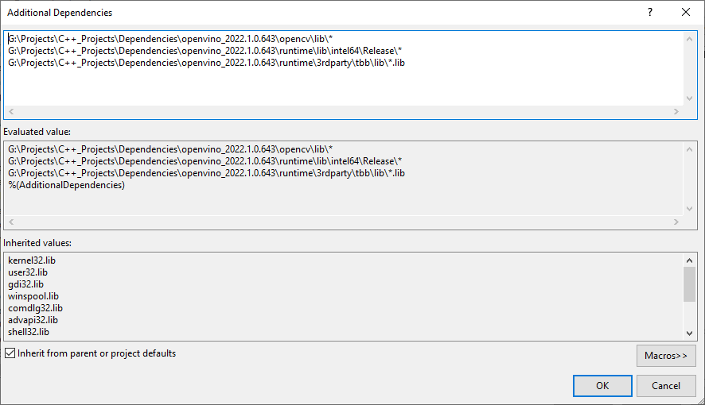


## Post Build Events

Our DLL file will depend on the following DLL files included with the OpenVINO and OpenCV libraries.

**OpenCV DLL files**


**OpenVINO DLL files**


We can add a post-build event in Visual Studio to automatically copy these DLL files to the build folder for the project at compile time. Open the `Build Events` dropdown in the Properties window and select `Post-Build Event`. Select `Command Line` and click `<Edit..>`.


Add the following commands, replacing `<parent-folder-path>` with the full path to the parent folder for the OpenVINO Toolkit, and click `OK`.

* `xcopy <parent-folder-path>\openvino_2022.1.0.643\opencv\bin\opencv_core453.dll $(SolutionDir)$(Platform)\$(Configuration)\ /c /y_`
* `_xcopy <parent-folder-path>\openvino_2022.1.0.643\opencv\bin\opencv_imgproc453.dll $(SolutionDir)$(Platform)\$(Configuration)\ /c /y`
* `xcopy <parent-folder-path>\openvino_2022.1.0.643\opencv\bin\opencv_imgcodecs453.dll $(SolutionDir)$(Platform)\$(Configuration)\ /c /y_`
* `_xcopy <parent-folder-path>\openvino_2022.1.0.643\runtime\bin\intel64\Release\* $(SolutionDir)$(Platform)\$(Configuration)\ /c /y`
* `xcopy <parent-folder-path>\openvino_2022.1.0.643\runtime\3rdparty\tbb\bin\tbb.dll $(SolutionDir)$(Platform)\$(Configuration)\ /c /y`


Finally, click the `Apply` button and close the Properties window.


With the dependencies taken care of, we can start modifying the code.


## Update Precompiled Header File

We'll first update the `pch.h` [Precompiled Header file](https://docs.microsoft.com/en-us/cpp/build/creating-precompiled-header-files?view=msvc-160) with the required header files. We can open the `pch.h` file by selecting it in the Solution Explorer window.

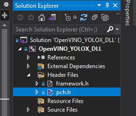


Comment or remove the `#include` line for the `framework.h` header file.

```c++
// pch.h: This is a precompiled header file.
// Files listed below are compiled only once, improving build performance for future builds.
// This also affects IntelliSense performance, including code completion and many code browsing features.
// However, files listed here are ALL re-compiled if any one of them is updated between builds.
// Do not add files here that you will be updating frequently as this negates the performance advantage.

#ifndef PCH_H
#define PCH_H

// add headers that you want to pre-compile here
//#include "framework.h"

#endif //PCH_H

```


**Add required header files**

Next, we'll add the required header files for OpenVINO and OpenCV below `//#include "framework.h"` line.

```c++
// pch.h: This is a precompiled header file.
// Files listed below are compiled only once, improving build performance for future builds.
// This also affects IntelliSense performance, including code completion and many code browsing features.
// However, files listed here are ALL re-compiled if any one of them is updated between builds.
// Do not add files here that you will be updating frequently as this negates the performance advantage.

#ifndef PCH_H
#define PCH_H

// add headers that you want to pre-compile here
//#include "framework.h"

#include "openvino/openvino.hpp"
#include <opencv2/opencv.hpp>

#endif //PCH_H

```


## Update dllmain File

By default, the `dllmain.cpp` file contains the following code. 

```c++
// dllmain.cpp : Defines the entry point for the DLL application.
#include "pch.h"

BOOL APIENTRY DllMain( HMODULE hModule,
                       DWORD  ul_reason_for_call,
                       LPVOID lpReserved
                     )
{
    switch (ul_reason_for_call)
    {
    case DLL_PROCESS_ATTACH:
    case DLL_THREAD_ATTACH:
    case DLL_THREAD_DETACH:
    case DLL_PROCESS_DETACH:
        break;
    }
    return TRUE;
}
```

We can delete everything below the `#include "pch.h"` line.


**Create a macro to mark functions we want to make accessible in Unity**

```c++
// dllmain.cpp : Defines the entry point for the DLL application.
#include "pch.h"


// Create a macro to quickly mark a function for export
#define DLLExport __declspec (dllexport)
```


**Wrap the code in extern “C” to prevent name-mangling issues with the compiler**

The rest of our code will go inside here.

```c++
// Wrap code to prevent name-mangling issues
extern "C" {

}
```


**Define variables**

Inside the wrapper, we will declare the persistent variables needed for the DLL.

* [ov::Core](https://docs.openvino.ai/nightly/classov_1_1Core.html): represents an OpenVINO runtime Core entity
* [ov::Model](https://docs.openvino.ai/latest/classov_1_1Model.html#doxid-classov-1-1-model): A user-defined model
* [ov::CompiledModel](https://docs.openvino.ai/latest/classov_1_1CompiledModel.html): represents a compiled model
* [ov::InferRequest](https://docs.openvino.ai/latest/classov_1_1InferRequest.html#doxid-classov-1-1-infer-request): an infer request that can be run in asynchronous or synchronous manners
* [ov::Tensor](https://docs.openvino.ai/latest/classov_1_1Tensor.html): API holding host memory

----

```c++
// Inference engine instance
ov::Core core;
// The user define model representation
std::shared_ptr<ov::Model> model;
// A device-specific compiled model
ov::CompiledModel compiled_model;

// List of available compute devices
std::vector<std::string> available_devices;
// An inference request for a compiled model
ov::InferRequest infer_request;
// Stores the model input data
ov::Tensor input_tensor;
// A pointer for accessing the input tensor data
float* input_data;

// model has only one output
ov::Tensor output_tensor;
// A pointer for accessing the output tensor data
float* out_data;

// The current source image width
int img_w;
// The current source image height
int img_h;
// The current model input width
int input_w;
// The current model input height
int input_h;
// The total number pixels in the input image
int n_pixels;
// The number of color channels 
int n_channels = 3;

// Stores information about a single object prediction
struct Object
{
    float x0;
    float y0;
    float width;
    float height;
    int label;
    float prob;
};

// Store grid offset and stride values to decode a section of the model output
struct GridAndStride
{
    int grid0;
    int grid1;
    int stride;
};

// The scale values used to adjust the model output to the source image resolution
float scale_x;
float scale_y;

// The minimum confidence score to consider an object proposal
float bbox_conf_thresh = 0.3;
// The maximum intersection over union value before an object proposal will be ignored
float nms_thresh = 0.45;

// Stores the grid and stride values to navigate the raw model output
std::vector<GridAndStride> grid_strides;
// Stores the object proposals with confidence scores above bbox_conf_thresh
std::vector<Object> proposals;
// Stores the indices for the object proposals selected using non-maximum suppression
std::vector<int> proposal_indices;

// The stride values used to generate the gride_strides vector
std::vector<int> strides = { 8, 16, 32 };
```


**Define a function to get the number of compute devices**

The first function we'll define will create a list of available device names and return the number of devices accessible by OpenVINO. We'll use this information to select which device to use to perform inference from the Unity application. There might be an option named GNA (Gaussian & Neural Accelerator). GNA is a highly specialized neural coprocessor for tasks like noise cancellation. We'll exclude it from the list of devices presented to the end user.

* [ov::Core::get_available_devices()](https://docs.openvino.ai/nightly/classov_1_1Core.html#doxid-classov-1-1-core-1aabd82bca4826ee53893f7b5fc9bce813): Returns devices available for inference

------

```c++
/// <summary>
/// Get the number of available compute devices
/// </summary>
/// <returns>The number of available devices</returns>
DLLExport int GetDeviceCount() 
{
    // Reset list of available compute devices
    available_devices.clear();

    // Populate list of available compute devices
    for (std::string device : core.get_available_devices()) {
        // Skip GNA device
        if (device.find("GNA") == std::string::npos) {
            available_devices.push_back(device);
        }
    }
    // Return the number of available compute devices
    return available_devices.size();
}
```


**Define a function to get the name of a compute device**

Next, we'll define a function to return the name of a device at a specified index for the list of available devices.

```c++
/// <summary>
/// Get the name of the compute device name at the specified index
/// </summary>
/// <param name="index"></param>
/// <returns>The name of the device at the specified index</returns>
DLLExport std::string* GetDeviceName(int index) {
    return &available_devices[index];
}
```


**Define method to generate stride values to navigate the raw model output**

The method for generating the offset values used to traverse the output array is almost identical to the Python implementation from [part 1](https://christianjmills.com/IceVision-to-OpenVINO-to-Unity-Tutorial-1/#define-post-processing-steps).

```c++
/// <summary>
/// Generate offset values to navigate the raw model output
/// </summary>
/// <param name="height">The model input height</param>
/// <param name="width">The model input width</param>
void GenerateGridsAndStride(int height, int width)
{
    // Remove the values for the previous input resolution
    grid_strides.clear();

    // Iterate through each stride value
    for (auto stride : strides)
    {
        // Calculate the grid dimensions
        int grid_height = height / stride;
        int grid_width = width / stride;

        // Store each combination of grid coordinates
        for (int g1 = 0; g1 < grid_height; g1++)
        {
            for (int g0 = 0; g0 < grid_width; g0++)
            {
                grid_strides.push_back(GridAndStride{ g0, g1, stride });
            }
        }
    }
}
```


**Define a function to set the minimum confidence score from Unity**

We might want to try different confidence thresholds for keeping object proposals from the Unity application, so we'll add a function to enable this.

```c++
/// <summary>
/// Set minimum confidence score for keeping bounding box proposals
/// </summary>
/// <param name="min_confidence">The minimum confidence score for keeping bounding box proposals</param>
DLLExport void SetConfidenceThreshold(float min_confidence)
{
    bbox_conf_thresh = min_confidence;
}
```


**Define a function to load an OpenVINO model**

OpenVINO needs to compile models for the target device. This process can take several seconds when using GPU inference. We can create a cache directory, so we only need to compile models for a specific resolution-device pair once.

We'll place the code for loading an OpenVINO model inside a try-catch block to avoid crashing the application if we pass an incorrect file path.

If the model loads successfully, we'll attempt to reshape the model input to the desired input dimensions. After reshaping the model input, we can compile the model for the target device.

We can get pointers to the model input tensor and create an inference request using the compiled model.

* [ov::Core::set_property()](https://docs.openvino.ai/nightly/classov_1_1Core.html#doxid-classov-1-1-core-1a14cba2136b972ee34478dd11633293a2): Sets properties for a device
* [ov::Core::read_model()](https://docs.openvino.ai/nightly/classov_1_1Core.html#doxid-classov-1-1-core-1ae0576a95f841c3a6f5e46e4802716981): Reads models from IR/ONNX/PDPD formats
* [ov::Model::reshape()](https://docs.openvino.ai/latest/openvino_docs_OV_UG_ShapeInference.html): Updates input shapes and propagates them down to the outputs of the model through all intermediate layers
* [ov::Core::compile_model()](https://docs.openvino.ai/nightly/classov_1_1Core.html#doxid-classov-1-1-core-1a46555f0803e8c29524626be08e7f5c5a): Creates a compiled model from a source model object
* [ov::CompiledModel::create_infer_request()](https://docs.openvino.ai/latest/classov_1_1CompiledModel.html#doxid-classov-1-1-compiled-model-1ae3633c0eb5173ed776446fba32b95953): Creates an inference request object used to infer the compiled model
* [ov::InferRequest::get_input_tensor()](https://docs.openvino.ai/latest/classov_1_1InferRequest.html#doxid-classov-1-1-infer-request-1a5f0bc1ab40de6a7a12136b4a4e6a8b54): Gets an input tensor for inference

------

```c++
/// <summary>
/// Load a model from the specified file path
/// </summary>
/// <param name="model_path">The full model path to the OpenVINO IR model</param>
/// <param name="index">The index for the available_devices vector</param>
/// <param name="image_dims">The source image dimensions</param>
/// <returns>A status value indicating success or failure to load and reshape the model</returns>
DLLExport int LoadModel(char* model_path, int index, int image_dims[2]) 
{

    int return_val = 0;
    // Set the cache directory for compiled GPU models
    core.set_property("GPU", ov::cache_dir("cache"));

    // Try loading the specified model
    try { model = core.read_model(model_path); }
    catch (...) { return 1; }

    // The dimensions of the source input image
    img_w = image_dims[0];
    img_h = image_dims[1];
    // Calculate new input dimensions based on the max stride value
    input_w = (int)(strides.back() * std::roundf(img_w / strides.back()));
    input_h = (int)(strides.back() * std::roundf(img_h / strides.back()));
    n_pixels = input_w * input_h;

    // Calculate the value used to adjust the model output to the source image resolution
    scale_x = input_w / (img_w * 1.0);
    scale_y = input_h / (img_h * 1.0);

    // Generate the grid and stride values based on input resolution
    grid_strides.clear();
    GenerateGridsAndStride(input_h, input_w);

    // Try updating the model input dimensions
    try { model->reshape({ 1, 3, input_h, input_w }); }
    catch (...) { return_val = 2; }

    // Create a compiled model for the taret compute device
    auto compiled_model = core.compile_model(model, "MULTI",
                                             ov::device::priorities(available_devices[index]),
                                             ov::hint::performance_mode(ov::hint::PerformanceMode::LATENCY),
                                             ov::hint::inference_precision(ov::element::f32));

    // Create an inference request
    infer_request = compiled_model.create_infer_request();

    // Get input tensor by index
    input_tensor = infer_request.get_input_tensor(0);
    // Get a pointer to the input tensor data
    input_data = input_tensor.data<float>();

    // Get output tensor
    output_tensor = infer_request.get_output_tensor();
    // Get a pointer to the output tensor data
    out_data = output_tensor.data<float>();

    // Replace the initial input dims with the updated values
    image_dims[0] = input_w;
    image_dims[1] = input_h;

    // Return a value of 0 if the model loads successfully
    return return_val;
}
```


**Define method to generate object detection proposals from the raw model output**

The method to generate object proposals is nearly identical to the Python implementation from part 1.

```c++
/// <summary>
/// Generate object detection proposals from the raw model output
/// </summary>
/// <param name="out_ptr">A pointer to the output tensor data</param>
void GenerateYoloxProposals(float* out_ptr, int proposal_length)
{
    // Remove the proposals for the previous model output
    proposals.clear();

    // Obtain the number of classes the model was trained to detect
    int num_classes = proposal_length - 5;

    for (int anchor_idx = 0; anchor_idx < grid_strides.size(); anchor_idx++)
    {
        // Get the current grid and stride values
        int grid0 = grid_strides[anchor_idx].grid0;
        int grid1 = grid_strides[anchor_idx].grid1;
        int stride = grid_strides[anchor_idx].stride;

        // Get the starting index for the current proposal
        int start_idx = anchor_idx * proposal_length;

        // Get the coordinates for the center of the predicted bounding box
        float x_center = (out_ptr[start_idx + 0] + grid0) * stride;
        float y_center = (out_ptr[start_idx + 1] + grid1) * stride;

        // Get the dimensions for the predicted bounding box
        float w = exp(out_ptr[start_idx + 2]) * stride;
        float h = exp(out_ptr[start_idx + 3]) * stride;

        // Calculate the coordinates for the upper left corner of the bounding box
        float x0 = x_center - w * 0.5f;
        float y0 = y_center - h * 0.5f;

        // Get the confidence score that an object is present
        float box_objectness = out_ptr[start_idx + 4];

        // Initialize object struct with bounding box information
        Object obj = { x0, y0, w, h, 0, 0 };

        // Find the object class with the highest confidence score
        for (int class_idx = 0; class_idx < num_classes; class_idx++)
        {
            // Get the confidence score for the current object class
            float box_cls_score = out_ptr[start_idx + 5 + class_idx];
            // Calculate the final confidence score for the object proposal
            float box_prob = box_objectness * box_cls_score;

            // Check for the highest confidence score
            if (box_prob > obj.prob)
            {
                obj.label = class_idx;
                obj.prob = box_prob;
            }
        }

        // Only add object proposals with high enough confidence scores
        if (obj.prob > bbox_conf_thresh) proposals.push_back(obj);
    }

    // Sort the proposals based on the confidence score in descending order
    std::sort(proposals.begin(), proposals.end(), [](Object& a, Object& b) -> bool
              { return a.prob > b.prob; });
}
```


**Define function to sort bounding box proposals using Non-Maximum Suppression**

The C++ API for OpenCV has built-in functionality to perform comparison operations between rectangles. Therefore, we don't need to define helper functions to calculate the intersection and union areas of two bounding boxes. Otherwise, the method to sort bounding box proposals using Non-Maximum Suppression is almost identical to the Python implementation from part 1.

```c++
/// <summary>
/// Filter through a sorted list of object proposals using Non-maximum suppression
/// </summary>
void NmsSortedBboxes()
{
    // Remove the picked proposals for the previous model outptut
    proposal_indices.clear();

    // Iterate through the object proposals
    for (int i = 0; i < proposals.size(); i++)
    {
        Object& a = proposals[i];

        // Create OpenCV rectangle for the Object bounding box
        cv::Rect_<float> rect_a = cv::Rect_<float>(a.x0, a.y0, a.width, a.height);

        bool keep = true;

        // Check if the current object proposal overlaps any selected objects too much
        for (int j : proposal_indices)
        {
            Object& b = proposals[j];

            // Create OpenCV rectangle for the Object bounding box
            cv::Rect_<float> rect_b = cv::Rect_<float>(b.x0, b.y0, b.width, b.height);

            // Calculate the area where the two object bounding boxes overlap
            float inter_area = (rect_a & rect_b).area();
            // Calculate the union area of both bounding boxes
            float union_area = rect_a.area() + rect_b.area() - inter_area;
            // Ignore object proposals that overlap selected objects too much
            if (inter_area / union_area > nms_thresh)
                keep = false;
        }

        // Keep object proposals that do not overlap selected objects too much
        if (keep) proposal_indices.push_back(i);
    }
}
```


**Define a function to perform inference**

We will access the pixel data for the input image from Unity with a pointer to a [uchar](https://docs.opencv.org/4.5.1/d1/d1b/group__core__hal__interface.html#ga65f85814a8290f9797005d3b28e7e5fc) (unsigned 1-byte integer) array and wrap the data in a [cv::Mat](https://docs.opencv.org/master/d3/d63/classcv_1_1Mat.html) variable for processing. 

We don't need to normalize the input image since the IR model does it internally.

After processing the model output, we'll return the final number of detected objects to Unity so we can initialize an array of objects.

* [cv::Mat](https://docs.opencv.org/3.4/d3/d63/classcv_1_1Mat.html): n-dimensional dense array class  
* [cv::cvtColor()](https://docs.opencv.org/3.4/d8/d01/group__imgproc__color__conversions.html#ga397ae87e1288a81d2363b61574eb8cab): Converts an image from one color space to another
* [ov::InferRequest::infer()](https://docs.openvino.ai/latest/classov_1_1InferRequest.html#doxid-classov-1-1-infer-request-1abcb7facc9f7c4b9226a1fd343e56958d): Infers specified input in synchronous mode
* [ov::InferRequest::get_output_tensor()](https://docs.openvino.ai/latest/classov_1_1InferRequest.html#doxid-classov-1-1-infer-request-1a9bf7bf67c58858bda86ae01e83cd14c1): Gets an output tensor for inference

------

```c++
/// <summary>
/// Perform inference with the provided texture data
/// </summary>
/// <param name="image_data">The source image data from Unity</param>
/// <returns>The final number of detected objects</returns>
DLLExport int PerformInference(uchar* image_data) 
{

    // Store the pixel data for the source input image in an OpenCV Mat
    cv::Mat input_image = cv::Mat(img_h, img_w, CV_8UC4, image_data);

    // Remove the alpha channel
    cv::cvtColor(input_image, input_image, cv::COLOR_RGBA2RGB);

    // Resize the input image
    cv::resize(input_image, input_image, cv::Size(input_w, input_h));

    // Iterate over each pixel in image
    for (int p = 0; p < n_pixels; p++)
    {
        input_data[0*n_pixels + p] = input_image.data[p*n_channels + 0] / 255.0f;
        input_data[1*n_pixels + p] = input_image.data[p*n_channels + 1] / 255.0f;
        input_data[2*n_pixels + p] = input_image.data[p*n_channels + 2] / 255.0f;
    }

    // Perform inference
    infer_request.infer();

    // Generate new proposals for the current model output
    GenerateYoloxProposals(out_data, output_tensor.get_shape()[2]);

    // Pick detected objects to keep using Non-maximum Suppression
    NmsSortedBboxes();

    // return the final number of detected objects
    return (int)proposal_indices.size();
}
```


**Define a function to populate an array of objects from Unity**

Next, we'll define a function to populate an array of objects from Unity. We call this function after initializing the list based on the current number of detected objects. We'll also scale the bounding box information from the input dimensions to the source image resolution.

```c++
/// <summary>
/// Fill the provided array with the detected objects
/// </summary>
/// <param name="objects">A pointer to a list of objects from Unity</param>
DLLExport void PopulateObjectsArray(Object* objects) 
{

    for (int i = 0; i < proposal_indices.size(); i++)
    {
        Object obj = proposals[proposal_indices[i]];

        // Adjust offset to source image resolution and clamp the bounding box
        objects[i].x0 = std::min(obj.x0 / scale_x, (float)img_w);
        objects[i].y0 = std::min(obj.y0 / scale_y, (float)img_h);
        objects[i].width = std::min(obj.width / scale_x, (float)img_w);
        objects[i].height = std::min(obj.height / scale_y, (float)img_h);

        objects[i].label = obj.label;
        objects[i].prob = obj.prob;
    }
}
```


**Define a function to reset the vectors when the Unity application exits**

This last function will free the memory allocated by the vectors. We'll call it when the Unity application shuts down.

```c++
/// <summary>
/// Reset vectors
/// </summary>
DLLExport void FreeResources() 
{
    available_devices.clear();
    grid_strides.clear();
    proposals.clear();
    proposal_indices.clear();
}
```


That is all the code needed for the plugin. We can now build the solution to generate the DLL file.


## Build Solution

Open the Build menu at the top of the Visual Studio window and click Build Solution. Visual Studio will generate a new x64 folder in the project directory containing the DLL file and its dependencies.


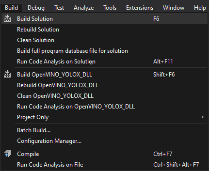


## Gather Dependencies

Right-click the project name in the Solution Explorer panel and select `Open Folder in File Explorer` from the popup menu.

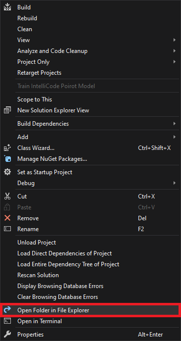


In the new File Explorer window, go to the parent folder.

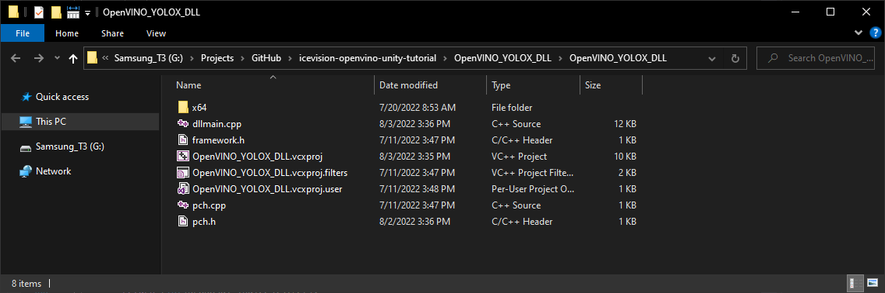


Open the `x64 → Release` subfolder.


We'll need to copy all the DLL files in this folder and the plugins.xml file to the Unity project.


## Summary

This post covered creating a dynamic link library ([DLL](https://docs.microsoft.com/en-us/troubleshoot/windows-client/deployment/dynamic-link-library)) file to perform inference using [OpenVINO](https://docs.openvino.ai/latest/index.html). In part 3, we build a project in [https://unity.com/](https://unity.com/) that uses this DLL.


**Previous:** [End-to-End Object Detection for Unity With IceVision and OpenVINO Pt. 1](https://christianjmills.com/IceVision-to-OpenVINO-to-Unity-Tutorial-1/)


**Project Resources:** [GitHub Repository](https://github.com/cj-mills/icevision-openvino-unity-tutorial)


