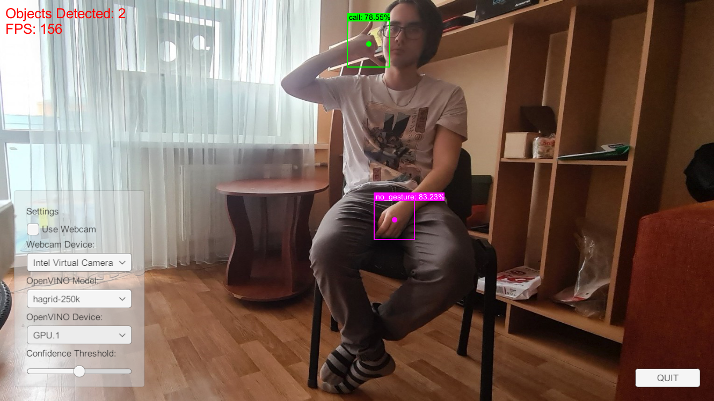

* [Overview](#overview)
* [OpenVINO Inference](#openvino-inference)
* [ONNX-DirectML Inference](#onnx-directml-inference)
* [PyTorch-DirectML Training](#pytorch-directml-training)

## Overview

Last week, I received an Arc A770 GPU from Intel as part of their Graphics Innovator program. I am primarily interested in the card for its deep-learning performance, so I tested it with some of my tutorial projects and attempted to train some models using the [pytorch-directml](https://pypi.org/project/pytorch-directml/) package.

**Desktop Specs:**

| OS                  | CPU       | Memory             | GPU Driver                                                   |
| ------------------- | --------- | ------------------ | ------------------------------------------------------------ |
| Windows 10 Pro 21H2 | i7-11700K | 32 GB DDR4 3000MHz | [31.0.101.3490](https://www.intel.com/content/www/us/en/download/726609/intel-arc-graphics-windows-dch-driver.html) |

**Library Versions:**

| OpenVINO                                                     | ONNX-DirectML                                                | pytorch-directml                                             |
| ------------------------------------------------------------ | ------------------------------------------------------------ | ------------------------------------------------------------ |
| [2022.1 and 2022.2](https://www.intel.com/content/www/us/en/developer/tools/openvino-toolkit/download.html) | [1.12.1](https://www.nuget.org/packages/Microsoft.ML.OnnxRuntime.DirectML/1.12.1) | [1.8.0a0.dev220506](https://pypi.org/project/pytorch-directml/) |

## OpenVINO Inference

I first tested the card’s performance in the Unity project from my [End-to-End Object Detection for Unity With IceVision and OpenVINO](../../icevision-openvino-unity-tutorial/part-1/) tutorial. The project uses OpenVINO 2022.1, and I noticed an odd sensitivity to input resolution when using FP16 precision.

I use a default resolution of 398x224 (for a 16:9 aspect ratio), which translates to a 384x224 (divisible by 32) input resolution for the YOLOX tiny model. At this resolution, the model detects the same hand gestures with the Arc card as the CPU. However, the confidence scores are much lower, and the bounding box dimensions are slightly different (but still usable).

##### **CPU (FP16)**

* **Objects Detected:** Call 78.54%, No Gesture 83.2%

{fig-align="center"}

##### **A770 (FP16)**

* **Objects Detected:** Call 23.25%, No Gesture 40.86%

{fig-align="center"}

Moving to a higher resolution brought inconsistent improvements in accuracy and occasional crashes. The below sample is with an input resolution of `896x512` at FP16 precision.

**Objects Detected:** Call 78.06%

{fig-align="center"}

I later updated OpenVINO to the recent 2022.2 release, which resolved this issue.

**Objects Detected:** Call 78.55%, No Gesture 83.23%

{fig-align="center"}

## ONNX-DirectML Inference

I used the project from my [Object Detection for Unity With ONNX Runtime and DirectML](../../onnx-directml-unity-tutorial/part-1/) tutorial to compare the inference speeds between the A770 and my Titan RTX. This project uses the same YOLOX tiny model and input resolution as the OpenVINO one but in FP32 precision.

The Titan RTX, essentially a 2080 Ti, hit around 145fps, while the A770 hovered around 120fps.

##### **A770**

**Objects Detected:** Call 78.64%, No Gesture 83.35%

{fig-align="center"}

## PyTorch-DirectML Training

As far as I know, the only way to train models at the time of writing on an Arc card is with the [pytorch-directml](https://pypi.org/project/pytorch-directml/) package (or [tensorflow-directml](https://pypi.org/project/tensorflow-directml/) package).

To test this, I set up a conda environment in [WSL](https://learn.microsoft.com/en-us/windows/wsl/about) with the pytorch-directml package and downloaded the [sample repo](https://github.com/microsoft/DirectML/tree/master/PyTorch) provided by Microsoft. The pytorch-directml package requires python 3.8, and the sample repo uses torchvision 0.9.0.

I successfully trained a ResNet50 model on [CIFAR-10](https://www.cs.toronto.edu/~kriz/cifar.html) with the sample training script. GPU memory usage was volatile when using a batch size higher than 4. The ResNet50 training script used less than 3.6 GB of GPU memory at a batch size of 4.

{fig-align="center"}

However, it spikes to using all 16 GB at a batch size of 8 and crashes the script. I was able to train at a batch size of 6, but barely.

I then attempted to train the style transfer model included with the [pytorch examples repo](https://github.com/pytorch/examples) and hit the wall of unimplemented operators. Here is the [PyTorch DirectML Operator Roadmap](https://github.com/microsoft/DirectML/wiki/PyTorch-DirectML-Operator-Roadmap). Some of the missing operators are on the current roadmap, but not all of them.

The tensorflow-directml package recently received its first update since May, so hopefully, the PyTorch version will receive an update soon. I have no idea when the main PyTorch and TensorFlow libraries will gain support for Intel GPUs, but hopefully, that is not too far off either.

<!-- Cloudflare Web Analytics --><!-- End Cloudflare Web Analytics -->