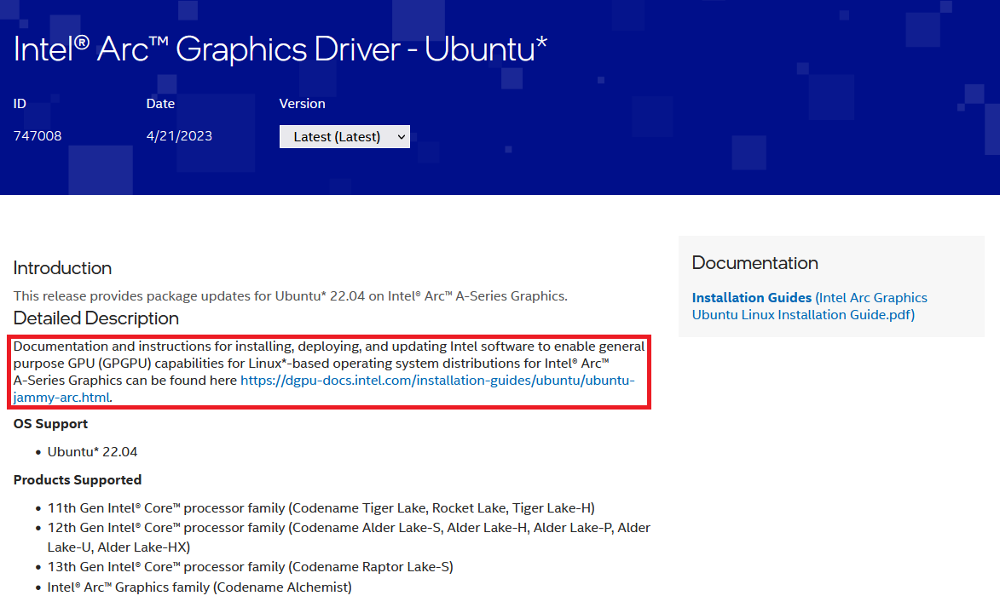
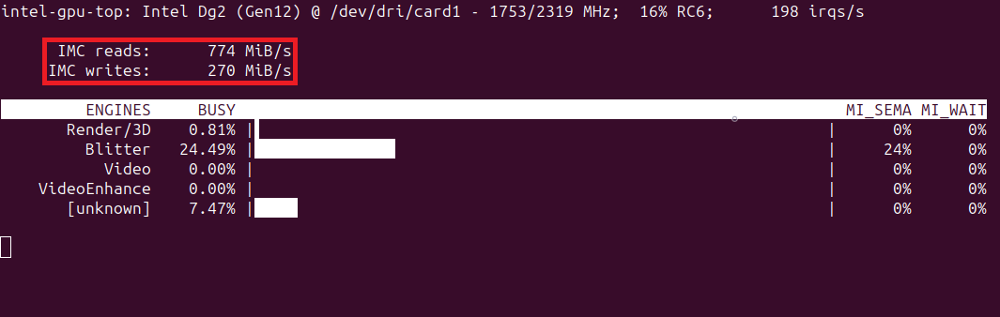
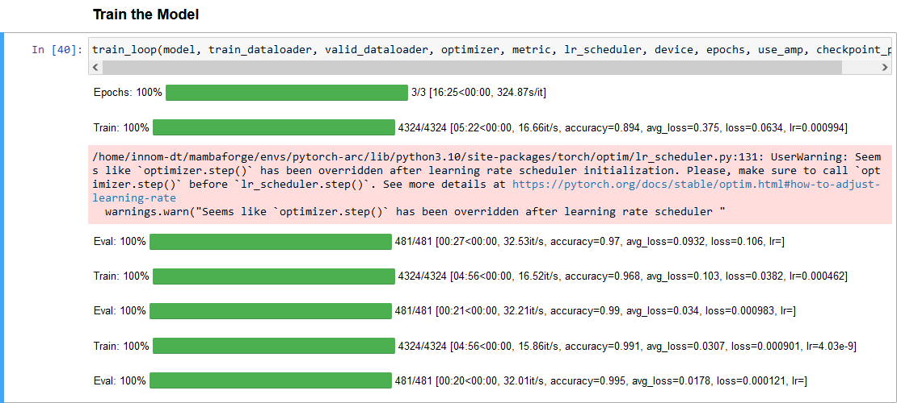
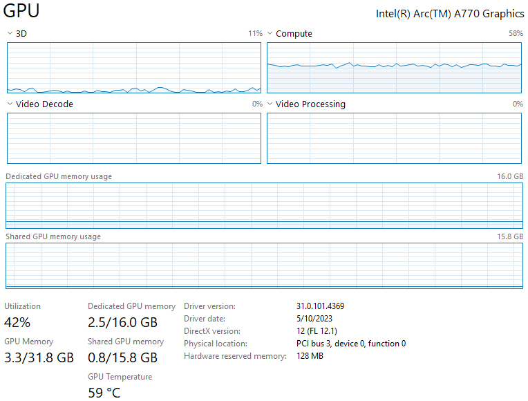

::: {.callout-tip}
## This post is part of the following series:
* [**Testing Intel's Arc A770 GPU for Deep Learning**](/series/notes/arc-a770-testing.html)
:::


* [Introduction](#introduction)
* [Initial Headaches](#initial-headaches)
* [Training Performance on Native Ubuntu](#training-performance-on-native-ubuntu)
* [Training Performance on WSL](#training-performance-on-wsl)
* [Closing Thoughts](#closing-thoughts)


## Tutorial Links

* [Getting Started with Intel’s PyTorch Extension for Arc GPUs on Ubuntu](../../intel-pytorch-extension-tutorial/native-ubuntu/): This tutorial provides a step-by-step guide to setting up Intel’s PyTorch extension on Ubuntu to train models with Arc GPUs
* [Getting Started with Intel’s PyTorch Extension for Arc GPUs on Windows](../../intel-pytorch-extension-tutorial/native-windows/): This tutorial provides a step-by-step guide to setting up Intel’s PyTorch extension on Windows to train models with Arc GPUs.


## Introduction

[Last October](../part-1/), I wrote about my findings from testing the inference performance of Intel's [Arc A770](https://www.intel.com/content/www/us/en/products/sku/229151/intel-arc-a770-graphics-16gb/specifications.html) GPU using [OpenVINO](https://docs.openvino.ai/2022.3/home.html) and [DirectML](https://learn.microsoft.com/en-us/windows/ai/directml/dml). I also attempted to train various models with the [PyTorch-DirectML](https://pypi.org/project/pytorch-directml/) package. The card did well on inference, especially with Intel's OpenVINO library. However, the PyTorch-DirectML package was incomplete, and I could not adequately test the card's training performance.


Shortly after that post, Intel released an [extension for PyTorch](https://github.com/intel/intel-extension-for-pytorch/releases/tag/v1.10.200%2Bgpu), which added support for Intel GPUs. Based on my initial testing, I decided the extension was not in a state that warranted a follow-up post. In hindsight, I don't believe the initial release officially supported Arc GPUs. The [installation guide](https://intel.github.io/intel-extension-for-pytorch/xpu/1.10.200+gpu/tutorials/installation.html#hardware-requirement) for that version only mentions data center GPUs.


Since then, Intel has released a couple of updates for the extension, the most [recent](https://github.com/intel/intel-extension-for-pytorch/releases/tag/v1.13.120%2Bxpu) being about a month ago at the time of writing. Unlike the initial release, this version lists Arc GPUs as having [experimental support](https://intel.github.io/intel-extension-for-pytorch/xpu/1.13.120+xpu/tutorials/installation.html#hardware-requirement). Given that and the driver improvements for Windows and Linux, I decided to pop the A770 back into my desktop and give it another shot. In short, it works now.


In this post, I discuss my experience getting Intel's PyTorch extension running on Ubuntu and Windows Subsystem for Linux (WSL). I also cover my initial findings from training models. I'll provide a tutorial for setting up and using the extension in a dedicated post.

* [Getting Started with Intel’s PyTorch Extension for Arc GPUs on Ubuntu](../../intel-pytorch-extension-tutorial/native-ubuntu/)


## Initial Headaches

To be blunt, my initial attempts to get this working were a bit of a nightmare. The instructions required to enable support for Arc GPUs on Ubuntu and set up Intel's PyTorch extension span across multiple sites and are sometimes contradictory. The instructions on some sites are outdated to the point of being impossible to follow.


For example, Intel's Arc Graphics Driver for Ubuntu [page](https://www.intel.com/content/www/us/en/download/747008/intel-arc-graphics-driver-ubuntu.html) provided a link to a separate documentation site with driver installation instructions. 


{fig-align="center"}


The instructions on the documentation site say to [install a specific Linux kernel](https://dgpu-docs.intel.com/installation-guides/ubuntu/ubuntu-jammy-arc.html#step-2-install-linux-kernel), `5.19.0-35`, which is [no longer available](https://www.ubuntuupdates.org/package/core/jammy/main/updates/linux-image-5.19.0-35-generic).


{fig-align="center"}


Still, I attempted to follow the instructions on a new Ubuntu 22.04 install and a more recent `5.19` kernel. Trying to boot into Ubuntu on the Arc card with the `5.19` kernel results in the following error:

```bash
snd_hda_intel 0000:04:00.0 hsw/bdw hd-audio hdmi/dp requires binding with gfx driver
```

The error is a known issue, and Intel even has a [troubleshooting page](https://www.intel.com/content/www/us/en/support/articles/000092607/graphics.html) with a proposed workaround. Unfortunately, disabling the "Integrated graphics Multi-Monitor" BIOS option, as the page recommends, did not resolve the issue. 


I decided to continue following the instructions on integrated graphics and see if I could use the Arc card once I installed all the driver packages. That attempt went so poorly that I had to pop out the motherboard's CMOS battery to reset the BIOS.


I made several more attempts, which failed at various stages. Fortunately, I eventually got everything working, and my current setup process is pretty straightforward.


I ended up needing Linux kernel `6.2` or newer. That kernel version [supports the Arc card](https://www.phoronix.com/news/Linux-6.2-Released) out of the box. You can install that kernel on Ubuntu 22.04, but I recommend just going with Ubuntu 23.04 (or newer) if starting from a fresh install. Ubuntu 23.04 already has a kernel version `≥6.2`, and I verified it works with Intel's PyTorch extension.


As mentioned earlier, I'll provide detailed instructions for the setup process in a dedicated post.


## Training Performance on Native Ubuntu

I used the training notebook from my recent [beginner PyTorch tutorial](../../pytorch-train-image-classifier-timm-hf-tutorial/) for testing. That tutorial covers fine-tuning image classification models with PyTorch and the timm library by creating a hand gesture recognizer. Using the training notebook simplifies directly comparing the Arc A770 and my Titan RTX, which I used to create the tutorial. Nearly everything is identical for the testing environment down to the dataset location.


The one additional variable is that the tutorial uses PyTorch 2.0, while Intel's PyTorch extension currently requires a [patched version](https://intel.github.io/intel-extension-for-pytorch/xpu/latest/tutorials/installation.html#pytorch-intel-extension-for-pytorch-version-mapping) of PyTorch 1.13. However, I don't use model compilation in the tutorial, so this should not be a significant factor.


The training notebook only required a few tweaks to use Intel's PyTorch extension, with most of the code remaining unchanged. The extension even supports PyTorch's `autocast()` context manager for mixed-precision training.


The first training session was alarmingly slow, with the first pass through the training set taking around 42 minutes and 30 seconds. However, the loss and accuracy values were comparable to those with the Titan RTX, so I let it run for a while. After the first epoch, passes through the training set fell to approximately 16 minutes and 50 seconds. The total training time was only a few minutes less than the free GPU tier on Google Colab. Strangely, the inference speed on the validation set was nearly identical to the Titan RTX.


{fig-align="center"}


We can get more insight into using the `intel-gpu-top` command-line tool. Below are the readouts from the first and third passes through the training set:


::: {.panel-tabset}
## First Pass

{fig-align="center"}


## Third Pass

{fig-align="center"}

:::


Note that the memory throughput for the first training pass is particularly low. Although, the third pass is not great, either.


After some investigation on the [extension's GitHub repository](https://github.com/intel/intel-extension-for-pytorch/issues/296#issuecomment-1426537682), it appears the slow training time is due to the backward pass for some operations. Fortunately, the fix involved setting a [single environment variable](https://github.com/intel/intel-extension-for-pytorch/issues/296#issuecomment-1461118993).


After setting `IPEX_XPU_ONEDNN_LAYOUT=1`, the total training time is within 10% of my Titan RTX on the same system. The gap would be slightly wider if I compiled the model on the Titan with PyTorch 2.0.


We can see the difference with `intel-gpu-top`, which shows much higher memory throughput.

{fig-align="center"}


The final loss and accuracy values fluctuate slightly, even when using fixed seed values for PyTorch, NumPy, and Python. However, they stay pretty close to the results on my Nvidia GPU.


Here is a screenshot of the training session with the Arc A770:

{fig-align="center"}


Here is a link to the training session with the Titan RTX:

- [Titan RTX training session](../../pytorch-train-image-classifier-timm-hf-tutorial/#train-the-model)

```text
Epochs: 100%|█████████| 3/3 [11:15<00:00, 224.96s/it]
Train: 100%|██████████| 4324/4324 [03:29<00:00, 21.75it/s, accuracy=0.894, avg_loss=0.374, loss=0.0984, lr=0.000994]
Eval: 100%|██████████| 481/481 [00:17<00:00, 50.42it/s, accuracy=0.975, avg_loss=0.081, loss=0.214, lr=]
Train: 100%|██████████| 4324/4324 [03:28<00:00, 22.39it/s, accuracy=0.968, avg_loss=0.105, loss=0.0717, lr=0.000462]
Eval: 100%|██████████| 481/481 [00:16<00:00, 55.14it/s, accuracy=0.988, avg_loss=0.0354, loss=0.02, lr=]
Train: 100%|██████████| 4324/4324 [03:28<00:00, 21.94it/s, accuracy=0.99, avg_loss=0.0315, loss=0.00148, lr=4.03e-9]
Eval: 100%|██████████| 481/481 [00:16<00:00, 53.87it/s, accuracy=0.995, avg_loss=0.0173, loss=0.000331, lr=]
```


The training sessions for the A770 and the Titan both used mixed precision.

I also tested training on the Arc card with the newer 6.3 Linux kernel but did not see a notable performance difference versus the 6.2 Linux kernel.

Since Intel's extension only recently added support for Arc cards, more performance may get unlocked in future updates. However, getting so close to the Titan RTX was already more than I had hoped.

I decided to move on and see how the extension performed in WSL.


## Training Performance on WSL

Now that I had a streamlined process for setting everything up on Ubuntu, getting WSL up and running was easy. It only required a subset of the steps compared to a bare-metal Ubuntu installation. I used the default [Ubuntu terminal environment](https://apps.microsoft.com/store/detail/ubuntu/9PDXGNCFSCZV) and stuck with the included kernel.


Total training time in WSL is `≈34%` slower than in native Ubuntu with the dataset in the same virtual hard disk (VHD) that stores the WSL-Ubuntu install. 


{fig-align="center"}


I remember getting a similar performance hit the last time I used WSL with the Titan RTX. It's one of the reasons I prefer to dual-boot Windows and Ubuntu.


Here is a screenshot of the GPU usage when running the training notebook on the A770 in WSL:


{fig-align="center"}


There is an additional `≈20%` increase in training time when storing the dataset outside the VHD with the WSL-Ubuntu install. 


{fig-align="center"}


One workaround is to [move the WSL installation](https://woshub.com/move-wsl-another-drive-windows/) to a larger drive if your `C` drive has limited space.


The performance hit makes it hard to recommend WSL for deep learning tasks. On top of that, the [issues](https://christianjmills.com/posts/pytorch-cuda-wsl2/#the-headaches) I encountered when I first tested using PyTorch on WSL2 in 2020 are still present, at least on Windows 10. 


Therefore, I recommend using a bare-metal installation to get the most out of your hardware. The Ubuntu website provides [a step-by-step guide](https://ubuntu.com/tutorials/install-ubuntu-desktop#1-overview) to installing Ubuntu on your PC, and you can install it alongside an existing operating system.


## Closing Thoughts

My experience with the PyTorch-DirectML package and the first version of Intel's extension left me thinking it would be a while before the Arc GPUs became viable options for deep learning. 


Several months later, my initial attempts to get everything working last week had me thinking it would be even longer still. Fortunately, once you know the proper steps, setting everything up is relatively straightforward. 


While there is much more testing to do, I believe the Arc GPUs are now credible options for deep learning. 


There are likely still edge cases or certain operations that cause problems, and I'll make updates to this post if I encounter any. I'll also try to keep the [setup tutorial](../../intel-pytorch-extension-tutorial/native-ubuntu/) updated as new versions of Intel's PyTorch extension come out.
