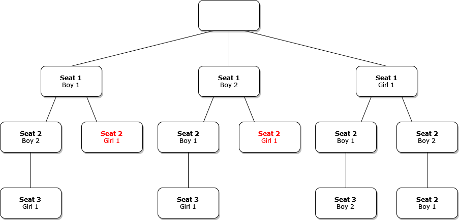

* [Overview](#overview)
* [Backtracking](#backtracking)
* [Backtracking Template](#backtracking-template)
* [Toy Example](#toy-example)
* [Solve N-Queens](#solve-n-queens)
* [Solve Sudoku](#solve-sudoku)


## Overview

Here are some notes I took while watching Lynn Zheng's [video](https://www.youtube.com/watch?v=A80YzvNwqXA) providing a walkthrough on solving backtracking problems.


## Backtracking

* Goal: Finding valid states that satisfy a set of problem constraints
* Approach: Recursively try to satisfy all constraints by testing potential solutions, step by step, and undoing steps when there are no valid potential next steps
* Brute force approach
* Depth First Search


**Backtracking Template**

1. Get initial state
2. Check if state is valid
3. Get list of valid potential next steps
4. Try each potential step, depth first
5. Backtrack one step when there are no potential next steps
   * Could be from reaching a valid state or from choosing an invalid step

```python
# Check if the current state is a valid soluion
def is_valid_state(state):
		# check if is a valid solution
		return True

# Get list of potential next steps
def get_candidates(state):
	return []

# Recursively, perform a depth-first search to find valid solutions
def search(state, solutions):
    # Check is the state is valid
    if is_valid_state(state):
        # Add a copy of the valid state to list of solutions
        solutions.append(state.copy())
        # return # uncomment if you only need to find one valid solution

    # Iterate through the candidates that can be used
    # to construct the next state
    for candidate in get_candidates(state):
        # Add candidate to the current state
        state.add(candidate)
        # Call search function with updated state
        search(state, solutions)
        # Remove the current candidate from the current state
        state.remove(candidate)

# Entry point to the program
# responsible for returning the valid solutions
def solve():
	# start with an empty list of solutions
	solutions = []
	# start with an empty state
	state = set()
	# initiate the recursive search
	search(state, solutions)
	# return the final list of solutions
	return solutions
```


## Toy Example

* There are 3 students
  * Boy 1
  * Boy 2
  * Girl 1
* There is 1 row containing three seats
* Constraints
  * all seats must be filled
  * a student can only sit in one seat at a time
* Find every possible seating arrangement

| Seat |  1   |  2   |  3   |
| :--: | :--: | :--: | :--: |
|  1   |      |      |      |

**Possible Seating Arrangements**

{fig-align="center"}


There are six possible arrangements

| Seat |   1   |   2   |   3    |
| :--: | :---: | :---: | :----: |
|  1   | Boy 1 | Boy 2 | Girl 1 |

| Seat |   1   |   2    |   3   |
| :--: | :---: | :----: | :---: |
|  1   | Boy 1 | Girl 1 | Boy 2 |

| Seat |   1   |   2   |   3    |
| :--: | :---: | :---: | :----: |
|  1   | Boy 2 | Boy 1 | Girl 1 |

| Seat |   1   |   2    |   3   |
| :--: | :---: | :----: | :---: |
|  1   | Boy 2 | Girl 1 | Boy 1 |

| Seat |   1    |   2   |   3   |
| :--: | :----: | :---: | :---: |
|  1   | Girl 1 | Boy 1 | Boy 2 |

| Seat |   1    |   2   |   3   |
| :--: | :----: | :---: | :---: |
|  1   | Girl 1 | Boy 2 | Boy 1 |


**replit:** [https://replit.com/@innominate817/backtracking-toy-example#main.py](https://replit.com/@innominate817/backtracking-toy-example#main.py)

```python
OPTIONS = {"B1", "B2", "G1"}


# Check if the current state is a valid soluion
def is_valid_state(state):
    # The current state is valid is there is a unique student in each seat
    return len(state) == 3


# Get list of potential next steps
def get_candidates(state):
    # print(list(OPTIONS.difference(set(state))))
    return list(OPTIONS.difference(set(state)))


# Recursively, perform a depth-first search to find valid solutions
def search(state, solutions):
    # Check is the state is valid
    if is_valid_state(state):
        # Add a copy of the valid state to list of solutions
        solutions.append(state.copy())
        print(f"Valid State Found: {state}")
        # return # uncomment if you only need to find one valid solution

    # Iterate through the candidates that can be used
    # to construct the next state
    for candidate in get_candidates(state):
        # Add candidate to the current state
        state.append(candidate)
        # Call search function with updated state
        search(state, solutions)
        # Remove the current candidate from the current state
        print(f"backtracking from: {state}")
        state.remove(candidate)


# Entry point to the program
# responsible for returning the valid solutions
def solve():
    solutions = []
    state = []
    search(state, solutions)
    return solutions


if __name__ == "__main__":
    solutions = solve()
    print(solutions)

```

```python
Valid State Found: ['G1', 'B2', 'B1']
backtracking from: ['G1', 'B2', 'B1']
backtracking from: ['G1', 'B2']
Valid State Found: ['G1', 'B1', 'B2']
backtracking from: ['G1', 'B1', 'B2']
backtracking from: ['G1', 'B1']
backtracking from: ['G1']
Valid State Found: ['B2', 'G1', 'B1']
backtracking from: ['B2', 'G1', 'B1']
backtracking from: ['B2', 'G1']
Valid State Found: ['B2', 'B1', 'G1']
backtracking from: ['B2', 'B1', 'G1']
backtracking from: ['B2', 'B1']
backtracking from: ['B2']
Valid State Found: ['B1', 'G1', 'B2']
backtracking from: ['B1', 'G1', 'B2']
backtracking from: ['B1', 'G1']
Valid State Found: ['B1', 'B2', 'G1']
backtracking from: ['B1', 'B2', 'G1']
backtracking from: ['B1', 'B2']
backtracking from: ['B1']
[
    ['G1', 'B2', 'B1'], 
    ['G1', 'B1', 'B2'], 
    ['B2', 'G1', 'B1'], 
    ['B2', 'B1', 'G1'], 
    ['B1', 'G1', 'B2'], 
    ['B1', 'B2', 'G1']
]
```


**Additional Constraints**

* The girl cannot sit in the middle (Seat 2)

{fig-align="center"}


**replit:** [https://replit.com/@innominate817/backtracking-toy-example-1#main.py](https://replit.com/@innominate817/backtracking-toy-example-1#main.py)

```python
OPTIONS = {"B1", "B2", "G1"}


# Check if the current state is a valid soluion
def is_valid_state(state):
    # The current state is valid is there is a unique student in each seat
    # and the girl is not in the middle seat
    return len(state) == 3


# Get list of potential next steps
def get_candidates(state):
    # Can only use students that are not already seated
    # and the girl cannot be in the middle seat
    if len(state) > 1 and state[1] == "G1": return []
    return list(OPTIONS.difference(set(state)))


# Recursively, perform a depth-first search to find valid solutions
def search(state, solutions):
    # Check is the state is valid
    if is_valid_state(state):
        # Add a copy of the valid state to list of solutions
        solutions.append(state.copy())
        print(f"Valid State Found: {state}")
        # return # uncomment if you only need to find one valid solution

    # Iterate through the candidates that can be used
    # to construct the next state
    for candidate in get_candidates(state):
        # Add candidate to the current state
        state.append(candidate)
        # Call search function with updated state
        search(state, solutions)
        # Remove the current candidate from the current state
        print(f"backtracking from: {state}")
        state.remove(candidate)


# Entry point to the program
# responsible for returning the valid solutions
def solve():
    solutions = []
    state = []
    search(state, solutions)
    return solutions


if __name__ == "__main__":
    solutions = solve()
    print(solutions)

```

```python
Valid State Found: ['B1', 'B2', 'G1']
backtracking from: ['B1', 'B2', 'G1']
backtracking from: ['B1', 'B2']
backtracking from: ['B1', 'G1']
backtracking from: ['B1']
Valid State Found: ['B2', 'B1', 'G1']
backtracking from: ['B2', 'B1', 'G1']
backtracking from: ['B2', 'B1']
backtracking from: ['B2', 'G1']
backtracking from: ['B2']
Valid State Found: ['G1', 'B1', 'B2']
backtracking from: ['G1', 'B1', 'B2']
backtracking from: ['G1', 'B1']
Valid State Found: ['G1', 'B2', 'B1']
backtracking from: ['G1', 'B2', 'B1']
backtracking from: ['G1', 'B2']
backtracking from: ['G1']
[
    ['B1', 'B2', 'G1'], 
    ['B2', 'B1', 'G1'], 
    ['G1', 'B1', 'B2'], 
    ['G1', 'B2', 'B1']
]
```


## Solve N-Queens


**Arbitrary 4-Queens State**

| Index |   0   |   1   |   2   |   3   |
| :---: | :---: | :---: | :---: | :---: |
|   0   | Queen |       | Queen |       |
|   1   |       |       |       | Queen |
|   2   |       | Queen |       |       |
|   3   |       |       |       |       |

**Valid State**

- The queens must be in positions where they cannot attack each other
- A queen can move horizontally, vertically, and diagonally
  - No two queens can be on the same row, column, or diagonals

| Index |   0   |   1   |   2   |   3   |
| :---: | :---: | :---: | :---: | :---: |
|   0   |       | Queen |       |       |
|   1   |       |       |       | Queen |
|   2   | Queen |       |       |       |
|   3   |       |       | Queen |       |

**Constructing Valid States**

- Build up from previous states
- Start with blank board
- Place first queen arbitrarily
- This reduces the valid options for placing the second queen
  - If a position is in the same row, column, or diagonal as the queen(s) on the board, it is removed from the list of valid options
- Arbitrarily pick from the remaining valid spots for the second queen
- This further reduces the valid spots for the third queen
- Arbitrarily place the third queen in one of the remaining valid spots
- Repeat for N queens


**Leetcode Problem:** [N-Queens - LeetCode](https://leetcode.com/problems/n-queens/)

- Could represent board as a 2D array
    - Would be wasteful as no two queens can be on the same row or column
- Can keep a 1D list that tracks the queen position in each row
    - Example: [1, 3, 0, 2]
      
      
        | Index |   0   |   1   |   2   |   3   |
        | :-: | :-: | :-: | :-: | :-: |
        | 0 |  | Queen |  |  |
        | 1 |  |  |  | Queen |
        | 2 | Queen |  |  |  |
        | 3 |  |  | Queen |  |


**replit:** [https://replit.com/@innominate817/backtracking-n-queens#main.py](https://replit.com/@innominate817/backtracking-n-queens#main.py)

```python
import numpy as np


# Check if the current state is a valid soluion
def is_valid_state(state, num_queens):
    # Confirm the target number of queens
    # are on the board
    return len(state) == num_queens


# Get list of potential next steps
def get_candidates(state, num_queens):
    if not state: return range(num_queens)

    # Get next index
    position = len(state)

    candidates = set(range(num_queens))

    for row, col in enumerate(state):
        # Remove column indices already occupied in previous rows
        candidates.discard(col)

        # Get the offset value for finding the column index in the
        # next row that would be diagonal to the Queen
        # in the current row index
        dist = position - row

        # Remove potential column indices that are diagonal
        # to the current column index
        candidates.discard(col + dist)
        candidates.discard(col - dist)

    return candidates


# Recursively, perform a depth-first search to find valid solutions
def search(state, solutions, num_queens):
    # Check is the state is valid
    if is_valid_state(state, num_queens):
        # Add a copy of the valid state to list of solutions
        solutions.append(state.copy())
        print(f"Valid State Found: {state}")
        # return # uncomment if you only need to find one valid solution

    # Iterate through the candidates that can be used
    # to construct the next state
    for candidate in get_candidates(state, num_queens):
        # Add candidate to the current state
        state.append(candidate)
        # Call search function with updated state
        search(state, solutions, num_queens)
        # Remove the current candidate from the current state
        print(f"backtracking from: {state}")
        state.remove(candidate)


# Entry point to the program
# responsible for returning the valid solutions
def solve(num_queens):
    solutions = []
    state = []
    search(state, solutions, num_queens)
    return solutions


if __name__ == "__main__":
    num_queens = int(input("Enter number of queens: "))
    solutions = solve(num_queens)

    for solution in solutions:
        board = np.full((num_queens, num_queens), "-")
        for row, col in enumerate(solution):
            board[row][col] = 'Q'
        print(f'\nSolution: {solution}')
        print(board)

```

```python
Enter number of queens: 4
backtracking from: [0, 2]
backtracking from: [0, 3, 1]
backtracking from: [0, 3]
backtracking from: [0]
Valid State Found: [1, 3, 0, 2]
backtracking from: [1, 3, 0, 2]
backtracking from: [1, 3, 0]
backtracking from: [1, 3]
backtracking from: [1]
Valid State Found: [2, 0, 3, 1]
backtracking from: [2, 0, 3, 1]
backtracking from: [2, 0, 3]
backtracking from: [2, 0]
backtracking from: [2]
backtracking from: [3, 0, 2]
backtracking from: [3, 0]
backtracking from: [3, 1]
backtracking from: [3]

Solution: [1, 3, 0, 2]
[['-' 'Q' '-' '-']
 ['-' '-' '-' 'Q']
 ['Q' '-' '-' '-']
 ['-' '-' 'Q' '-']]

Solution: [2, 0, 3, 1]
[['-' '-' 'Q' '-']
 ['Q' '-' '-' '-']
 ['-' '-' '-' 'Q']
 ['-' 'Q' '-' '-']]
```


## Solve Sudoku

**LeetCode  Problem:** [Sudoku Solver - LeetCode](https://leetcode.com/problems/sudoku-solver/)


**Sample Board**

| Index |  0   |  1   |  2   |  3   |  4   |  5   |  6   |  7   |  8   |
| :---: | :--: | :--: | :--: | :--: | :--: | :--: | :--: | :--: | :--: |
|   0   |      |      |  9   |  7   |  4   |  8   |      |      |      |
|   1   |  7   |      |      |      |      |      |      |      |      |
|   2   |      |  2   |      |  1   |      |  9   |      |      |      |
|   3   |      |      |  7   |      |      |      |  2   |  4   |      |
|   4   |      |  6   |  4   |      |  1   |      |  5   |  9   |      |
|   5   |      |  9   |  8   |      |      |      |  3   |      |      |
|   6   |      |      |      |  8   |      |  3   |      |  2   |      |
|   7   |      |      |      |      |      |      |      |      |  5   |
|   8   |      |      |      |  2   |  7   |  5   |  9   |      |      |


**Solved Board**

| Index |  0   |  1   |  2   |  3   |  4   |  5   |  6   |  7   |  8   |
| :---: | :--: | :--: | :--: | :--: | :--: | :--: | :--: | :--: | :--: |
|   0   |  5   |  1   |  9   |  7   |  4   |  8   |  6   |  3   |  2   |
|   1   |  7   |  8   |  3   |  6   |  5   |  2   |  4   |  1   |  9   |
|   2   |  4   |  2   |  6   |  1   |  3   |  9   |  8   |  7   |  5   |
|   3   |  3   |  5   |  7   |  9   |  8   |  6   |  2   |  4   |  1   |
|   4   |  2   |  6   |  4   |  3   |  1   |  7   |  5   |  9   |  8   |
|   5   |  1   |  9   |  8   |  5   |  2   |  4   |  3   |  6   |  7   |
|   6   |  9   |  7   |  5   |  8   |  6   |  3   |  1   |  2   |  4   |
|   7   |  8   |  3   |  2   |  4   |  9   |  1   |  7   |  5   |  6   |
|   8   |  6   |  4   |  1   |  2   |  7   |  5   |  9   |  8   |  3   |


**replit:** [https://replit.com/@innominate817/backtracking-sudoku#main.py](https://replit.com/@innominate817/backtracking-sudoku#main.py)

```python
import os
import numpy as np
from time import sleep

clear = lambda: os.system('clear')

# Get the cartesian product
from itertools import product

# Blank board
# BOARD = np.full((9,9), '.')

BOARD = np.array([
    [".", ".", "9", "7", "4", "8", ".", ".", "."],
    ["7", ".", ".", ".", ".", ".", ".", ".", "."],
    [".", "2", ".", "1", ".", "9", ".", ".", "."],
    [".", ".", "7", ".", ".", ".", "2", "4", "."],
    [".", "6", "4", ".", "1", ".", "5", "9", "."],
    [".", "9", "8", ".", ".", ".", "3", ".", "."],
    [".", ".", ".", "8", ".", "3", ".", "2", "."],
    [".", ".", ".", ".", ".", ".", ".", ".", "6"],
    [".", ".", ".", "2", "7", "5", "9", ".", "."],
])

# 9x9 board
SHAPE = 9
# 3x3 sub squares
GRID = 3
# Indicates board position is empty
EMPTY = '.'
# Digits 1-9 in string format
DIGITS = set([str(num) for num in range(1, SHAPE + 1)])


# Get the values in the kth row
def get_kth_row(board, k):
    return board[k]


# Get the values in the kth column
def get_kth_col(board, k):
    return [board[row][k] for row in range(SHAPE)]


# Get the sub square that contains the [row][col] index
def get_grid_at_row_col(board, row, col):
    row = row // GRID * GRID
    col = col // GRID * GRID

    return [
        board[r][c]
        # Get every [row][col] index for the sub square
        for r, c, in product(range(row, row + GRID), range(col, col + GRID))
    ]


# Get all rows
def get_rows(board):
    for i in range(SHAPE):
        yield board[i]


# Get all columns
def get_cols(board):
    for col in range(SHAPE):
        ret = [board[row][col] for row in range(SHAPE)]
        yield ret


# Get all sub squares
def get_grids(board):
    # Iterate over each row with a stride of GRID
    for row in range(0, SHAPE, GRID):
        # Iterate over each column with a stride of GRID
        for col in range(0, SHAPE, GRID):
            grid = [
                board[r][c]
                # Get every [row][col] index for the sub square
                for r, c in product(range(row, row +
                                          GRID), range(col, col + GRID))
            ]
            yield grid


# Check if the current state is a valid soluion
def is_valid_state(state):

    for row in get_rows(state):
        if set(row) != DIGITS:
            return False

    for col in get_cols(state):
        if set(col) != DIGITS:
            return False

    for grid in get_grids(state):
        if set(grid) != DIGITS:
            return False

    return True


# Get list of potential next steps
def get_candidates(state, row, col):

    # Keep track of digits already in the current
    # row, column, or sub square
    used_digits = set()
    # Get digits already in current row
    used_digits.update(get_kth_row(state, row))
    # Get digits already in current column
    used_digits.update(get_kth_col(state, col))
    # Get digits already in current sub square
    used_digits.update(get_grid_at_row_col(state, row, col))
    # Only try digits not already in current row, column, and square
    return DIGITS - used_digits


# Recursively, perform a depth-first search to find valid solutions
def search(state):
    # Check is the state is valid
    if is_valid_state(state):
        # Ther is only one valid state
        print(f"Valid State Found:\n{state}\n")
        return True

    for row_i, row in enumerate(state):
        for col_i, val in enumerate(row):
            # Only try values for empty spots
            if val == EMPTY:
                # Iterate through the candidates that can be used
                # to construct the next state
                for candidate in get_candidates(state, row_i, col_i):
                    # Add candidate to the current state
                    state[row_i][col_i] = candidate
                    # Call search function with updated state
                    if search(state):
                        return True
                    else:
                        # Uncomment to see process
                        # sleep(0.1)
                        # clear()
                        # print(f'Initial Board:\n{BOARD}\n')
                        # print(f"backtracking from:\n{state}\n")
                        
                        # Remove the current candidate from the current state
                        state[row_i][col_i] = EMPTY
                # None of the current candidates led to a valid state
                return False
    # No empty spots
    return True


# Entry point to the program
# responsible for returning the valid solutions
def solve(board):
    search(board)


if __name__ == "__main__":

    print(f'Initial Board:\n{BOARD}\n')
    solve(BOARD.copy())

```

```python
Initial Board:
[['.' '.' '9' '7' '4' '8' '.' '.' '.']
 ['7' '.' '.' '.' '.' '.' '.' '.' '.']
 ['.' '2' '.' '1' '.' '9' '.' '.' '.']
 ['.' '.' '7' '.' '.' '.' '2' '4' '.']
 ['.' '6' '4' '.' '1' '.' '5' '9' '.']
 ['.' '9' '8' '.' '.' '.' '3' '.' '.']
 ['.' '.' '.' '8' '.' '3' '.' '2' '.']
 ['.' '.' '.' '.' '.' '.' '.' '.' '6']
 ['.' '.' '.' '2' '7' '5' '9' '.' '.']]

Valid State Found:
[['5' '1' '9' '7' '4' '8' '6' '3' '2']
 ['7' '8' '3' '6' '5' '2' '4' '1' '9']
 ['4' '2' '6' '1' '3' '9' '8' '7' '5']
 ['3' '5' '7' '9' '8' '6' '2' '4' '1']
 ['2' '6' '4' '3' '1' '7' '5' '9' '8']
 ['1' '9' '8' '5' '2' '4' '3' '6' '7']
 ['9' '7' '5' '8' '6' '3' '1' '2' '4']
 ['8' '3' '2' '4' '9' '1' '7' '5' '6']
 ['6' '4' '1' '2' '7' '5' '9' '8' '3']]
```


**References:**

* [Solve Coding Interview Backtracking Problems - Crash Course](https://www.youtube.com/watch?v=A80YzvNwqXA)
* [[Algo] Backtracking Template & N-Queens Solution](https://gist.github.com/RuolinZheng08/cdd880ee748e27ed28e0be3916f56fa6)
* [6 Introduction to Backtracking - Brute Force Approach - Abdul Bari](https://www.youtube.com/watch?v=DKCbsiDBN6c)



