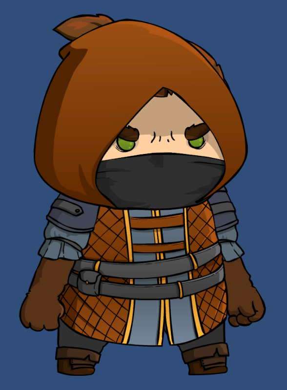
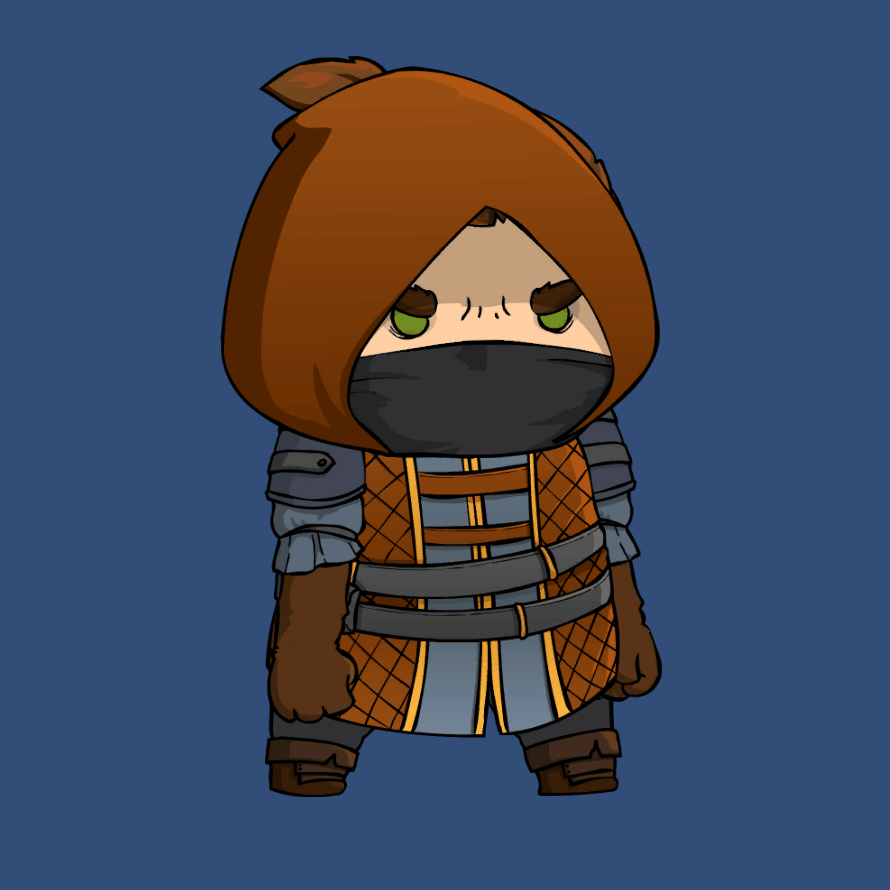

---
categories:
- unity
- log
date: '2020-10-19'
description: Back to it.
hide: false
search_exclude: false
title: Barracuda Pose Estimation Project Log Pt. 5

aliases:
- /Barracuda-Pose-Estimation-Project-Log-5/
- /log/project/unity/2020/10/19/Barracuda-Pose-Estimation-Project-Log-5
---

### Update 7/31/2021: [Barracuda PoseNet Tutorial 2nd Edition](../../barracuda-posenet-tutorial-v2/part-1/)

In further proof that you should never skip days when trying to form a new habit, I allowed myself to get completely distracted over past few weeks. There really are too many cool things to try out in the machine learning space these days. Although, if I'm being honest, I probably allowed myself to get distracted in the first place because I wasn't sure what I wanted to work on next in the pose estimation project. I think it's almost time to move on from 2D to 3D pose estimation models. However, there are some things I want to try out before making that jump. First things first though. I did actually make a bit more progress before getting sidetracked.

### 2D Sprite Animation

Having fixed the swapped offsets, I've started working on mapping the estimated key point locations to a 2D sprite. Before I could do that though, I had to learn about 2D character rigging. Fortunately, [Brackeys](https://www.youtube.com/channel/UCYbK_tjZ2OrIZFBvU6CCMiA) has a great [video](https://www.youtube.com/watch?v=eXIuizGzY2A) explaining how to do it. The sprite used in the video doesn't seem to be available anymore so I also had learn how to setup my own. I decided to go with this one from the [Mighty Heroes (Rogue) 2D Fantasy Characters Pack](https://assetstore.unity.com/packages/2d/characters/mighty-heroes-rogue-2d-fantasy-characters-pack-85770) for no particular reason.

{fig-align="center"}

It turns out that 2D sprites are super tiny compared to the range of input resolutions I use for the pose estimation model. My current solution for resolving the size difference involves scaling key point locations based on the relative distances between joints. For example, I get the scale for the left wrist location by dividing the distance between the shoulder and the elbow for the sprite by the distance between the estimated location for the user's shoulder and elbow.

There's also the small issue that the estimated key point locations are dependent on the user's location in the image. I decided to separate the estimated key point locations from the user's location in frame by getting the relative distance between key points. I then used that information to offset the sprite's key points.

This actually worked pretty well when combined with Unity's 2D character rigging package. There is a bit of shakiness introduced from my current method of updating the key point locations. Right now, the game objects that are mapped to the processed output from the model basically teleport to the latest position. It should be easy to resolve the shakiness by using conventional methods for smoothly updating a game object's position in Unity. 

### My Results:
{fig-align="center"}

This 2D sprite turned out not to be ideal for testing out a full range of poses. It's drawn facing towards one side of the screen which makes it a bit awkward when testing out the joint mappings. Ideally, the sprite would be facing directly towards the user.

### Updates on Post Processing Optimization

There may be hope yet for doing the post processing on the GPU. Updates to Barracuda have fixed some of the bugs with custom models. I can now use a [GlobalMaxPooling](https://docs.unity3d.com/Packages/com.unity.barracuda@1.0/api/Unity.Barracuda.ModelBuilder.html#Unity_Barracuda_ModelBuilder_GlobalMaxPool2D_System_String_System_Object_) layer to get the max value for each of the key point heatmaps on the GPU. Unfortunately, I still need to iterate through the heatmap tensors on the CPU find the indices the max values are located at. There's a very slight improvement in FPS since I only need to iterate up to the index with the with the matching value for each heatmap. However, this might not be necessary for much longer.

The current preview release for Barracuda adds a [TopKIndices](https://docs.unity3d.com/Packages/com.unity.barracuda@1.1/api/Unity.Barracuda.ModelBuilder.html#Unity_Barracuda_ModelBuilder_TopKIndices_System_String_System_Object_System_Object_System_Int32_System_Boolean_System_Boolean_) layer. According to the documentation, this layer retrieves the indices for the top-K largest (or smallest) elements along the specified axis. That sounds perfect! There is one slight problem. It doesn't seem to work yet. 

It could be that I haven't figured out how to use the layer properly. After digging through the source code, it seems the [TopKIndices](https://docs.unity3d.com/Packages/com.unity.barracuda@1.1/api/Unity.Barracuda.ModelBuilder.html#Unity_Barracuda_ModelBuilder_TopKIndices_System_String_System_Object_System_Object_System_Int32_System_Boolean_System_Boolean_) layer expects another layer object as the k parameter. I'm not sure what to do with that. I would have thought that k would just be an integer. Perhaps it wants an input layer that specifies k? It's also possible that the functionality for the layer hasn't been fully implemented yet. This release does seem quite buggy. I think I'll wait until it's out of preview before spending more time with it.

<!-- Cloudflare Web Analytics --><!-- End Cloudflare Web Analytics -->