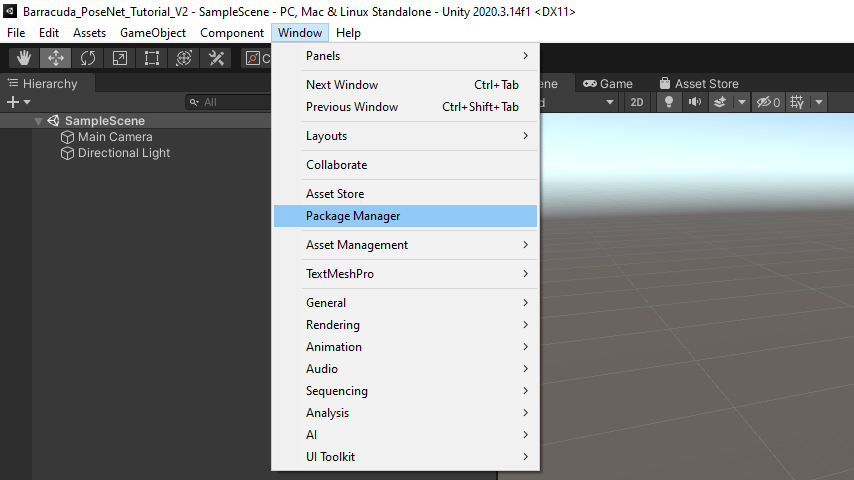
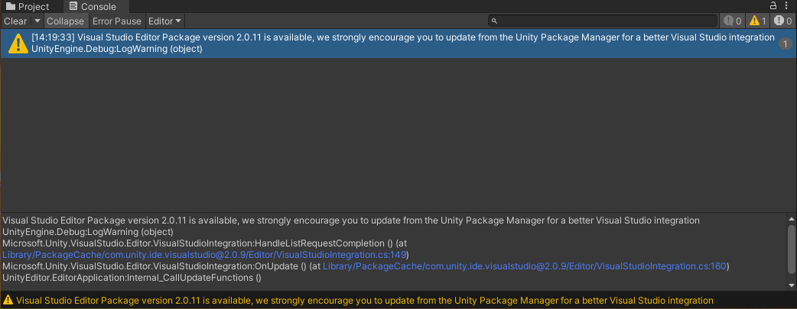
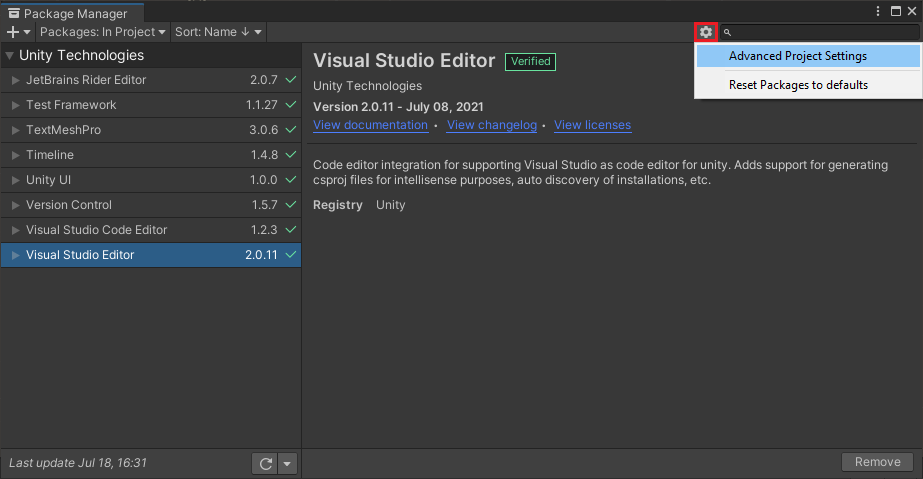
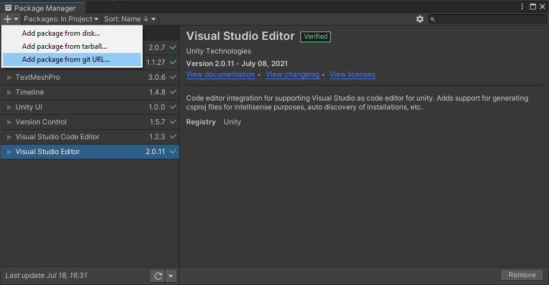
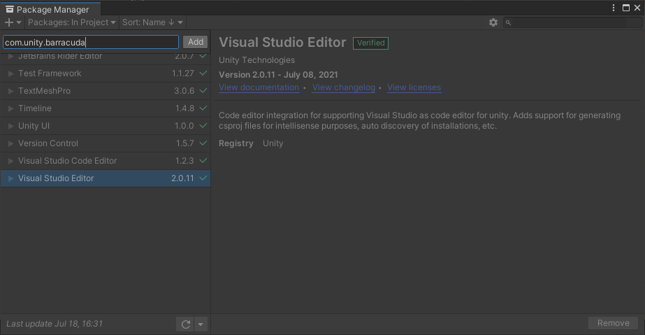
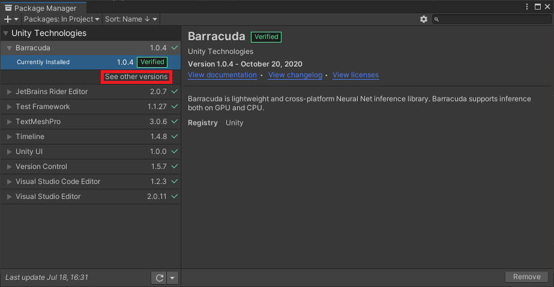
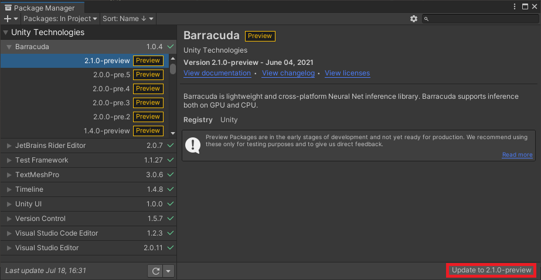
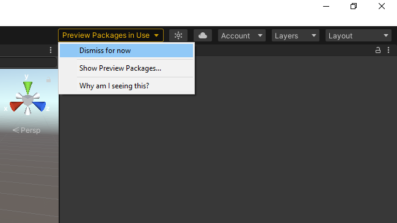
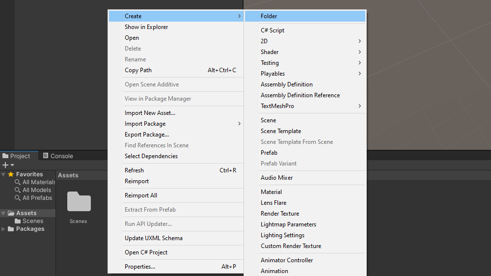
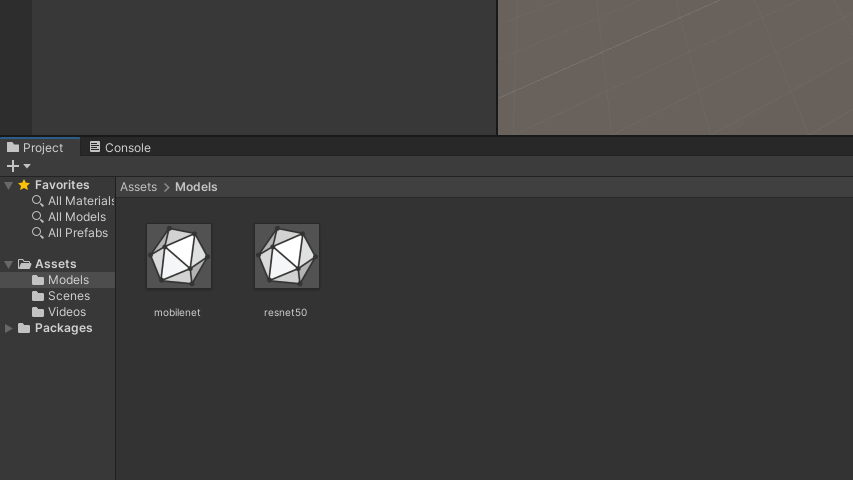

* [Introduction](#introduction)
* [Overview](#overview)
* [Prerequisites](#prerequisites)
* [Create a New Project](#create-a-new-project)
* [Install Barracuda Package](#install-barracuda-package)
* [Import Video Files](#import-video-files)
* [Import ONNX Models](#import-onnx-models)
* [Summary](#summary)


## Introduction

This tutorial series provides step-by-step instructions for how to perform human [pose estimation](https://www.fritz.ai/pose-estimation/) in [Unity](https://unity.com/) with the [Barracuda](https://docs.unity3d.com/Packages/com.unity.barracuda@2.1/manual/index.html) inference library. We will be using a pretrained [PoseNet](https://medium.com/tensorflow/real-time-human-pose-estimation-in-the-browser-with-tensorflow-js-7dd0bc881cd5) model to estimate the 2D locations of key points on the bodies of one or more individuals in a [video frame](https://en.wikipedia.org/wiki/Film_frame). We will then use the output from the model to control the locations of [`GameObjects`](https://docs.unity3d.com/ScriptReference/GameObject.html) in a scene.

### Single Pose Demo

<iframe width=100% height=480 src="https://www.youtube.com/embed/KQyJgXss9NA" title="YouTube video player" frameborder="0" allow="accelerometer; autoplay; clipboard-write; encrypted-media; gyroscope; picture-in-picture" allowfullscreen></iframe>


### Multi-Pose Demo

<iframe width=100% height="480" src="https://www.youtube.com/embed/F995ZadTZik" title="YouTube video player" frameborder="0" allow="accelerometer; autoplay; clipboard-write; encrypted-media; gyroscope; picture-in-picture" allowfullscreen></iframe>


## Overview

This post covers the process for installing the Barracuda package as well as importing the required video files and PoseNet models into the project.


## Prerequisites

The following prerequisites are required to complete this tutorial.

### Unity

This tutorial assumes that Unity is already installed on the system. We will be using Unity **2020**, and the exact version can be downloaded from the link below. 

* [Unity 2020.3.14](unityhub://2020.3.14f1/d0d1bb862f9d)

Anyone who has never used Unity before can become acquainted with the basics by following the tutorial below. It will walk through the installation process all the way to making an Angry Birds clone.

- [How to Make a Game - Unity Beginner Tutorial](https://www.youtube.com/watch?v=Lu76c85LhGY)

### Hardware

There appears to be a [known issue](https://forum.unity.com/threads/video-player-throws-got-null-handle-from-idxgiresource-getsharedhandle-on-some-windows-computers.890032/) with playing videos in Unity on AMD GPUs. Therefore, an Intel or Nvidia GPU is recommended. However, webcams seem to work fine on AMD GPUs.


## Create a New Project

First, we need to create a new Unity project. We can use the default 3D template.

> **Note:** There appears to currently be an issues with the 2D template where Barracuda does not work when the project is built.


## Install Barracuda Package

We will start by installing the Barracuda package. This will allow us to import the PoseNet models into the project. Open the `Window` menu at the top of the Unity Editor and select `Package Manager`.



There might be a message in the console indicating that there is a new version of the Visual Studio Editor package. 



Feel free to update the package by selecting it in the Package Manager and clicking the `Update` button.


We will be using version `2.1.0` of the Barracuda package. Unity has this version marked as preview, so we will need to enable preview packages to install it. Click the small gear icon and select the `Advanced Project Settings` option. 



Tick the `Enable Preview Packages` checkbox so that we can install the latest version of Barracuda.


A popup window will appear, warning us that preview packages might not be ready for production. However, the latest version of Barracuda contains bug fixes that are not present in the `Verified` version, so click `I understand` in the popup window.


Even though there is a verified version of Barracuda, it is not available in the package manager by default. We need to either install a package that has it as a dependency (e.g. [ML Agents](https://unity.com/products/machine-learning-agents)) or add it directly with a git URL. Click on the `+` icon in the upper-left corner and select `Add package from git URL...`.



Enter `com.unity.barracuda` into the search box and click `Add`. This will install the latest `Verified` version of the package. Unfortunately, there is a bug with this version that causes an error when performing inference on the CPU. This is resolved in later versions.




> **Note:** The version of Barracuda that we will be using in this tutorial is not available through the package manager in Unity **2021** at the time of writing. You will need to manually update the value for `"com.unity.barracuda"` in the `Project_Folder/Packages/manifest.json` file from `"1.0.4"` to `"2.1.0-preview"` as shown below. The package will be marked as `Experimental` in the editor.

```json
"dependencies": {
    "com.unity.barracuda": "2.1.0-preview",
    "com.unity.collab-proxy": "1.5.7",
    "com.unity.ide.rider": "2.0.7",
    "com.unity.ide.visualstudio": "2.0.11",
    "com.unity.ide.vscode": "1.2.3",
```


We can view more recent versions of the package by clicking `See other versions`.



Scroll all the way up to version `2.1.0-preview` and click the `Update to 2.1.0-preview` button in the bottom-right corner.



During the installation process a popup window will appear indicating that the version of the [Burst compiler](https://docs.unity3d.com/Packages/com.unity.burst@1.3/manual/index.html) has changed. Click OK to close the window. Once the installation process has finished, close Unity and then reopen the project.


Unity seems to be concerned that anyone who jumps through the multiple hoops to install a preview package might forget that they are indeed using a preview package. To eliminate this possibility, they have added a reminder at the top of the editor that can not be permanently removed.




## Import Video Files

We will be using these two videos available on [Pexels](https://www.pexels.com/), a free stock photos & videos site. The first one is for testing single pose estimation and only has one person in frame at a time. The second video is meant for testing multipose estimation and has several individuals in frame at varying distances from the camera. Download the videos in `Full HD` resolution.

1. [Two Young Men Doing a Boardslide Over a Railing](https://www.pexels.com/video/two-young-men-doing-a-boardslide-over-a-railing-4824358/)

   > **Note:** Renamed to `pexels_boardslides`

2. [Teens Riding Skateboard Doing Grind Rail](https://www.pexels.com/video/teens-riding-skateboard-doing-grind-rail-5039831/)

   > **Note:** Renamed to `pexels_teens_riding_skateboard_doing_grind_rail`

### Add Files to Assets

In the `Assets` section, right-click an empty space, select the `Create` option, and click `Folder`. Name the folder `Videos`. Double-click the `Videos` folder to open it.




Drag and drop the two video files from the File Explorer into the `Videos` folder.


## Import ONNX Models

We will cover how to use two different versions of the PoseNet model. The [MobileNet](https://paperswithcode.com/method/mobilenetv2) version is optimized to run efficiently on CPUs at the cost of some accuracy. The [ResNet50](https://paperswithcode.com/method/resnet) version is noticeably more accurate, but is more computationally demanding. 

### Download Files

The model files used in this tutorial series can be downloaded from the links below.

* **MobileNet**: ([download](https://drive.google.com/file/d/1vWZ-Y7xUvKmoNZUwKAmRT8JLZBZonZ_s/view?usp=sharing))
* **ResNet50**: ([download](https://drive.google.com/file/d/1Xc6Hw2UfkbH26pdarR8FuvcM8Xlx8G4R/view?usp=sharing))

### Add Files to Assets

Back in the Assets section, create a new folder called `Models`. Drag and drop the ONNX files from the File Explorer into the `Models` folder.




## Summary

That takes care of the preliminary setup for the project. The next post will cover how to play and view videos inside Unity from both video files and a webcam.

**Next:** [Part 2](../part-2/)

**Project Resources:** [GitHub Repository](https://github.com/cj-mills/Barracuda-PoseNet-Tutorial)


<!-- Cloudflare Web Analytics --><script defer src='https://static.cloudflareinsights.com/beacon.min.js' data-cf-beacon='{"token": "56b8d2f624604c4891327b3c0d9f6703"}'></script><!-- End Cloudflare Web Analytics -->