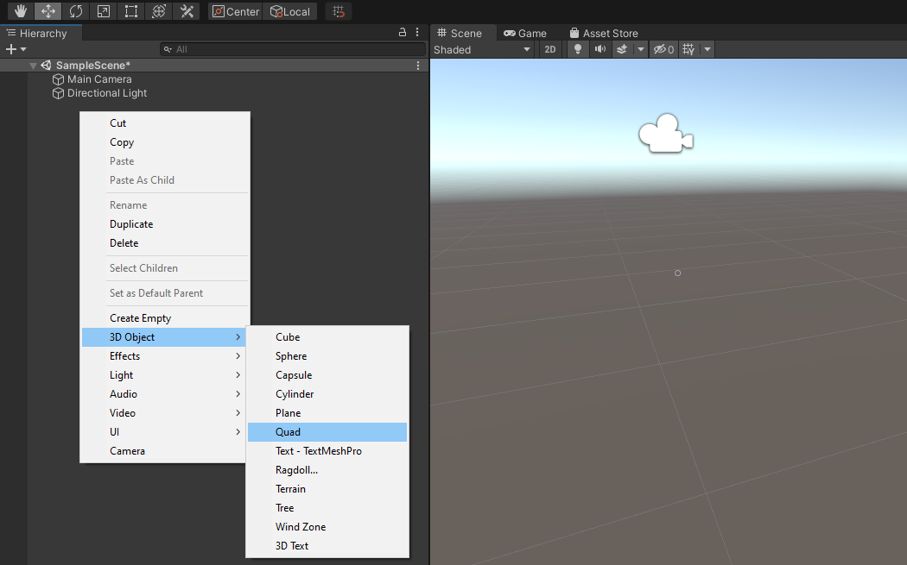
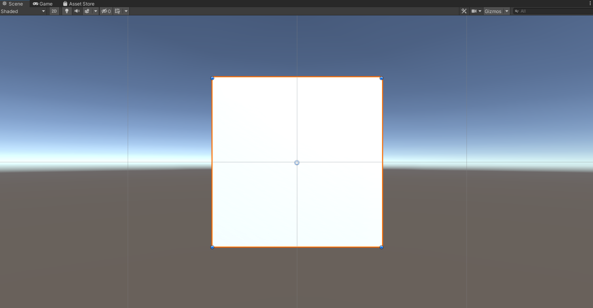
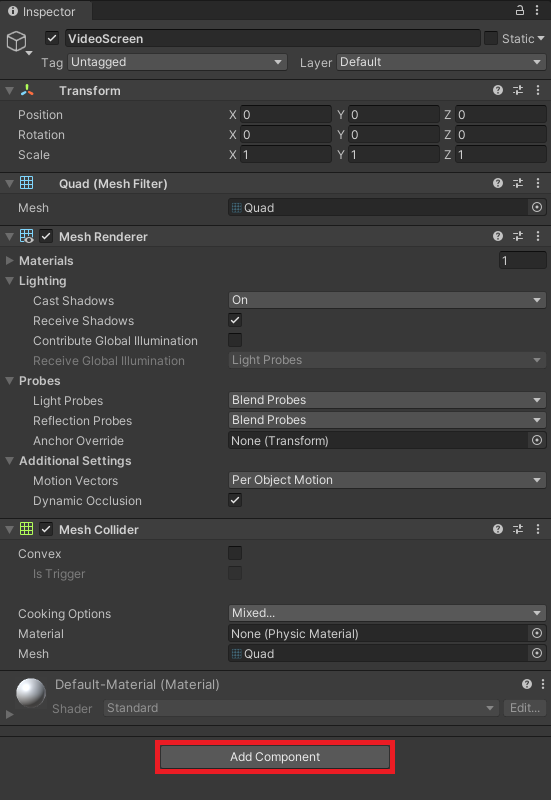
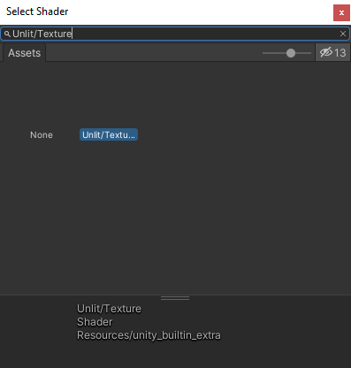
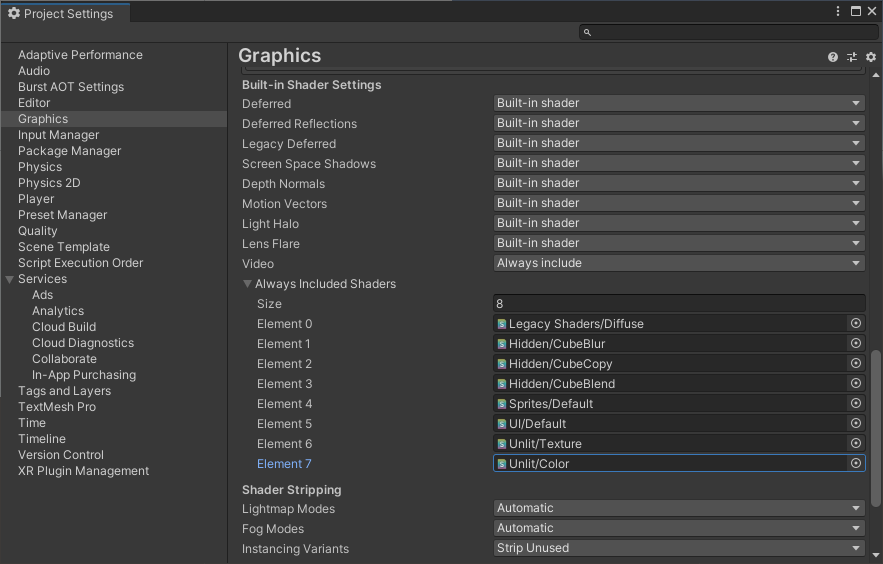
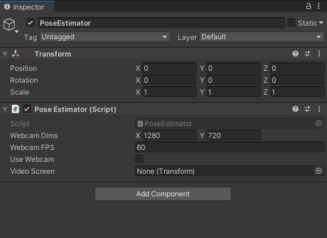

* [Overview](#overview)
* [Create the Video Player](#create-the-video-player)
* [Create `PoseEstimator` Script](#create-poseestimator-script)
* [Test it Out](#test-it-out)
* [Summary](#summary)


**Update 7/6/2022:** Fixed a [code discrepancy](https://github.com/cj-mills/christianjmills/issues/29) between the blog post and the GitHub repository.


## Overview

This post demonstrates how to play and view videos inside Unity from both video files and a webcam. We'll later perform pose estimation on individual frames while the video is playing. We can gauge the model's accuracy by comparing the estimated key point locations to the source video.


## Create the Video Player

To start, we will create a new `GameObject` to play and view a video feed. 

### Create the Video Screen

We will use a [Quad](https://docs.unity3d.com/Manual/PrimitiveObjects.html) object for the screen. Right-click an empty space in the `Hierarchy` tab. Select the `3D Object` section and click `Quad`. We can just name it `VideoScreen`.



Since we are only working in 2D, we can switch the scene to 2D view by clicking the `2D` button in the scene tab.


This will remove perspective from the scene view and align it with the `VideoScreen`.



We will be updating the `VideoScreen` dimensions in code based on the resolution of the video or webcam feed.

### Add Video Player Component

Unity has a [Video Player component](https://docs.unity3d.com/Manual/class-VideoPlayer.html) that provides the functionality to attach video files to the `VideoScreen`. With the `VideoScreen` object selected in the Hierarchy tab, click the `Add Component` button in the Inspector tab.



Type `video` into the search box and select `Video Player` from the search results.


### Assign Video Clip

Video files can be assigned by dragging them from the Assets section into the [`Video Clip`](https://docs.unity3d.com/ScriptReference/Video.VideoClip.html) spot in the Inspector tab. We will start with the `pexels_boardslides` file.


### Make the Video Loop

Tick the `Loop` checkbox in the `Inspector` tab to make the video repeat when the project is running.


## Create `PoseEstimator` Script

We will be adjusting both the `VideoScreen` and `Main Camera` objects in the script where the PoseNet model will be executed.

Create a new folder in the Assets section and name it `Scripts`. Enter the Scripts folder and right-click an empty space. Select `C# Script` in the `Create` submenu and name it `PoseEstimator`.


Double-click the new script to open it in the code editor.


### Add Required Namespace

We first need to add the `UnityEngine.Video` namespace to access the functionality for the `Video Player` component. Add the line `using UnityEngine.Video;` at the top of the script.

```c#
using System.Collections;
using System.Collections.Generic;
using UnityEngine;
using UnityEngine.Video;
```


### Define Public Variables

We can specify a desired resolution and framerate for webcams in Unity. If the provided resolution and framerate is not supported by the hardware, Unity will use a default resolution.

We will specify the desired webcam resolution using a `public` [`Vector2Int`](https://docs.unity3d.com/ScriptReference/Vector2Int.html) variable called `webcamDims`. Set the default values to `1280x720`.

Next, create a `public` [`int`](https://docs.microsoft.com/en-us/dotnet/csharp/language-reference/builtin-types/integral-numeric-types) variable called `webcamFPS` and give it a default value of `60`.

We will use a `public` [`bool`](https://docs.microsoft.com/en-us/dotnet/csharp/language-reference/builtin-types/bool) variable to toggle between using a video file or webcam as input for the model. Set the default value to `false` as we will be starting with a video file.

Lastly, create a `public` [`Transform`](https://docs.unity3d.com/ScriptReference/Transform.html) variable called `videoScreen`. We will use this variable to access the `VideoScreen` object and its `Video Player` component.

```c#
public class PoseEstimator : MonoBehaviour
{
    [Tooltip("The requested webcam dimensions")]
    public Vector2Int webcamDims = new Vector2Int(1280, 720);

    [Tooltip("The requested webcam frame rate")]
    public int webcamFPS = 60;

    [Tooltip("Use webcam feed as input")]
    public bool useWebcam = false;

    [Tooltip("The screen for viewing preprocessed images")]
    public Transform videoScreen;
```

### Define Private Variables

We need a `private` [`WebCamTexture`](https://docs.unity3d.com/ScriptReference/WebCamTexture.html) variable to access the video feed from a webcam.

We will store the final dimensions from either the video or webcam feed in a `private Vector2Int` variable called `videoDims`.

The last variable we need is a `private` [`RenderTexture`](https://docs.unity3d.com/ScriptReference/RenderTexture.html) variable called `videoTexture`. This will store the pixel data for the current video or webcam frame.

```c#
// Live video input from a webcam
private WebCamTexture webcamTexture;

// The dimensions of the current video source
private Vector2Int videoDims;

// The source video texture
private RenderTexture videoTexture;
```


### Create `InitializeVideoScreen()` Method

We will update the position, orientation, and size of the `VideoScreen` object in a new method called `InitializeVideoScreen`. The method will take in width and height value along with a `bool` to indicate whether to mirror the screen. When using a webcam, we need to mirror the `VideoScreen` object so that the user's position is mirrored on screen (e.g. their right side is on the right side of the screen).

First, we will set the video player component to render to a `RenderTexture` and set `videoTexture` as the target texture.

When `mirrorScreen` is set to `true` the `VideoScreen` will be rotated `180` around the Y-Axis and scaled by `-1` along the Z-Axis.

The default [shader](https://docs.unity3d.com/ScriptReference/Shader.html) assigned to the `VideoScreen` object needs to be replaced with an `Unlit/Texture` shader. This will remove the need for the screen to be lit by an in-game light.

> **Important:** By default, the `Unlit/Texture` shader is not included in project builds. We need to manually include it in the project settings
>
> Open the `Edit` menu in the Unity Editor and select `Project Settings`
>
> 
>
> In the Project Settings window, select the `Graphics` submenu and scroll down to the `Always Included Shaders` section. Update the `Size` value to add an extra `Element` spot.
>
> 
>
> Select the new bottom shader spot.
>
> 
>
> Type `Unlit/Texture` shader into the `Select Shader` window and select `Unlit/Texture` from the available options. We can then close the `Select Shader` window.
>
> 
>
> We will also need the `Unlit/Color` shader later in this series so repeat these steps to add it as well.
>
> 


We will then assign the `videoTexture` created earlier as the texture for the `VideoScreen`. This will allow us to access to pixel data for the current video frame.

We can adjust the dimensions of the `VideoScreen` object by updating it's [`localScale`](https://docs.unity3d.com/ScriptReference/Transform-localScale.html) attribute.

The last step is to reposition the screen based on the the new dimensions, so that the bottom left corner is at `X:0, Y:0, Z:0`. This will simplify the process for updating the positions of objects with the estimated key point locations.


```c#
/// <summary>
/// Prepares the videoScreen GameObject to display the chosen video source.
/// </summary>
/// <param name="width"></param>
/// <param name="height"></param>
/// <param name="mirrorScreen"></param>
private void InitializeVideoScreen(int width, int height, bool mirrorScreen)
{
    // Set the render mode for the video player
    videoScreen.GetComponent<VideoPlayer>().renderMode = VideoRenderMode.RenderTexture;

    // Use new videoTexture for Video Player
    videoScreen.GetComponent<VideoPlayer>().targetTexture = videoTexture;
    
    if (mirrorScreen)
    {
        // Flip the VideoScreen around the Y-Axis
        videoScreen.rotation = Quaternion.Euler(0, 180, 0);
        // Invert the scale value for the Z-Axis
        videoScreen.localScale = new Vector3(videoScreen.localScale.x, videoScreen.localScale.y, -1f);
    }

    // Apply the new videoTexture to the VideoScreen Gameobject
    videoScreen.gameObject.GetComponent<MeshRenderer>().material.shader = Shader.Find("Unlit/Texture");
    videoScreen.gameObject.GetComponent<MeshRenderer>().material.SetTexture("_MainTex", videoTexture);
    // Adjust the VideoScreen dimensions for the new videoTexture
    videoScreen.localScale = new Vector3(width, height, videoScreen.localScale.z);
    // Adjust the VideoScreen position for the new videoTexture
    videoScreen.position = new Vector3(width / 2, height / 2, 1);
}
```


### Create `InitializeCamera()` Method

Once the `VideoScreen` has been updated, we need to resize and reposition the in-game camera. We will do so in a new method called `InitializeCamera`. 

We can access the `Main Camera` object with [`GameObject.Find("Main Camera")`](https://docs.unity3d.com/ScriptReference/GameObject.Find.html).  We will set the `X` and `Y` coordinates to the same as the `VideoScreen` position.

The camera also needs to be set to [`orthographic`](https://docs.unity3d.com/ScriptReference/Camera-orthographic.html) mode to remove perspective.

Lastly, we need to update the size of the camera. The [`orthographicSize`](https://docs.unity3d.com/ScriptReference/Camera-orthographicSize.html) attribute is actually the half size, so we need to divide `videoDims.y` (i.e. the height) by `2` as well.

```c#
/// <summary>
/// Resizes and positions the in-game Camera to accommodate the video dimensions
/// </summary>
private void InitializeCamera()
{
    // Get a reference to the Main Camera GameObject
    GameObject mainCamera = GameObject.Find("Main Camera");
    // Adjust the camera position to account for updates to the VideoScreen
    mainCamera.transform.position = new Vector3(videoDims.x / 2, videoDims.y / 2, -10f);
    // Render objects with no perspective (i.e. 2D)
    mainCamera.GetComponent<Camera>().orthographic = true;
    // Adjust the camera size to account for updates to the VideoScreen
    mainCamera.GetComponent<Camera>().orthographicSize = videoDims.y / 2;
}
```


### Modify `Start()` Method

In the [`Start`](https://docs.unity3d.com/ScriptReference/MonoBehaviour.Start.html) method, we will first check if `useWebcam` is set to `true`. If it is, we will first limit the target framerate to the same as the target framerate for the webcam. We will then initialize the `webcamTexture` with the specified resolution and framerate. We will also disable the `Video Player` component. Lastly, we will update the values for `videoDims` with the final dimensions for the `webcamTexture`.

If we are not using a webcam, we will instead update `videoDims` with the dimensions from the `Video Player` component.

Next, we need to initialize the `videoTexture` with the new dimensions and the [`ARGBHalf`](https://docs.unity3d.com/ScriptReference/RenderTextureFormat.ARGBHalf.html) HDR texture format. We [need](https://docs.unity3d.com/Packages/com.unity.barracuda@2.1/api/Unity.Barracuda.Tensor.html#Unity_Barracuda_Tensor__ctor_UnityEngine_Texture_System_Int32_System_String_) to use an HDR texture format so that we can store color values outside the standard Unity range of `[0,1]`. The MobileNet version of the PoseNet model expects values to be in the range `[-1,1]` while the ResNet50 version expects values in the range `[0,255]`.

We will then call the `InitializeVideoScreen()` and `InitializeCamera()` methods. 

```c#
// Start is called before the first frame update
void Start()
{
    if (useWebcam)
    {
        // Limit application framerate to the target webcam framerate
        Application.targetFrameRate = webcamFPS;
        
        // Create a new WebCamTexture
        webcamTexture = new WebCamTexture(webcamDims.x, webcamDims.y, webcamFPS);

        // Start the Camera
        webcamTexture.Play();

        // Deactivate the Video Player
        videoScreen.GetComponent<VideoPlayer>().enabled = false;

        // Update the videoDims.y
        videoDims.y = webcamTexture.height;
        // Update the videoDims.x
        videoDims.x = webcamTexture.width;
    }
    else
    {
        // Update the videoDims.y
        videoDims.y = (int)videoScreen.GetComponent<VideoPlayer>().height;
        // Update the videoDims.x
        videoDims.x = (int)videoScreen.GetComponent<VideoPlayer>().width;
    }

    // Create a new videoTexture using the current video dimensions
    videoTexture = RenderTexture.GetTemporary(videoDims.x, videoDims.y, 24, RenderTextureFormat.ARGBHalf);

    // Initialize the videoScreen
    InitializeVideoScreen(videoDims.x, videoDims.y, useWebcam);

    // Adjust the camera based on the source video dimensions
    InitializeCamera();
}
```


### Modify `Update()` Method

For now, the only thing we need to do in the [`Update`](https://docs.unity3d.com/ScriptReference/MonoBehaviour.Update.html) method is to "copy" the pixel data from `webcamTexture` to `videoTexture` when using a webcam.

```c#
// Update is called once per frame
void Update()
{
    // Copy webcamTexture to videoTexture if using webcam
    if (useWebcam) Graphics.Blit(webcamTexture, videoTexture);
}
```


## Create `PoseEstimator` Object

With the required code completed, we just need to attach the script to a `GameObject`. Right-click an empty space in the Hierarchy tab and select `Create Empty`. Name the new object `PoseEstimator`.


### Attach `PoseEstimator` Script

With the `PoseEstimator` object selected in the Hierarchy tab, drag and drop the `PoseEstimator` script into the Inspector tab.



#### Assign `VideoScreen` Object

Drag and drop the VideoScreen object from the Hierarchy tab into the `Video Screen` spot in the Inspector tab.


## Test it Out

Now we can press the play button to test out the video player.

> **Note:** By default the `Aspect` for the [Game view](https://docs.unity3d.com/Manual/GameView.html) is set to `Free Aspect`, so the `VideoScreen` might not fill the entire view.


## Summary

We now have a video player that we can use to feed input to the PoseNet model. In the next post, we will implement the preprocessing steps for the PoseNet models.

**Previous:** [Part 1](../part-1/)

**Next:** [Part 3](../part-3/)

**Project Resources:** [GitHub Repository](https://github.com/cj-mills/Barracuda-PoseNet-Tutorial)


<!-- Cloudflare Web Analytics --><script defer src='https://static.cloudflareinsights.com/beacon.min.js' data-cf-beacon='{"token": "56b8d2f624604c4891327b3c0d9f6703"}'></script><!-- End Cloudflare Web Analytics -->