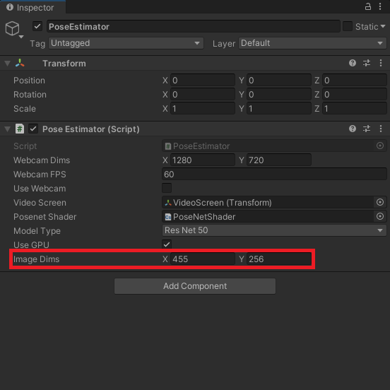
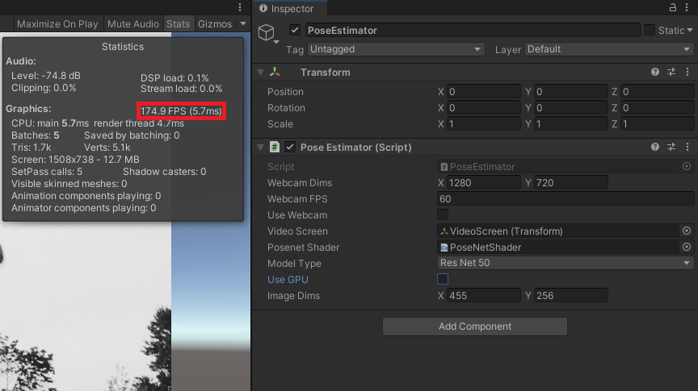

* [Overview](#overview)
* [Create Compute Shader](#create-compute-shader)
* [Create Utils Script](#create-utils-script)
* [Update `PoseEstimator` Script](#update-poseestimator-script)
* [Assign `PoseNetShader`](#assign-posenetshader)
* [Test it Out](#test-it-out)
* [Summary](#summary)


## Overview

The MobileNet and ResNet50 versions of the PoseNet model require different preprocessing steps. While it is more efficient to perform these steps on a GPU with a [Compute shader](https://docs.unity3d.com/Manual/class-ComputeShader.html), this may not be supported by the target platform. Therefore, we will also cover how to perform the preprocessing steps on the CPU as well. 

> **Note:** We will be manually toggling between using the CPU and GPU in this tutorial. For real-world applications, we can determine if the target system supports compute shaders with the [SystemInfo](https://docs.unity3d.com/ScriptReference/SystemInfo.html).[supportsComputeShaders](https://docs.unity3d.com/ScriptReference/SystemInfo-supportsComputeShaders.html) property.

 

## Create Compute Shader

We will start by implementing the preprocessing steps in a compute shader to execute them on a GPU. In the Assets section, create a new folder called `Shaders`. Enter the Shaders folder and right-click an empty space. Open the `Create` submenu and select `Shader`. Inside the Shader submenu, select `Compute Shader`. We can name the new shader `PoseNetShader`.

{fig-align="center"}

Double-click the new shader to open it in the code editor. By default, Compute shaders contain the following code. Go ahead and delete all the default code.

```c#
// Each #kernel tells which function to compile; you can have many kernels
#pragma kernel CSMain

// Create a RenderTexture with enableRandomWrite flag and set it
// with cs.SetTexture
RWTexture2D<float4> Result;

[numthreads(8,8,1)]
void CSMain (uint3 id : SV_DispatchThreadID)
{
    // TODO: insert actual code here!

    Result[id.xy] = float4(id.x & id.y, (id.x & 15)/15.0, (id.y & 15)/15.0, 0.0);
}
```

### Specify Function Names

We will first add the [`#pragma`](https://docs.microsoft.com/en-us/windows/win32/direct3dhlsl/dx-graphics-hlsl-appendix-pre-pragma) [`kernel`](https://docs.unity3d.com/ScriptReference/ComputeShader.FindKernel.html) lines to indicate what functions we want to be compiled. Without them, we can not access these functions from the `PoseEstimator` script. We'll call the two functions `PreprocessMobileNet` and `PreprocessResNet` respectively.

```c#
// Each #kernel tells which function to compile; you can have many kernels
#pragma kernel PreprocessMobileNet
#pragma kernel PreprocessResNet
```

### Define Variables

We will need a [`Texture2D`](https://docs.microsoft.com/en-us/windows/win32/direct3dhlsl/sm5-object-texture2d) variable to store the pixel data for the input image that will be passed from the `PoseEstimator` script. We will give it a data type of [`half4`](https://docs.unity3d.com/Manual/SL-DataTypesAndPrecision.html), which is a medium precision 4D vector. Each 4D Vector will contain the [RGBA](https://en.wikipedia.org/wiki/RGBA_color_model) color and alpha values for a single pixel.

We also need a [`RWTexture2D`](https://docs.microsoft.com/en-us/windows/win32/direct3dhlsl/sm5-object-rwtexture2d) so that we can write the processed image data back to a RenderTexture in the PoseEstimator script. Give it a data type of half4 as well.

```c#
// The pixel data for the input image
Texture2D<half4> InputImage;
// The pixel data for the processed image
RWTexture2D<half4> Result;
```

### Create PreprocessMobileNet Function

Now we can define the functions we named earlier. We will stick with the default values for [`numthreads`](https://docs.microsoft.com/en-us/windows/win32/direct3dhlsl/sm5-attributes-numthreads) of `(8,8,1)`.

The MobileNet version of the model expects color values to be in the range `[-1,1]`. By default color values in Unity are in the range `[0,1]`. The alpha channel is not used by the model, so the value does not matter.

```c#
[numthreads(8, 8, 1)]
void PreprocessMobileNet(uint3 id : SV_DispatchThreadID)
{
    // Normalize the color values to the range [-1,1]
    //2 * (value - min) / (max - min) - 1
    Result[id.xy] = half4(
        2.0h * InputImage[id.xy].r / 1.0h - 1.0h,
        2.0h * InputImage[id.xy].g / 1.0h - 1.0h,
        2.0h * InputImage[id.xy].b / 1.0h - 1.0h, 
        InputImage[id.xy].a);
}
```

### Create PreprocessResNet Function

The ResNet50 version of the model expects color values to be in the range `[0,255]`. We also need to subtract the mean RGB color values for the [ImageNet dataset](https://image-net.org/about.php) to the pixel values. 

```c#
[numthreads(8, 8, 1)]
void PreprocessResNet(uint3 id : SV_DispatchThreadID)
{
    // Scale each color value to the range [0,255]
    // and add the ImageNet mean value
    Result[id.xy] = half4(
        InputImage[id.xy].r * 255.0h - 123.15h,
        InputImage[id.xy].g * 255.0h - 115.90h,
        InputImage[id.xy].b * 255.0h - 103.06h, 
        InputImage[id.xy].a);
}
```

### Final Code

```c#
// Each #kernel tells which function to compile; you can have many kernels
#pragma kernel PreprocessResNet
#pragma kernel PreprocessMobileNet

// The pixel data for the input image
Texture2D<half4> InputImage;
// The pixel data for the processed image
RWTexture2D<half4> Result;

[numthreads(8, 8, 1)]
void PreprocessMobileNet(uint3 id : SV_DispatchThreadID)
{
    // Normalize the color values to the range [-1,1]
    //2 * (value - min) / (max - min) - 1
    Result[id.xy] = half4(
        2.0h * InputImage[id.xy].r / 1.0h - 1.0h,
        2.0h * InputImage[id.xy].g / 1.0h - 1.0h,
        2.0h * InputImage[id.xy].b / 1.0h - 1.0h, 
        InputImage[id.xy].a);
}

[numthreads(8, 8, 1)]
void PreprocessResNet(uint3 id : SV_DispatchThreadID)
{
    // Scale each color value to the range [0,255]
    // and add the ImageNet mean value
    Result[id.xy] = half4(
        InputImage[id.xy].r * 255.0h - 123.15h,
        InputImage[id.xy].g * 255.0h - 115.90h,
        InputImage[id.xy].b * 255.0h - 103.06h, 
        InputImage[id.xy].a);
}
```


## Create Utils Script

We will be placing the CPU preprocessing and postprocessing methods inside a separate `C#` script called `Utils`, to prevent the `PoseEstimator` script from getting too long.

### Remove MonoBehaviour Inheritance

The `Utils` class does not need to inherit from [Monobehavior](https://docs.unity3d.com/ScriptReference/MonoBehaviour.html) as it will not be directly attached to a `GameObject`.

```c#
public class Utils
```

### Create`PreprocessMobileNet` Method

The Barracuda library uses [Tensors](https://docs.unity3d.com/Packages/com.unity.barracuda@2.1/api/Unity.Barracuda.Tensor.html) to store data. These are like multidimensional arrays. We can download the data stored in a Tensor to a regular `float` array. We will pass this array as input to the preprocessing methods and then upload the new values to a Tensor.

> **Note:** Make sure to use the exact names for the methods as those in the Compute shader. 

```c#
/// <summary>
/// Applies the preprocessing steps for the MobileNet model on the CPU
/// </summary>
/// <param name="tensor">Pixel data from the input tensor</param>
public static void PreprocessMobileNet(float[] tensor)
{
    // Normaliz the values to the range [-1, 1]
    System.Threading.Tasks.Parallel.For(0, tensor.Length, (int i) =>
	{
        tensor[i] = (float)(2.0f * tensor[i] / 1.0f) - 1.0f;
    });
}
```

### Create `PreprocessResNet` Method

The color data for pixels is stored sequentially in the tensor array. For example, the first three values in the array would be the red, green, and blue color values for the first pixel in the image. The tensor data will not have an alpha channel, so we do not need to account for it here.

```c#
///// <summary>
///// Applies the preprocessing steps for the ResNet50 model on the CPU
///// </summary>
///// <param name="tensor">Pixel data from the input tensor</param>
public static void PreprocessResNet(float[] tensor)
{
    System.Threading.Tasks.Parallel.For(0, tensor.Length / 3, (int i) =>
	{
        tensor[i * 3 + 0] = (float)tensor[i * 3 + 0] * 255f - 123.15f;
        tensor[i * 3 + 1] = (float)tensor[i * 3 + 1] * 255f - 115.90f;
        tensor[i * 3 + 2] = (float)tensor[i * 3 + 2] * 255f - 103.06f;
    });
}
```


## Update PoseEstimator Script

Now we can call the preprocessing methods inside the `PoseEstimator` script. However, we first need to make some other additions.

### Add Barracuda Namespace

We need to add the `Unity.Barracuda` namespace so that we can work with [Tensors](https://docs.unity3d.com/Packages/com.unity.barracuda@2.1/api/Unity.Barracuda.Tensor.html).

```c#
using System.Collections;
using System.Collections.Generic;
using UnityEngine;
using UnityEngine.Video;
using Unity.Barracuda;
```

### Add Public Variables

We can define a `public` [enum](https://docs.microsoft.com/en-us/dotnet/csharp/language-reference/builtin-types/enum) for the two different model versions. We can use this to create a dropdown menu in the inspector tab to switch between the two options. We will name it `ModelType`.

```c#
public class PoseEstimator : MonoBehaviour
{
    public enum ModelType
    {
        MobileNet,
        ResNet50
    }
```

Next, we will need a `public ComputeShader` variable so that we can access the PoseNetShader. 

We can create a dropdown for selecting the model type by defining a `public ModelType` variable. We will set the default value to `ModelType.ResNet50`.

We also need a `public bool` variable to toggle between using the CPU and GPU for processing input.

Lastly, we need a `public VectorInt` variable to specify the dimensions of the input image. Using the original resolution of the video feed could significantly impact performance, so we will downscale the input image before feeding it to the model.

```c#
[Tooltip("The ComputeShader that will perform the model-specific preprocessing")]
public ComputeShader posenetShader;

[Tooltip("The model architecture used")]
public ModelType modelType = ModelType.ResNet50;

[Tooltip("Use GPU for preprocessing")]
public bool useGPU = true;

[Tooltip("The dimensions of the image being fed to the model")]
public Vector2Int imageDims = new Vector2Int(256, 256);
```

### Add Private Variables

We will be maintaining the aspect ratio of the source video feed when downscaling the input image. We need to keep track of the current input dimensions so that we know when to calculate the new dimensions. Create a new `private Vector2Int` variable called `targetDims`.

Next, create a `private float` variable called aspectRatioScale. This will store the scaling value to update the `targetDims`.

The pixel data for the input image will be stored in a new `private RenderTexture` variable called `rTex`.

We will be encapsulating the appropriate preprocessing method using the [`Action<T>`](https://docs.microsoft.com/en-us/dotnet/api/system.action-1?view=net-5.0) [delegate](https://docs.microsoft.com/en-us/dotnet/csharp/programming-guide/delegates/).

The last new variable we need is a Barracuda `Tensor` to store the input data for the model.

```c#
// Target dimensions for model input
private Vector2Int targetDims;

// Used to scale the input image dimensions while maintaining aspect ratio
private float aspectRatioScale;

// The texture used to create input tensor
private RenderTexture rTex;

// The preprocessing function for the current model type
private System.Action<float[]> preProcessFunction;

// Stores the input data for the model
private Tensor input;
```

### Update Start Method

At the bottom of the `Start` method, we need to adjust the input dimensions to maintain the source aspect ratio. We will use the height value to update the width for the input dimensions. We can then initialize `rTex` with the new input dimensions.

```c#
// Adjust the input dimensions to maintain the source aspect ratio
aspectRatioScale = (float)videoTexture.width / videoTexture.height;
targetDims.x = (int)(imageDims.y * aspectRatioScale);
imageDims.x = targetDims.x;

// Initialize the RenderTexture that will store the processed input image
rTex = RenderTexture.GetTemporary(imageDims.x, imageDims.y, 24, RenderTextureFormat.ARGBHalf);
```

#### Final Code

```c#
// Start is called before the first frame update
void Start()
{
    if (useWebcam)
    {
        // Limit application framerate to the target webcam framerate
        Application.targetFrameRate = webcamFPS;

        // Create a new WebCamTexture
        webcamTexture = new WebCamTexture(webcamDims.x, webcamDims.y, webcamFPS);

        // Start the Camera
        webcamTexture.Play();

        // Deactivate the Video Player
        videoScreen.GetComponent<VideoPlayer>().enabled = false;

        // Update the videoDims.y
        videoDims.y = webcamTexture.height;
        // Update the videoDims.x
        videoDims.x = webcamTexture.width;
    }
    else
    {
        // Update the videoDims.y
        videoDims.y = (int)videoScreen.GetComponent<VideoPlayer>().height;
        // Update the videoDims.x
        videoDims.x = (int)videoScreen.GetComponent<VideoPlayer>().width;
    }

    // Create a new videoTexture using the current video dimensions
    videoTexture = RenderTexture.GetTemporary(videoDims.x, videoDims.y, 24, RenderTextureFormat.ARGBHalf);

    // Initialize the videoScreen
    InitializeVideoScreen(videoDims.x, videoDims.y, useWebcam);

    // Adjust the camera based on the source video dimensions
    InitializeCamera();

    // Adjust the input dimensions to maintain the source aspect ratio
    aspectRatioScale = (float)videoTexture.width / videoTexture.height;
    targetDims.x = (int)(imageDims.y * aspectRatioScale);
    imageDims.x = targetDims.x;

    // Initialize the RenderTexture that will store the processed input image
    rTex = RenderTexture.GetTemporary(imageDims.x, imageDims.y, 24, RenderTextureFormat.ARGBHalf);
}
```

### Create ProcessImageGPU Method

Next, we’ll make a new method to execute the functions in our `ComputeShader`. This method will take in the image that needs to be processed as well as a function name to indicate which function we want to execute. As mentioned previously, we need to store the processed images in textures with HDR formats to use color values outside the default range of `[0,1]`.

#### Method Steps

1. Get the `ComputeShader` index for the specified function
2. Create a temporary `RenderTexture` with random write access enabled to store the processed image
3. Execute the `ComputeShader`
4. Copy the processed image back into the original `RenderTexture`
5. Release the temporary `RenderTexture`

#### Code

```c#
/// <summary>
/// Process the provided image using the specified function on the GPU
/// </summary>
/// <param name="image"></param>
/// <param name="functionName"></param>
/// <returns></returns>
private void ProcessImageGPU(RenderTexture image, string functionName)
{
    // Specify the number of threads on the GPU
    int numthreads = 8;
    // Get the index for the specified function in the ComputeShader
    int kernelHandle = posenetShader.FindKernel(functionName);
    // Define a temporary HDR RenderTexture
    RenderTexture result = RenderTexture.GetTemporary(image.width, image.height, 24, RenderTextureFormat.ARGBHalf);
    // Enable random write access
    result.enableRandomWrite = true;
    // Create the HDR RenderTexture
    result.Create();

    // Set the value for the Result variable in the ComputeShader
    posenetShader.SetTexture(kernelHandle, "Result", result);
    // Set the value for the InputImage variable in the ComputeShader
    posenetShader.SetTexture(kernelHandle, "InputImage", image);

    // Execute the ComputeShader
    posenetShader.Dispatch(kernelHandle, result.width / numthreads, result.height / numthreads, 1);

    // Copy the result into the source RenderTexture
    Graphics.Blit(result, image);

    // Release the temporary RenderTexture
    RenderTexture.ReleaseTemporary(result);
}
```

### Create ProcessImage Method

We will call the preprocessing functions inside a new method called `ProcessImage`. The method will take in a `RenderTexture` and update the `input` Tensor data.

#### Method Steps

1. Check whether to use the GPU
   1. If using GPU 
      1. Call `ProcessImageGPU()` method using the name of the `preProcessFunction`
      2. Initialize `input` with pixel data from `rTex`
   2. If using CPU
      1. Initialize `input` with pixel data from `rTex`
      2. Download Tensor data to `float` array
      3. Call the appropriate preprocessing function for the current model type
      4. Update `input` with the new color values

#### Code

```c#
/// <summary>
/// Calls the appropriate preprocessing function to prepare
/// the input for the selected model and hardware
/// </summary>
/// <param name="image"></param>
private void ProcessImage(RenderTexture image)
{
    if (useGPU)
    {
        // Apply preprocessing steps
        ProcessImageGPU(image, preProcessFunction.Method.Name);
        // Create a Tensor of shape [1, image.height, image.width, 3]
        input = new Tensor(image, channels: 3);
    }
    else
    {
        // Create a Tensor of shape [1, image.height, image.width, 3]
        input = new Tensor(image, channels: 3);
        // Download the tensor data to an array
        float[] tensor_array = input.data.Download(input.shape);
        // Apply preprocessing steps
        preProcessFunction(tensor_array);
        // Update input tensor with new color data
        input = new Tensor(input.shape.batch,
                           input.shape.height,
                           input.shape.width,
                           input.shape.channels,
                           tensor_array);
    }
}
```

### Modify Update Method

We will update the input dimensions and process the input inside the `Update` method. 

#### Clamp Input Dimensions

The model will not return useable output with input below 130px in size. There just isn't enough for information for the model to work with at that low of a resolution. Also, the model downscales the input internally by a set amount and might error out if the input is too low. To prevent this, we will ensure the input dimensions are at least `130x130`.  

```c#
// Prevent the input dimensions from going too low for the model
imageDims.x = Mathf.Max(imageDims.x, 130);
imageDims.y = Mathf.Max(imageDims.y, 130);
```

#### Calculate Input Dimensions

We need to adjust the input dimensions to maintain the source aspect ratio whenever they are updated by the user. We will check if the values for `inputDims` have changed by comparing them to `targetDims`.

```c#
// Update the input dimensions while maintaining the source aspect ratio
if (imageDims.x != targetDims.x)
{
    aspectRatioScale = (float)videoTexture.height / videoTexture.width;
    targetDims.y = (int)(imageDims.x * aspectRatioScale);
    imageDims.y = targetDims.y;
    targetDims.x = imageDims.x;
}
if (imageDims.y != targetDims.y)
{
    aspectRatioScale = (float)videoTexture.width / videoTexture.height;
    targetDims.x = (int)(imageDims.y * aspectRatioScale);
    imageDims.x = targetDims.x;
    targetDims.y = imageDims.y;
}
```

#### Update `rTex` Dimensions

We will also need to update `rTex` with the new input dimensions and copy the pixel data from the source `videoTexture` to it.

```c#
// Update the rTex dimensions to the new input dimensions
if (imageDims.x != rTex.width || imageDims.y != rTex.height)
{
    RenderTexture.ReleaseTemporary(rTex);
    // Assign a temporary RenderTexture with the new dimensions
    rTex = RenderTexture.GetTemporary(imageDims.x, imageDims.y, 24, rTex.format);
}

// Copy the src RenderTexture to the new rTex RenderTexture
Graphics.Blit(videoTexture, rTex);
```

#### Call ProcessImage Method

The `preProcessFunction` variable will be upated in a new function that will be covered in the next post. For now, we can add a temporary `if/else` statement to test the preprocessing functions. We will delete this statement in the next part of the tutorial.

```c#
if (modelType == ModelType.MobileNet)
{
    preProcessFunction = Utils.PreprocessMobileNet;
}
else
{
    preProcessFunction = Utils.PreprocessResNet;
}
```

Finally, we can call the `ProcessImage` method and pass `rTex` as input.

```c#
// Prepare the input image to be fed to the selected model
ProcessImage(rTex);
```

#### Final Code

```c#
// Update is called once per frame
void Update()
{
    // Copy webcamTexture to videoTexture if using webcam
    if (useWebcam) Graphics.Blit(webcamTexture, videoTexture);

    // Prevent the input dimensions from going too low for the model
    imageDims.x = Mathf.Max(imageDims.x, 64);
    imageDims.y = Mathf.Max(imageDims.y, 64);

    // Update the input dimensions while maintaining the source aspect ratio
    if (imageDims.x != targetDims.x)
    {
        aspectRatioScale = (float)videoTexture.height / videoTexture.width;
        targetDims.y = (int)(imageDims.x * aspectRatioScale);
        imageDims.y = targetDims.y;
        targetDims.x = imageDims.x;
    }
    if (imageDims.y != targetDims.y)
    {
        aspectRatioScale = (float)videoTexture.width / videoTexture.height;
        targetDims.x = (int)(imageDims.y * aspectRatioScale);
        imageDims.x = targetDims.x;
        targetDims.y = imageDims.y;
    }

    // Update the rTex dimensions to the new input dimensions
    if (imageDims.x != rTex.width || imageDims.y != rTex.height)
    {
        RenderTexture.ReleaseTemporary(rTex);
        // Assign a temporary RenderTexture with the new dimensions
        rTex = RenderTexture.GetTemporary(imageDims.x, imageDims.y, 24, rTex.format);
    }

    // Copy the src RenderTexture to the new rTex RenderTexture
    Graphics.Blit(videoTexture, rTex);


    if (modelType == ModelType.MobileNet)
    {
        preProcessFunction = Utils.PreprocessMobileNet;
    }
    else
    {
        preProcessFunction = Utils.PreprocessResNet;
    }

    // Prepare the input image to be fed to the selected model
    ProcessImage(rTex);
}
```


## Assign `PoseNetShader`

The last step we need to take before pressing play is to assign the `PoseNetShader` asset. Select the `PoseEstimator` object in the Hierarchy tab. Then, drag and drop the `PoseNetShader` asset from the Assets section onto its spot in the Inspector tab. 

{fig-align="center"}


## Test it Out

Now when we press play, we can see that the values for `Image Dims` get updated in the Inspector tab to maintain the source aspect ratio. We can change either the `X` or `Y` values and the other dimension will be automatically adjusted.

{fig-align="center"}

We can view the frame rate by pressing the `stats` button in the Game View. If we toggle `Use GPU` in the Inspector tab, we can see why it is preferrable to perform the preprocessing steps on the GPU. The frame rate drops significantly when using the CPU.

### GPU

{fig-align="center"}

### CPU

{fig-align="center"}


## Summary

Now that we have prepared the input, we are ready to feed it to the model. In the next post, we will cover how to initialize, modify, and execute the PoseNet models.


**Previous:** [Part 2](../part-2/)

**Next:** [Part 4](../part-4/)

**Project Resources:** [GitHub Repository](https://github.com/cj-mills/Barracuda-PoseNet-Tutorial)



