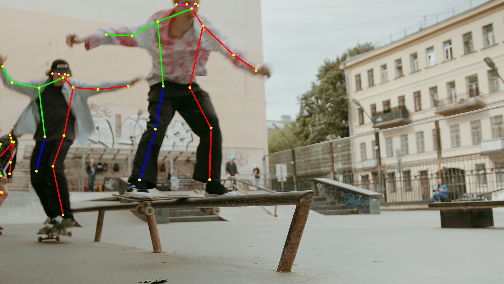

* [Overview](#overview)
* [Create `PoseSkeleton` Script](#create-poseskeleton-script)
* [Update `PoseEstimator` Script](#update-poseestimator-script)
* [Summary](#summary)


## Overview

In this post, we will cover how to create pose skeletons so that we can compare the estimated key point locations to the source video feed.


## Create `PoseSkeleton` Script

We will implement the functionality for creating pose skeletons in a new script. Open the `Scripts` folder in the Assets section and create a new `C#` script called `PoseSkeleton`. The `PoseSkeleton` class will handle creating a single pose skeleton and updating the positions of its key points. We will be creating as many `PoseSkeleton` instances as is specified by the `maxPoses` variable in the `PoseEstimator` script. 

### Add Required Namespace

We need to add the [`System`](https://docs.microsoft.com/en-us/dotnet/api/system?view=net-5.0) namespace as we will once again be using the [`Tuple`](https://docs.microsoft.com/en-us/dotnet/api/system.tuple-2?view=net-5.0) class.

```c#
using System.Collections;
using System.Collections.Generic;
using UnityEngine;
using System;
```

### Remove `MonoBehaviour` Inheritance

The `PoseSkeleton` class does not need to be a `MonoBehaviour` so we can remove it.

```c#
public class PoseSkeleton
```

### Add Variables

We will need a [`Transform`](https://docs.unity3d.com/ScriptReference/Transform.html) array to keep track of the positions of the key point objects in the scene.

We also need a `GameObject` array to store the lines connecting the key point objects.

Next, we will create a `static string` array to store the names of the key points predicted by the model. The names will be ordered based on their key point id number (e.g. nose is in index `0`).

The number of key point predicted by the model will not change, so we will store the number in a `static int` variable.

Much like the `parentChildrenTuples` variable in the `Utils` script, we will create a `Tuple` array to keep track of which key points should be connected by lines. We could actually just use the pairs from `parentChildrenTuples`, but the skeleton would look a bit weird.



Instead, we will make a pose skeleton that looks like this.


To help distinguish the different body areas, we will create a [`Color`](https://docs.unity3d.com/ScriptReference/Color.html) array so that we can specify what color we want each line to be.

Lastly, we need is a `float` variable to specify the line width for the pose skeleton lines.

```c#
// The list of key point GameObjects that make up the pose skeleton
public Transform[] keypoints;

// The GameObjects that contain data for the lines between key points
private GameObject[] lines;

// The names of the body parts that will be detected by the PoseNet model
private static string[] partNames = new string[]{
    "nose", "leftEye", "rightEye", "leftEar", "rightEar", "leftShoulder",
    "rightShoulder", "leftElbow", "rightElbow", "leftWrist", "rightWrist",
    "leftHip", "rightHip", "leftKnee", "rightKnee", "leftAnkle", "rightAnkle"
};

private static int NUM_KEYPOINTS = partNames.Length;

// The pairs of key points that should be connected on a body
private Tuple<int, int>[] jointPairs = new Tuple<int, int>[]{
    // Nose to Left Eye
    Tuple.Create(0, 1),
    // Nose to Right Eye
    Tuple.Create(0, 2),
    // Left Eye to Left Ear
    Tuple.Create(1, 3),
    // Right Eye to Right Ear
    Tuple.Create(2, 4),
    // Left Shoulder to Right Shoulder
    Tuple.Create(5, 6),
    // Left Shoulder to Left Hip
    Tuple.Create(5, 11),
    // Right Shoulder to Right Hip
    Tuple.Create(6, 12),
    // Left Shoulder to Right Hip
    Tuple.Create(5, 12),
    // Rigth Shoulder to Left Hip
    Tuple.Create(6, 11),
    // Left Hip to Right Hip
    Tuple.Create(11, 12),
    // Left Shoulder to Left Elbow
    Tuple.Create(5, 7),
    // Left Elbow to Left Wrist
    Tuple.Create(7, 9), 
    // Right Shoulder to Right Elbow
    Tuple.Create(6, 8),
    // Right Elbow to Right Wrist
    Tuple.Create(8, 10),
    // Left Hip to Left Knee
    Tuple.Create(11, 13), 
    // Left Knee to Left Ankle
    Tuple.Create(13, 15),
    // Right Hip to Right Knee
    Tuple.Create(12, 14), 
    // Right Knee to Right Ankle
    Tuple.Create(14, 16)
};

// Colors for the skeleton lines
private Color[] colors = new Color[] {
    // Head
    Color.magenta, Color.magenta, Color.magenta, Color.magenta,
    // Torso
    Color.red, Color.red, Color.red, Color.red, Color.red, Color.red,
    // Arms
    Color.green, Color.green, Color.green, Color.green,
    // Legs
    Color.blue, Color.blue, Color.blue, Color.blue
};

// The width for the skeleton lines
private float lineWidth;

// The material for the key point objects
private Material keypointMat;
```


### Create `InitializeLine` Method

The first method we will create will handle the initialization of a single line in the pose skeleton.

#### Method Steps

1. Get the starting and ending joint pair indices to indicate what two key point are being connected
2. Use the names of the two key points to create the name for the line object
3. Create a new standard `GameObject`
4. Add a [`LineRenderer`](https://docs.unity3d.com/Manual/class-LineRenderer.html) component to the new `GameObject`
5. Create a new [`Material`](https://docs.unity3d.com/ScriptReference/Material.html) for the line with the appropriate color from the `Color` array
6. Indicate that the line with only have two points
7. Set the line width

```c#
/// <summary>
/// Create a line between the key point specified by the start and end point indices
/// </summary>
/// <param name="pairIndex"></param>
/// <param name="startIndex"></param>
/// <param name="endIndex"></param>
/// <param name="width"></param>
/// <param name="color"></param>
private void InitializeLine(int pairIndex, float width, Color color)
{
    int startIndex = jointPairs[pairIndex].Item1;
    int endIndex = jointPairs[pairIndex].Item2;

    // Create new line GameObject
    string name = $"{keypoints[startIndex].name}_to_{keypoints[endIndex].name}";
    lines[pairIndex] = new GameObject(name);

    // Add LineRenderer component
    LineRenderer lineRenderer = lines[pairIndex].AddComponent<LineRenderer>();
    // Make LineRenderer Shader Unlit
    lineRenderer.material = new Material(Shader.Find("Unlit/Color"));
    // Set the material color
    lineRenderer.material.color = color;

    // The line will consist of two points
    lineRenderer.positionCount = 2;

    // Set the width from the start point
    lineRenderer.startWidth = width;
    // Set the width from the end point
    lineRenderer.endWidth = width;
}
```

### Create `InitializeSkeleton` Method

We will call the `InitializeLine` method for each joint pair in `jointPairs`.

```c#
/// <summary>
/// Initialize the pose skeleton
/// </summary>
private void InitializeSkeleton()
{
    for (int i = 0; i < jointPairs.Length; i++)
    {
        InitializeLine(i, lineWidth, colors[i]);
    }
}
```

### Create Constructor

Now we can define the class constructor that will initialize the pose skeleton.

#### Method Steps

1. Initialize the `keypoints` array
2. Create a new material for the key point objects
3. Create a new `GameObject` for each key point
   1. Create a sphere `GameObject`
   2. Set the position to the [origin](https://en.wikipedia.org/wiki/Origin_(mathematics))
   3. Set the size of the `GameObject` using the provided `pointScale` value
   4. Assign the new material
   5. Set the name for the object
4. Set the `lineWidth` value
5. Initialize the `lines` array
6. Call the the `InitializeSkeleton` method

```c#
public PoseSkeleton(float pointScale = 10f, float lineWidth = 5f)
{
    this.keypoints = new Transform[NUM_KEYPOINTS];

    Material keypointMat = new Material(Shader.Find("Unlit/Color"));
    keypointMat.color = Color.yellow;

    for (int i = 0; i < NUM_KEYPOINTS; i++)
    {
        this.keypoints[i] = GameObject.CreatePrimitive(PrimitiveType.Sphere).transform;
        this.keypoints[i].position = new Vector3(0, 0, 0);
        this.keypoints[i].localScale = new Vector3(pointScale, pointScale, 0);
        this.keypoints[i].gameObject.GetComponent<MeshRenderer>().material = keypointMat;
        this.keypoints[i].gameObject.name = partNames[i];
    }

    this.lineWidth = lineWidth;

    // The number of joint pairs
    int numPairs = keypoints.Length + 1;
    // Initialize the lines array
    lines = new GameObject[numPairs];

    // Initialize the pose skeleton
    InitializeSkeleton();
}
```

### Create `ToggleSkeleton` Method

Just because we initialize a given number of pose skeletons based on the value for `maxPoses` does not mean that the model will find that many poses in an input image. We will need to hide the excess skeletons when they are not needed. We will hide the skeletons by deactivating the associated key point and line objects. We can use the same function to unhide the skeleton when it is needed. This method will be called from the `PoseEstimator` script, so it needs to be `public`.

```c#
/// <summary>
/// Toggles visibility for the skeleton
/// </summary>
/// <param name="show"></param>
public void ToggleSkeleton(bool show)
{
    for (int i= 0; i < jointPairs.Length; i++)
    {
        lines[i].SetActive(show);
        keypoints[jointPairs[i].Item1].gameObject.SetActive(show);
        keypoints[jointPairs[i].Item2].gameObject.SetActive(show);
    }
}
```

### Create `Cleanup` Method

When we reduce the max number of poses to estimate, we should remove the skeletons that are no longer needed. This method is nearly identical to the `ToggleSkeleton` except that we will be destroying the objects rather than deactivating them.

```c#
/// <summary>
/// Clean up skeleton GameObjects
/// </summary>
public void Cleanup()
{
    for (int i = 0; i < jointPairs.Length; i++)
    {
        GameObject.Destroy(lines[i]);
        GameObject.Destroy(keypoints[jointPairs[i].Item1].gameObject);
        GameObject.Destroy(keypoints[jointPairs[i].Item2].gameObject);
    }
}
```

### Create `UpdateKeyPointPositions` Method

We will update the key point positions with the latest model output in a new method called `UpdateKeyPointPositions`. 

This method will take in the following as input:

1. `Keypoint` array for a single pose
2. The scale value to scale the key point positions from the input resolution to the source resolution
3. The source `RenderTexture`
4. A `bool` to indicate whether to mirror the key point positions when using a webcam
5. A `float` value to indicate the minimum confidence score a key point needs to have to be displayed

#### Method Steps

1. Iterate through the `Keypoint` array
2. Hide the key point objects that do not meet the minimum confidence score
3. Scale the key point positions from the input resolution up to the source resolution
4. Flip the `Y` axis coordinates vertically to compensate for the difference between heatmap indices and scene coordinates
5. Mirror the `X` axis coordinates if using a webcam
6. Update the key point object positions with the new coordinate values 

```c#
/// <summary>
/// Update the positions for the key point GameObjects
/// </summary>
/// <param name="keypoints"></param>
/// <param name="sourceScale"></param>
/// <param name="sourceTexture"></param>
/// <param name="mirrorImage"></param>
/// <param name="minConfidence"></param>
public void UpdateKeyPointPositions(Utils.Keypoint[] keypoints,
                                    float sourceScale, RenderTexture sourceTexture, bool mirrorImage, float minConfidence)
{
    // Iterate through the key points
    for (int k = 0; k < keypoints.Length; k++)
    {
        // Check if the current confidence value meets the confidence threshold
        if (keypoints[k].score >= minConfidence / 100f)
        {
            // Activate the current key point GameObject
            this.keypoints[k].GetComponent<MeshRenderer>().enabled = true;
        }
        else
        {
            // Deactivate the current key point GameObject
            this.keypoints[k].GetComponent<MeshRenderer>().enabled = false;
        }

        // Scale the keypoint position to the original resolution
        Vector2 coords = keypoints[k].position * sourceScale;

        // Flip the keypoint position vertically
        coords.y = sourceTexture.height - coords.y;

        // Mirror the x position if using a webcam
        if (mirrorImage) coords.x = sourceTexture.width - coords.x;

        // Update the current key point location
        // Set the z value to -1f to place it in front of the video screen
        this.keypoints[k].position = new Vector3(coords.x, coords.y, -1f);
    }
}
```

### Create `UpdateLines` Method

Once we have update the positions of the key point objects in the scene, we need to update the starting and ending coordinates for the skeleton lines. We will do so in a new method called `UpdateLines`.

#### Method Steps

1. Get references to the starting and ending key point objects
2. Check if both the starting and ending key point objects are visible
   1. If true
      1. Make the line object active
      2. Update the starting position for the line
      3. Update the ending positions for the line
   2. if false, deactivate the line object

```c#
/// <summary>
/// Draw the pose skeleton based on the latest location data
/// </summary>
public void UpdateLines()
{
    // Iterate through the joint pairs
    for (int i = 0; i < jointPairs.Length; i++)
    {
        // Set the GameObject for the starting key point
        Transform startingKeyPoint = keypoints[jointPairs[i].Item1];
        // Set the GameObject for the ending key point
        Transform endingKeyPoint = keypoints[jointPairs[i].Item2];

        // Check if both the starting and ending key points are active
        if (startingKeyPoint.GetComponent<MeshRenderer>().enabled &&
            endingKeyPoint.GetComponent<MeshRenderer>().enabled)
        {
            // Activate the line
            lines[i].SetActive(true);

            LineRenderer lineRenderer = lines[i].GetComponent<LineRenderer>();
            // Update the starting position
            lineRenderer.SetPosition(0, startingKeyPoint.position);
            // Update the ending position
            lineRenderer.SetPosition(1, endingKeyPoint.position);
        }
        else
        {
            // Deactivate the line
            lines[i].SetActive(false);
        }
    }
}
```


## Update `PoseEstimator` Script

Back in the `PoseEstimator` script, we need to add some new variables to use the `PoseSkeleton` class.

### Add Public Variables

We will add a couple `public float` variables for setting the size of the key point objects and the width of the skeleton lines.

We will also add a `public int` variable to specify the minimum confidence value a key point need to have for it to be used for the pose skeleton.

```c#
[Tooltip("The size of the pose skeleton key points")]
public float pointScale = 10f;

[Tooltip("The width of the pose skeleton lines")]
public float lineWidth = 5f;

[Tooltip("The minimum confidence level required to display the key point")]
[Range(0, 100)]
public int minConfidence = 70;
```

### Add Private Variables

Lastly we will declare a `PoseSkeleton` array to store the pose skeletons.

```c#
// Array of pose skeletons
private PoseSkeleton[] skeletons;
```

### Create `InitializeSkeletons` Method

We will create a new method called `InitializeSkeletons` to populate the `skeletons` array. When the performing single pose estimation, the max number of poses will be set to `1`. This method will be called in the `Start` method as well as any time the `maxPoses` value gets updated.

```c#
/// <summary>
/// Initialize pose skeletons
/// </summary>
private void InitializeSkeletons()
{
    // Initialize the list of pose skeletons
    if (estimationType == EstimationType.SinglePose) maxPoses = 1;
    skeletons = new PoseSkeleton[maxPoses];

    // Populate the list of pose skeletons
    for (int i = 0; i < maxPoses; i++) skeletons[i] = new PoseSkeleton(pointScale, lineWidth);
}
```

### Modify `Start` Method

We will call the `InitializeSkeletons` method at the end of the `Start` method. 

```c#
// Initialize pose skeletons
InitializeSkeletons();
```

#### Full Code

```c#
// Start is called before the first frame update
void Start()
{
    if (useWebcam)
    {
        // Limit application framerate to the target webcam framerate
        Application.targetFrameRate = webcamFPS;

        // Create a new WebCamTexture
        webcamTexture = new WebCamTexture(webcamDims.x, webcamDims.y, webcamFPS);

        // Start the Camera
        webcamTexture.Play();

        // Deactivate the Video Player
        videoScreen.GetComponent<VideoPlayer>().enabled = false;

        // Update the videoDims.y
        videoDims.y = webcamTexture.height;
        // Update the videoDims.x
        videoDims.x = webcamTexture.width;
    }
    else
    {
        // Update the videoDims.y
        videoDims.y = (int)videoScreen.GetComponent<VideoPlayer>().height;
        // Update the videoDims.x
        videoDims.x = (int)videoScreen.GetComponent<VideoPlayer>().width;
    }

    // Create a new videoTexture using the current video dimensions
    videoTexture = RenderTexture.GetTemporary(videoDims.x, videoDims.y, 24, RenderTextureFormat.ARGBHalf);

    // Initialize the videoScreen
    InitializeVideoScreen(videoDims.x, videoDims.y, useWebcam);

    // Adjust the camera based on the source video dimensions
    InitializeCamera();

    // Adjust the input dimensions to maintain the source aspect ratio
    aspectRatioScale = (float)videoTexture.width / videoTexture.height;
    targetDims.x = (int)(imageDims.y * aspectRatioScale);
    imageDims.x = targetDims.x;

    // Initialize the RenderTexture that will store the processed input image
    rTex = RenderTexture.GetTemporary(imageDims.x, imageDims.y, 24, RenderTextureFormat.ARGBHalf);

    // Initialize the Barracuda inference engine based on the selected model
    InitializeBarracuda();

    // Initialize pose skeletons
    InitializeSkeletons();
}
```

### Modify `Update` Method

At the end of the `Update` method, we need to first check if the `maxPoses` value has been updated.

We then need to calculate the scale value to upscale the key point positions from the input image resolution to the source video resolution.

We can then iterate through the pose skeletons in the `skeleton` array. If there are more pose skeletons than poses returned by the `ProcessOutput` method, we will hide the extra pose skeletons.

```c#
// Reinitialize pose skeletons
if (maxPoses != skeletons.Length)
{
    foreach (PoseSkeleton skeleton in skeletons)
    {
        skeleton.Cleanup();
    }

    // Initialize pose skeletons
    InitializeSkeletons();
}

// The smallest dimension of the videoTexture
int minDimension = Mathf.Min(videoTexture.width, videoTexture.height);

// The value used to scale the key point locations up to the source resolution
float scale = (float)minDimension / Mathf.Min(imageDims.x, imageDims.y);

// Update the pose skeletons
for (int i = 0; i < skeletons.Length; i++)
{
    if (i <= poses.Length - 1)
    {
        skeletons[i].ToggleSkeleton(true);

        // Update the positions for the key point GameObjects
        skeletons[i].UpdateKeyPointPositions(poses[i], scale, videoTexture, useWebcam, minConfidence);
        skeletons[i].UpdateLines();
    }
    else
    {
        skeletons[i].ToggleSkeleton(false);
    }
}
```


#### Full Code

```c#
// Update is called once per frame
void Update()
{
    // Copy webcamTexture to videoTexture if using webcam
    if (useWebcam) Graphics.Blit(webcamTexture, videoTexture);

    // Prevent the input dimensions from going too low for the model
    imageDims.x = Mathf.Max(imageDims.x, 64);
    imageDims.y = Mathf.Max(imageDims.y, 64);

    // Update the input dimensions while maintaining the source aspect ratio
    if (imageDims.x != targetDims.x)
    {
        aspectRatioScale = (float)videoTexture.height / videoTexture.width;
        targetDims.y = (int)(imageDims.x * aspectRatioScale);
        imageDims.y = targetDims.y;
        targetDims.x = imageDims.x;
    }
    if (imageDims.y != targetDims.y)
    {
        aspectRatioScale = (float)videoTexture.width / videoTexture.height;
        targetDims.x = (int)(imageDims.y * aspectRatioScale);
        imageDims.x = targetDims.x;
        targetDims.y = imageDims.y;
    }

    // Update the rTex dimensions to the new input dimensions
    if (imageDims.x != rTex.width || imageDims.y != rTex.height)
    {
        RenderTexture.ReleaseTemporary(rTex);
        // Assign a temporary RenderTexture with the new dimensions
        rTex = RenderTexture.GetTemporary(imageDims.x, imageDims.y, 24, rTex.format);
    }

    // Copy the src RenderTexture to the new rTex RenderTexture
    Graphics.Blit(videoTexture, rTex);

    // Prepare the input image to be fed to the selected model
    ProcessImage(rTex);

    // Reinitialize Barracuda with the selected model and backend 
    if (engine.modelType != modelType || engine.workerType != workerType)
    {
        engine.worker.Dispose();
        InitializeBarracuda();
    }

    // Execute neural network with the provided input
    engine.worker.Execute(input);
    // Release GPU resources allocated for the Tensor
    input.Dispose();

    // Decode the keypoint coordinates from the model output
    ProcessOutput(engine.worker);
    
    // Reinitialize pose skeletons
    if (maxPoses != skeletons.Length)
    {
        foreach (PoseSkeleton skeleton in skeletons)
        {
            skeleton.Cleanup();
        }

        // Initialize pose skeletons
        InitializeSkeletons();
    }

    // The smallest dimension of the videoTexture
    int minDimension = Mathf.Min(videoTexture.width, videoTexture.height);

    // The value used to scale the key point locations up to the source resolution
    float scale = (float)minDimension / Mathf.Min(imageDims.x, imageDims.y);

    // Update the pose skeletons
    for (int i = 0; i < skeletons.Length; i++)
    {
        if (i <= poses.Length - 1)
        {
            skeletons[i].ToggleSkeleton(true);

            // Update the positions for the key point GameObjects
            skeletons[i].UpdateKeyPointPositions(poses[i], scale, videoTexture, useWebcam, minConfidence);
            skeletons[i].UpdateLines();
        }
        else
        {
            skeletons[i].ToggleSkeleton(false);
        }
    }
}
```


## Summary

Now we can compare the estimated key point locations to the source video feed.


**Previous:** [Part 6](../part-6/)

**Project Resources:** [GitHub Repository](https://github.com/cj-mills/Barracuda-PoseNet-Tutorial)


<!-- Cloudflare Web Analytics --><script defer src='https://static.cloudflareinsights.com/beacon.min.js' data-cf-beacon='{"token": "56b8d2f624604c4891327b3c0d9f6703"}'></script><!-- End Cloudflare Web Analytics -->