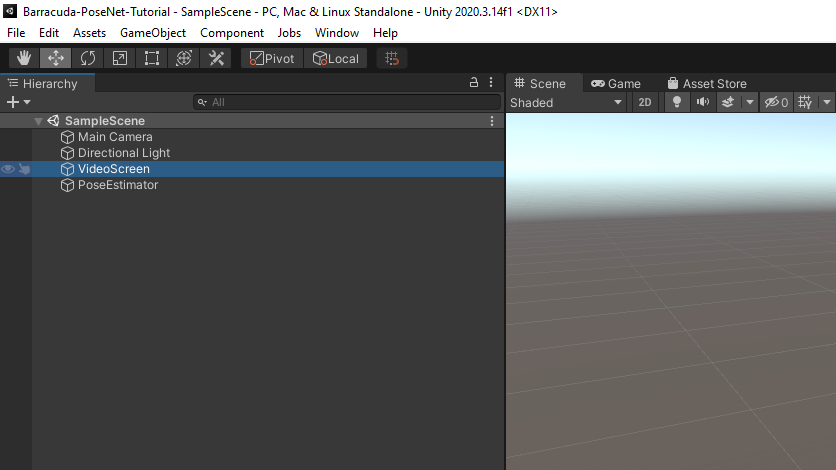
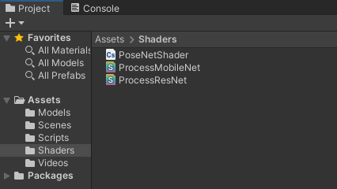
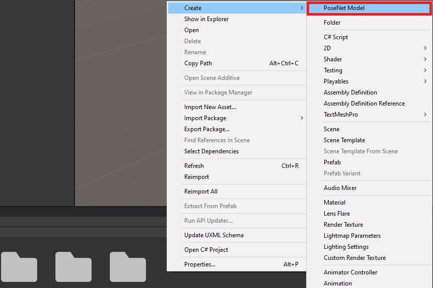
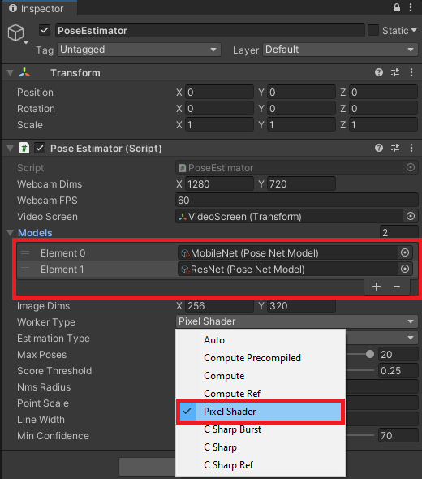
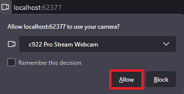

### Last Updated: 3/23/2022

* [Overview](#overview)
* [Download GitHub Project](#download-github-project)
* [Update Barracuda Library](#update-barracuda-library)
* [Remove Video Player](#remove-video-player)
* [Add Image Effect Shaders](#add-image-effect-shaders)
* [Create Scriptable Objects](#create-scriptable-objects)
* [Update PoseEstimator Script](#update-poseestimator-script)
* [Configure PoseEstimator Component](#configure-poseestimator-component)
* [Build Project](#build-project)
* [Summary](#summary)


#### Update 5/27/2022: Upgrade to Unity 2022.1.0+ to resolve build errors.


## Overview

Until recently, it was infeasible to use the Barracuda inference engine in WebGL builds. CPU inference was single-thread only, and we could not use the GPU at all. However, updates to the Barracuda library added a Pixel Shader worker type. This new worker type enables GPU inference even when the target platform does not support Compute Shaders. 

We will cover how to leverage the Pixel Shader worker type to run the [PoseNet project](https://github.com/cj-mills/Barracuda-PoseNet-Tutorial) in a web browser.

You can try out a live demo at the link below.

* [Barracuda PoseNet WebGL Demo](https://cj-mills.github.io/Barracuda-PoseNet-WebGL-Demo/)


## Download GitHub Project

First, we need to clone the existing PoseNet project from GitHub. Once downloaded, open the project in the Unity Editor.

**GitHub Repository:** [Barracuda-PoseNet-Tutorial](https://github.com/cj-mills/Barracuda-PoseNet-Tutorial)


## Update Barracuda Library

Open the package manager window and navigate to the Barracuda package. We can see there is a new `3.0.0` version available. At the time of writing, this was the most recent version of the package. Click the `Update to 3.0.0` button to start the update process. 


A popup window will open stating we need to restart the editor. Click the OK button, then close and reopen the project.


## Remove Video Player

WebGL builds do not support playing local video files. The video files would need to be hosted on a web server and accessed via URL. Since real-world applications would likely take input from a webcam, we will focus on that instead. Select the `VideoScreen` object in the Hierarchy tab.



Right-click the Video Player component in the Inspector tab and select `Remove Component`.


## Add Image Effect Shaders

The new version of Barracuda also added support for creating a Tensor from a `RenderTexture` even when Compute Shaders are not available. We can implement the preprocessing steps using Image Effect Shaders to avoid downloading the texture data to the CPU.

### Define Shaders

Open the Shaders folder in the Assets section. Right-click to open the context menu and select `Create → Shader → Image Effect Shader`. 


We will need to create two of these shaders for the MobileNet and ResNet models, respectively. Name the two shaders ProcessMobileNet and ProcessResNet.




We will start by modifying the `MobileNet` shader. Open the file in the code editor. First, replace the default context menu string of `Hidden/ProcessMobileNet` with `PoseNet/ProcessMobileNet`.

```glsl
Shader "PoseNet/ProcessResNet"
{
    Properties
    {
        _MainTex ("Texture", 2D) = "white" {}
    }
```

Then, replace the `fixed4 frag` function with the code below. This code implements the same steps as in the PoseNetShader Compute Shader.

```glsl
float4 frag(v2f i) : SV_Target
{
    float4 col = tex2D(_MainTex, i.uv);
    col.r = 2.0 * col.r / 1.0 - 1.0;
    col.g = 2.0 * col.g / 1.0 - 1.0;
    col.b = 2.0 * col.b / 1.0 - 1.0;
    return col;
}
```


We can perform the same steps for the ResNet shader. This time, name the shader `PoseNet/ProcessResNet` and replace the `fixed4 frag` function with the code below.

```glsl
float4 frag(v2f i) : SV_Target
{
    float4 col = tex2D(_MainTex, i.uv);
    col.r = col.r * 255.0 - 123.15;
    col.g = col.g * 255.0 - 115.90;
    col.b = col.b * 255.0 - 103.06;
    return col;
}
```


### Create Materials

We need to attach the shaders to materials to apply them using the `Graphics.Blit()` function. Right-click to open the context menu and select `Create → Material`. 


We need materials for both the `MobileNet` and `ResNet` models. We can use the same names as the shaders.


Select the `MobileNet` Material, then drag the `MobileNet` Shader into the Inspector Tab.


Do the same for the `ResNet `Material.


## Create Scriptable Objects

It can be cumbersome to keep track of the individual requirements for the different versions of the PoseNet model. We can tidy things up a bit using Scriptable Objects.

### Define PoseNetModel Scriptable Object

Open the `Assets → Scripts` folder and create a new C# script. Name it PoseNetModel and open it in the code editor.


Replace the MonoBehaviour inheritance with ScriptableObject and delete the default methods. Add the Barracuda namespace as well.

```c#
using System.Collections;
using System.Collections.Generic;
using UnityEngine;
using Unity.Barracuda;

public class PoseNetModel : ScriptableObject
{
    
}
```

Here, we will keep track of the model asset, processing material, and output layer indices for individual versions of the PoseNet model.

```c#
using System.Collections;
using System.Collections.Generic;
using UnityEngine;
using Unity.Barracuda;

public class PoseNetModel : ScriptableObject
{
    [Tooltip("The ONNX model asset file to use when performing inference")]
    public NNModel modelAsset;

    [Tooltip("The material with the required preprocessing shader")]
    public Material preprocessingMaterial;

    [Tooltip("The index for the heatmap output layer")]
    public int heatmapLayerIndex = 0;
    [Tooltip("The index for the offsets output layer")]
    public int offsetsLayerIndex = 1;
    [Tooltip("The index for the forward displacement layer")]
    public int displacementFWDLayerIndex;
    [Tooltip("The index for the backwared displacement layer")]
    public int displacementBWDLayerIndex;
}
```

Lastly, We need to provide a name for the context menu. That way, we can create instances of this scriptable object in the Assets section.

```c#
using System.Collections;
using System.Collections.Generic;
using UnityEngine;
using Unity.Barracuda;

[CreateAssetMenu(menuName = "PoseNet Model")]
public class PoseNetModel : ScriptableObject
{
    [Tooltip("The ONNX model asset file to use when performing inference")]
    public NNModel modelAsset;

    [Tooltip("The material with the required preprocessing shader")]
    public Material preprocessingMaterial;

    [Tooltip("The index for the heatmap output layer")]
    public int heatmapLayerIndex = 0;
    [Tooltip("The index for the offsets output layer")]
    public int offsetsLayerIndex = 1;
    [Tooltip("The index for the forward displacement layer")]
    public int displacementFWDLayerIndex;
    [Tooltip("The index for the backwared displacement layer")]
    public int displacementBWDLayerIndex;
}
```


### Create PoseNetModel Assets

Back in the Assets section, right-click to open the context menu and select `Create → PoseNet Model` to create a new instance of the Scriptable Object. 



Name the `.asset` file `MobileNet`. With the asset selected, drag the `Assets/Models/mobilenet.onnx` file into the `Model Asset` field in the Inspector Tab.


Next, drag the associated processing material into the Preprocessing Material field. Enter `2` and `3` for the forward and backward displacement layer indices, respectively.


Create a second instance called `ResNet` and assign the associated ONNX file and Material. This time, enter `3`  for the forward displacement layer and `2` for the backward displacement layer.


## Update PoseEstimator Script

Now we can update the PoseEstimator script to work with WebGL. It might be easier to delete the current class content and start fresh. 

```c#
using System.Collections;
using System.Collections.Generic;
using UnityEngine;
using Unity.Barracuda;

public class PoseEstimator : MonoBehaviour
{
    
}

```


We will only go over the bare minimum changes required for using WebGL to prevent this post from getting too long. A more developed project is available at the link at the bottom of this page.


### Define Public Variables

Most of the public variables remain the same as the original project. The only new addition is `public PoseNetModel[] models` variable. This variable will store the instances of the `PoseNetModel` Scriptable Object we created earlier.

```c#
public enum EstimationType
{
    MultiPose,
    SinglePose
}

[Tooltip("The requested webcam dimensions")]
public Vector2Int webcamDims = new Vector2Int(1280, 720);

[Tooltip("The requested webcam frame rate")]
public int webcamFPS = 60;

[Tooltip("The screen for viewing the input source")]
public Transform videoScreen;

[Tooltip("Stores the models available for inference")]
public PoseNetModel[] models;

[Tooltip("The dimensions of the image being fed to the model")]
public Vector2Int imageDims = new Vector2Int(256, 256);

[Tooltip("The backend to use when performing inference")]
public WorkerFactory.Type workerType = WorkerFactory.Type.Auto;

[Tooltip("The type of pose estimation to be performed")]
public EstimationType estimationType = EstimationType.SinglePose;

[Tooltip("The maximum number of posees to estimate")]
[Range(1, 20)]
public int maxPoses = 20;

[Tooltip("The score threshold for multipose estimation")]
[Range(0, 1.0f)]
public float scoreThreshold = 0.25f;

[Tooltip("Non-maximum suppression distance")]
public int nmsRadius = 100;

[Tooltip("The size of the pose skeleton key points")]
public float pointScale = 10f;

[Tooltip("The width of the pose skeleton lines")]
public float lineWidth = 5f;

[Tooltip("The minimum confidence level required to display a key point")]
[Range(0, 100)]
public int minConfidence = 70;
```


### Define Private Variables

We only need to define one new private variable to keep track of the current PoseNetModel in use.

```c#
// Live video input from a webcam
private WebCamTexture webcamTexture;

// The source video texture
private RenderTexture videoTexture;

// Target dimensions for model input
private Vector2Int targetDims;

// Used to scale the input image dimensions while maintaining aspect ratio
private float aspectRatioScale;

// The texture used to create the input tensor
private RenderTexture rTex;

// Stores the input data for the model
private Tensor input;

// The interface used to execute the neural network
private IWorker engine;

// The name for the heatmap layer in the model asset
private string heatmapLayer;

// The name for the offsets layer in the model asset
private string offsetsLayer;

// The name for the forwards displacement layer in the model asset
private string displacementFWDLayer;

// The name for the backwards displacement layer in the model asset
private string displacementBWDLayer;

// The name for the Sigmoid layer that returns the heatmap predictions
private string predictionLayer = "heatmap_predictions";

// Stores the current estimated 2D keypoint locations in videoTexture
private Utils.Keypoint[][] poses;

// Array of pose skeletons
private PoseSkeleton[] skeletons;

// Stores the PoseNetModel currently in use
private PoseNetModel currentModel;
```


### Define InitializeVideoScreen Method

The `InitializeVideoScreen` method is nearly identical to the original project. The only differences are that is no `VideoPlayer` component, and we will initialize the video texture inside this method instead of the start method.

```c#
/// <summary>
/// Prepares the videoScreen GameObject to display the chosen video source.
/// </summary>
/// <param name="width"></param>
/// <param name="height"></param>
/// <param name="mirrorScreen"></param>
private void InitializeVideoScreen(int width, int height, bool mirrorScreen)
{
    // Release temporary RenderTexture
    RenderTexture.ReleaseTemporary(videoTexture);
    // Create a new videoTexture using the current video dimensions
    videoTexture = RenderTexture.GetTemporary(width, height, 24, RenderTextureFormat.ARGBHalf);

    if (mirrorScreen)
    {
        // Flip the VideoScreen around the Y-Axis
        videoScreen.rotation = Quaternion.Euler(0, 180, 0);
        // Invert the scale value for the Z-Axis
        videoScreen.localScale = new Vector3(videoScreen.localScale.x, videoScreen.localScale.y, -1f);
    }

    // Apply the new videoTexture to the VideoScreen Gameobject
    videoScreen.gameObject.GetComponent<MeshRenderer>().material.shader = Shader.Find("Unlit/Texture");
    videoScreen.gameObject.GetComponent<MeshRenderer>().material.SetTexture("_MainTex", videoTexture);
    // Adjust the VideoScreen dimensions for the new videoTexture
    videoScreen.localScale = new Vector3(width, height, videoScreen.localScale.z);
    // Adjust the VideoScreen position for the new videoTexture
    videoScreen.position = new Vector3(width / 2, height / 2, 1);
}
```


### Define InitializeCamera Method

The `InitializeCamera` method is nearly identical to the original project. The only difference is that we will use the video texture directly to adjust the camera position and size.

```c#
/// <summary>
/// Resizes and positions the in-game Camera to accommodate the video dimensions
/// </summary>
private void InitializeCamera()
{
    // Get a reference to the Main Camera GameObject
    GameObject mainCamera = GameObject.Find("Main Camera");
    // Adjust the camera position to account for updates to the VideoScreen
    mainCamera.transform.position = new Vector3(videoTexture.width / 2, videoTexture.height / 2, -10f);
    // Render objects with no perspective (i.e. 2D)
    mainCamera.GetComponent<Camera>().orthographic = true;
    // Adjust the camera size to account for updates to the VideoScreen
    mainCamera.GetComponent<Camera>().orthographicSize = videoTexture.height / 2;
}
```


### Define InitializeBarracuda Method

The steps for the `InitializeBarracuda` method are the same as the original project. We only need to update it to use the `currentModel` variable.

```c#
/// <summary>
/// Updates the output layer names based on the selected model architecture
/// and initializes the Barracuda inference engine with the selected model.
/// </summary>
private void InitializeBarracuda()
{
    // The compiled model used for performing inference
    Model m_RunTimeModel;

    // Compile the model asset into an object oriented representation
    m_RunTimeModel = ModelLoader.Load(currentModel.modelAsset);

    // Get output layer names
    heatmapLayer = m_RunTimeModel.outputs[currentModel.heatmapLayerIndex];
    offsetsLayer = m_RunTimeModel.outputs[currentModel.offsetsLayerIndex];
    displacementFWDLayer = m_RunTimeModel.outputs[currentModel.displacementFWDLayerIndex];
    displacementBWDLayer = m_RunTimeModel.outputs[currentModel.displacementBWDLayerIndex];

    // Create a model builder to modify the m_RunTimeModel
    ModelBuilder modelBuilder = new ModelBuilder(m_RunTimeModel);

    // Add a new Sigmoid layer that takes the output of the heatmap layer
    modelBuilder.Sigmoid(predictionLayer, heatmapLayer);

    // Validate if backend is supported, otherwise use fallback type.
    workerType = WorkerFactory.ValidateType(workerType);

    // Create a worker that will execute the model with the selected backend
    engine = WorkerFactory.CreateWorker(workerType, modelBuilder.model);
}
```


### Define InitializeSkeletons Method

The `InitializeSkeletons` method is unchanged from the original project.

```c#
/// <summary>
/// Initialize pose skeletons
/// </summary>
private void InitializeSkeletons()
{
    // Initialize the list of pose skeletons
    if (estimationType == EstimationType.SinglePose) maxPoses = 1;
    skeletons = new PoseSkeleton[maxPoses];

    // Populate the list of pose skeletons
    for (int i = 0; i < maxPoses; i++) skeletons[i] = new PoseSkeleton(pointScale, lineWidth);
}
```


### Define InitializeInputDims Method

We will implement the steps for updating the texture dimensions inside a new method rather than the Update method. That way, we can call this method when the input dimensions are updated using a GUI rather than the Inspector tab. The actual steps remain the same.

```c#
/// <summary>
/// Initialize the input dimensions for the model
/// </summary>
private void InitializeInputDims()
{
    // Prevent the input dimensions from going too low for the model
    imageDims.x = Mathf.Max(imageDims.x, 64);
    imageDims.y = Mathf.Max(imageDims.y, 64);

    // Update the input dimensions while maintaining the source aspect ratio
    if (imageDims.y != targetDims.y)
    {
        aspectRatioScale = (float)videoTexture.width / videoTexture.height;
        targetDims.x = (int)(imageDims.y * aspectRatioScale);
        imageDims.x = targetDims.x;
        targetDims.y = imageDims.y;
    }

    if (imageDims.x != targetDims.x)
    {
        aspectRatioScale = (float)videoTexture.height / videoTexture.width;
        targetDims.y = (int)(imageDims.x * aspectRatioScale);
        imageDims.y = targetDims.y;
        targetDims.x = imageDims.x;
    }

    RenderTexture.ReleaseTemporary(rTex);
    // Assign a temporary RenderTexture with the new dimensions
    rTex = RenderTexture.GetTemporary(imageDims.x, imageDims.y, 24, RenderTextureFormat.ARGBHalf);
}
```


### Define InitializePoseEstimator Method

We will define a new function that calls the initialization methods.

```c#
/// <summary>
/// Perform initialization steps
/// </summary>
private void InitializePoseEstimator()
{
    // Initialize the Barracuda inference engine based on the selected model
    InitializeBarracuda();

    // Initialize pose skeletons
    InitializeSkeletons();

    // Initialize the videoScreen
    InitializeVideoScreen(webcamTexture.width, webcamTexture.height, true);

    // Adjust the camera based on the source video dimensions
    InitializeCamera();

    // Initialize input dimensions
    InitializeInputDims();
}
```


### Define Start Method

In the Start method, we only need to create a new webcam texture, start the camera and initialize the `currentModel` variable. For real-world applications, we would update this value using a GUI. For now, we can just set it to the first element in the `models` array.

```c#
// Start is called before the first frame update
void Start()
{
    // Create a new WebCamTexture
    webcamTexture = new WebCamTexture(webcamDims.x, webcamDims.y, webcamFPS);
    // Start the Camera
    webcamTexture.Play();

    // Default to the first PoseNetModel in the list
    currentModel = models[0];
}
```


### Define ProcessImage Method

For the `ProcessImage` method, we no longer need to worry about processing input on the CPU. We only need to call the `Graphics.Blit` method using the Material for the current model.

```c#
/// <summary>
/// Calls the appropriate preprocessing function to prepare
/// the input for the selected model
/// </summary>
/// <param name="image"></param>
private void ProcessImage(RenderTexture image)
{
    // Define a temporary HDR RenderTexture
    RenderTexture result = RenderTexture.GetTemporary(image.width, image.height, 24, RenderTextureFormat.ARGBHalf);
    RenderTexture.active = result;

    // Apply preprocessing steps
    Graphics.Blit(image, result, currentModel.preprocessingMaterial);

    // Create a new Tensor
    input = new Tensor(result, channels: 3);
    RenderTexture.ReleaseTemporary(result);
}
```


### Define ProcessOutput Method

The `ProcessOutput` method is unchanged from the original project.

```c#
/// <summary>
/// Obtains the model output and either decodes single or mutlple poses
/// </summary>
/// <param name="engine"></param>
private void ProcessOutput(IWorker engine)
{
    // Get the model output
    Tensor heatmaps = engine.PeekOutput(predictionLayer);
    Tensor offsets = engine.PeekOutput(offsetsLayer);
    Tensor displacementFWD = engine.PeekOutput(displacementFWDLayer);
    Tensor displacementBWD = engine.PeekOutput(displacementBWDLayer);

    // Calculate the stride used to scale down the inputImage
    int stride = (imageDims.y - 1) / (heatmaps.shape.height - 1);
    stride -= (stride % 8);

    if (estimationType == EstimationType.SinglePose)
    {
        // Initialize the array of Keypoint arrays
        poses = new Utils.Keypoint[1][];

        // Determine the key point locations
        poses[0] = Utils.DecodeSinglePose(heatmaps, offsets, stride);
    }
    else
    {
        // Determine the key point locations
        poses = Utils.DecodeMultiplePoses(
            heatmaps, offsets,
            displacementFWD, displacementBWD,
            stride: stride, maxPoseDetections: maxPoses,
            scoreThreshold: scoreThreshold,
            nmsRadius: nmsRadius);
    }

    // Release the resources allocated for the output Tensors
    heatmaps.Dispose();
    offsets.Dispose();
    displacementFWD.Dispose();
    displacementBWD.Dispose();
}
```


### Define Update Method

Most web browsers will likely require user permission to access the webcam. The webcam texture will not fully initialize until the user allows access. We will add a check at the top of the Update method to prevent the rest of the code from executing until the webcam texture initializes.

The default resolution for a webcam texture is 16x16. It seems reasonable to assume any webcam would have a higher resolution. Therefore we will use this as our condition to check when the webcam texture initializes.

The rest of the Update method is nearly identical to the original project with one critical addition. We need to call `Resources.UnloadUnusedAssets` at the end of the Update method. The `UnloadUnusedAssets` method will prevent GPU memory from filling up.

```c#
// Update is called once per frame
void Update()
{
    // Skip the rest of the method if the webcam is not initialized
    if (webcamTexture.width <= 16) return;

    // Only perform initialization steps if the videoTexture has not been initialized
    if (!videoTexture) InitializePoseEstimator();

    // Copy webcamTexture to videoTexture
    Graphics.Blit(webcamTexture, videoTexture);

    // Copy the videoTexture data to rTex
    Graphics.Blit(videoTexture, rTex);

    // Prepare the input image to be fed to the selected model
    ProcessImage(rTex);

    // Execute neural network with the provided input
    engine.Execute(input);
    // Release GPU resources allocated for the Tensor
    input.Dispose();

    // Decode the keypoint coordinates from the model output
    ProcessOutput(engine);

    // Reinitialize pose skeletons
    if (maxPoses != skeletons.Length)
    {
        foreach (PoseSkeleton skeleton in skeletons)
        {
            skeleton.Cleanup();
        }

        // Initialize pose skeletons
        InitializeSkeletons();
    }

    // The smallest dimension of the videoTexture
    int minDimension = Mathf.Min(videoTexture.width, videoTexture.height);

    // The value used to scale the key point locations up to the source resolution
    float scale = (float)minDimension / Mathf.Min(imageDims.x, imageDims.y);

    // Update the pose skeletons
    for (int i = 0; i < skeletons.Length; i++)
    {
        if (i <= poses.Length - 1)
        {
            skeletons[i].ToggleSkeleton(true);

            // Update the positions for the key point GameObjects
            skeletons[i].UpdateKeyPointPositions(poses[i], scale, videoTexture, true, minConfidence);
            skeletons[i].UpdateLines();
        }
        else
        {
            skeletons[i].ToggleSkeleton(false);
        }
    }
    Resources.UnloadUnusedAssets();
}
```


### Define OnDisable Method

For the `OnDisable` method, we only need to update the line to release the resources for the inference engine to `engine.Dispose()`.

```c#
private void OnDisable()
{
    // Release the resources allocated for the inference engine
    engine.Dispose();
}
```


## Configure PoseEstimator Component

Before we test the modified project, we need to assign the `MobileNet` and `ResNet` assets to the Pose Estimator component. Select the `PoseEstimator` object in the Hierarchy tab. Then drag the `MobileNet` and `ResNet` assets onto the Models field in the Inspector tab. Make sure to place the model you want to test in the `Element 0` field. Lastly, open the `Worker Type` dropdown and select `Pixel Shader`.




## Build Project

Press Ctrl+B to build and run the project. Select or create a Build folder in the popup window.


The first build attempt will likely fail, with Unity displaying lots of errors and warnings in the console. The console error messages all say that Bitwise integer instructions are not supported on GLES 2.


However, if we press Ctrl+B again, the build will complete successfully.


Once the project build is complete, a new window will open, and the project will start. 


There should be a prompt asking for permission to access the webcam. If not, try refreshing the page. 



The project should automatically perform the initialization steps once the browser accesses the webcam.


## Summary

We now have a way to use the Barracuda inference engine in WebGL builds.


**Previous:** [Part 7](../part-7/)

**Project Resources:** [GitHub Repository](https://github.com/cj-mills/Barracuda-PoseNet-Tutorial/tree/WebGL)


<!-- Cloudflare Web Analytics --><script defer src='https://static.cloudflareinsights.com/beacon.min.js' data-cf-beacon='{"token": "56b8d2f624604c4891327b3c0d9f6703"}'></script><!-- End Cloudflare Web Analytics -->