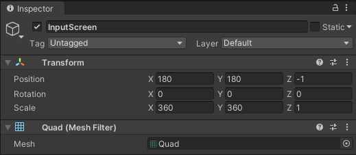
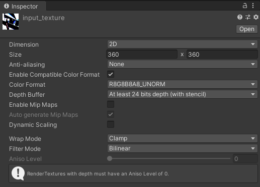
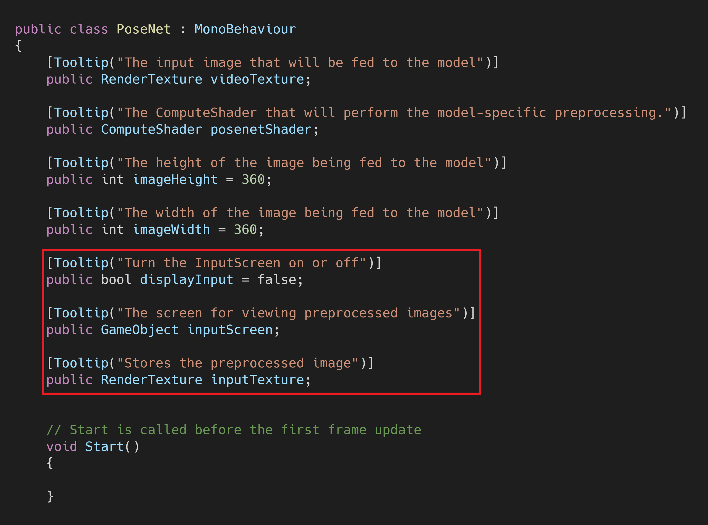
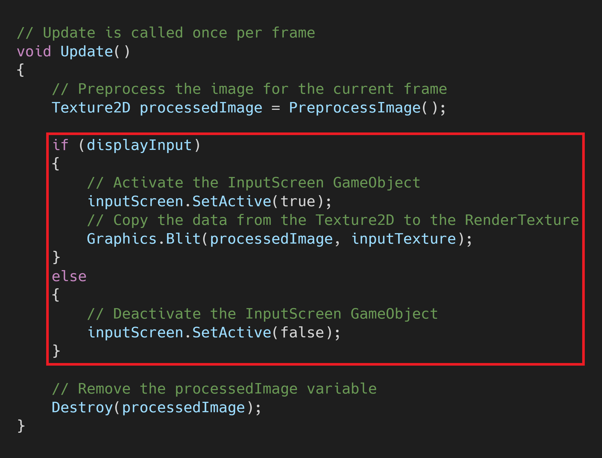
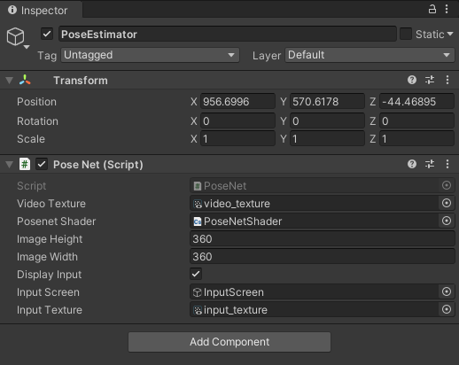
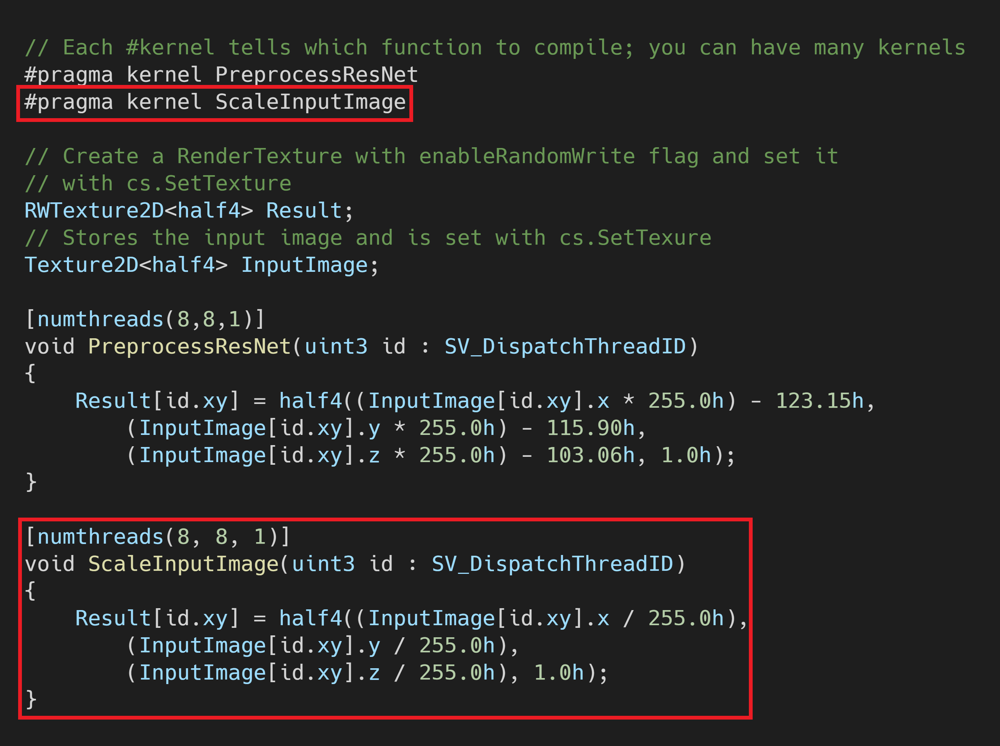
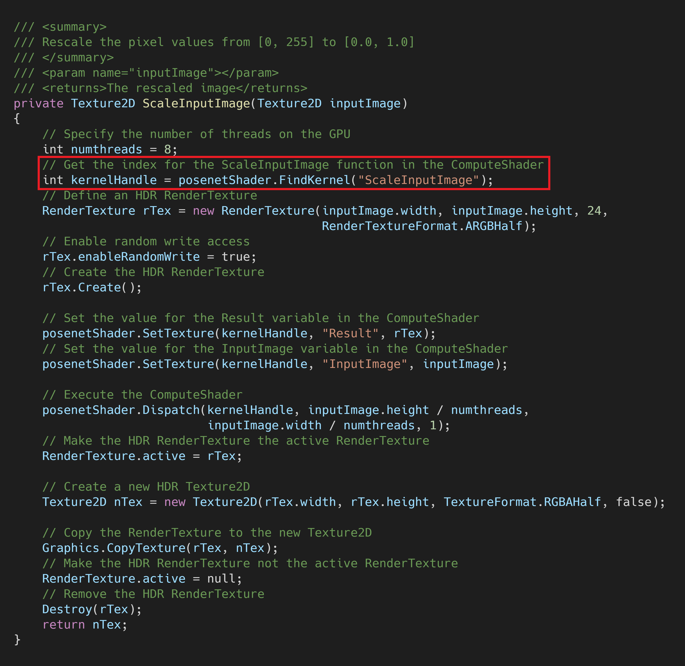
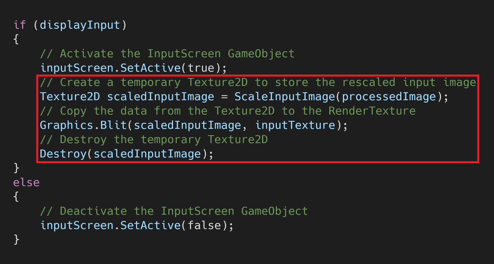

**Version 2:** [Part 1](../../barracuda-posenet-tutorial-v2/part-1/) 

**Last Updated:** Nov 30, 2020

### Previous: [Part 2](../part-2/)

* [Introduction](#introduction)
* [Make a New Screen](#make-a-new-screen)
* [Update the PoseNet Script](#update-the-posenet-script)
* [Assign Inspector Variables](#assign-inspector-variables)
* [Test the New Screen](#test-the-new-screen)
* [Rescale Pixel Values](#rescale-pixel-values)
* [Summary](#summary)

## Introduction

Examining the preprocessed input images can be a useful step when debugging. We can see how much the source image gets squished when resized to a square aspect ratio. The model can have a hard time accurately determining key point locations if the individual gets squished too much. We can also get a visual sense of how the preprocessing operations change the pixel values.

## Make a New Screen

We can make a second screen to see what the preprocessed images look like before they get fed into the model.

### Make a Quad

In the `Hierarchy` tab, make an new Quad and name it `InputScreen`.

#### Set the Scale

We'll set both the `X` and `Y` scale values to `360` to match our current input resolution for the model.

#### Set the Position

We also need to set the `X` and `Y` position values to `180`. Set the `Z` position value to `-1` so that it's in front of the `VideoScreen`.

### Make a RenderTexture

Make another `RenderTexture` and name it `input_texture`.

#### Set the Size

Set the `Size` to `360 x 360`.

#### Apply the `input_texture`

Drag and drop the `input_texture` onto the `InputScreen` in the `Scene` tab.

### Make the Shader Unlit

Set the `Shader` for the `InputScreen` to `Unlit/Texture` just like the `VideoScreen`.

## Update the PoseNet Script

Next, we need to create a few new public variables in the PoseNet script.

### Add `displayInput` variable

Create a new public `bool` variable called `displayInput`. This will add a checkbox in the `Inpsector` tab that we can use to turn the `InputScreen` on and off.

### Add `inputScreen` variable

Create a new public `GameObject` variable called `inputScreen`. We need to access the `InputScreen` object to activate and deactivate it.

### Add `inputTexture` variable 

Create a new public `RenderTexture` variable called `inputTexture`. We'll assign the `input_texture` asset to this variable in the Unity Editor.

### Modify the `Update()` Method

We can use the `Graphics.Blit()` method to copy the `processedImage` data to the `inputTexture` variable. We'll use the `inputScreen.SetActive()` method to activate and deactivate the `InputScreen`.

## Assign Inspector Variables

With the `PoseEstimator` selected in the `Hierarchy` tab, drag and drop the `InputScreen` and `input_texture` into their respective variables in the `Inspector` tab.

## Test the New Screen

Make sure the `Display Input` checkbox is ticked in the `Inspector` tab. It will be easier to see the changes to the preprocessed images if we use a full color video. We can set the `Video Clip` for the `Video Player` to the `pexels_woman_dancing` file that we downloaded in [Part 1](../part-1/).

## Rescale Pixel Values

The current result may not be the most accurate representation as pixel values are still in the the range of `[0, 255]` instead of Unity's `[0.0, 1.0]`. We can rescale the pixel values by adding another function to our `PoseNetShader`.

### Update `PoseNetShader`

We'll create another function called `ScaleInputImage()` that divides the RGB channel values by `255.0`.

**Note:** Rescaling the pixel values will have a small impact on performance. Make sure to untick the `Display Input` checkbox when you're not examining the input image.

### Create `ScaleInputImage` Method

We need to create a new method in the `PoseNet` script to execute the function just like for the `PreprocessResNet` function.

### Call `ScaleInputImage` Method

Finally, we'll call the new method in the `if (displayInput)` statement.

### Result

## Summary

We now have a little screen that we can use to view the processed input image before it gets fed to the model.

### [GitHub Repository - Version 1](https://github.com/cj-mills/Barracuda-PoseNet-Tutorial/tree/Version-1)

### Next: [Part 3](../part-3/)