**Version 2:** [Part 1](../../barracuda-posenet-tutorial-v2/part-1/) 

**Last Updated:** Nov 25, 2020

### Previous: [Part 1](../part-1/)

* [Introduction](#introduction)
* [Create a Compute Shader](#create-a-compute-shader)
* [Create the PoseNet Script](#create-the-posenet-script)
* [Create the Pose Estimator](#create-the-pose-estimator)
* [Summary](#summary)

## Introduction

The PoseNet model we'll be using has a ResNet-50 architecture and was created using TensorFlow. It takes a single RGB image as input. We need to perform some preprocessing operations on the RGB channel values before feeding an image to the model. We'll first scale the values so that they are in the same range that the model was trained on. We then subtract the mean RGB values for the ImageNet dataset.

## Create a Compute Shader

We can perform the preprocessing steps more quickly on the GPU. In Unity, we accomplish this with [compute shaders](https://docs.unity3d.com/Manual/class-ComputeShader.html). Compute shaders are pieces of code that can run parallel tasks on the graphics card. This is beneficial since we need to perform the same operations on every pixel in an image. It also frees up the CPU.

### Create the Asset File

Create a new folder in the `Assets` window and name it `Shaders`. Open the `Shaders` folder and right-click an empty space. Select `Shader` in the `Create` submenu and click `Compute Shader`. We'll name it `PoseNetShader`.

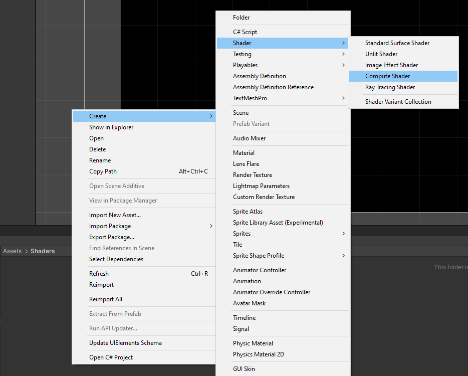{fig-align="center"}

### Remove the Default Code

Open the `PoseNetShader` in your code editor. By default, the `ComputeShader` will contain the following.

 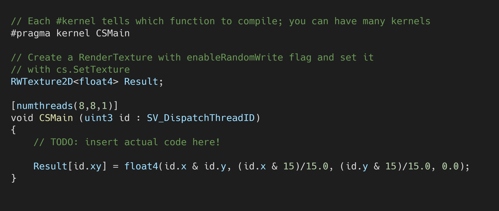{fig-align="center"}

Delete the `CSMain` function along with the `#pragma kernel CSMain`. Next, we need to add a `Texture2D` variable to store the input image. Name it `InputImage` and give it a data type of `<half4>`. Use the same data type for the `Result` variable as well.

{fig-align="center"}

### Create `PreprocessResNet` Function

We need to make a new function to apply the ResNet preprocessing. Name the new function `PreprocessResNet()`. We'll use the default `[numthreads(8,8,1)]`.

{fig-align="center"}

The `PreprocessResNet` function scales the RGB channel values of every pixel in the `InputImage` by `255`. By default, color values in Unity are in the range of `[0,1]`. The function then substracts the ImageNet mean specific to the RGB channels. The processed image is returned in the `Result` variable.

| Channel | ImageNet Mean |
| ------- | :-----------: |
| Red     |    123.15     |
| Green   |    115.90     |
| Blue    |    103.06     |

{fig-align="center"}

Now that we've created our `ComputeShader`, we need to execute it using a `C#` script. 

## Create the PoseNet Script

We need to make a new `C#` script to perform inference with the PoseNet model. When finished, this script will load the model, prepare the input, run the model, and process the output. For this post, we'll implement the preprocessing functionality.

### Create the Asset File

Create a new folder in the `Assets` window and name it `Scripts`. In the `Scripts` folder, right-click an empty space and select `C# Script` in the `Create` submenu.

{fig-align="center"}

Name the script `PoseNet`.

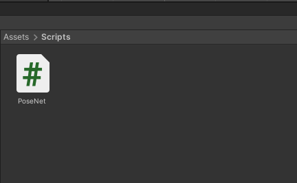{fig-align="center"}

Open the script in your code editor.

### Create `videoTexture` Variable

Above the start method, create a new public `RenderTexture` named `videoTexture`. This is the variable to which we'll assign the `video_texture` that we made in part 1.

### Create `posenetShader` Variable

We'll also create a new public `ComputeShader` variable and name it `posenetShader`. We'll assign the `PoseNetShader` to this variable in the Unity Editor. 

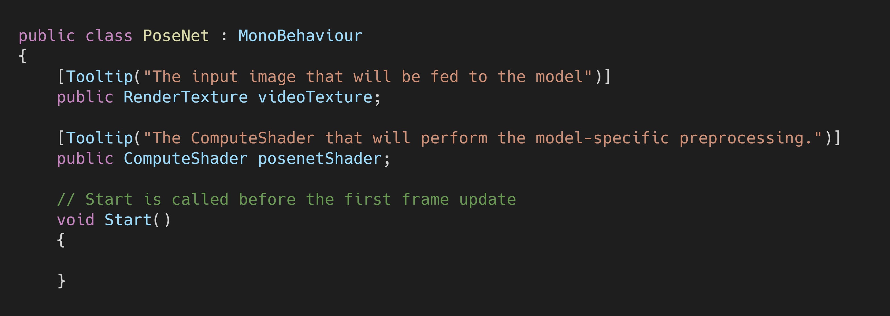{fig-align="center"}

### Create `PreprocessImage()` Method

Next, we need to make a new method to handle the preprocessing steps for the `videoTexture`. We'll name this method `PreprocessImage` and define it below the `Update` method. The method will return a `Texture2D` that contains the preprocessed image.

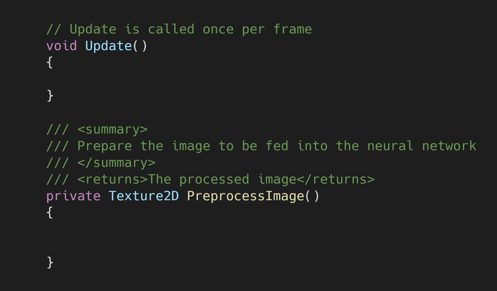{fig-align="center"}

#### Create a New Texture2D

We don't want to alter the `videoTexture` directly, so we'll make a copy of the current frame. Create a new `Texture2D` called `imageTexture` and give it the same dimensions as the `videoTexture`. We can use the `Graphics.CopyTexture()` method to copy the data from the `RenderTexture` directly on the GPU.

{fig-align="center"}

#### Resize the Image

Now that we have our `imageTexture`, we need to resize it to a more practical resolution. Lowering the resolution does decrease the model's accuracy. Unfortunately, using a higher resolution can significantly impact inference speed. We'll examine this trade-off in a later post. 

For now, we'll use a resolution of `360 x 360`. Create two new public `int` variables for the image height and width respectively. This will make it easier to experiment with different resolutions.

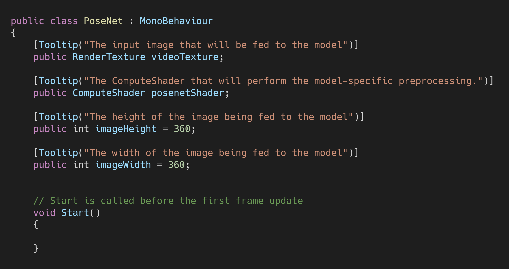{fig-align="center"}

We'll make a new method to handle the resizing process. The method will take in a `Texture2D` as well as the new height and width. It will return a `Texture2D` with the new resolution.

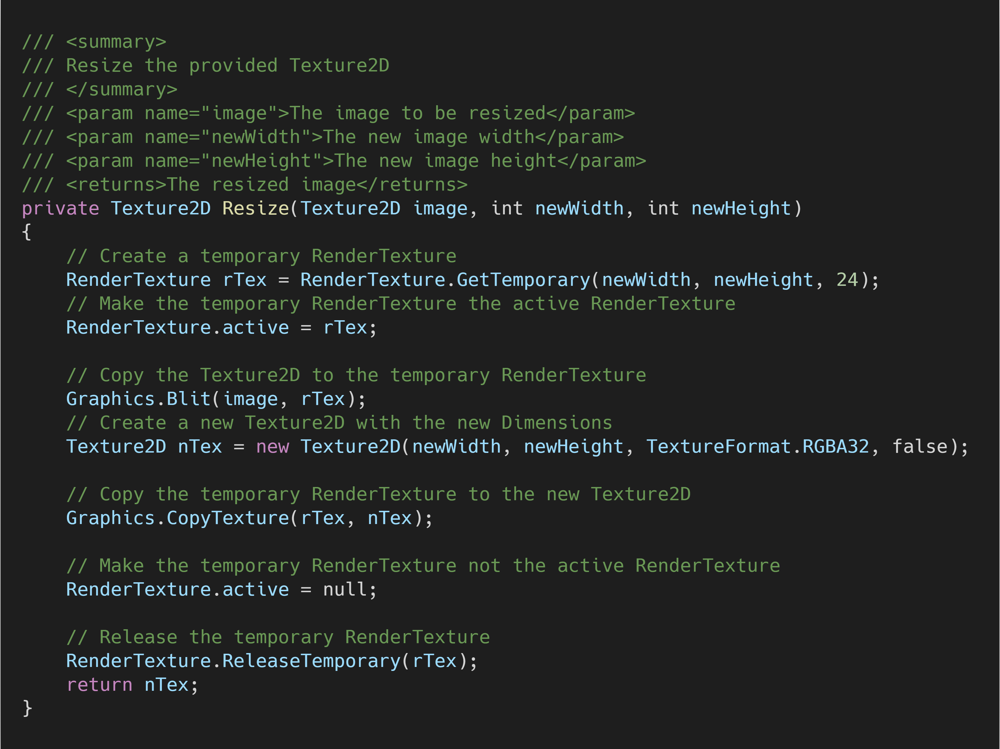{fig-align="center"}

The `Graphics.CopyTexture()` method requires that the source and destination textures be the same size. That means we need to destroy the current `imageTexture` and make a temporary one with the smaller dimensions.

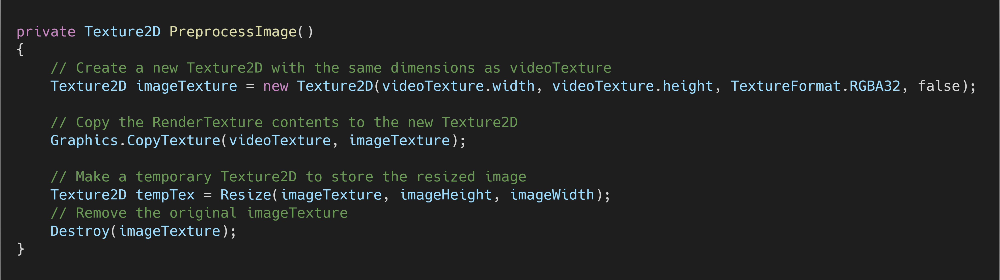{fig-align="center"}

**Note:** Resizing the image to `360 x 360` will squish our input image from a 16:9 aspect ratio to a square aspect ratio. We'll need to account for this when we get to the postprocessing section.

#### Apply Model-Specific Preprocessing

This is where we'll make use of the `PoseNetShader` we made earlier. We'll create a new method to handle the execution process. Name the new method `PreprocessResNet` to match the function in the `PoseNetShader`. They don't need to have the same name. It's just personal preference.

For this method, we need to use HDR texture formats for the `RenderTexture` and `Texture2D`. This allows us to feed images into the model with color values outside of the standard range of `[0,1]`. The Barracuda library [remaps](https://docs.unity3d.com/Packages/com.unity.barracuda@1.0/api/Unity.Barracuda.Tensor.html#Unity_Barracuda_Tensor__ctor_UnityEngine_Texture_System_Int32_System_String_) non-HDR color values to `[0,1]`. Given that we're scaling the values by `255`, this is undesirable.

You can view the full `PreprocessResNet` method below.

{fig-align="center"}

The `PreprocessResNet` method returns a Texture2D with an HDR texture format. The switch to HDR texture formats means the `tempTex` variable is no longer compatible. Fortunately, we can reuse the `imageTexture` variable that we emptied.

The finished `PreprocessImage` method looks like this.

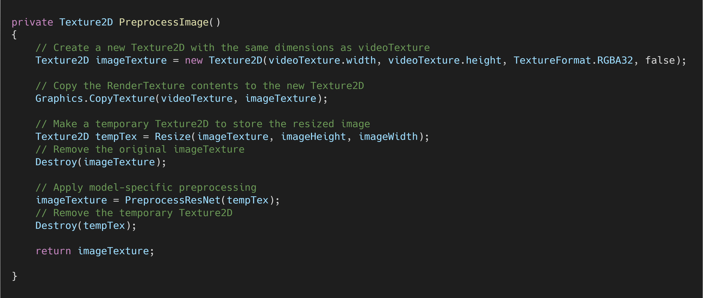{fig-align="center"}

#### Call the Method

We'll call `PreprocessImage()` in the `Update()` method so that it runs every frame.

{fig-align="center"}

## Create the Pose Estimator

To run the `PoseNet` script, we need to attach it to a `GameObject` in the Unity Editor.

### Create an Empty `GameObject`

In the Hierarchy tab, right-click an empty space and select `Create Empty` from the menu. Name the empty GameObject `PoseEstimator`.

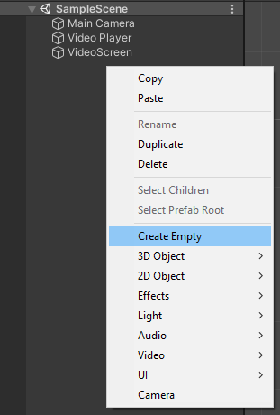{fig-align="center"}

### Attach the `PoseNet` Script

With the `PoseEstimator` object selected, drag and drop the `PoseNet` script into the `Inspector` tab.

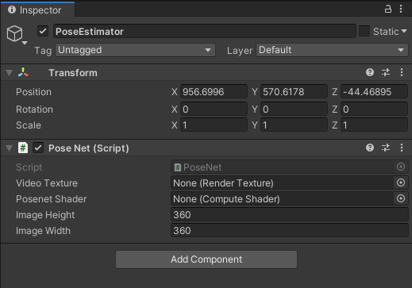{fig-align="center"}

### Assign the `video_texture`

Next, we need to assign the `video_texture` asset to the `Video Texture` parameter. With the `PoseEstimator` object selected, drag and drop the `video_texture` asset into the `Video Texture` spot in the `Inspector` tab.

### Assign the `PoseNetShader`

We also need to drag and drop the `PoseNetShader` asset into the `Posenet Shader` spot in the the Inspector tab.

{fig-align="center"}

## Summary

We're now ready to feed video frames to our PoseNet model. In part 3, we'll cover how to install the Barracuda library and perform inference with our model.

### [GitHub Repository - Version 1](https://github.com/cj-mills/Barracuda-PoseNet-Tutorial/tree/Version-1)

### Next: [Part 2.5(Optional)](../part-2-5/) [Part 3](../part-3/)

<!-- Cloudflare Web Analytics --><!-- End Cloudflare Web Analytics -->