**Version 2:** [Part 1](../../barracuda-posenet-tutorial-v2/part-1/) 

**Last Updated:** Nov 30, 2020

### Previous: [Part 4](../part-4/)

* [Introduction](#introduction)
* [Create Key Points](#create-key-points)
* [Map Key Point Locations](#map-key-point-locations)
* [Summary](#summary)

## Introduction

In this post, we'll make use of the `VideoScreen` we made in [Part 1](../part-1/) by checking if the estimated key point locations align with the actual locations in the video. We'll know everything is working as intended if the objects get placed in front of the target key points. If not, we'll at least have a visual debugging tool to work out where we things went wrong.

## Create Key Points

We need to create a separate `GameObject` for each of the `17` key points.

### Create Container

In the `Hierarchy` tab, create an empty `GameObject` and name it `Key Points`. We'll store the key point objects in here to keep things organized. 

**Optional:** With `Key Points` selected, right-click the `Transform` component in the `Inspector` tab. Click `Reset` in the pop-up menu. This will reset the object's position to the origin.

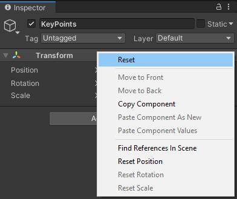

### Create GameObjects

Right-click the `Key Points` object and select `Sphere` under `3D Object`. This will create a nested `GameObject` inside `Key Points`.

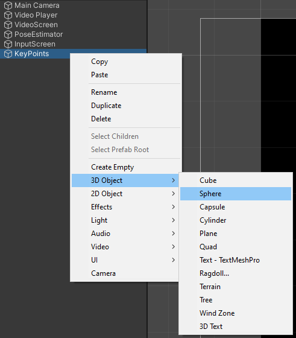

Select the new `Sphere` object and press Ctrl-d to duplicate it. We'll need `17` spheres total.

Rename the `Sphere` objects according to the table below.

| Index | Name           |
| ----- | -------------- |
| 0     | Nose           |
| 1     | Left Eye       |
| 2     | Right Eye      |
| 3     | Left Ear       |
| 4     | Right Ear      |
| 5     | Left Shoulder  |
| 6     | Right Shoulder |
| 7     | Left Elbow     |
| 8     | Right Elbow    |
| 9     | Left Wrist     |
| 10    | Right Wrist    |
| 11    | Left Hip       |
| 12    | Right Hip      |
| 13    | Left Knee      |
| 14    | Right Knee     |
| 15    | Left Ankle     |
| 16    | Right Ankle    |

#### Result

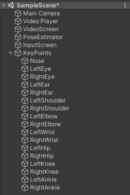

### Resize GameObjects

Next, we'll make the key point objects larger so that they're easier to see. Select the `Nose` object in the `Hierachy`. Then,   hold Shift and click `RightAnkle` to select all 17 objects at once.

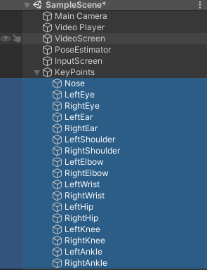

We need to increase the `X` and `Y` values for the `Scale` parameter in the `Inspector` tab. Increasing them to 10 should be enough.

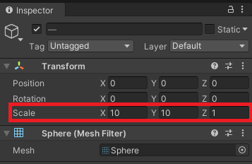

### Change GameObject Material

The default color for a `GameObject` doesn't stand out much against the background. We'll make the key point objects yellow since it's apparently really easy for humans to spot.

#### Create Yellow Material

Open the `Materials` folder in the `Assets` window. Right-click an empty space and select `Material` in the the `Create` sub-menu. Name the new material `Yellow`.

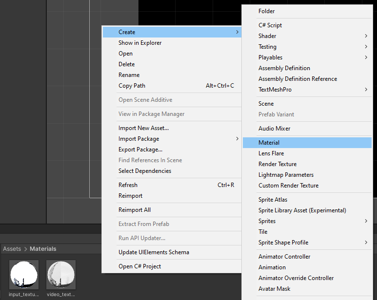

#### Change Material Color

With the `Yellow` material selected, click the small white box in the `Inspector` tab. A `Color` window should pop up.

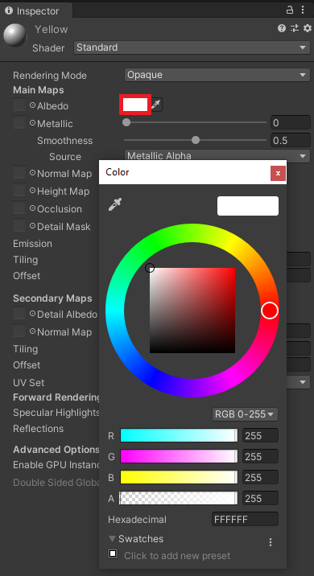

Set the value for `B` to `0` in the `Color` window. This will change the color to pure yellow.

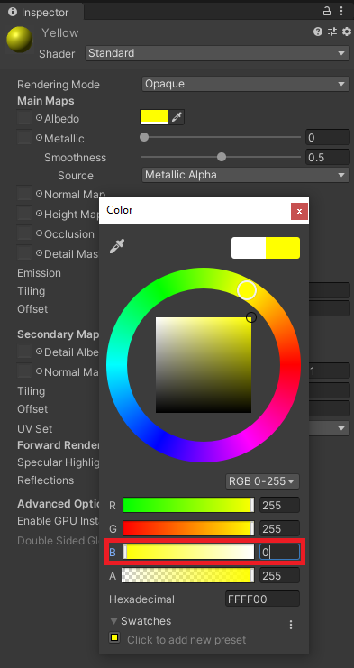

#### Make Material Unlit

We'll change the `Shader` for the material to `Unlit/Color`.

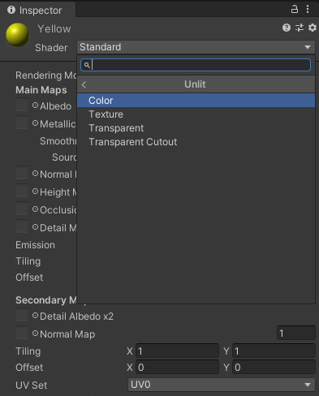

#### Assign Yellow Material

Select all the key point objects in the `Hierarchy` tab. Then, drag and drop the `Yellow` material into the `Inspector` tab.

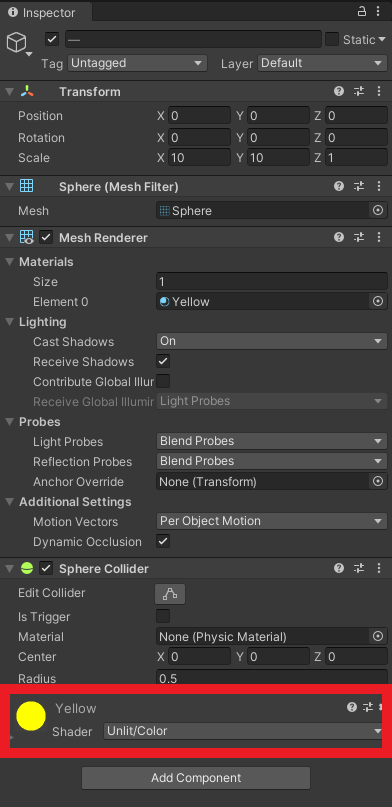

## Map Key Point Locations

Now we can update the positions of the key point objects using the location data obtained from the `PoseNet` model. Ordinarily, we would implement this in a separate `C#` script. This script would access the `keypointLocations[][]` array in the `PoseNet` script. However, we'll do it in the `PoseNet` script to keep things simple. 

### Create `keypoints` Variable

Open the `PoseNet` script and add a public `GameObject` array. Name the variable `keypoints`.

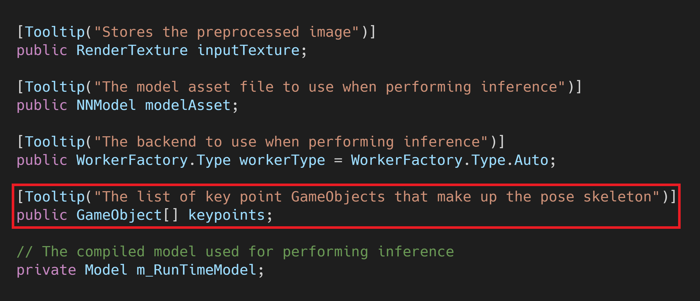

### Assign the Key Point Objects

Select the `PoseEstimator` object in the `Hierarchy` tab. Then, click the small lock icon above the `Inspector` tab. This will lock the current selected object in the `Inspector` tab.

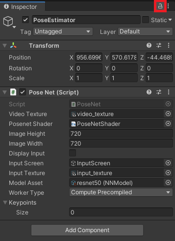

Make sure the `Size` value for the `Keypoints` variable is set to `0`.

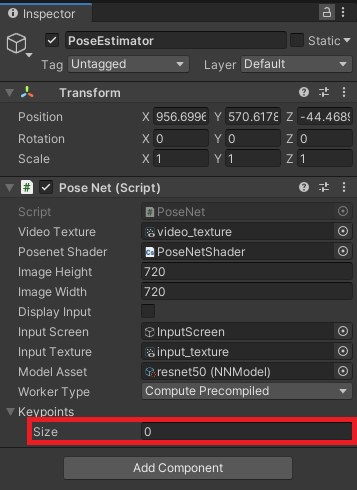

Select all the key point objects in the `Hierarchy`. Then, drag and drop them onto the `Keypoints` parameter in the `Inspector` tab.

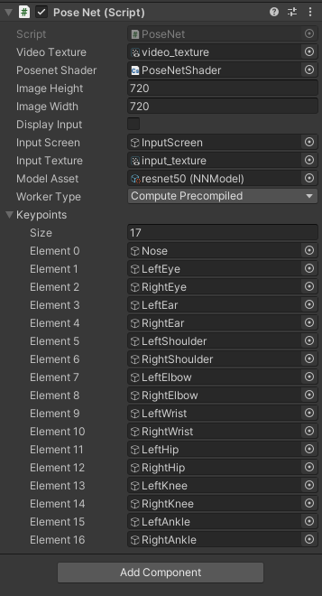

Go ahead and unlock the `Inspector` tab by clicking the lock icon again.

### Create `minConfidence` Variable

Next, we'll add a public `int` variable. This variable will define the confidence threshold for deciding whether or not to display a given key point object. Name the variable `minConfidence` and set the default value to 70. You can add a `Range` attribute to create a slider in the `Inspector` tab. Set the range to `[0, 100]`.

 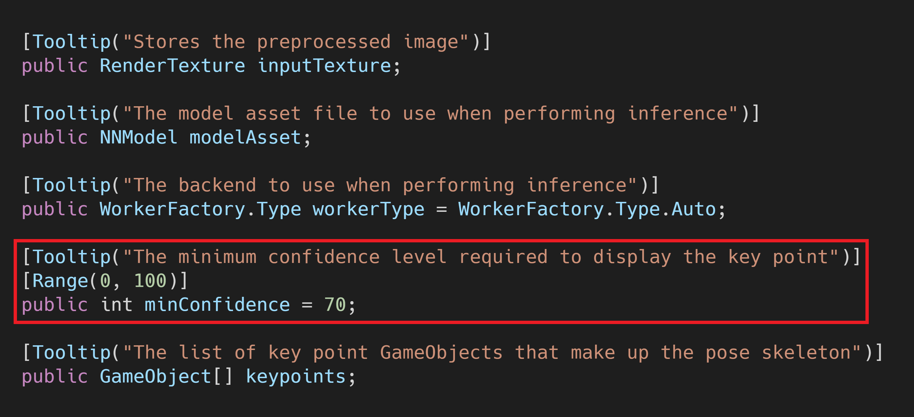

### Create `UpdateKeyPointPositions()` Method

We need to define a new method to update the key point positions. Name the method `UpdateKeyPointPositions()`.

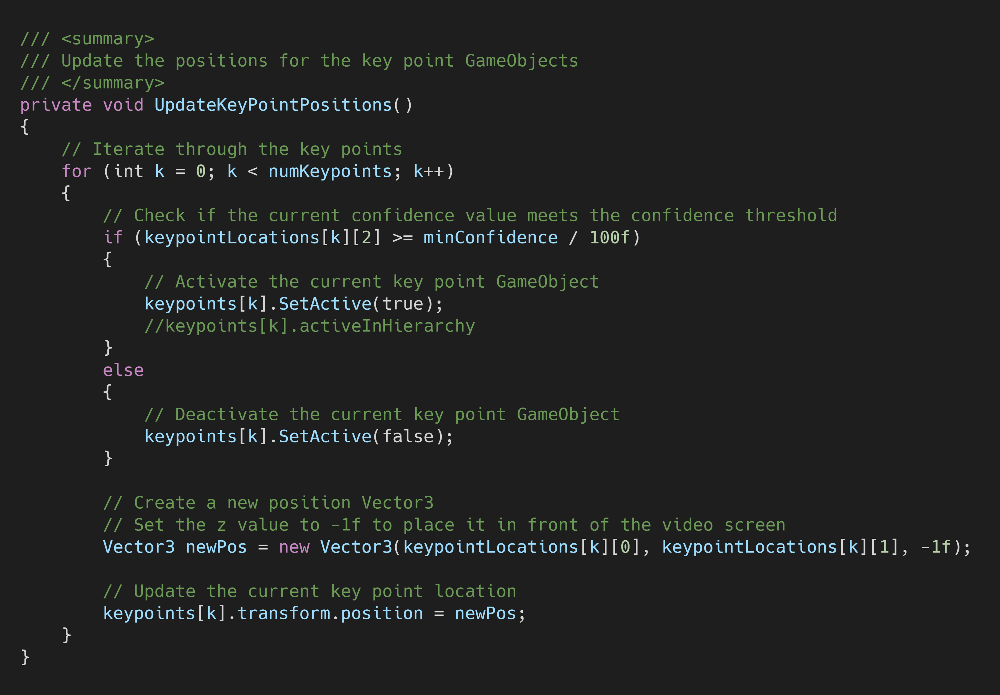

### Call the Method

We'll call the method in `Update()` just after `ProcessOutput()`.

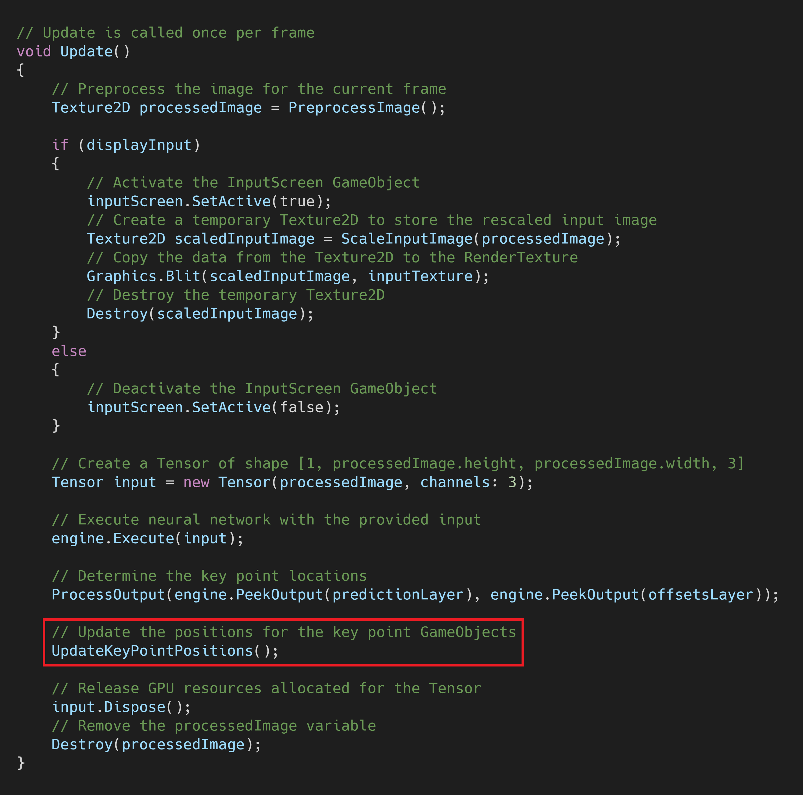

## Summary

We now have a useful debugging tool to gauge our model's performance. In the next post, we'll create a complete pose skeleton by drawing lines connecting the key point objects we made in this post.

### [GitHub Repository - Version 1](https://github.com/cj-mills/Barracuda-PoseNet-Tutorial/tree/Version-1)

### Next: [Part 6](../part-6/)

