**Version 2:** [Part 1](../../barracuda-posenet-tutorial-v2/part-1/) 

**Last Updated:** Dec 1, 2020

### Previous: [Part 7](../part-7/)

* [Introduction](#introduction)
* [Add UnityEngine.Video Namespace](#add-unityenginevideo-namespace)
* [Add Video Resolution Variables](#add-video-resolution-variables)
* [Update Start() Method](#update-start-method)
* [Update ProcessOutput() Method](#update-processoutput-method)
* [Try It Out](#try-it-out)
* [Summary](#summary)

## Introduction

So far, we've only worked with video sources that have `16:9` aspect ratios. You might need to work with input that has a taller or wider aspect ratio depending on your application and equipment. In this post, we'll cover how to adjust to the current source resolution at runtime.

## Add `UnityEngine.Video` Namespace

Open the `PoseNet` script and add a new [`using directive`](https://docs.microsoft.com/en-us/dotnet/csharp/language-reference/keywords/using-directive) at the top. We need the `UnityEngine.Video` namespace to work with the `Video Player` object.

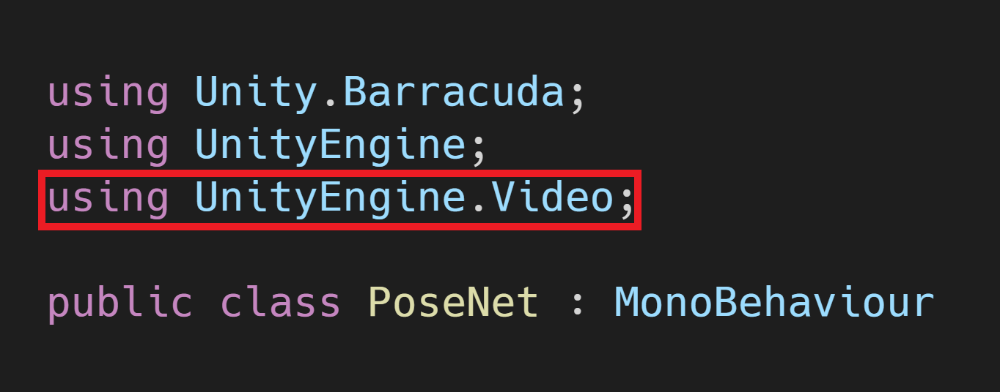{fig-align="center"}

## Add Webcam Variables

Unity defaults to a resolution of `640 x 480` for webcams. There is no built-in method that returns the frame rate. However, the default does not appear to be over 30fps.  We can request a resolution and frame rate when initializing the `webcamTexture`. Unity should accept the requested settings as long as the camera supports them. Unity defaults to its closest preset if the requested settings are not supported.

### Create `webcamHeight` Variable

Add a new public `int` variable so we can adjust the camera height from the `Inspector` tab. Name the variable `webcamHeight`. My webcam supports 720p at 60fps, so I've set the default value to `720`.

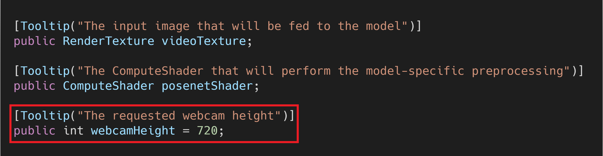{fig-align="center"}

### Create `webcamWidth` Variable

Next, create a variable for the camera's width and name it `webcamWidth`. I've set the default value to `1280`.

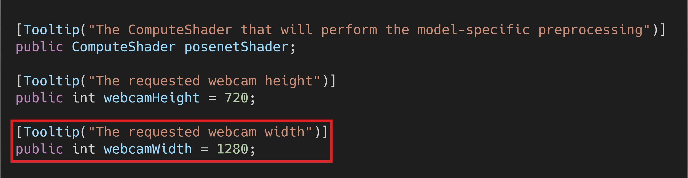{fig-align="center"}

### Create `webcamFPS` Variable

We'll also add a variable to set the frame rate for the camera and name it `webcamFPS`. Set the default value to `60`.

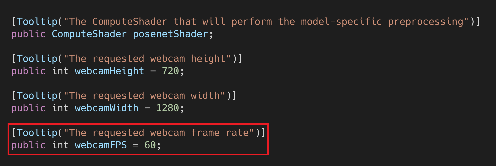{fig-align="center"}

## Add Video Resolution Variables

Next, we need to create a couple of private `int` variables to store the dimensions of the video source. Name the variables `videoHeight` and `videoWidth`.

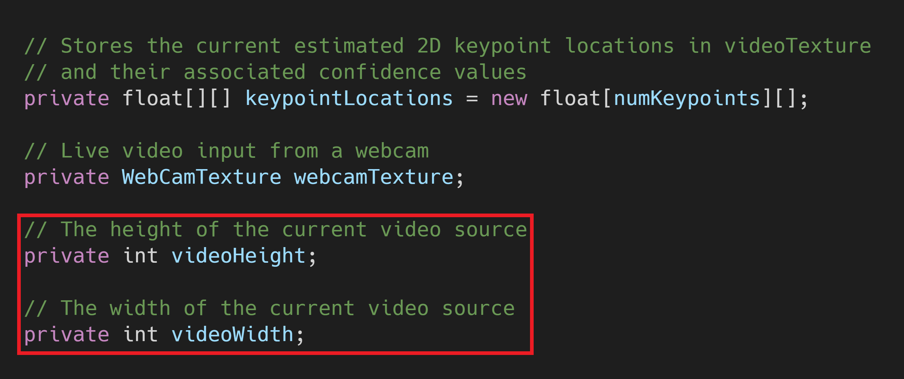{fig-align="center"}

## Update `Start()` Method

We'll make some modifications to the `Start()` method to prepare for input with different aspect ratios.

### Get Reference to `Video Player`

Create a new `GameObject` variable to access the `Video Player` object. Name the variable `videoPlayer` and place it at the top of the `Start()` method. We'll also move the `Transform videoScreen` variable outside of the `if (useWebcam)` statement.

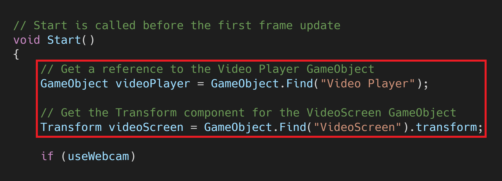{fig-align="center"}

### Get Webcam Resolution

We can't access the webcam resolution until after the webcam has started. Therefore, we'll update the values for `videoHeight` and `videoWidth` after `webcamTexture.Play()` has been called.

{fig-align="center"}

### Get Video Clip Dimensions

We need to get the video resolution from the `Video Player` object when we're not using a webcam. We can get the height and width by accessing the `VideoPlayer` component.

{fig-align="center"}

### Replace `videoTexture`

The dimensions for `videoTexture` can't be updated once it's been created. We'll need to replace it with a new `RenderTexture` that uses the new `videoHeight` and `videoWidth` values. We also need to set the new `videoTexture` as the `targetTexture` for the `Video Player` object.

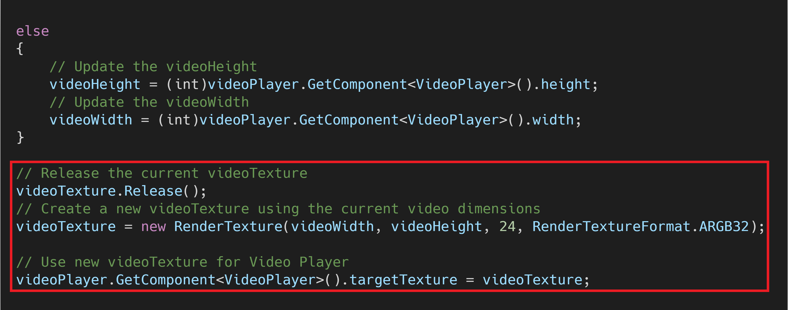{fig-align="center"}

### Update `VideoScreen`

Next, we need to apply the new `videoTexture` to the `VideoScreen` object. We'll also resize and reposition the `VideoScreen` to account for any changes in the `videoTexture` dimensions. 

{fig-align="center"}

### Adjust `Main Camera`

We'll also resize and reposition the `Main Camera` object to account for changes to the `VideoScreen`.

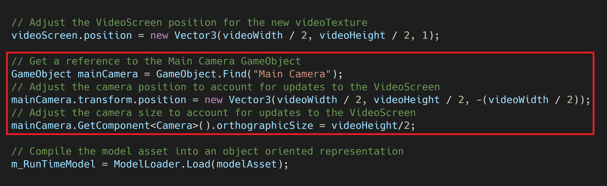{fig-align="center"}

## Update `ProcessOutput()` Method

Finally, we need to modify how we calculate the key point locations.

### Update Scaling Calculations

We'll account for different aspect ratios by first determining whether the height or width of `videoTexture` is larger. We then use that information to calculate the `scale` and `unsqueezeScale` values.

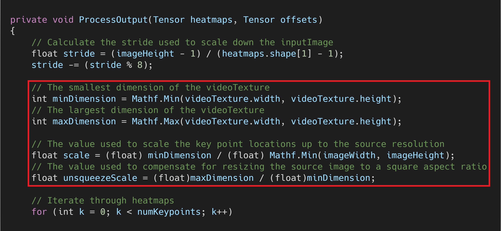{fig-align="center"}

### Update Key Point Calculations

We should only scale the `xPos` value by the `unsqueezeScale` if the width larger than the height. Remove that part from the initial `xPos` calculation. We also need to move the `if (useWebcam)` statement.

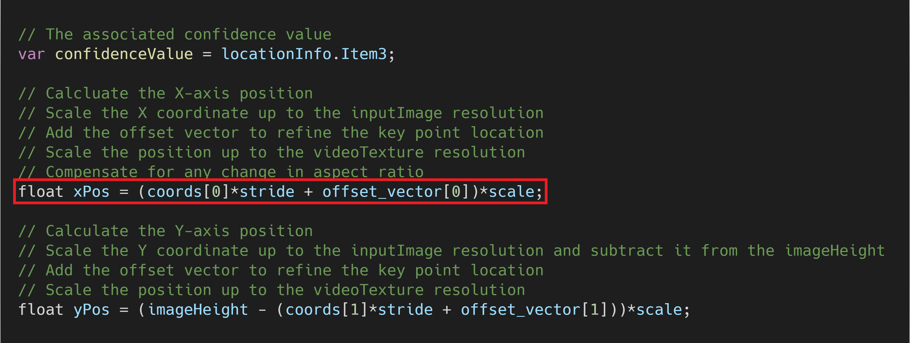{fig-align="center"}

We'll scale either `xPos` or `yPos` by `unsqueezeScale` depending on whether the width or height value for `videoTexture` is larger. Place the `if (useWebcam)` statement after this calculation.

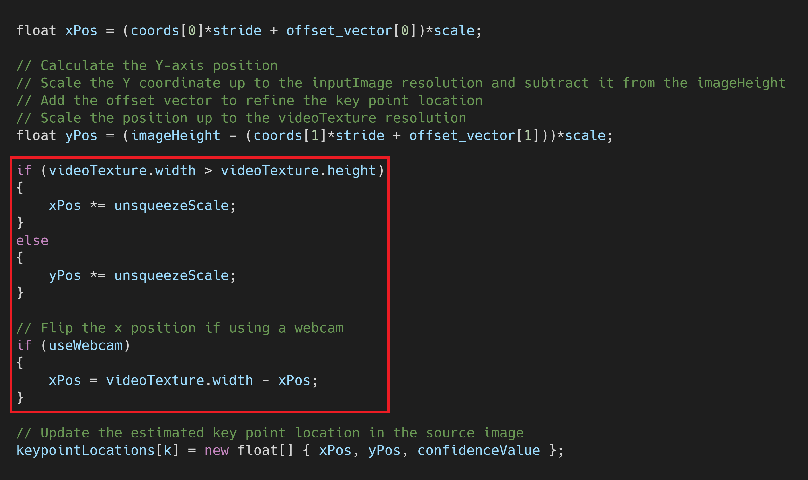{fig-align="center"}

## Try It Out

Now we can test the modifications on some vertical videos from [Pexels](https://www.pexels.com/).

1. [Woman Doing a Jump Rope Exercise](https://www.pexels.com/video/woman-doing-a-jump-rope-exercise-2785536/)
2. [Man Dancing Hip-Hop](https://www.pexels.com/video/man-dancing-hip-hop-2795742/)

{fig-align="center"}

## Summary

Now we can use video sources with different aspect ratios without needing to manually change any parameters.

### [GitHub Repository - Version 1](https://github.com/cj-mills/Barracuda-PoseNet-Tutorial/tree/Version-1)

<!-- Cloudflare Web Analytics --><!-- End Cloudflare Web Analytics -->