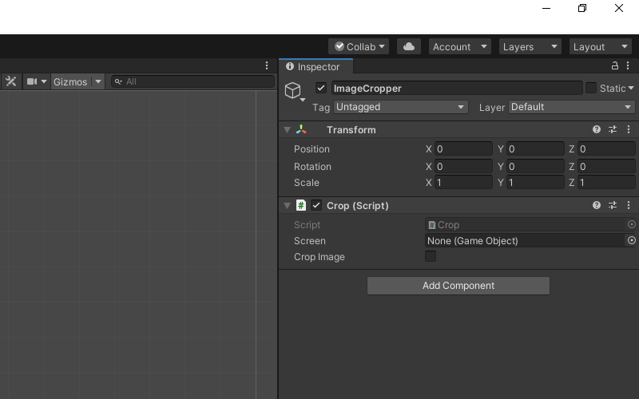
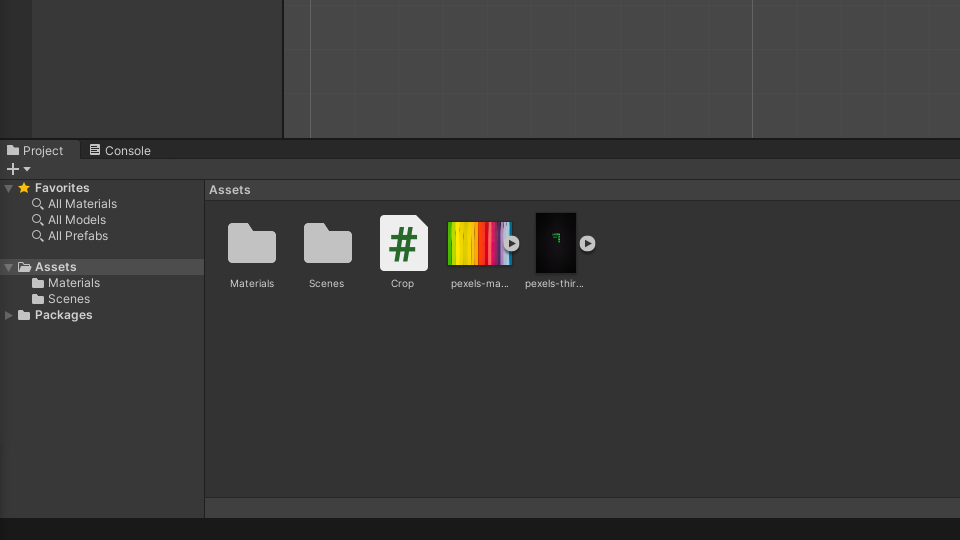
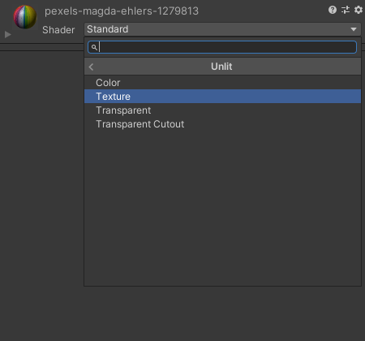
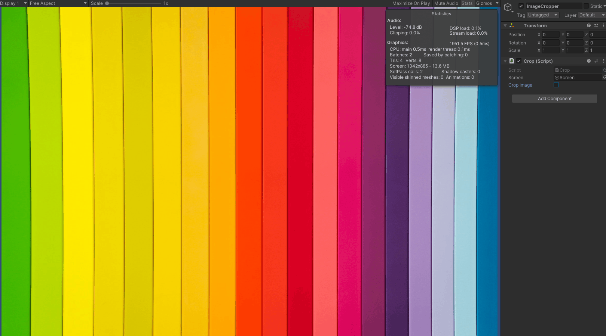

* [Introduction](#introduction)
* [Create a 2D Unity Project](#create-a-2d-unity-project)
* [Create `Crop` Script](#create-crop-script)
* [Create Screen GameObject](#create-screen-gameobject)
* [Create ImageCropper](#create-imagecropper)
* [Test it Out](#test-it-out)
* [Conclusion](#conclusion)


## Introduction

In this post, we cover how to create a square crop of an image in Unity without using a shader. You can also adapt the approach described in this tutorial to crop other parts of images.


## Create a 2D Unity Project

Open the Unity Hub and create a new 2D project. I'm using `Unity 2019.4.20f1`, but you should be fine using other versions.

{fig-align="center"}


## Create `Crop` Script

In Unity, right-click an empty space in the Assets folder and select `C# Script` in the `Create` submenu. Name the new script, `Crop` and open it in your code editor.

{fig-align="center"}


### Define Variables

Create a public `GameObject` variable called `screen`. We'll be using this screen to confirm our script is correctly cropping the test images. Add a public `bool` variable called `cropImage` as well. This will let us toggle whether to crop the image during runtime. Lastly, we'll create a private `RenderTexture` called `image` to store a copy of the original  test image.

```c#
public class Crop : MonoBehaviour
{
    [Tooltip("The screen to which the test image is attached")]
    public GameObject screen;

    [Tooltip("Toggle whether to crop the test image")]
    public bool cropImage;

    // A copy of the original test image
    private RenderTexture image;


    // Start is called before the first frame update
    void Start()
```


### Define `Start()` Method

In the `Start()` method, we'll store a copy the original test image in the `image` `RenderTexture`. We can do so by getting a reference to the `Texture` attached to the `screen` and using the [`Graphics.Blit()`](https://docs.unity3d.com/ScriptReference/Graphics.Blit.html) method. We'll also adjust the camera so that we can see the entire image. 

```c#
// Start is called before the first frame update
void Start()
{
    // Get a reference to the image texture attached to the screen
    Texture screenTexture = screen.GetComponent<MeshRenderer>().material.mainTexture;

    // Create a new RenderTexture with the same dimensions as the test image
    image = new RenderTexture(screenTexture.width, screenTexture.height, 24, RenderTextureFormat.ARGB32);
    // Copy the screenTexture to the image RenderTexture
    Graphics.Blit(screenTexture, image);

    // Get a reference to the Main Camera object
    GameObject mainCamera = GameObject.Find("Main Camera");
    // Adjust the camera so that the whole image is visible
    mainCamera.GetComponent<Camera>().orthographicSize = image.height / 2;
}
```


### Define `Update()` Method

First, we need to make another copy of the original image so that we can edit it. We'll store this copy in a [temporary](https://docs.unity3d.com/ScriptReference/RenderTexture.GetTemporary.html) `RenderTexture` called `rTex` that will get released at the end of the method. 

We can't change the dimensions of a `RenderTexture` after it's been created. Instead, we'll create a cropped image by copying part of `rTex` to another temporary `RenderTexture` called `tempTex` that will be square. We can copy the square image to `rTex` after we release the current `RenderTexture` assigned to `rTex` and make a new square one.

The size of `tempTex` will depend on whether the original image is wider or taller. We want to use the smallest side of the original image. 

We'll determine what part of `rTex` we need to copy by calculating either `(image.width - image.height) / 2f` or `(image.height - image.width) / 2f` depending on whether the image is wider or taller.

We can copy part of `rTex` to `tempTex` using the [`Graphics.CopyTexture()`](https://docs.unity3d.com/ScriptReference/Graphics.CopyTexture.html) method. We need to specify several parameters in order to use this method to crop images.

1. `src`: The original image
2. `srcElement`: The source texture element, set to `0`
   * Not relevant for our use case
3. `srcMip`: The mipmap level for the image `RenderTexture`, set to `0`
   * Not relevant for our use case
4. `srcX`: The X coordinate of the top left corner of the center square of the original image
5. `srcY`: The Y coordinate of the top left corner of the center square of the original image
6. `srcWidth`: Width of the new square image
7. `srcHeight`: Height of the new square image
8. `dst`: An empty square `RenderTexture`
9. `dstElement`: The destination texture element, set to `0`
   * Not relevant for our use case
10. `dstMip`: The mipmap level for destination texture, set to `0`
    * Not relevant for our use case
11. `dstX`: The X coordinate of the top left corner of the new square image
12. `dstY`: The Y coordinate of the top left corner of the new square image

After we copy `tempTex` back to `rTex` we'll update the `Texture` for the `screen` with the new square image and adjust the shape of the screen to fit the new image. 

```c#
// Update is called once per frame
void Update()
{
    // Allocate a temporary RenderTexture with the original image dimensions
    RenderTexture rTex = RenderTexture.GetTemporary(image.width, image.height, 24, image.format);
    // Copy the original image
    Graphics.Blit(image, rTex);

    if (cropImage)
    {
        // Stores the size of the new square image
        int size;
        // Stores the coordinates in the original image to start copying from
        int[] coords;
        // Temporarily tores the new square image
        RenderTexture tempTex;

        if (image.width > image.height)
        {
            // Set the dimensions for the new square image
            size = image.height;
            // Set the coordinates in the original image to start copying from
            coords = new int[] { (int)((image.width - image.height) / 2f), 0 };
            // Allocate a temporary RenderTexture
            tempTex = RenderTexture.GetTemporary(size, size, 24, image.format);
        }
        else
        {
            // Set the dimensions for the new square image
            size = image.width;
            // Set the coordinates in the original image to start copying from
            coords = new int[] { 0, (int)((image.height - image.width) / 2f) };
            // Allocate a temporary RenderTexture
            tempTex = RenderTexture.GetTemporary(size, size, 24, image.format);
        }

        // Copy the pixel data from the original image to the new square image
        Graphics.CopyTexture(image, 0, 0, coords[0], coords[1], size, size, tempTex, 0, 0, 0, 0);

        // Free the resources allocated for the Temporary RenderTexture
        RenderTexture.ReleaseTemporary(rTex);
        // Allocate a temporary RenderTexture with the new dimensions
        rTex = RenderTexture.GetTemporary(size, size, 24, image.format);
        // Copy the square image
        Graphics.Blit(tempTex, rTex);

        // Free the resources allocated for the Temporary RenderTexture
        RenderTexture.ReleaseTemporary(tempTex);
    }

    // Apply the new RenderTexture
    screen.GetComponent<MeshRenderer>().material.SetTexture("_MainTex", rTex);
    // Adjust the screen dimensions to fit the new RenderTexture
    screen.transform.localScale = new Vector3(rTex.width, rTex.height, screen.transform.localScale.z);

    // Free the resources allocated for the Temporary RenderTexture
    RenderTexture.ReleaseTemporary(rTex);

}
```


## Create Screen GameObject

Back in Unity, right-click an empty space in the `Hierarchy` tab and select `Quad` from the `3D Object` submenu. Name the new object `Screen`. The size will be updated automatically by the `Crop.cs` script.

{fig-align="center"}

## Create ImageCropper

Right-click an empty space in the `Hierarchy` tab and select `Create Empty` from the pop-up menu. Name the empty object `ImageCropper`

{fig-align="center"}

With the `ImageCropper` selected drag and drop the `Crop.cs` script into the `Inspector` tab.

{fig-align="center"}

Drag and drop the `Screen` object from the `Hierarchy` tab onto the `Screen` parameter in the `Inspector` tab.

{fig-align="center"}


## Test it Out

We'll need some test images to try out the `ImageCropper`. You can use your own or download the ones I used for this tutorial.

* [Wide Image](https://drive.google.com/file/d/1abd1RJTu5GvyRqrRfrNjePNX7WPq8mBQ/view?usp=sharing)
* [Tall Image](https://drive.google.com/file/d/1gQZr0vlPYFbvccRSryv0Zou1mPKd5wHj/view?usp=sharing)

 Drag and drop the test images into the `Assets` folder. Select one of the images and drag it onto the `Screen` in the `Scene`. 


{fig-align="center"}


Next, we need to set our Screen to use an `Unlit` shader. Otherwise it will be a bit dim. With the Screen object selected, open the `Shader` drop-down menu in the `Inspector` tab and select `Unlit`. 


{fig-align="center"}


Select `Texture` from the `Unlit` submenu.

{fig-align="center"}


Now we can click the Play button and toggle the `Crop Image` checkbox to confirm our script is working properly. If you check the performance stats, you should see that there is basically no performance hit from cropping the image.

{fig-align="center"}


{fig-align="center"}


## Conclusion

That is one method to efficiently crop images on the GPU in Unity. As mentioned earlier, this method can be adapted to crop different parts of the image. You can do so by changing the values for the `Graphics.CopyTexture()` method to adjust what part of the source image gets copied and where in the target image it gets copied to.


**Project Resources:** [GitHub Repository](https://github.com/cj-mills/Crop-Image-on-GPU-Unity)



