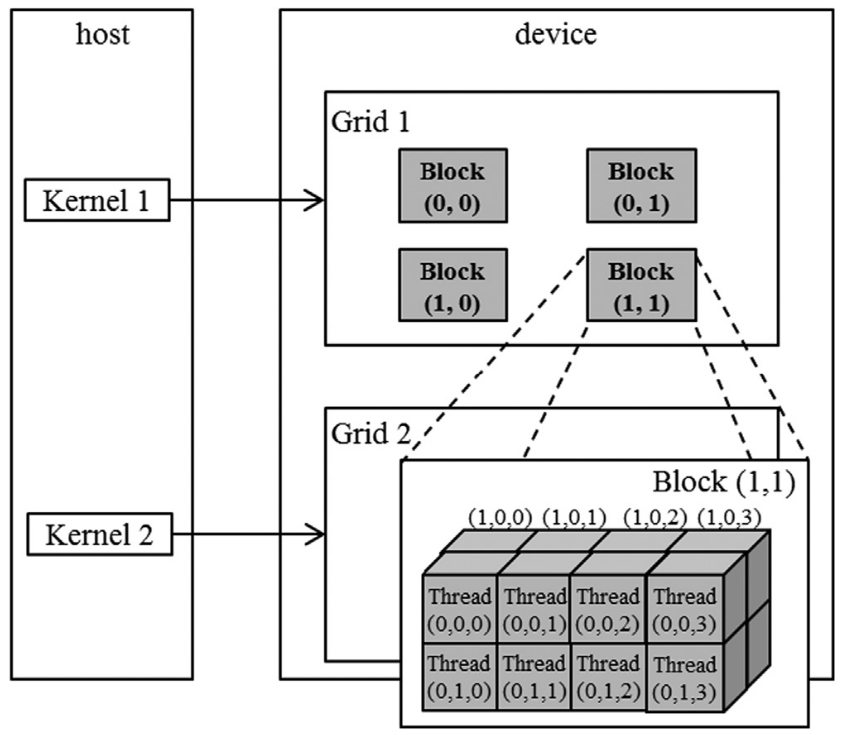
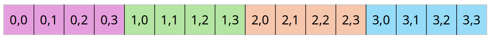

::: {.callout-tip}
## This post is part of the following series:
* [**GPU MODE Lecture Notes**](/series/notes/cuda-mode-notes.html): My notes from the **GPU MODE** reading group lectures run by **Andreas Kopf** and **Mark Saroufim**.
:::


* [Lecture Information](#lecture-information)
* [Ch.1: Introduction](#introduction)
* [Ch.2: Heterogeneous Data Parallel Computing](#heterogeneous-data-parallel-computing)
* [Ch.3: Multidimensional Grids and Data](#multidimensional-grids-and-data)


## Lecture Information

* **Speaker:**  Andreas Kopf
* **Topic:** PMPP Book Ch. 1-3
* **Resources:**

  - **Lecture Slides:** [CUDA Mode: Lecture 2](https://docs.google.com/presentation/d/1deqvEHdqEC4LHUpStO6z3TT77Dt84fNAvTIAxBJgDck/edit#slide=id.g2b1444253e5_1_75)

  - **Textbook:** [Programming Massively Parallel Processors](https://www.amazon.com/Programming-Massively-Parallel-Processors-Hands/dp/0323912311/)

  - **GitHub Repository:** [GPU MODE Lecture 2](https://github.com/cuda-mode/lectures/tree/main/lecture_002)

  - **Discord Channel:** [GPU MODE](https://discord.gg/cudamode)

  - **YouTube Channel:** [GPU MODE](https://www.youtube.com/@CUDAMODE)


## Introduction

* Timestamp: [1:00](https://youtu.be/NQ-0D5Ti2dc?si=59R0B3U5I8SLKY8K&t=60)


### Motivation 

* Optimize GPU performance as much as possible
* Applications:
  * simulate and model worlds
    * games
    * weather
    * proteins
    * robotics
* Bigger models are smarter
  * speed and size improvements can have a significant impact on useability
* GPUs are the backbon of modern deep learning

### History

* Classic software uses sequential programs
  * executed one step at a time
  * relied on higher CPU clock rates for improved performance
* Higher clock rate trend for CPUs slowed in 2003 due to energy consumption and heat dissipation challenges
  * Increasing frequency would make the chip to hot to cool feasibly
* Multi-core CPU came up
  * Developers had to learn multi-threading
    * New challenges such as deadlocks and race conditions

### Rise of CUDA

* Compute Unified Device Architecture
* CUDA is all about parallel programs
  * divide work among threads
* GPUs have much higher peak FLOPS than multi-core CPUs
  * Benefits highly parallelized programs
  * Not suitable for largely sequential programs
* CPU+GPU
  * Run sequential parts on CPU and numerically intensive parts on GPU
* GPGPU
  * Before CUDA tricks were used to compute with graphics APIs like OpenGL and Direct3D
* GPU programming is now attractive to developers due to massive availability

### Amdahl's Law

* $$
  speedup = ( Slow \ System \ Time )/(Fast \ System \ Time)
  $$

  

* achievable speedup is limited by the parallelizable portion of $p$

* $$
  speedup < \frac{1}{1-p}
  $$

  * If $p$ is $90\%$, $speedup < 10X$

* $p > 99\%$ for many real applications

  * especially for large datasets
  * speedups $> 100X$ are attainable

### Challenges

* "If you do not care about performance, parallel programming is very easy"
* In practice, designing parallel algorithms is harder than sequential algorithms
  * Parallelizing recurrent computations requires nonintuitive thinking
    * prefix sum
      * [Wikipedia Page](https://en.wikipedia.org/wiki/Prefix_sum)
* Speed is often limited by memory latency/throughput (memory bound)
  * Often need to read something to the GPU, perform some computation, and the write back the result
    * LLM inference generates token by token
* Input data characteristics can significantly influence performance of parallel programs
  * LLMs short or large sequences
  * Might need different kernels optimized for different input shapes
* Not all applications are "embarrassingly parallel"
  * Synchronization imposes overhead
    * Need to wait for GPU operations to complete

### Main Goals of the Book

1. Parallel programming & computational thinking
   * Aims to build a foundation for parallel programming in general
   * Uses GPUs as a learning vehicle
     * Techniques apply to other accelerators
     * Concepts are introduced through hands-on CUDA examples
2. Correct & reliable parallel programing
   * Debugging both functions and performance
   * Understanding where things are fast and slow and how to improve the slow parts
3. Scalability
   * Regularize and localize memory access
   * How to organize memory


## Heterogeneous Data Parallel Computing

* Timestamp: [8:31](https://youtu.be/NQ-0D5Ti2dc?si=ZeFGj3WVYDF_TI96&t=511)
* heterogeneous: CPU + GPU
* data parallelism: break work down into computations that can be executed independently


### CUDA C

* extends ANSI C with minimal new syntax
* Terminology
  * CPU=host
  * GPU=device
  * Kernels: device code functions
* CUDA C source can be a mixture of host & device code
* grid of threads
  * Many threads are launched to execute a kernel
* CPU & GPU code runs concurrently (overlapped)
  * Kernels launch and run on GPU asynchronously
  * Need to wait for the kernels to finish before copying data back to CPU
* Don't be afraid to launch many threads on GPU
  * One thread per output tensor is fine


### CUDA Essentials: Memory Allocation

* NVIDIA devices come with their own DRAM (device) global memory
* `cudaMalloc` & `cudaFree`:
  * `cudaMalloc`: Allocate device global memory
  * `cudaFree`: Free device global memory
  * ```c
    float *A_d;
    size_t size = n * sizeof(float); // size in bytes
    cudaMalloc((void**)&A_d, size); // pointer to pointer
    ...
    cudaFree(A_d);
    ```
  * Code convention

    * `_d` for device pointer
    * `_h` for host
  * `cudaMemcpy`
    * Copy data from CPU memory to GPU memory and vice versa
    * ```c
      // copy input vectors to device (host -> device)
      cudaMemcpy(A_d, A_h, size, cudaMemcpyHostToDevice);
      cudaMemcpy(B_d, B_h, size, cudaMemcpyHostToDevice);
      ...
      // transfer result back to CPU memory (device -> host)
      cudaMemcpy(C_h, C_d, size, cudaMemcpyDeviceToHost);
      ```

### CUDA Error Handling

* CUDA functions return `cudaError_t` 
  * `cudaSuccess` for successful operation
* Always check returned error status

### Kernel functions `fn<<>>`

* Launching kernel
  * grid of threads is launched
* All threads execute the same code
  * SPMD: Single Program Multiple Data
* Threads are hierarchically organized into grid blocks & thread blocks
  * Up to 1024 threads in a thread block

### Kernel Coordinates

* Built-in variables available inside the kernel
  * `blockIdx`: the area code for a telephone
    * Note: Blocks are a logical organization of threads, not physical
  * `threadIdx`: the local phone number
  * These are 'coordinates' that allow threads to identify which portion of the data to process
  * Can use `blockIdx` and `threadIdx` to uniquely identify threads
  * `blockDim`: tells us the number of threads in a block
* For vector addition, we can calculate the array index of the thread
  * ```c
    int i = blockIdx.x * blockDim.x + threadIdx.x;
    ```
* All threads in a grid execute the same kernel code


 {fig-align="center"}

### CUDA C keywords for function declaration

| Qualifier Keyword    | Callable From    | Executed On | Executed By                |
| -------------------- | ---------------- | ----------- | -------------------------- |
| `__host__` (default) | Host             | Host        | Caller host thread         |
| `__global__`         | Host (or Device) | Device      | New grid of device threads |
| `__device__`         | Device           | Device      | Caller device thread       |

* `__global__` & `__host__`
  * Tell the compiler whether the function should live on the device or host
  * Declare a kernel function with `__global__`
    * Calling a `__global__` function launches new grid of CUDA threads
* Functions declared with `__device__` can be called from within CUDA thread
  * Does not launch a new thread
  * Only accessible from within kernels
* If both `__host__` and `__device__` are used in a function declaration
  * CPU and GPU versions will be compiled

  


### Calling Kernels

* Kernel configuration is specified between `<<<` and `>>>`
* Number of blocks, number of threads in each block
* ```c
  // Define the number of threads per block.
  // Each block will have 256 threads.
  dim3 numThreads(256);
  
  // Calculate the number of blocks needed to cover the entire vector.
  // Use ceiling division to ensure that the number of blocks is sufficient
  // to handle all elements of the vector 'n'.
  // The formula (n + numThreads.x - 1) / numThreads.x ensures this.
  dim3 numBlocks((n + numThreads.x - 1) / numThreads.x);
  
  // Launch the vector addition kernel with the calculated number of blocks and threads.
  // This will execute the vecAddKernel function on the GPU with 'numBlocks' blocks,
  // each containing 'numThreads.x' threads.
  vecAddKernel<<<numBlocks, numThreads>>>(A_d, B_d, C_d, n);
  ```

### Compiler

* nvcc
  * NVIDIA C Compiler
  * Use to compiler kernels into PTX (CUDA assembly)
* PTX
  * Parallel Thread Execution
  * Low-level VM & instruction set
* Grahics driver translates PTX into executable binary code (SASS)
  * SASS is the low-level assembly language that compiles to binary microcode, which executes natively on NVIDIA GPU hardware. 

### Code Example: Vector addition

* main concept: replace loop with a grid of threads
* easily parallelizable
  * all additions can be computed independently
* Naive GPU vector addition
  1. Allocate device memory for vectors
  2. Transfer inputs from host to device
  3. Launch kernel and perform addition operations
  4. Copy outputs from device to host
  5. Free device memory
  *  The ratio of data transfer vs compute is not very good 
     *  Normally keep data on the GPU as long as possible to asynchronously schedule many kernel launches
* Figure from slide 13:
  * One thread per vector element
   {fig-align="center"}

* Data sizes might not be perfectly divisible by block sizes
  * always check bounds
* Prevent threads of boundary block to read/write outside allocated memory
* ```c
  /**
   * @brief CUDA kernel to compute the element-wise sum of two vectors.
   *
   * This kernel function performs the pair-wise addition of elements from
   * vectors A and B, and stores the result in vector C.
   *
   * @param A Pointer to the first input vector (array) in device memory.
   * @param B Pointer to the second input vector (array) in device memory.
   * @param C Pointer to the output vector (array) in device memory.
   * @param n The number of elements in the vectors.
   */
  __global__
  void vecAddKernel(float* A, float* B, float* C, int n) {
      // Calculate the unique index for the thread
      int i = threadIdx.x + blockDim.x * blockIdx.x;
  
      // Check if the index is within the bounds of the arrays
      if (i < n) {
          // Perform the element-wise addition
          C[i] = A[i] + B[i];
      }
  }
  ```

### Code Example: Kernel to convert an RGB image to grayscale

* Each RGB pixel can be converted individually
* $$
  Luminance = r\cdot{0.21} + g\cdot{0.72} + b\cdot{0.07}
  $$
* Simple weighted sum

{fig-align="center"}


## Multidimensional Grids and Data

* Timestamp: [24:55](https://youtu.be/NQ-0D5Ti2dc?si=k2a0vvryolFT8AsZ&t=1495)


### CUDA Grid

* 2-level hierarchy
  * Blocks and threads
* Idea: Map threads to multi-dimensional data (e.g., an image)
* All threads in a grid execute the same kernel
* Threads in the same block can access the same shared memory
* Max block size: 1024
* Built-in 3D coordinates of a thread 
  * `blockIdx` and `threadIdx` identify which portion of the data to process
* shape of grid & blocks
  * `gridDim`: number of blocks in the grid
  * `blockDim`: number of threads in a block
* A multidimensional example of CUDA grid organization:

{width=67% fig-align="center"} 

* Grid can be different for each kernel launch
  * Normally dependent on data shapes
* Typical grids contain thousands to millions of threads
* Simple Strategy
  * One thread per output element
    * One thread per pixel
    * One thread per tensor element
* Threads can be scheduled in any order
   * A larger thread index does not necessarily indicate the thread is running after a thread with a lower index 
* Can use fewer than 3 dims (set others to 1)
  * 1D for sequences, 2D for images, etc.
  * ```c
    dim3 grid(32, 1, 1);
    dim3 block(128, 1, 1);
    kernelFunction<<<grid, block>>>(..);
    // Number of threads: 128*32 = 4096
    ```

### Built-in Variables

* Built-in variables inside kernels:
  * ```c
    blockIdx // dim3 block coordinate
    threadIdx // dim3 thread coordinate
    blockDim // number of threads in a block
    gridDim // number of blocks in a grid
    ```
  * `blockDim` and `gridDim` have the same values in all threads

### nd-Arrays in Memory

* memory of multi-dim arrays under the hood is a flat 1-dimensional array

{fig-align="center"}

{fig-align="center"}


* 2d array can be linearized in different ways
  * ```text
    A B C D E F G H I
    ```
  * row-major
    * ```text
      A B C
      D E F
      G H I
      ```
    * Most common
  * column-major
    * ```text
      A D G
      B E H
      C F I
      ```
    * Used in fortran
* PyTorch tensors and numpy arrays use strides to specify how elements are laid out in memory
  * For a $4 \times 4$ matrix, the stride would be $4$ to get to the next row.
    * After four elements, you end up in the next row.

### Code Example: Image Blur

* mean filter example `blurKernel`:
  * ```c
    // CUDA kernel to perform a simple box blur on an input image
    __global__
    void blurKernel(unsigned char *in, unsigned char *out, int w, int h) {
        // Calculate the column and row index of the pixel this thread is processing
        int col = blockIdx.x * blockDim.x + threadIdx.x;
        int row = blockIdx.y * blockDim.y + threadIdx.y;
        
        // Ensure the thread is within the image bounds
        if (col < w && row < h) {
            int pixVal = 0; // Variable to accumulate the sum of pixel values
            int pixels = 0; // Variable to count the number of valid pixels in the blur region
    
            // Loop over the surrounding pixels within the blur region
            for (int blurRow = -BLUR_SIZE; blurRow <= BLUR_SIZE; ++blurRow) {
                for (int blurCol = -BLUR_SIZE; blurCol <= BLUR_SIZE; ++blurCol) {
                    int curRow = row + blurRow; // Current row index in the blur region
                    int curCol = col + blurCol; // Current column index in the blur region
    
                    // Check if the current pixel is within the image bounds
                    if (curRow >= 0 && curRow < h && curCol >= 0 && curCol < w) {
                        pixVal += in[curRow * w + curCol]; // Accumulate the pixel value
                        ++pixels; // Increment the count of valid pixels
                    }
                }
            }
    
            // Calculate the average pixel value and store it in the output image
            out[row * w + col] = (unsigned char)(pixVal / pixels);
        }
    }
    ```

    

* each thread writes one output element, read multiple values
* single plane in book, can be easily extended to multi-channel
* shows row-major pixel memory access (in & out pointers)
* track of how many pixel values are summed
* Handling boundary conditions for pixels near the edges of the image:

{fig-align="center"}


```python
from pathlib import Path
import numpy as np
from PIL import Image
import torch
from torch.utils.cpp_extension import load_inline
```


::: {.callout-note title="CUDA Code" collapse=true}

```text

```

```c++
#include <torch/types.h>
#include <cuda.h>
#include <cuda_runtime.h>

#include <c10/cuda/CUDAException.h>
#include <c10/cuda/CUDAStream.h>


// CUDA kernel for applying a mean filter to an image
__global__
void mean_filter_kernel(unsigned char* output, unsigned char* input, int width, int height, int radius) {
    // Calculate the column, row, and channel this thread is responsible for
    int col = blockIdx.x * blockDim.x + threadIdx.x;
    int row = blockIdx.y * blockDim.y + threadIdx.y;
    int channel = threadIdx.z;

    // Base offset for the current channel
    int baseOffset = channel * height * width;

    // Ensure the thread is within image bounds
    if (col < width && row < height) {
        int pixVal = 0; // Accumulator for the pixel values
        int pixels = 0; // Counter for the number of pixels summed

        // Iterate over the kernel window
        for (int blurRow = -radius; blurRow <= radius; blurRow += 1) {
            for (int blurCol = -radius; blurCol <= radius; blurCol += 1) {
                int curRow = row + blurRow;
                int curCol = col + blurCol;

                // Check if the current position is within image bounds
                if (curRow >= 0 && curRow < height && curCol >= 0 && curCol < width) {
                    // Accumulate pixel value and count the number of pixels
                    pixVal += input[baseOffset + curRow * width + curCol];
                    pixels += 1;
                }
            }
        }

        // Write the averaged value to the output image
        output[baseOffset + row * width + col] = (unsigned char)(pixVal / pixels);
    }
}

// Helper function for ceiling unsigned integer division
inline unsigned int cdiv(unsigned int a, unsigned int b) {
    return (a + b - 1) / b;
}

// Main function to apply the mean filter to an image using CUDA
torch::Tensor mean_filter(torch::Tensor image, int radius) {
    // Ensure the input image is on the GPU, is of byte type, and radius is positive
    assert(image.device().type() == torch::kCUDA);
    assert(image.dtype() == torch::kByte);
    assert(radius > 0);

    // Get image dimensions and number of channels
    const auto channels = image.size(0);
    const auto height = image.size(1);
    const auto width = image.size(2);

    // Create an empty tensor to store the result
    auto result = torch::empty_like(image);

    // Define the number of threads per block and number of blocks
    dim3 threads_per_block(16, 16, channels);
    dim3 number_of_blocks(
        cdiv(width, threads_per_block.x),
        cdiv(height, threads_per_block.y)
    );

    // Launch the CUDA kernel
    mean_filter_kernel<<<number_of_blocks, threads_per_block, 0, torch::cuda::getCurrentCUDAStream()>>>(
        result.data_ptr<unsigned char>(),
        image.data_ptr<unsigned char>(),
        width,
        height,
        radius
    );

    // Check for any CUDA errors (calls cudaGetLastError())
    C10_CUDA_KERNEL_LAUNCH_CHECK();

    // Return the filtered image
    return result;
}
```

:::


```python
# Define the CUDA kernel and C++ wrapper
cuda_source = '''
#include <c10/cuda/CUDAException.h>
#include <c10/cuda/CUDAStream.h>


// CUDA kernel for applying a mean filter to an image
__global__
void mean_filter_kernel(unsigned char* output, unsigned char* input, int width, int height, int radius) {
    // Calculate the column, row, and channel this thread is responsible for
    int col = blockIdx.x * blockDim.x + threadIdx.x;
    int row = blockIdx.y * blockDim.y + threadIdx.y;
    int channel = threadIdx.z;

    // Base offset for the current channel
    int baseOffset = channel * height * width;

    // Ensure the thread is within image bounds
    if (col < width && row < height) {
        int pixVal = 0; // Accumulator for the pixel values
        int pixels = 0; // Counter for the number of pixels summed

        // Iterate over the kernel window
        for (int blurRow = -radius; blurRow <= radius; blurRow += 1) {
            for (int blurCol = -radius; blurCol <= radius; blurCol += 1) {
                int curRow = row + blurRow;
                int curCol = col + blurCol;

                // Check if the current position is within image bounds
                if (curRow >= 0 && curRow < height && curCol >= 0 && curCol < width) {
                    // Accumulate pixel value and count the number of pixels
                    pixVal += input[baseOffset + curRow * width + curCol];
                    pixels += 1;
                }
            }
        }

        // Write the averaged value to the output image
        output[baseOffset + row * width + col] = (unsigned char)(pixVal / pixels);
    }
}

// Helper function for ceiling unsigned integer division
inline unsigned int cdiv(unsigned int a, unsigned int b) {
    return (a + b - 1) / b;
}

// Main function to apply the mean filter to an image using CUDA
torch::Tensor mean_filter(torch::Tensor image, int radius) {
    // Ensure the input image is on the GPU, is of byte type, and radius is positive
    assert(image.device().type() == torch::kCUDA);
    assert(image.dtype() == torch::kByte);
    assert(radius > 0);

    // Get image dimensions and number of channels
    const auto channels = image.size(0);
    const auto height = image.size(1);
    const auto width = image.size(2);

    // Create an empty tensor to store the result
    auto result = torch::empty_like(image);

    // Define the number of threads per block and number of blocks
    dim3 threads_per_block(16, 16, channels);
    dim3 number_of_blocks(
        cdiv(width, threads_per_block.x),
        cdiv(height, threads_per_block.y)
    );

    // Launch the CUDA kernel
    mean_filter_kernel<<<number_of_blocks, threads_per_block, 0, torch::cuda::getCurrentCUDAStream()>>>(
        result.data_ptr<unsigned char>(),
        image.data_ptr<unsigned char>(),
        width,
        height,
        radius
    );

    // Check for any CUDA errors (calls cudaGetLastError())
    C10_CUDA_KERNEL_LAUNCH_CHECK();

    // Return the filtered image
    return result;
}
'''

cpp_source = "torch::Tensor mean_filter(torch::Tensor image, int radius);"
```


```python
build_dir = Path('./load_inline_cuda')
build_dir.mkdir(exist_ok=True)
```


```python
# Load the defined C++/CUDA extension as a PyTorch extension.
# This enables using the `mean_filter` function as if it were a native PyTorch function.
mean_filter_extension = load_inline(
    name='mean_filter_extension',   # Unique name for the extension
    cpp_sources=cpp_source,           # C++ source code containing the CPU implementation
    cuda_sources=cuda_source,         # CUDA source code for GPU implementation
    functions=['mean_filter'],      # List of functions to expose to Python
    with_cuda=True,                   # Enable CUDA support
    extra_cuda_cflags=["-O2"],        # Compiler flags for optimizing the CUDA code
    build_directory=str(build_dir),   # Directory to store the compiled extension
)
```


```python
# Define the path to the image file
img_path = Path('./Grace_Hopper.jpg')

# Open the image using PIL (Python Imaging Library)
test_img = Image.open(img_path)
test_img
```

{fig-align="center"}

```python
# Convert the image to a NumPy array, then to a PyTorch tensor
# Rearrange the tensor dimensions from (H, W, C) to (C, H, W) and move it to GPU
x = torch.tensor(np.array(test_img)).permute(2, 0, 1).contiguous().cuda()

# Apply the mean filter to the tensor using a kernel size of 8
y = mean_filter_extension.mean_filter(x, 8)
```


```python
# Convert the filtered tensor back to a NumPy array, rearrange dimensions back to (H, W, C)
# and create an image from the array using PIL
output_img = Image.fromarray(y.cpu().permute(1, 2, 0).numpy())
output_img
```

{fig-align="center"}


### Matrix Multiplication

* Staple of science, engineering, and deep learning
* Computer inner-products of rows and columns
* Strategy: 1 thread per output matrix element
* Example: Multiplying square matrices (rows == cols)
  * ```c
    /**
     * @brief Matrix multiplication kernel function.
     *
     * This kernel performs the multiplication of two matrices M and N, storing the result in matrix P.
     *
     * @param M Pointer to the first input matrix.
     * @param N Pointer to the second input matrix.
     * @param P Pointer to the output matrix.
     * @param Width The width of the input and output matrices (assuming square matrices).
     */
    __global__ void MatrixMulKernel(float* M, float* N, float* P, int Width) {
        // Calculate the row index of the P matrix element and M matrix element
        int row = blockIdx.y * blockDim.y + threadIdx.y;
        // Calculate the column index of the P matrix element and N matrix element
        int col = blockIdx.x * blockDim.x + threadIdx.x;
    
        // Ensure that row and column indices are within bounds
        if ((row < Width) && (col < Width)) {
            float Pvalue = 0; // Initialize the output value for element P[row][col]
    
            // Perform the dot product of the row of M and column of N
            for (int k = 0; k < Width; ++k) {
                Pvalue += M[row * Width + k] * N[k * Width + col];
            }
    
            // Store the result in the P matrix
            P[row * Width + col] = Pvalue;
        }
    }
    ```
* Matrix multiplication using multiple blocks by tiling P:

{width=85% fig-align="center"} 



