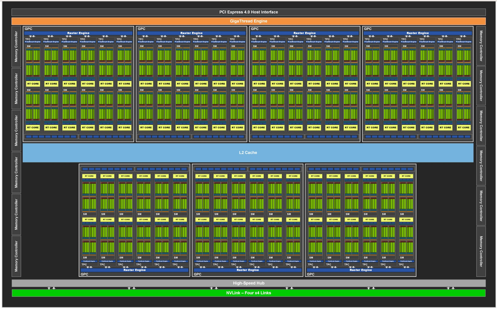
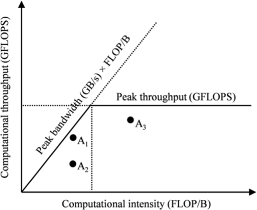

::: {.callout-tip}
## This post is part of the following series:
* [**CUDA Mode Lecture Notes**](/series/notes/cuda-mode-notes.html): My notes from the **CUDA MODE** reading group lectures run by **Andreas Kopf** and **Mark Saroufim**.
:::


* [**Compute Architecture and Scheduling**](#compute-architecture-and-scheduling)
* [**Memory Architecture and Data Locality**](#memory-architecture-and-data-locality)  
* [**Conclusions and Key Takeaways**](#conclusions-and-key-takeaways)


::: {.callout-tip title="Resource Links:"}

* **YouTube Recording:**  [Lecture 4 Compute and Memory Basics](https://www.youtube.com/watch?v=lTmYrKwjSOU) 
* **Jupyter Notebook:** [lecture_004/cuda-mode-session-4.ipynb](https://github.com/cuda-mode/lectures/blob/main/lecture_004/cuda-mode-session-4.ipynb)
* **Paper:** [GA102 Whitepaper](https://www.nvidia.com/content/PDF/nvidia-ampere-ga-102-gpu-architecture-whitepaper-v2.pdf)

:::


## **Compute Architecture and Scheduling**

### **GPU Architecture vs. CPU**

*   **CPUs:**
    * Complex cores with multiple specialized units (fetch, decode, ALU).
    * Typically, one or few Arithmetic Logic Units (ALUs) per core.
      {fig-align="center"}
*   **GPUs:**
    * Streaming Multiprocessors (SMs) with many ALUs.
    * **Threads** share context and resources within an SM.
    * Each thread has its own program counter in newer GPUs (e.g., Volta and later).
    * Older GPUs shared program counters among threads in a warp.
      {fig-align="center"}


### GPU Architecture Details (RTX 3090 Example)

{fig-align="center"}

::: {.callout-note}

**Note:** The GA102 GPU also features 168 FP64 units (two per SM), which are not depicted in this diagram. The FP64 TFLOP rate is 1/64th the TFLOP rate of FP32 operations. The small number of FP64 hardware units are included to ensure any programs with FP64 code operate correctly, including FP64 Tensor Core code.

:::

*   **Streaming Multiprocessors (SMs):**
    *   RTX 3090 has 82 SMs.
    *   SMs are largely independent.
    *   Share a common L2 cache.
*   **Floating-Point Cores:**
    *   Consumer GPUs lack dedicated FP64 cores.
    *   RTX 3090 has a limited FP64 rate (1/64th of FP32).
    *   Accidental use of FP64 constants can significantly slow down computation.

* **Streaming Multiprocessor Structure:**
  *   Each SM has four units, each with:
      *   Register file.
      *   Scheduling and dispatch unit (32 threads/clock).
      *   Compute units: 32 FP32 units (half can do INT32).
      *   Tensor cores.

{fig-align="center"}

*   **Kernel Execution:**
    *   **Thread blocks** are assigned to SMs (no user control over assignment).
    *   Multiple blocks can be assigned to one SM if resource limits allow.
    *   RTX 3090 can handle up to 1536 threads per SM.
    *   Ideal block size divides 1536 (e.g., 256 or 512).
*   **Warp Execution:**
    *   Each SM processes one **warp** (32 threads) at a time.
    *   **Warp divergence** occurs when threads within a warp are not in sync, leading to partial execution.
*   **Registers:**
    *   Shared register file (64K 32-bit registers per SM).
    *   Registers are not cleared when switching between warps, requiring careful management of register usage.
*   **L1 Cache and Shared Memory:**
    *   128KB of on-chip memory per SM, split between L1 cache and shared memory.


### **Threads, Warps, and Blocks**

*   **Kernel Launch:** Defined by block layout (threads per block) and grid layout (number of blocks).
*   **Thread Block:**
    *   Assigned to a single SM.
    *   Threads within a block execute in parallel on the same SM.
    *   Threads within a block can access **shared memory**.
*   **Blocks:**
    *   Independent of each other.
    *   CUDA assigns blocks to SMs arbitrarily (no programmer control).
    *   Execution order of blocks is not guaranteed.
*   **SM Thread Capacity:**
    *   SMs can process more threads than the maximum threads in a block.
    *   Multiple blocks can be assigned to a single SM, if resource limits allow.
    *   **Example (RTX 3090):** Maximum 1536 threads per SM. 
    *   **Recommendation:** Choose block sizes (e.g., 256, 512) that divide the maximum thread capacity for optimal SM utilization.
*   **Warp:**
    *   A group of 32 threads.
    *   SMs process one warp at a time.
    *   **Warp Divergence:** Occurs when threads within a warp follow different execution paths (e.g., due to conditional statements).
        *   Leads to reduced performance as only a subset of threads in a warp execute at a time.
*   **AMD Terminology:**
    *   **Wavefronts:** AMD's term for warps.
    *   Typically 64 threads, but can be reduced to 32 via compiler options.


### **Multi-Dimensional Thread Grids**

* **Linearization:** Multi-dimensional thread grids are linearized for execution.

* **Thread Index Order:** `threadIdx.x` is the fastest moving dimension, followed by `threadIdx.y`, and then `threadIdx.z`.

*   **Example:** An `8x8x8` thread block:
    
    ```python
    # CUDA kernel and C++ function declaration
    cuda_src = """
    #include <c10/cuda/CUDAException.h>
    
    /**
     * CUDA kernel to compute thread indices of neighbors in a 3D grid.
     * 
     * @param out Pointer to output array where neighbor indices will be stored.
     */
    __global__ void thread_idx_of_neighbors_kernel(int32_t* out) {
        // Grid dimensions: 8x8x8 threads per block, 32 neighbors per thread, 3 coordinates per neighbor
        int x = threadIdx.x;
        int y = threadIdx.y;
        int z = threadIdx.z;
        
        // Iterate over all 32 threads in the warp
        for (int i = 0; i < 32; i++) {
            // Use warp shuffle to get coordinates of other threads
            int other_x = __shfl_sync(0xffffffff, x, i);
            int other_y = __shfl_sync(0xffffffff, y, i);
            int other_z = __shfl_sync(0xffffffff, z, i);
            
            // Calculate offset in output array and store neighbor coordinates
            int offset = z * 8*8*32*3 + y * 8*32*3 + x * 32*3 + i*3;
            out[offset] = other_x;
            out[offset + 1] = other_y;
            out[offset + 2] = other_z;
        }
    }
    
    /**
     * C++ wrapper function to launch the CUDA kernel and return results as a Torch tensor.
     * 
     * @return torch::Tensor A 5D tensor containing thread indices of neighbors.
     */
    torch::Tensor thread_idx_of_neighbors() {
        // Create output tensor: 8x8x8 threads, 32 neighbors, 3 coordinates
        auto output = torch::empty({8, 8, 8, 32, 3}, torch::TensorOptions().device(torch::kCUDA).dtype(torch::kInt));
        
        // Set up kernel launch parameters
        dim3 block(8, 8, 8);
        dim3 grid(1);
        
        // Launch kernel
        thread_idx_of_neighbors_kernel<<<grid, block>>>(output.data_ptr<int32_t>());
        
        // Check for CUDA errors
        C10_CUDA_KERNEL_LAUNCH_CHECK();
        
        return output;
    }
    """
    ```
    
    ```python
    # C++ function declaration
    cpp_src = """
    torch::Tensor thread_idx_of_neighbors();
    """
    ```
    
    ```python
    # Load the CUDA kernel and C++ function as a PyTorch extension
    thread_idx_of_neighbors_module = torch.utils.cpp_extension.load_inline(
        "test_thread_idx",  # Name of the extension
        cpp_src,            # C++ source code
        cuda_src,           # CUDA source code
        functions=['thread_idx_of_neighbors'],  # List of functions to expose
        extra_cuda_cflags=['--ptxas-options=-v'],  # Additional CUDA compiler flags
        verbose=True        # Enable verbose output during compilation
    )
    ```
    
    *   Threads within a warp have consecutive `threadIdx.x` values.
    *   `threadIdx.y` changes less frequently than `threadIdx.x`.
    *   `threadIdx.z` changes least frequently.
    
* **Verification:** Kernel code demonstrates thread indexing using shuffle instructions.

  ```python
  # Call the CUDA kernel through the PyTorch extension
  t = thread_idx_of_neighbors_module.thread_idx_of_neighbors()
  
  # Access the first element of the result tensor
  t[0,0,0]
  ```

  ```text
  tensor([[0, 0, 0],
          [1, 0, 0],
          [2, 0, 0],
          [3, 0, 0],
          [4, 0, 0],
          [5, 0, 0],
          [6, 0, 0],
          [7, 0, 0],
          [0, 1, 0],
          [1, 1, 0],
          [2, 1, 0],
          [3, 1, 0],
          [4, 1, 0],
          [5, 1, 0],
          [6, 1, 0],
          [7, 1, 0],
          [0, 2, 0],
          [1, 2, 0],
          [2, 2, 0],
          [3, 2, 0],
          [4, 2, 0],
          [5, 2, 0],
          [6, 2, 0],
          [7, 2, 0],
          [0, 3, 0],
          [1, 3, 0],
          [2, 3, 0],
          [3, 3, 0],
          [4, 3, 0],
          [5, 3, 0],
          [6, 3, 0],
          [7, 3, 0]], device='cuda:0', dtype=torch.int32)
  ```

  


### **Warp Divergence and Control Flow**

*   **Traditional GPUs (Single Program Counter per Warp):**
    *   **Conditional Statements (if-else):** Threads not satisfying the condition are disabled, leading to warp divergence. 
    *   Only the active threads execute the corresponding branch.
    *   Threads are re-enabled/disabled as needed at each branch point.
    *   **Limitations:**
        *   Inter-thread communication within a warp is not possible during divergence (waiting threads would stall the warp).
        *   Performance is reduced due to idle threads and sequential execution of branches.
*   **Newer GPUs (>= Volta) (Independent Program Counters):**
    *   Each thread has its own program counter.
    *   GPU can interleave execution of different branches, improving utilization.
    *   **Advantages:**
        *   Can hide memory latency by switching to other warps while one warp waits for memory access.
    *   **Disadvantages:**
        *   Reconvergence of threads after divergence is not automatic.
        *   Requires explicit synchronization using `__syncwarp()` to ensure all threads are at the same point before continuing.
*   **Loop Divergence:** Similar divergence occurs in loops with variable iteration counts across threads in a warp.


### **Achieving Good Occupancy**

*   **Occupancy:** A measure of how well the GPU's resources are utilized.
*   **Goals:**
    *   Keep all SMs busy.
    *   Maximize the number of active threads per SM.
    *   Minimize warp divergence.
    *   Avoid slow FP64 and INT64 operations (especially on consumer GPUs).
*   **Strategies:**
    *   **Many Blocks:** Utilize all available SMs.
    *   **Optimal Block Size:** Choose a power of two smaller than 512 (or a divisor of the maximum threads per SM) to maximize concurrent threads.
    *   **Minimize Divergence:**
        *   Use conditional load/store instructions to avoid control flow divergence.
        *   Structure code to minimize branching within warps.
    *   **Avoid FP64/INT64:** Use FP32/INT32 whenever possible for better performance.
*   **Shared Memory and Registers:**
    *   Excessive use of shared memory or registers can limit the number of threads scheduled per SM.
    *   **Launch Bounds:** Use `__launch_bounds__` to advise the compiler about expected thread counts, allowing for better register allocation.
    *   **Register Spills:** If register usage exceeds the limit, variables are spilled to slower local memory, impacting performance.
*   **Occupancy Calculation Tools:**
    *   **Previously:** Excel sheets.
    *   **Currently:** NVIDIA Nsight Compute provides occupancy analysis.


### **Querying GPU Properties**

*   **PyTorch:** `torch.cuda.get_device_properties(device)` provides basic properties (name, compute architecture, memory, processor count, registers per SM, max threads per SM).
*   **CUDA C API:** More detailed properties are available through the CUDA Runtime API.


## **Memory Architecture and Data Locality**

### **Performance Bottlenecks**

*   **Memory Accesses:** Often a major bottleneck in kernel performance.
*   **Kernel Fusion:** Combining multiple kernels into one can reduce memory transfers by avoiding intermediate reads and writes.

### **PyTorch Performance Breakdown**

*   **High-Level:**
    *   Python processing.
    *   Data administrative overhead (tensor allocation, etc.).
    *   Data acquisition.
    *   GPU computation.
*   **Data Acquisition:**  Often a significant bottleneck if not optimized. 
*   **GPU Computation:**
    *   Fixed costs (kernel launches).
    *   Memory accesses (reading inputs, writing outputs).
    *   Actual computation (influenced by occupancy).

* **Rules of Thumb:**

  * As long as you don’t have close to 100% GPU utilization in nvidia-smi, work on data acquisition etc.

  * As long as you have Tensors with a few 100s of elements, “Python is slow” and data administrative
    over head is single digit percentages.

  * Algorithms also matter (parallel algorithms in the following chapters)


### **Memory Access as a Bottleneck**

*   **Eager PyTorch:** Typically loads inputs, computes, and stores outputs for each operation.
*   **Fusion Benefits:** Reduces memory transfers by combining multiple operations into a single kernel.
*   **PyTorch JIT:**
    *   First generation: Fused point-wise operations.
    *   Second generation (NVFuser): Added support for contractions.
*   **NVFuser:**
    *   Evolved beyond PyTorch.
    *   Active git repository with ongoing development.
        *   **GitHub Repository:** [https://github.com/NVIDIA/Fuser](https://github.com/NVIDIA/Fuser)
*   **Inductor and Triton:** Support more complex operations through a specialized language and templates.
*   **Flash Attention:** Minimizes global memory accesses by leveraging shared memory effectively.

### **Flash Attention Example**

{fig-align="center"}

*   **Paper:** [FlashAttention: Fast and Memory-Efficient Exact Attention with IO-Awareness](https://arxiv.org/abs/2205.14135)
*   **Figure:** (from the Flash Attention paper) Shows the relative speeds of different memory types.
    *   **High Bandwidth Memory (HBM):** 1.5 TB/s (900 GB/s on the RTX 3090).
    *   **Shared Memory:** More than 10x faster than HBM.
    *   **Shared Memory Limitation:** Significantly smaller capacity (0.2% of global memory).
*   **Goal:** Minimize global memory accesses and maximize shared memory usage.

### **Kernel Fusion Example: Approximated Gelu**

* **Approximated Gelu Formula:** (from [PyTorch documentation](https://pytorch.org/docs/stable/generated/torch.nn.GELU.html)) Uses `tanh` for an approximation of the Gaussian error linear unit (GELU) activation function.
  $$
  \text{GELU}(x) = 0.5 * x * (1 + \text{Tanh}(\sqrt{2 / \pi} * (x + 0.044715 * x^3)))
  $$

* **PyTorch Implementation:** Highly optimized, around 13.3 microseconds.

  ```python
  %timeit torch.nn.functional.gelu(x, approximate='tanh'); torch.cuda.synchronize()
  ```

  ```text
  13.3 μs ± 331 ns per loop (mean ± std. dev. of 7 runs, 100,000 loops each)
  ```

* **Naive Implementation:**

  ```python
  def gelu(x):
      """
      Compute the Gaussian Error Linear Unit (GELU) activation function.
  
      GELU is defined as: GELU(x) = 0.5 * x * (1 + tanh(sqrt(2/pi) * (x + 0.044715 * x^3)))
  
      Args:
          x (torch.Tensor): Input tensor
  
      Returns:
          torch.Tensor: Output tensor after applying GELU activation
      """
      # Calculate the constant term (2/pi)^0.5
      const = (2 / torch.pi) ** 0.5
      
      # Compute the inner term: x + 0.044715 * x^3
      inner_term = x + 0.044715 * x**3
      
      # Apply the GELU formula
      return 0.5 * x * (1 + torch.tanh(const * inner_term))
  ```

  ```python
  # Create a random tensor of size 1024x1024 on the GPU
  x = torch.randn(1024, 1024, device="cuda")
  ```

  ```python
  # Measure the execution time of the GELU function
  # Synchronize CUDA operations to ensure accurate timing
  %timeit gelu(x); torch.cuda.synchronize()
  ```

  ```text
  67.2 μs ± 1.41 μs per loop (mean ± std. dev. of 7 runs, 10,000 loops each)
  ```

  *   Separate kernels for each operation.
  *   Significantly slower due to numerous memory accesses.

* **PyTorch Profiler:** Can be used to identify individual kernel calls and their execution times. 

  ```python
  # Use torch.profiler to analyze the performance of the GELU function
  with torch.profiler.profile() as prof:
      # Measure the execution time of the GELU function
      # Run the function 1000 times for more accurate timing
      %timeit -n 1000 gelu(x)
  
  # Print a table of key performance metrics
  print(prof.key_averages().table())
  ```

  <div style="overflow-x:auto; max-height:500px">
  <table border="1" class="dataframe">
      <thead>
          <tr>
              <th>Name</th>
              <th>Self CPU %</th>
              <th>Self CPU</th>
              <th>CPU total %</th>
              <th>CPU total</th>
              <th>CPU time avg</th>
              <th>Self CUDA</th>
              <th>Self CUDA %</th>
              <th>CUDA total</th>
              <th>CUDA time avg</th>
              <th># of Calls</th>
          </tr>
      </thead>
      <tbody>
          <tr>
              <td>aten::mul</td>
              <td>30.34%</td>
              <td>130.980ms</td>
              <td>50.70%</td>
              <td>218.874ms</td>
              <td>7.817us</td>
              <td>88.571ms</td>
              <td>49.36%</td>
              <td>88.571ms</td>
              <td>3.163us</td>
              <td>28000</td>
          </tr>
          <tr>
              <td>cudaLaunchKernel</td>
              <td>37.49%</td>
              <td>161.833ms</td>
              <td>37.49%</td>
              <td>161.833ms</td>
              <td>2.890us</td>
              <td>0.000us</td>
              <td>0.00%</td>
              <td>0.000us</td>
              <td>0.000us</td>
              <td>56000</td>
          </tr>
          <tr>
              <td>aten::pow</td>
              <td>9.45%</td>
              <td>40.780ms</td>
              <td>14.16%</td>
              <td>61.140ms</td>
              <td>8.734us</td>
              <td>20.920ms</td>
              <td>11.66%</td>
              <td>20.920ms</td>
              <td>2.989us</td>
              <td>7000</td>
          </tr>
          <tr>
              <td>aten::result_type</td>
              <td>0.18%</td>
              <td>785.257us</td>
              <td>0.18%</td>
              <td>785.257us</td>
              <td>0.112us</td>
              <td>0.000us</td>
              <td>0.00%</td>
              <td>0.000us</td>
              <td>0.000us</td>
              <td>7000</td>
          </tr>
          <tr>
              <td>aten::to</td>
              <td>0.14%</td>
              <td>603.008us</td>
              <td>0.14%</td>
              <td>603.008us</td>
              <td>0.086us</td>
              <td>0.000us</td>
              <td>0.00%</td>
              <td>0.000us</td>
              <td>0.000us</td>
              <td>7000</td>
          </tr>
          <tr>
              <td>aten::add</td>
              <td>15.28%</td>
              <td>65.959ms</td>
              <td>23.82%</td>
              <td>102.833ms</td>
              <td>7.345us</td>
              <td>46.930ms</td>
              <td>26.16%</td>
              <td>46.930ms</td>
              <td>3.352us</td>
              <td>14000</td>
          </tr>
          <tr>
              <td>aten::tanh</td>
              <td>7.13%</td>
              <td>30.763ms</td>
              <td>11.32%</td>
              <td>48.857ms</td>
              <td>6.980us</td>
              <td>23.008ms</td>
              <td>12.82%</td>
              <td>23.008ms</td>
              <td>3.287us</td>
              <td>7000</td>
          </tr>
          <tr>
              <td>void at::native::vectorized_elementwise_kernel&lt;4, at...</td>
              <td>0.00%</td>
              <td>0.000us</td>
              <td>0.00%</td>
              <td>0.000us</td>
              <td>0.000us</td>
              <td>62.472ms</td>
              <td>34.82%</td>
              <td>62.472ms</td>
              <td>2.975us</td>
              <td>21000</td>
          </tr>
          <tr>
              <td>void at::native::vectorized_elementwise_kernel&lt;4, at...</td>
              <td>0.00%</td>
              <td>0.000us</td>
              <td>0.00%</td>
              <td>0.000us</td>
              <td>0.000us</td>
              <td>20.920ms</td>
              <td>11.66%</td>
              <td>20.920ms</td>
              <td>2.989us</td>
              <td>7000</td>
          </tr>
          <tr>
              <td>void at::native::vectorized_elementwise_kernel&lt;4, at...</td>
              <td>0.00%</td>
              <td>0.000us</td>
              <td>0.00%</td>
              <td>0.000us</td>
              <td>0.000us</td>
              <td>26.045ms</td>
              <td>14.52%</td>
              <td>26.045ms</td>
              <td>3.721us</td>
              <td>7000</td>
          </tr>
          <tr>
              <td>void at::native::vectorized_elementwise_kernel&lt;4, at...</td>
              <td>0.00%</td>
              <td>0.000us</td>
              <td>0.00%</td>
              <td>0.000us</td>
              <td>0.000us</td>
              <td>23.008ms</td>
              <td>12.82%</td>
              <td>23.008ms</td>
              <td>3.287us</td>
              <td>7000</td>
          </tr>
          <tr>
              <td>void at::native::vectorized_elementwise_kernel&lt;4, at...</td>
              <td>0.00%</td>
              <td>0.000us</td>
              <td>0.00%</td>
              <td>0.000us</td>
              <td>0.000us</td>
              <td>20.886ms</td>
              <td>11.64%</td>
              <td>20.886ms</td>
              <td>2.984us</td>
              <td>7000</td>
          </tr>
          <tr>
              <td>void at::native::vectorized_elementwise_kernel&lt;4, at...</td>
              <td>0.00%</td>
              <td>0.000us</td>
              <td>0.00%</td>
              <td>0.000us</td>
              <td>0.000us</td>
              <td>26.099ms</td>
              <td>14.55%</td>
              <td>26.099ms</td>
              <td>3.728us</td>
              <td>7000</td>
          </tr>
          <tr>
              <td>cudaDeviceSynchronize</td>
              <td>0.00%</td>
              <td>5.062us</td>
              <td>0.00%</td>
              <td>5.062us</td>
              <td>5.062us</td>
              <td>0.000us</td>
              <td>0.00%</td>
              <td>0.000us</td>
              <td>0.000us</td>
              <td>1</td>
          </tr>
      </tbody>
  </table>
  <p>Self CPU time total: 431.709ms</p>
  <p>Self CUDA time total: 179.430ms</p>
  </div>

  *   Shows a large number of separate kernels for point-wise operations in the naive implementation.

* **Fused Kernel:** 

  ```python
  # Define CUDA source code as a string
  cuda_src = cuda_begin + r'''
  __global__ void my_gelu_kernel(float* out, float* inp, int n) {
      // Calculate global thread index
      int i = blockIdx.x * blockDim.x + threadIdx.x;
      
      // Return if thread index is out of bounds
      if (i >= n) return;
      
      // Load input value
      float x = inp[i];
      
      // Compute GELU (Gaussian Error Linear Unit) activation
      // GELU(x) = 0.5 * x * (1 + tanh(sqrt(2/π) * (x + 0.044715 * x^3)))
      out[i] = 0.5f * x * (1.0f + tanhf(sqrtf(2.0f/3.141592653589793f) * (x + 0.044715f * (x*x*x))));
  }
  
  torch::Tensor my_gelu_out(torch::Tensor output, const torch::Tensor& inp) {
      CHECK_INPUT(inp);  // Validate input tensor
      int n = inp.numel();  // Get total number of elements in input tensor
      
      // Ensure output tensor has same properties as input tensor
      TORCH_CHECK((output.sizes() == inp.sizes()) || (output.device() == inp.device())
                  || (output.scalar_type() == inp.scalar_type()));
      
      int threads = 256;  // Set number of threads per block
      
      // Launch CUDA kernel
      my_gelu_kernel<<<cdiv(n, threads), threads>>>(
          output.data_ptr<float>(), inp.data_ptr<float>(), n);
      
      C10_CUDA_KERNEL_LAUNCH_CHECK();  // Check for CUDA errors
      return output;
  }
  
  torch::Tensor my_gelu(const torch::Tensor& inp) {
      CHECK_INPUT(inp);  // Validate input tensor
      auto output = torch::empty_like(inp);  // Create output tensor with same properties as input
      my_gelu_out(output, inp);  // Compute GELU activation
      return output;
  }
  '''
  
  # Define C++ source code as a string
  cpp_src = """
  torch::Tensor my_gelu(const torch::Tensor& inp);
  torch::Tensor my_gelu_out(torch::Tensor output, const torch::Tensor& inp);
  """
  
  # Set environment variables for compiler paths
  import os
  os.environ['CXX'] = '/usr/lib/ccache/g++-11'
  os.environ['CC'] = '/usr/lib/ccache/gcc-11'
  
  # Load and compile the CUDA extension
  gelu_module = torch.utils.cpp_extension.load_inline(
      "test_ext_gelu",  # Name of the extension
      cpp_src,  # C++ source code
      cuda_src,  # CUDA source code
      functions=['my_gelu', 'my_gelu_out'],  # Functions to expose
      extra_cuda_cflags=['--ptxas-options=-v'],  # Additional CUDA compiler flags
      verbose=True  # Enable verbose output during compilation
  )
  ```

  ```python
  %timeit gelu_module.my_gelu(x); torch.cuda.synchronize()
  ```

  ```text
  17 μs ± 246 ns per loop (mean ± std. dev. of 7 runs, 100,000 loops each)
  ```

  *   Combines all operations into a single C++ kernel.
  *   Slightly slower than PyTorch's implementation (tested on an RTX 4090 with PyTorch 2.4.0).

* **Numerical Accuracy:** Results are the same as PyTorch's implementation, "up to numerical accuracy."

### **Numerical Accuracy and Floating Point Operations**

*   **Floating Point Addition:** Not strictly associative due to limited precision.
    *   The order of operations can affect the result, especially when adding numbers with vastly different magnitudes.
    *   **Example:** Adding a very small number to a large number might result in no change if the small number is below the precision threshold.
*   **Relative Accuracy:**
    *   FP32: Typically around 10⁻⁷ or 10⁻⁸.
    *   FP64: Higher precision.

### **Theoretical Maximum Speed: Level RGB to Gray Kernel**

*   **Kernel Operations:**
    *   Load 3 bytes (R, G, B).
    *   Compute index (1 multiplication, 1 addition - INT32).
    *   Compute grayscale value (3 multiplications, 2 additions - FP32).
    *   Data conversion.
    *   Store 1 byte.
*   **Memory Bandwidth (RTX 3090):** 900 GB/s.
*   **Image Size:** 2048 x 2048.
*   **Theoretical Memory Transfer Time ("Speed of Light"):** ~18 microseconds (assuming ideal access patterns).
*   **Compute Performance (RTX 3090):**
    *   FP32: 35.6 TFLOPs.
    *   INT32: 16.8 TFLOPs.
*   **Theoretical Compute Time:** ~2 microseconds (excluding parallelism and memory latency).
*   **Kernel Launch Overhead:** ~3 microseconds (measured using an empty kernel).
*   **Measured Kernel Time:** ~26-27 microseconds.
*   **Efficiency:** Achieves about 75% of the theoretical maximum speed.


### **Roofline Model**

{fig-align="center"}

*   **Purpose:** Helps analyze the performance limitations of a kernel.
*   **Computational Intensity:** Key metric, defined as the number of floating-point operations (FLOPs) per byte of memory transfer.
*   **Memory-Bound Kernels:**
    *   Low computational intensity.
    *   Performance limited by memory bandwidth.
    *   Throughput limited by the diagonal line in the roofline model representing memory bandwidth.
*   **Compute-Bound Kernels:**
    *   High computational intensity.
    *   Performance limited by the GPU's compute capabilities.
    *   Throughput limited by the horizontal line in the roofline model representing peak compute performance.
*   **Roofline Shape:** The characteristic "roof" shape arises from the fact that memory latency can be hidden if other warps can compute while one warp waits for memory.
    *   The performance becomes the maximum of the memory bandwidth and compute throughput, leading to the minimum of the two limiting factors.

### **GPU Memory Hierarchy**

{fig-align="center"}

| Variable declaration                    | Memory   | Scope  | Lifetime    |
| --------------------------------------- | -------- | ------ | ----------- |
| Automatic variables other than arrays   | Register | Thread | Grid        |
| Automatic array variables               | Local    | Thread | Grid        |
| `__device__ __shared__ int SharedVar;`  | Shared   | Block  | Grid        |
| `__device__ int GlobalVar;`             | Global   | Grid   | Application |
| `__device__ __constant__ int ConstVar;` | Constant | Grid   | Application |

*   **Registers:** Fastest, used for local variables within a thread.
*   **Local Memory:** Slower than registers, used for arrays declared within a thread or for register spills.
*   **Shared Memory:** Per-block memory, faster than global memory, accessible by all threads in a block, declared using `__shared__`.
*   **Global Memory:** Main GPU memory, accessible by all threads, typically accessed through pointers.
*   **Constant Memory:** Read-only memory, cached, used for kernel launch parameters and can be explicitly declared.

### **Shared Memory and Tiling**

* **Tiling:** A technique to improve data locality by loading data from global memory into shared memory and reusing it multiple times within a block.

*   **Matrix Multiplication Example:**
    
    * **Naive Approach:** Each output element reads 2n inputs from global memory n times.
    
      ```python
      # CUDA kernel for matrix multiplication
      cuda_src = cuda_begin + r'''
      __global__ void simple_matmul_k(float* m, float* n, float* out, int h, int w, int k) {
          // Calculate global thread indices
          int r = blockIdx.y*blockDim.y + threadIdx.y;
          int c = blockIdx.x*blockDim.x + threadIdx.x;
      
          // Boundary check
          if (r>=h || c>=w) return;
          
          float o = 0;
          // Perform dot product for this element
          for (int i = 0; i<k; ++i) o += m[r*k+i] * n[i*w+c];
          out[r*w+c] = o;
      }
      
      torch::Tensor simple_matmul(const torch::Tensor& m, const torch::Tensor& n) {
          CHECK_INPUT(m); CHECK_INPUT(n);
          int h = m.size(0);
          int w = n.size(1);
          int k = m.size(1);
          TORCH_CHECK(k==n.size(0), "Size mismatch!");
          auto output = torch::zeros({h, w}, m.options());
      
          // Define thread block and grid dimensions
          dim3 tpb(16,16);
          dim3 blocks(cdiv(w, tpb.x), cdiv(h, tpb.y));
          
          // Launch CUDA kernel
          simple_matmul_k<<<blocks, tpb>>>(
              m.data_ptr<float>(), n.data_ptr<float>(), output.data_ptr<float>(), h, w, k);
          C10_CUDA_KERNEL_LAUNCH_CHECK();
          return output;
      }
      '''
      
      # C++ function declaration
      cpp_src = """
      torch::Tensor simple_matmul(const torch::Tensor& m, const torch::Tensor& n);
      """
      
      # Load the custom CUDA extension
      simple_matmul_module = torch.utils.cpp_extension.load_inline(
          name="test_ext_simple_matmul",
          cpp_sources=cpp_src,
          cuda_sources=cuda_src,
          functions=['simple_matmul'],
          extra_cuda_cflags=['--ptxas-options=-v'],
          verbose=True
      )
      ```
    
      ```python
      # Create two random 1024x1024 matrices on the GPU
      a = torch.randn(1024, 1024, device="cuda")
      b = torch.randn(1024, 1024, device="cuda")
      
      # Benchmark the custom matrix multiplication function
      %timeit simple_matmul_module.simple_matmul(a, b)
      
      # Compute the maximum absolute difference between custom and built-in matrix multiplication
      max_diff = (simple_matmul_module.simple_matmul(a, b) - a@b).abs().max()
      ```
    
      ```text
      426 μs ± 9.98 μs per loop (mean ± std. dev. of 7 runs, 1,000 loops each)
      ```
    
      
    
    * **Tiling:** Reduces the number of global memory accesses by reading input tiles into shared memory and reusing them for multiple output tiles.
    
      ```python
      # Constants and CUDA kernel definition
      cuda_src = cuda_begin + r"""
      constexpr int TILE_SIZE = 16;  // Size of each tile for matrix multiplication
      
      /**
       * @brief Tiled matrix multiplication kernel.
       * 
       * This kernel performs matrix multiplication using shared memory tiles to improve performance.
       *
       * @param out Pointer to the output matrix
       * @param M Pointer to the first input matrix
       * @param N Pointer to the second input matrix
       * @param h Height of matrix M
       * @param w Width of matrix N
       * @param k Width of matrix M / Height of matrix N
       */
      __global__ void tiled_matmul_kernel(float* out, float* M, float* N, int h, int w, int k) {
          __shared__ float M_tile[TILE_SIZE][TILE_SIZE];  // Shared memory for M matrix tile
          __shared__ float N_tile[TILE_SIZE][TILE_SIZE];  // Shared memory for N matrix tile
          
          // Thread indices within a tile
          int ir = threadIdx.y;
          int ic = threadIdx.x;
          
          // Global thread indices
          int r = blockIdx.y * blockDim.y + threadIdx.y;
          int c = blockIdx.x * blockDim.x + threadIdx.x;
          
          float res = 0.0f;  // Accumulator for dot product result
          
          // Iterate over tiles
          for (int K_tileidx = 0; K_tileidx < (k + TILE_SIZE -1) / TILE_SIZE; K_tileidx++) {
              // Load data into shared memory tiles, with bounds checking
              M_tile[ir][ic] = (((r < h) && (K_tileidx * TILE_SIZE + ic < k)) ? M[r * k + K_tileidx * TILE_SIZE + ic] : 0.f);
              N_tile[ir][ic] = ((((K_tileidx * TILE_SIZE + ir) < k) && (c < w)) ? N[(K_tileidx * TILE_SIZE + ir) * w + c] : 0.f);
              
              __syncthreads();  // Ensure all threads have loaded data before computation
              
              // Compute dot product for this tile
              for (int idx = 0; idx < TILE_SIZE; idx++) {
                 res += M_tile[ir][idx] * N_tile[idx][ic];
              }
              
              __syncthreads();  // Ensure all computations are done before loading next tile
          }
          
          // Write result to global memory if within bounds
          if ((r < h) && (c < w)) {
              out[r * w + c] = res;
          }
      }
      
      /**
       * @brief Wrapper function for tiled matrix multiplication kernel.
       * 
       * This function checks input tensors, sets up kernel parameters, and launches the CUDA kernel.
       *
       * @param m First input matrix
       * @param n Second input matrix
       * @return torch::Tensor Result of matrix multiplication
       */
      torch::Tensor tiled_matmul(const torch::Tensor& m, const torch::Tensor& n) {
          CHECK_INPUT(m); CHECK_INPUT(n);
          int h = m.size(0);
          int w = n.size(1);
          int k = m.size(1);
          TORCH_CHECK(k==n.size(0), "Size mismatch");
          
          auto output = torch::empty({h, w}, m.options());
          
          // Define thread block and grid dimensions
          dim3 tpb(TILE_SIZE, TILE_SIZE);
          dim3 blocks(cdiv(w, tpb.x), cdiv(h, tpb.y));
          
          // Launch kernel
          tiled_matmul_kernel<<<blocks, tpb>>>(
              output.data_ptr<float>(), m.data_ptr<float>(), n.data_ptr<float>(), h, w, k);
          C10_CUDA_KERNEL_LAUNCH_CHECK();
          
          return output;
      }
      """
      
      # C++ interface definition
      cpp_src = """
      torch::Tensor tiled_matmul(const torch::Tensor& m, const torch::Tensor& n);
      """
      
      # Load the CUDA kernel as a PyTorch C++ extension
      tiled_matmul_module = torch.utils.cpp_extension.load_inline(
          "test_ext_tiled_matmul",  # Name of the extension
          cpp_src,                  # C++ interface
          cuda_src,                 # CUDA source code
          functions=['tiled_matmul'],  # Exported functions
          extra_cuda_cflags=['--ptxas-options=-v'],  # Additional CUDA compilation flags
          verbose=True              # Enable verbose output during compilation
      )
      ```
    
      ```python
      %timeit tiled_matmul_module.tiled_matmul(a, b)
      ```
    
      ```text
      323 μs ± 2.73 μs per loop (mean ± std. dev. of 7 runs, 10,000 loops each)
      ```
    
*   **Tiled Matrix Multiplication (Square Matrices):**
    
    *   **Tile Size:** A parameter that determines the size of the tiles.
    *   **Thread Block:** Typically, the tile size squared (e.g., `16x16` threads for a tile size of `16`).
    *   **Shared Memory:** Two shared memory arrays to store tiles from matrices A and B.
    *   **Algorithm:**
        1.  Load tiles from global memory into shared memory.
        2.  Perform matrix multiplication within the tiles using shared memory.
        3.  Loop over all tiles to compute the complete result.
        4.  Store the result back to global memory.
    
* **Synchronization:** `__syncthreads()` is crucial to ensure that all threads have finished reading/writing to shared memory before proceeding.

* **Padding:** For matrices where the size is not a multiple of the tile size, padding with zeros is used to complete the tiles.

* **Performance Improvement:** Reduces memory accesses and improves performance (e.g., from 426 microseconds to 323 microseconds in the example).

  

  

### **Future Considerations**

*   **Thread Coarsening:** 
    *   **Concept:** Increasing the amount of work done by each thread to improve performance.
    *   **Application to Tiling:** Allows for larger tile sizes.
    *   **Details:** Covered in the next session.

*   **Flash Attention Implementation:**
    *   **Exercise:** Implement the original Flash Attention algorithm from scratch based on the pseudocode.
    *   **Key Aspect:** Blocking of inputs and output for efficient kernel fusion.


## **Conclusions and Key Takeaways**

### **GPU Computation:**

*   GPUs use a hierarchy of threads, warps, and blocks to organize computation.
*   Understanding the hardware architecture and scheduling is crucial for performance optimization.
*   Occupancy, a measure of resource utilization, should be maximized.
*   Thread divergence should be minimized.

### **Memory Management:**

*   Memory accesses are often a major bottleneck.
*   Kernel fusion can reduce memory transfers.
*   The roofline model provides insights into the performance limitations of a kernel.
*   Tiling is a powerful technique to improve data locality by leveraging shared memory.

### **Next Steps:**

*   The next chapter will focus on **coalesced memory access**, a technique to optimize global memory reads and writes for maximum efficiency.
