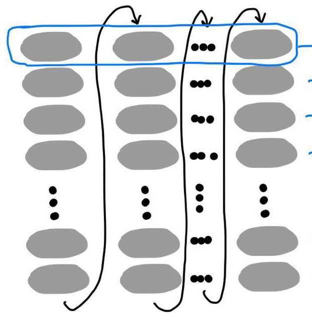
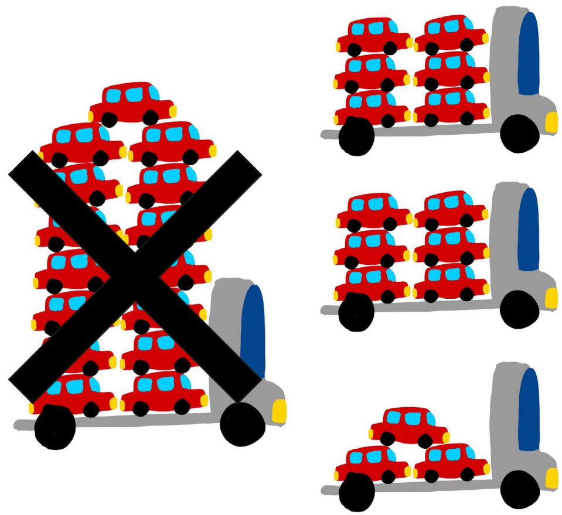

::: {.callout-tip}
## This post is part of the following series:
* [**GPU MODE Lecture Notes**](/series/notes/cuda-mode-notes.html): My notes from the **GPU MODE** reading group lectures run by **Andreas Kopf** and **Mark Saroufim**.
:::


::: {.callout-tip title="Resource Links:"}

* **YouTube Recording:** [Lecture 6 Optimizing Optimizers](https://www.youtube.com/watch?v=hIop0mWKPHc)  
* **Slides:** [Optimizing optimizers in PyTorch](https://docs.google.com/presentation/d/13WLCuxXzwu5JRZo0tAfW0hbKHQMvFw4O/edit#slide=id.p1)

:::


## Introduction

- **Presenter:** Jane, a member of the PyTorch core team specializing in optimizers.
- **Focus:** Runtime optimization (speed) of optimizers, not memory optimization.
- **Disclaimer:** Some optimization techniques discussed may require increased memory usage.


## Optimization Analogy: Towing Cars

- **Scenario:** Towing 512 cars from point A to point B with a single truck.
- **Options:**
  - Small truck: Carries one car at a time, requiring 512 trips (slow).
  - Large truck: Carries eight cars at a time, requiring 64 trips (fast).
- **Constraint:** A low-clearance bridge on the route that the large truck cannot pass through.
- **Trade-off:** Runtime optimization (large truck) is desirable, but constraints (bridge) may necessitate choosing memory optimization (small truck) instead.
- **Today's Focus:** Speed optimization, assuming no constraints.


## Optimizer Basics and Optimization Levels

- **Optimizers:** Take a list of parameters (tensors) and gradients, and update parameters based on gradients.
- **Example: SGD:** Simple add and multiply operations between parameters, gradients, and a step size.
  - ```python
    parameter = parameter - learning_rate * gradient
    ```
- **Optimization Levels:**
  1. **Loop-Based:**
     - **Implementation:** Processes parameters one by one in a for loop.
       - **torch/optim/adamw.py:** [_single_tensor_adamw()](https://github.com/pytorch/pytorch/blob/b5ba80828f77c565bcda7558da97c792af32d517/torch/optim/adamw.py#L362)
     - **Simplified Example:**
       ```python
       for param in params:
           # Retrieve necessary data for the current parameter
           # Perform operations (add, multiply, lerp, etc.)
           # Update the parameter
       ```
     - **Visualization:** Each parameter update is a sequence of operations (gray circles), represented as a column. M operations per parameter, N parameters total, resulting in M x N operations.
       
  2. **ForEach:**
     - **Implementation:** PyTorch's current default; operates on entire parameter lists at once using vectorized operations.
       - **torch/optim/adamw.py:** [`_multi_tensor_adamw()`](https://github.com/pytorch/pytorch/blob/b5ba80828f77c565bcda7558da97c792af32d517/torch/optim/adamw.py#L480)
     - **Simplified Example:**

       ```python
       # Add a constant to all parameters in the list
       # Multiply all parameters by a constant
       # ... other operations
       ```
     - **Visualization:** Each operation (blue circles) is performed on all parameters simultaneously. M operations total.
       
  3. **Fused:**
     - **Implementation:** Fastest option; uses a single CUDA kernel to perform all operations on all parameters at once.
       - **torch/optim/adamw.py:** [`_fused_adamw()`](https://github.com/pytorch/pytorch/blob/b5ba80828f77c565bcda7558da97c792af32d517/torch/optim/adamw.py#L616)
     - **Kernel Source:** Inspired by NVIDIA Apex, PyTorch collaborates with NVIDIA to port and utilize fused CUDA kernels.
- **Key Idea:** Reducing the number of CUDA kernel launches improves performance because kernel launches are expensive.


## Multi-Tensor Apply: The Powerhouse

- **Multi-Tensor Apply:** An internal PyTorch function that enables operating on lists of tensors simultaneously.
- **Analogy:** Mitochondria is the powerhouse of the cell; multi-tensor apply is the "power truck" of PyTorch's speedy optimizers.
- **Example: Torch.add:**
  - **Standard Add:** Takes two tensors (self and other) and returns a result tensor.
  - **ForEach Add:** Takes two tensor lists (self and other) and returns a result tensor list.
- **CUDA Kernel Signatures:**
  - **Standard Add (Simplified):**
    ```c++
    __device__ void add_kernel(float* self, float* other, float* res, float alpha=1); 
    ```
  - **ForEach Add (Challenge):** How would you design a CUDA kernel signature to handle tensor lists?


## Attempt 1: Passing Standard Vector (Failed)

- **Idea:** Pass a `std::vector` of pointers to tensors into the CUDA kernel.
- **Problem:** CUDA does not support `std::vector` as a kernel argument; it won't even compile.


## Attempt 2: Passing Pointers to Pointers (Failed)

- **Idea:** Pass a `float**` (pointer to a pointer) representing an array of tensor pointers.
- **Problem:** The outer pointer resides on the CPU, leading to illegal memory access when the kernel tries to dereference it.
- **Explanation:**
  - **Standard Add:** Pointers passed to the kernel are CUDA memory addresses, so dereferencing them within the kernel is valid.
  - **Pointers to Pointers:** The outer pointer is a CPU memory address. When dereferenced within the kernel, it attempts to access CPU memory, resulting in an illegal memory access error.


## Attempt 3: Passing by Chonky Boy (Partially Successful)

- **Idea:** Pass tensor data pointers by value using a struct.
- **Implementation:**
  - Create a struct containing arrays of `float*` for self, other, and result tensors.
  - Allocate memory for the struct on the CPU.
  - Copy the data pointers of all tensors into the struct's arrays.
  - Pass the struct to the CUDA kernel.
- **Outcome:** Works initially, but encounters issues with the kernel argument space limit.
- **Kernel Argument Space Limit:** The kernel argument space has a maximum size of 4 kilobytes.
- **Problem:** If the struct containing tensor pointers exceeds 4 kilobytes, only a portion of the struct gets passed to the kernel, leading to illegal memory access when accessing pointers beyond the limit.
- **Repro Example:**
  ```python
  params = [torch.rand(2,3, device="cuda") for _ in range(N)]
  torch._foreach_norm(params, ord=1)
  torch.cuda.synchronize()
  ```
  - Create a tensor list with a variable number of small tensors on CUDA.
  - Call `foreach_norm` (similar to `foreach_add`) on the tensor list.
  - Synchronize CUDA to ensure errors are immediately visible.
- **Observation:** Illegal memory access occurs when the number of tensors exceeds 423.
- **Conclusion:** The struct approach works as long as the number of tensor pointers does not exceed the 4 kilobyte limit.


## Solution 1: Batching (Current Implementation)

- **Idea:** Divide the tensor list into smaller batches that fit within the 4 kilobyte limit.
- **Implementation:**
  - Create multiple structs, each containing a subset of the tensor pointers.
  - Launch the kernel multiple times, once for each struct.
- **Outcome:** Works reliably but requires multiple kernel launches, which can be inefficient.
- **Visualization:** Instead of a single fused kernel, multiple smaller kernels are launched.
  


## Solution 2: Revisiting Pointers to Pointers with Memcpy

- **Idea:** Combine the struct approach with a memcpy operation to move the pointers to CUDA memory beforehand.
- **Implementation:**
  - Pack the standard vectors of tensor addresses into a single tensor on the CPU.
  - Copy the tensor to CUDA memory.
  - Pass a pointer to the tensor data (now on CUDA) to the kernel.
  - Within the kernel, access the tensor data as an array of pointers and dereference them to access the actual tensors.
- **Outcome:** Avoids the kernel argument space limit and enables launching a single kernel for the entire tensor list.
- **Advantages:**
  - Reduces the number of kernel launches, improving performance, especially for large tensor lists.
  - Memcpy overhead can be negligible compared to the cost of multiple kernel launches.
- **Considerations:**
  - Requires careful memory management to avoid dangling pointers and memory leaks.
  - Assumes that pointer values are consistent between CPU and GPU memory.


## Solution 3: Unified Memory (Future Exploration)

- **Unified Memory:** Allows CUDA threads to access data allocated in CPU memory.
- **Potential Benefits:** Simplifies memory management and potentially reduces memcpy overhead.
- **Challenges:**
  - Not currently usable directly from PyTorch (requires CUDA).
  - Performance can be unpredictable depending on access patterns.
- **Example: Paged Optimizer (Tim Dettmers):** Uses unified memory to implement a paged optimizer, achieving efficient memory management.
- **Future Work:** Explore the feasibility and benefits of integrating unified memory support into PyTorch optimizers.


## Fused Optimizers and Multi-Tensor Apply

- **Fused Optimizers:** Implementations like `fusedAdamW` rely on multi-tensor apply to achieve vertical fusion of operations within a single kernel.
- **Example: FusedAdamW:**
  - **aten/src/ATen/native/cuda/fused_adam_utils.cuh:** [FusedAdamMathFunctor](https://github.com/pytorch/pytorch/blob/45f11094b6cda4998e482d0eda424c2d7cc7861e/aten/src/ATen/native/cuda/fused_adam_utils.cuh#L111)
  - **Multi-Tensor Apply Callable:** Uses a custom functor (`FusedAdamMathFunctor`) to perform all AdamW operations within the kernel.
  - **Functor Implementation:** Handles pointer management, memory alignment, vectorization, and finally calls a math function to perform the actual AdamW calculations.
- **Observation:** Writing fused kernels manually is complex and requires detailed CUDA knowledge.


## Torch Compile and the Future of Fused Optimizers

- **Torch Compile (Inductor):** PyTorch's compiler that excels at **vertical fusion** of operations.
- **Potential:** Automate the vertical fusion of optimizer operations, eliminating the need for handwritten CUDA kernels.
- **Benefits:**
  - Simplifies the implementation of fused optimizers.
  - Enables fusion of optimizer operations with surrounding operations (e.g., backward pass, zero grad).
- **Current Status:**
  - Works with all PyTorch optimizers that use `forEach` (except L-BFGS and SparseAdam).
  - Requires CUDA 7.0+ and Triton.
  - Can be used by wrapping the optimizer's `step` function with `torch.compile`.
- **Example:**
  ```python
  optimizer = torch.optim.AdamW(model.parameters())
  
  @torch.compile(fullgraph=False)
  def compiled_step():
      optimizer.step()
  
  # ... training loop
  compiled_step()
  ```
- **Limitations:**
  - **Horizontal fusion** (across parameters) is not yet supported by Torch Compile.
  - Triton itself has limitations (e.g., thread indexing).
  - Compile times can be significant, especially for large models.
- **Future Directions:**
  - Improve Torch Compile's horizontal fusion capabilities.
  - Enhance Triton's features and performance.
  - Reduce compile times through caching and optimization.


## Q&A Session

### Obtaining Triton Kernel Code

- **Question:** How to obtain the low-level Triton kernel code from PyTorch code?
- **Answer:**
    - Use `torch.compile` with the `inductor` backend.
      - `TORCH_LOGS=inductor`
    - When running the compiled code, Inductor will print the path to the generated Triton kernel file.
    - Alternatively, use the `output_code` option with `torch.compile` to print the kernel code directly.
    - Jane recommends using the `inductor` approach as it's more reliable and the output location is consistent.

### Visualizing Kernel Graphs

- **Question:** Is it possible to generate a visual graph of the kernel?
- **Answer:**
    - Jane hasn't personally tried it, but it might be an advanced feature worth exploring.
    - Triton kernels are generated from a dependency graph (fxGraph) created by PT2 (PyTorch 2.0).
    - Accessing and visualizing the fxGraph might be more useful than a Triton kernel graph.

### Compile Time Dependency on Number of Tensors

- **Question:** Does the compile time of Torch Compile depend on the number of tensors being processed?
- **Answer:** 
    - Yes, there is overhead related to the number of tensors.
    - **Functionalization:** Compilers prefer functional code for optimization, but optimizers inherently update parameters in-place (non-functional).
    - **Initial Challenges:** Early versions of PT2 struggled with optimizer compilation due to functionalization requirements, leading to long compile times (minutes for 1000 parameters).
    - **Improvements:** Significant improvements have been made, but overhead still exists for tracing and processing large numbers of parameters.
    - **Ongoing Work:** Torch Compile is actively addressing this general problem to reduce compile times further.

### Caching Compiled Results

- **Question:** Is it possible to cache compiled optimizer results to avoid recompilation on subsequent runs?
- **Answer:**
    - Yes, caching is possible and has been explored (e.g., work by Mark).
    - **Benefits:** Primarily improves warm compilation times (when the cached result is available).
    - **Limitations:** Doesn't significantly address cold start compilation times (first-time compilation).
    - **Focus on Cold Starts:** Efforts are underway to improve cold start performance by profiling and optimizing the compilation process itself.

### Memory Management with Structs Containing Pointers

- **Question:** How to manage deep copying and memory when dealing with structs containing pointers, especially regarding garbage collection and dangling pointers?
- **Answer:**
    - **CUDA Limitations:** CUDA doesn't automatically handle garbage collection for pointers in structs passed to kernels.
    - **Developer Responsibility:**  The developer is responsible for managing the memory associated with these pointers explicitly.
    - **Smart Pointers (C++):** Using smart pointers (e.g., shared pointers) in C++ can help with automatic memory management.
    - **Deep Copying Considerations:** Deep copying pointers requires careful handling to avoid freeing memory prematurely or creating dangling pointers.
    - **Security Risks:** Dangling pointers can lead to security vulnerabilities. Developers should be vigilant and report any potential issues.
- **Additional Clarification:**
    - When copying structs containing pointers, dangling pointers can arise on both CPU and GPU sides.
    - Explicit tracking and management of pointer lifecycles are crucial to prevent issues.

### Memcpy Size Limit

- **Question:** Is there a size limit for memcpy operations?
- **Answer:**
    - There is likely a limit, but it's typically very large.
    - Since memcpy is used to copy pointers (not entire tensors), the amount of data copied is relatively small.
    - In most cases, a single memcpy operation is sufficient for transferring the necessary pointers.

### Memcpy Direction Argument

- **Question:** Why does memcpy require an argument to specify the direction of the copy operation (e.g., host-to-device)? Can't it be inferred from the pointers?
- **Answer:**
    - Possibly due to historical reasons.
    - CUDA supports various types of memcpy operations (device-to-device, host-to-device, etc.).
    - Explicitly specifying the direction might be necessary to handle these different scenarios efficiently.
    - Vikram suggests checking with CUDA API developers for a definitive answer.

### Device-to-Device Copy

- **Question:** What are the requirements for direct device-to-device memory copy?
- **Answer:**
    - Clarification: Device-to-device copy refers to copying within the same device (e.g., between different memory regions on the GPU), while peer-to-peer copy refers to copying between different devices (e.g., GPU 0 to GPU 1).
    - Device-to-device copy can be performed through CPU API calls or directly within GPU threads using warp-level primitives.
    - Specific requirements for direct peer-to-peer copy are not readily available but involve factors like GPU topology and interconnect capabilities.
    - Device-to-device copy is less common than other types of memory transfers.



