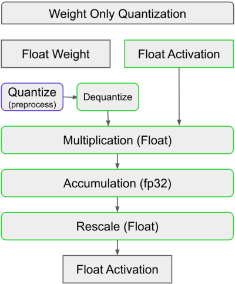

::: {.callout-tip}
## This post is part of the following series:
* [**GPU MODE Lecture Notes**](/series/notes/cuda-mode-notes.html): My notes from the **GPU MODE** reading group lectures run by **Andreas Kopf** and **Mark Saroufim**.
:::

* [Introduction](#introduction)
* [Overview of Quantization](#overview-of-quantization)
* [Dynamic Quantization Kernels](#dynamic-quantization-kernels)
* [Weight-only Quantization Kernels](#weight-only-quantization-kernels)
* [INT4 Weight-only Quantization Kernels](#int4-weight-only-quantization-kernels)
* [Strengths and Limitations of Triton](#strengths-and-limitations-of-triton)
* [Q&A Session](#qa-session)

::: {.callout-tip title="Resource Links:"}

* **YouTube Recording:** [Lecture 7 Advanced Quantization](https://www.youtube.com/watch?v=1u9xUK3G4VM) 
* **Slides:** [Quantization Cuda vs Triton](https://www.dropbox.com/scl/fi/hzfx1l267m8gwyhcjvfk4/Quantization-Cuda-vs-Triton.pdf?rlkey=s4j64ivi2kpp2l0uq8xjdwbab&e=1&dl=0)

:::

### Introduction

- **Speaker:** Charles Hernandez, PyTorch Core Team (AO Team - Quantization & Pruning)
- **Focus:** GPU Quantization - Intersection of CUDA and Triton based on Charles' experience over the past year.
- **Background:**
  - [PyTorch AO](https://github.com/pytorch/ao) team focuses on making models work "worse but faster" by trading off accuracy for performance.
  - Historically, quantization was primarily for CPUs.
  - Recent push for GPU model productionization led to a shift towards GPU quantization.
  - Charles spearheaded quantization for projects like Segment Anything Fast, GPT Fast, SDXL Fast.
  - Tools used are available in Torch AO.
  - **GPU Quantization:** Focus of Charles' work over the past year.
    - Tools available in Torch AO repository.
    - Types of quantization: Dynamic, Weight-only INT8, INT4 Weight-only.
    - Key challenge: Lack of GPU quantized kernels prior to this work.

### Overview of Quantization

- **Goal:** Achieve faster inference by reducing the precision of weights and/or activations.
- **Types:**
  - **Dynamic Quantization:**
  
    
    - **Weights:** Quantized to integers.
    - **Activations:** Quantized to integers.
    - **Multiplication:** Integer multiplication (faster than float multiplication).
    - **Accumulation:** Results accumulated, rescaled, and output as float.
    - **Benefits:** Effective for compute-bound models (e.g., Segment Anything).
    - **Example:** Multiplying two INT8 tensors is ~4x faster than multiplying two BF16 tensors.
  - **Weight-only Quantization:**
  
    
    - **Weights:** Quantized to integers.
    - **Activations:** Remain in original precision (float).
    - **Multiplication:** Either directly multiply integer weights with float activations (mixed-dtype) or dequantize weights before multiplication.
    - **Benefits:**
      - Very fast weight loading.
      - Effective for memory-bound models (e.g., LLaMA).
      - More accurate than dynamic quantization (activations not quantized).
    - **Why not quantize activations in weight-only quantization?**
      - Memory-bound scenarios prioritize fast weight loading.
      - Quantizing activations adds overhead (compute and memory) that outweighs benefits in memory-bound cases.
      - Dynamic quantization tends to slow down memory-bound models like LLaMA compared to weight-only quantization.
- **Terminology**: Int4 quantization is ambiguous and should specify weight and activation dtypes (e.g., W4A16, W4BF16 with accumulation in FP32).
- **Quantization Considerations:**
  - **Model Quantizability:** Not all models are equally quantizable.
    - **Categorization models:** Generally easier to quantize.
    - **Regression models:** More challenging to quantize.
    - **GPTQ (Generative Pretrained Transformer Quantization)**: Implemented for Int4 in GPT Fast, allows for model-agnostic quantization.
  - **Quantization-Aware Training (QAT):** Technique to improve quantizability by training the model with simulated quantization.
    - Gradients are backpropagated through the simulated quantization operator.
  - **Granularity of Quantization:**
    - **Per-tensor:** Single scale for the entire tensor.
    - **Per-channel:** Different scales for each output channel.
    - **Per-token, per-vector, per-block:** Other possible granularities.
    - Finer granularities provide better accuracy but require more memory (more scales).
  - **Choice of Precision:** 8-bit, 4-bit, even 1-bit quantization are possible.
    - **Bit Width**: Lower bit widths (e.g., 1-bit) are possible but often lead to significant accuracy degradation, suitable for simpler tasks.
  - **Outliers and Distribution:** Quantization performance is affected by the distribution of weights and activations. Outliers can negatively impact accuracy.

### Dynamic Quantization Kernels

- **Initial Approach:** Leverage `torch.compile()` to generate Triton kernels from Python code.
- **Mathematical Formulation**: 
  - Basic linear operation: `Y = X.W`
  - Quantized operation (factor out scales): `Y = Sx * Sw * (Xint.Wint)` where `Xint` and `Wint` are quantized versions of `x` and `w`.
  - **Triton Tutorial:** [Matrix Multiplication](https://triton-lang.org/main/getting-started/tutorials/03-matrix-multiplication.html)
- **Per Token & Per Channel Quantization**: GPU allows efficient per token and per channel quantization due to parallel processing.

{fig-align="center"}

- **Challenges:**
  - **Memory Increase:** Materializing intermediate results in INT32 during INT8 multiplication leads to higher memory usage than BF16.
- **Solution:**
  - Fuse the rescaling operation (`sw`) into the Triton kernel to avoid materializing the INT32 intermediate result.
  - **Implementation:** 
    - Modify the Triton kernel to include the rescaling multiplication.
    - Use `config.force_fuse_int_mm_with_mul = True` in Torch Compile to force fusion.
    - **`torch/_inductor/kernel/mm.py`** [`tuned_fused_int_mm_mul`](https://github.com/pytorch/pytorch/blob/26e5572dd24acd69b08eb94577f8796a480c9fe0/torch/_inductor/kernel/mm.py#L757)
- **Results:**
  - **Performance:** ~14% improvement over baseline.
  - **Memory:** Slightly improved peak memory.
- **Key Takeaway:** Triton's flexibility in fusing operations enables significant performance gains without extensive kernel development.

### Weight-only Quantization Kernels

- **Initial Approach (Naive):**
  - Use the same matrix multiplication kernel as in dynamic quantization but change the activation's dtype to BF16.
  - Load INT8 weights, convert to BF16, multiply with BF16 activations, accumulate in FP32, and rescale.
- **Results:** Extremely slow, even slower than non-quantized matmul.
- **Analysis:**
  - Increased workload (loading integers, conversions, rescaling).
  - Potential limitations with block size in Triton's tensor core kernels.
- **Solution (Torch Compile Magic):**
  - Reformulate the matmul operation using element-wise multiplication and summation.
  - `torch.sum(x.unsqueeze(-1) * w, dim=-2)`
- **Results:**
  - **Performance:** Blazing fast, significantly faster than both weight-only and non-quantized matmul.
- **Analysis:**
  - Torch Compile generates a highly efficient Triton kernel that avoids tensor cores.
  - Each column of the weight matrix `w` is processed by a separate thread, enabling high parallelism.
  - Accumulates in FP32 (potential for further optimization).
- **Limitations:**
  - Only works for batch size 1 (memory-bound scenarios).
  - Batch size > 1 requires indexing over both activation and weight matrices, making it compute-bound and challenging.
- **Key Takeaway:** Torch Compile can sometimes produce unexpectedly efficient kernels for specific formulations, highlighting its potential for optimization.

### INT4 Weight-only Quantization Kernels

- **Challenges:**
  - No native INT4 dtype in PyTorch or Triton Lang.
  - Manual packing and unpacking of INT4 values into INT8 is required, introducing overhead.
  - Ideal scenario: Directly multiply INT4 values with BF16 activations without explicit conversions.
- **Triton-based Approach:**
  - **Packing:** Pack two INT4 values into one INT8 using various packing schemes.
  - **Kernel Implementation:** Implement a custom Triton kernel to handle packed INT4 multiplication.
- **Results:** Very slow, comparable to the naive weight-only approach.
- **CUDA Kernel (FastINT8):**
  - Jeff Johnson (PyTorch GPU backend developer) developed a highly optimized CUDA kernel for INT4 weight-only quantization.
- **Results:**
  - **Performance:** Extremely fast, surpassing all previous approaches.
  - Achieves state-of-the-art performance for INT4 quantization.
- **Key Takeaway:** For complex operations and custom dtypes, highly optimized CUDA kernels can significantly outperform Triton-based solutions. Triton's limitations become apparent in these scenarios.

### Strengths and Limitations of Triton

- **Strengths:**
  - **Accessibility:** Enables rapid development of efficient GPU kernels without deep CUDA expertise.
  - **Fusion:** Excellent at fusing multiple operations into single kernels, reducing overhead.
  - **INT8 Support:** Handles INT8 quantization very well.
  - **Torch Compile Integration:** Works seamlessly with Torch Compile for automatic kernel generation.
  - **Flexibility:** Easy to add custom operations or modify existing kernels.
- **Limitations:**
  - **Custom Dtypes:** Limited support for custom dtypes like INT4.
  - **Complex Operations:** Can struggle with complex operations that require fine-grained control over data layout and computation.
  - **Batch Size > 1 for Weight-only INT4:** No efficient solution yet.
  - **L2 Cache Issues:** Potential problems with L2 cache utilization for batch size > 1 in weight-only quantization.
  - **Config Consistency:** Heuristics for selecting optimal kernel configurations can be inconsistent.

### Q&A Session

#### Motivation and Comparison with Other Libraries

##### Reasons for Developing Native PyTorch Quantization

- **Goal:** Address the **fracturization of technologies** in the open-source community and make advanced techniques like quantization more accessible, especially for those without the time to keep up with rapidly evolving optimizations.
- **Advantages:**
  - **Native PyTorch integration:** Similar to how operations like LayerNorm and BatchNorm became accessible within PyTorch, quantization aims to provide a user-friendly experience.
  - **Access to the Torch Compile team:** Allows for faster development and the addition of hard-coded optimizations that might not be easily implemented elsewhere.
  - **Collaboration with experts like Jeff Johnson:** Leverages expertise in int4 kernels, resulting in potentially the **fastest int4 performance** currently available.

##### Comparison with BitsandBytes

- **Question:** Have you tested **Tim Dettmers' BitsandBytes library** for quantization?
- **Answer:** 
  - BitsandBytes focuses more on **quantization-aware training (QAT)**.
  - BitsandBytes kernels are **not the fastest**, employing a hybrid approach with FP16 for challenging layers.
  - The project aims for maximum speed, suggesting QAT or GPTQ as solutions for quantization challenges.
  - BitsandBytes appears to use **table-based lookups for 4-bit quantization**, which is likely not currently possible with Triton without an FP4 data type or tweaks to the Triton language.

##### Comparison with Other Quantization Libraries

- **[Quanto](https://huggingface.co/blog/quanto-introduction):** Hugging Face seems to be moving towards Quanto, developed by one of their employees.
- **Overall:**  There are many strong quantization technologies (BitsandBytes, Quanto, the project discussed) and limited engineering resources.
- **Prediction:** One technology will likely dominate the field within a couple of years.

#### Hardware Support and Integration

##### Nvidia Kernels and Data Types

- **Question:** Have you looked at **Nvidia's custom FP8 kernels**, particularly their performance in high-throughput scenarios with larger batch sizes?
- **Answer:**
  - Nvidia appears to have **removed int4 kernels from the H100** and moved to **FP4**.
  - Nvidia has a **mixed-precision data type (MX)**, but direct comparisons haven't been conducted yet.
  - The current focus is on **automating layer-specific quantization choices**, rather than peak performance.
  - They are tracking various quantization technologies like QUIP and AMP, which focus on rounding rather than kernels, and prioritizing support based on need.

##### AMD Support

- **Question:** What is the **appetite for AMD hardware support** through Triton?
- **Answer:** 
  - While the speaker is not on the Triton team, they acknowledge the potential of AMD support.
  - **Strong community appetite:** The GPT-fast blog post included AMD numbers, highlighting the potential for cross-platform support with minimal code changes.
  - **Active development:**  The PyTorch repo shows many eager kernels being HIP-ified (adapted for AMD).
  - **Bug reports are crucial** for improving AMD support and encouraging development.

##### Mac Support

- **Question:** Triton team mentioned plans for **integration with newer Mac versions** a year ago. Any updates?
- **Answer:** It's difficult to comment on hardware vendor plans, as they are typically kept secret until release.

#### Triton Usage and Development

##### Triton Installation

- **Question:** Do you install Triton directly from GitHub or use the version included with the latest PyTorch build?
- **Answer:**
  - Triton's rapid development can lead to inconsistencies between versions, affecting reproducibility.
  - Experiences of significant performance differences between Triton versions, with results sometimes degrading after upgrades or downgrades.
  - Currently, using the **PyTorch-bundled version** is recommended for **reproducibility**, although testing with the latest Triton can reveal potential speedups.

##### Triton's Openness and Future

- **Question:** Is Triton an OpenAI product or a collaborative effort? Are there agreements to ensure its availability for the broader community, even if OpenAI changes its licensing or access in the future?
- **Answer:** 
  - **Strong industry support:** The recent Triton conference showcased talks primarily from hardware vendors, indicating its wide adoption.
  - **Close ties with PyTorch:** Strong relationship between the Torch Compile and Triton teams, with Triton developers contributing to the PyTorch 2 paper.
  - **Triton's future within PyTorch seems secure**, becoming a core dependency for kernel generation.

####  Technical Deep Dive into Quantization

##### Accumulation Data Type Selection

- **Question:** When performing matrix multiplication with int8 inputs, how is the **accumulation data type** (e.g., BF16, FP32, FP64) chosen?
- **Answer:**
  - **Hardware limitations:** In many cases, hardware dictates the accumulation type (e.g., int8 multiplication often accumulates to int32).
  - **Overflow concerns:** Smaller accumulation types can lead to overflow issues, as seen with int8 accumulation in sparse kernels.
  - **Practical considerations:**  The goal is to use the smallest data type that avoids overflow, often BF16 or FP32.
  - **FP32's versatility:**  It can handle accumulation from various data types, including int8, making it a robust choice.
  - **FP64 is rarely needed** unless dealing with massive tensors prone to overflow during accumulation.

##### One-Bit Quantization

- **Question:** Have you explored **extreme cases like one-bit quantization**? Is it still useful, or does it lead to significant performance degradation?
- **Answer:** 
  - **QUIP paper demonstrates promising results:** It employs pre-processing to orthogonalize weights and activations, mitigating quantization error propagation.
  - **Specialized kernels:**  QUIP uses kernels for orthogonalization, multiplication, and de-orthogonalization, achieving reasonable results with int2 and potentially int1.
  - **Usefulness depends on the task:**  LLMs might be challenging, but simpler tasks like MNIST could be feasible.
  - **Power-of-two quantizations** are also efficient due to bit-shifting operations.
  - **Hardware support and accuracy** are key factors in determining the viability of extreme quantization techniques.

##### Weight Distribution Analysis

- **Question:** Do you use tools to **analyze weight distributions** before quantization (e.g., visualizing distributions, checking for outliers)?
- **Answer:**
  - **Depends on the technique:**  Basic int8 quantization typically doesn't require in-depth analysis.
  - **GPTQ for int4 requires data and pre-processing:** It involves calculating the Hessian of activations and iteratively quantizing weight matrix columns while maintaining the Hessian multiplication.
  - **Int8 weight-only quantization is fast and doesn't need data analysis**.
  - **QLoRA and LLM.int8 papers provide valuable insights:** QLoRA's appendix shows that LLM weights are often zero-mean and normally distributed.
  - **QLoRA's NF4 data type** aims to maintain a normal distribution of weights.
  - **Plotting weight histograms** is helpful to ensure a full range utilization of the lower d-type and avoid sparse buckets.
  - **Scaling and shifting the mean** are common techniques to optimize the use of the lower d-type's range.

##### Quantization for Speculative Decoding

- **Question:** Is quantization the best option for **speculative decoding**, compared to using a separate network? Would the weight distribution be similar?
- **Answer:**
  - **Experiments in the GPT-fast repo** demonstrate quantization for speculative decoding with a 70B Llama 2 model, quantized using GPTQ on WikiText.
  - **Trade-off between speed and accuracy:** Results show a clear trade-off, with different quantization levels offering varying performance.
  - **Quantization is currently the easiest and most mature option**, but sparsity and other techniques like knowledge distillation are also being explored.

####  Future Directions and Insights

#####  Scaling vs. Optimization

- **Observation:** Current trends focus on scaling up models, but quantization suggests we may not need all weights in their non-zero form.
- **Hardware limitations:** Current hardware favors dense matrix multiplications, potentially hindering the adoption of sparse techniques.
- **Sparse techniques are available in Torch.io for GPU**, but further development is needed.

#####  Layer-Specific Optimization

- **Complexity of optimization:** Finding the optimal combination of techniques for each layer is a laborious process, involving trade-offs between speed and accuracy.
- **No single solution:** There's no "one-size-fits-all" approach; optimizing requires careful analysis and experimentation.

#####  Accuracy Metrics

- **Question:** Is **accuracy** the best metric for evaluating quantization? Would **perplexity** be more realistic?
- **Answer:**
  - **Perplexity's limitations:** While useful, it can be difficult to interpret in terms of real-world impact, lacking a clear connection to human perception of quality.
  - **Accuracy provides more granularity and robustness**, allowing for fine-grained analysis of performance changes.
  - **Human evaluation (vibe checks)** remains the most indicative measure of quality in the short term, especially for detecting significant degradations like a model switching languages.
  - **Evaluation datasets are useful for CI checks** but might not fully capture real-world performance or user preferences.


