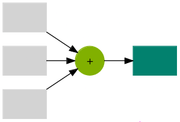
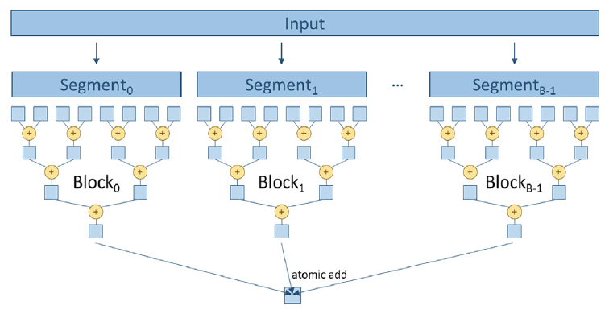

::: {.callout-tip}
## This post is part of the following series:
* [**GPU MODE Lecture Notes**](/series/notes/cuda-mode-notes.html): My notes from the **GPU MODE** reading group lectures run by **Andreas Kopf** and **Mark Saroufim**.
:::


* [Introduction](#introduction)
* [Examples of Reductions](#examples-of-reductions)
* [Reductions in Machine Learning](#reductions-in-machine-learning)
* [Implementing Reductions in PyTorch](#implementing-reductions-in-pytorch)
* [Serial Reduction](#serial-reduction)
* [Parallel Reduction Algorithm](#parallel-reduction-algorithm)
* [Non-Determinism in Floating-Point Reductions](#non-determinism-in-floating-point-reductions)
* [Implementing Parallel Reduction in CUDA](#implementing-parallel-reduction-in-cuda)  
* [Reductions in Machine Learning Frameworks](#reductions-in-machine-learning-frameworks)  
* [Conclusion](#conclusion)
* [Call to Action](#call-to-action)


::: {.callout-tip title="Resource Links:"}

* **YouTube Recording:** [Lecture 9: Reductions](https://www.youtube.com/watch?v=09wntC6BT5o)
* **Slides:** [Lecture 9: Reductions](https://docs.google.com/presentation/d/1s8lRU8xuDn-R05p1aSP6P7T5kk9VYnDOCyN5bWKeg3U/edit#slide=id.p)
* **Code:** [lecture_009](https://github.com/cuda-mode/lectures/tree/main/lecture_009)
* **Lightning AI Studio:** [CUDA Mode Lectures](https://lightning.ai/msaroufim/studios/cuda-mode-lectures?section=featured&query=cuda+mode)

:::


::: {.callout-warning title="[Local NCU Permissions](https://developer.nvidia.com/nvidia-development-tools-solutions-err_nvgpuctrperm-permission-issue-performance-counters)"}

```bash
# Allow access for any user (restart required)
echo 'options nvidia NVreg_RestrictProfilingToAdminUsers=0' | sudo tee /etc/modprobe.d/ncu-permissions.conf
```

:::


## Introduction

- This lecture covers **reductions**, a core concept in GPU programming and machine learning.

- Previous lectures (1-8) provided the foundational knowledge to author, integrate, profile, and ship CUDA/Triton kernels in PyTorch.

- This lecture aligns with Chapter 10 of the PMPP book and includes example kernels available on GitHub.

- **Reductions** are mathematical operations that reduce the size of input data, often producing a scalar from a vector in machine learning.

  


## Examples of Reductions

```python
def reduce(data, identity, op):
    result = identity
    for element in data:
        result = op(result, element)
    return result

data = [1, 2, 3, 4, 5]
```

- **Sum:**
  - Iteratively adds elements of a list.
  - Identity element: 0 (for an empty list).
  - **Example:**
    ```python
    # Summation
    print(reduce(data, 0, lambda a, b: a + b))  # Output: 15
    ```
- **Product:**
  - Iteratively multiplies elements of a list.
  - Identity element: 1 (for an empty list).
  - **Example:**
    
    ```python
    # Product
    print(reduce(data, 1, lambda a, b: a * b))  # Output: 120
    ```
- **Min/Max:**
  - Finds the minimum/maximum element in a list.
  - Identity element: `float('-inf')`/`float('inf')` (for an empty list).
    ```python
    # Maximum
    print(reduce(data, float('-inf'), max))  # Output: 5
    
    # Minimum
    print(reduce(data, float('inf'), min))  # Output: 1
    ```
- Other common reductions: argmax, argmin, norm, mean, number of unique elements.


## Reductions in Machine Learning

- **Ubiquitous** in machine learning code:
  - Convolutional Neural Networks (CNNs): Mean/max pooling.
  - Classification: Argmax over probabilities.
  - Loss calculations: Scalar loss computed from target and prediction.
  - Softmax normalization: Summation of exponentiated elements.


## Implementing Reductions in PyTorch

- **Reduction Implementations:** [aten/src/ATen/native/cuda/ReduceOps.cpp](https://github.com/pytorch/pytorch/blob/main/aten/src/ATen/native/cuda/ReduceOps.cpp)
- PyTorch provides built-in functions for common reductions (e.g., `torch.max`, `torch.min`, `torch.mean`).
- These functions call optimized CUDA kernels when tensors are on a CUDA device.


## Serial Reduction

- **Serial reduction** is a basic approach where a single thread iterates through the input data and updates the result sequentially.
- **Example:** Finding the maximum element in a list by iterating and comparing each element to the current maximum.

  ```text
  +----------------------+
  |    Initial Vector    |
  +----------------------+
  |  5  |  2  |  8  |  1 |
  +----------------------+
             |
             v
  +----------------------+
  |     Iteration 1      |
  +----------------------+
  |  5  |     |     |    |
  +----------------------+
             |
             v
  +----------------------+
  |     Iteration 2      |
  +----------------------+
  |  5  |  5  |     |    |
  +----------------------+
             |
             v
  +----------------------+
  |     Iteration 3      |
  +----------------------+
  |  5  |  5  |  8  |    |
  +----------------------+
             |
             v
  +----------------------+
  |     Iteration 4      |
  +----------------------+
  |  5  |  5  |  8  |  8 |
  +----------------------+
  ```

- **Inefficient** for parallel architectures like GPUs.


## Parallel Reduction Algorithm

- **Linked Video:**  [05 Atomics Reductions Warp Shuffle](https://www.youtube.com/watch?v=D4l1YMsGNlU&t=1763s)

- **Foundation** for efficient GPU reduction implementations.

- **Key Idea:** Divide the input data into pairs, assign a thread to each pair, and have each thread perform the reduction operation on its pair.

- **Iterative Process:** Repeat the process on the reduced results until a single result remains.

- **Max Reduction Visualization:**

  ```text
  +-----------------------------------------------------------------------+
  |                             Initial Vector                            |
  +-----------------------------------------------------------------------+
  |  5  |  2  |  8  |  1  |  1  |  9  |  3  |  7  |  7  |  4  |  6  |  0  |
  +-----------------------------------------------------------------------+
                                      |
                                      v
  +-----------------------------------------------------------------------+
  |                            Reduction Step 1                           |
  +-----------------------------------------------------------------------+
  |  5  |  8  |  9  |  7  |  6                                            |
  +-----------------------------------------------------------------------+
                                      |
                                      v
  +-----------------------------------------------------------------------+
  |                            Reduction Step 2                           |
  +-----------------------------------------------------------------------+
  |  8  |  9  |  7                                                        |
  +-----------------------------------------------------------------------+
                                      |
                                      v
  +-----------------------------------------------------------------------+
  |                            Reduction Step 3                           |
  +-----------------------------------------------------------------------+
  |  9  |  9                                                              |
  +-----------------------------------------------------------------------+
                                      |
                                      v
  +-----------------------------------------------------------------------+
  |                          Final Reduction Step                         |
  +-----------------------------------------------------------------------+
  |  9                                                                    |
  +-----------------------------------------------------------------------+
  ```

- **Sum Reduction Tree:** Visualizes the parallel reduction process as a tree, where each level represents a reduction step.

  

- **Logarithmic Complexity:** Requires `log n` steps for an input of size `n`.


## Non-Determinism in Floating-Point Reductions

- **Floating-point operations are non-commutative**, meaning `a + b` may not equal `b + a`.

- **Parallel reductions can introduce non-determinism** due to:
  - **Weak memory consistency** on GPUs: Different threads may execute operations in unpredictable order.
  - **Order of operations within threads:** The order in which a thread performs operations can affect the result.
  
- **Deterministic algorithms** can be enforced in PyTorch using `torch.use_deterministic_algorithms(True)`, but this can impact performance.

- **Example:** Summing a list with many small numbers and a few large numbers can produce different results depending on the order of operations.

  ```python
  # We'll use several small numbers that, when added together first, could show a difference
  numbers = [1e-20] * 10 + [1e20, -1e20]  # 10 small numbers followed by a large positive and negative number
  
  # Sum the list from left to right
  sum_left_to_right_adjusted = sum(numbers)
  
  # Sum the list from right to left
  sum_right_to_left_adjusted = sum(reversed(numbers))
  
  # 0.0 9.999999999999997e-20
  print(f"sum_left_to_right_adjusted: {sum_left_to_right_adjusted}")
  print(f"sum_right_to_left_adjusted: {sum_right_to_left_adjusted}")
  ```

  ```text
  sum_left_to_right_adjusted: 0.0
  sum_right_to_left_adjusted: 9.999999999999997e-20
  ```

- **Accuracy Implications:** Accumulating many small values in low-precision floating-point formats (e.g., float16) can lead to loss of precision.

  ```python
  import torch
  large_value = torch.tensor([1000.0], dtype=torch.float32)  # Using float32 for initial value
  
  # Define a smaller value that is significant for float32 but not for float16
  small_value = torch.tensor([1e-3], dtype=torch.float32)  # Small value in float32
  
  # Add small value to large value in float32
  result_float32 = large_value + small_value
  
  # Convert large value to float16 and add the small value (also converted to float16)
  result_float16 = large_value.to(torch.float16) + small_value.to(torch.float16)
  
  # Convert results back to float32 for accurate comparison
  result_float32 = result_float32.item()
  result_float16_converted = result_float16.to(torch.float32).item()
  
  # Print results
  # 1000.0009765625 1000.0
  print(f"result_float32: {result_float32}")
  print(f"result_float16_converted: {result_float16_converted}")
  ```

  ```text
  result_float32: 1000.0009765625
  result_float16_converted: 1000.0
  ```

- **Solutions:**
  
  - Use higher-precision formats (e.g., bfloat16) for accumulation.
  - Upcast the accumulator to a higher precision (e.g., float32) during the reduction.


## Implementing Parallel Reduction in CUDA

### Naive Approach: Simple Reduce

- **Thread Strategy:** One thread per pair of elements.

- **Implementation:**

  ```c++
  // Include necessary header files
  #include <iostream>  // For standard input/output functions
  #include <cuda.h>    // For CUDA functions and data types
  
  /*
   * CUDA kernel function to perform sum reduction on an array of floats.
   *
   * The kernel reduces the input array 'input' to a single sum and stores the result in 'output'.
   * The reduction is performed in parallel using a binary tree reduction pattern.
   *
   * Key concepts:
   * - Each thread in a block processes elements of the array.
   * - The number of active threads decreases by half in each iteration.
   * - Synchronization is required between iterations to ensure correct results.
   *
   * CUDA-specific keywords:
   * - __global__: Indicates a function that runs on the device (GPU) and is called from the host (CPU).
   * - threadIdx.x: The thread's index within its block in the x-dimension.
   * - blockDim.x: The number of threads in a block in the x-dimension.
   * - __syncthreads(): A barrier synchronization function that waits until all threads in the block reach this point.
   */
  __global__ void SimpleSumReductionKernel(float* input, float* output) {
      // Calculate the index for each thread.
      // Each thread handles two elements starting at index 'i'.
      unsigned int i = 2 * threadIdx.x;
  
      // Start the reduction loop.
      // 'stride' controls the distance between elements to be added.
      for (unsigned int stride = 1; stride <= blockDim.x; stride *= 2) {
          // Only threads where threadIdx.x is a multiple of 'stride' participate.
          if (threadIdx.x % stride == 0) {
              // Add the element at 'i + stride' to the element at 'i'.
              input[i] += input[i + stride];
          }
          // Synchronize threads to ensure all additions are completed before the next iteration.
          __syncthreads();
      }
  
      // After the reduction, the total sum is stored in input[0].
      // Thread 0 writes the result to the output variable.
      if (threadIdx.x == 0) {
          *output = input[0];
      }
  }
  
  int main() {
      // Define the size of the input array.
      const int size = 2048;
  
      // Calculate the total bytes needed for the input array.
      const int bytes = size * sizeof(float);
  
      // Allocate memory on the host (CPU) for input array and output variable.
      float* h_input = new float[size];  // Host input array
      float* h_output = new float;       // Host output variable
  
      // Initialize the input array on the host.
      // For simplicity, set all elements to 1.0f.
      for (int i = 0; i < size; i++) {
          h_input[i] = 1.0f;  // Initialize each element to 1
      }
  
      // Declare pointers for device (GPU) memory.
      float* d_input;   // Device input array
      float* d_output;  // Device output variable
  
      // Allocate memory on the device for input array and output variable.
      cudaMalloc(&d_input, bytes);           // Allocate memory for input array
      cudaMalloc(&d_output, sizeof(float));  // Allocate memory for output variable
  
      // Copy the input data from host memory to device memory.
      cudaMemcpy(d_input, h_input, bytes, cudaMemcpyHostToDevice);
  
      // Determine the number of threads per block.
      // Since each thread handles two elements, we use half the size of the input array.
      int threadsPerBlock = size / 2;
  
      // Launch the reduction kernel on the device.
      // The kernel configuration <<<1, threadsPerBlock>>> means:
      // - 1 block
      // - 'threadsPerBlock' threads per block
      SimpleSumReductionKernel<<<1, threadsPerBlock>>>(d_input, d_output);
  
      // Copy the result from device memory back to host memory.
      cudaMemcpy(h_output, d_output, sizeof(float), cudaMemcpyDeviceToHost);
  
      // Print the result to the console.
      std::cout << "Sum is " << *h_output << std::endl;
  
      // Free the allocated memory on the host.
      delete[] h_input;  // Free host input array
      delete h_output;   // Free host output variable
  
      // Free the allocated memory on the device.
      cudaFree(d_input);   // Free device input array
      cudaFree(d_output);  // Free device output variable
  
      return 0;  // Return success
  }
  ```

  - Threads with even indices are active.
  - Stride starts at 1 and doubles at each iteration.
  - Each thread adds its current element and the element at `stride` distance.

- **Issues:**
  - **High thread divergence:** Many threads become inactive as the reduction progresses.
  - **Poor memory access patterns:** Threads access data with increasing strides, leading to poor cache utilization.

- **Benchmark:**

  ```bash
  # Create a binary called sum
  nvcc -o sum simple_reduce.cu
  # Run the binary
  ncu --set full sum
  ```

* **Results (RTX 4090):**

  ```text
  Sum is 2048
  ```

  | Metric Name               | Metric Unit | Metric Value |
  | ------------------------- | ----------- | ------------ |
  | Branch Instructions Ratio | %           | 0.12         |
  | Branch Instructions       | inst        | 1,312        |
  | **Branch Efficiency**     | %           | **74.05**    |
  | Avg. Divergent Branches   |             | 0.37         |


### Minimizing Control Divergence: Control Divergence Reduction

- **Thread Strategy:** Threads are co-located, with stride starting at block dimension and halving at each iteration.

  

- **Implementation:**

  ```c++
  #include <iostream> // Include input/output stream library
  #include <cuda.h>   // Include CUDA runtime API
  
  // CUDA kernel function to perform parallel reduction (sum of array elements)
  // This kernel adds elements in the input array in parallel to compute the total sum.
  // It uses a tree-based reduction pattern to sum the elements efficiently.
  __global__ void FixDivergenceKernel(float* input, float* output) {
      unsigned int i = threadIdx.x; // Each thread handles one element of the input array.
  
      // Iteratively reduce the array elements.
      // At each step, 'stride' determines the distance between elements to be added.
      for (unsigned int stride = blockDim.x; stride >= 1; stride /= 2) {
          // Ensure that threads with index less than 'stride' perform the computation.
          if (threadIdx.x < stride) {
              // Add the element from the distant index (i + stride) to the current index (i).
              input[i] += input[i + stride];
          }
          // Synchronize threads to ensure all additions are completed before the next iteration.
          __syncthreads();
      }
  
      // After the reduction, the first thread (threadIdx.x == 0) has the total sum in input[0].
      if (threadIdx.x == 0) {
          *output = input[0]; // Write the result to the output variable.
      }
  }
  
  int main() {
      // Size of the input data (number of elements in the array).
      const int size = 2048;
      // Total size in bytes of the input data.
      const int bytes = size * sizeof(float);
  
      // Allocate memory for input and output on the host (CPU).
      float* h_input = new float[size]; // Host input array.
      float* h_output = new float;      // Host output variable to store the result.
  
      // Initialize input data on the host.
      for (int i = 0; i < size; i++) {
          h_input[i] = 1.0f; // Example initialization: set all elements to 1.
      }
  
      // Allocate memory for input and output on the device (GPU).
      float* d_input;  // Device input array.
      float* d_output; // Device output variable.
      cudaMalloc(&d_input, bytes);          // Allocate memory for input array on device.
      cudaMalloc(&d_output, sizeof(float)); // Allocate memory for output variable on device.
  
      // Copy input data from host to device.
      cudaMemcpy(d_input, h_input, bytes, cudaMemcpyHostToDevice);
  
      // Determine the number of threads per block.
      int threadsPerBlock = size / 2; // Launch half as many threads as the input size.
  
      // Launch the kernel function on the GPU.
      // The syntax is <<<number of blocks, threads per block>>>
      // We use 1 block and 'threadsPerBlock' threads.
      FixDivergenceKernel<<<1, threadsPerBlock>>>(d_input, d_output);
  
      // Copy the result back from device to host.
      cudaMemcpy(h_output, d_output, sizeof(float), cudaMemcpyDeviceToHost);
  
      // Print the result.
      std::cout << "Sum is " << *h_output << std::endl; // Expected output: Sum is 2048
  
      // Clean up and free allocated memory.
      delete[] h_input; // Free host input array.
      delete h_output;  // Free host output variable.
      cudaFree(d_input);   // Free device input array.
      cudaFree(d_output);  // Free device output variable.
  
      return 0;
  }
  ```

  - All threads are initially active.
  - Stride starts at block dimension and is halved at each iteration.
  - Each thread adds its current element and the element at `stride` distance.

- **Benefits:**
  - **Reduced thread divergence:** Threads remain active for longer.
  - **Improved memory access patterns:** Threads access contiguous chunks of memory, improving cache utilization.

- **Benchmark:**

  ```bash
  # Create a binary called sum
  nvcc -o sum control_divergence_reduce.cu
  # Run the binary
  ncu --set full sum
  ```

* **Results (RTX 4090):**

  ```text
  Sum is 2048
  ```

  | Metric Name                 | Metric Unit | Metric Value |
  | --------------------------- | ----------- | ------------ |
  | DRAM Frequency              | Ghz         | 10.28        |
  | SM Frequency                | Ghz         | 2.19         |
  | Elapsed Cycles              | cycle       | 6,299        |
  | Memory Throughput           | %           | 0.68         |
  | DRAM Throughput             | %           | 0.39         |
  | **Duration**                | us          | **2.88**     |
  | **L1/TEX Cache Throughput** | %           | **30.49**    |
  | L2 Cache Throughput         | %           | 0.68         |
  | SM Active Cycles            | cycle       | 29.80        |
  | Compute (SM) Throughput     | %           | **0.12**     |
  
  | Metric Name               | Metric Unit | Metric Value |
  | ------------------------- | ----------- | ------------ |
  | Branch Instructions Ratio | %           | 0.31         |
  | Branch Instructions       | inst        | 1,126        |
  | **Branch Efficiency**     | %           | **99.32**    |
  | Avg. Divergent Branches   |             | 0.01         |


### Utilizing Shared Memory: Shared Reduce

- **Thread Strategy:** Similar to control divergence reduction, but the first reduction step is performed in shared memory.

  

- **Implementation:**

  ```c++
  #include <iostream>
  #include <cuda.h>
  
  /*
   * This program demonstrates how to perform parallel reduction using CUDA.
   * It computes the sum of an array of floating-point numbers.
   * The reduction is performed within a single block using shared memory for optimization.
   */
  
  // Define the number of threads per block (must be a power of 2 for reduction)
  #define BLOCK_DIM 1024
  
  // CUDA kernel function to perform parallel reduction using shared memory
  __global__ void SharedMemoryReduction(float* input, float* output) {
      // Declare shared memory array to hold partial sums
      __shared__ float input_s[BLOCK_DIM];
  
      // Calculate the thread's index within the block
      unsigned int t = threadIdx.x;
  
      // Each thread processes two elements from the input array
      // Compute the global indices of the elements to be processed
      unsigned int start_index = t;
      unsigned int end_index = t + BLOCK_DIM;
  
      // Load elements from global memory, add them, and store the result in shared memory
      input_s[t] = input[start_index] + input[end_index];
  
      // Synchronize threads to ensure all partial sums are loaded into shared memory
      __syncthreads();
  
      // Perform the reduction in shared memory
      // At each step, the stride is halved and threads with indices less than the stride
      // add their corresponding element with the element stride positions ahead
      // This effectively sums pairs of elements, then pairs of pairs, and so on
      for (unsigned int stride = blockDim.x / 2; stride >= 1; stride /= 2) {
          // Synchronize threads before each reduction step to ensure all additions are complete
          __syncthreads();
  
          // Only threads with indices less than stride participate in this step
          if (t < stride) {
              // Each thread adds its element with the element stride positions ahead
              input_s[t] += input_s[t + stride];
          }
      }
  
      // After the reduction, the first element of shared memory contains the total sum
      // Thread 0 writes the result from shared memory to the output variable in global memory
      if (t == 0) {
          *output = input_s[0];
      }
  }
  
  int main() {
      // Total number of input elements (must be a multiple of 2 * BLOCK_DIM)
      const int size = 2048; // Note: This implementation assumes size is exactly 2 * BLOCK_DIM
  
      // Total size in bytes of the input array
      const int bytes = size * sizeof(float);
  
      // Allocate host memory for input and output
      float* h_input = new float[size];    // Host input array
      float* h_output = new float;         // Host output value
  
      // Initialize input data on the host
      // For simplicity, we initialize all elements to 1.0f
      // The expected sum is size * 1.0f = 2048.0f
      for (int i = 0; i < size; i++) {
          h_input[i] = 1.0f;
      }
  
      // Allocate device memory for input and output
      float* d_input;
      float* d_output;
      cudaMalloc(&d_input, bytes);             // Device input array
      cudaMalloc(&d_output, sizeof(float));    // Device output value
  
      // Copy input data from host to device
      cudaMemcpy(d_input, h_input, bytes, cudaMemcpyHostToDevice);
  
      // Launch the kernel with one block and size / 2 threads
      // Each thread processes two elements
      int threadsPerBlock = size / 2; // 2048 / 2 = 1024 threads
      int blocksPerGrid = 1;
      SharedMemoryReduction<<<blocksPerGrid, threadsPerBlock>>>(d_input, d_output);
  
      // Copy the result from device to host
      cudaMemcpy(h_output, d_output, sizeof(float), cudaMemcpyDeviceToHost);
  
      // Print the final result
      std::cout << "Sum is " << *h_output << std::endl;
  
      // Free host and device memory
      delete[] h_input;
      delete h_output;
      cudaFree(d_input);
      cudaFree(d_output);
  
      return 0;
  }
  ```

  - Input data is copied to shared memory in a block-wise manner.
  - Reduction is performed entirely in shared memory.
  - Final result is written to global memory using atomic operations.

- **Benefits:**
  - **Reduced global memory accesses:** Data is read from global memory only once.
  - **Improved memory access patterns:** Shared memory access is faster and more predictable than global memory access.

- **Limitation:** Assumes the entire input can fit into shared memory.

- **Benchmark:**

  ```bash
  # Create a binary called sum
  nvcc -o sum shared_reduce.cu
  # Run the binary
  ncu --set full sum
  ```

- **Results (RTX 4090):**

  ```text
  Sum is 2048
  ```

  | Metric Name                 | Metric Unit | Metric Value |
  | --------------------------- | ----------- | ------------ |
  | DRAM Frequency              | Ghz         | 10.32        |
  | SM Frequency                | Ghz         | 2.19         |
  | Elapsed Cycles              | cycle       | 7,006        |
  | Memory Throughput           | %           | 0.44         |
  | DRAM Throughput             | %           | 0.44         |
  | **Duration**                | us          | **3.20**     |
  | **L1/TEX Cache Throughput** | %           | **48.27**    |
  | L2 Cache Throughput         | %           | 0.36         |
  | SM Active Cycles            | cycle       | 35.28        |
  | Compute (SM) Throughput     | %           | 0.24         |

  | Metric Name               | Metric Unit | Metric Value |
  | ------------------------- | ----------- | ------------ |
  | Branch Instructions Ratio | %           | 0.10         |
  | Branch Instructions       | inst        | 385          |
  | **Branch Efficiency**     | %           | **100**      |
  | Avg. Divergent Branches   |             | 0            |


### Segmented Multi-Block Reduction: Segmented Reduce

- **Thread Strategy:** Uses multiple blocks to handle larger inputs. Each block performs a reduction on a segment of the input

  

- **Implementation:**

  ```c++
  /*
   * This program demonstrates how to perform a parallel reduction (sum) of an array using CUDA.
   * It sums up all elements of an input array using multiple threads and blocks on the GPU.
   * Each block computes a partial sum using shared memory and then adds it to a global output variable.
   */
  
  #include <iostream>  // Include standard input/output stream library
  #include <cuda.h>    // Include CUDA library for GPU programming
  
  #define BLOCK_DIM 1024  // Define the number of threads per block
  
  /**
   * CUDA kernel function to perform parallel reduction (sum) of an input array.
   * Each block reduces its portion of the array using shared memory, and the result is accumulated
   * into a single output variable using atomic addition.
   * 
   * @param input  Pointer to input array in device memory
   * @param output Pointer to output variable in device memory (the result of reduction)
   * @param n      Size of the input array
   */
  __global__ void SharedMemoryReduction(float* input, float* output, int n) {
      // Declare shared memory array for this block
      __shared__ float input_s[BLOCK_DIM];
  
      // Compute global index for this thread
      unsigned int idx = blockIdx.x * blockDim.x + threadIdx.x; // Global index
      // Thread index within the block
      unsigned int t = threadIdx.x;
  
      // Each thread loads one element from global memory to shared memory
      if (idx < n) {
          input_s[t] = input[idx];  // Load element from global memory
      } else {
          input_s[t] = 0.0f;        // If index exceeds array size, initialize to zero
      }
      __syncthreads();  // Ensure all threads have loaded their data
  
      // Perform tree-based reduction in shared memory
      for (unsigned int stride = blockDim.x / 2; stride > 0; stride >>= 1) {
          // At each step, the stride halves, combining pairs of elements
          if (t < stride && idx + stride < n) {
              input_s[t] += input_s[t + stride];  // Add the element with its pair
          }
          __syncthreads();  // Synchronize threads before next iteration
      }
  
      // After reduction, the first thread of each block contains the block's partial sum
      if (t == 0) {
          // Atomically add block's partial sum to global output variable
          atomicAdd(output, input_s[0]);
      }
  }
  
  int main() {
      // Define the size of the input data
      const int size = 100000;                // Total number of elements in the array
      const int bytes = size * sizeof(float); // Total size in bytes of the array
  
      // Allocate memory on host (CPU)
      float* h_input = new float[size];   // Host input array
      float* h_output = new float;        // Host output variable
  
      // Initialize input data on host
      for (int i = 0; i < size; i++) {
          h_input[i] = 1.0f; // Example: Initialize all elements to 1
      }
      // Since we initialized all elements to 1.0f, the expected sum is equal to 'size'
  
      // Allocate memory on device (GPU)
      float* d_input;   // Device input array
      float* d_output;  // Device output variable
  
      cudaMalloc(&d_input, bytes);          // Allocate device memory for input array
      cudaMalloc(&d_output, sizeof(float)); // Allocate device memory for output variable
  
      // Initialize output variable on device to zero
      float zero = 0.0f;
      cudaMemcpy(d_output, &zero, sizeof(float), cudaMemcpyHostToDevice);
  
      // Copy input data from host to device
      cudaMemcpy(d_input, h_input, bytes, cudaMemcpyHostToDevice);
  
      // Determine the number of blocks needed
      int numBlocks = (size + BLOCK_DIM - 1) / BLOCK_DIM; // Calculate number of blocks
  
      // Launch the kernel on the device
      SharedMemoryReduction<<<numBlocks, BLOCK_DIM>>>(d_input, d_output, size);
  
      // Copy the result from device back to host
      cudaMemcpy(h_output, d_output, sizeof(float), cudaMemcpyDeviceToHost);
  
      // Print the result
      std::cout << "Sum is " << *h_output << std::endl;
  
      // Free host and device memory
      delete[] h_input;   // Free host input array
      delete h_output;    // Free host output variable
      cudaFree(d_input);  // Free device input array
      cudaFree(d_output); // Free device output variable
  
      return 0;
  }
  ```

  - Each block copies its segment of the input to shared memory.
  - Reduction is performed in shared memory within each block.
  - Each block writes its partial result to global memory using atomic operations.
  - A final reduction is performed on the partial results in global memory.

- **Benefits:**
  - **Handles larger inputs:** Shared memory limitations are overcome by using multiple blocks.
  - **Improved parallelism:** Multiple blocks can execute concurrently.

- **Benchmark:**

  ```bash
  # Create a binary called sum
  nvcc -o sum segment_reduce.cu
  # Run the binary
  ncu --set full sum
  ```

- **Results (RTX 4090):**

  ```text
  Sum is 100000
  ```

  

### Thread Coarsening: Reduced Coarsening

- **Thread Strategy:** Each thread reduces multiple elements before synchronizing with other threads.

  

- **Implementation:**

  ```c++
  #include <iostream>
  #include <cuda.h>  // Include CUDA header for CUDA runtime functions
  
  // Define the number of threads per block (maximum is 1024 for most GPUs)
  #define BLOCK_DIM 1024
  
  // Define the coarsening factor (number of elements each thread will process)
  #define COARSE_FACTOR 2
  
  /**
   * CUDA kernel function that performs parallel reduction (summing up an array of floats)
   * using thread coarsening to have each thread process multiple elements,
   * and using shared memory for efficient intra-block reduction.
   *
   * @param input  Pointer to the input array in device memory
   * @param output Pointer to the output value in device memory
   * @param size   The size of the input array
   */
  __global__ void CoarsenedReduction(float* input, float* output, int size) {
      // Allocate shared memory for partial sums within a block
      __shared__ float input_s[BLOCK_DIM];
  
      // Compute the global index for each thread, adjusted for coarsening
      unsigned int i = blockIdx.x * blockDim.x * COARSE_FACTOR + threadIdx.x;
  
      // Thread index within the block
      unsigned int t = threadIdx.x;
  
      // Initialize a local sum for this thread
      float sum = 0.0f;
  
      // Each thread processes COARSE_FACTOR elements
      for (unsigned int tile = 0; tile < COARSE_FACTOR; ++tile) {
          unsigned int index = i + tile * blockDim.x;  // Compute the index for the current element
  
          // Check if index is within bounds
          if (index < size) {
              sum += input[index];  // Accumulate the sum
          }
      }
  
      // Store the partial sum in shared memory
      input_s[t] = sum;
  
      // Synchronize threads within the block to ensure all partial sums are stored
      __syncthreads();
      
      // Perform reduction within the block using shared memory
      for (unsigned int stride = blockDim.x / 2; stride > 0; stride >>= 1) {
          if (t < stride) {
              input_s[t] += input_s[t + stride];  // Accumulate sums from higher threads
          }
          // Synchronize after each reduction step
          __syncthreads();
      }
  
      // Thread 0 in each block adds the block's result to the global output atomically
      if (t == 0) {
          atomicAdd(output, input_s[0]);
      }
  }
  
  int main() {
      // Total number of elements to sum
      const int size = 10000;
      // Total size in bytes for the input array
      const int bytes = size * sizeof(float);
  
      // Allocate memory on the host (CPU) for input data and output result
      float* h_input = new float[size];  // Input array
      float* h_output = new float;       // Output value
  
      // Initialize input data on the host (e.g., set all elements to 1.0f)
      for (int i = 0; i < size; i++) {
          h_input[i] = 1.0f;  // Example initialization
      }
  
      // Allocate memory on the device (GPU) for input data and output result
      float* d_input;
      float* d_output;
      cudaMalloc(&d_input, bytes);          // Allocate device memory for input
      cudaMalloc(&d_output, sizeof(float)); // Allocate device memory for output
  
      // Copy input data from host to device
      cudaMemcpy(d_input, h_input, bytes, cudaMemcpyHostToDevice);
  
      // Initialize output on the device to 0
      cudaMemset(d_output, 0, sizeof(float));
  
      // Calculate the number of blocks needed, considering coarsening
      int numBlocks = (size + BLOCK_DIM * COARSE_FACTOR - 1) / (BLOCK_DIM * COARSE_FACTOR);
  
      // Launch the kernel with the calculated number of blocks and threads per block
      CoarsenedReduction<<<numBlocks, BLOCK_DIM>>>(d_input, d_output, size);
  
      // Copy the result from device back to host
      cudaMemcpy(h_output, d_output, sizeof(float), cudaMemcpyDeviceToHost);
  
      // Print the final result
      std::cout << "Sum is " << *h_output << std::endl;
  
      // Free allocated memory on the host
      delete[] h_input;
      delete h_output;
  
      // Free allocated memory on the device
      cudaFree(d_input);
      cudaFree(d_output);
  
      return 0;
  }
  ```

  - Threads reduce multiple elements within their assigned segment.
  - Reduction is then performed within blocks and finally across blocks, similar to the segmented reduction.

- **Benefits:**

  - **Reduced synchronization overhead:** Threads synchronize less frequently.
  - **Improved memory access patterns:** Threads access contiguous chunks of memory during the initial reduction.

- **Benchmark:**

  ```bash
  # Create a binary called sum
  nvcc -o sum reduce_coarsening.cu
  # Run the binary
  ncu --set full sum
  ```

* **Results (RTX 4090):**

  ```text
  Sum is 10000
  ```

  


## Reductions in Machine Learning Frameworks

### PyTorch

- **Generic Reduction Kernel:** PyTorch uses a single [`Reduce.cuh`](https://github.com/pytorch/pytorch/blob/main/aten/src/ATen/native/cuda/Reduce.cuh) kernel for various reduction operations (e.g., min, max, sum).
- **Code Generation:** The kernel is specialized at runtime based on the desired reduction operation, data type, and input size.
- **Heuristics:** PyTorch uses heuristics to determine optimal kernel launch parameters (e.g., block size, grid size).
- **[ReduceConfig](https://github.com/pytorch/pytorch/blob/c64ae601ba9eb3ad2cd3402a14f6ac83c0ab7eba/aten/src/ATen/native/cuda/Reduce.cuh#L1205):** Defines various heuristics and parameters for different reduction scenarios.
- **Examples:**
  - [`Reduce.cuh`](https://github.com/pytorch/pytorch/blob/main/aten/src/ATen/native/cuda/Reduce.cuh) handles different data types and accumulation strategies.
  - [`ReduceConfig`](https://github.com/pytorch/pytorch/blob/c64ae601ba9eb3ad2cd3402a14f6ac83c0ab7eba/aten/src/ATen/native/cuda/Reduce.cuh#L1205) sets heuristics for block size, thread coarsening, and accumulation data type.

### Torch Compile (Triton)

```python
import torch 

@torch.compile
def f(a):
    c = torch.sum(a)
    return c

f(torch.randn(10).cuda())
```

```bash
TORCH_LOGS="output_code" python reduce_compile.py
```

- **Trident Kernels:** Torch Compile generates Trident kernels for reductions.

  ```python
  # AOT ID: ['0_inference']
  from ctypes import c_void_p, c_long
  import torch
  import math
  import random
  import os
  import tempfile
  from math import inf, nan
  from torch._inductor.hooks import run_intermediate_hooks
  from torch._inductor.utils import maybe_profile
  from torch._inductor.codegen.memory_planning import _align as align
  
  from torch import device, empty_strided
  from torch._inductor.async_compile import AsyncCompile
  from torch._inductor.select_algorithm import extern_kernels
  from torch._inductor.codegen.multi_kernel import MultiKernelCall
  
  aten = torch.ops.aten
  inductor_ops = torch.ops.inductor
  _quantized = torch.ops._quantized
  assert_size_stride = torch._C._dynamo.guards.assert_size_stride
  empty_strided_cpu = torch._C._dynamo.guards._empty_strided_cpu
  empty_strided_cuda = torch._C._dynamo.guards._empty_strided_cuda
  reinterpret_tensor = torch._C._dynamo.guards._reinterpret_tensor
  alloc_from_pool = torch.ops.inductor._alloc_from_pool
  async_compile = AsyncCompile()
  
  
  # kernel path: /tmp/torchinductor_innom-dt/xc/cxcl4refhjzcdxt6unhmqpirfzuwlll35zqbrgprj6lcwak26bfa.py
  # Source Nodes: [c], Original ATen: [aten.sum]
  # c => sum_1
  triton_per_fused_sum_0 = async_compile.triton('triton_', '''
  import triton
  import triton.language as tl
  from triton.compiler.compiler import AttrsDescriptor
  
  from torch._inductor.runtime import triton_helpers, triton_heuristics
  from torch._inductor.runtime.triton_helpers import libdevice, math as tl_math
  from torch._inductor.runtime.hints import AutotuneHint, ReductionHint, TileHint, instance_descriptor, DeviceProperties
  
  @triton_heuristics.persistent_reduction(
      size_hints=[1, 16],
      reduction_hint=ReductionHint.INNER,
      filename=__file__,
      triton_meta={'signature': {0: '*fp32', 1: '*fp32', 2: 'i32', 3: 'i32'}, 'device': DeviceProperties(type='cuda', index=0, cc=89, major=8, regs_per_multiprocessor=65536, max_threads_per_multi_processor=1536, multi_processor_count=128), 'constants': {2: 1}, 'configs': [AttrsDescriptor(divisible_by_16=(0, 1), equal_to_1=(2,))]},
      inductor_meta={'autotune_hints': set(), 'kernel_name': 'triton_per_fused_sum_0', 'mutated_arg_names': [], 'no_x_dim': False, 'num_load': 1, 'num_reduction': 1, 'backend_hash': '2A9CF09493B10CFF69FD04C0FEC21CD676E4FE3810C6D0938868EF378B24086E', 'are_deterministic_algorithms_enabled': False, 'assert_indirect_indexing': True, 'autotune_local_cache': True, 'autotune_pointwise': True, 'autotune_remote_cache': False, 'force_disable_caches': False, 'dynamic_scale_rblock': True, 'max_autotune': False, 'max_autotune_pointwise': False, 'min_split_scan_rblock': 256, 'spill_threshold': 16, 'store_cubin': False}
  )
  @triton.jit
  def triton_(in_ptr0, out_ptr0, xnumel, rnumel, XBLOCK : tl.constexpr):
      xnumel = 1
      rnumel = 10
      RBLOCK: tl.constexpr = 16
      xoffset = tl.program_id(0) * XBLOCK
      xindex = xoffset + tl.arange(0, XBLOCK)[:, None]
      xmask = xindex < xnumel
      rindex = tl.arange(0, RBLOCK)[None, :]
      roffset = 0
      rmask = rindex < rnumel
      r0 = rindex
      tmp0 = tl.load(in_ptr0 + (r0), rmask, other=0.0)
      tmp1 = tl.broadcast_to(tmp0, [XBLOCK, RBLOCK])
      tmp3 = tl.where(rmask, tmp1, 0)
      tmp4 = tl.sum(tmp3, 1)[:, None]
      tl.store(out_ptr0 + (tl.full([XBLOCK, 1], 0, tl.int32)), tmp4, None)
  ''', device_str='cuda')
  
  import triton
  import triton.language as tl
  from torch._inductor.runtime.triton_heuristics import grid, split_scan_grid, start_graph, end_graph
  from torch._C import _cuda_getCurrentRawStream as get_raw_stream
  
  
  async_compile.wait(globals())
  del async_compile
  
  def call(args):
      arg0_1, = args
      args.clear()
      assert_size_stride(arg0_1, (10, ), (1, ))
      with torch.cuda._DeviceGuard(0):
          torch.cuda.set_device(0)
          buf0 = empty_strided_cuda((), (), torch.float32)
          # Source Nodes: [c], Original ATen: [aten.sum]
          stream0 = get_raw_stream(0)
          triton_per_fused_sum_0.run(arg0_1, buf0, 1, 10, grid=grid(1), stream=stream0)
          del arg0_1
      return (buf0, )
  
  
  def benchmark_compiled_module(times=10, repeat=10):
      from torch._dynamo.testing import rand_strided
      from torch._inductor.utils import print_performance
      arg0_1 = rand_strided((10, ), (1, ), device='cuda:0', dtype=torch.float32)
      fn = lambda: call([arg0_1])
      return print_performance(fn, times=times, repeat=repeat)
  
  
  if __name__ == "__main__":
      from torch._inductor.wrapper_benchmark import compiled_module_main
      compiled_module_main('None', benchmark_compiled_module)
  ```

  ```python
  import triton
  import triton.language as tl
  from triton.compiler.compiler import AttrsDescriptor
  
  from torch._inductor.runtime import triton_helpers, triton_heuristics
  from torch._inductor.runtime.triton_helpers import libdevice, math as tl_math
  from torch._inductor.runtime.hints import AutotuneHint, ReductionHint, TileHint, instance_descriptor, DeviceProperties
  
  @triton_heuristics.persistent_reduction(
      size_hints=[1, 16],
      reduction_hint=ReductionHint.INNER,
      filename=__file__,
      triton_meta={'signature': {0: '*fp32', 1: '*fp32', 2: 'i32', 3: 'i32'}, 'device': DeviceProperties(type='cuda', index=0, cc=89, major=8, regs_per_multiprocessor=65536, max_threads_per_multi_processor=1536, multi_processor_count=128), 'constants': {2: 1}, 'configs': [AttrsDescriptor(divisible_by_16=(0, 1), equal_to_1=(2,))]},
      inductor_meta={'autotune_hints': set(), 'kernel_name': 'triton_per_fused_sum_0', 'mutated_arg_names': [], 'no_x_dim': False, 'num_load': 1, 'num_reduction': 1, 'backend_hash': '2A9CF09493B10CFF69FD04C0FEC21CD676E4FE3810C6D0938868EF378B24086E', 'are_deterministic_algorithms_enabled': False, 'assert_indirect_indexing': True, 'autotune_local_cache': True, 'autotune_pointwise': True, 'autotune_remote_cache': False, 'force_disable_caches': False, 'dynamic_scale_rblock': True, 'max_autotune': False, 'max_autotune_pointwise': False, 'min_split_scan_rblock': 256, 'spill_threshold': 16, 'store_cubin': False}
  )
  @triton.jit
  def triton_(in_ptr0, out_ptr0, xnumel, rnumel, XBLOCK : tl.constexpr):
      xnumel = 1
      rnumel = 10
      RBLOCK: tl.constexpr = 16
      xoffset = tl.program_id(0) * XBLOCK
      xindex = xoffset + tl.arange(0, XBLOCK)[:, None]
      xmask = xindex < xnumel
      rindex = tl.arange(0, RBLOCK)[None, :]
      roffset = 0
      rmask = rindex < rnumel
      r0 = rindex
      tmp0 = tl.load(in_ptr0 + (r0), rmask, other=0.0)
      tmp1 = tl.broadcast_to(tmp0, [XBLOCK, RBLOCK])
      tmp3 = tl.where(rmask, tmp1, 0)
      tmp4 = tl.sum(tmp3, 1)[:, None]
      tl.store(out_ptr0 + (tl.full([XBLOCK, 1], 0, tl.int32)), tmp4, None)
  
  ```

- **Heuristics:** Trident uses heuristics to determine optimal kernel launch parameters and optimizations.

  - [torch/_inductor/runtime/triton_heuristics.py](https://github.com/pytorch/pytorch/blob/main/torch/_inductor/runtime/triton_heuristics.py)

- **Examples:**

  - Trident automatically detects reductions in PyTorch code.
  - Trident generates efficient kernels with appropriate block size and thread coarsening.
  - Trident provides hints for specific optimizations (e.g., reduction type, dimensions).

### Triton

- **Hierarchical Reduction:** Triton implements reductions using a hierarchical approach, similar to the CUDA implementations discussed.
  - [lib/Conversion/TritonGPUToLLVM/ReduceOpToLLVM.cpp](https://github.com/triton-lang/triton/blob/c99c2148f363e4806e02300d302ae0b52bb19388/lib/Conversion/TritonGPUToLLVM/ReduceOpToLLVM.cpp#L39)

- **Examples:**
  - Triton performs reduction within threads, within warps, within blocks, and finally across blocks.
- **Flexibility:** Triton provides primitives for building custom reduction kernels with fine-grained control over the reduction process.


## Conclusion

- **Reductions are essential operations in GPU programming and machine learning.**
- **Parallel reduction algorithms** enable efficient implementation of reductions on GPUs.
- **Thread strategies play a crucial role in optimizing parallel reductions.**
- **Machine learning frameworks** like PyTorch and Triton employ sophisticated techniques to generate optimized reduction kernels.
- **Understanding reduction algorithms and implementation strategies is crucial for developing high-performance GPU code.**


## Call to Action

- **Start writing your own kernels!** This is the best way to solidify your understanding and gain practical experience.
- **Consider collaborating with others** for motivation and support.
- **Volunteer to give a lecture!** Share your knowledge and experience with the community. Topics like Trident kernels, prefix sum, and NCCL are highly relevant.



