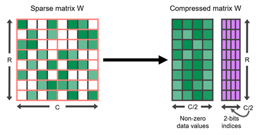
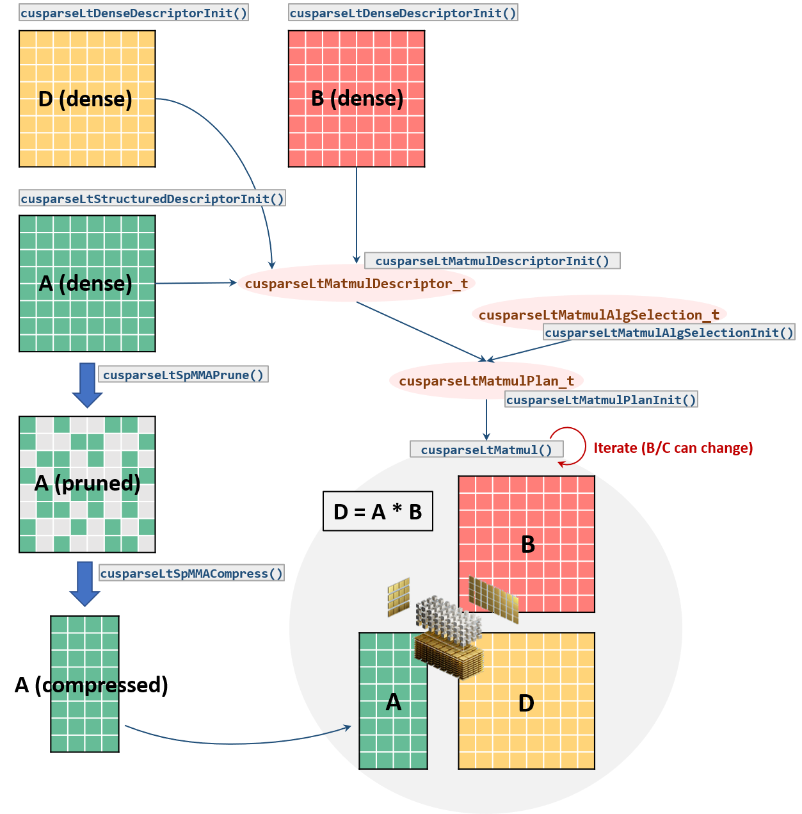

::: {.callout-tip}
## This post is part of the following series:
* [**GPU MODE Lecture Notes**](/series/notes/cuda-mode-notes.html): My notes from the **GPU MODE** reading group lectures run by **Andreas Kopf** and **Mark Saroufim**.
:::


* [Introduction](#introduction)  
* [The Performance Challenge of Sparsity](#the-performance-challenge-of-sparsity)  
* [Unstructured Sparsity and Its Limitations on GPUs](#unstructured-sparsity-and-its-limitations-on-gpus)  
* [Semi-structured Sparsity (2:4 Sparsity)](#semi-structured-sparsity-24-sparsity)  
* [Block Sparsity](#block-sparsity)  
* [Composing Sparsity with Quantization](#composing-sparsity-with-quantization)  
* [Sparse Training](#sparse-training)  
* [Future Directions and Research Areas](#future-directions-and-research-areas)  
* [Conclusion](#conclusion)


::: {.callout-tip title="Resource Links:"}

* **YouTube Recording:** [Lecture 11: Sparsity](https://www.youtube.com/watch?v=mGDnOLcfE8g)
* **Slides:** [GPU Sparsity](https://github.com/cuda-mode/lectures/blob/main/lecture_011/sparsity.pptx)

:::


## Introduction

* **Speaker:** Jesse Cai

### Sparsity and Pruning: Core Concepts

- **Sparsity** in neural networks refers to the presence of a significant number of zero-valued weights.
- **Pruning** is the process of intentionally removing these zero-valued or insignificant weights from the network.

- The goal is to reduce computational cost and memory footprint without significantly impacting model accuracy.
- This is achieved in two steps:
  1. **Zeroing out weights:** Identify and set insignificant weights to zero.
  2. **Accelerating computation:**  Develop methods to efficiently perform calculations with zero-valued weights (e.g., skipping multiplication by zero).

### Historical Context and Renewed Interest

- The concept of pruning dates back to the ["Optimal Brain Damage" paper](https://proceedings.neurips.cc/paper_files/paper/1989/file/6c9882bbac1c7093bd25041881277658-Paper.pdf) from 1989.
- Renewed interest emerged with the rise of deep learning and large models like AlexNet in 2012.
- The increasing size of modern models, especially in the context of LLMs and Gen AI, has further intensified the need for sparsity and pruning techniques.


## The Performance Challenge of Sparsity

### Multiplying by Zero: The Ideal vs. Reality

- The fundamental principle of sparsity relies on the fact that multiplying by zero is inherently faster than multiplying by non-zero values.
- However, **simply having zero-valued weights doesn't guarantee speedups**. The way computation is performed is crucial.
- **Naive approaches:**  If multiplication by zero is treated the same as multiplication by any other number (e.g., performing the full multiplication steps), no significant performance gain is achieved.

### Sparsity Patterns and the GPU Trade-off

- **The challenge:** Achieving optimal performance with sparse models on GPUs requires balancing two competing factors:
  - **Flexibility:**  Allowing for a wide range of sparsity patterns to minimize the impact on accuracy.
  - **Efficient Computation:** Ensuring that the chosen sparsity pattern can be efficiently processed on the parallel architecture of GPUs.

- **Types of Sparsity:**
  - **Unstructured Sparsity:** No constraints on the location of zero-valued weights. Offers high flexibility but can be challenging to accelerate on GPUs.
  - **Structured Sparsity:**  Zeros are arranged in specific patterns (e.g., entire rows, columns, or filters). Easier to accelerate but may significantly impact accuracy.
  - **Semi-structured Sparsity (2:4 Sparsity):** An intermediate approach where two out of every four elements are zero. Offers a balance between flexibility and performance. Well-supported on GPUs.
  - **Block Sparsity:** Zeros are grouped into blocks (e.g., 32x32). Provides good performance but requires more complex algorithms for accuracy recovery.
    - **PyTorch:** [torchao/sparsity/prototype/superblock](https://github.com/pytorch/ao/tree/main/torchao/sparsity/prototype/superblock)
    - **Paper:** [DRESS: Dynamic REal-time Sparse Subnets](https://arxiv.org/abs/2207.00670)


## Unstructured Sparsity and Its Limitations on GPUs

### Sparse Representations and Kernels

- To make unstructured sparsity efficient, data is stored in **sparse representations** (e.g., coordinate format).
  - **Documentation:** [torch.sparse](https://pytorch.org/docs/stable/sparse.html)

- **Coordinate Format Example:**
  - **Dense Matrix:** Stored contiguously in memory.
  - **Sparse Matrix (Coordinate Format):** Only non-zero elements are stored along with their indices. This reduces memory footprint when the matrix is sufficiently sparse.
- **Sparse kernels** are used to perform computations directly on these sparse representations, skipping multiplications by zero.

### Challenges on GPUs

- **High Sparsity Requirement:**  CPU sparsity is generally only faster at extremely high sparsity levels (greater than 99%).
- **GPU Limitations:** Dense matrix multiplication is significantly faster on GPUs due to their parallel nature. 
  - This makes it even harder for unstructured sparsity to achieve speedups on GPUs, as the parallelization benefits are lost with highly irregular sparsity patterns.

- **Need for Structure:** To achieve performance gains on GPUs, some form of structure in the sparsity pattern is necessary to enable efficient parallelization.


## Semi-structured Sparsity (2:4 Sparsity)

### Characteristics

- **Fixed Sparsity Level:** 50% of the elements are zero.

- **Pattern:** Two out of every four elements within a block are zero.

  

- **Accuracy Recovery:** NVIDIA research suggests that accuracy can be effectively recovered with a simple "prune once, retrain" approach.

### Implementation in PyTorch

- **Integration:** Semi-structured sparsity is supported in PyTorch.

  - **Documentation:** [torch.sparse](https://pytorch.org/docs/stable/sparse.html)

- **Backends:**

  - **[CUTLASS](https://github.com/NVIDIA/CUTLASS):** NVIDIA's CUDA Templates library provides native instructions for 2:4 sparse operations.

  - **[cuSPARSELt](https://docs.nvidia.com/cuda/cusparselt/):** NVIDIA's library specifically designed for sparse linear algebra operations. Offers additional features and potential performance improvements.

    

- **Performance:**

  - **Theoretical Maximum Speedup:** 2x due to halving the number of non-zero elements.
  - **Practical Average Speedup:** Around 1.6x due to overheads like loading metadata (bitmask) and matrix shape dependencies.

### Example Usage in PyTorch

```python
import torch
from torch.sparse import to_sparse_semi_structured, SparseSemiStructuredTensor

# Sparsity helper functions
def apply_fake_sparsity(model):
    """
    This function simulates 2:4 sparsity on all linear layers in a model.
    It uses the torch.ao.pruning flow.
    """
    # torch.ao.pruning flow
    from torch.ao.pruning import WeightNormSparsifier
    sparse_config = []
    for name, mod in model.named_modules():
        if isinstance(mod, torch.nn.Linear):
            sparse_config.append({"tensor_fqn": f"{name}.weight"})

    sparsifier = WeightNormSparsifier(sparsity_level=1.0,
                                      sparse_block_shape=(1,4),
                                      zeros_per_block=2)
    sparsifier.prepare(model, sparse_config)
    sparsifier.step()

    sparsifier.step()
    sparsifier.squash_mask()


def apply_sparse(model):
    apply_fake_sparsity(model)
    for name, mod in model.named_modules():
        if isinstance(mod, torch.nn.Linear):
            mod.weight = torch.nn.Parameter(to_sparse_semi_structured(mod.weight))
```

### Limitations and Workarounds

- **First Matrix Sparsity Only:** Current implementations only support sparsity in the first matrix of a matrix multiplication, not the second.
- **Impact on PyTorch Linear Layers:** PyTorch linear layers are defined as XW<sup>T</sup>, requiring a transpose operation when using semi-structured sparsity.
- **Transpose Overhead:** The transpose can introduce performance overhead due to data copying.
- **Torch.compile Mitigation:**  Torch.compile can fuse the transpose with subsequent operations (e.g., ReLU) to reduce overhead. 
- **Current Fusion Limitations:** Torch.compile cannot currently fuse operations directly into the sparse matrix multiplication kernel (cuSPARSELt). This limits potential performance gains.


## Block Sparsity

* **PyTorch:** [torchao/sparsity/prototype/superblock](https://github.com/pytorch/ao/tree/main/torchao/sparsity/prototype/superblock)

### Characteristics

- **Variable Sparsity Level:**  The sparsity level can be adjusted (e.g., 90%).
- **Pattern:** Zeros are grouped into blocks of a fixed size (e.g., 32x32).
- **Accuracy Recovery:**  More complex algorithms are typically needed for accuracy recovery compared to 2:4 sparsity. Research in this area is ongoing.

### Advantages for Vision Transformers

- **Potential for Higher Speedups:** Block sparsity can achieve speedups beyond 2x, especially at high sparsity levels.
- **Example (Vision Transformers):**
  - 90% sparsity can lead to speedups of up to 3.4x.
  - 1.4x speedup achieved on ImageNet with minimal accuracy loss (2 percentage points).

### Challenges

- **Accuracy Recovery:** Finding effective methods to recover accuracy after block sparsity pruning remains an active research area. 
- **Limited Research:** Compared to 2:4 sparsity, block sparsity on GPUs has received less attention, and optimal solutions are still being explored.


## Composing Sparsity with Quantization

* **GitHub Repository:** [torchao](https://github.com/pytorch/ao)

### Challenges and Fusion Issues

- **Combining sparsity and quantization can lead to performance bottlenecks** due to limitations in operator fusion.
- **Fusion Breakdown:** 
  - **Ideal Scenario:**  A fully fused kernel would handle sparsity, quantization, matrix multiplication, and dequantization in a single operation.
  - **Current Limitations:**  Existing implementations (especially with cuSPARSELt) often result in multiple separate kernels, introducing overhead.
- **Example:**
  - Baseline (BF16): 1600ms
  - Sparsity: 1400ms
  - Quantization: 1400ms
  - Sparsity + Quantization (without optimal fusion): Marginal speedup (1420ms)
  - Sparsity + Quantization (with partial fusion using cuSPARSELt alpha vectors): 1278ms (significant improvement)

### Potential Solutions

- **Fused Kernels:** Developing custom fused kernels that handle sparsity and quantization together can significantly improve performance.
- **CUTLASS vs. cuSPARSELt:** CUTLASS offers more flexibility for creating custom fused kernels compared to the black-box nature of cuSPARSELt.
- **Transpose Fusion:** Integrating the transpose operation (needed for PyTorch linear layers) directly into the sparse kernel can further enhance performance.

### Accuracy Considerations

- **Accuracy Impact:** Combining sparsity and quantization can lead to accuracy degradation.
- **Research is ongoing** to find the optimal balance between sparsity, quantization levels, and accuracy.
- **Sparse GPT:**  One example of research in this area, exploring one-shot calibration methods to recover accuracy without retraining, which is particularly challenging for large LLMs due to memory constraints.


## Sparse Training

### Accelerating the Training Process

- Sparsity can also be applied during training to speed up the process.
- **Fast Sparsification:** Efficient algorithms (e.g., based on weight magnitude without sorting or branching) are used to quickly sparsify the weights or activations before each matrix multiplication.
- **Performance Gains:**  The time taken for sparsification and sparse matrix multiplication can be less than the time for a dense matrix multiplication, leading to overall training speedups.

### Example: xFormers and ImageNet

- **Collaboration with [xFormers](https://github.com/facebookresearch/xformers):**  PyTorch has been working with the xFormers team to develop fast sparsification kernels.
- **Results:** 
  - 10-20% speedup in end-to-end ImageNet training with minimal accuracy loss (81.6% to 80.5%).
- **Key Observations:**
  - **Activation Sparsity:** Applying sparsity to activations (after ReLU) often leads to better results than weight sparsity, as activations tend to be more naturally sparse.
  - **Matrix Shape Considerations:** The effectiveness of sparsity can depend on the shapes of the matrices involved.

### Differences Between Inference and Training

- **Transpose Handling:** 
  - **Inference:** Only one representation (either W or W<sup>T</sup>) is needed.
  - **Training:** Both W and W<sup>T</sup> are required for the forward and backward passes. This can lead to a slight memory penalty when using sparse representations during training.
- **Fused Transpose Requirement:** 
  - **Training:**  Fused transpose operations are crucial for performance. Currently, this functionality is only available in cuSPARSELt, making it essential for sparse training.
  - **Inference:** Fused transpose is less critical as it can be handled by Torch.compile.


## Future Directions and Research Areas

### Combining Sparsity Patterns

- **Exploring combinations of different sparsity patterns** (e.g., 2:4 sparsity within blocks) could lead to further performance improvements.
- **Challenges:** This requires developing efficient algorithms and kernels that can handle these more complex patterns.

### Flexible Sparsity with Shuffling

- **Introducing shuffles into blockwise sparsity** can increase flexibility while maintaining performance benefits.
- **Shuffle Overhead:** The shuffle operation itself can introduce overhead.
- **Torch.compile Mitigation:**  Torch.compile can be used to fuse the shuffle with other operations, minimizing its impact.

### Sparsity for Dropout

- **2:4 sparsity could potentially be used to implement dropout** due to its inherent randomness and 50% sparsity level.
- **Benefits:**  Achieving dropout-like regularization with the performance advantages of 2:4 sparsity.

### CUDA-Specific Considerations

- **Bridging the CUTLASS and cuSPARSELt Gap:**  Developing CUTLASS kernels with comparable functionality and performance to cuSPARSELt would offer greater flexibility and control over fusion and kernel optimization.
- **Larger Fused Kernels:** Exploring larger fused kernels that incorporate more operations (e.g., quantization, dequantization, transpose) within the sparse matrix multiplication can further enhance performance.
- **Flexible Sparsity Patterns in CUTLASS:** Implementing efficient shuffles or other techniques to enable more flexible sparsity patterns within CUTLASS kernels.
- **Load as Sparse Kernels:**  For memory-bound workloads (e.g., LLMs), loading data in a sparse format and expanding to dense within the GPU could offer speedups by reducing memory transfer time.

### Hardware Support for Sparsity

- **Specialized hardware architectures** could be designed to directly support sparse representations and operations, potentially leading to significant performance improvements.
- **NVIDIA's Tensor Cores:**  Semi-structured sparsity support in Tensor Cores suggests that hardware vendors are exploring such directions.


## Conclusion

- **Sparsity and pruning are promising techniques** for improving the efficiency of large neural networks, especially in the context of LLMs and Gen AI.
- **Accuracy remains a key challenge:**  Finding effective ways to recover accuracy after pruning is crucial for wider adoption.
- **Performance gains are demonstrable:**  Especially with semi-structured and block sparsity on GPUs, significant speedups can be achieved.
- **Ongoing research and development:**  The field is actively evolving, with new sparsity patterns, algorithms, and hardware support being explored.
- **Potential for breakthroughs:**  As the research progresses and new tools become available, sparsity is likely to play an increasingly important role in making large models more practical and accessible.



