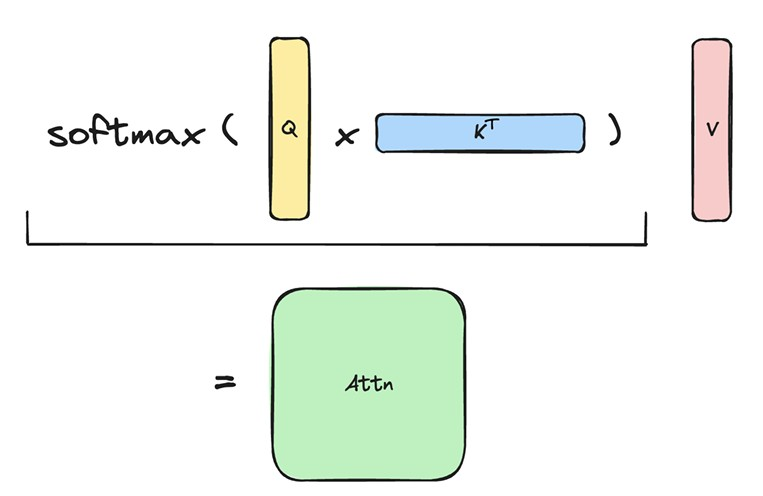
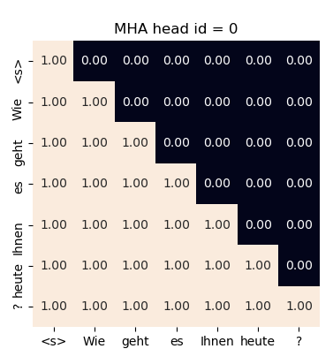
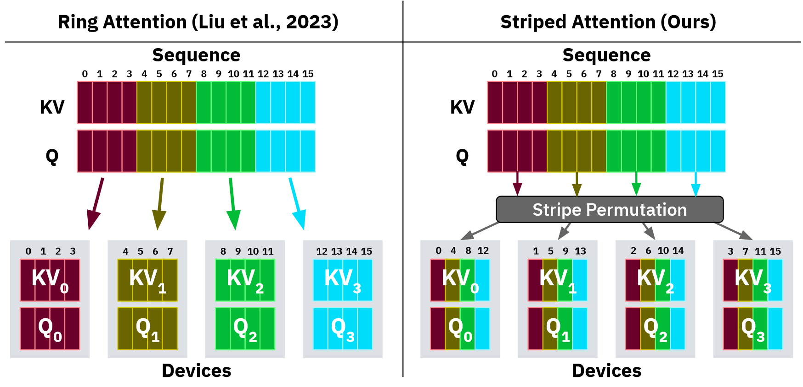

::: {.callout-tip}
## This post is part of the following series:
* [**GPU MODE Lecture Notes**](/series/notes/cuda-mode-notes.html): My notes from the **GPU MODE** reading group lectures run by **Andreas Kopf** and **Mark Saroufim**.
:::


* [Introduction and Overview](#introduction-and-overview)
* [Motivation: Long Context Transformers and Applications](#motivation-long-context-transformers-and-applications)
* [Background: Multimodal Input and Transformers](#background-multimodal-input-and-transformers)
* [Challenge: Memory Limitations](#challenge-memory-limitations)
* [Vanilla Attention Recap](#vanilla-attention-recap)
* [Compute Scaling with Context Length](#compute-scaling-with-context-length)
* [Online Softmax and LogSumExp Trick](#online-softmax-and-logsumexp-trick)
* [Ring Attention Details](#ring-attention-details)
* [Causal Masking and Stripe Attention](#causal-masking-and-stripe-attention)
* [Flash Decoding](#flash-decoding)
* [History and Resources](#history-and-resources)
* [Q&A](#qa)


::: {.callout-tip title="Resource Links:"}

* **YouTube Recording:** [Lecture 13: Ring Attention](https://www.youtube.com/watch?v=ws7angQYIxI)
* **Slides:** [Ring Attention - Sequence Parallel Attention Across Devices](https://docs.google.com/presentation/d/180lS8XbeR1_bTMaldg21LKYQkjXftHuh9VnZ3xk27qQ/edit#slide=id.p)
* **Code:** 
  * [lecture_013/howto_log_sum_exp.ipynb](https://github.com/gpu-mode/lectures/blob/main/lecture_013/howto_log_sum_exp.ipynb)
  * [gpu-mode/ring-attention](https://github.com/gpu-mode/ring-attention)


:::


## Introduction and Overview

- **Speaker**: Andreas Kopf, co-founder of the CUDA/GPU Mode Discord server, AI engineer at [Aleph Alpha](https://aleph-alpha.com/).
- **Lecture Date:** April 6, 2024
- **Topic**: Ring Attention, a method for sequence parallel attention across multiple devices.
- **Focus**: High-level orchestration of multiple GPUs, rather than individual GPU utilization.


## Motivation: Long Context Transformers and Applications

- **Long Context LLMs**:  Models like Gemini (1 million token context, up to 10 million in research) enable processing of extremely long inputs.
- **Comparison of Models**:
  - **[Gemini 1.5 Pro](https://deepmind.google/technologies/gemini/pro/)**: ~1 million tokens (now 2 million tokens)
  - **[Large World Model (LWM)](https://github.com/LargeWorldModel/LWM)**: ~1 million tokens
  - **[Yarn-Mistral](https://huggingface.co/NousResearch/Yarn-Mistral-7b-128k)**: 128k tokens
  - **[GPT-4 Turbo](https://platform.openai.com/docs/models/gpt-4-and-gpt-4-turbo)/[DBRX](https://www.databricks.com/blog/introducing-dbrx-new-state-art-open-llm)**: 128k tokens
  - **[MPT](https://huggingface.co/mosaicml/mpt-7b) ([Alibi Linear Bias Attention](https://arxiv.org/abs/2108.12409))**: 65k tokens
  - **[xAI GROK-1](https://huggingface.co/xai-org/grok-1)**: 8k tokens
- **New Capabilities**:
  - Processing books, long documents, web content, chat histories, complete code bases, high-resolution images, audio recordings, and videos.
  - Videos and text descriptions provide complementary information for world modeling.
  - Improved future prediction and world simulation.
- **Example ([LWM](https://largeworldmodel.github.io/lwm/))**:  Video Question Answering on a one-hour video with multiple embedded videos. LWM correctly answered a question about the number of lemons in a person's car, referencing a specific frame. 
  - This example demonstrates improved capabilities, though acknowledged to be somewhat cherry-picked.

- **Open Question (Unanswered)**: How Claude, Gemini, and GPT-4 support long context lengths remains undisclosed. 
  - Andreas suggests it may not be ring attention due to high inference costs, especially for extremely long sequences like 10 million tokens.


## Background: Multimodal Input and Transformers

- **Transformer Architecture**: Multi-headed attention and feedforward network in multiple layers.
- **Multimodal Input Encoding**:
  - **Vision Transformers**: Direct linear projection of images into token dimensions.
  - **LLaVA**: Vision encoder converts images into tokens, combined with language queries and autoregressive answer generation.
  - **LWM**: VQGAN encodes 256x256 images into 144 tokens, allowing for video processing and next-text token prediction.
- **Multimodal Applications**: Text, image, and video as individual or combined inputs and outputs, including text-to-image, text-to-video, image-to-text, video-to-text, and image-text combinations.
  - **[Classifier-Free Guidance](https://huggingface.co/papers/2207.12598)**:  Used in LWM to steer autoregressive generation and produce images as output.


## Challenge: Memory Limitations

- **Memory Requirements**:  A 100 million token sequence with a hidden size of 1024 requires over 1000 gigabytes of memory, even with a batch size of one.  This highlights the need to store inputs, outputs, and gradients, even with online computation of the score matrix and softmax.
- **High-End GPU Memory**:
  - [NVIDIA H200](https://www.nvidia.com/en-us/data-center/h200/): 141 GB
  - [AMD MI300X](https://www.amd.com/en/products/accelerators/instinct/mi300.html): 192 GB
  - [NVIDIA GB200](https://www.nvidia.com/en-us/data-center/gb200-nvl2/):  288 GB up to 960GB
- **Alternative Approaches**: 
  * Approximation: (e.g., Sparse, LoRA)
  * RAG/Vector-DBs (Approximate Nearest Neighbor Search, Locality Sensitive Hashing)
  * Brute-force compute (tiling, blockwise)
- **Ring Attention Approach**: Brute-force computation of all attention scores, but with memory optimizations to avoid quadratic memory scaling.


## Vanilla Attention Recap

- **Process**: Two matrix multiplications: (1) Query x Transposed Keys = Attention Scores; (2) Softmax(Attention Scores) x Values = Output.

  

- **Parallel Computation Potential**: Each query's output can be computed independently, though typically done in batches for efficiency.  Individual query processing is a potential memory optimization, though quadratic attention scaling remains a problem.


## Compute Scaling with Context Length

- **Formula for FLOPs** (from the [Ring Attention paper](https://arxiv.org/abs/2310.01889) appendix):
  $$
  24 \cdot \text{sequence\_length} \cdot \text{hidden\_size}^2 + 4 \cdot \text{sequence\_length}^2 \cdot \text{hidden\_size}
  $$

- **Surprising Result**: Increasing context length has a less dramatic impact on compute than expected, especially for larger models. 

  : Figure 5](./images/ring-attention-figure-5.png)

  - **Example:** Training a 65B parameter model with 256k context length (64x increase) requires only 5.8x the compute compared to 4k context length.  
    - This is partly due to requiring fewer batches.  
    - However, quadratic scaling still dominates at extremely long context lengths (e.g., 100 million tokens).


## Online Softmax and LogSumExp Trick

- **Softmax Formula**:  
  $$
  s(x_i) = \frac{e^{x_i}}{\sum_{j=1}^n e^{x_j}}
  $$

- **Challenge**:  The denominator requires the sum of all exponentiated elements, hindering blockwise computation.

- **Naive Softmax Implementation (Python)**:

  ```python
  import torch
  
  def naive_softmax(x: torch.Tensor) -> torch.Tensor:
      return x.exp() / x.exp().sum()
  ```

  ```python
  x = torch.randn(10)  # generate normally distributed random numbers
  a = torch.softmax(x, dim=-1) # reference output
  b = naive_softmax(x) # our naive version
  
  print("a", a)
  print("b", b)
  print("allclose", torch.allclose(a, b, atol=1e-6))
  ```

  ```text
  a tensor([0.1022, 0.1295, 0.0292, 0.0882, 0.0455, 0.1041, 0.1491, 0.1286, 0.1785,
          0.0451])
  b tensor([0.1022, 0.1295, 0.0292, 0.0882, 0.0455, 0.1041, 0.1491, 0.1286, 0.1785,
          0.0451])
  allclose True
  ```

- **Instability of Naive Softmax**: Scaling input by large values leads to NaN values.

  ```python
  naive_softmax(x * 100)
  ```

  ```text
  tensor([0., 0., 0., 0., 0., nan, nan, 0., 0., 0.])
  ```

- **Blockwise Computation Goal**: Compute softmax on chunks (blocks) of the input and combine the results to match the full softmax output.

  ```python
  x = torch.randn(10)
  
  x1,x2 = torch.chunk(x, 2)
  s1 = naive_softmax(x1)
  s2 = naive_softmax(x2)
  
  print("We have:")
  print(f"s1 = {s1}")
  print(f"s2 = {s2}")
  
  target = naive_softmax(x)
  print("We want:")
  print(f"target = {target}")
  ```

  ```python
  We have:
  s1 = tensor([0.1187, 0.0524, 0.4145, 0.0082, 0.4062])
  s2 = tensor([0.2311, 0.2720, 0.2980, 0.0114, 0.1874])
  We want:
  target = tensor([0.0879, 0.0388, 0.3070, 0.0061, 0.3008, 0.0600, 0.0706, 0.0773, 0.0030, 0.0486])
  ```

- **Correction Factor**:  Multiplying intermediate softmax outputs by the full sum of exponentiated values (sum_exp) allows reconstruction of the target softmax.

  ```python
  sum_exp_x1 = x1.exp().sum()
  sum_exp_x2 = x2.exp().sum()
  s1_corrected = s1 * sum_exp_x1 / (sum_exp_x1 + sum_exp_x2)
  s2_corrected = s2 * sum_exp_x2 / (sum_exp_x1 + sum_exp_x2)
  
  print("After correction with help of sum_exp values:")
  s_combined = torch.cat([s1_corrected, s2_corrected])
  print("s_combined", s_combined)
  
  print("allclose(s_combined, target):", torch.allclose(s_combined, target))
  ```

  ```text
  After correction with help of sum_exp values:
  s_combined tensor([0.0879, 0.0388, 0.3070, 0.0061, 0.3008, 0.0600, 0.0706, 0.0773, 0.0030, 0.0486])
  allclose(s_combined, target): True
  ```

- **Stable Softmax Implementation (Python)**:

  ```python
  def stable_softmax2(x):
      """returns softmax result and log sum exp"""
      m = x.max()
      a = (x - m).exp()
      b = a.sum()
      lse = m + torch.log(b)
      return a / b, lse
  ```

  - **Shift Invariance**: Softmax is invariant to adding or subtracting a constant value.
  - **Stabilization Technique**: Subtract the maximum input value from all inputs, ensuring all values are <= 0 before exponentiation.
  - **Returning Log Sum Exp**: Return the logarithm of the sum of exponentiated values, corrected for the subtracted maximum, for numerical stability.

  ```python
  x = torch.randn(20)
  
  a = torch.softmax(x, dim=-1)
  
  x1, x2 = x.chunk(2)
  
  b1, lse1 = stable_softmax2(x1)
  b2, lse2 = stable_softmax2(x2)
  
  c1 = b1 * torch.exp(lse1) / (torch.exp(lse1) + torch.exp(lse2))
  c2 = b2 * torch.exp(lse2) / (torch.exp(lse1) + torch.exp(lse2))
  
  print(a)
  print(torch.cat([c1, c2]), torch.allclose(a, torch.cat([c1, c2])))
  ```

  ```text
  tensor([0.0282, 0.0414, 0.1438, 0.0472, 0.0405, 0.0106, 0.1492, 0.0036, 0.0155,
          0.0238, 0.1013, 0.0547, 0.0169, 0.0209, 0.0151, 0.0770, 0.0067, 0.0551,
          0.0449, 0.1035])
  tensor([0.0282, 0.0414, 0.1438, 0.0472, 0.0405, 0.0106, 0.1492, 0.0036, 0.0155,
          0.0238, 0.1013, 0.0547, 0.0169, 0.0209, 0.0151, 0.0770, 0.0067, 0.0551,
          0.0449, 0.1035]) True
  ```

- **Combining Blocks in Log Space**:  Using the formula `1 / (1 + B/A)` (equivalent to `A / (A + B)`), blocks can be combined in log space, avoiding exponentiation and improving numerical stability. 

  ```python
  d1 = b1 / (1 + torch.exp(lse2 - lse1))
  d2 = b2 / (1 + torch.exp(lse1 - lse2))
  print(a)
  print(torch.cat([d1, d2]))
  print("allclose: ", torch.allclose(a, torch.cat([d1, d2])))
  ```

  ```text
  tensor([0.0282, 0.0414, 0.1438, 0.0472, 0.0405, 0.0106, 0.1492, 0.0036, 0.0155,
          0.0238, 0.1013, 0.0547, 0.0169, 0.0209, 0.0151, 0.0770, 0.0067, 0.0551,
          0.0449, 0.1035])
  tensor([0.0282, 0.0414, 0.1438, 0.0472, 0.0405, 0.0106, 0.1492, 0.0036, 0.0155,
          0.0238, 0.1013, 0.0547, 0.0169, 0.0209, 0.0151, 0.0770, 0.0067, 0.0551,
          0.0449, 0.1035])
  allclose:  True
  ```

  - This formula is used directly in the [ring attention code](https://github.com/zhuzilin/ring-flash-attention/blob/55ff66fd35f329dfcc24ce7a448bfdd532865966/ring_flash_attn/utils.py#L10-L24).

    ```python
    def _update_out_and_lse(
        out: torch.Tensor,
        lse: torch.Tensor,
        block_out: torch.Tensor,
        block_lse: torch.Tensor,
    ) -> Tuple[torch.Tensor, torch.Tensor]:
        block_out = block_out.to(torch.float32)
        block_lse = block_lse.transpose(-2, -1).unsqueeze(dim=-1)
    
        new_lse = lse + torch.log(1 + torch.exp(block_lse - lse))
        out = torch.exp(lse - new_lse) * out + torch.exp(block_lse - new_lse) * block_out
    
        lse = new_lse
        return out, lse
    ```

- **Application to Value Projections**:  The same log-sum-exp trick can be applied to value projections and accumulated value projections, enabling efficient blockwise computation in flash and ring attention.

- **Visualization**: Animation illustrates the blockwise computation process. ([Source](https://x.com/fvsmassa/status/1580229170629849089)) 

  

  - Queries are processed against blocks of keys, intermediate outputs are generated, and these outputs are combined using the log-sum-exp trick to produce the final output.


## Ring Attention Details

- **Paper:** [Ring Attention with Blockwise Transformers for Near-Infinite Context](https://arxiv.org/abs/2310.01889)

- **Open-source implementation:** [zhuzilin/ring-flash-attention](https://github.com/zhuzilin/ring-flash-attention/tree/main)

- **Sequence Parallelism**: Distributing the input sequence across multiple devices, with each device processing a portion of the sequence.

  : Figure 1](./images/sequence-parallelism-figure-1.png)

  - **Paper:** [Sequence Parallelism: Long Sequence Training from System Perspective](https://arxiv.org/abs/2105.13120)
  - **Other Parallelism Forms**: Data parallelism, tensor parallelism, pipeline parallelism.

- **Ring Attention Concept**: Blockwise computation across multiple devices, similar to flash attention but at a higher level.

  

- **Process**:

  1. **Data Distribution**: Queries, keys, and values are split across N devices (forming a ring).
  2. **Key-Value Exchange**:  Keys and values are circulated around the ring, with each device receiving blocks from its predecessor and sending blocks to its successor.
  3. **Computation**: Each device performs attention (e.g., flash attention) on its local queries and the received key-value blocks.
  4. **Iteration**:  This process repeats N-1 times, ensuring each device sees all key-value blocks.
  5. **Output Combination**:  Each device computes the output for its local queries, and these outputs are then combined (method not fully detailed in this section).

- **Benefit**:  Allows scaling memory by the number of GPUs, with communication overhead amortized for sufficiently long sequences. 

  - The paper suggests a sequence length of approximately 6000 for effective amortization, though this depends on transfer speed.

- **Pseudocode:**

  **Required**: Input sequence $x$. Number of hosts $N_h$.

  1. **Initialize**
  2. Split input sequence into $N_h$ blocks such that each host has one input block.
  3. Compute query, key, and value for its input block on each host.
  4. **For each transformer layer** do:
      1. **For $\text{count} = 1$ to $N_h - 1$** do:
          1. **For each host concurrently**, do:
              - Compute memory efficient attention incrementally using local query, key, value blocks.
              - Send key and value blocks to next host and receive key and value blocks from previous host.
          2. **End for**
      2. **End for**
      3. **For each host concurrently**, do:
          1. Compute memory efficient feedforward using local attention output.
      4. **End for**
  5. **End for**


## Causal Masking and Stripe Attention

- **Causal Masking**:  

  

  - Prevents tokens from attending to future tokens during autoregressive decoding. 
  - Achieved by setting attention scores for future tokens to minus infinity before softmax.

- **Causal Masking in Ring Attention**:  

  

  

  - Naive implementation leads to idle nodes, as some devices finish computation early due to masking, while others are still working.  
  - The slowest node determines the overall speed.

- **Stripe Attention Solution**: Reorders queries, keys, and values to distribute work more evenly, minimizing idle time.

  

  

- **Permutation Pattern**:  Andreas describes a specific pattern that assigns specific token indices to each device.

- **Post-Processing**:  Requires undoing the permutation to reconstruct the original output sequence.

- **Benefits of Stripe Attention**:  Even distribution of work and data, allowing more efficient use of all devices.  By dropping the first query and last key, standard causal masking and flash attention can be used within the stripe attention framework.


## Flash Decoding

- **Webpage:** [Flash-Decoding for long-context inference](https://crfm.stanford.edu/2023/10/12/flashdecoding.html)

- **Motivation**:  Flash attention and ring attention are not optimized for token-by-token inference in long contexts, as they are designed for larger query sets.

  ](./images/flash-decoding-slide-28.gif)

- **Flash Decoding Approach**: Sends queries to all devices, computes blockwise attention and value projections locally, and then uses a reduction step to combine the results.

  ](./images/flash-decoding-slide-29.gif)

  - Developed by Tri Dao, Daniel Haziza, Francisco Massa, and Grigory Sizov.

- **Benefits**: Leverages compute of all devices, potentially achieving up to N times speedup with N devices.

- **Open Questions**:

  - Performance impact of the reduction step.
  - How keys and values are reorganized during token-by-token generation.

- **Implementation**: Andreas hasn't found a production-ready implementation (might be in [xformers](https://github.com/facebookresearch/xformers)).


## History and Resources

- **Paper History**:
  - **Flash Attention**: Foundation for memory-efficient attention.
    - May 2022, Tri Dao et al: [FlashAttention: Fast and Memory-Efficient Exact Attention with IO-Awareness](https://arxiv.org/abs/2205.14135)
  - **Blockwise Parallel Transformer**: Early work leading to ring attention.
    - Aug 2023 Hao Liu et al: [Blockwise Parallel Transformer for Large Context Models](https://arxiv.org/abs/2305.19370)
  - **Ring Attention with Blockwise Transformers**: Refinement of the initial concept.
    - Nov 2023, Hao Liu et al: [Ring Attention with Blockwise Transformers for Near-Infinite Context](https://arxiv.org/abs/2310.01889)
  - **Stripe Attention**: Addressing causal masking challenges in ring attention.
    - Nov 2023, Brandon et al: [Striped Attention: Faster Ring Attention for Causal Transformers](https://arxiv.org/abs/2311.09431)
  - **Large World Models on Medium Length Video Language**: Combining ring attention and stripe attention for long context video processing.
    - Feb 2024, Hao Liu et al: [World Models on Million-Length Video and Language With RingAttention](https://arxiv.org/abs/2402.08268)
- **Code Repositories**:
  - **[Zilin Zhu](https://github.com/zhuzilin)'s Ring Flash Attention**: [zhuzilin/ring-flash-attention](https://github.com/zhuzilin/ring-flash-attention)
  - **GPU Mode Implementation**: [gpu-mode/ring-attention](https://github.com/gpu-mode/ring-attention)
- **Other Resources**:  [Andreas' "LogSumExp" IPython notebook](https://github.com/gpu-mode/lectures/blob/main/lecture_013/howto_log_sum_exp.ipynb)


## Q&A

- **Flash Decoding vs. Speculative Decoding**:
  - **Flash Decoding**: Optimizes inference for a single model.
  - **Speculative Decoding**: Uses a smaller "drafting" model to propose outputs, verified by a larger model.  Orthogonal techniques and can be used together.
- **Ring Attention on Consumer GPUs (PCIe)**: 
  - Feasible, even with consumer GPUs like the A5000 or RTX 3090, especially with NVLink. 
  - Allows doubling memory for a single sequence across two GPUs.  
  - However, consumer GPUs generally do not support peer-to-peer (P2P) communication over PCIe.
- **Shared Memory for Sequence Parallelism**: 
  - Not strictly required. 
  - Sequence parallelism operates at a higher level than shared memory within individual GPUs.
  - Shared memory benefits flash attention within each device, but sequence parallelism handles distribution across devices.
- **Gemini's Approach**: Unknown. Andreas suggests it may not be ring attention due to scaling challenges.
- **Ring Attention in Inference**: 
  - Primarily a training technique. 
  - The LWM paper describes an optimized inference version, but details are unclear.  
  - Flash decoding seems more suitable for token-by-token inference.
- **Batch Size One Inference (Memory Bound)**:  
  - Batch size one leads to matrix-vector multiplications, which are memory bandwidth bound.
  - Production deployments often use larger batch sizes to improve throughput and efficiency. 
  - Batch size one is common in local or resource-constrained deployments, but it's not optimal.
  - The "two stages" of inference (prompt processing and token-by-token generation) have different memory and compute characteristics.
- **Flash Decoding as MapReduce**:  Analogy holds, with queries duplicated (mapped) to all devices and results combined (reduced).
- **Why LLMs Are Memory Bound in Inference**:  Token-by-token generation requires accessing previous token outputs (key-value cache), leading to memory bandwidth limitations.
- **On-Premise vs. Cloud Deployments**:  
  - Cloud deployments often have larger batch sizes due to higher throughput requirements.
  - On-premise deployments may face batch size one scenarios more frequently, impacting cost-effectiveness of high-end GPUs.
  - The business case and specific requirements (privacy, cost, latency) determine the optimal deployment strategy.



