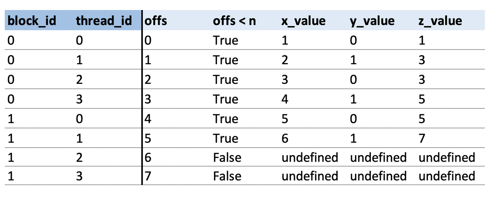
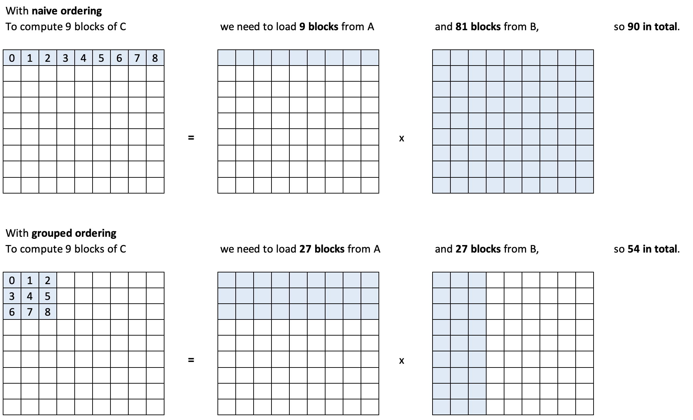
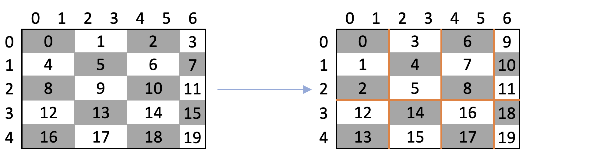
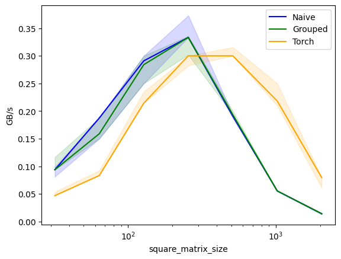
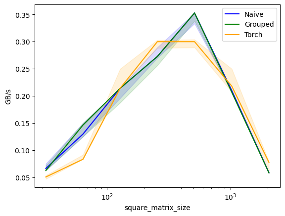

::: {.callout-tip}
## This post is part of the following series:
* [**GPU MODE Lecture Notes**](/series/notes/cuda-mode-notes.html): My notes from the **GPU MODE** reading group lectures run by **Andreas Kopf** and **Mark Saroufim**.
:::


* [Introduction](#introduction)
* [Overview of the Talk](#overview-of-the-talk)
* [Why and When to Use Triton](#why-and-when-to-use-triton)  
* [How to Write Triton Kernels](#how-to-write-triton-kernels)  
* [Practical Examples](#practical-examples)  
* [Benchmarking](#benchmarking)  
* [Auto-Tuning](#auto-tuning)  
* [Conclusion and Resources](#conclusion-and-resources)


::: {.callout-tip title="Resource Links:"}

* **YouTube Recording:** [Lecture 14: Practitioners Guide to Triton](https://www.youtube.com/watch?v=DdTsX6DQk24)
* **Code:** [gpu-mode/lectures/lecture_014](https://github.com/gpu-mode/lectures/tree/main/lecture_014)


:::


## Introduction

- **Speaker**: [Umer Adil](https://www.umerha.com/)
  - Former **management consultant** until October 2023.
  - Transitioned to **technical AI work** focusing on **open-source contributions**.
    - Contributed to projects like **[LangChain](https://www.langchain.com/)** and **[GPT Engineer](https://github.com/gpt-engineer-org/gpt-engineer)**.
    - Became a **maintainer** for GPT Engineer.
    - Currently contributing to **Hugging Face's [diffusers](https://github.com/huggingface/diffusers)**.
      - Implemented features like **ControlNetXS**, **LoRAs**, etc.
  - Contact:
    - **GitHub**: [UmerHA](https://github.com/UmerHA/)
    - **Twitter**: [@UmerHAdil](https://x.com/UmerHAdil)
  - **Support Umer**:
    - Independent open-source contributor.
    - **Ko-fi**: [https://ko-fi.com/umerha](https://ko-fi.com/umerha)


## Overview of the Talk

- **Title**: A Practitioner's Guide to Triton
- **Agenda**:
  - **Why and When to Use Triton**
  - **How to Write Triton Kernels**
    - **Programming Model**
  - **Practical Examples**:
    - Copying a Tensor
    - Grayscaling an Image
    - Fast Matrix-Matrix Multiplication Kernel
  - **Benchmarking and Auto-Tuning**
    - Performance Measurement
    - Kernel Optimization


## Why and When to Use Triton

### What is Triton?

- **Triton** is a language for programming **GPUs**.
  - More convenient than **CUDA**.
  - Allows writing **Python-like code** that compiles to **PTX** (Parallel Thread Execution).
    - PTX is the same intermediate representation used by CUDA.
- **Triton Compiler**:
  - **Optimizes code** by rearranging it for better performance without changing its meaning.
  - Targets the **same hardware** as CUDA.

### Comparing Triton to CUDA

- **CUDA**:
  - Like a **high-end camera**.
    - Offers **thousands of knobs** for fine-grained control.
    - Achieves the **absolute best performance**.
    - **Harder** to write and debug.
- **Triton**:
  - Like a **high-end smartphone camera**.
    - **Easier** to use with fewer controls.
    - Provides **very good performance** with less effort.
    - **Easier** to write and debug.

### `torch.compile()` vs. Triton

- **`torch.compile()`**:
  - Optimizes your **PyTorch code** but not the underlying **kernels**.
  - Changes your code to make the best use of existing GPU kernels.
  - Sometimes writes simple new kernels using **Triton**.
- **Triton**:
  - Allows writing **custom kernels** for performance-critical parts.
  - Offers more control over kernel behavior.

### When to Use Triton

- **Optimization Steps**:
  1. **Use `torch.compile()`**:
     - Start by using `torch.compile()` to optimize your code.
  2. **Adapt Your Code**:
     - Rewrite code to be more suitable for `torch.compile()`.
       - E.g., eliminate **graph breaks** to enable **CUDA graphs**.
  3. **Profile and Identify Bottlenecks**:
     - Find slow parts of your code using profiling tools.
     - Write **custom Triton kernels** for these parts.
  4. **Consider CUDA**:
     - If still not fast enough, write custom **CUDA kernels**.
- **Note**: For maximum performance from the start, you may choose **CUDA** directly.

### Rough Edges in Triton

- **New-ish Project**:
  - Contains **rough edges**; code may not behave as expected.
  - Expected to become more polished over time.
- **Recommendation**:
  - **Debugging** is important; use "simulator mode" when possible.
  - Be aware of limitations on older GPUs or with certain operations.


## How to Write Triton Kernels

### Debugging Triton Kernels

- **Simulator Mode**:

  - Set environment variable `TRITON_INTERPRET='1'`.
    - Enables debugging by running kernels on the **CPU**.

- **Advantages**:

  - **Debug** and **print** variables like in CPU programs.
  - Easier to **set breakpoints** and inspect program flow.

- **Utility Functions**:

  ```python
  import os
  
  os.environ['TRITON_INTERPRET'] = '1' # needs to be set *before* triton is imported
  
  import triton
  import triton.language as tl
  from IPython.core.debugger import set_trace
  
  def test_pid_conds(conds, pid_0=[0], pid_1=[0], pid_2=[0]):
      """
      Test if conditions on program IDs (PIDs) are fulfilled.
      
      Args:
          conds (str): String containing conditions to check. Multiple conditions are separated by commas.
                       Each condition consists of an operator and a number.
          pid_0 (list): First program ID value in a single-element list. Default: [0]
          pid_1 (list): Second program ID value in a single-element list. Default: [0]
          pid_2 (list): Third program ID value in a single-element list. Default: [0]
      
      Examples:
          '=0'     -> Checks if pid_0 equals 0
          ',>1'    -> Checks if pid_1 is greater than 1
          '>1,=0'  -> Checks if pid_0 > 1 AND pid_1 = 0
      
      Returns:
          bool: True if all conditions are met, False otherwise
      """
      # Extract PID values from lists
      pids = pid_0[0], pid_1[0], pid_2[0]
      
      # Remove spaces and split conditions by comma
      conds = conds.replace(' ','').split(',')
      
      # Check each condition against corresponding PID
      for i, (cond, pid) in enumerate(zip(conds, pids)):
          if cond == '': continue  # Skip empty conditions
          
          # Split condition into operator and threshold value
          op, threshold = cond[0], int(cond[1:])
          
          # Validate operator
          valid_ops = ['<', '>', '>=', '<=', '=', '!=']
          if op not in valid_ops:
              raise ValueError(f"Rules may only use these ops: {valid_ops}. Invalid rule: '{cond}'.")
          
          # Convert '=' to '==' for Python evaluation
          op = '==' if op == '=' else op
          
          # Evaluate condition
          if not eval(f'{pid} {op} {threshold}'): 
              return False
      
      return True
  ```

  - **`check_tensors_gpu_ready`**:

    ```python
    def check_tensors_gpu_ready(*tensors):
        """
        Verify that all input tensors are contiguous and on GPU.
        
        Args:
            *tensors: Variable number of PyTorch tensors to check
        
        Raises:
            AssertionError: If any tensor is not contiguous or not on GPU
        """
        for t in tensors:
            assert t.is_contiguous(), "A tensor is not contiguous"
            # Skip GPU check if in simulator mode
            if not os.environ.get('TRITON_INTERPRET') == '1':
                assert t.is_cuda, "A tensor is not on cuda"
    ```

    - Ensure data is ready for GPU execution.
      1. Assert all tensors are contiguous in memory
      2. Assert all tensors are on GPU, if not simulating

  - **`print_if`**:

    ```python
    def print_if(txt, conds, pid_0=[0], pid_1=[0], pid_2=[0]):
        """
        Print text if specified PID conditions are met.
        Useful for debugging specific threads in GPU kernels.
        
        Args:
            txt (str): Text to print
            conds (str): Conditions string (same format as test_pid_conds)
            pid_0, pid_1, pid_2 (list): Program ID values to check
        """
        if test_pid_conds(conds, pid_0, pid_1, pid_2):
            print(txt)
    ```

    - Output variable values for debugging, depending on conditions on PIDs

  - **`breakpoint_if`**:

    ```python
    def breakpoint_if(conds, pid_0=[0], pid_1=[0], pid_2=[0]):
        """
        Set a breakpoint if specified PID conditions are met.
        Useful for debugging specific threads in GPU kernels.
        
        Args:
            conds (str): Conditions string (same format as test_pid_conds)
            pid_0, pid_1, pid_2 (list): Program ID values to check
        """
        if test_pid_conds(conds, pid_0, pid_1, pid_2):
            set_trace()
    ```

    - Pause execution at specific points, depending on conditions on PIDs

### Programming Model

#### CUDA vs. Triton

- **CUDA**:
  - **Two-tiered Decomposition**:
    - **Blocks**: Groups of threads.
    - **Threads**: Operate on **scalar values**.
  - Threads within a block share the same **Streaming Multiprocessor (SM)** and **shared memory**.
- **Triton**:
  - **One-tiered Decomposition**:
    - **Programs** (equivalent to blocks in CUDA).
  - Operates on **vectors** instead of scalars.
  - **Vectorized Operations**:
    - All operations (loading, computing, storing) are performed on vectors.
  - No explicit management of threads or shared memory.

#### Example: Adding Two Vectors

- **Task**:

  - Add vectors **X** and **Y** of size **8** to produce **Z**.

- **CUDA Approach**:

  ```python
  def add_cuda_k(x, y, z, n, bs):
      """
      A simplified Python representation of a CUDA kernel that adds two vectors element by element.
      This function demonstrates how parallel processing works in CUDA, where multiple blocks and
      threads process different parts of the data simultaneously.
  
      Parameters:
          x (array): First input vector to be added
          y (array): Second input vector to be added
          z (array): Output vector where results will be stored
          n (int): Total size of the input vectors
          bs (int): Block size - number of threads per block
                   (determines how many elements each block processes)
  
      Example:
          If n = 8 and bs = 4:
          - We'll have 2 blocks (block_id: 0,1)
          - Each block has 4 threads (thread_id: 0,1,2,3)
          - Each thread processes one element
          block 0 handles indices 0-3, block 1 handles indices 4-7
      """
      # In CUDA, these values would be automatically set based on the GPU's
      # thread and block configuration. Here they're placeholders.
      block_id = ...  # Block ID (e.g., 0 or 1 if we have 2 blocks)
      thread_id = ... # Thread ID within the block (e.g., 0,1,2,3 if block size is 4)
  
      # Calculate which element this specific thread should process
      # Example: If block_id=1, bs=4, thread_id=2:
      # offs = 1 * 4 + 2 = 6 (this thread processes the 7th element)
      offs = block_id * bs + thread_id
      
      # Only process if we're within the vector bounds
      # This check is necessary because the number of threads might be more
      # than the actual data we need to process
      if offs < n:
          # Each thread reads its assigned values from the input vectors
          x_value = x[offs]  # Get value from first input vector
          y_value = y[offs]  # Get value from second input vector
          
          # Perform the addition operation
          z_value = x_value + y_value
          
          # Store the result in the output vector
          z[offs] = z_value
  
      # Note: In actual CUDA programming, all variables above are scalars
      # (single values, not arrays). Each thread works with just one element,
      # but many threads run in parallel to process the entire array quickly.
  ```

  - Use **2 blocks** with **4 threads** each (block size of 4).
  - Each thread computes on a **scalar value**.

  {fig-align="center"}

- **Triton Approach**:

  ```python
  def add_triton_k(x, y, z, n, bs):
      """
      A representation of a Triton kernel that adds two vectors element by element.
      Unlike CUDA, Triton operates on vectors (groups of elements) rather than individual scalars,
      which can lead to more efficient code execution.
  
      Parameters:
          x (array): First input vector to be added
          y (array): Second input vector to be added
          z (array): Output vector where results will be stored
          n (int): Total size of the input vectors
          bs (int): Block size - number of elements to process in each block
                   (This determines the size of the vectors we operate on)
  
      Key Differences from CUDA:
      - Triton processes vectors (multiple elements at once) instead of single values
      - Operations are vectorized, meaning they work on entire arrays simultaneously
      - No explicit thread_id needed as Triton handles multiple elements per block
      """
      # Get the block ID for this kernel instance
      # tl.program_id(0) is Triton's way of identifying which block we're processing
      block_id = tl.program_id(0)  # Example: 0 or 1 if processing in two blocks
      
      # Create a vector of offsets for this block
      # tl.arange(0, bs) creates a vector like [0, 1, 2, ..., bs-1]
      # For example, if block_id=1 and bs=4:
      # offs = 4 + [0,1,2,3] = [4,5,6,7]
      offs = block_id * bs + tl.arange(0, bs)  # Vector of indices to process
      
      # Create a mask for valid elements
      # This returns a vector of boolean values
      # Example: if n=6 and offs=[4,5,6,7], mask=[True,True,False,False]
      mask = offs < n  # Vector of bools showing which elements are valid
      
      # Load multiple elements at once from input vectors
      # x[offs] loads multiple values in parallel
      # Example: if offs=[4,5,6,7], this loads four elements at once
      x_values = x[offs]  # Load vector of values from first input
      y_values = y[offs]  # Load vector of values from second input
      
      # Perform vectorized addition
      # This adds entire vectors element-wise in one operation
      # Example: [1,2,3,4] + [5,6,7,8] = [6,8,10,12]
      z_value = x_value + y_value  # Add vectors element-wise
      
      # Store results back to memory
      # Writes multiple elements at once
      # The mask ensures we only write valid results
      z[offs] = z_value  # Store vector of results
      
      # Note: All operations above work on vectors (multiple elements at once)
      # This is more efficient than CUDA's scalar operations because:
      # 1. Fewer memory transactions are needed
      # 2. Vector operations can utilize SIMD instructions
      # 3. Less overhead from individual thread management
  ```

  - Use **2 programs** (no threads).
  - Each program operates on a **vector** of size **4**.
  - **Offsets** and **masks** are vectors.

  {fig-align="center"}

#### Jargon

- **Program**:
  - A kernel instance processing a block of data.
- **PID (Program ID)**:
  - Equivalent to **Block ID** in CUDA.
- **Vectorized Operations**:
  - Simultaneous operations on multiple data points.


## Practical Examples

```python
import torch
import triton
import triton.language as tl

def cdiv(n, d):
    """
    Compute ceiling division between two numbers.
    Args:
        n: Numerator
        d: Denominator
    Returns:
        Ceiling division result
    """
    return (n + d - 1) // d
```

```python
x = torch.tensor([1,2,3,4,5,6])
y = torch.tensor([0,1,0,1,0,1])

x, y, x+y
```

```text
(tensor([1, 2, 3, 4, 5, 6]),
 tensor([0, 1, 0, 1, 0, 1]),
 tensor([1, 3, 3, 5, 5, 7]))
```


### Example 1: Copying a Tensor

```python
def copy(x, bs, kernel_fn):
    """
    Launch a Triton kernel to copy data from one GPU tensor to another.
    
    Args:
        x: Input tensor to copy from
        bs: Block size - number of elements processed per GPU thread block
        kernel_fn: Triton kernel function to execute
    
    Returns:
        z: New tensor containing copied data
    """
    # Create output tensor with same properties as input
    z = torch.zeros_like(x)
    
    # Verify tensors are GPU-ready
    check_tensors_gpu_ready(x, z)
    
    # Calculate grid dimensions for GPU execution
    n = x.numel()  # Total number of elements
    n_blocks = cdiv(n, bs)  # Number of thread blocks needed
    grid = (n_blocks,)  # 1D grid configuration
    
    # Launch kernel on GPU
    kernel_fn[grid](x, z, n, bs)
    return z
```


#### Objective

- Copy tensor **X** of shape **N** to tensor **Z**.

#### Steps

1. **Define Kernel**:
   - Use `@triton.jit` decorator.
   - Function arguments are pointers to tensors and size parameters.
2. **Calculate Offsets**:
   - Compute offsets using **PID** and **block size**.
   - `offsets = pid * block_size + tl.arange(0, block_size)`
3. **Create Mask**:
   - Prevent out-of-bounds access.
   - `mask = offsets < N`
4. **Load and Store Data**:
   - Load data from **X**: `x = tl.load(X + offsets, mask=mask)`
   - Store data to **Z**: `tl.store(Z + offsets, x, mask=mask)`
5. **Launch Kernel**:
   - Determine grid size: `grid = (num_blocks,)`
   - Call kernel with `grid` and `block_size`.

#### Debugging

- **Intentional Bug**: Incorrect offset calculation

  ```python
  # Basic kernel with incorrect offset calculation
  @triton.jit  # This decorator converts the Python function into GPU code
  def copy_k(x_ptr, z_ptr, n, bs: tl.constexpr):
      """
      Initial version of copy kernel - demonstrates common mistake.
      
      Important Notes:
      - The @triton.jit decorator transforms this Python function into GPU code
      - Only a limited set of operations are allowed inside GPU kernels:
          * Basic arithmetic and logic operations are allowed
          * Python print() and debugging tools like breakpoints are NOT allowed
          * Use specialized Triton functions for GPU operations
      
      Args:
          x_ptr: Pointer to input tensor data (Triton automatically converts tensor to pointer)
          z_ptr: Pointer to output tensor data
          n: Total number of elements
          bs: Block size (marked as compile-time constant with tl.constexpr)
      
      Note: This version has a bug - it processes the same elements in each block!
      """
      pid = tl.program_id(0)  # Get current block ID
      offs = tl.arange(0, bs)  # Creates offsets [0, 1, ..., bs-1]
      mask = offs < n  # Prevent out-of-bounds access
      x = tl.load(x_ptr + offs, mask)  # Load input values
      tl.store(z_ptr + offs, x, mask)  # Store to output
      
      print_if(f'pid = {pid} | offs = {offs}, mask = {mask}, x = {x}', '')
  ```

  ```python
  z = copy(x, bs=2, kernel_fn=copy_k)
  ```

  ```text
  pid = [0] | offs = [0 1], mask = [ True  True], x = [1 2]
  pid = [1] | offs = [0 1], mask = [ True  True], x = [1 2]
  pid = [2] | offs = [0 1], mask = [ True  True], x = [1 2]
  ```

  ```python
  z
  ```

  ```text
  tensor([1, 2, 0, 0, 0, 0])
  ```

  - Incorrectly calculating offsets without considering **PID**.
  - Only the first block of data is copied.

- **Intentional Bug**: Incorrect stride calculation

  ```python
  # Incorrect stride calculation
  @triton.jit
  def copy_k(x_ptr, z_ptr, n, bs: tl.constexpr):
      """
      Second version - demonstrates another common mistake.
      
      Key Concepts:
      - When we pass a torch tensor to the kernel, Triton automatically converts it
        to a pointer to its first element (that's why we receive x_ptr, not x)
      - GPU kernels run in parallel across many blocks, so correct memory access
        patterns are crucial
      
      Note: This version incorrectly uses 'n' instead of 'bs' for stride calculation,
      causing blocks to process wrong sections of memory.
      """
      pid = tl.program_id(0)
      offs = pid * n + tl.arange(0, bs)  # Wrong! Stride should use 'bs', not 'n'
      mask = offs < n
      x = tl.load(x_ptr + offs, mask)
      tl.store(z_ptr + offs, x, mask)
      
      print_if(f'pid = {pid} | offs = {offs}, mask = {mask}, x = {x}', '')
  ```

  ```python
  z = copy(x, bs=2, kernel_fn=copy_k)
  ```

  ```text
  pid = [0] | offs = [0 1], mask = [ True  True], x = [1 2]
  pid = [1] | offs = [6 7], mask = [False False], x = [0 0]
  pid = [2] | offs = [12 13], mask = [False False], x = [0 0]
  ```

- **Solution**:

  ```python
  # Correct implementation
  @triton.jit
  def copy_k(x_ptr, z_ptr, n, bs: tl.constexpr):
      """
      Final correct version of the copy kernel.
      
      GPU Kernel Rules and Concepts:
      1. The @triton.jit decorator converts this Python function into GPU code
      2. Inside GPU kernels:
         - You can't use regular Python print() or debuggers
         - You must use special Triton functions (tl.*) for operations
         - Tensor inputs are automatically converted to memory pointers
      3. Each block processes a different chunk of data in parallel:
         - Block 0 processes elements [0:bs]
         - Block 1 processes elements [bs:2*bs]
         - Block 2 processes elements [2*bs:3*bs]
      """
      pid = tl.program_id(0)  # Get current block ID
      offs = pid * bs + tl.arange(0, bs)  # Calculate correct offsets for this block
      mask = offs < n  # Prevent out-of-bounds access
      x = tl.load(x_ptr + offs, mask)  # Load input values
      tl.store(z_ptr + offs, x, mask)  # Store to output
      
      print_if(f'pid = {pid} | offs = {offs}, mask = {mask}, x = {x}', '')
  ```
  
  ```python
  z = copy(x, bs=2, kernel_fn=copy_k)
  ```
  
  ```text
  pid = [0] | offs = [0 1], mask = [ True  True], x = [1 2]
  pid = [1] | offs = [2 3], mask = [ True  True], x = [3 4]
  pid = [2] | offs = [4 5], mask = [ True  True], x = [5 6]
  ```
  
  - Adjust offsets to include `pid * block_size`.

#### Key Takeaways

- **Offset Calculation** is crucial.
- Use **masks** to handle data boundaries.
- **Debugging** is facilitated by simulator mode.


### Example 2: Grayscaling an Image

::: {.callout-note}

Umer mentioned needing to restart the notebook kernel before running this example because:

> 1. _torchvision can't be imported, probably due to a circular dependency. -> I currently don't know why, need to dig deeper._
> 2. _the simulated triton kernel below fails, because a float can't be mutliplied to a uint vector -> Works on GPU w/o simulation, so seems to be a `TRITON_INTERPRET` bug._

However, the underlying issues seem to have been resolved in more recent updates.

:::


```python
# Import required libraries
import os
import matplotlib.pyplot as plt
from urllib.request import urlretrieve  # For downloading files from URLs
from pathlib import Path
import torch
from torch import tensor
import torchvision as tv
import torchvision.transforms.functional as tvf
from torchvision import io
import triton  # GPU acceleration library
import triton.language as tl
```


```python
# Define image URL and download if not already present
url = 'https://upload.wikimedia.org/wikipedia/commons/thumb/4/43/Cute_dog.jpg/1600px-Cute_dog.jpg?20140729055059'
path_img = Path('puppy.jpg')
if not path_img.exists():
    urlretrieve(url, path_img)
```


```python
# Read the image using torchvision
img = io.read_image('puppy.jpg')
print(f"Image shape (channels, height, width): {img.shape}")
img[:2,:3,:4]
```

```text
torch.Size([3, 1066, 1600])

tensor([[[117, 119, 117, 113],
         [119, 129, 129, 113],
         [130, 126, 122, 115]],

        [[ 83,  85,  85,  80],
         [ 85,  97,  97,  82],
         [ 98,  93,  89,  83]]], dtype=torch.uint8)
```


```python
def show_img(x, figsize=(4,3), **kwargs):
    """
    Display an image using matplotlib
    
    Args:
        x: Image tensor
        figsize: Figure size in inches (width, height)
        **kwargs: Additional arguments passed to plt.imshow()
    """
    plt.figure(figsize=figsize)
    plt.axis('off')
    # Convert from CHW (channels, height, width) to HWC format if needed
    if len(x.shape) == 3:
        x = x.permute(1, 2, 0)
    plt.imshow(x.cpu(), **kwargs)
```


#### Objective

- Convert a color image to grayscale using a Triton kernel.


#### Steps

1. **Load Image Data**:
   - Use an image (e.g., a puppy image) as input.

2. **Calculate 2D Offsets**:

   {fig-align="center"}

   - Compute row and column offsets.
   - Use broadcasting to create a grid of offsets.

3. **Create Masks**:
   - Handle image boundaries to avoid out-of-bounds access.

4. **Load Color Channels**:
   - Load **R**, **G**, and **B** values using offsets.

5. **Compute Grayscale Values**:
   - Apply formula: `grayscale = 0.2989*R + 0.5870*G + 0.1140*B`

6. **Store Grayscale Data**:
   - Write the grayscale values back to the output tensor.

#### Implementation

```python
@triton.jit
def rgb2grey_k(x_ptr, out_ptr, h, w, bs0: tl.constexpr, bs1: tl.constexpr):
    """
    GPU kernel for converting RGB image to grayscale
    
    Args:
        x_ptr: Pointer to input RGB image data
        out_ptr: Pointer to output grayscale image data
        h: Image height
        w: Image width
        bs0: Block size for height dimension
        bs1: Block size for width dimension
    """
    # Get program IDs for parallel processing
    pid_0 = tl.program_id(0)  # Block ID in height dimension
    pid_1 = tl.program_id(1)  # Block ID in width dimension
    
    # Calculate offsets for this block
    offs_0 = pid_0 * bs0 + tl.arange(0, bs0)  # Offsets in height dimension
    offs_1 = pid_1 * bs1 + tl.arange(0, bs1)  # Offsets in width dimension
    
    # Calculate 2D offset matrix
    offs = w * offs_0[:,None] + offs_1[None, :]
    
    # Create masks to handle image boundaries
    mask_0 = offs_0 < h
    mask_1 = offs_1 < w
    mask = mask_0[:,None] & mask_1[None,:]
    
    # Load RGB channels
    r = tl.load(x_ptr + 0*h*w + offs, mask=mask)
    g = tl.load(x_ptr + 1*h*w + offs, mask=mask)
    b = tl.load(x_ptr + 2*h*w + offs, mask=mask)
    
    # Convert to grayscale using standard weights
    # These weights represent human perception of color:
    # Red: 29.89%, Green: 58.70%, Blue: 11.40%
    out = 0.2989*r + 0.5870*g + 0.1140*b
    
    # Store the result
    tl.store(out_ptr + offs, out, mask=mask)
```

#### Notes

- **Vectorized Operations** simplify processing of 2D data.
- **Masks** ensure safe memory access.
- **GPU Compatibility**:
  - Some operations may not work in simulator mode or on older GPUs.

#### Execution

- **Kernel Launch**:
  
  ```python
  def rgb2grey(x, bs):
      """
      Convert RGB image to grayscale using GPU acceleration
      
      Args:
          x: Input RGB image tensor (channels, height, width)
          bs: Tuple of block sizes (height, width) for GPU processing
      
      Returns:
          Grayscale image tensor (height, width)
      """
      c, h, w = x.shape
      # Create output tensor
      out = torch.empty((h,w), dtype=x.dtype, device=x.device)
      
      # Define processing grid based on block sizes
      grid = lambda meta: (cdiv(h, meta['bs0']), cdiv(w, meta['bs1']))
      
      # Launch GPU kernel
      rgb2grey_k[grid](x, out, h, w, bs0=bs[0], bs1=bs[1])
      return out.view(h,w)
  ```
  
  - Define grid dimensions based on image size.
  
- **Result**:
  
  ```python
  # Resize image to a smaller size for faster processing
  img = tvf.resize(img, 150, antialias=True)
  ch, h, w = img.shape  # Get channels, height, and width
  ch,h,w,h*w
  ```
  
  ```text
  (3, 150, 225, 33750)
  ```
  
  ```python
  show_img(img)
  ```
  
  {fig-align="center"}
  
  ```python
  # Convert image to grayscale and display
  grey_img = rgb2grey(img.to('cuda'), bs=(32, 32)).to('cpu')
  show_img(grey_img, cmap='gray')
  ```
  
  {fig-align="center"}
  
  - Successfully converted grayscale image.


### Example 3: Matrix Multiplication

::: {.callout-note}

Had to restart the notebook kernel to produce expected results for this example.

:::


```python
import os
import torch
import triton
import triton.language as tl
```


#### Objective

- Implement an efficient matrix multiplication kernel.

#### Decomposition Strategy

- **Matrices**:
  
  - **A**: Size **M x K**
  - **B**: Size **K x N**
  - **C**: Result **M x N**
  
- **Splitting**:
  
  {fig-align="center"}
  
  - Split **C** along **M** and **N** dimensions.
  - Map splits to programs (blocks).
  - Further split along **K** dimension (phases).

#### Naive Matrix Multiplication

1. **Define Kernel**:
   - Use `@triton.jit` decorator.
2. **Calculate Offsets**:
   - Compute offsets for **M** and **N** axes.
3. **Initialize Accumulator**:
   - Set to zero before accumulation.
4. **Loop Over K Dimension**:
   - For each phase:
     - Load chunks of **A** and **B**.
     - Multiply and accumulate.
5. **Store Result**:
   - Write the computed block to **C**.


#### Implementation

* **Helper Functions:**

  ```python
  # ===== Helper Functions for Computing Memory Offsets and Masks =====
  
  @triton.jit
  def get_1d_offset(size, n_prev_chunks):
      """
      Calculate 1D memory offsets for a given chunk size and position.
      
      Args:
          size: Size of the current chunk
          n_prev_chunks: Number of previous chunks (used for position)
      
      Returns:
          Array of offsets for the current chunk
      """
      return n_prev_chunks * size + tl.arange(0, size)
  
  @triton.jit
  def get_2d_offset(offs_0, offs_1, stride_0, stride_1=1):
      """
      Calculate 2D memory offsets for matrix operations.
      
      Args:
          offs_0, offs_1: Offsets in first and second dimensions
          stride_0, stride_1: Stride values for memory layout
      
      Returns:
          2D array of memory offsets
      """
      return tl.expand_dims(offs_0, 1)*stride_0 + tl.expand_dims(offs_1, 0)*stride_1
  
  @triton.jit
  def get_1d_mask(offs, max):
      """
      Create a mask for boundary checking in 1D.
      
      Args:
          offs: Current offsets
          max: Maximum valid offset
      
      Returns:
          Boolean mask indicating valid positions
      """
      return offs < max
  
  @triton.jit
  def get_2d_mask(offs_0, offs_1, max_0, max_1):
      """
      Create a mask for boundary checking in 2D.
      
      Args:
          offs_0, offs_1: Current offsets in both dimensions
          max_0, max_1: Maximum valid offsets
      
      Returns:
          Boolean mask indicating valid positions in 2D
      """
      return (tl.expand_dims(offs_0, 1) < max_0) & (tl.expand_dims(offs_1, 0) < max_1)
  ```

* **Matrix Multiplication Kernel:**

  ```python
  @triton.jit
  def naive_matmul_k(
      a_ptr, b_ptr, c_ptr,  # Pointers to input/output matrices
      m, n, k,              # Matrix dimensions: A(m×k), B(k×n), C(m×n)
      stride_am, stride_ak, # Memory strides for matrix A
      stride_bk, stride_bn, # Memory strides for matrix B
      stride_cm, stride_cn, # Memory strides for output matrix C
      bm: tl.constexpr,     # Block size for M dimension
      bn: tl.constexpr,     # Block size for N dimension
      bk: tl.constexpr      # Block size for K dimension
  ):
      """
      Compute matrix multiplication C = A × B using block-wise operations.
      
      This kernel implements a basic matrix multiplication by:
      1. Breaking the computation into blocks
      2. Loading blocks into shared memory
      3. Computing partial results
      4. Storing the results back to global memory
      
      Args:
          a_ptr, b_ptr: Input matrix pointers
          c_ptr: Output matrix pointer
          m, n, k: Matrix dimensions
          stride_*: Memory strides for each matrix
          bm, bn, bk: Block sizes for tiled computation
      """
      # Get program ID for the current thread block
      pid_m, pid_n = tl.program_id(0), tl.program_id(1)
      
      # Calculate offsets for the current block
      rm = get_1d_offset(size=bm, n_prev_chunks=pid_m)  # Offset in M dimension
      rn = get_1d_offset(size=bn, n_prev_chunks=pid_n)  # Offset in N dimension
      rk = get_1d_offset(size=bk, n_prev_chunks=0)      # Initial offset in K dimension
      
      # Calculate memory offsets for input matrices
      offs_a = a_ptr + get_2d_offset(rm, rk, stride_am, stride_ak)
      offs_b = b_ptr + get_2d_offset(rk, rn, stride_bk, stride_bn)
      
      # Initialize accumulator for partial results
      # Note: allow_tf32 must be set to False for older GPUs
      acc = tl.zeros((bm, bn), dtype=tl.float32)
      
      # Main computation loop - iterate over K dimension
      for _ in range(0, k, bk):
          # Load blocks from input matrices
          a = tl.load(offs_a)  # Load block from matrix A
          b = tl.load(offs_b)  # Load block from matrix B
          
          # Compute partial matrix multiplication for current block
          acc += tl.dot(a, b, allow_tf32=False)
          
          # Update offsets for next iteration
          offs_a += bk * stride_ak
          offs_b += bk * stride_bk
      
      # Calculate output memory location and mask for boundary conditions
      c = c_ptr + get_2d_offset(rm, rn, stride_cm, stride_cn)
      mask = get_2d_mask(rm, rn, m, n)
      
      # Store the result
      tl.store(c, acc, mask=mask)
  ```

  ```python
  def matmul(a, b, matmul_k_fn, bs=16, group_sz=None):
      """
      High-level matrix multiplication function that handles kernel launch.
      
      Args:
          a, b: Input matrices
          matmul_k_fn: Triton kernel function to use
          bs: Block size for tiled computation
          group_sz: Group size for advanced implementations
      
      Returns:
          Result of matrix multiplication
      """
      # Verify matrix dimensions are compatible
      assert a.shape[1] == b.shape[0], "matrix dims not compatible for matmul"
      check_tensors_gpu_ready(a, b)
      
      # Get matrix dimensions
      (m, k), (_, n) = a.shape, b.shape
      
      # Initialize output matrix
      c = torch.empty((m, n), device=a.device, dtype=torch.float16)
      
      # Calculate grid dimensions for kernel launch
      grid = lambda meta: (triton.cdiv(m, meta['bm']), triton.cdiv(n, meta['bn']))
      
      # Handle optional group size parameter
      group_sz = {} if group_sz is None else {"group_sz": group_sz}
      
      # Launch kernel
      matmul_k_fn[grid](
          a, b, c,                     # Input/output matrices
          m, n, k,                     # Matrix dimensions
          a.stride(0), a.stride(1),    # Strides for matrix A
          b.stride(0), b.stride(1),    # Strides for matrix B
          c.stride(0), c.stride(1),    # Strides for output matrix
          bm=bs, bn=bs, bk=bs,         # Block sizes
          **group_sz
      )
      
      return c
  ```

* **Results:**

  ```python
  # Create a simplified interface using partial application
  naive_matmul = partial(matmul, matmul_k_fn=naive_matmul_k)
  ```

  ```python
  # Small example
  a = torch.ones((3, 4), dtype=torch.float32, device='cuda')
  b = torch.ones((4, 5), dtype=torch.float32, device='cuda')
  naive_matmul(a, b)
  ```

  ```text
  tensor([[4., 4., 4., 4., 4.],
          [4., 4., 4., 4., 4.],
          [4., 4., 4., 4., 4.]], device='cuda:0', dtype=torch.float16)
  ```

  ```python
  # Larger example with verification
  torch.manual_seed(0)
  a = torch.randn((512, 512), device='cuda', dtype=torch.float16)
  b = torch.randn((512, 512), device='cuda', dtype=torch.float16)
  
  # Compare Triton implementation with PyTorch
  triton_output = naive_matmul(a, b)
  torch_output = torch.matmul(a, b)
  
  # Verify results match within tolerance
  if torch.allclose(triton_output, torch_output, atol=5e-2, rtol=0):
      print("✅ Triton and Torch match")
  else:
      print("❌ Triton and Torch differ")
  ```

  ```text
  ✅ Triton and Torch match
  ```


### Example 4: Faster Matrix Multiplication

#### Swizzling for Cache Optimization

- **Goal**:
  
  - Improve **L2 cache** utilization.
  
- **Swizzling**:

  - Reorder program execution to process blocks that share data closer in time.

  {fig-align="center"}

  ```python
  def process_item(id): 
      print(f"I'm processing item {id}")
  
  # Demonstrate normal sequential processing
  print("Sequential processing:")
  for i in range(5): 
      process_item(i)
  ```

  ```text
  I'm processing item 0
  I'm processing item 1
  I'm processing item 2
  I'm processing item 3
  I'm processing item 4
  ```

  ```python
  def change_id(old_id): 
      return 5-old_id
  
  # Demonstrate reordered processing
  print("\nReordered processing:")
  for i in range(5): 
      process_item(change_id(i))
  ```

  ```text
  I'm processing item 5
  I'm processing item 4
  I'm processing item 3
  I'm processing item 2
  I'm processing item 1
  ```

- **Implementation**:

  {fig-align="center"}

    ```python
    # ===== Memory Access Pattern Optimization via Swizzling =====
    @triton.jit
    def swizzle_k(x_ptr, z_ptr, group_sz: tl.constexpr):
        """
        Demonstrates memory access pattern optimization using swizzling.
        Swizzling reorders thread blocks to improve memory locality and cache utilization.
    
        Args:
            x_ptr: Input tensor pointer
            z_ptr: Output tensor pointer
            group_sz: Size of thread block groups for swizzling
        """
        # Get current thread block coordinates and grid dimensions
        pid_m, pid_n = tl.program_id(0), tl.program_id(1)
        num_pid_m, num_pid_n = tl.num_programs(0), tl.num_programs(1)
    
        # Apply 2D swizzling to reorder thread blocks
        pid_m_, pid_n_ = tl.swizzle2d(pid_m, pid_n, num_pid_m, num_pid_n, group_sz)
    
        # Calculate memory offsets for original ordering
        offs_m = get_1d_offset(1, n_prev_chunks=pid_m)
        offs_n = get_1d_offset(1, n_prev_chunks=pid_n)
        offs = get_2d_offset(offs_m, offs_n, stride_0=num_pid_n)
        mask = get_2d_mask(offs_m, offs_n, max_0=num_pid_m, max_1=num_pid_n)
    
        # Calculate memory offsets for swizzled ordering
        offs_sw_m = get_1d_offset(1, n_prev_chunks=pid_m_)
        offs_sw_n = get_1d_offset(1, n_prev_chunks=pid_n_)
        offs_sw = get_2d_offset(offs_sw_m, offs_sw_n, stride_0=num_pid_n)
        mask_sw = get_2d_mask(offs_sw_m, offs_sw_n, max_0=num_pid_m, max_1=num_pid_n)
    
        # Load from original pattern and store in swizzled pattern
        x = tl.load(x_ptr + offs, mask=mask)
        tl.store(z_ptr + offs_sw, x, mask=mask_sw)
    ```
  
    ```python
    # Demonstrate swizzling effect
    blocks_m, blocks_n = 5, 4
    x = torch.arange(blocks_m*blocks_n, device='cuda').view(blocks_m, blocks_n)
    print("\nOriginal matrix:")
    print(x)
    ```
  
    ```text
    tensor([[ 0,  1,  2,  3],
            [ 4,  5,  6,  7],
            [ 8,  9, 10, 11],
            [12, 13, 14, 15],
            [16, 17, 18, 19]], device='cuda:0')
    ```
  
    ```python
    z = -torch.ones_like(x)  # Initialize output matrix with -1
    print("\nEmpty output matrix:")
    print(z)
    ```
  
    ```text
    tensor([[-1, -1, -1, -1],
            [-1, -1, -1, -1],
            [-1, -1, -1, -1],
            [-1, -1, -1, -1],
            [-1, -1, -1, -1]], device='cuda:0')
    ```
  
    ```python
    # Apply swizzling
    swizzle_k[(blocks_m,blocks_n)](x, z, group_sz=3)
    print("\nSwizzled matrix:")
    print(z)
    ```
  
    ```text
    tensor([[ 0,  3,  6,  9],
            [ 1,  4,  7, 10],
            [ 2,  5,  8, 11],
            [12, 14, 16, 18],
            [13, 15, 17, 19]], device='cuda:0')
    ```
  
  * Use [`tl.swizzle2d(pid, num_pid_m, num_pid_n, group_size)`](https://triton-lang.org/main/python-api/generated/triton.language.swizzle2d.html)

#### Adjusted Kernel

- **Modify PID**:
  - Apply swizzling to **PID** before computing offsets.
- **Benefits**:
  - Reduces the number of unique data loads.
  - Increases cache hits, improving performance.

* **Grouped Matrix Multiplication with Swizzling:**

  ```python
  @triton.jit
  def grouped_matmul_k(
      a_ptr, b_ptr, c_ptr,
      m, n, k,
      stride_am, stride_ak, 
      stride_bk, stride_bn,
      stride_cm, stride_cn,
      bm: tl.constexpr, bn: tl.constexpr, bk: tl.constexpr, 
      group_sz: tl.constexpr
  ):
      """
      Matrix multiplication kernel with memory access pattern optimization using swizzling.
      This implementation groups thread blocks to improve cache utilization.
      
      Args:
          a_ptr, b_ptr: Input matrix pointers
          c_ptr: Output matrix pointer
          m, n, k: Matrix dimensions
          stride_*: Memory strides for each matrix
          bm, bn, bk: Block sizes for tiled computation
          group_sz: Size of thread block groups for swizzling
      """
      # Get thread block coordinates and grid dimensions
      pid_m, pid_n = tl.program_id(0), tl.program_id(1)
      num_pid_m, num_pid_n = tl.num_programs(0), tl.num_programs(1)
      
      # Apply swizzling to optimize memory access pattern
      pid_m, pid_n = tl.swizzle2d(pid_m, pid_n, num_pid_m, num_pid_n, group_sz)
      
      # Calculate block offsets
      rm = get_1d_offset(size=bm, n_prev_chunks=pid_m)
      rn = get_1d_offset(size=bn, n_prev_chunks=pid_n)
      rk = get_1d_offset(size=bk, n_prev_chunks=0)
      
      # Calculate memory offsets for input matrices
      offs_a = a_ptr + get_2d_offset(rm, rk, stride_am, stride_ak)
      offs_b = b_ptr + get_2d_offset(rk, rn, stride_bk, stride_bn)
      
      # Initialize accumulator
      acc = tl.zeros((bm, bn), dtype=tl.float32)
      
      # Main computation loop
      for _ in range(0, k, bk):
          a = tl.load(offs_a)
          b = tl.load(offs_b)
          acc += tl.dot(a, b, allow_tf32=False)
          offs_a += bk * stride_ak
          offs_b += bk * stride_bk
      
      # Store results
      c = c_ptr + get_2d_offset(rm, rn, stride_cm, stride_cn)
      mask = get_2d_mask(rm, rn, m, n)
      tl.store(c, acc, mask=mask)
  ```

  

#### Validation

- **Testing**:

  ```python
  # Create simplified interface for grouped matrix multiplication
  grouped_matmul = partial(matmul, matmul_k_fn=grouped_matmul_k)
  ```

  ```python
  # Small example
  print("\nTesting with small matrices:")
  a = torch.ones((3, 4), dtype=torch.float32, device='cuda')
  b = torch.ones((4, 5), dtype=torch.float32, device='cuda')
  grouped_matmul(a, b, group_sz=4)
  ```

  ```text
  tensor([[4., 4., 4., 4., 4.],
          [4., 4., 4., 4., 4.],
          [4., 4., 4., 4., 4.]], device='cuda:0', dtype=torch.float16)
  ```

  ```python
  # Larger example with verification
  print("\nTesting with larger matrices:")
  torch.manual_seed(0)
  a = torch.randn((512, 512), device='cuda', dtype=torch.float16)
  b = torch.randn((512, 512), device='cuda', dtype=torch.float16)
  
  triton_output = grouped_matmul(a, b, group_sz=32)
  torch_output = torch.matmul(a, b)
  
  # Verify results
  if torch.allclose(triton_output, torch_output, atol=5e-2, rtol=0):
      print("✅ Triton and Torch match")
  else:
      print("❌ Triton and Torch differ")
  ```

  ```text
  ✅ Triton and Torch match
  ```

  - Compare output with PyTorch's `torch.matmul`.
  - Use various matrix sizes for thorough testing.


## Benchmarking

### Purpose

- **Measure and compare** kernel performance.
- Identify performance gains or bottlenecks.

### Tools and Methods

- **Triton's Benchmarking Utilities**:
  - Provides functions to benchmark kernels over input ranges.
- **Parameters**:
  - Test different matrix sizes and block sizes.

### Findings (RTX 4090)

#### Benchmark #1

```python
"""
Performance Benchmarking for Matrix Multiplication Implementations

Compares the performance of the three matrix multiplication implementations:
1. Naive Triton implementation
2. Grouped Triton implementation (with memory access optimization)
3. PyTorch's native implementation

The benchmark measures performance in GB/s (gigabytes per second) across different matrix sizes.
"""

@triton.testing.perf_report(
    triton.testing.Benchmark(
        # X-axis configuration
        x_names=['square_matrix_size'],  # What varies along x-axis
        x_vals=[2**i for i in range(5, 12, 1)],  # Matrix sizes: 32, 64, 128, 256, 512, 1024, 2048
        x_log=True,  # Use logarithmic scale for x-axis
        
        # Different implementations to compare (creates different lines on plot)
        line_arg='provider',  # Parameter that determines which implementation to use
        line_vals=['naive', 'grouped', 'torch'],  # Possible implementation values
        line_names=['Naive', 'Grouped', 'Torch'],  # Labels for each implementation
        
        # Plot styling
        styles=[('blue', '-'), ('green', '-'), ('orange','-')],  # Colors and line styles
        ylabel='GB/s',  # Y-axis label showing throughput
        plot_name='matmul-performance',  # Name for saving the plot
        
        # Additional arguments (empty in this case)
        args={},
    ))
def benchmark(square_matrix_size, provider):
    """
    Benchmark different matrix multiplication implementations.
    
    Args:
        square_matrix_size: Size of the square matrices to multiply (N×N)
        provider: Which implementation to benchmark ('naive', 'grouped', or 'torch')
    
    Returns:
        tuple: (median_performance, min_performance, max_performance) in GB/s
        
    Performance calculation:
    - Matrix multiplication requires reading 2 matrices and writing 1 matrix
    - Each matrix has size N×N with 4 bytes per element (float32)
    - Total memory moved = 3 * N * N * 4 bytes
    - GB/s = (12 * N * N) / (time_in_ms * 1e6)  # 12 = 3 matrices * 4 bytes
    """
    # Create random input matrices
    sz = square_matrix_size
    a = torch.rand((sz, sz), device='cuda', dtype=torch.float32)
    b = torch.rand((sz, sz), device='cuda', dtype=torch.float32)
    
    # Define measurement percentiles
    quantiles = [0.5, 0.2, 0.8]  # median, 20th percentile, 80th percentile
    
    # Benchmark the requested implementation
    if provider == 'naive':
        ms, min_ms, max_ms = triton.testing.do_bench(
            lambda: naive_matmul(a, b), 
            quantiles=quantiles
        )
    if provider == 'grouped':
        ms, min_ms, max_ms = triton.testing.do_bench(
            lambda: grouped_matmul(a, b, group_sz=8), 
            quantiles=quantiles
        )
    if provider == 'torch':
        ms, min_ms, max_ms = triton.testing.do_bench(
            lambda: torch.matmul(a,b), 
            quantiles=quantiles
        )
    
    # Convert milliseconds to GB/s
    gbps = lambda ms: 12 * sz / ms * 1e-6  # Formula explained in docstring
    
    return gbps(ms), gbps(max_ms), gbps(min_ms)
```

```python
# Run the benchmark
print("\nRunning performance benchmark...")
print("This will test matrix sizes from 32×32 to 2048×2048")
print("For each size, we'll compare naive Triton, grouped Triton, and PyTorch implementations")
benchmark.run(print_data=True, show_plots=True)
```

{fig-align="center"}

```text
matmul-performance:
   square_matrix_size     Naive   Grouped     Torch
0                32.0  0.093750  0.093750  0.046875
1                64.0  0.187500  0.158940  0.083333
2               128.0  0.290909  0.284024  0.214286
3               256.0  0.333333  0.333333  0.300000
4               512.0  0.190855  0.193548  0.300000
5              1024.0  0.055379  0.055339  0.218182
6              2048.0  0.014159  0.014179  0.079470
```


#### Benchmark #2

```python
# ===== Impact of Batch Size =====
@triton.testing.perf_report(
    triton.testing.Benchmark(
        # X-axis: varying batch sizes
        x_names=['batch_size'],
        x_vals=[2**i for i in range(4, 7, 1)],  # Testing batch sizes: 16, 32, 64
        x_log=True,
        
        # Compare different implementations
        line_arg='provider',
        line_vals=['naive', 'grouped', 'torch'],
        line_names=['Naive', 'Grouped', 'Torch'],
        
        # Plot styling
        styles=[('blue', '-'), ('green', '-'), ('orange','-')],
        ylabel='GB/s',
        plot_name='matmul-performance',
        args={}
    ))
def benchmark(batch_size, provider):
    """
    Benchmark matrix multiplication with varying batch sizes.
    
    This benchmark keeps matrix size fixed (512×512) and varies the computation
    batch size to understand its impact on performance.
    
    Args:
        batch_size: Size of computation batches (block size)
        provider: Which implementation to benchmark
    
    Returns:
        tuple: (median_performance, min_performance, max_performance) in GB/s
    """
    # Fixed matrix size of 512×512
    sz = 512
    a = torch.rand((sz, sz), device='cuda', dtype=torch.float32)
    b = torch.rand((sz, sz), device='cuda', dtype=torch.float32)
    
    quantiles = [0.5, 0.2, 0.8]
    
    # Benchmark each implementation with varying batch sizes
    if provider == 'naive':
        ms, min_ms, max_ms = triton.testing.do_bench(
            lambda: naive_matmul(a, b, bs=batch_size),
            quantiles=quantiles
        )
    if provider == 'grouped':
        ms, min_ms, max_ms = triton.testing.do_bench(
            lambda: grouped_matmul(a, b, bs=batch_size, group_sz=8),
            quantiles=quantiles
        )
    if provider == 'torch':
        ms, min_ms, max_ms = triton.testing.do_bench(
            lambda: torch.matmul(a,b),
            quantiles=quantiles
        )
    
    gbps = lambda ms: 12 * sz / ms * 1e-6
    return gbps(ms), gbps(max_ms), gbps(min_ms)
```

```python
# Run the benchmark
print("\nRunning batch size impact benchmark...")
print("Testing different batch sizes on 512×512 matrices")
benchmark.run(print_data=True, show_plots=True)
```

{fig-align="center"}

```text
matmul-performance:
   batch_size     Naive   Grouped  Torch
0        16.0  0.171429  0.176471    0.3
1        32.0  0.375000  0.360902    0.3
2        64.0  0.352941  0.352941    0.3
```


#### Benchmark #3

```python
# ===== Matrix Size Impact with Fixed Block Size =====

@triton.testing.perf_report(
    triton.testing.Benchmark(
        # X-axis: varying matrix sizes
        x_names=['square_matrix_size'],
        x_vals=[2**i for i in range(5, 12, 1)],  # Matrix sizes from 32 to 2048
        x_log=True,
        
        # Compare different implementations
        line_arg='provider',
        line_vals=['naive', 'grouped', 'torch'],
        line_names=['Naive', 'Grouped', 'Torch'],
        
        # Plot styling
        styles=[('blue', '-'), ('green', '-'), ('orange','-')],
        ylabel='GB/s',
        plot_name='matmul-performance',
        args={}
    ))
def benchmark(square_matrix_size, provider):
    """
    Benchmark matrix multiplication with varying matrix sizes but fixed block size.
    
    This benchmark uses a fixed block size (64) while varying matrix dimensions
    to understand how different implementations scale with problem size.
    
    Args:
        square_matrix_size: Size of the square matrices to multiply (N×N)
        provider: Which implementation to benchmark
    
    Returns:
        tuple: (median_performance, min_performance, max_performance) in GB/s
    """
    sz = square_matrix_size
    a = torch.rand((sz, sz), device='cuda', dtype=torch.float32)
    b = torch.rand((sz, sz), device='cuda', dtype=torch.float32)
    
    quantiles = [0.5, 0.2, 0.8]
    
    # Fixed block size of 64 for all implementations
    if provider == 'naive':
        ms, min_ms, max_ms = triton.testing.do_bench(
            lambda: naive_matmul(a, b, bs=64),
            quantiles=quantiles
        )
    if provider == 'grouped':
        ms, min_ms, max_ms = triton.testing.do_bench(
            lambda: grouped_matmul(a, b, group_sz=8, bs=64),
            quantiles=quantiles
        )
    if provider == 'torch':
        ms, min_ms, max_ms = triton.testing.do_bench(
            lambda: torch.matmul(a,b),
            quantiles=quantiles
        )
    
    gbps = lambda ms: 12 * sz / ms * 1e-6
    return gbps(ms), gbps(max_ms), gbps(min_ms)
```

```python
print("\nRunning matrix size scaling benchmark...")
print("Testing different matrix sizes with fixed block size=64")
benchmark.run(print_data=True, show_plots=True)
```

{fig-align="center"}

```text
matmul-performance:
   square_matrix_size     Naive   Grouped     Torch
0                32.0  0.066298  0.062500  0.050633
1                64.0  0.129730  0.146341  0.083333
2               128.0  0.214286  0.214286  0.214286
3               256.0  0.272727  0.272727  0.300000
4               512.0  0.352941  0.352941  0.300000
5              1024.0  0.210066  0.206897  0.218182
6              2048.0  0.058680  0.058252  0.077623
```


- **Performance Trends**:
  - **Small Matrices**:
    - Triton kernels can outperform PyTorch.
  - **Large Matrices**:
    - PyTorch may be faster due to highly optimized kernels.
- **Cache Effects**:
  - Performance drops when exceeding **L1** or **L2 cache** capacity.
- **Block Size Impact**:
  - Larger block sizes generally improve performance.
  - Excessively large block sizes may cause **out-of-memory** errors.

### Profiling Tools

- **NVIDIA Nsight Compute (NCU)**:
  - Provides detailed performance metrics.
  - Helps identify optimization opportunities.


## Auto-Tuning

### Concept

- **Auto-Tuning**:
  - Automatically finds the best kernel configurations for performance.
- **Parameters Tuned**:
  - **Block sizes**, **tile sizes**, and other kernel parameters.

### Implementation in Triton

```python
"""
Matrix Multiplication with Autotuning

This implementation adds automatic performance tuning by testing different configurations
of block sizes, group sizes, and other parameters to find optimal settings for different
matrix sizes.
"""

# ===== Autotuned Matrix Multiplication Kernel =====
@triton.autotune(
    configs=[
        # Different configurations to try, varying block sizes and execution parameters
        triton.Config({'bm': 128, 'bn': 256, 'bk': 64, 'group_sz': 8}, 
                     num_stages=3, num_warps=8),  # Larger blocks, fewer stages
        triton.Config({'bm': 64, 'bn': 256, 'bk': 32, 'group_sz': 8}, 
                     num_stages=4, num_warps=4),
        triton.Config({'bm': 128, 'bn': 128, 'bk': 32, 'group_sz': 8}, 
                     num_stages=4, num_warps=4),
        triton.Config({'bm': 128, 'bn': 64, 'bk': 32, 'group_sz': 8}, 
                     num_stages=4, num_warps=4),
        triton.Config({'bm': 64, 'bn': 128, 'bk': 32, 'group_sz': 8}, 
                     num_stages=4, num_warps=4),
        triton.Config({'bm': 128, 'bn': 32, 'bk': 32, 'group_sz': 8}, 
                     num_stages=4, num_warps=4),
        triton.Config({'bm': 64, 'bn': 32, 'bk': 32, 'group_sz': 8}, 
                     num_stages=5, num_warps=2),  # Smaller blocks, more stages
        triton.Config({'bm': 32, 'bn': 64, 'bk': 32, 'group_sz': 8}, 
                     num_stages=5, num_warps=2),
    ],
    # Autotuning is based on input matrix dimensions
    key=['m', 'n', 'k'],
)
@triton.jit
def grouped_autotuned_matmul_k(
    a_ptr, b_ptr, c_ptr,
    m, n, k,
    stride_am, stride_ak, 
    stride_bk, stride_bn,
    stride_cm, stride_cn,
    bm: tl.constexpr, bn: tl.constexpr, bk: tl.constexpr, 
    group_sz: tl.constexpr
):
    """
    Autotuned matrix multiplication kernel that tries different configurations
    to find the best performance for given matrix dimensions.
    
    The configurations vary:
    - Block sizes (bm, bn, bk)
    - Number of pipeline stages
    - Number of warps
    - Group size for memory access optimization
    """
    # Get thread block coordinates and grid dimensions
    pid_m = tl.program_id(0)
    pid_n = tl.program_id(1)
    num_pid_m = tl.num_programs(0)
    num_pid_n = tl.num_programs(1)
    
    # Apply swizzling for memory access optimization
    pid_m, pid_n = tl.swizzle2d(pid_m, pid_n, num_pid_m, num_pid_n, group_sz)
    
    # Calculate block offsets
    rm = get_1d_offset(size=bm, n_prev_chunks=pid_m)
    rn = get_1d_offset(size=bn, n_prev_chunks=pid_n)
    rk = get_1d_offset(size=bk, n_prev_chunks=0)
    
    # Calculate memory offsets
    offs_a = a_ptr + get_2d_offset(rm, rk, stride_am, stride_ak)
    offs_b = b_ptr + get_2d_offset(rk, rn, stride_bk, stride_bn)
    
    # Matrix multiplication computation
    acc = tl.zeros((bm, bn), dtype=tl.float32)
    for _ in range(0, k, bk):
        a = tl.load(offs_a)
        b = tl.load(offs_b)
        acc += tl.dot(a, b, allow_tf32=False)
        offs_a += bk * stride_ak
        offs_b += bk * stride_bk
    
    # Store results
    c = c_ptr + get_2d_offset(rm, rn, stride_cm, stride_cn)
    mask = get_2d_mask(rm, rn, m, n)
    tl.store(c, acc, mask=mask)
```

```python
def grouped_autotuned_matmul(a, b):
    """
    High-level wrapper for autotuned matrix multiplication.
    
    This function handles:
    1. Input validation
    2. Output initialization
    3. Grid computation
    4. Kernel launch with autotuned parameters
    """
    matmul_k_fn = grouped_autotuned_matmul_k
    
    # Validate inputs
    assert a.shape[1] == b.shape[0], "matrix dims not compatible for matmul"
    check_tensors_gpu_ready(a, b)
    
    # Get matrix dimensions
    (m, k), (_, n) = a.shape, b.shape
    
    # Initialize output matrix
    c = torch.empty((m, n), device=a.device, dtype=torch.float16)
    
    # Compute grid dimensions
    grid = lambda meta: (triton.cdiv(m, meta['bm']), triton.cdiv(n, meta['bn']))
    
    # Launch kernel with autotuned parameters
    matmul_k_fn[grid](
        a, b, c,
        m, n, k,
        a.stride(0), a.stride(1),
        b.stride(0), b.stride(1),
        c.stride(0), c.stride(1),
        # Block sizes and group size are autotuned
    )
    return c
```

```python
a,b = torch.ones(3,4, device='cuda'), torch.ones(4,5, device='cuda')
a@b
```

```text
tensor([[4., 4., 4., 4., 4.],
        [4., 4., 4., 4., 4.],
        [4., 4., 4., 4., 4.]], device='cuda:0')
```

```python
grouped_autotuned_matmul(a,b)
```

```text
tensor([[4., 4., 4., 4., 4.],
        [4., 4., 4., 4., 4.],
        [4., 4., 4., 4., 4.]], device='cuda:0', dtype=torch.float16)
```

- **Define Configurations**:
  - List possible values for parameters.
- **Auto-Tuner Decorator**:
  - Use `@triton.autotune(configs=..., key=['M', 'N', 'K'])`.
- **Execution**:
  - Triton tests each configuration to find the optimal one.
  - The best configuration is cached for reuse.

### Observations

```python
# ===== Performance Benchmark with Autotuning =====

@triton.testing.perf_report(
    triton.testing.Benchmark(
        x_names=['square_matrix_size'],
        x_vals=[2**i for i in range(5, 12, 1)],  # 32 to 2048
        x_log=True,
        line_arg='provider',
        line_vals=['naive', 'grouped', 'grouped-autotuned', 'torch'],
        line_names=['Naive', 'Grouped', 'Grouped & Auto-Tuned', 'Torch'],
        styles=[('blue', '-'), ('green', '-'), ('green', '--'), ('orange','-')],
        ylabel='GB/s',
        plot_name='matmul-performance',
        args={}
    ))
def benchmark(square_matrix_size, provider):
    """
    Benchmark comparing all implementations including autotuned version.
    
    Compares:
    1. Naive Triton implementation
    2. Grouped Triton implementation
    3. Grouped & Autotuned Triton implementation
    4. PyTorch native implementation
    """
    # Create test matrices
    sz = square_matrix_size
    a = torch.rand((sz, sz), device='cuda', dtype=torch.float32)
    b = torch.rand((sz, sz), device='cuda', dtype=torch.float32)
    
    quantiles = [0.5, 0.2, 0.8]
    
    # Benchmark each implementation
    if provider == 'naive':
        ms, min_ms, max_ms = triton.testing.do_bench(
            lambda: naive_matmul(a, b, bs=64),
            quantiles=quantiles
        )
    if provider == 'grouped':
        ms, min_ms, max_ms = triton.testing.do_bench(
            lambda: grouped_matmul(a, b, group_sz=8, bs=64),
            quantiles=quantiles
        )
    if provider == 'grouped-autotuned':
        ms, min_ms, max_ms = triton.testing.do_bench(
            lambda: grouped_autotuned_matmul(a, b),
            quantiles=quantiles
        )
    if provider == 'torch':
        ms, min_ms, max_ms = triton.testing.do_bench(
            lambda: torch.matmul(a,b),
            quantiles=quantiles
        )
    
    gbps = lambda ms: 12 * sz / ms * 1e-6
    return gbps(ms), gbps(max_ms), gbps(min_ms)
```

```python
# Run the benchmark
print("\nRunning final performance comparison with autotuning...")
benchmark.run(print_data=True, show_plots=True)
```

{fig-align="center"}

```text
matmul-performance:
   square_matrix_size     Naive   Grouped  Grouped & Auto-Tuned     Torch
0                32.0  0.065934  0.062500              0.079470  0.051724
1                64.0  0.134078  0.149068              0.145455  0.083333
2               128.0  0.214286  0.214286              0.214286  0.215247
3               256.0  0.272727  0.272727              0.300000  0.300000
4               512.0  0.352941  0.352941              0.375000  0.300000
5              1024.0  0.210526  0.207343              0.243500  0.220753
6              2048.0  0.058492  0.057971              0.065362  0.078689
```


- **Performance Improvements**:
  - Auto-tuning can significantly enhance performance.
- **Unexpected Results**:
  - In some cases, auto-tuned kernels may perform worse.
  - Requires analysis to adjust configurations.

### Tips

- **Problem Size Specificity**:
  - Optimal configurations may vary with input sizes.
- **Best Practices**:
  - Refer to Triton documentation and community resources.
  - Experiment with different configurations.


## Conclusion and Resources

### Summary

- **Triton** provides an accessible way to write efficient GPU kernels.
- Offers a balance between **ease of use** and **performance**.
- **Debugging** and **auto-tuning** tools enhance development.
- **Benchmarking** is essential for performance validation.

### Further Learning

- **Resources**:
  - **[Triton Documentation](https://triton-lang.org/main/index.html)**: Comprehensive guide and reference.
  - **Lectures and Talks**:
    - [Lecture 1: How to profile CUDA kernels in PyTorch](https://www.youtube.com/watch?v=LuhJEEJQgUM)
      - [Notes](../lecture-001/)
    - [Lecture 9: Reductions](https://www.youtube.com/watch?v=09wntC6BT5o)
      - [Notes](../lecture-009/)
  
  * **LightLLM Triton Kernels:** [lightllm/common/basemodel/triton_kernel](https://github.com/ModelTC/lightllm/tree/main/lightllm/common/basemodel/triton_kernel)
  * **unsloth Triton Kernels:** [unsloth/kernels](https://github.com/unslothai/unsloth/tree/main/unsloth/kernels)
  * **Triton Puzzles:** [srush/Triton-Puzzles](https://github.com/srush/Triton-Puzzles)



