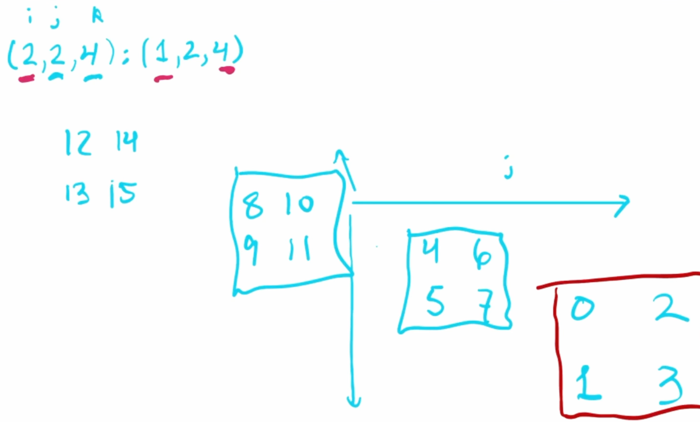
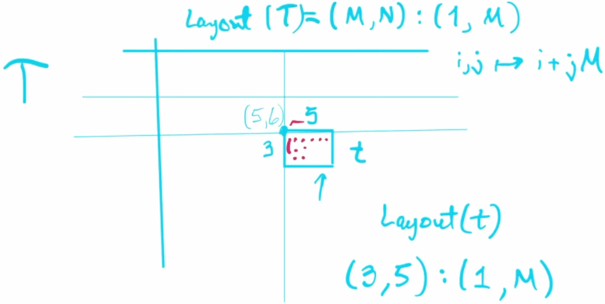

::: {.callout-tip}
## This post is part of the following series:
* [**GPU MODE Lecture Notes**](/series/notes/cuda-mode-notes.html): My notes from the **GPU MODE** reading group lectures run by **Andreas Kopf** and **Mark Saroufim**.
:::


* [Introduction](#introduction)
* [Notation Clarifications](#notation-clarifications)  
* [Tensors in Cutlass](#tensors-in-cutlass)  
* [Layout and Coordinate Systems](#layout-and-coordinate-systems)  
* [Sub-Tiles and Memory Organization](#sub-tiles-and-memory-organization)  
* [Tiling](#tiling)  
* [CuTe Framework](#cute-framework)  
* [Practical Implementation and Usage](#practical-implementation-and-usage)


::: {.callout-tip title="Resource Links:"}

* **YouTube Recording:** [Lecture 15: CUTLASS](https://www.youtube.com/watch?v=G6q719ck7ww)


:::


## Introduction

### Talk Overview

- **Speaker:** Eric Auld
- **Topic:** **Cutlass** - NVIDIA's CUDA Templates for Linear Algebra Subroutines
  - Focuses on the **conceptual understanding** of Cutlass rather than the API specifics.
  - Aims to help attendees **loosen the lid** and get started with learning Cutlass.


### What is Cutlass

- **Cutlass** is a CUDA Templates for Linear Algebra Subroutines library developed by NVIDIA.
  - **GitHub Repository:** [NVIDIA/cutlass](https://github.com/NVIDIA/cutlass)
  - **Authors:** [https://github.com/NVIDIA/cutlass/blob/main/CITATION.cff](https://github.com/NVIDIA/cutlass/blob/main/CITATION.cff)
- It provides low-level control over GPU computations, particularly for **tensor core operations**.
- Used for writing high-performance kernels for **machine learning** and **linear algebra** applications.

### Why Learn Cutlass

- Cutlass allows developers to **spec out new machine learning models** and test their performance.
- It provides tools to make models **performant** by leveraging GPU capabilities directly.
- Useful for exploring **performance-oriented machine learning models** that incorporate extensive linear algebra.

- Understanding Cutlass is essential for working on performance-critical components like Flash Attention.
  - **GitHub Repository:** [Dao-AILab/flash-attention](https://github.com/Dao-AILab/flash-attention)
    - **cutlass code:** [flash-attention/csrc](https://github.com/Dao-AILab/flash-attention/tree/main/csrc)

### Recognizing Cutlass Code

#### Indexing Conventions

- Cutlass uses **round parentheses** `()` for indexing tensors, unlike the typical square brackets `[]`.
- Uses **underscores `_`** in indexing:
  - The underscore acts like the **colon `:`** in Python for slicing.
  - Example: `some_tensor(_, 2)` selects all elements in the first dimension and the third element in the second dimension.

#### Common Functions

- **Greatest Hits Functions** frequently seen in Cutlass code:
  - `local_tile`
  - `local_partition`
  - `partition_D`
  - `partition_S`
- **Underscore 3 `_3`**:
  - Represents a **static integer 3**.
  - The value is embodied in the type rather than the variable's value.
  - Used for compile-time constants.

### Library Purpose and Context

#### Comparison with Other NVIDIA Libraries

- **User-Friendly Libraries** (Called from host):
  - [cuBLAS](https://developer.nvidia.com/cublas)
  - [cuDNN](https://developer.nvidia.com/cudnn)
  - Features:
    - No kernel code writing required
    - Automatic Tensor core inference
    - Some kernel fusion capabilities
    - Host-to-device communication overhead

- **Device-Level Libraries**:
  - Cutlass
  - [Thrust](https://nvidia.github.io/cccl/thrust/)
  - [CUB](https://docs.nvidia.com/cuda/cub/index.html)
  - Features:
    - Low-level control
    - Direct tensor core operation exposure
    - Greater flexibility for new implementations

#### When to Use Cutlass

- **Primary Use Cases**:
  - For new ML models requiring performance optimization
  - When exploring performance-oriented machine learning models with extensive linear algebra
  - When requiring lower-level control than what CUDA BLAS (cuBLAS) provides
  - For implementing and testing new model architectures


## Notation Clarifications

### Interval Notation

- Uses the following notation for intervals:
  - `[i..j)` represents the **half-open interval** from `i` to `j`, including `i` but excluding `j`.
  - Example: `[0..n)` includes integers from `0` up to but not including `n`.

### Definition of Modes

- **Mode**:
  - An element of a **nested tuple**.
  - In a nested tuple of integers, each element (which could be a tuple itself) is called a mode.
  - Important in the context of **nested layouts** in Cutlass.

### Cutlass 3.0 (CuTe)

- **CuTe** refers to **Cutlass 3.0**, which introduced new tensor notation.
- Emphasizes **nested structures** and layouts for tensors.


## Tensors in Cutlass

### Engine (Pointer)

- The **engine** of a tensor represents the **underlying memory pointer**.
- It could be a pointer to **global memory**, **shared memory**, or other memory types.

### Layout (Shape and Stride)

- A tensor's **layout** consists of:
  - **Shape**: Specifies the allowable input coordinates.
    - Represented as **nested integer tuples**.
    - Defines the **dimensions** of the tensor.
  - **Stride**: Defines how to map coordinates to **linear memory offsets**.
    - Also represented as nested integer tuples.
    - Used in calculating the memory address for a given tensor coordinate.


## Layout and Coordinate Systems

### Mapping Coordinates to Linear Offsets

- In **C-style indexing**, linear offsets are calculated using strides:
  - For a coordinate `(i, j)`, the offset is `i + j * M`.
  - For `(i, j, k)`, the offset is `i + j * M + k * M * N`.
- This can be represented as a **dot product**:
  - Offset = `(i, j, k) • (1, M, M*N)`.
- The **stride vector** `(1, M, M*N)` is used to map multi-dimensional indices to linear memory.

### Shape and Stride Concepts

#### Shape Definition
- Specifies allowable input coordinates
- Uses upper bounds notation
- Example: Shape `(M, N, K)` means:
  - i coordinates: [0, M)
  - j coordinates: [0, N)
  - k coordinates: [0, K)

#### Layout Notation
- Format: `shape:stride`
- Example: `(M,N,K):(1,M,MN)`
  - Shape component: `(M,N,K)`
  - Stride component: `(1,M,MN)`

### Layout Concatenation

#### Basic Concatenation
- Can combine one-dimensional layouts
- Example: `(3:1,2:3) = (3,2):(1,3)`
- Benefits:
  - More convenient representation
  - Keeps corresponding shape and stride values closer together

### Nested Layouts

#### Structure
- **Flat Layout**:
  - All dimensions are at the same level.
  - Coordinates are simple tuples.
  - Example: Shape `(3, 4, 2)`, Stride `(1, 3, 40)`.
    - Accepts coordinates like `(1,2,1)`
- **Nested Layout**:
  - Dimensions are grouped into nested tuples.
  - Coordinates are nested tuples.
  - Example:
    - Shape `((3,4),2)`.
    - Stride `(1,3),40)`.
  - The first mode is `(3,4)`, and the second mode is `2`.
  - Accepts coordinates like `((1,2),1)`

#### Congruence Concept
- **Congruent**: Having the same nesting structure
- Requirements:
  - Shape and stride must be congruent
  - Coordinates must match the nesting structure
- Example:
  - Nested layout accepts coordinate like `(1,2),1`
  - Flat layout accepts coordinate like `1,2,1`

### Layout Visualization

#### Purpose

- Drawing layouts helps in **visualizing** and **reasoning** about tensor layouts.
- Not meant to provide rigorous definitions but to aid understanding.

#### Drawing Conventions
- Positive i direction: downward
- Positive j direction: rightward
- Starting point: always zero
- Compositional approach:
  1. Draw elements in first direction
  2. Replicate pattern for second direction
  3. Continue for additional dimensions

#### Example: Simple 2D Layout

- **Layout**:
  - `shape = (3, 4)`
  - `stride = (1, 3)`
  
- **Visualization**:
  
  {fig-align="center" width=50%}
  
  - Along the `i` (row) direction:
    - Elements at offsets `0`, `1`, `2`
  - Along the `j` (column) direction:
    - Each step increases the offset by `3` (due to stride `3`).
  - The overall offsets for each element can be calculated and plotted.

#### Example: 3D Layout

- **Layout**:
  
  - `shape = (2, 2, 4)`
  - `stride = (1, 2, 4)`
  
- **Visualization**:{fig-align="center"}
  
  
  
  - Three dimensions: `i`, `j`, `k`.
  - Elements are offset according to strides in each dimension.
  - Helps in understanding complex memory layouts.


### Special Stride Types

#### Layout Left
- Generalized **column-major** ordering
- Stride calculation: Running prefix product from left
- Example for shape `(A,B,C,D)`:
  - Resulting stride: `(1,A,AB,ABC)`

#### Layout Right
- Generalized **row-major** ordering
- Stride calculation: Running prefix product from right
- Example for shape `(A,B,C,D)`:
  - Resulting stride: `(BCD,CD,D,1)`


## Sub-Tiles and Memory Organization

### Sub-Tile Concepts

#### Basic Properties of Sub-Tiles
- **Shape**: Different (smaller) than parent tensor
- **Stride**: Identical to parent tensor
- **Base Pointer**: Offset from parent tensor's base

#### Sub-Tile Example

{fig-align="center"}

- **Parent Tensor**: `T` with shape `(M, N)` and layout `layout_left`  (1,M) stride.
- **Sub-Tile**: `t` with shape `(3, 5)`  at position (5,6).
- Maintains parent stride (1,M)
- Base pointer offset calculation: `5*1 + 6*M`

#### Understanding Nestedness

- **Question**: *"Are you going to explain on an example what nestedness means?"*
- **Answer**:
  - Eric elaborated:
    - **Nested Tuples**: Tuples where elements can themselves be tuples, forming a hierarchical or tree-like structure.
    - **Example**:
      - A nested layout: `((3, 4), 2):((1,3),12)`
        - Coordinates accepted: `((i, j), k)`
      - Flat layout: `(3,4,2):(1,3,12)`
    - **Usage in Cutlass**:
      - Nested modes allow for logical subdivisions of tensors, which can represent different aspects like thread arrangements and value assignments.
      - Helps in assigning threads to multi-dimensional data efficiently.
  - **Clarification**:
    - The nesting structure must be consistent across shape, stride, and the coordinates used.
    - Nestedness facilitates operations where dimensions need to be grouped logically.


### Q&A

#### Specifying Sub-Tiles in Tensors

- **Question**: *"How do you tile a tensor in this example? How do you specify that capital `T` is broken down into lowercase `t`s?"*
- **Answer**:
  - Eric explained that tiling can be achieved using specific methods in Cutlass:
    - **Methods for Tiling**:
      - **`with_shape`**: Adjusts the shape of a tensor while keeping the same stride, effectively creating a sub-tile.
      - **`local_tile`**: Partitions a tensor into tiles for local computation.
      - **`local_partition`**: Divides a tensor among threads or warps.
      - **Composition**:
        - Using the **compose** function to combine layouts, treating them as functions.
        - Allows creating sub-tiles by composing the parent tensor's layout with the desired sub-tile layout.
  - **Key Point**:
    - Sub-tiles share the same stride as the parent tensor but have different shapes and base pointers.
    - The base pointer of a sub-tile is offset based on its position within the parent tensor.

#### Composition at Compile Time vs. Runtime

- **Question**: *"Is adding composition of layouts adding some hardware overhead, or is it all at runtime or compile time?"*
- **Answer**:
  - Eric explained that it could be either, depending on the situation:
    - **Compile-Time Composition**:
      - If layouts are entirely static and composed of static integers (e.g., `_3` representing a static `3`), composition can occur at compile time.
      - Benefits include potential performance optimizations and early error detection.
    - **Runtime Composition**:
      - If layouts involve dynamic components (e.g., dimensions not known until runtime), composition must occur at runtime.
      - Examples include large memory allocations where sizes aren't predetermined.
  - **Implications**:
    - Compile-time composition can reduce overhead, but flexibility may require runtime handling.
    - Developers can balance between performance and flexibility based on their needs.

#### Support for Negative Strides in Cutlass

- **Question**: *"Is it allowed in Cutlass to use negative strides?"*
- **Answer**:
  - Eric confirmed that negative strides are allowed and elaborated:
    - **Usage**:
      - Negative strides enable traversal of tensors in reverse order along a dimension.
      - Useful for operations like flipping tensors or accessing data in a non-standard sequence.
    - **Considerations**:
      - While powerful, using negative strides can be complex and requires careful handling to avoid errors.
    - **Example**:
      - A tensor with a negative stride in one dimension will decrement the memory offset when indexing along that dimension.


### Non-Contiguous Layouts

- **Definition**:
  - Layouts where elements are not stored in contiguous memory locations.
- **Example**:
  - **Stride with Gaps**:
    - `shape = (3)`
    - `stride = (2)`
    - Offsets: `0`, `2`, `4` (skipping memory locations).

### Multiple Sub-Tiles

#### Common Properties
- All sub-tiles of same size have:
  - Identical shape
  - Identical stride
  - Different base pointers

#### Distinguishing Features
- Only differ in base pointer offset
- Each maintains parent tensor's memory layout pattern
- Base pointer calculation uses parent tensor's layout

### Memory Management

#### Tensor Components Review
1. **Engine** (pointer/memory):
   - Base pointer location
   - Memory type (shared, global, etc.)

2. **Layout**:
   - Shape (dimensions)
   - Stride (memory pattern)

#### Bounds Checking
- Cutlass performs bounds checking
- Many checks possible at compile time due to static integers
- Type system encodes layout information


## Tiling

### Tiling Operations

#### Basic Tiling Structure
- Division of larger tensor into smaller parts
- Two components:
  1. **Outer Part**: Which tile we're examining
  2. **Inner Part**: Which element within the tile

#### Mathematical Representation
For tensor size `A×B×C` tiled by `a×b×c`:
- Outer dimensions: `(A/a) × (B/b) × (C/c)`
- Inner dimensions: `a × b × c`

### Partial Tiling

#### Mode-Specific Tiling
- Can tile specific dimensions while leaving others untouched
- Example tiling modes A and C:
  - Outer part: `(A/a) × B × (C/c)`
  - Inner part: `a × 1 × c`

### Compute Resource Tiling

#### Purpose
- Maps both data and compute resources
- Common in accelerator operations
- Example: Tensor core operations requiring specific thread counts

#### Components to Tile
1. **Compute Resources**:
   - Thread arrangements
   - Warp-level operations
   
2. **Data Structures**:
   - Memory layouts
   - Access patterns

### Layout Division and Composition

#### Shape Division Concepts

* **Notation:**

  - Uses circle-slash symbol (⊘) to represent division-like operation

  - Format: `BigShape ⊘ SmallShape`


* **Convention Rules:**

  1. **First Mode** (Inner):
     
     - Represents elements within a tile
     - Answers "which element in the tile?"
     
     2. **Second Mode** (Outer):
        - Represents tile identification
        - Answers "which tile?"
     
  3. **Leftover Modes**:
     - Placed in outer part
     - Represents untiled dimensions


#### Layout Division Implementation

* **Example with Layout Left:**
  * Original Shape: `(ABC)`
  * Original Stride: `(1, A, AB)`
  * Dividing Shape: `(a, b, c)`

* **Results in Two Parts:**

  1. **Inner Part** (Subtile):
     - Shape: `a, b, c`
     - Stride: Same as original `(1, A, AB)`


  2. **Outer Part** (Tile Selection):
     - Shape: `A/a, B/b, C/c`
     - Stride: Original stride × small shape size
     - Calculation: `(1×a, A×b, AB×c)`


### Example of Tiling

- **Original Shape**: `(M, N)`
- **Tile Shape**: `(m, n)`
- **Outer Shape**: `(M/m, N/n)`
- **Inner Shape**: `(m, n)`
- **Inner Stride**: Same as original stride.
- **Outer Stride**:
  - Calculated as:
    - `(1 * m, M * n)`


## CuTe Framework

### Overview and Context

#### Timeline and Integration
- Introduced with Cutlass 3.0
- Released: Late 2022
- Integrated with Hopper architecture features

#### Framework Components
- Layout algebra
- Tensor operations
- Shape manipulation
- Memory management

### Layout Algebra Concepts

#### Core Operations
1. **Composition**:
   - Combines two layouts
   - Used for creating subtiles

2. **Product Types**:
   - Different flavors of layout multiplication
   - Includes "ranked product"

3. **Division Operations**:
   - Various forms of layout division
   - Used in tiling operations

### Implementation Details

#### Memory Types
- **SMEM Pointer**: Shared memory reference
- **GMEM Pointer**: Global memory reference

#### Static vs Dynamic Elements
- **Static Elements**:
  - Known at compile time
  - Uses underscore notation (e.g., `_3`)
  - Enables compile-time optimizations

- **Dynamic Elements**:
  - Determined at runtime
  - Example: Input tensor dimensions

### Library Architecture

#### Directory Structure
1. **Include Directory**:
   - Core library components
   - Header-only implementation

2. **Arch and Atom Directories:**

   - **`arch`** Directory:
     - Contains architecture-specific implementations.
     - Includes tensor core operations using **inline assembly**.
   - **`atom`** Directory:
     - Contains abstractions over the architecture-specific implementations.
     - Provides templated structures for different operations.

3. **Architecture-Specific Code**:

   - Organized by compute capability
   - Examples:
     - SM80 (Ampere)
     - SM90 (Hopper)

4. **Operations Categories**:
   - Copy operations

   - Matrix Multiply Accumulate (MMA)

   - Additional linear algebra operations

   - **Inline Assembly**:

     - Low-level code directly interacts with GPU tensor cores.

     - Example operation: [`SM80_16x8x4_F32TF32TF32F32_TN`](https://github.com/NVIDIA/cutlass/blob/8aa95dbb888be6d81c6fbf7169718c5244b53227/include/cute/arch/mma_sm80.hpp#L257) for matrix multiplication.

       ```c++
       // MMA 16x8x4 TN
       struct SM80_16x8x4_F32TF32TF32F32_TN
       {
         using DRegisters = float[4];
         using ARegisters = uint32_t[2];
         using BRegisters = uint32_t[1];
         using CRegisters = float[4];
       
         CUTE_HOST_DEVICE static void
         fma(float         & d0, float         & d1, float         & d2, float         & d3,
             uint32_t const& a0, uint32_t const& a1,
             uint32_t const& b0,
             float const   & c0, float const   & c1, float const   & c2, float const   & c3)
         {
       #if defined(CUTE_ARCH_MMA_SM80_ENABLED)
           asm volatile(
             "mma.sync.aligned.m16n8k4.row.col.f32.tf32.tf32.f32 "
             "{%0,  %1,  %2,  %3},"
             "{%4,  %5},"
             "{%6},"
             "{%7,  %8,  %9,  %10};\n"
             : "=f"(d0), "=f"(d1), "=f"(d2), "=f"(d3)
             :  "r"(a0),  "r"(a1),
                "r"(b0),
                "f"(c0),  "f"(c1),  "f"(c2),  "f"(c3));
       #else
           CUTE_INVALID_CONTROL_PATH("Attempting to use SM80_16x8x4_F32TF32TF32F32_TN without CUTE_ARCH_MMA_SM80_ENABLED");
       #endif
         }
       };
       ```

   - **Template Specializations**:

     - Operations are templated based on data types and compute capabilities.
     - Allows for **compile-time dispatch** to appropriate implementations.

### Q&A

#### Availability Across Different GPUs

- **Question**: *"Is this only available for Hopper, or can it also be used for other GPUs? The architectures look as if older GPUs would also be supported."*
- **Answer**:
  - Eric confirmed that Cutlass supports multiple GPU architectures:
    - **Supported Architectures**:
      - While Cutlass provides extensive support for newer architectures like Hopper (SM90), it also supports older GPUs such as Ampere (SM80) and Volta (SM70).
    - **Extent of Support**:
      - Newer architectures have more features and optimizations available.
      - Some functionalities may have limited support or performance on older GPUs.
    - **Implications for Developers**:
      - Developers can use Cutlass across different GPU generations but should be aware of the available features and potential limitations on older hardware.

#### Operations Beyond Matrix Multiplication

- **Question**: *"Is Cutlass mostly about copy and matrix multiplications, or are there other linear algebra operations, like inversion of a matrix?"*
- **Answer**:
  - Eric explained that while Cutlass focuses on fundamental operations, it is not limited to matrix multiplication:
    - **Available Operations**:
      - Cutlass supports a variety of tensor operations, including convolutions and reductions.
      - It provides the building blocks for more complex algorithms.
    - **Advanced Linear Algebra**:
      - For higher-level operations like matrix inversion or solving linear systems, libraries like **cuBLAS** or **[cuSOLVER](https://docs.nvidia.com/cuda/cusolver/index.html)** might be more appropriate.
    - **Use Cases**:
      - Cutlass is ideal for developers needing low-level control to implement custom algorithms or optimize specific operations not covered by higher-level libraries.


## Practical Implementation and Usage

### Matrix Multiplication Implementation

#### SGEMM (Single Precision General Matrix Multiply)
- Source Code: [examples/cute/tutorial/sgemm_1.cu](https://github.com/NVIDIA/cutlass/blob/8aa95dbb888be6d81c6fbf7169718c5244b53227/examples/cute/tutorial/sgemm_1.cu#L458)
- **Name Convention Origin**:
  - S: Single precision
  - GE: General (dense matrices, no special structure)
  - MM: Matrix Multiplication

#### Function Parameters

```c++
gemm(transA, transB, m, n, k,
     alpha,
     d_A.data().get(), ldA,
     d_B.data().get(), ldB,
     beta,
     d_C.data().get(), ldC);
```

```cpp
// Common parameters
trans_a  // Matrix A transpose flag
trans_b  // Matrix B transpose flag
lda      // Leading dimension of matrix A
alpha    // Scalar multiplier
beta     // Scalar multiplier for accumulation
```

* **General Operation Form:** `D = alpha * (A * B) + beta * C`

### Memory Management Features

#### Memory Types and Tags
- **Shared Memory**:
  - Tag: `smem_ptr`
  - Used for thread block local storage

- **Global Memory**:
  - Tag: `gmem_ptr`
  - Used for device-wide storage

### Example Code Structure

#### Basic Include Pattern
```cpp
#include <cute/tensor.hpp>
```

#### Tensor Creation
```cpp
// Creating tensors
make_tensor()
make_layout()
make_coord()
```



