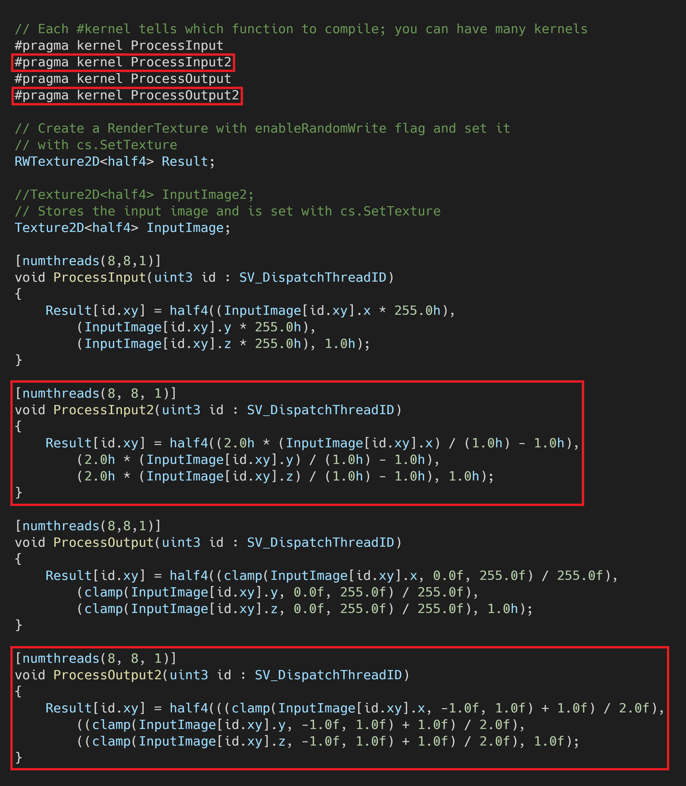
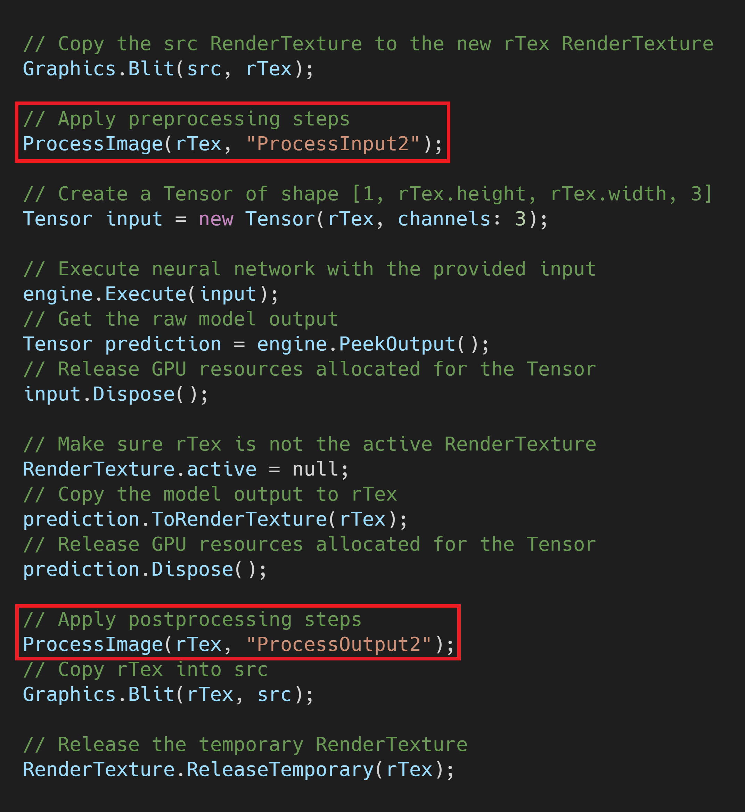
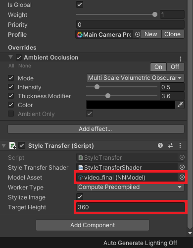

### Previous: [Part 3](../part-3/)

* [Introduction](#introduction)
* [Train the Model](#train-the-model)
* [Modify the Unity Project](#modify-the-unity-project)
* [Test it Out](#test-it-out)
* [Conclusion](#conclusion)

## Introduction

When I was first planning out this tutorial series, I had intended to use a [different style transfer model](https://github.com/OndrejTexler/Few-Shot-Patch-Based-Training). This other model is designed to reduce flickering to better work with video. Unfortunately, I was unable to reliably get good results with that model at a playable frame rate. I figured I might as well make a tutorial for anyone who wants to mess around that model since I already dumped so much time into it.

**Important:** This post assumes that you have already gone through the previous parts of this tutorial series. You can go to the start of this series by clicking the link below.

* [End-to-End In-Game Style Transfer Tutorial Pt.1](../part-1/)

Training this new model will require sample images from the target video game so checkout [Part 1.5](../part-1-5/) of this tutorial series if you haven't already. It shows how to use the Unity Recorder tool to capture in-game footage. We'll split the video into images to generate our training data.

We'll be using a modified version of the Google Colab notebook from [Part 2](../part-2/) of this series. The new model requires some examples of stylized images for training. We'll use the style transfer model from earlier in this series to generate the training samples. You can either use the `final.pth` checkpoint you made during [Part 2](../part-2/) or train a new one in the Colab notebook for this post.

## Train the Model

First, you need to get your own copy of the Colab Notebook. Open the notebook using the link below and save your own copy just like in [Part 2](../part-2/#open-google-colab-notebook).

* [Notebook Link](https://colab.research.google.com/drive/1511cxTph5bdfL9KLjn9AbQa0YI9IoPr5?usp=sharing)

### Continue in the Notebook

Follow the directions in the notebook to train your own video style transfer model. Return to this post once you have exported the trained model.

## Modify the Unity Project

Now we just need to updated our Unity project to support the new model. Unlike the training process, this part is pretty much identical to the other style transfer model.

### Update the `ComputeShader`

The only thing we need to add to the Unity project are some new image processing functions in the `ComputeShader` we made in [Part 3](../part-3/#create-compute-shader). This time, we need to remap the RGB values from `[0,1]` to `[-1,1]` instead of `[0,255]`. You can either swap out the code for the existing processing functions or make new ones like in the image below.

If you make new functions, be sure to replace the function names in the `StyleTransfer.cs` script.

### Replace the `modelAsset`

Download the ONNX file from your Google Drive just like in [Part 3](../part-3/#download-onnx-files) and drop it into the `Models` folder. You can also download the model I'll be using from the link below.

* [Mosaic Style Transfer Model](https://drive.google.com/file/d/1s82LEQtX9sIQOGKTzpfa73CQztWoiJgv/view?usp=sharing)

Now we just need to assign the ONNX file to the `modelAsset` variable in the `Inspector` tab. This model is less efficient than the one used earlier in this series so we'll lower the `targetHeight` as well.

## Test it Out

You'll probably notice that this model doesn't preserve as much fine detail as the other model. This is because I had to significantly reduce the size of the model to get playable frame rates. The full size model is able to preserve much more detail, but is too large to get playable frame rates on any modern graphics card. Additionally, the model doesn't completely get rid of the flickering effect.

 

## Conclusion

This model works great for videos where the scene doesn't change too drastically. Unfortunately, it does not seem well suited for a dynamic, real-time, environment. The default model is way too large to get playable frame rates and it quickly loses detail when its size is reduced. Still, the process of trying to make it work was educational at the very least.