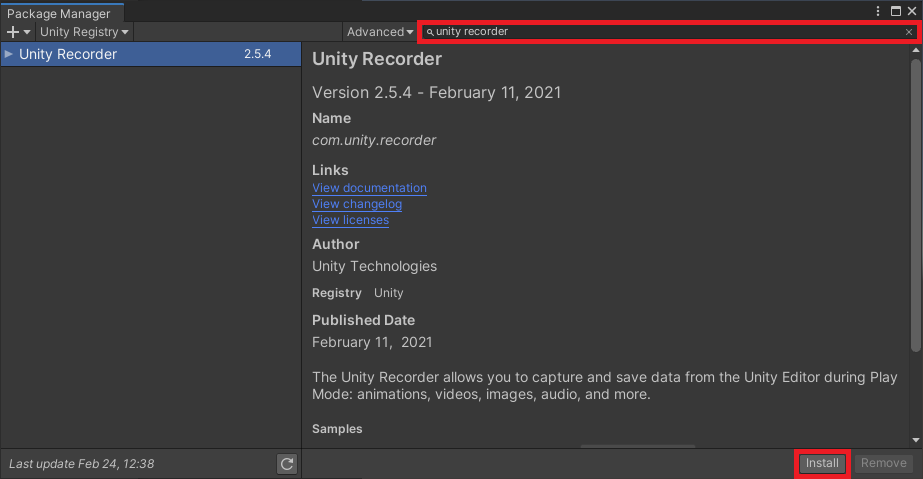
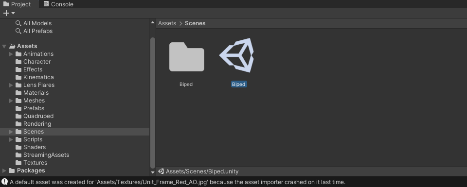
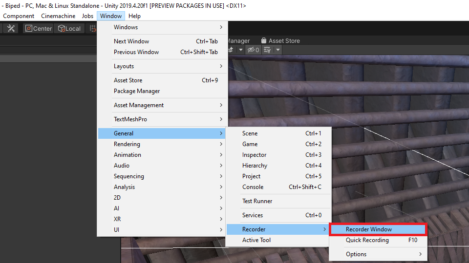
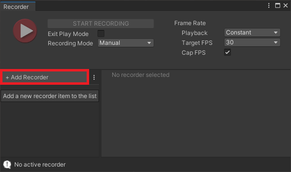
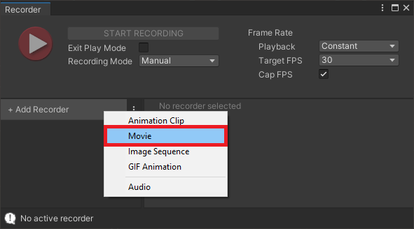
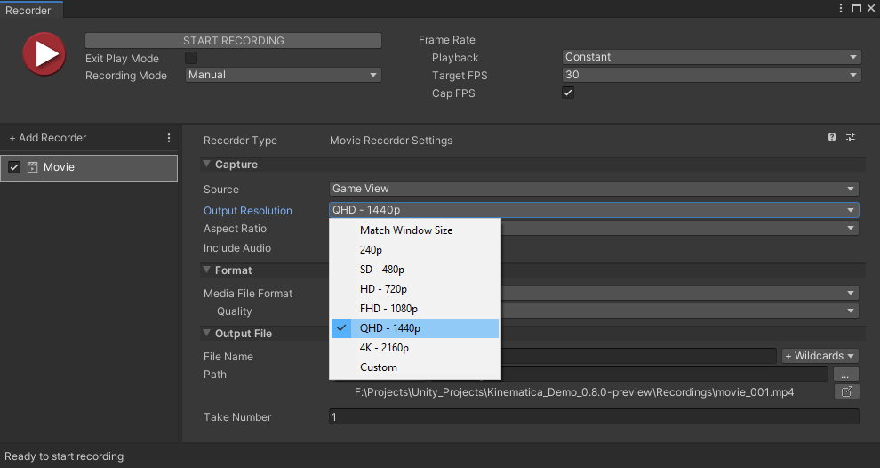
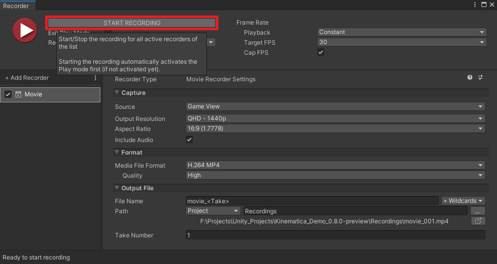
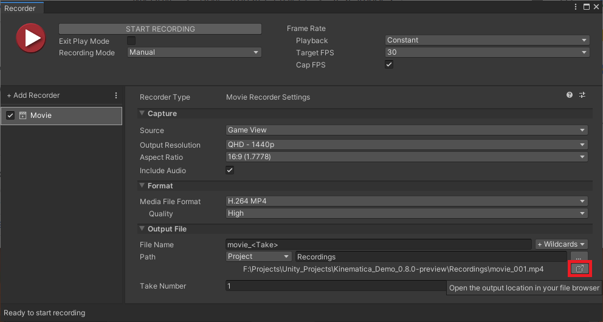
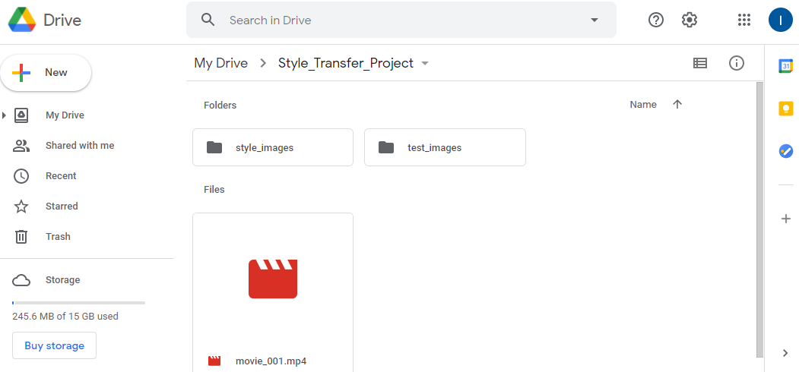

### Previous: [Part 1](../part-1/)

* [Introduction](#introduction)
* [Install Unity Recorder](#install-unity-recorder)
* [Open Game Scene](#open-game-scene)
* [Open Unity Recorder](#open-unity-recorder)
* [Add Movie Recorder](#add-movie-recorder)
* [Record In-Game Footage](#record-in-game-footage)
* [Upload Video to Google Drive](#upload-video-to-google-drive)
* [Conclusion](#conclusion)

## Introduction

In this post, we'll cover how to use the Unity Recorder tool to record in-game footage. We'll be training our model using a pre-existing dataset of real-life images. This enables the model to learn to do a decent job stylizing arbitrary images. However, some games can look drastically different from real-life. In these situations, it can help to add additional training images from the target game. This should help the model learn to stylize frames from that specific environment.

## Install Unity Recorder

The Unity Recorder tool is available through the Package Manger. In the Unity Registry section, type `unity recorder` in the search box and click `Install`.

## Open Game Scene

In the `Assets` section of the `Project` tab, navigate to the Scene you want to record. For the Kinematica demo, open the `Biped` scene in the `Scenes` folder.

## Open Unity Recorder

The Unity Recorder tool is accessible in the `General` sub-menu in the `Windows` section. The tool will open up in its own window.

## Add Movie Recorder

In the Recorder window, click the `+ Add Recorder` button. 

Select the `Movie` option from the drop down.

I recommend setting the `Output Resolution` to 1080p or higher to reduce the amount of compression artifacts.

## Record In-Game Footage

Click `Start Recording` and the game will begin automatically. Once the game is running, move around and try to capture different parts of the environment. The amount of footage required depends on the size the scene. The only thing to keep in mind is that you'll need to upload the video file to Google Drive. The more footage you record, the longer it will take to upload.

Once you're finished recording, you can open the Recordings folder by clicking the button outlined in the image below.

## Upload Video to Google Drive

The last step is to drag and drop the video file into the project folder in Google Drive.

## Conclusion

That's all that's needed to generate custom training data from your Unity project. You can also use any other recording software that you prefer working with. This can be beneficial if you want more control over the quality of the video recordings. In the next post, we'll cover how to split the recording into a folder of images and finally train a style transfer model in Google Colab.

### Next: [Part 2](../part-2/)

[GitHub Repository](https://github.com/cj-mills/End-to-End-In-Game-Style-Transfer-Tutorial)