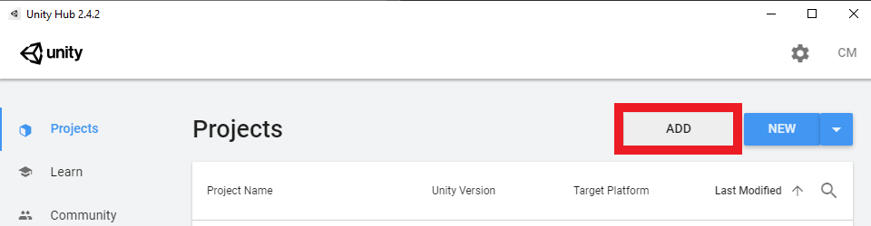
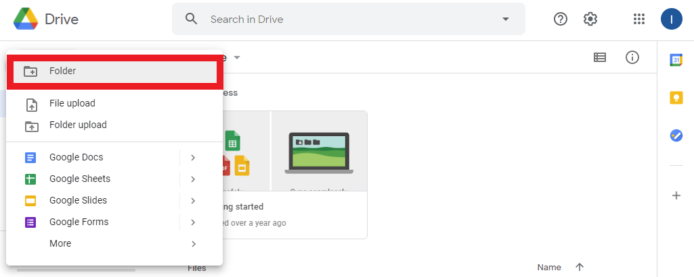
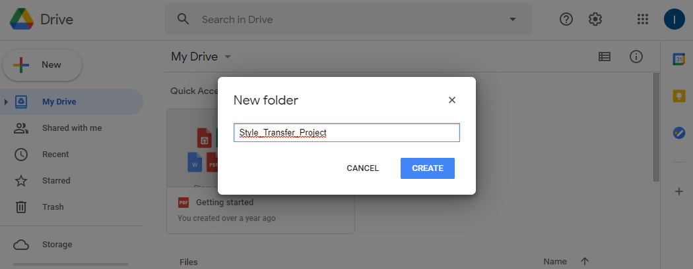
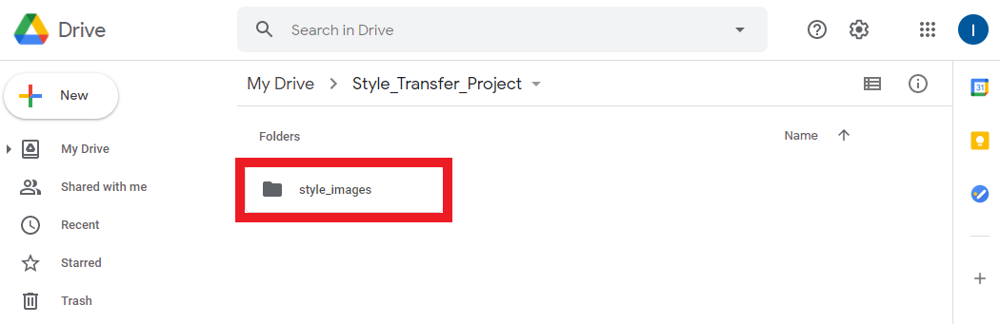
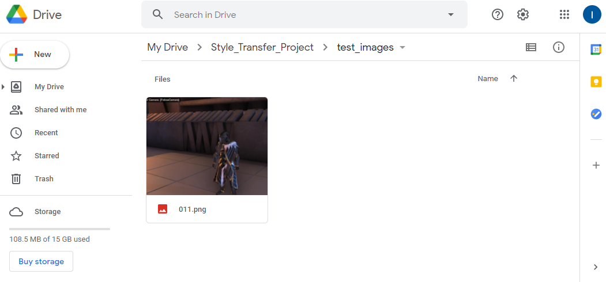

* [Introduction](#introduction)
* [Select a Unity Project](#select-a-unity-project)
* [Install Barracuda Package](#install-barracuda-package)
* [Create Google Drive Project Folder](#create-google-drive-project-folder)
* [Conclusion](#conclusion)

## Introduction

This tutorial series covers how to train your own style transfer model and implement it in Unity using the [Barracuda](https://docs.unity3d.com/Packages/com.unity.barracuda@1.0/manual/index.html) library. We'll be using the [PyTorch](https://pytorch.org/) library to build and train the model. You will not need to set up PyTorch on your local machine to follow along. Instead, we'll be using the free [Google Colab](https://research.google.com/colaboratory/faq.html) service to train the model in a web browser. This does require you to have a Google account. You will also need some free space on Google Drive as we'll be saving our model's progress there.

In this first post, we'll download our Unity project and install the Barracuda library. We'll also create a folder for our project in Google Drive. This is where we'll store our style images, test images and model checkpoints.

	<iframe width=100%; height=480; src="https://www.youtube.com/embed/JhFivpJhV-Q" title="YouTube video player" frameborder="0" allow="accelerometer; autoplay; clipboard-write; encrypted-media; gyroscope; picture-in-picture" allowfullscreen></iframe>

## Select a Unity Project

I'll be using the [Kinematica_Demo](https://github.com/Unity-Technologies/Kinematica_Demo/) project provided by Unity for this tutorial. I was planning on using the lightweight FPS Microgame that's available in Unity Hub. However, the environment ended up being so simple that there wasn't much to stylize. Feel free to follow along with that project though. The steps are identical and it takes much less time to open.

### Download Kinematica Demo

You can download the Kinematica project by clicking on the link below. The zipped folder is approximately 1.2 GB.

* Kinematica_Demo_0.8.0-preview: ([download](https://github.com/Unity-Technologies/Kinematica_Demo/releases/download/0.8.0-preview/Kinematica_Demo_0.8.0-preview.zip))

### Add Project to Unity Hub

Once downloaded, unzip the folder and add the project to Unity Hub using the `Add` button.

### Set the Unity Version

Select a Unity version from the drop-down menu. The demo project was made using Unity `2019.4.5f1`. You can use a later `2019.4` release if you don't have that version installed.

* Unity 2019.4.20: ([download](unityhub://2019.4.20f1/6dd1c08eedfa))

### Open the Project

Now we can open the project. We'll be prompted to upgrade the project to the selected Unity version. Click `Confirm` in the popup to upgrade the project. This project takes a while to load the first time.

## Install Barracuda Package

We'll install the Barracuda package once the project has finished loading. Open the Package Manager window in the Unity editor.

 In the Unity Registry section, type `Barracuda` into the search box. We'll be using version `1.0.4`.

Click the `Install` button to install the package.

## Create Google Drive Project Folder

Google Colab environments provide the option to mount our Google Drive as a directory. We'll be using this feature to automatically save our training progress. 

### Create a Project Folder

We'll make a dedicated project folder to keep things organized. Open up your Google Drive and click the `New` button.

Select the `Folder` option.

Name the folder `Style_Transfer_Project`.

### Create Folder for Style Images

Open the project folder and create a new folder for storing the style images you want to use.

#### Upload Style Images

You can pick whatever images you want, but some will work better than others. Upload the images in their source resolution. You'll have the option to resize them through code when training the model. If you don't currently have any style images in mind you can download the one's that I'll use from the link below.

**Note:** I recommend cropping the style images into squares. Not doing so can occasionally result in a border around the edges of the stylized output image.

#### Sample Style Images: ([link](https://drive.google.com/drive/folders/1IJZk5vY0coY1qOlotkvtZpBHufAP9GFX?usp=sharing))

### Create Folder for Test Images

We'll also need a test image to see how the well the model is stylizing images during training. This is especially important as it can take some experimentation to get the model to generate desirable results. It can often be clear early in a training session whether the model is learning as intended.

You can use this screenshot from the Kinematica demo for your test image.

* Kinematica Demo Screenshot: ([link](https://drive.google.com/file/d/1YrvAV-2RYuRIOHGeTLOgPHc8WHBtpBS2/view?usp=sharing))

Place your test images in a new folder called `test_images`.

## Conclusion

That takes care of the required setup. In the next post I'll cover the optional step of recording in-game footage to add to your training dataset. This can help the model better adapt to the game's specific environment. You can also skip ahead to part 2 where we'll be training our style transfer model in Google Colab.

### Next: [Part 1.5 (Optional)](../part-1-5/) [Part 2](../part-2/) 

[GitHub Repository](https://github.com/cj-mills/End-to-End-In-Game-Style-Transfer-Tutorial)

<!-- Cloudflare Web Analytics --><!-- End Cloudflare Web Analytics -->