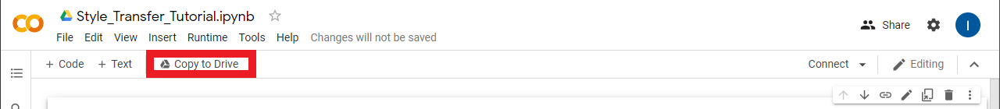
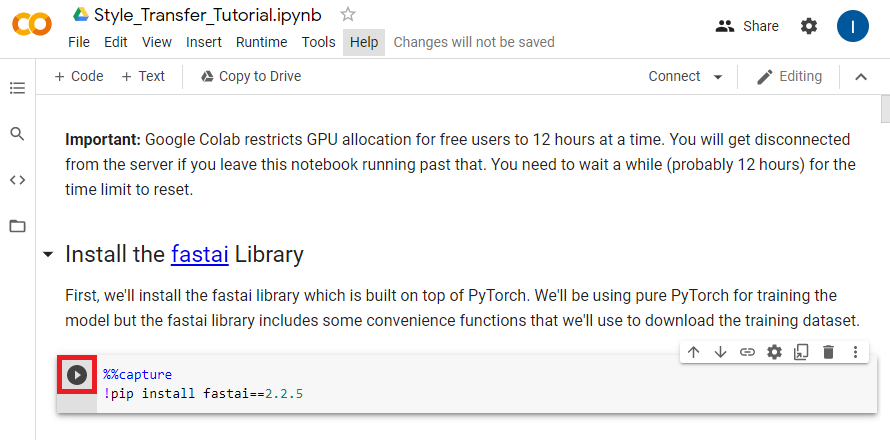
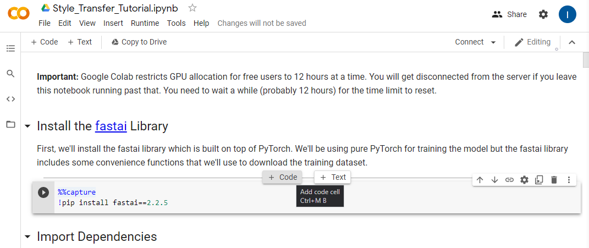
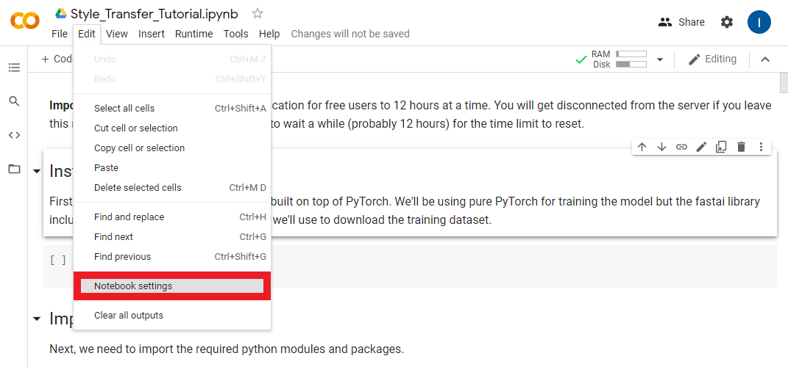
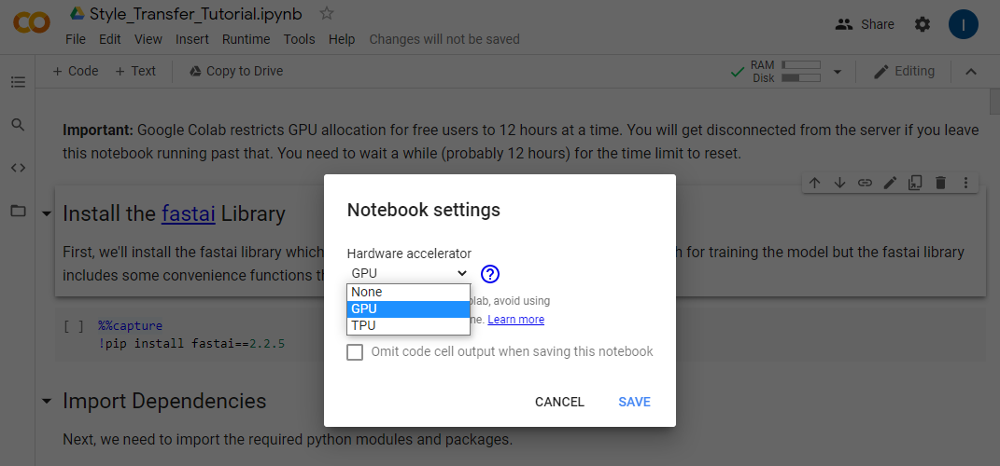

### Previous: [Part 1](../part-1/) [Part 1.5](../part-1-5/)

* [Introduction](#introduction)
* [Open Google Colab Notebook](#open-google-colab-notebook)
* [Continue in the Notebook](#continue-in-the-notebook)
* [Conclusion](#conclusion)

## Introduction

In this post we'll be using the free tier of Google Colab to train a style transfer model. Google Colab provides a virtual environment that allows anyone to write and execute arbitrary python code in their browser. This removes the need to setup a Python environment on your local machine. It also provides free access to GPUs. 

**Important:** Google Colab restricts GPU allocation for free users to 12 hours at a time. You will get disconnected from the server if you leave a notebook running past that. You need to wait a while (probably 12 hours) for the time limit to reset.

## Open Google Colab Notebook

First, you need to get your own copy of the Colab Notebook. You can open my copy of the notebook by clicking the link below.

* [Notebook Link](https://colab.research.google.com/drive/1ixyTcASEFb2k_Dn60ZzfxJHboxE9ND85?usp=sharing)

### Copy to Google Drive

You need to save the notebook to your Google Drive since you can't make changes to my copy. To do so, click the `Copy to Drive` button.



That will reopen the notebook in a new tab where any changes you make can be saved to you Google Drive. Go ahead and close the original tab. The notebook should autosave progress, but you can manually save by pressing `CTRL-s`.

#### Colab Notebooks Folder

If you open your Google Drive, you should see a new folder named `Colab Notebooks`. This is where any notebooks your work on in Google Colab will be saved.


#### Inside Colab Notebooks Folder

You can open the new folder to see your copy of the notebook. If you double-click on the notebook file, you'll be presented with the option to open it in a Google Colab environment. You can use this method to reopen the notebook in the future.


## Using a Colab Notebook

Colab Notebooks are primarily made up of code cells and text cells. Code cells can be executed in multiple ways. If you hover over or click on a code cell, a play button will appear on the left side of the cell. Clicking the play button will execute the code cell.



The other main ways are to either press `CTRL-Enter` or `Shift-Enter`. `CTRL-Enter` executes the code cell in place while `Shift-Enter` executes the code cell and moves to the next cell.

You can add more cells by hovering over either the top or bottom of an existing cell. You will be presented with the option to create either a code or text cell.




## Connect to a Runtime Environment

We need to connect to a runtime environment before we start using the notebook. Press the `Connect` button outlined below.


Once the notebook has connected to a runtime environment hover the RAM/Disk readout and make sure the notebook is using a `GPU` backend.


If it's not, you need to manually set it to use a GPU. You can do so by opening the `Notebook Settings` under the `Edit` section.



Select `GPU` from the `Hardware Accelerator` dropdown and click `Save`.




## Continue in the Notebook

I recommend continuing this post in the Colab notebook itself. However, I have also included the notebook contents below if you're only reading through the tutorial. 

## Install the [fastai](https://docs.fast.ai/) Library

First, we'll install the fastai library which is built on top of PyTorch. We'll be using pure PyTorch for training the model but the fastai library includes some convenience functions that we'll use to download the training dataset.

```bash
%%capture
!pip install fastai==2.2.5
```

## Import Dependencies

Next, we need to import the required python modules and packages.

```python
# Miscellaneous operating system interfaces
# https://docs.python.org/3/library/os.html
import os
# Time access and conversions
# https://docs.python.org/3/library/time.html
import time
# Object-oriented filesystem paths
# https://docs.python.org/3/library/pathlib.html#pathlib.Path
from pathlib import Path
# Tuple-like objects that have named fields
# https://docs.python.org/3/library/collections.html#collections.namedtuple
from collections import namedtuple

# A convenience function for downloading files from a url to a destination folder
# https://docs.fast.ai/data.external.html#untar_data
from fastai.data.external import untar_data

# Provides image processing capabilities
# https://pillow.readthedocs.io/en/stable/reference/Image.html
from PIL import Image

# The main PyTorch package
# https://pytorch.org/docs/stable/torch.html
import torch

# Used to iterate over the dataset during training 
# https://pytorch.org/docs/stable/data.html#torch.utils.data.DataLoader
from torch.utils.data import DataLoader

# Contains definitions of models. We'll be downloading a pretrained VGG-19 model
# to judge the performance of our style transfer model.
# https://pytorch.org/vision/stable/models.html#torchvision.models.vgg19
from torchvision.models import vgg19
# Common image transforms that we'll use to process images before feeding them to the models
# https://pytorch.org/vision/stable/transforms.html
from torchvision import transforms
# Loads images from a directory and applies the specified transforms
# https://pytorch.org/vision/stable/datasets.html#imagefolder
from torchvision.datasets import ImageFolder
```


## Utility Functions

We'll define some utility functions for making new directories, loading and saving images, and stylizing images using model checkpoints.

```python
def make_dir(dir_name: str):
    """Create the specified directory if it doesn't already exist"""
    dir_path = Path(dir_name)
    try:
        dir_path.mkdir()
    except:
        print("Directory already exists.")

def load_image(filename: str, size: int=None, scale: float=None):
    """Load the specified image and return it as a PIL Image"""
    img = Image.open(filename)
    if size is not None:
        img = img.resize((size, size), Image.ANTIALIAS)
    elif scale is not None:
        img = img.resize((int(img.size[0] / scale), int(img.size[1] / scale)), Image.ANTIALIAS)
    return img

def save_image(filename: str, data: torch.Tensor):
    """Save the Tensor data to an image file"""
    img = data.clone().clamp(0, 255).numpy()
    img = img.transpose(1, 2, 0).astype("uint8")
    img = Image.fromarray(img)
    img.save(filename)

def load_checkpoint(model_path):
    state_dict = torch.load(model_path)
    keys = [k for k in state_dict.keys()]
    filters = set()
    filters_list = [state_dict[k].shape[0] for k in keys if not (state_dict[k].shape[0] in filters or filters.add(state_dict[k].shape[0]))]
    res_blocks = len(set(k.split('.')[1] for k in state_dict.keys() if 'resnets' in k))
    model = TransformerNet(filters=filters_list[:-1], res_blocks=res_blocks) 
    model.load_state_dict(state_dict, strict=False)
    return model

def stylize(model_path: str, input_image: str, output_image: str, content_scale: float=None, 
            device: str="cpu", export_onnx: bool=None):
    """Load a TransformerNet checkpoint, stylize an image and save the output"""
    device = torch.device(device)
    content_image = load_image(input_image, scale=content_scale)
    content_transform = transforms.Compose([
        transforms.ToTensor(),
        transforms.Lambda(lambda x: x.mul(255))
    ])
    content_image = content_transform(content_image)
    content_image = content_image.unsqueeze(0).to(device)

    with torch.no_grad():
        style_model = load_checkpoint(model_path)
        style_model.to(device)
         
        if export_onnx:
            assert export_onnx.endswith(".onnx"), "Export model file should end with .onnx"
            output = torch.onnx._export(style_model, content_image, export_onnx, opset_version=9).cpu()
        else:
            output = style_model(content_image).cpu()
    save_image(output_image, output[0])
```


## Define the Style Transfer Model

Next, we'll define the style transfer model itself. The model takes in an RGB image and generates a new image with the same dimensions. The features in the output image (e.g. color and texture) are then compared with the features of the style image and content image. The results of these comparisons are then used to update the parameters of the model so that it hopefully generates better images.

I won't go into detail about the model architecture as the goal of this tutorial is primarily showing how to use it.

```python
class TransformerNet(torch.nn.Module):
    """TransformerNet
    https://github.com/pytorch/examples/blob/36441a83b6595524a538e342594ee6482754f374/fast_neural_style/neural_style/transformer_net.py#L4
    """
    
    def __init__(self, filters=(32, 64, 128), res_blocks=5):
        super(TransformerNet, self).__init__()
        self.filters = filters
        self.res_blocks = res_blocks if res_blocks > 0 else 1
        # Initial convolution layers
        self.conv1 = ConvLayer(3, filters[0], kernel_size=9, stride=1)
        self.in1 = torch.nn.InstanceNorm2d(filters[0], affine=True)
        self.conv2 = ConvLayer(filters[0], filters[1], kernel_size=3, stride=2)
        self.in2 = torch.nn.InstanceNorm2d(filters[1], affine=True)
        self.conv3 = ConvLayer(filters[1], filters[2], kernel_size=3, stride=2)
        self.in3 = torch.nn.InstanceNorm2d(filters[2], affine=True)
        # Residual layers
        self.resnets = torch.nn.ModuleList()
        for i in range(self.res_blocks):
            self.resnets.append(ResidualBlock(filters[2]))
        
        # Upsampling Layers
        self.deconv1 = UpsampleConvLayer(filters[2], filters[1], kernel_size=3, stride=1, upsample=2)
        self.in4 = torch.nn.InstanceNorm2d(filters[1], affine=True)
        self.deconv2 = UpsampleConvLayer(filters[1], filters[0], kernel_size=3, stride=1, upsample=2)
        self.in5 = torch.nn.InstanceNorm2d(filters[0], affine=True)
        self.deconv3 = ConvLayer(filters[0], 3, kernel_size=9, stride=1)
        # Non-linearities
        self.relu = torch.nn.ReLU()
        
    def forward(self, X):
        conv1_y = self.relu(self.in1(self.conv1(X)))
        conv2_y = self.relu(self.in2(self.conv2(conv1_y)))
        conv3_y = self.relu(self.in3(self.conv3(conv2_y)))

        y = self.resnets[0](conv3_y) + conv3_y
        
        for i in range(1, self.res_blocks):
            y = self.resnets[i](y) + y

        y = self.relu(self.in4(self.deconv1(conv3_y + y)))
        y = self.relu(self.in5(self.deconv2(conv2_y + y)))
        y = self.deconv3(conv1_y + y)
        return y


class ConvLayer(torch.nn.Module):
    """ConvLayer
    https://github.com/pytorch/examples/blob/36441a83b6595524a538e342594ee6482754f374/fast_neural_style/neural_style/transformer_net.py#L44
    """

    def __init__(self, in_channels, out_channels, kernel_size, stride):
        super(ConvLayer, self).__init__()
        reflection_padding = kernel_size // 2
        self.reflection_pad = torch.nn.ReflectionPad2d(reflection_padding)
        self.conv2d = torch.nn.Conv2d(in_channels, out_channels, kernel_size, stride)

    def forward(self, x):
        out = self.reflection_pad(x)
        out = self.conv2d(out)
        return out


class ResidualBlock(torch.nn.Module):
    """ResidualBlock
    introduced in: https://arxiv.org/abs/1512.03385
    recommended architecture: http://torch.ch/blog/2016/02/04/resnets.html
    https://github.com/pytorch/examples/blob/36441a83b6595524a538e342594ee6482754f374/fast_neural_style/neural_style/transformer_net.py#L57
    """

    def __init__(self, channels):
        super(ResidualBlock, self).__init__()
        self.conv1 = ConvLayer(channels, channels, kernel_size=3, stride=1)
        self.in1 = torch.nn.InstanceNorm2d(channels, affine=True)
        self.conv2 = ConvLayer(channels, channels, kernel_size=3, stride=1)
        self.in2 = torch.nn.InstanceNorm2d(channels, affine=True)
        self.relu = torch.nn.ReLU()
      
    def forward(self, x):
        residual = x
        out = self.relu(self.in1(self.conv1(x)))
        out = self.in2(self.conv2(out))
        out = out + residual
        return out


class UpsampleConvLayer(torch.nn.Module):
    """UpsampleConvLayer
    Upsamples the input and then does a convolution. This method gives better results
    compared to ConvTranspose2d.
    ref: http://distill.pub/2016/deconv-checkerboard/
    https://github.com/pytorch/examples/blob/36441a83b6595524a538e342594ee6482754f374/fast_neural_style/neural_style/transformer_net.py#L79
    """

    def __init__(self, in_channels, out_channels, kernel_size, stride, upsample=None):
        super(UpsampleConvLayer, self).__init__()
        self.upsample = upsample
        reflection_padding = kernel_size // 2
        self.reflection_pad = torch.nn.ReflectionPad2d(reflection_padding)
        self.conv2d = torch.nn.Conv2d(in_channels, out_channels, kernel_size, stride)
        
    def forward(self, x):
        x_in = x
        if self.upsample:
            x_in = torch.nn.functional.interpolate(x_in, mode='nearest', scale_factor=self.upsample)
        out = self.reflection_pad(x_in)
        out = self.conv2d(out)
        return out
```


## Define the VGG-19 Model

Next, we'll define the model that will be used to judge the quality of the output images from the style transfer model. This model has been pretrained a large image dataset. This means it's already learned to recognize a wide variety of features in images. We'll use this model to extract the features of the content image, style image, and stylized images.

```python
class Vgg19(torch.nn.Module):
    """
    https://github.com/pytorch/examples/blob/36441a83b6595524a538e342594ee6482754f374/fast_neural_style/neural_style/vgg.py#L7
    """
    
    def __init__(self, requires_grad=False):
        super(Vgg19, self).__init__()
        self.feature_layers = [0, 3, 5]
        self.vgg_pretrained_features = vgg19(pretrained=True).features
        self.slice1 = torch.nn.Sequential()
        self.slice2 = torch.nn.Sequential()
        self.slice3 = torch.nn.Sequential()
        self.slice4 = torch.nn.Sequential()
        self.slice5 = torch.nn.Sequential()
        for x in range(4):
            self.slice1.add_module(str(x), self.vgg_pretrained_features[x])
        for x in range(4, 9):
            self.slice2.add_module(str(x), self.vgg_pretrained_features[x])
        for x in range(9, 18):
            self.slice3.add_module(str(x), self.vgg_pretrained_features[x])
        for x in range(18, 27):
            self.slice4.add_module(str(x), self.vgg_pretrained_features[x])
        for x in range(27, 36):
            self.slice5.add_module(str(x), self.vgg_pretrained_features[x])
        if not requires_grad:
            for param in self.parameters():
                param.requires_grad = False
            
    def forward(self, X):
        h = self.slice1(X)
        h_relu1_2 = h
        h = self.slice2(h)
        h_relu2_2 = h
        h = self.slice3(h)
        h_relu3_3 = h
        h = self.slice4(h)
        h_relu4_3 = h
        h = self.slice5(h)
        h_relu5_3 = h
        vgg_outputs = namedtuple("VggOutputs", ['relu1_2', 'relu2_2', 'relu3_3', 'relu4_3', 'relu5_3'])
        out = vgg_outputs(h_relu1_2, h_relu2_2, h_relu3_3, h_relu4_3, h_relu5_3)
        return out
```


## Define the Model Trainer

We'll define a new class to make training the style transfer model a bit easier. Along with training the model, this class will save the model's current progress at set intervals. It will also generate sample images so we can see how the model is doing. This will allow us to determine if the model is actually improving or whether it's already good enough that we can stop the training process early.

```python
class Trainer(object):
    def __init__(self, train_loader, style_transform, generator, opt_generator, style_criterion, perception_model, device):
        self.train_loader = train_loader
        self.style_transform = style_transform
        self.generator = generator
        self.opt_generator = opt_generator
        self.style_criterion = style_criterion
        self.perception_model = perception_model
        self.device = device
        self.generator.to(self.device)
        
    def gram_matrix(self, y: torch.Tensor):
        """Compute the gram matrix a PyTorch Tensor"""
        (b, ch, h, w) = y.size()
        features = y.view(b, ch, w * h)
        features_t = features.transpose(1, 2)
        gram = features.bmm(features_t) / (ch * h * w)
        return gram

    def normalize_batch(self, batch: torch.Tensor):
        """Normalize a batch of Tensors using the imagenet mean and std """
        mean = batch.new_tensor([0.485, 0.456, 0.406]).view(-1, 1, 1)
        std = batch.new_tensor([0.229, 0.224, 0.225]).view(-1, 1, 1)
        batch = batch.div_(255.0)
        return (batch - mean) / std

    def get_gram_style(self, style_image: str, style_size: int):
        """Get the Gram Matrices for the style image"""
        style = load_image(style_image, size=style_size)
        style = self.style_transform(style)
        style = style.repeat(self.train_loader.batch_size, 1, 1, 1).to(self.device)
        features_style = self.perception_model(self.normalize_batch(style))
        gram_style = [self.gram_matrix(y) for y in features_style]
        return gram_style
            
    def save_checkpoint(self, path: str):
        """Save the current model weights at the specified path"""
        self.generator.eval().cpu()
        torch.save(self.generator.state_dict(), path)
        print(f"Checkpoint saved at {path}")

    def train(self, style_image, test_image, checkpoint_model_dir, epochs=5, content_weight=1e5, style_weight=1e10, 
                content_scale=None, style_size=None, log_interval=500, checkpoint_interval=500):
        """Train the style transfer model on the provided style image."""
        
        gram_style = self.get_gram_style(style_image, style_size)

        for e in range(epochs):
            self.generator.train()
            agg_content_loss = 0.
            agg_style_loss = 0.
            count = 0
            for batch_id, (x, _) in enumerate(self.train_loader):
                n_batch = len(x)
                count += n_batch
                self.opt_generator.zero_grad()
                
                x = x.to(self.device)
                y = self.generator(x)

                y = self.normalize_batch(y.clone())
                x = self.normalize_batch(x.clone())
                features_y = self.perception_model(y)
                features_x = self.perception_model(x)

                content_loss = content_weight * self.style_criterion(features_y.relu2_2, features_x.relu2_2)

                style_loss = 0.
                for ft_y, gm_s in zip(features_y, gram_style):
                    gm_y = self.gram_matrix(ft_y)
                    style_loss += self.style_criterion(gm_y, gm_s[:n_batch, :, :])
                style_loss = style_loss * style_weight

                total_loss = content_loss + style_loss
                total_loss.backward()
                self.opt_generator.step()

                agg_content_loss += content_loss.item()
                agg_style_loss += style_loss.item()

                if (batch_id + 1) % log_interval == 0:
                    mesg = f"{' '.join(time.ctime().replace('  ', ' ').split(' ')[1:-1])}  "
                    mesg += f"Epoch {e + 1}: [{count}/{len(self.train_loader.dataset)}]  "
                    mesg += f"content: {(agg_content_loss / (batch_id + 1)):.4f}  "
                    mesg += f"style: {(agg_style_loss / (batch_id + 1)):.4f}  "
                    mesg += f"total: {((agg_content_loss + agg_style_loss) / (batch_id + 1)):.4f}"
                    print(mesg)

                if checkpoint_model_dir is not None and (batch_id + 1) % checkpoint_interval == 0:
                    ckpt_base = f"ckpt_epoch_{e}_batch_id_{batch_id + 1}"
                    ckpt_model_filename = ckpt_base + ".pth"
                    ckpt_model_path = os.path.join(checkpoint_model_dir, ckpt_model_filename)
                    self.save_checkpoint(ckpt_model_path)
                    output_image = ckpt_base + ".png"
                    output_image_path = os.path.join(checkpoint_model_dir, output_image)
                    stylize(ckpt_model_path, test_image, output_image_path)
                    self.generator.to(self.device).train()
                
        print("Finished Training")
        ckpt_model_path = os.path.join(checkpoint_model_dir, 'final.pth')
        self.save_checkpoint(ckpt_model_path)
        output_image_path = os.path.join(checkpoint_model_dir, 'final.png')
        stylize(ckpt_model_path, test_image, output_image_path)
```


## Mount Google Drive

Before going any further, we need to mount out Google Drive so we can access our project folder. There is a python library that's specifically made for working in Colab notebook that provides this functionality.

```python
from google.colab import drive
```

We'll use the `drive.mount()` method to mount our whole Google Drive inside a new directory called `drive`.

When you run the code cell below, you will be prompted to open a link to allow Google Colab to access your Drive.

Once you allow access you will be provided with an authorization code. Copy and paste the code into text box that appears in the output of the code cell and press Enter.

```python
drive.mount('/content/drive')
```

If we look in the new `drive` folder, we can see that our main Drive folder is named `MyDrive`. All the folders and files in your Drive are accessible in `MyDrive`.

If you placed and named your project folder as shown in part 1 of this tutorial, it should be located at `/content/drive/MyDrive/Style_Transfer_Project`.

We'll need that path to our project folder to store in Python variables in the next section.

## Set the Directories

Now we need to create several variables to store the paths to various directories.

* The dataset directory

* The Google Drive style transfer project directory

* The style images directory

* The test image directory

* The model checkpoint directory

The datset directory will be on the Google Colab environment while the rest will be on your Google Drive. This will allow you to keep all your progress while preventing the dataset from filling up your Drive storage.

I recommend creating separate checkpoint directories for each training session. That makes it easier to compare results from experiments.

```python
dataset_dir = "/content/dataset"

project_dir = '/content/drive/MyDrive/Style_Transfer_Project'
style_images_dir = f"{project_dir}/style_images"
test_images_dir = f"{project_dir}/test_images"
checkpoints_dir = f"{project_dir}/checkpoints"
make_dir(checkpoints_dir)
```


## Download Training Dataset

We'll be using the [COCO](https://cocodataset.org/#home) train 2014 image dataset to train our model. It's about 13.5 GB unzipped. That's just high enough to trigger the disk space warning without actually using up the available disk space. You will likely get a disk space warning while the dataset is being unzipped. You can click ignore in the popup window. We'll delete the zip file once the the folder is unzipped.

```python
coco_url = 'http://images.cocodataset.org/zips/train2014.zip'
untar_data(coco_url, 'coco.zip', dataset_dir)
if os.path.exists('coco.zip'): os.remove('coco.zip')
```


## Split Gameplay Video

In this section we'll split the gameplay video if you made one. We'll store the frames in a new sub-directory called `video_frames` in the `dataset_dir`.

```bash
!mkdir ./dataset/video_frames/
```

We'll use the `ffmpeg` command-line tool to split the video file. Google Colab should already have the tool installed. 

In the code cell below replace `/content/drive/MyDrive/Style_Transfer_Project/movie_001.mp4` with the path to your video file.

If you recorded a lot of footage, you might want to keep an eye on the available disk space and manually stop the code cell from running. This shouldn't be a problem if you only recorded several minutes of gameplay.

```bash
!ffmpeg -i /content/drive/MyDrive/Style_Transfer_Project/movie_001.mp4 ./dataset/video_frames/%05d.png -hide_banner
```

## Create the Trainer Variables

In this section we'll define the variables required to define a new Trainer.

### Define the `DataLoader`

We need to define a `DataLoader` that will be responsible for iterating through the dataset during training.

We also need to specify the `batch_size` which indicates how many images will be fed to the model at a time.

Every image in a batch needs to be the same size. We'll set the size using the `image_size` variable.

Images need to be processed before being fed to the model. We'll define the preprocessing steps using the `transforms.Compose()` method. Our preprocessing steps include the following:

1. Resize the images in the current batch to the target `image_size`

2. Crop the images so that they are all square

3. Convert the images to PyTorch Tensors

4. Multiply the color channel values by 255

We then store the list of images in the `dataset_dir` along with the preprocessing steps in a new variable called `train_dataset`.

Finally, we create our `DataLoader` using the `train_dataset` and specified `batch_size`

```python
batch_size = 4
image_size = 256
transform = transforms.Compose([transforms.Resize(image_size),
                                transforms.CenterCrop(image_size),
                                transforms.ToTensor(),
                                transforms.Lambda(lambda x: x.mul(255))
                                ])

train_dataset = ImageFolder(dataset_dir, transform)
train_loader = DataLoader(train_dataset, batch_size=batch_size)
```

### Select Compute Device

We'll double that check a cuda GPU is available using the `torch.cuda.is_available()` method.

```python
use_cuda = True
device = "cuda" if (use_cuda and torch.cuda.is_available()) else "cpu"
print(f"Using: {device}")
```

### Define Transforms for Style Image

Next we'll define the transforms used to process the style image before feeding it to the VGG-19 model. The processing steps are basically the same as for the training images accept the style image will have already been resized.

1. Convert the image to a PyTorch Tensor
2. Multiply the pixel values by 255

```python
style_transform = transforms.Compose([transforms.ToTensor(),
                                      transforms.Lambda(lambda x: x.mul(255))
                                      ])
```


### Create the Style Transfer Model

Next, we'll create a new instance of the style transfer model. It's here that you'll be able to experiment with tradeoffs between performance and quality.


#### Tuning Model Inference Speed:

The easiest way to make the style transfer model faster is to make it smaller. We can easily tune the size of model by adjusting the size of the layers or by using fewer layers.

##### Resolution: `960x540`

##### Filters: `(16, 32, 64)`

```text
================================================================
Total params: 424,899
Trainable params: 424,899
Non-trainable params: 0
----------------------------------------------------------------
Input size (MB): 5.93
Forward/backward pass size (MB): 2210.61
Params size (MB): 1.62
Estimated Total Size (MB): 2218.17
----------------------------------------------------------------
```

##### Resolution: `960x540`

##### Filters: `(32, 64, 128)`

```text
================================================================
Total params: 1,679,235
Trainable params: 1,679,235
Non-trainable params: 0
----------------------------------------------------------------
Input size (MB): 5.93
Forward/backward pass size (MB): 4385.35
Params size (MB): 6.41
Estimated Total Size (MB): 4397.69
----------------------------------------------------------------
```

By default, the style transfer model uses the following values:

* filters: (32, 64, 128)

* res_blocks: 5

The `filters` variable determines the size of the layers in the model. The `resnet_blocks` variable determines the number of `ResidualBlocks` that form the core of the model.

I've found that setting filters to `(8, 16, 32)` and keeping keeping res_blocks at `5` significantly improves performance in Unity with minimal impact on quality.

```python
filters = (8, 16, 32)
res_blocks = 5
generator = TransformerNet(filters=filters, res_blocks=res_blocks).to(device)
```


### Create the Optimizer for the Style Transfer Model 

Next, we'll define the optimizer for our model. The optimizer determines how the model gets updated during training. The optimizer takes in the model's parameters and a learning rate. The learning rate determines how much the model gets updated after each batch of images.

We'll use a learning rate of `1e-3` which is equivalent to `0.001`.

**Notation Examples:**

* 1e-4 = 0.0001

* 1e0 = 1.0

* 1e5 = 100000.0

* 5e10 = 50000000000.0

```python
lr = 1e-3
opt_generator = torch.optim.Adam(generator.parameters(), lr)
```

### Define How Model Performance Will Be Measured

We'll be using Mean Squared Error (MSE) for comparing the difference between the features of the content image and stylized image and between the features of the stylized image and the target style image.

```python
style_criterion = torch.nn.MSELoss()
```

**Note:** If you're not familiar with MSE, take a look at the toy example below.

#### Mean Squared Error in Python

```python
x = [1, 2, 3, 4]
y = [5, 6, 7, 8]

sum_of_squares = 0
for i in range(len(x)):
    error = x[i] - y[i]
    squared_error = error**2
    sum_of_squares += squared_error
    
mse = sum_of_squares / len(x)
mse
```

#### Mean Squared Error in PyTorch

```python
x_t = torch.Tensor(x)
y_t = torch.Tensor(y)

mse_loss = torch.nn.MSELoss()

mse_loss(x_t, y_t)
```


### Create a New VGG-19 Perception Model

Next, we'll create a new vgg-19 model. The pretrained model will be downloaded the first time this cell is run.

```python
perception_model = Vgg19(requires_grad=False).to(device)
```


## Create a New Trainer

We can now create a new trainer instance using the variables we defined above.

```python
trainer = Trainer(train_loader=train_loader, 
                  style_transform=style_transform, 
                  generator=generator, 
                  opt_generator=opt_generator, 
                  style_criterion=style_criterion, 
                  perception_model=perception_model, 
                  device=device)
```

#### Tuning the Stylized Image

The stylized image will be influenced by the following:

* Influence of the content image

* Influence of the style image

* Size of the style image

I recommend keeping the content_weight at `1e5` and adjusting the style_weight between `5e8` and `1e11`. The ideal style_weight will vary depending on the style image. I recommend starting out low, training for 5-10 checkpoint intervals, and increasing the style weight as needed.

```python
# The file path for the target style image
style_image = f"{style_images_dir}/1.png"
# The file path for a sample input image for demonstrating the model's progress during training
test_image = f"{test_images_dir}/011.png" 

# The number of times to iterate through the entire training dataset
epochs = 1

# The influence from the input image on the stylized image
# Default: 1e5
content_weight = 1e5
# The influence from the style image on the stylized image
# Default: 1e10
style_weight = 2e9

# (test_image resolution) / content_scale
content_scale = 1.0
# Target size for style_image = (style_size, styl_size)
style_size = 256

# The number of training batches to wait before printing the progress of the model 
log_interval = 500
# The number of training to wait before saving the current model weights
checkpoint_interval = 500
```


## Train the Model

Once you execute the code cell below, open the checkpoints folder in Google Drive in another tab. You can view the model's progress by looking at the sample style images that get generated with each checkpoint. You can stop the training process early by clicking the stop button where the play button normally is on the left side of the code cell.

```python
trainer.train(style_image=style_image, 
              test_image=test_image, 
              checkpoint_model_dir=checkpoints_dir, 
              epochs=epochs, 
              content_weight=content_weight, 
              style_weight=style_weight,
              content_scale=content_scale,
              style_size=style_size,
              log_interval=log_interval, 
              checkpoint_interval=checkpoint_interval)
```


## Export the model to ONNX

We can finally export the model to ONNX format. PyTorch exports models by feeding a sample input into the model and tracing what operators are used to compute the outputs.

We'll use a `(1, 3, 960, 540)` Tensor with random values as our sample input. This is equivalent to feeding a `960x540` RGB image to the model. The resolution doesn't matter as we can feed images with arbitrary resolutions once the model is exported.

The ONNX file will be saved to the project folder in Google Drive.

**Note:** You will get a warning after running the code cell below recommending that you use ONNX opset 11 or above. Unity has prioritized support for opset 9 for Barracuda and higher opsets are not fully supported.

```python
checkpoint_path = f"{checkpoints_dir}/final.pth"
style_model = load_checkpoint(checkpoint_path)
```

```python
x = torch.randn(1, 3, 960, 540).cpu()

torch.onnx.export(style_model.cpu(),     #  Model being run
                  x,                           # Sample input
                  f"{project_dir}/final.onnx", # Path to save ONNX file
                  export_params=True,          # Store trained weights
                  opset_version=9,             # Which ONNX version to use
                  do_constant_folding=True     # Replace operations that have all constant inputs with pre-computed nodes
                 )
```

## Conclusion

That's everything needed to train your own style transfer models. In the next post we'll add the code to use the trained ONNX file in Unity.

### Next: [Part 3](../part-3/)

[GitHub Repository](https://github.com/cj-mills/End-to-End-In-Game-Style-Transfer-Tutorial)