---
categories:
- style-transfer
- pytorch
- unity
- tutorial
date: 3/3/2021
description: This post covers how implement the style transfer model in Unity with
  the Barracuda library.
hide: false
image: ../social-media/cover.png
search_exclude: false
comments:
  utterances:
    repo: cj-mills/christianjmills
title: End-to-End In-Game Style Transfer Tutorial Pt.3

aliases:
- /End-To-End-In-Game-Style-Transfer-Tutorial-3/
---

### Previous: [Part 2](../part-2/)

* [Introduction](#introduction)

* [Create Style Transfer Folder](#)

* [Import Model](#import-model)

* [Create Compute Shader](#create-compute-shader)

* [Create `StyleTransfer` Script](#create-styletransfer-script)

* [Attach Script to Camera](#attach-script-to-camera)

* [Test it Out](#test-it-out)

* [Conclusion](#conclusion)

## Introduction

In this post we'll implement our trained style transfer model in Unity. 

## Create Style Transfer Folder

We'll place all our additions to the project in a new asset folder called `Style_Transfer`. This will help keep things organized.

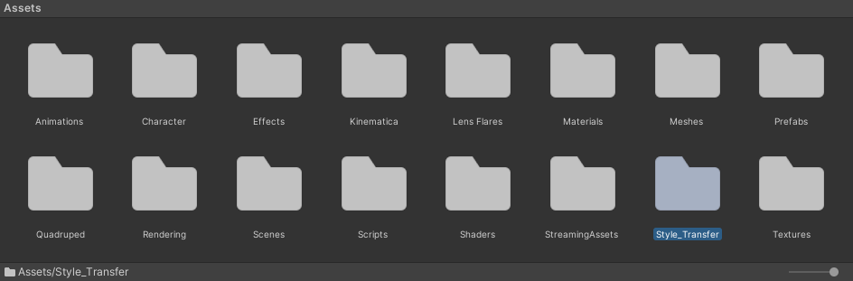{fig-align="center"}

## Import Model

Next, we need to import the trained ONNX file that we created in Part 2.

### Download ONNX Files

Right-click the `final.onnx` in your Google Drive project folder and click `Download`.

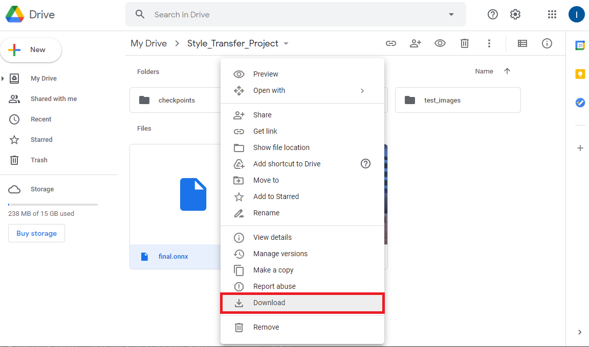{fig-align="center"}

Alternatively, you can download the model that I'll be using from the link below.

* [Mosaic Style Transfer Model](https://drive.google.com/file/d/1YM_PG2XFXUJnhj8eOZtpxEyXMR8rRBE5/view?usp=sharing)

### Import ONNX Files to Assets

Open the `Style_Transfer` folder and make a new folder called `Models`.

{fig-align="center"}

Drag and drop the ONNX file into the `Models` folder.

{fig-align="center"}

## Create Compute Shader

We can perform both the preprocessing and postprocessing operations on the GPU since both the input and output are images. We'll implement these steps in a [compute shader](https://docs.unity3d.com/Manual/class-ComputeShader.html).

### Create the Asset File

Open the `Style_Transfer` folder and create a new folder called `Shaders`. Enter the `Shaders` folder and right-click an empty space. Select `Shader` in the `Create` submenu and click `Compute Shader`. We’ll name it `StyleTransferShader`.

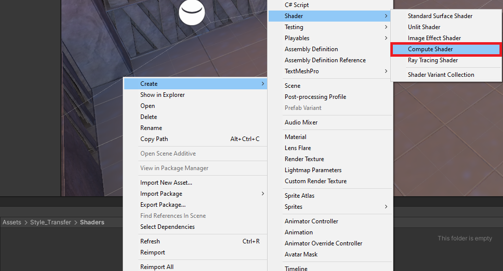{fig-align="center"}

### Remove the Default Code

Open the `StyleTransferShader` in your code editor. By default, the `ComputeShader` will contain the following. 

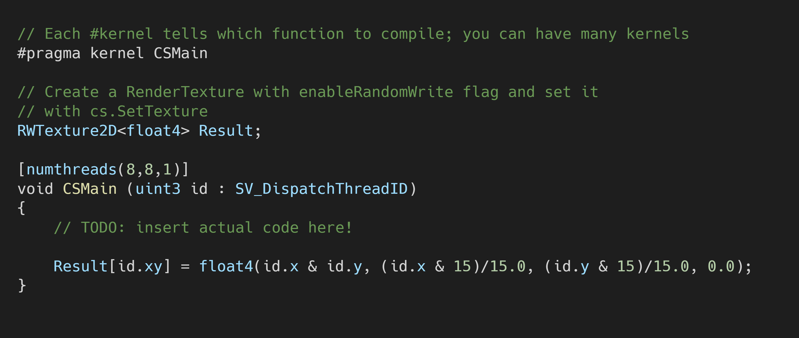{fig-align="center"}

Delete the `CSMain` function along with the `#pragma kernel CSMain`. Next, we need to add a `Texture2D` variable to store the input image. Name it `InputImage` and give it a data type of `<half4>`. Use the same data type for the `Result` variable as well.

{fig-align="center"}

### Create `ProcessInput` Function

The style transfer models expect RGB channel values to be in the range `[0, 255]`. Color values in Unity are in the range `[0,1]`. Therefore, we need to scale the three channel values for the `InputImage` by `255`. We'll perform this step in a new function called `ProcessInput` as shown below.

{fig-align="center"}

### Create `ProcessOutput` Function

The models are supposed to output an image with RGB channel values in the range `[0, 255]`. However, it can sometimes return values a little outside that range. We can use the built-in [`clamp()`](https://docs.microsoft.com/en-us/windows/win32/direct3dhlsl/dx-graphics-hlsl-clamp) method to make sure all values are in the correct range. We'll then scale the values back down to `[0, 1]` for Unity. We'll perform these steps in a new function called `ProcessOutput` as shown below.

{fig-align="center"}

Now that we’ve created our `ComputeShader`, we need to execute it using a `C#` script.

## Create `StyleTransfer` Script

We need to make a new `C#` script to perform inference with the style transfer model. This script will load the model, process the input, run the model, and process the output.

### Create the Asset File

Open the `Style_Transfer` folder and create a new folder called `Scripts`. In the `Scripts` folder, right-click an empty space and select `C# Script` in the `Create` submenu.

{fig-align="center"}

Name the script `StyleTransfer`.

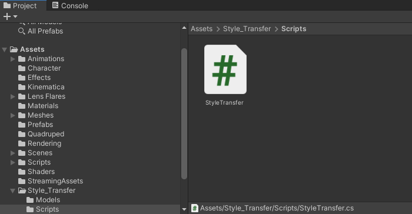{fig-align="center"}

### Add `Unity.Barracuda` Namespace

Open the `StyleTransfer` script and add the `Unity.Barracuda` namespace at the top of the script.

{fig-align="center"}

### Create `StyleTransferShader` Variable

Next, we need to add a public variable to access our compute shader.

{fig-align="center"}

### Create Style Transfer Toggle

We'll also add a public `bool` variable to indicate whether we want to stylize the scene. This  will create a checkbox in the `Inspector` tab that we can use to toggle the style transfer on and off while the game is running.

{fig-align="center"}

### Create TargetHeight Variable

Getting playable frame rates at higher resolutions can be difficult even when using a smaller model. We can help out our GPU by scaling down the camera input to a lower resolution before feeding it to the model. We would then scale the output image back up to the source resolution. This can also yield results closer to the test results during training if you trained the model with lower resolution images.

Create a new public `int` variable named `targetHeight`. We'll set the default value to `540` which is the same as the test image used in the Colab Notebook.

{fig-align="center"}

### Create Barracuda Variables

Now we need to add a few variables to perform inference with the style transfer model.

#### Create `modelAsset` Variable

Make a new public `NNModel` variable called `modelAsset`. We’ll assign the ONNX file to this variable in the Unity Editor.

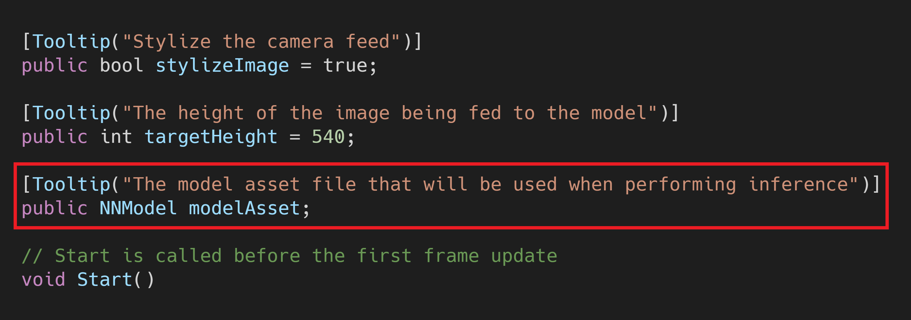{fig-align="center"}

#### Create `workerType` Variable

We’ll also add a variable that let’s us choose which [backend](https://docs.unity3d.com/Packages/com.unity.barracuda@1.0/manual/Worker.html) to use when performing inference. The options are divided into `CPU` and `GPU`. Our  image processing steps run entirely on the `GPU` so we’ll be sticking with the `GPU` options for this tutorial series.

Make a new public `WorkerFactory.Type` called `workerType`. Give it a default value of `WorkerFactory.Type.Auto`.

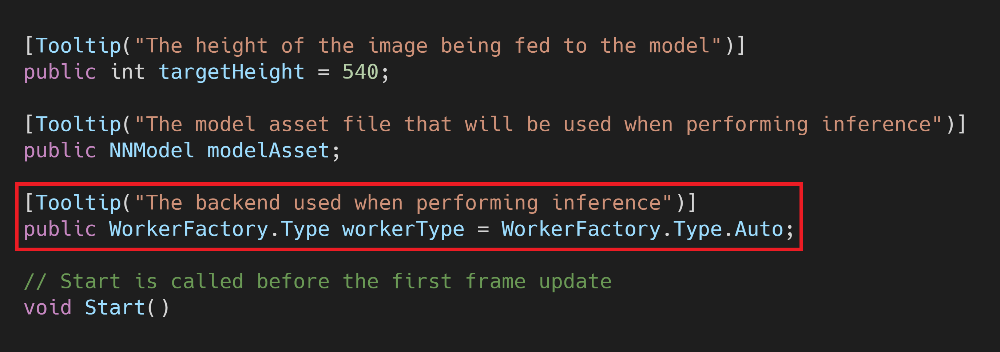{fig-align="center"}

#### Create `m_RuntimeModel` Variable

We need to compile the `modelAsset` into a run-time model to perform inference. We’ll store the compiled model in a new private `Model` variable called `m_RuntimeModel`.

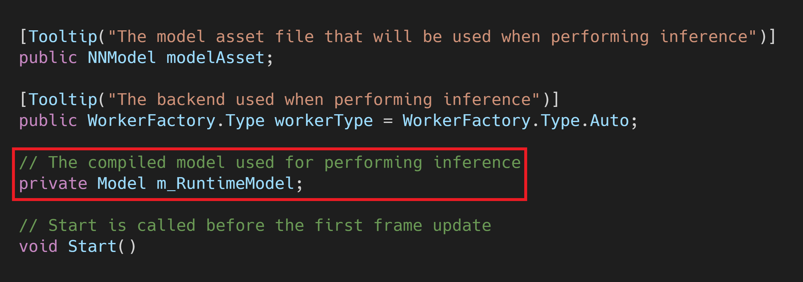{fig-align="center"}

#### Create `engine` Variable

Next, we’ll create a new private `IWorker` variable to store our inference engine. Name the variable `engine`.

{fig-align="center"}

### Compile the Model

We need to get an object oriented representation of the model before we can work with it. We’ll do this in the `Start()` method and store it in the `m_RuntimeModel`.

{fig-align="center"}

### Initialize Inference Engine

Now we can create a worker to execute the model using the selected backend. We’ll do this using the [`WorkerFactory.CreateWorker()`](https://docs.unity3d.com/Packages/com.unity.barracuda@1.0/api/Unity.Barracuda.WorkerFactory.html#Unity_Barracuda_WorkerFactory_CreateWorker_Unity_Barracuda_WorkerFactory_Type_Unity_Barracuda_Model_System_Boolean_) method.

{fig-align="center"}

### Release Inference Engine Resources

We need to manually release the resources that get allocated for the inference `engine`. This should be one of the last actions performed. Therefore, we’ll do it in the `OnDisable()` method. This method gets called when the Unity project exits.

{fig-align="center"}

### Create `ProcessImage()` Method

Next, we'll make a new method to execute the `ProcessInput()` and `ProcessOutput()` functions in our `ComputeShader`. This method will take in the image that needs to be processed as well as a function name to indicate which function we want to execute. We'll need to store the processed images in textures with HDR formats. This will allow us to use color values outside the default range of `[0, 1]`. As mentioned previously, the model expects values in the range of `[0, 255]`. 

#### Method Steps

1. Get the `ComputeShader` index for the specified function
2. Create a temporary `RenderTexture` with random write access enabled to store the processed image
3. Execute the `ComputeShader`
4. Copy the processed image back into the original `RenderTexture`
5. Release the temporary `RenderTexture`

#### Method Code

{fig-align="center"}

### Create `StylizeImage()` Method

We'll create a new method to handle stylizing individual frames from the camera. This method will take in the `src` `RenderTexture` from the game camera and copy the stylized image back into that same `RenderTexture`.

#### Method Steps:

1. Resize the camera input to the `targetHeight`

   If the height of `src` is larger than the `targetHeight`, we'll calculate the new dimensions to downscale the camera input. We'll then adjust the new dimensions to be multiples of 8. This is to make sure we don't loose parts of the image after applying the processing steps with the `Compute shader`.

2. Apply preprocessing steps to the image

   We'll call the `ProcessImage()` method and pass `rTex` along with the name for the `ProcessInput()` function in the `ComputeShader`. The result will be stored in `rTex`.

3. Execute the model

   We'll use the `engine.Execute()` method to run the model with the current `input`. We can store the raw output from the model in a new `Tensor`.

4. Apply the postprocessing steps to the model output

   We'll call the `ProcessImage()` method and pass `rTex` along with the name for the `ProcessOutput()` function in the `ComputeShader`. The result will be stored in `rTex`.

5. Copy the stylized image to the `src` `RenderTexture`

   We'll use the `Graphics.Blit()` method to copy the final stylized image into the `src` `RenderTexure`.

6. Release the temporary `RenderTexture`

   Finally, we'll release the temporary `RenderTexture`.

#### Method Code

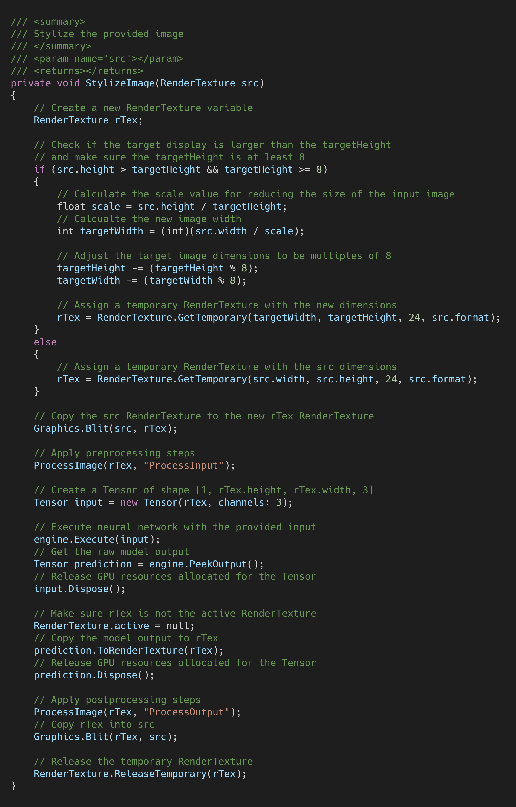{fig-align="center"}

### Define `OnRenderImage()` Method

We'll be calling the `StylizeImage()` method from the `OnRenderImage()` method instead of the `Update()` method. This gives us access to the `RenderTexture` for the game camera as well as the `RenderTexture` for the target display. We'll only call the the `StylizeImage()` method if `stylizeImage` is set to `true`. You can delete the empty `Update()` method as it's not needed in this tutorial.

#### Method Steps:

1. Stylize the `RenderTexture` for the game camera
2. Copy the `RenderTexture` for the camera to the `RenderTexture` for the target display. 

#### Method Code

{fig-align="center"}

That completes the `StyleTransfer` script. Next, we'll attach it to the active camera in the scene.

## Attach Script to Camera

To run the `StyleTransfer` script, we need to attach it to the active `Camera` in the scene.

### Select the Camera

Open the `Biped` scene and expand the `_Scene` object in the `Hierarchy` tab. Select the `Main Camera` object from the dropdown list.

{fig-align="center"}

**Note:** If you're following along with the FPS Microgame, the Main Camera is a child of the `Player` object. However, the active camera is actually the `WeaponCamera` object which is a child of the `Main Camera`.

### Attach the `StyleTransfer` Script

With the `Main Camera` object still selected, drag and drop the `StyleTransfer` script into the bottom of the `Inspector` tab.

{fig-align="center"}

### Assign the Assets

Now we just need to assign the ComputeShader and model assets as well as set the inference backend. Drag and drop the `StyleTransferShader` asset into the `StyleTransferShader` spot in the `Inspector` tab. Then, drag and drop the `final.onnx` asset into the `Model Asset` spot in the `Inspector` tab. Finally, select `Compute Precompiled` from the `WorkerType` dropdown.

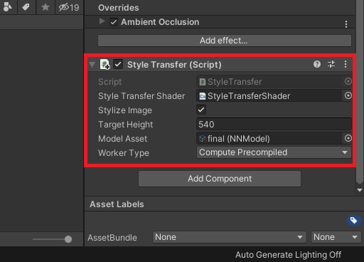{fig-align="center"}

### Reduce Flickering

The style transfer model used in this tutorial series does not account for consistency between frames. This results in a flickering effect that can be distracting. Getting rid of this flickering entirely would require using a different (and likely less efficient) model. However, we can minimize flickering when the camera isn't moving by disabling the `Post-process Layer` attached to the `Main Camera` object.

{fig-align="center"}

## Test it Out

At last, we can press the play button and see how it runs. If you went through my [previous](../../basic-in-game-style-transfer-tutorial/) in-game style transfer tutorial, you should see significantly higher frame rates this time.

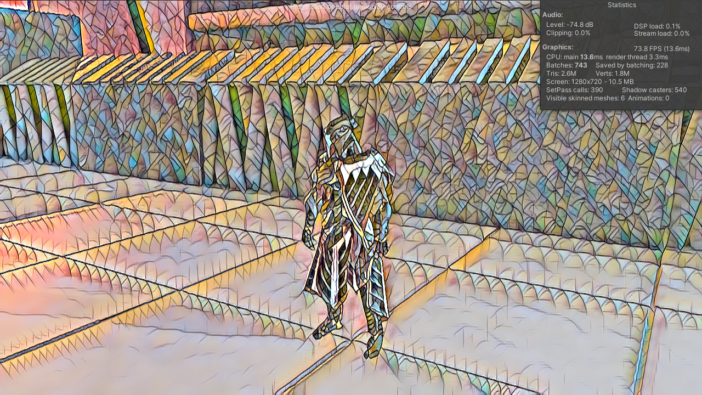{fig-align="center"}

## Conclusion

We now have a complete workflow for implementing in-game style transfer in Unity. We can train as many style transfer models as we want using the Colab Notebook and drop them into our project. I wasn't expecting to get such a significant improvement in frame rate compared to my first attempt at in-game style transfer. This implementation might actually be usable on non-flagship graphics cards.

There are still two major drawbacks to the approach covered in this tutorial. First, you need to train separate models for each specific style image. Second, the flickering is still present.

There is a more recent variant of the style transfer model used in this tutorial that can perform apply the style of arbitrary images. However, that version takes significantly more time to fully train. That version also still results in the same flickering effect.

I had planned to use a [style transfer model](https://github.com/OndrejTexler/Few-Shot-Patch-Based-Training) that provides more consistency between frames for this tutorial. Unfortunately, I wasn't able to consistently get satisfying results and decided to exclude it. I still plan to make a stand alone post covering how to adapt the project from this tutorial series to use that model. 

[GitHub Repository](https://github.com/cj-mills/End-to-End-In-Game-Style-Transfer-Tutorial)

<!-- Cloudflare Web Analytics --><!-- End Cloudflare Web Analytics -->