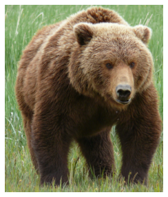
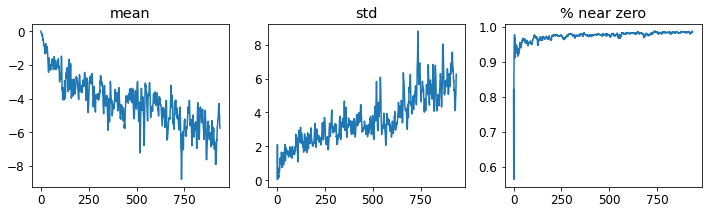
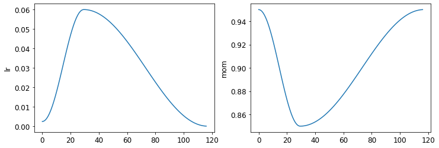
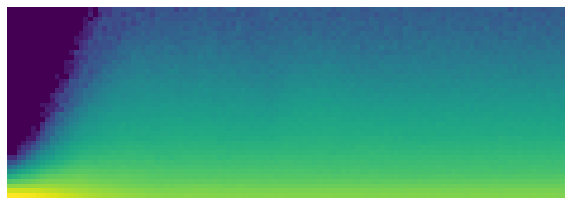

* [The Magic of Convolutions](#the-magic-of-convolutions)
* [Our First Convolutional Neural Network](#our-first-convolutional-neural-network)
* [Improving Training Stability](#improving-training-stability)
* [References](#references)

-----

```python
#hide
# !pip install -Uqq fastbook
import fastbook
fastbook.setup_book()
```


```python
#hide
from fastai.vision.all import *
from fastbook import *

matplotlib.rc('image', cmap='Greys')
```


```python
import inspect
def print_source(obj):
    for line in inspect.getsource(obj).split("\n"):
        print(line)
```


## Convolutional Neural Networks

## The Magic of Convolutions
* feature engineering
    * creating new transformations of the input data in order to make it easier to the model
    * one of the most powerful tools machine learning practitioners have at their disposal
* a feature is a transformation of the data that is designed to make it easier to the model


#### Convolution
* applies a kernel across an image
    * multiplies each element of an $NxN$ size kernel by each element of an $NxN$ block of an image and adds the results together
* kernel: a little matrix

#### [A guide to convolution arithmetic for deep learning](https://arxiv.org/abs/1603.07285)
* provides many great diagrams showing how image kernels can be applied

-----


```python
# A convolutional kernel that finds top edges (i.e. dark on bottom, light on top)
top_edge = tensor([[-1,-1,-1],
                   [ 0, 0, 0],
                   [ 1, 1, 1]]).float()
```

-----


```python
path = untar_data(URLs.MNIST_SAMPLE)
path
```
```text
Path('/home/innom-dt/.fastai/data/mnist_sample')
```

-----


```python
im3 = Image.open(path/'train'/'3'/'12.png')
show_image(im3);
```


-----

```python
show_image
```
```text
<function fastai.torch_core.show_image(im, ax=None, figsize=None, title=None, ctx=None, cmap=None, norm=None, *, aspect=None, interpolation=None, alpha=None, vmin=None, vmax=None, origin=None, extent=None, interpolation_stage=None, filternorm=True, filterrad=4.0, resample=None, url=None, data=None, **kwargs)>
```

-----


```python
print_source(show_image)
```
```text
@delegates(plt.Axes.imshow, keep=True, but=['shape', 'imlim'])
def show_image(im, ax=None, figsize=None, title=None, ctx=None, **kwargs):
    "Show a PIL or PyTorch image on `ax`."
    # Handle pytorch axis order
    if hasattrs(im, ('data','cpu','permute')):
        im = im.data.cpu()
        if im.shape[0]<5: im=im.permute(1,2,0)
    elif not isinstance(im,np.ndarray): im=array(im)
    # Handle 1-channel images
    if im.shape[-1]==1: im=im[...,0]

    ax = ifnone(ax,ctx)
    if figsize is None: figsize = (_fig_bounds(im.shape[0]), _fig_bounds(im.shape[1]))
    if ax is None: _,ax = plt.subplots(figsize=figsize)
    ax.imshow(im, **kwargs)
    if title is not None: ax.set_title(title)
    ax.axis('off')
    return ax
```

-----


```python
im3_t = tensor(im3)
im3_t[0:3,0:3] * top_edge
```
```text
tensor([[-0., -0., -0.],
        [0., 0., 0.],
        [0., 0., 0.]])
```

-----


```python
(im3_t[0:3,0:3] * top_edge).sum()
```
```text
tensor(0.)
```

-----


```python
df = pd.DataFrame(im3_t[:10,:20])
df.style.set_properties(**{'font-size':'6pt'}).background_gradient('Greys')
```
<div style="overflow-x:auto;">
<table id="T_b57bd">
  <thead>
    <tr>
      <th class="blank level0" >&nbsp;</th>
      <th id="T_b57bd_level0_col0" class="col_heading level0 col0" >0</th>
      <th id="T_b57bd_level0_col1" class="col_heading level0 col1" >1</th>
      <th id="T_b57bd_level0_col2" class="col_heading level0 col2" >2</th>
      <th id="T_b57bd_level0_col3" class="col_heading level0 col3" >3</th>
      <th id="T_b57bd_level0_col4" class="col_heading level0 col4" >4</th>
      <th id="T_b57bd_level0_col5" class="col_heading level0 col5" >5</th>
      <th id="T_b57bd_level0_col6" class="col_heading level0 col6" >6</th>
      <th id="T_b57bd_level0_col7" class="col_heading level0 col7" >7</th>
      <th id="T_b57bd_level0_col8" class="col_heading level0 col8" >8</th>
      <th id="T_b57bd_level0_col9" class="col_heading level0 col9" >9</th>
      <th id="T_b57bd_level0_col10" class="col_heading level0 col10" >10</th>
      <th id="T_b57bd_level0_col11" class="col_heading level0 col11" >11</th>
      <th id="T_b57bd_level0_col12" class="col_heading level0 col12" >12</th>
      <th id="T_b57bd_level0_col13" class="col_heading level0 col13" >13</th>
      <th id="T_b57bd_level0_col14" class="col_heading level0 col14" >14</th>
      <th id="T_b57bd_level0_col15" class="col_heading level0 col15" >15</th>
      <th id="T_b57bd_level0_col16" class="col_heading level0 col16" >16</th>
      <th id="T_b57bd_level0_col17" class="col_heading level0 col17" >17</th>
      <th id="T_b57bd_level0_col18" class="col_heading level0 col18" >18</th>
      <th id="T_b57bd_level0_col19" class="col_heading level0 col19" >19</th>
    </tr>
  </thead>
  <tbody>
    <tr>
      <th id="T_b57bd_level0_row0" class="row_heading level0 row0" >0</th>
      <td id="T_b57bd_row0_col0" class="data row0 col0" >0</td>
      <td id="T_b57bd_row0_col1" class="data row0 col1" >0</td>
      <td id="T_b57bd_row0_col2" class="data row0 col2" >0</td>
      <td id="T_b57bd_row0_col3" class="data row0 col3" >0</td>
      <td id="T_b57bd_row0_col4" class="data row0 col4" >0</td>
      <td id="T_b57bd_row0_col5" class="data row0 col5" >0</td>
      <td id="T_b57bd_row0_col6" class="data row0 col6" >0</td>
      <td id="T_b57bd_row0_col7" class="data row0 col7" >0</td>
      <td id="T_b57bd_row0_col8" class="data row0 col8" >0</td>
      <td id="T_b57bd_row0_col9" class="data row0 col9" >0</td>
      <td id="T_b57bd_row0_col10" class="data row0 col10" >0</td>
      <td id="T_b57bd_row0_col11" class="data row0 col11" >0</td>
      <td id="T_b57bd_row0_col12" class="data row0 col12" >0</td>
      <td id="T_b57bd_row0_col13" class="data row0 col13" >0</td>
      <td id="T_b57bd_row0_col14" class="data row0 col14" >0</td>
      <td id="T_b57bd_row0_col15" class="data row0 col15" >0</td>
      <td id="T_b57bd_row0_col16" class="data row0 col16" >0</td>
      <td id="T_b57bd_row0_col17" class="data row0 col17" >0</td>
      <td id="T_b57bd_row0_col18" class="data row0 col18" >0</td>
      <td id="T_b57bd_row0_col19" class="data row0 col19" >0</td>
    </tr>
    <tr>
      <th id="T_b57bd_level0_row1" class="row_heading level0 row1" >1</th>
      <td id="T_b57bd_row1_col0" class="data row1 col0" >0</td>
      <td id="T_b57bd_row1_col1" class="data row1 col1" >0</td>
      <td id="T_b57bd_row1_col2" class="data row1 col2" >0</td>
      <td id="T_b57bd_row1_col3" class="data row1 col3" >0</td>
      <td id="T_b57bd_row1_col4" class="data row1 col4" >0</td>
      <td id="T_b57bd_row1_col5" class="data row1 col5" >0</td>
      <td id="T_b57bd_row1_col6" class="data row1 col6" >0</td>
      <td id="T_b57bd_row1_col7" class="data row1 col7" >0</td>
      <td id="T_b57bd_row1_col8" class="data row1 col8" >0</td>
      <td id="T_b57bd_row1_col9" class="data row1 col9" >0</td>
      <td id="T_b57bd_row1_col10" class="data row1 col10" >0</td>
      <td id="T_b57bd_row1_col11" class="data row1 col11" >0</td>
      <td id="T_b57bd_row1_col12" class="data row1 col12" >0</td>
      <td id="T_b57bd_row1_col13" class="data row1 col13" >0</td>
      <td id="T_b57bd_row1_col14" class="data row1 col14" >0</td>
      <td id="T_b57bd_row1_col15" class="data row1 col15" >0</td>
      <td id="T_b57bd_row1_col16" class="data row1 col16" >0</td>
      <td id="T_b57bd_row1_col17" class="data row1 col17" >0</td>
      <td id="T_b57bd_row1_col18" class="data row1 col18" >0</td>
      <td id="T_b57bd_row1_col19" class="data row1 col19" >0</td>
    </tr>
    <tr>
      <th id="T_b57bd_level0_row2" class="row_heading level0 row2" >2</th>
      <td id="T_b57bd_row2_col0" class="data row2 col0" >0</td>
      <td id="T_b57bd_row2_col1" class="data row2 col1" >0</td>
      <td id="T_b57bd_row2_col2" class="data row2 col2" >0</td>
      <td id="T_b57bd_row2_col3" class="data row2 col3" >0</td>
      <td id="T_b57bd_row2_col4" class="data row2 col4" >0</td>
      <td id="T_b57bd_row2_col5" class="data row2 col5" >0</td>
      <td id="T_b57bd_row2_col6" class="data row2 col6" >0</td>
      <td id="T_b57bd_row2_col7" class="data row2 col7" >0</td>
      <td id="T_b57bd_row2_col8" class="data row2 col8" >0</td>
      <td id="T_b57bd_row2_col9" class="data row2 col9" >0</td>
      <td id="T_b57bd_row2_col10" class="data row2 col10" >0</td>
      <td id="T_b57bd_row2_col11" class="data row2 col11" >0</td>
      <td id="T_b57bd_row2_col12" class="data row2 col12" >0</td>
      <td id="T_b57bd_row2_col13" class="data row2 col13" >0</td>
      <td id="T_b57bd_row2_col14" class="data row2 col14" >0</td>
      <td id="T_b57bd_row2_col15" class="data row2 col15" >0</td>
      <td id="T_b57bd_row2_col16" class="data row2 col16" >0</td>
      <td id="T_b57bd_row2_col17" class="data row2 col17" >0</td>
      <td id="T_b57bd_row2_col18" class="data row2 col18" >0</td>
      <td id="T_b57bd_row2_col19" class="data row2 col19" >0</td>
    </tr>
    <tr>
      <th id="T_b57bd_level0_row3" class="row_heading level0 row3" >3</th>
      <td id="T_b57bd_row3_col0" class="data row3 col0" >0</td>
      <td id="T_b57bd_row3_col1" class="data row3 col1" >0</td>
      <td id="T_b57bd_row3_col2" class="data row3 col2" >0</td>
      <td id="T_b57bd_row3_col3" class="data row3 col3" >0</td>
      <td id="T_b57bd_row3_col4" class="data row3 col4" >0</td>
      <td id="T_b57bd_row3_col5" class="data row3 col5" >0</td>
      <td id="T_b57bd_row3_col6" class="data row3 col6" >0</td>
      <td id="T_b57bd_row3_col7" class="data row3 col7" >0</td>
      <td id="T_b57bd_row3_col8" class="data row3 col8" >0</td>
      <td id="T_b57bd_row3_col9" class="data row3 col9" >0</td>
      <td id="T_b57bd_row3_col10" class="data row3 col10" >0</td>
      <td id="T_b57bd_row3_col11" class="data row3 col11" >0</td>
      <td id="T_b57bd_row3_col12" class="data row3 col12" >0</td>
      <td id="T_b57bd_row3_col13" class="data row3 col13" >0</td>
      <td id="T_b57bd_row3_col14" class="data row3 col14" >0</td>
      <td id="T_b57bd_row3_col15" class="data row3 col15" >0</td>
      <td id="T_b57bd_row3_col16" class="data row3 col16" >0</td>
      <td id="T_b57bd_row3_col17" class="data row3 col17" >0</td>
      <td id="T_b57bd_row3_col18" class="data row3 col18" >0</td>
      <td id="T_b57bd_row3_col19" class="data row3 col19" >0</td>
    </tr>
    <tr>
      <th id="T_b57bd_level0_row4" class="row_heading level0 row4" >4</th>
      <td id="T_b57bd_row4_col0" class="data row4 col0" >0</td>
      <td id="T_b57bd_row4_col1" class="data row4 col1" >0</td>
      <td id="T_b57bd_row4_col2" class="data row4 col2" >0</td>
      <td id="T_b57bd_row4_col3" class="data row4 col3" >0</td>
      <td id="T_b57bd_row4_col4" class="data row4 col4" >0</td>
      <td id="T_b57bd_row4_col5" class="data row4 col5" >0</td>
      <td id="T_b57bd_row4_col6" class="data row4 col6" >0</td>
      <td id="T_b57bd_row4_col7" class="data row4 col7" >0</td>
      <td id="T_b57bd_row4_col8" class="data row4 col8" >0</td>
      <td id="T_b57bd_row4_col9" class="data row4 col9" >0</td>
      <td id="T_b57bd_row4_col10" class="data row4 col10" >0</td>
      <td id="T_b57bd_row4_col11" class="data row4 col11" >0</td>
      <td id="T_b57bd_row4_col12" class="data row4 col12" >0</td>
      <td id="T_b57bd_row4_col13" class="data row4 col13" >0</td>
      <td id="T_b57bd_row4_col14" class="data row4 col14" >0</td>
      <td id="T_b57bd_row4_col15" class="data row4 col15" >0</td>
      <td id="T_b57bd_row4_col16" class="data row4 col16" >0</td>
      <td id="T_b57bd_row4_col17" class="data row4 col17" >0</td>
      <td id="T_b57bd_row4_col18" class="data row4 col18" >0</td>
      <td id="T_b57bd_row4_col19" class="data row4 col19" >0</td>
    </tr>
    <tr>
      <th id="T_b57bd_level0_row5" class="row_heading level0 row5" >5</th>
      <td id="T_b57bd_row5_col0" class="data row5 col0" >0</td>
      <td id="T_b57bd_row5_col1" class="data row5 col1" >0</td>
      <td id="T_b57bd_row5_col2" class="data row5 col2" >0</td>
      <td id="T_b57bd_row5_col3" class="data row5 col3" >12</td>
      <td id="T_b57bd_row5_col4" class="data row5 col4" >99</td>
      <td id="T_b57bd_row5_col5" class="data row5 col5" >91</td>
      <td id="T_b57bd_row5_col6" class="data row5 col6" >142</td>
      <td id="T_b57bd_row5_col7" class="data row5 col7" >155</td>
      <td id="T_b57bd_row5_col8" class="data row5 col8" >246</td>
      <td id="T_b57bd_row5_col9" class="data row5 col9" >182</td>
      <td id="T_b57bd_row5_col10" class="data row5 col10" >155</td>
      <td id="T_b57bd_row5_col11" class="data row5 col11" >155</td>
      <td id="T_b57bd_row5_col12" class="data row5 col12" >155</td>
      <td id="T_b57bd_row5_col13" class="data row5 col13" >155</td>
      <td id="T_b57bd_row5_col14" class="data row5 col14" >131</td>
      <td id="T_b57bd_row5_col15" class="data row5 col15" >52</td>
      <td id="T_b57bd_row5_col16" class="data row5 col16" >0</td>
      <td id="T_b57bd_row5_col17" class="data row5 col17" >0</td>
      <td id="T_b57bd_row5_col18" class="data row5 col18" >0</td>
      <td id="T_b57bd_row5_col19" class="data row5 col19" >0</td>
    </tr>
    <tr>
      <th id="T_b57bd_level0_row6" class="row_heading level0 row6" >6</th>
      <td id="T_b57bd_row6_col0" class="data row6 col0" >0</td>
      <td id="T_b57bd_row6_col1" class="data row6 col1" >0</td>
      <td id="T_b57bd_row6_col2" class="data row6 col2" >0</td>
      <td id="T_b57bd_row6_col3" class="data row6 col3" >138</td>
      <td id="T_b57bd_row6_col4" class="data row6 col4" >254</td>
      <td id="T_b57bd_row6_col5" class="data row6 col5" >254</td>
      <td id="T_b57bd_row6_col6" class="data row6 col6" >254</td>
      <td id="T_b57bd_row6_col7" class="data row6 col7" >254</td>
      <td id="T_b57bd_row6_col8" class="data row6 col8" >254</td>
      <td id="T_b57bd_row6_col9" class="data row6 col9" >254</td>
      <td id="T_b57bd_row6_col10" class="data row6 col10" >254</td>
      <td id="T_b57bd_row6_col11" class="data row6 col11" >254</td>
      <td id="T_b57bd_row6_col12" class="data row6 col12" >254</td>
      <td id="T_b57bd_row6_col13" class="data row6 col13" >254</td>
      <td id="T_b57bd_row6_col14" class="data row6 col14" >254</td>
      <td id="T_b57bd_row6_col15" class="data row6 col15" >252</td>
      <td id="T_b57bd_row6_col16" class="data row6 col16" >210</td>
      <td id="T_b57bd_row6_col17" class="data row6 col17" >122</td>
      <td id="T_b57bd_row6_col18" class="data row6 col18" >33</td>
      <td id="T_b57bd_row6_col19" class="data row6 col19" >0</td>
    </tr>
    <tr>
      <th id="T_b57bd_level0_row7" class="row_heading level0 row7" >7</th>
      <td id="T_b57bd_row7_col0" class="data row7 col0" >0</td>
      <td id="T_b57bd_row7_col1" class="data row7 col1" >0</td>
      <td id="T_b57bd_row7_col2" class="data row7 col2" >0</td>
      <td id="T_b57bd_row7_col3" class="data row7 col3" >220</td>
      <td id="T_b57bd_row7_col4" class="data row7 col4" >254</td>
      <td id="T_b57bd_row7_col5" class="data row7 col5" >254</td>
      <td id="T_b57bd_row7_col6" class="data row7 col6" >254</td>
      <td id="T_b57bd_row7_col7" class="data row7 col7" >235</td>
      <td id="T_b57bd_row7_col8" class="data row7 col8" >189</td>
      <td id="T_b57bd_row7_col9" class="data row7 col9" >189</td>
      <td id="T_b57bd_row7_col10" class="data row7 col10" >189</td>
      <td id="T_b57bd_row7_col11" class="data row7 col11" >189</td>
      <td id="T_b57bd_row7_col12" class="data row7 col12" >150</td>
      <td id="T_b57bd_row7_col13" class="data row7 col13" >189</td>
      <td id="T_b57bd_row7_col14" class="data row7 col14" >205</td>
      <td id="T_b57bd_row7_col15" class="data row7 col15" >254</td>
      <td id="T_b57bd_row7_col16" class="data row7 col16" >254</td>
      <td id="T_b57bd_row7_col17" class="data row7 col17" >254</td>
      <td id="T_b57bd_row7_col18" class="data row7 col18" >75</td>
      <td id="T_b57bd_row7_col19" class="data row7 col19" >0</td>
    </tr>
    <tr>
      <th id="T_b57bd_level0_row8" class="row_heading level0 row8" >8</th>
      <td id="T_b57bd_row8_col0" class="data row8 col0" >0</td>
      <td id="T_b57bd_row8_col1" class="data row8 col1" >0</td>
      <td id="T_b57bd_row8_col2" class="data row8 col2" >0</td>
      <td id="T_b57bd_row8_col3" class="data row8 col3" >35</td>
      <td id="T_b57bd_row8_col4" class="data row8 col4" >74</td>
      <td id="T_b57bd_row8_col5" class="data row8 col5" >35</td>
      <td id="T_b57bd_row8_col6" class="data row8 col6" >35</td>
      <td id="T_b57bd_row8_col7" class="data row8 col7" >25</td>
      <td id="T_b57bd_row8_col8" class="data row8 col8" >0</td>
      <td id="T_b57bd_row8_col9" class="data row8 col9" >0</td>
      <td id="T_b57bd_row8_col10" class="data row8 col10" >0</td>
      <td id="T_b57bd_row8_col11" class="data row8 col11" >0</td>
      <td id="T_b57bd_row8_col12" class="data row8 col12" >0</td>
      <td id="T_b57bd_row8_col13" class="data row8 col13" >0</td>
      <td id="T_b57bd_row8_col14" class="data row8 col14" >13</td>
      <td id="T_b57bd_row8_col15" class="data row8 col15" >224</td>
      <td id="T_b57bd_row8_col16" class="data row8 col16" >254</td>
      <td id="T_b57bd_row8_col17" class="data row8 col17" >254</td>
      <td id="T_b57bd_row8_col18" class="data row8 col18" >153</td>
      <td id="T_b57bd_row8_col19" class="data row8 col19" >0</td>
    </tr>
    <tr>
      <th id="T_b57bd_level0_row9" class="row_heading level0 row9" >9</th>
      <td id="T_b57bd_row9_col0" class="data row9 col0" >0</td>
      <td id="T_b57bd_row9_col1" class="data row9 col1" >0</td>
      <td id="T_b57bd_row9_col2" class="data row9 col2" >0</td>
      <td id="T_b57bd_row9_col3" class="data row9 col3" >0</td>
      <td id="T_b57bd_row9_col4" class="data row9 col4" >0</td>
      <td id="T_b57bd_row9_col5" class="data row9 col5" >0</td>
      <td id="T_b57bd_row9_col6" class="data row9 col6" >0</td>
      <td id="T_b57bd_row9_col7" class="data row9 col7" >0</td>
      <td id="T_b57bd_row9_col8" class="data row9 col8" >0</td>
      <td id="T_b57bd_row9_col9" class="data row9 col9" >0</td>
      <td id="T_b57bd_row9_col10" class="data row9 col10" >0</td>
      <td id="T_b57bd_row9_col11" class="data row9 col11" >0</td>
      <td id="T_b57bd_row9_col12" class="data row9 col12" >0</td>
      <td id="T_b57bd_row9_col13" class="data row9 col13" >0</td>
      <td id="T_b57bd_row9_col14" class="data row9 col14" >90</td>
      <td id="T_b57bd_row9_col15" class="data row9 col15" >254</td>
      <td id="T_b57bd_row9_col16" class="data row9 col16" >254</td>
      <td id="T_b57bd_row9_col17" class="data row9 col17" >247</td>
      <td id="T_b57bd_row9_col18" class="data row9 col18" >53</td>
      <td id="T_b57bd_row9_col19" class="data row9 col19" >0</td>
    </tr>
  </tbody>
</table>
</div>


-----

```python
df = pd.DataFrame(im3_t[4:7,6:9])
df.style.set_properties(**{'font-size':'6pt'}).background_gradient('Greys')
```
<div style="overflow-x:auto;">
<table id="T_b02e0">
  <thead>
    <tr>
      <th class="blank level0" >&nbsp;</th>
      <th id="T_b02e0_level0_col0" class="col_heading level0 col0" >0</th>
      <th id="T_b02e0_level0_col1" class="col_heading level0 col1" >1</th>
      <th id="T_b02e0_level0_col2" class="col_heading level0 col2" >2</th>
    </tr>
  </thead>
  <tbody>
    <tr>
      <th id="T_b02e0_level0_row0" class="row_heading level0 row0" >0</th>
      <td id="T_b02e0_row0_col0" class="data row0 col0" >0</td>
      <td id="T_b02e0_row0_col1" class="data row0 col1" >0</td>
      <td id="T_b02e0_row0_col2" class="data row0 col2" >0</td>
    </tr>
    <tr>
      <th id="T_b02e0_level0_row1" class="row_heading level0 row1" >1</th>
      <td id="T_b02e0_row1_col0" class="data row1 col0" >142</td>
      <td id="T_b02e0_row1_col1" class="data row1 col1" >155</td>
      <td id="T_b02e0_row1_col2" class="data row1 col2" >246</td>
    </tr>
    <tr>
      <th id="T_b02e0_level0_row2" class="row_heading level0 row2" >2</th>
      <td id="T_b02e0_row2_col0" class="data row2 col0" >254</td>
      <td id="T_b02e0_row2_col1" class="data row2 col1" >254</td>
      <td id="T_b02e0_row2_col2" class="data row2 col2" >254</td>
    </tr>
  </tbody>
</table>
</div>


-----

```python
(im3_t[4:7,6:9] * top_edge).sum()
```
```text
tensor(762.)
```


**Note:** Returns a high number because the $3x3$ pixel square represents a top edge.


```python
df = pd.DataFrame(im3_t[7:10,17:20])
df.style.set_properties(**{'font-size':'6pt'}).background_gradient('Greys')
```
<div style="overflow-x:auto;">
<table id="T_002a0">
  <thead>
    <tr>
      <th class="blank level0" >&nbsp;</th>
      <th id="T_002a0_level0_col0" class="col_heading level0 col0" >0</th>
      <th id="T_002a0_level0_col1" class="col_heading level0 col1" >1</th>
      <th id="T_002a0_level0_col2" class="col_heading level0 col2" >2</th>
    </tr>
  </thead>
  <tbody>
    <tr>
      <th id="T_002a0_level0_row0" class="row_heading level0 row0" >0</th>
      <td id="T_002a0_row0_col0" class="data row0 col0" >254</td>
      <td id="T_002a0_row0_col1" class="data row0 col1" >75</td>
      <td id="T_002a0_row0_col2" class="data row0 col2" >0</td>
    </tr>
    <tr>
      <th id="T_002a0_level0_row1" class="row_heading level0 row1" >1</th>
      <td id="T_002a0_row1_col0" class="data row1 col0" >254</td>
      <td id="T_002a0_row1_col1" class="data row1 col1" >153</td>
      <td id="T_002a0_row1_col2" class="data row1 col2" >0</td>
    </tr>
    <tr>
      <th id="T_002a0_level0_row2" class="row_heading level0 row2" >2</th>
      <td id="T_002a0_row2_col0" class="data row2 col0" >247</td>
      <td id="T_002a0_row2_col1" class="data row2 col1" >53</td>
      <td id="T_002a0_row2_col2" class="data row2 col2" >0</td>
    </tr>
  </tbody>
</table>
</div>
-----

```python
(im3_t[7:10,17:20] * top_edge).sum()
```
```text
tensor(-29.)
```


**Note:** Returns a low number because the $3x3$ pixel square does not represent a top edge.


```python
# Center coords of the 3x3 matrix will be (row,col)
def apply_kernel(row, col, kernel):
    return (im3_t[row-1:row+2,col-1:col+2] * kernel).sum()
```

-----


```python
apply_kernel(5,7,top_edge)
```
```text
tensor(762.)
```


### Mapping a Convolution Kernel


```python
# Nested list comprehension to generate a list of coordinates
[[(i,j) for j in range(1,5)] for i in range(1,5)]
```
```text
[[(1, 1), (1, 2), (1, 3), (1, 4)],
 [(2, 1), (2, 2), (2, 3), (2, 4)],
 [(3, 1), (3, 2), (3, 3), (3, 4)],
 [(4, 1), (4, 2), (4, 3), (4, 4)]]
```

-----


```python
rng = range(1,27)
# Map top edge kernel to the generated list of coordinates
top_edge3 = tensor([[apply_kernel(i,j,top_edge) for j in rng] for i in rng])

show_image(top_edge3);
```


**Note:** Top edges are black and bottom edges are white.


```python
left_edge = tensor([[-1,1,0],
                    [-1,1,0],
                    [-1,1,0]]).float()

left_edge3 = tensor([[apply_kernel(i,j,left_edge) for j in rng] for i in rng])

show_image(left_edge3);
```


```python
right_edge = tensor([[0,1,-1],
                     [0,1,-1],
                     [0,1,-1]]).float()

right_edge3 = tensor([[apply_kernel(i,j,right_edge) for j in rng] for i in rng])

show_image(right_edge3);
```


```python
bottom_edge = tensor([[0,0,0],
                      [1,1,1],
                      [-1,-1,-1]]).float()

bottom_edge3 = tensor([[apply_kernel(i,j,bottom_edge) for j in rng] for i in rng])

show_image(bottom_edge3);
```


### Convolutions in PyTorch


```python
diag1_edge = tensor([[ 0,-1, 1],
                     [-1, 1, 0],
                     [ 1, 0, 0]]).float()
diag2_edge = tensor([[ 1,-1, 0],
                     [ 0, 1,-1],
                     [ 0, 0, 1]]).float()

edge_kernels = torch.stack([left_edge, right_edge, top_edge, bottom_edge, diag1_edge, diag2_edge])
edge_kernels.shape
```
```text
torch.Size([6, 3, 3])
```

-----


```python
print_source(first)
```
```text
def first(x, f=None, negate=False, **kwargs):
    "First element of `x`, optionally filtered by `f`, or None if missing"
    x = iter(x)
    if f: x = filter_ex(x, f=f, negate=negate, gen=True, **kwargs)
    return next(x, None)
```

-----


```python
mnist = DataBlock((ImageBlock(cls=PILImageBW), CategoryBlock), 
                  get_items=get_image_files, 
                  splitter=GrandparentSplitter(),
                  get_y=parent_label)

dls = mnist.dataloaders(path)
xb,yb = first(dls.valid)
xb.shape
```
```text
torch.Size([64, 1, 28, 28])
```

-----


```python
# Move to CPU
xb,yb = to_cpu(xb),to_cpu(yb)
```

-----


```python
edge_kernels.shape,edge_kernels.unsqueeze(1).shape
```
```text
(torch.Size([6, 3, 3]), torch.Size([6, 1, 3, 3]))
```

-----


```python
edge_kernels = edge_kernels.unsqueeze(1)
edge_kernels
```
```text
tensor([[[[[-1.,  1.,  0.],
           [-1.,  1.,  0.],
           [-1.,  1.,  0.]]]],

    
    
            [[[[ 0.,  1., -1.],
               [ 0.,  1., -1.],
               [ 0.,  1., -1.]]]],


    
    
            [[[[-1., -1., -1.],
               [ 0.,  0.,  0.],
               [ 1.,  1.,  1.]]]],


    
    
            [[[[ 0.,  0.,  0.],
               [ 1.,  1.,  1.],
               [-1., -1., -1.]]]],


    
    
            [[[[ 0., -1.,  1.],
               [-1.,  1.,  0.],
               [ 1.,  0.,  0.]]]],


    
    
            [[[[ 1., -1.,  0.],
               [ 0.,  1., -1.],
               [ 0.,  0.,  1.]]]]])
```

-----

```python
batch_features = F.conv2d(xb, edge_kernels)
batch_features.shape
```
```text
torch.Size([64, 6, 26, 26])
```

-----


```python
help(F.conv2d)
```
```text
Help on built-in function conv2d:

conv2d(...)
    conv2d(input, weight, bias=None, stride=1, padding=0, dilation=1, groups=1) -> Tensor
    
    Applies a 2D convolution over an input image composed of several input
    planes.
    
    This operator supports :ref:`TensorFloat32<tf32_on_ampere>`.
    
    See :class:`~torch.nn.Conv2d` for details and output shape.
    
    Note:
        In some circumstances when given tensors on a CUDA device and using CuDNN, this operator may select a nondeterministic algorithm to increase performance. If this is undesirable, you can try to make the operation deterministic (potentially at a performance cost) by setting ``torch.backends.cudnn.deterministic = True``. See :doc:`/notes/randomness` for more information.


        
        Args:
            input: input tensor of shape :math:`(\text{minibatch} , \text{in\_channels} , iH , iW)`
            weight: filters of shape :math:`(\text{out\_channels} , \frac{\text{in\_channels}}{\text{groups}} , kH , kW)`
            bias: optional bias tensor of shape :math:`(\text{out\_channels})`. Default: ``None``
            stride: the stride of the convolving kernel. Can be a single number or a
              tuple `(sH, sW)`. Default: 1
            padding: implicit paddings on both sides of the input. Can be a string {'valid', 'same'},
              single number or a tuple `(padH, padW)`. Default: 0
              ``padding='valid'`` is the same as no padding. ``padding='same'`` pads
              the input so the output has the shape as the input. However, this mode
              doesn't support any stride values other than 1.
        

          .. warning::
              For ``padding='same'``, if the ``weight`` is even-length and
              ``dilation`` is odd in any dimension, a full :func:`pad` operation
              may be needed internally. Lowering performance.
    
        dilation: the spacing between kernel elements. Can be a single number or
          a tuple `(dH, dW)`. Default: 1
        groups: split input into groups, :math:`\text{in\_channels}` should be divisible by the
          number of groups. Default: 1
    
    Examples::
    
        >>> # With square kernels and equal stride
        >>> filters = torch.randn(8, 4, 3, 3)
        >>> inputs = torch.randn(1, 4, 5, 5)
        >>> F.conv2d(inputs, filters, padding=1)
```

-----


```python
for i in range(6):
    show_image(batch_features[0,i]);
```


### Strides and Padding
* appropriate padding ensures the output activation map is the same size as the original image
* the necessary padding for an $ksxks$ size kernel (where $ks$ is an odd number) is `ks//2`
    * almost never use even size kernels
    
#### Stride
* the amount of pixels the kernel moves across the image at each step
* stride-1 convolutions (with appropriate padding) maintain the same image size
* stride-2 convolutions are usefult for reducing the size of the output

### Understanding the Convolution Equations

* [CNNs from different viewpoints](https://medium.com/impactai/cnns-from-different-viewpoints-fab7f52d159c)
    * shows different visualizations for convolutions
* A convolution can be represented as a special kind of matrix multiplication with two constraints
    1. some elements are always zero
    2. some elements are forced to have the same value
* These constraints enforce a certain pattern of connectivity


## Our First Convolutional Neural Network

* the kernels for the convolutions are learned during training
    * the model will learn what features are useful for classification

### Creating the CNN


```python
simple_net = nn.Sequential(
    nn.Linear(28*28,30),
    nn.ReLU(),
    nn.Linear(30,1)
)
```

-----


```python
simple_net
```
```text
Sequential(
  (0): Linear(in_features=784, out_features=30, bias=True)
  (1): ReLU()
  (2): Linear(in_features=30, out_features=1, bias=True)
)
```

-----


```python
broken_cnn = sequential(
    nn.Conv2d(1,30, kernel_size=3, padding=1),
    nn.ReLU(),
    nn.Conv2d(30,1, kernel_size=3, padding=1)
)
```

-----


```python
broken_cnn
```
```text
Sequential(
  (0): Conv2d(1, 30, kernel_size=(3, 3), stride=(1, 1), padding=(1, 1))
  (1): ReLU()
  (2): Conv2d(30, 1, kernel_size=(3, 3), stride=(1, 1), padding=(1, 1))
)
```

-----


```python
broken_cnn(xb).shape
```
```text
torch.Size([64, 1, 28, 28])
```


**Note:** We don't need to specify the input dimensions for convolutional layers because they are automatically applied over each pixel

**Note:** We can use stride-2 convolutions to progressively decrease the size down to a single output for classification.
* It is common to increase the number of features at the same time, to maintain the same amount of computation

-----


```python
def conv(ni, nf, ks=3, act=True):
    res = nn.Conv2d(ni, nf, stride=2, kernel_size=ks, padding=ks//2)
    if act: res = nn.Sequential(res, nn.ReLU())
    return res
```


```python
simple_cnn = sequential(
    conv(1 ,4),            #14x14
    conv(4 ,8),            #7x7
    conv(8 ,16),           #4x4
    conv(16,32),           #2x2
    conv(32,2, act=False), #1x1
    # Flatten output to a single dimension
    Flatten(),
)
```

-----


```python
simple_cnn
```
```text
Sequential(
  (0): Sequential(
    (0): Conv2d(1, 4, kernel_size=(3, 3), stride=(2, 2), padding=(1, 1))
    (1): ReLU()
  )
  (1): Sequential(
    (0): Conv2d(4, 8, kernel_size=(3, 3), stride=(2, 2), padding=(1, 1))
    (1): ReLU()
  )
  (2): Sequential(
    (0): Conv2d(8, 16, kernel_size=(3, 3), stride=(2, 2), padding=(1, 1))
    (1): ReLU()
  )
  (3): Sequential(
    (0): Conv2d(16, 32, kernel_size=(3, 3), stride=(2, 2), padding=(1, 1))
    (1): ReLU()
  )
  (4): Conv2d(32, 2, kernel_size=(3, 3), stride=(2, 2), padding=(1, 1))
  (5): Flatten(full=False)
)
```

-----


```python
simple_cnn(xb).shape
```
```text
torch.Size([64, 2])
```

-----


```python
learn = Learner(dls, simple_cnn, loss_func=F.cross_entropy, metrics=accuracy)
```


```python
learn.summary()
```
```text
Sequential (Input shape: 64 x 1 x 28 x 28)
============================================================================
Layer (type)         Output Shape         Param #    Trainable 
============================================================================
                     64 x 4 x 14 x 14    
Conv2d                                    40         True      
ReLU                                                           
____________________________________________________________________________
                     64 x 8 x 7 x 7      
Conv2d                                    296        True      
ReLU                                                           
____________________________________________________________________________
                     64 x 16 x 4 x 4     
Conv2d                                    1168       True      
ReLU                                                           
____________________________________________________________________________
                     64 x 32 x 2 x 2     
Conv2d                                    4640       True      
ReLU                                                           
____________________________________________________________________________
                     64 x 2 x 1 x 1      
Conv2d                                    578        True      
____________________________________________________________________________
                     64 x 2              
Flatten                                                        
____________________________________________________________________________

Total params: 6,722
Total trainable params: 6,722
Total non-trainable params: 0

Optimizer used: <function Adam at 0x7f576a7d3430>
Loss function: <function cross_entropy at 0x7f57b69003a0>

Callbacks:
  - TrainEvalCallback
  - Recorder
  - ProgressCallback
```

-----


```python
learn.fit_one_cycle(2, 0.01)
```
<div style="overflow-x:auto;">
<table border="1" class="dataframe">
  <thead>
    <tr style="text-align: left;">
      <th>epoch</th>
      <th>train_loss</th>
      <th>valid_loss</th>
      <th>accuracy</th>
      <th>time</th>
    </tr>
  </thead>
  <tbody>
    <tr>
      <td>0</td>
      <td>0.063063</td>
      <td>0.045171</td>
      <td>0.987242</td>
      <td>00:02</td>
    </tr>
    <tr>
      <td>1</td>
      <td>0.023533</td>
      <td>0.026628</td>
      <td>0.991168</td>
      <td>00:01</td>
    </tr>
  </tbody>
</table>
</div>


### Understanding Convolution Arithmetic


```python
m = learn.model[0]
m
```
```text
Sequential(
  (0): Conv2d(1, 4, kernel_size=(3, 3), stride=(2, 2), padding=(1, 1))
  (1): ReLU()
)
```


1 input channel, four output channels, and a 3x3 kernel


```python
m[0].weight.shape
```
```text
torch.Size([4, 1, 3, 3])
```

-----


```python
4*1*3*3
```
```text
36
```

-----


```python
m[0].bias.shape
```
```text
torch.Size([4])
```


### Receptive Fields
* the area of an image that is involved in the calculation of a layer


### A Note About Twitter
* Many of the top people in deep learning today are Twitter regulars
* One of the main ways to stay up to date with interesting papers, software releases, and other deep learning news

## Color Images
* a color image is a rank-3 tensor
* we don't use the same convolutional kernel for all three color channels
* kernel has a size of `ch_in x 3 x 3` where `ch_in` is the number of input channels (e.g. 3 for RGB)

-----


```python
image2tensor
```
```text
<function fastai.vision.core.image2tensor(img)>
```

-----


```python
print_source(image2tensor)
```
```text
def image2tensor(img):
    "Transform image to byte tensor in `c*h*w` dim order."
    res = tensor(img)
    if res.dim()==2: res = res.unsqueeze(-1)
    return res.permute(2,0,1)

(<function fastai.vision.core.image2tensor(img)>, None)
```

-----


```python
im = image2tensor(Image.open(image_bear()))
im.shape
```
```text
torch.Size([3, 1000, 846])
```

-----


```python
show_image(im);
```


-----

```python
_,axs = subplots(1,3)
for bear,ax,color in zip(im,axs,('Reds','Greens','Blues')):
    show_image(255-bear, ax=ax, cmap=color)
```


## Improving Training Stability

```python
path = untar_data(URLs.MNIST)
path
```
```text
Path('/home/innom-dt/.fastai/data/mnist_png')
```

-----


```python
path.ls()
```
```text
(#2) [Path('/home/innom-dt/.fastai/data/mnist_png/testing'),Path('/home/innom-dt/.fastai/data/mnist_png/training')]
```

-----


```python
Path(path/'training').ls()
```
```text
(#10) [Path('/home/innom-dt/.fastai/data/mnist_png/training/2'),Path('/home/innom-dt/.fastai/data/mnist_png/training/4'),Path('/home/innom-dt/.fastai/data/mnist_png/training/1'),Path('/home/innom-dt/.fastai/data/mnist_png/training/6'),Path('/home/innom-dt/.fastai/data/mnist_png/training/5'),Path('/home/innom-dt/.fastai/data/mnist_png/training/9'),Path('/home/innom-dt/.fastai/data/mnist_png/training/3'),Path('/home/innom-dt/.fastai/data/mnist_png/training/0'),Path('/home/innom-dt/.fastai/data/mnist_png/training/8'),Path('/home/innom-dt/.fastai/data/mnist_png/training/7')]
```

-----


```python
def get_dls(bs=64):
    return DataBlock(
        blocks=(ImageBlock(cls=PILImageBW), CategoryBlock), 
        get_items=get_image_files, 
        splitter=GrandparentSplitter('training','testing'),
        get_y=parent_label,
        batch_tfms=Normalize()
    ).dataloaders(path, bs=bs)

dls = get_dls()
```


```python
dls.show_batch(max_n=9, figsize=(4,4))
```


### A Simple Baseline
* more convolutional filters are likely required since there are more numbers to recognize
* it is important to keep the number of filters smaller than the number of pixels in the kernel size
    * this forces the neural network to extract useful features

-----


```python
def conv(ni, nf, ks=3, act=True):
    res = nn.Conv2d(ni, nf, stride=2, kernel_size=ks, padding=ks//2)
    if act: res = nn.Sequential(res, nn.ReLU())
    return res
```

-----


```python
def simple_cnn():
    return sequential(
        # Increate starting kernel size and number of filters
        conv(1 ,8, ks=5),        #14x14
        conv(8 ,16),             #7x7
        conv(16,32),             #4x4
        conv(32,64),             #2x2
        conv(64,10, act=False),  #1x1
        Flatten(),
    )
```

-----


```python
from fastai.callback.hook import *
```

-----


```python
def fit(epochs=1):
    learn = Learner(dls, simple_cnn(), loss_func=F.cross_entropy,
                    metrics=accuracy, cbs=ActivationStats(with_hist=True))
    learn.fit(epochs, 0.06)
    return learn
```

#### fastai ActivationStats
* provides som handy utilities for plotting the activations during training

-----


```python
ActivationStats
```
```text
fastai.callback.hook.ActivationStats
```

-----


```python
print_source(ActivationStats)
```
```text
@delegates()
class ActivationStats(HookCallback):
    "Callback that record the mean and std of activations."
    order=-20
    def __init__(self, with_hist=False, **kwargs):
        super().__init__(**kwargs)
        self.with_hist = with_hist

    def before_fit(self):
        "Initialize stats."
        super().before_fit()
        self.stats = L()

    def hook(self, m, i, o):
        if isinstance(o, tuple): return self.hook_multi_ouput(o)
        o = o.float()
        res = {'mean': o.mean().item(), 'std': o.std().item(),
               'near_zero': (o<=0.05).long().sum().item()/o.numel()}
        if self.with_hist: res['hist'] = o.histc(40,0,10)
        return res

    def hook_multi_ouput(self,o_tuple):
        "For outputs of RNN which are [nested] tuples of tensors"
        res = []
        for o in self._flatten_tuple(o_tuple):
            if not(isinstance(o, Tensor)): continue
            res.append(self.hook(None, None, o))
        return res

    def _flatten_tuple(self, o_tuple):
        "Recursively flatten a [nested] tuple"
        res = []
        for it in o_tuple:
            if isinstance(it, tuple): res += self._flatten_tuple(it)
            else: res += [it]
        return tuple(res)

    def after_batch(self):
        "Take the stored results and puts it in `self.stats`"
        if self.training and (self.every is None or self.train_iter%self.every == 0):
            self.stats.append(self.hooks.stored)
        super().after_batch()

    def layer_stats(self, idx):
        lstats = self.stats.itemgot(idx)
        return L(lstats.itemgot(o) for o in ('mean','std','near_zero'))

    def hist(self, idx):
        res = self.stats.itemgot(idx).itemgot('hist')
        return torch.stack(tuple(res)).t().float().log1p()

    def color_dim(self, idx, figsize=(10,5), ax=None):
        "The 'colorful dimension' plot"
        res = self.hist(idx)
        if ax is None: ax = subplots(figsize=figsize)[1][0]
        ax.imshow(res, origin='lower')
        ax.axis('off')

    def plot_layer_stats(self, idx):
        _,axs = subplots(1, 3, figsize=(12,3))
        for o,ax,title in zip(self.layer_stats(idx),axs,('mean','std','% near zero')):
            ax.plot(o)
            ax.set_title(title)
```

-----


```python
learn = fit()
```
<div style="overflow-x:auto;">
<table border="1" class="dataframe">
  <thead>
    <tr style="text-align: left;">
      <th>epoch</th>
      <th>train_loss</th>
      <th>valid_loss</th>
      <th>accuracy</th>
      <th>time</th>
    </tr>
  </thead>
  <tbody>
    <tr>
      <td>0</td>
      <td>0.617736</td>
      <td>0.533550</td>
      <td>0.831100</td>
      <td>00:08</td>
    </tr>
  </tbody>
</table>
</div>
-----

```python
learn.activation_stats.plot_layer_stats(0)
```


**Note:** Generally, the model should have a consisten (or at least smooth) mean and standard deviation of layer activations during training.
* Activations near zero indicate we have computation in the model that is doing nothing at all
    * zeros in one layer generally carry over to the next layer, which will then create more zeros

-----


```python
# The penultimate layer
learn.activation_stats.plot_layer_stats(-2)
```



**Note:** The problems got wors toward the end of the network.

### Increase Batch Size
* a larger batch size can make training more stable
* larger batches have more accurate gradients, since they are calculated from more data
* larger batch sizes mean fewer batches per epoch, meaning fewer opportunities for your model to update weights

-----


```python
dls = get_dls(512)
```


```python
learn = fit()
```
<div style="overflow-x:auto;">
<table border="1" class="dataframe">
  <thead>
    <tr style="text-align: left;">
      <th>epoch</th>
      <th>train_loss</th>
      <th>valid_loss</th>
      <th>accuracy</th>
      <th>time</th>
    </tr>
  </thead>
  <tbody>
    <tr>
      <td>0</td>
      <td>0.444612</td>
      <td>0.259085</td>
      <td>0.916200</td>
      <td>00:05</td>
    </tr>
  </tbody>
</table>
</div>
-----

```python
learn.activation_stats.plot_layer_stats(-2)
```


**Note:** Still a high number of activations near zero.

### 1cycle Training
* it is dangerous to begin training with a high learning rate as the initial random weights are not well suited to the target task
* don't want to end with a high learning rate either
* want to start with a smaller learning rate, then gradually increase it, then gradually decrease it again towards the end of training
* [Super-Convergence: Very Fast Training of Neural Networks Using Large Learning Rates](https://arxiv.org/abs/1708.07120)
    * designed a schedule for learning rate separated into two phases
        1. warmup: the learning rate grows from the minimum value to the maximum value
        2. annealing: the learning rate decreases back to the minimum value
* 1cycle training allows us to use higher learning rates
    * allows us to train faster and reduces
    * results in less overfitting
        * we skip over sharp local minima in the loss landscape
        * we end up in a smoother, more generalizable part of the loss landscape
* a model that generalizes well is one whose loss would not change much if you changed the input a little


#### Momentum
* a technique where the optimizer takes a step not only in the direction of the gradients, but also that continues in the direction of previous steps
* [A disciplined approach to neural network hyper-parameters: Part 1 -- learning rate, batch size, momentum, and weight decay](https://arxiv.org/abs/1803.09820)
    * cyclical momentum: the momentum varies in the opposite direction of the learning rate
        * high learning rate, low momentum
        * low learning rate, high momentum

-----


```python
def fit(epochs=1, lr=0.06):
    learn = Learner(dls, simple_cnn(), loss_func=F.cross_entropy,
                    metrics=accuracy, cbs=ActivationStats(with_hist=True))
    learn.fit_one_cycle(epochs, lr)
    return learn
```

#### fastai fit_one_cycle
* uses cosine annealing instead of linear annealing
* `lr_max`: the highest learning rate that will be used during training
    * single number for all layers
    * a list specifying learning rates for each layer group
    * a Python slice object containing learning rates for the first and last layer group
* `div`: How much to divide `lr_max` by to get the starting learning rate
* `div_final`: How much to divide `lr_max` by to get the ending learning rate
* `pct_start`: What percentage of the batches to use for warmup
* `moms`: a tuple (mom1,mom2,mom3)
    * mom1: the initial momentum
    * mom2: the minimum momentum
    * mom3: the final momentum

-----


```python
Learner.fit_one_cycle
```
```text
<function fastai.callback.schedule.Learner.fit_one_cycle(self: fastai.learner.Learner, n_epoch, lr_max=None, div=25.0, div_final=100000.0, pct_start=0.25, wd=None, moms=None, cbs=None, reset_opt=False)>
```

-----


```python
print_source(Learner.fit_one_cycle)
```
```text
@patch
def fit_one_cycle(self:Learner, n_epoch, lr_max=None, div=25., div_final=1e5, pct_start=0.25, wd=None,
                  moms=None, cbs=None, reset_opt=False):
    "Fit `self.model` for `n_epoch` using the 1cycle policy."
    if self.opt is None: self.create_opt()
    self.opt.set_hyper('lr', self.lr if lr_max is None else lr_max)
    lr_max = np.array([h['lr'] for h in self.opt.hypers])
    scheds = {'lr': combined_cos(pct_start, lr_max/div, lr_max, lr_max/div_final),
              'mom': combined_cos(pct_start, *(self.moms if moms is None else moms))}
    self.fit(n_epoch, cbs=ParamScheduler(scheds)+L(cbs), reset_opt=reset_opt, wd=wd)
```

-----


```python
print_source(ParamScheduler)
```
```text
@docs
class ParamScheduler(Callback):
    "Schedule hyper-parameters according to `scheds`"
    order,run_valid = 60,False

    def __init__(self, scheds): self.scheds = scheds
    def before_fit(self): self.hps = {p:[] for p in self.scheds.keys()}
    def before_batch(self): self._update_val(self.pct_train)

    def _update_val(self, pct):
        for n,f in self.scheds.items(): self.opt.set_hyper(n, f(pct))

    def after_batch(self):
        for p in self.scheds.keys(): self.hps[p].append(self.opt.hypers[-1][p])

    def after_fit(self):
        if hasattr(self.learn, 'recorder') and hasattr(self, 'hps'): self.recorder.hps = self.hps

    _docs = {"before_fit": "Initialize container for hyper-parameters",
             "before_batch": "Set the proper hyper-parameters in the optimizer",
             "after_batch": "Record hyper-parameters of this batch",
             "after_fit": "Save the hyper-parameters in the recorder if there is one"}
```

-----


```python
learn = fit()
```
<div style="overflow-x:auto;">
<table border="1" class="dataframe">
  <thead>
    <tr style="text-align: left;">
      <th>epoch</th>
      <th>train_loss</th>
      <th>valid_loss</th>
      <th>accuracy</th>
      <th>time</th>
    </tr>
  </thead>
  <tbody>
    <tr>
      <td>0</td>
      <td>0.191914</td>
      <td>0.067390</td>
      <td>0.979200</td>
      <td>00:05</td>
    </tr>
  </tbody>
</table>
</div>
-----

```python
learn.recorder.plot_sched()
```


-----

```python
learn.recorder
```
```text
Recorder
```

-----


```python
Recorder
```
```text
fastai.learner.Recorder
```


#### fastai Recorder
* [Documentaion]()
* records everything that happens during training including
    * losses
    * metrics
    * hyperparameters
        * learning rate
        * momentum

-----


```python
print_source(Recorder)
```
```text
class Recorder(Callback):
    "Callback that registers statistics (lr, loss and metrics) during training"
    _stateattrs=('lrs','iters','losses','values')
    remove_on_fetch,order = True,50

    def __init__(self, add_time=True, train_metrics=False, valid_metrics=True, beta=0.98):
        store_attr('add_time,train_metrics,valid_metrics')
        self.loss,self.smooth_loss = AvgLoss(),AvgSmoothLoss(beta=beta)

    def before_fit(self):
        "Prepare state for training"
        self.lrs,self.iters,self.losses,self.values = [],[],[],[]
        names = self.metrics.attrgot('name')
        if self.train_metrics and self.valid_metrics:
            names = L('loss') + names
            names = names.map('train_{}') + names.map('valid_{}')
        elif self.valid_metrics: names = L('train_loss', 'valid_loss') + names
        else: names = L('train_loss') + names
        if self.add_time: names.append('time')
        self.metric_names = 'epoch'+names
        self.smooth_loss.reset()

    def after_batch(self):
        "Update all metrics and records lr and smooth loss in training"
        if len(self.yb) == 0: return
        mets = self._train_mets if self.training else self._valid_mets
        for met in mets: met.accumulate(self.learn)
        if not self.training: return
        self.lrs.append(self.opt.hypers[-1]['lr'])
        self.losses.append(self.smooth_loss.value)
        self.learn.smooth_loss = self.smooth_loss.value

    def before_epoch(self):
        "Set timer if `self.add_time=True`"
        self.cancel_train,self.cancel_valid = False,False
        if self.add_time: self.start_epoch = time.time()
        self.log = L(getattr(self, 'epoch', 0))

    def before_train   (self): self._train_mets[1:].map(Self.reset())
    def before_validate(self): self._valid_mets.map(Self.reset())
    def after_train   (self): self.log += self._train_mets.map(_maybe_item)
    def after_validate(self): self.log += self._valid_mets.map(_maybe_item)
    def after_cancel_train(self):    self.cancel_train = True
    def after_cancel_validate(self): self.cancel_valid = True

    def after_epoch(self):
        "Store and log the loss/metric values"
        self.learn.final_record = self.log[1:].copy()
        self.values.append(self.learn.final_record)
        if self.add_time: self.log.append(format_time(time.time() - self.start_epoch))
        self.logger(self.log)
        self.iters.append(self.smooth_loss.count)

    @property
    def _train_mets(self):
        if getattr(self, 'cancel_train', False): return L()
        return L(self.smooth_loss) + (self.metrics if self.train_metrics else L())

    @property
    def _valid_mets(self):
        if getattr(self, 'cancel_valid', False): return L()
        return (L(self.loss) + self.metrics if self.valid_metrics else L())

    def plot_loss(self, skip_start=5, with_valid=True):
        plt.plot(list(range(skip_start, len(self.losses))), self.losses[skip_start:], label='train')
        if with_valid:
            idx = (np.array(self.iters)<skip_start).sum()
            valid_col = self.metric_names.index('valid_loss') - 1
            plt.plot(self.iters[idx:], L(self.values[idx:]).itemgot(valid_col), label='valid')
            plt.legend()
```

-----


```python
Recorder.plot_sched
```
```text
<function fastai.callback.schedule.Recorder.plot_sched(self: fastai.learner.Recorder, keys=None, figsize=None)>
```

-----


```python
print_source(Recorder.plot_sched)
```
```text
@patch
def plot_sched(self:Recorder, keys=None, figsize=None):
    keys = self.hps.keys() if keys is None else L(keys)
    rows,cols = (len(keys)+1)//2, min(2, len(keys))
    figsize = figsize or (6*cols,4*rows)
    _, axs = plt.subplots(rows, cols, figsize=figsize)
    axs = axs.flatten() if len(keys) > 1 else L(axs)
    for p,ax in zip(keys, axs):
        ax.plot(self.hps[p])
        ax.set_ylabel(p)
```

-----


```python
learn.activation_stats.plot_layer_stats(-2)
```


**Note:** The percentage of non-zero weight is better, but still high.


```python
learn.activation_stats
```
```text
ActivationStats
```

-----


```python
print_source(ActivationStats)
```
```text
@delegates()
class ActivationStats(HookCallback):
    "Callback that record the mean and std of activations."
    order=-20
    def __init__(self, with_hist=False, **kwargs):
        super().__init__(**kwargs)
        self.with_hist = with_hist

    def before_fit(self):
        "Initialize stats."
        super().before_fit()
        self.stats = L()

    def hook(self, m, i, o):
        if isinstance(o, tuple): return self.hook_multi_ouput(o)
        o = o.float()
        res = {'mean': o.mean().item(), 'std': o.std().item(),
               'near_zero': (o<=0.05).long().sum().item()/o.numel()}
        if self.with_hist: res['hist'] = o.histc(40,0,10)
        return res

    def hook_multi_ouput(self,o_tuple):
        "For outputs of RNN which are [nested] tuples of tensors"
        res = []
        for o in self._flatten_tuple(o_tuple):
            if not(isinstance(o, Tensor)): continue
            res.append(self.hook(None, None, o))
        return res

    def _flatten_tuple(self, o_tuple):
        "Recursively flatten a [nested] tuple"
        res = []
        for it in o_tuple:
            if isinstance(it, tuple): res += self._flatten_tuple(it)
            else: res += [it]
        return tuple(res)

    def after_batch(self):
        "Take the stored results and puts it in `self.stats`"
        if self.training and (self.every is None or self.train_iter%self.every == 0):
            self.stats.append(self.hooks.stored)
        super().after_batch()

    def layer_stats(self, idx):
        lstats = self.stats.itemgot(idx)
        return L(lstats.itemgot(o) for o in ('mean','std','near_zero'))

    def hist(self, idx):
        res = self.stats.itemgot(idx).itemgot('hist')
        return torch.stack(tuple(res)).t().float().log1p()

    def color_dim(self, idx, figsize=(10,5), ax=None):
        "The 'colorful dimension' plot"
        res = self.hist(idx)
        if ax is None: ax = subplots(figsize=figsize)[1][0]
        ax.imshow(res, origin='lower')
        ax.axis('off')

    def plot_layer_stats(self, idx):
        _,axs = subplots(1, 3, figsize=(12,3))
        for o,ax,title in zip(self.layer_stats(idx),axs,('mean','std','% near zero')):
            ax.plot(o)
            ax.set_title(title)
```


#### fastai color_dim
* [Detailed Explanation](https://forums.fast.ai/t/the-colorful-dimension/42908)
* developed with fast.ai student Stefano Giomo
* express with colors the mean and standard deviation of activations for each batch during training
* vertical axis represents a group (bin) of activation values
* each column in the horizontal axis is a batch
* the colors represent how many activations for that batch have a value in that bin

-----


```python
# Set matplotlib color map
matplotlib.rcParams['image.cmap'] = 'viridis'
```


```python
learn.activation_stats.color_dim(-2)
```


**Note:** This shows the classic picture of "bad training":
* Starts with nearly all activations at zero
* The number of nonzero activations increases exponentially over the first few batches
* Then it goes to far and collapses with most activations returning to zero or near-zero
* This cycle repeats a few times before we see a spread of activations throughout the range
* This can be addressed with batch normalization

### Batch Normalization
* take the average of the mean and standard deviations of the activations of a layer and use those to normalize that activations
    * this by itself can cause problems if the network wants some activations to be really high in order to make accurate predictions
        * resolved by adding two learnable parameters, gamma and beta
            * `gamma*y + beta` where y is a vector of normalize activations
* [Batch Normalization: Accelerating Deep Network Training by Reducing Internal Covariate Shift](https://arxiv.org/abs/1502.03167)
    * training deep neural networks is complicated by the fact that the distribution of each layer's inputs changes during training, as parameters of the previous layers change
        * called covariate shift
        * slows down training by requiring lower learning rates and careful parameter initialization
        * resolved by normalizing layer inputs (each mini-batch)
* batch normalization allows much higher learning rates and is less sensitive to parameter initialization

* Different behavior during training and validation
    * training: use the mean and standard deviation of the batch to normalize the data
    * validation: use a running mean of the statistics calculated during training
* models with batch normalization layers tend to generalize better
  

$y = \frac{x - \mathrm{E}[x]}{ \sqrt{\mathrm{Var}[x] + \epsilon}} * \gamma + \beta$

-----


```python
nn.BatchNorm2d
```
```text
torch.nn.modules.batchnorm.BatchNorm2d
```

-----


```python
print_source(nn.BatchNorm2d)
```
```text
class BatchNorm2d(_BatchNorm):
    r"""Applies Batch Normalization over a 4D input (a mini-batch of 2D inputs
    with additional channel dimension) as described in the paper
    `Batch Normalization: Accelerating Deep Network Training by Reducing
    Internal Covariate Shift <https://arxiv.org/abs/1502.03167>`__ .

    .. math::

        y = \frac{x - \mathrm{E}[x]}{ \sqrt{\mathrm{Var}[x] + \epsilon}} * \gamma + \beta

    The mean and standard-deviation are calculated per-dimension over
    the mini-batches and :math:`\gamma` and :math:`\beta` are learnable parameter vectors
    of size `C` (where `C` is the input size). By default, the elements of :math:`\gamma` are set
    to 1 and the elements of :math:`\beta` are set to 0. The standard-deviation is calculated
    via the biased estimator, equivalent to `torch.var(input, unbiased=False)`.

    Also by default, during training this layer keeps running estimates of its
    computed mean and variance, which are then used for normalization during
    evaluation. The running estimates are kept with a default :attr:`momentum`
    of 0.1.

    If :attr:`track_running_stats` is set to ``False``, this layer then does not
    keep running estimates, and batch statistics are instead used during
    evaluation time as well.

    .. note::
        This :attr:`momentum` argument is different from one used in optimizer
        classes and the conventional notion of momentum. Mathematically, the
        update rule for running statistics here is
        :math:`\hat{x}_\text{new} = (1 - \text{momentum}) \times \hat{x} + \text{momentum} \times x_t`,
        where :math:`\hat{x}` is the estimated statistic and :math:`x_t` is the
        new observed value.

    Because the Batch Normalization is done over the `C` dimension, computing statistics
    on `(N, H, W)` slices, it's common terminology to call this Spatial Batch Normalization.

    Args:
        num_features: :math:`C` from an expected input of size
            :math:`(N, C, H, W)`
        eps: a value added to the denominator for numerical stability.
            Default: 1e-5
        momentum: the value used for the running_mean and running_var
            computation. Can be set to ``None`` for cumulative moving average
            (i.e. simple average). Default: 0.1
        affine: a boolean value that when set to ``True``, this module has
            learnable affine parameters. Default: ``True``
        track_running_stats: a boolean value that when set to ``True``, this
            module tracks the running mean and variance, and when set to ``False``,
            this module does not track such statistics, and initializes statistics
            buffers :attr:`running_mean` and :attr:`running_var` as ``None``.
            When these buffers are ``None``, this module always uses batch statistics.
            in both training and eval modes. Default: ``True``

    Shape:
        - Input: :math:`(N, C, H, W)`
        - Output: :math:`(N, C, H, W)` (same shape as input)

    Examples::

        >>> # With Learnable Parameters
        >>> m = nn.BatchNorm2d(100)
        >>> # Without Learnable Parameters
        >>> m = nn.BatchNorm2d(100, affine=False)
        >>> input = torch.randn(20, 100, 35, 45)
        >>> output = m(input)
    """

    def _check_input_dim(self, input):
        if input.dim() != 4:
            raise ValueError("expected 4D input (got {}D input)".format(input.dim()))
```

-----


```python
def conv(ni, nf, ks=3, act=True):
    layers = [nn.Conv2d(ni, nf, stride=2, kernel_size=ks, padding=ks//2)]
    layers.append(nn.BatchNorm2d(nf))
    if act: layers.append(nn.ReLU())
    return nn.Sequential(*layers)
```

-----


```python
learn = fit()
```
<div style="overflow-x:auto;">
<table border="1" class="dataframe">
  <thead>
    <tr style="text-align: left;">
      <th>epoch</th>
      <th>train_loss</th>
      <th>valid_loss</th>
      <th>accuracy</th>
      <th>time</th>
    </tr>
  </thead>
  <tbody>
    <tr>
      <td>0</td>
      <td>0.135761</td>
      <td>0.058451</td>
      <td>0.985700</td>
      <td>00:06</td>
    </tr>
  </tbody>
</table>
</div>
-----

```python
learn.activation_stats.color_dim(-4)
```



**Note:** Shows a smooth development of activations, with no crashes.


```python
# Try training for longer and at a higher learning rate
learn = fit(5, lr=0.1)
```
<div style="overflow-x:auto;">
<table border="1" class="dataframe">
  <thead>
    <tr style="text-align: left;">
      <th>epoch</th>
      <th>train_loss</th>
      <th>valid_loss</th>
      <th>accuracy</th>
      <th>time</th>
    </tr>
  </thead>
  <tbody>
    <tr>
      <td>0</td>
      <td>0.185239</td>
      <td>0.153986</td>
      <td>0.951600</td>
      <td>00:06</td>
    </tr>
    <tr>
      <td>1</td>
      <td>0.083529</td>
      <td>0.110004</td>
      <td>0.965800</td>
      <td>00:06</td>
    </tr>
    <tr>
      <td>2</td>
      <td>0.052301</td>
      <td>0.048957</td>
      <td>0.984400</td>
      <td>00:07</td>
    </tr>
    <tr>
      <td>3</td>
      <td>0.034640</td>
      <td>0.032938</td>
      <td>0.988600</td>
      <td>00:06</td>
    </tr>
    <tr>
      <td>4</td>
      <td>0.017389</td>
      <td>0.024644</td>
      <td>0.991700</td>
      <td>00:06</td>
    </tr>
  </tbody>
</table>
</div>
-----

```python
learn = fit(5, lr=0.1)
```
<div style="overflow-x:auto;">
<table border="1" class="dataframe">
  <thead>
    <tr style="text-align: left;">
      <th>epoch</th>
      <th>train_loss</th>
      <th>valid_loss</th>
      <th>accuracy</th>
      <th>time</th>
    </tr>
  </thead>
  <tbody>
    <tr>
      <td>0</td>
      <td>0.187077</td>
      <td>0.099310</td>
      <td>0.969900</td>
      <td>00:06</td>
    </tr>
    <tr>
      <td>1</td>
      <td>0.077691</td>
      <td>0.089945</td>
      <td>0.972400</td>
      <td>00:06</td>
    </tr>
    <tr>
      <td>2</td>
      <td>0.050960</td>
      <td>0.061807</td>
      <td>0.980500</td>
      <td>00:06</td>
    </tr>
    <tr>
      <td>3</td>
      <td>0.033020</td>
      <td>0.030316</td>
      <td>0.989600</td>
      <td>00:06</td>
    </tr>
    <tr>
      <td>4</td>
      <td>0.017050</td>
      <td>0.023186</td>
      <td>0.992000</td>
      <td>00:06</td>
    </tr>
  </tbody>
</table>
</div>


## References

* [Deep Learning for Coders with fastai & PyTorch](https://www.oreilly.com/library/view/deep-learning-for/9781492045519/)
* [The fastai book GitHub Repository](https://github.com/fastai/fastbook)


**Previous:** [Notes on fastai Book Ch. 12](../chapter-12/)

**Next:** [Notes on fastai Book Ch. 14](../chapter-14/)