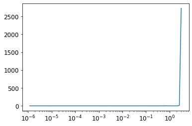

* [A fastai Learner from Scratch](#a-fastai-learner-from-scratch)
* [Data](#data)
* [Module and Parameter](#module-and-parameter)
* [Loss](#loss)
* [Learner](#learner)
* [References](#references)

-----

```python
#hide
!pip install -Uqq fastbook
import fastbook
fastbook.setup_book()
```


```python
#hide
from fastbook import *
```


```python
import inspect
def print_source(obj):
    for line in inspect.getsource(obj).split("\n"):
        print(line)
```


## A fastai Learner from Scratch


## Data


```python
print_source(untar_data)
```
```text
    def untar_data(url, archive=None, data=None, c_key='data', force_download=False):#, extract_func=file_extract, timeout=4):
        "Download `url` to `fname` if `dest` doesn't exist, and extract to folder `dest`"
        d = FastDownload(fastai_cfg(), module=fastai.data, archive=archive, data=data, base='~/.fastai')
        return d.get(url, force=force_download, extract_key=c_key)
```

-----

```python
print_source(fastai_cfg)
```
```text
    @lru_cache(maxsize=None)
    def fastai_cfg():
        "`Config` object for fastai's `config.ini`"
        return Config(Path(os.getenv('FASTAI_HOME', '~/.fastai')), 'config.ini', create=dict(
            data = 'data', archive = 'archive', storage = 'tmp', model = 'models'))
```


#### fastdownload library
* [Documentation](https://fastdownload.fast.ai/)
* easily download, verify, and extract archives

-----


```python
from fastdownload import FastDownload
```

-----


```python
print_source(FastDownload)
```
```text
    class FastDownload:
        def __init__(self, cfg=None, base='~/.fastdownload', archive=None, data=None, module=None):
            base = Path(base).expanduser().absolute()
            default = {'data':(data or 'data'), 'archive':(archive or 'archive')}
            self.cfg = Config(base, 'config.ini', create=default) if cfg is None else cfg
            self.module = checks_module(module)
            if data is not None: self.cfg['data'] = data
            if archive is not None: self.cfg['archive'] = archive
    
        def arch_path(self):
            "Path to archives"
            return self.cfg.path('archive')
    
        def data_path(self, extract_key='data', arch=None):
            "Path to extracted data"
            path = self.cfg.path(extract_key)
            return path if arch is None else path/remove_suffix(arch.stem, '.tar')
    
        def check(self, url, fpath):
            "Check whether size and hash of `fpath` matches stored data for `url` or data is missing"
            checks = read_checks(self.module).get(url)
            return not checks or path_stats(fpath)==checks
    
        def download(self, url, force=False):
            "Download `url` to archive path, unless exists and `self.check` fails and not `force`"
            self.arch_path().mkdir(exist_ok=True, parents=True)
            return download_and_check(url, urldest(url, self.arch_path()), self.module, force)
    
        def rm(self, url, rm_arch=True, rm_data=True, extract_key='data'):
            "Delete downloaded archive and extracted data for `url`"
            arch = urldest(url, self.arch_path())
            if rm_arch: arch.delete()
            if rm_data: self.data_path(extract_key, arch).delete()
    
        def update(self, url):
            "Store the hash and size in `download_checks.py`"
            update_checks(urldest(url, self.arch_path()), url, self.module)
    
        def extract(self, url, extract_key='data', force=False):
            "Extract archive already downloaded from `url`, overwriting existing if `force`"
            arch = urldest(url, self.arch_path())
            if not arch.exists(): raise Exception(f'{arch} does not exist')
            dest = self.data_path(extract_key)
            dest.mkdir(exist_ok=True, parents=True)
            return untar_dir(arch, dest, rename=True, overwrite=force)
    
        def get(self, url, extract_key='data', force=False):
            "Download and extract `url`, overwriting existing if `force`"
            if not force:
                data = self.data_path(extract_key, urldest(url, self.arch_path()))
                if data.exists(): return data
            self.download(url, force=force)
            return self.extract(url, extract_key=extract_key, force=force)
```

-----

```python
import fastdownload
```

-----


```python
print_source(fastdownload.download_and_check)
```
```text
    def download_and_check(url, fpath, fmod, force):
        "Download `url` to `fpath`, unless exists and `check` fails and not `force`"
        if not force and fpath.exists():
            if check(fmod, url, fpath): return fpath
            else: print("Downloading a new version of this dataset...")
        res = download_url(url, fpath)
        if not check(fmod, url, fpath): raise Exception("Downloaded file is corrupt or not latest version")
        return res

```

-----


```python
print_source(fastdownload.download_url)
```
```text
    def download_url(url, dest=None, timeout=None, show_progress=True):
        "Download `url` to `dest` and show progress"
        pbar = progress_bar([])
        def progress(count=1, bsize=1, tsize=None):
            pbar.total = tsize
            pbar.update(count*bsize)
        return urlsave(url, dest, reporthook=progress if show_progress else None, timeout=timeout)
```

-----

```python
urlsave
```
```text
    <function fastcore.net.urlsave(url, dest=None, reporthook=None, timeout=None)>
```

-----

```python
print_source(urlsave)
```
```text
    def urlsave(url, dest=None, reporthook=None, timeout=None):
        "Retrieve `url` and save based on its name"
        dest = urldest(url, dest)
        dest.parent.mkdir(parents=True, exist_ok=True)
        nm,msg = urlretrieve(url, dest, reporthook, timeout=timeout)
        return nm
```

-----

```python
urlretrieve
```
```text
    <function fastcore.net.urlretrieve(url, filename=None, reporthook=None, data=None, timeout=None)>
```

-----

```python
print_source(urlretrieve)
```
```text
    def urlretrieve(url, filename=None, reporthook=None, data=None, timeout=None):
        "Same as `urllib.request.urlretrieve` but also works with `Request` objects"
        with contextlib.closing(urlopen(url, data, timeout=timeout)) as fp:
            headers = fp.info()
            if filename: tfp = open(filename, 'wb')
            else:
                tfp = tempfile.NamedTemporaryFile(delete=False)
                filename = tfp.name
    
            with tfp:
                bs,size,read,blocknum = 1024*8,-1,0,0
                if "content-length" in headers: size = int(headers["Content-Length"])
                if reporthook: reporthook(blocknum, bs, size)
                while True:
                    block = fp.read(bs)
                    if not block: break
                    read += len(block)
                    tfp.write(block)
                    blocknum += 1
                    if reporthook: reporthook(blocknum, bs, size)
    
        if size >= 0 and read < size:
            raise ContentTooShortError(f"retrieval incomplete: got only {read} out of {size} bytes", headers)
        return filename,headers
```

-----

```python
import contextlib
```

-----


```python
print_source(contextlib.closing)
```
```text
    class closing(AbstractContextManager):
        """Context to automatically close something at the end of a block.
    
        Code like this:
    
            with closing(<module>.open(<arguments>)) as f:
                <block>
    
        is equivalent to this:
    
            f = <module>.open(<arguments>)
            try:
                <block>
            finally:
                f.close()
    
        """
        def __init__(self, thing):
            self.thing = thing
        def __enter__(self):
            return self.thing
        def __exit__(self, *exc_info):
            self.thing.close()
```

-----

```python
path = untar_data(URLs.IMAGENETTE_160)
path
```
```text
    Path('/home/innom-dt/.fastai/data/imagenette2-160')
```

-----

```python
t = get_image_files(path)
t[0]
```
```text
    Path('/home/innom-dt/.fastai/data/imagenette2-160/val/n03028079/n03028079_2470.JPEG')
```

-----

```python
print_source(get_image_files)
```
```text
    def get_image_files(path, recurse=True, folders=None):
        "Get image files in `path` recursively, only in `folders`, if specified."
        return get_files(path, extensions=image_extensions, recurse=recurse, folders=folders)
```

-----

```python
image_extensions
```
```text
    {'.art',
     '.bmp',
     '.cdr',
     '.cdt',
     '.cpt',
     '.cr2',
     '.crw',
     '.djv',
     '.djvu',
     '.erf',
     '.gif',
     '.ico',
     '.ief',
     '.jng',
     '.jp2',
     '.jpe',
     '.jpeg',
     '.jpf',
     '.jpg',
     '.jpg2',
     '.jpm',
     '.jpx',
     '.nef',
     '.orf',
     '.pat',
     '.pbm',
     '.pcx',
     '.pgm',
     '.png',
     '.pnm',
     '.ppm',
     '.psd',
     '.ras',
     '.rgb',
     '.svg',
     '.svgz',
     '.tif',
     '.tiff',
     '.wbmp',
     '.xbm',
     '.xpm',
     '.xwd'}
```

-----

```python
print_source(get_files)
```
```text
    def get_files(path, extensions=None, recurse=True, folders=None, followlinks=True):
        "Get all the files in `path` with optional `extensions`, optionally with `recurse`, only in `folders`, if specified."
        path = Path(path)
        folders=L(folders)
        extensions = setify(extensions)
        extensions = {e.lower() for e in extensions}
        if recurse:
            res = []
            for i,(p,d,f) in enumerate(os.walk(path, followlinks=followlinks)): # returns (dirpath, dirnames, filenames)
                if len(folders) !=0 and i==0: d[:] = [o for o in d if o in folders]
                else:                         d[:] = [o for o in d if not o.startswith('.')]
                if len(folders) !=0 and i==0 and '.' not in folders: continue
                res += _get_files(p, f, extensions)
        else:
            f = [o.name for o in os.scandir(path) if o.is_file()]
            res = _get_files(path, f, extensions)
        return L(res)
```

-----

```python
help(os.walk)
```
```text
    Help on function walk in module os:
    
    walk(top, topdown=True, onerror=None, followlinks=False)
        Directory tree generator.
        
        For each directory in the directory tree rooted at top (including top
        itself, but excluding '.' and '..'), yields a 3-tuple
        
            dirpath, dirnames, filenames
        
        dirpath is a string, the path to the directory.  dirnames is a list of
        the names of the subdirectories in dirpath (excluding '.' and '..').
        filenames is a list of the names of the non-directory files in dirpath.
        Note that the names in the lists are just names, with no path components.
        To get a full path (which begins with top) to a file or directory in
        dirpath, do os.path.join(dirpath, name).
        
        If optional arg 'topdown' is true or not specified, the triple for a
        directory is generated before the triples for any of its subdirectories
        (directories are generated top down).  If topdown is false, the triple
        for a directory is generated after the triples for all of its
        subdirectories (directories are generated bottom up).
        
        When topdown is true, the caller can modify the dirnames list in-place
        (e.g., via del or slice assignment), and walk will only recurse into the
        subdirectories whose names remain in dirnames; this can be used to prune the
        search, or to impose a specific order of visiting.  Modifying dirnames when
        topdown is false has no effect on the behavior of os.walk(), since the
        directories in dirnames have already been generated by the time dirnames
        itself is generated. No matter the value of topdown, the list of
        subdirectories is retrieved before the tuples for the directory and its
        subdirectories are generated.
        
        By default errors from the os.scandir() call are ignored.  If
        optional arg 'onerror' is specified, it should be a function; it
        will be called with one argument, an OSError instance.  It can
        report the error to continue with the walk, or raise the exception
        to abort the walk.  Note that the filename is available as the
        filename attribute of the exception object.
        
        By default, os.walk does not follow symbolic links to subdirectories on
        systems that support them.  In order to get this functionality, set the
        optional argument 'followlinks' to true.
        
        Caution:  if you pass a relative pathname for top, don't change the
        current working directory between resumptions of walk.  walk never
        changes the current directory, and assumes that the client doesn't
        either.
        
        Example:
        
        import os
        from os.path import join, getsize
        for root, dirs, files in os.walk('python/Lib/email'):
            print(root, "consumes", end="")
            print(sum(getsize(join(root, name)) for name in files), end="")
            print("bytes in", len(files), "non-directory files")
            if 'CVS' in dirs:
                dirs.remove('CVS')  # don't visit CVS directories
```


**Note:** `os.walk()` is faster than `glob`.


```python
setify
```
```text
    <function fastcore.basics.setify(o)>
```

-----

```python
print_source(setify)
```
```text
    def setify(o):
        "Turn any list like-object into a set."
        return o if isinstance(o,set) else set(listify(o))
```

-----

```python
from glob import glob
```

-----


```python
help(glob)
```
```text
    Help on function glob in module glob:
    
    glob(pathname, *, recursive=False)
        Return a list of paths matching a pathname pattern.
        
        The pattern may contain simple shell-style wildcards a la
        fnmatch. However, unlike fnmatch, filenames starting with a
        dot are special cases that are not matched by '*' and '?'
        patterns.
        
        If recursive is true, the pattern '**' will match any files and
        zero or more directories and subdirectories.
```

-----

```python
files = L(glob(f'{path}/**/*.JPEG', recursive=True)).map(Path)
files[0]
```
```text
    Path('/home/innom-dt/.fastai/data/imagenette2-160/val/n03028079/n03028079_2470.JPEG')
```

-----

```python
im = Image.open(files[0])
im
```


-----


```python
help(Image.open)
```
```text
    Help on function open in module PIL.Image:
    
    open(fp, mode='r', formats=None)
        Opens and identifies the given image file.
        
        This is a lazy operation; this function identifies the file, but
        the file remains open and the actual image data is not read from
        the file until you try to process the data (or call the
        :py:meth:`~PIL.Image.Image.load` method).  See
        :py:func:`~PIL.Image.new`. See :ref:`file-handling`.
        
        :param fp: A filename (string), pathlib.Path object or a file object.
           The file object must implement ``file.read``,
           ``file.seek``, and ``file.tell`` methods,
           and be opened in binary mode.
        :param mode: The mode.  If given, this argument must be "r".
        :param formats: A list or tuple of formats to attempt to load the file in.
           This can be used to restrict the set of formats checked.
           Pass ``None`` to try all supported formats. You can print the set of
           available formats by running ``python3 -m PIL`` or using
           the :py:func:`PIL.features.pilinfo` function.
        :returns: An :py:class:`~PIL.Image.Image` object.
        :exception FileNotFoundError: If the file cannot be found.
        :exception PIL.UnidentifiedImageError: If the image cannot be opened and
           identified.
        :exception ValueError: If the ``mode`` is not "r", or if a ``StringIO``
           instance is used for ``fp``.
        :exception TypeError: If ``formats`` is not ``None``, a list or a tuple.
```

-----

```python
im_t = tensor(im)
im_t.shape
```
```text
    torch.Size([213, 160, 3])
```

-----

```python
help(Path.parent)
```
```text
    Help on property:
    
        The logical parent of the path.
```

-----

```python
lbls = files.map(Self.parent.name()).unique(); lbls
```
```text
    (#10) ['n03028079','n03445777','n03417042','n02102040','n03425413','n03000684','n01440764','n03394916','n03888257','n02979186']
```

-----

```python
!ls $path/'train'
```
```text
    n01440764  n02979186  n03028079  n03417042  n03445777
    n02102040  n03000684  n03394916  n03425413  n03888257
```

-----


```python
val2idx
```
```text
    <function fastcore.basics.val2idx(x)>
```

-----

```python
print_source(val2idx)
```
```text
    def val2idx(x):
        "Dict from value to index"
        return {v:k for k,v in enumerate(x)}
```

-----

```python
v2i = lbls.val2idx(); v2i
```
```text
    {'n03028079': 0,
     'n03445777': 1,
     'n03417042': 2,
     'n02102040': 3,
     'n03425413': 4,
     'n03000684': 5,
     'n01440764': 6,
     'n03394916': 7,
     'n03888257': 8,
     'n02979186': 9}
```


### Dataset


```python
# Define a dataset that returns tuples of inputs and targets from a list filenames
class Dataset:
    def __init__(self, fns): self.fns=fns
    def __len__(self): return len(self.fns)
    def __getitem__(self, i):
        im = Image.open(self.fns[i]).resize((64,64)).convert('RGB')
        # the index mapping for the target value
        y = v2i[self.fns[i].parent.name]
        # scale the input image to the range [0,1]
        return tensor(im).float()/255, tensor(y)
```

**Note:** [`__getitem__`](https://docs.python.org/3/reference/datamodel.html#object.__getitem__) lets you index using the `[]` syntax.


```python
train_filt = L(o.parent.parent.name=='train' for o in files)
```

-----


```python
train_filt
```
```text
    (#13394) [False,False,False,False,False,False,False,False,False,False...]
```

-----

```python
~train_filt
```
```text
    (#13394) [True,True,True,True,True,True,True,True,True,True...]
```


**Note:** [`__invert__`](https://docs.python.org/3/library/operator.html#operator.__invert__): Return the bitwise inverse of the number obj. This is equivalent to `~obj`.


```python
print_source(L.__invert__)
```
```text
        def __invert__(self): return self._new(not i for i in self)
```

-----

```python
print_source(L._new)
```
```text
        def _new(self, items, *args, **kwargs): return type(self)(items, *args, use_list=None, **kwargs)
```

-----

```python
train,valid = files[train_filt],files[~train_filt]
len(train),len(valid)
```
```text
    (9469, 3925)
```

-----

```python
train_ds,valid_ds = Dataset(train),Dataset(valid)
x,y = train_ds[0]
x.shape,y
```
```text
    (torch.Size([64, 64, 3]), tensor(0))
```

-----

```python
show_image(x, title=lbls[y]);
```


-----

```python
show_image
```
```text
    <function fastai.torch_core.show_image(im, ax=None, figsize=None, title=None, ctx=None, cmap=None, norm=None, aspect=None, interpolation=None, alpha=None, vmin=None, vmax=None, origin=None, extent=None, *, filternorm=True, filterrad=4.0, resample=None, url=None, data=None, **kwargs)>
```

-----

```python
print_source(show_image)
```
```text
    @delegates(plt.Axes.imshow, keep=True, but=['shape', 'imlim'])
    def show_image(im, ax=None, figsize=None, title=None, ctx=None, **kwargs):
        "Show a PIL or PyTorch image on `ax`."
        # Handle pytorch axis order
        if hasattrs(im, ('data','cpu','permute')):
            im = im.data.cpu()
            if im.shape[0]<5: im=im.permute(1,2,0)
        elif not isinstance(im,np.ndarray): im=array(im)
        # Handle 1-channel images
        if im.shape[-1]==1: im=im[...,0]
    
        ax = ifnone(ax,ctx)
        if figsize is None: figsize = (_fig_bounds(im.shape[0]), _fig_bounds(im.shape[1]))
        if ax is None: _,ax = plt.subplots(figsize=figsize)
        ax.imshow(im, **kwargs)
        if title is not None: ax.set_title(title)
        ax.axis('off')
        return ax
```

-----

```python
# Define a function to stack individual tuples of independent and dependent variables
# into a mini-batch
def collate(idxs, ds): 
    xb,yb = zip(*[ds[i] for i in idxs])
    return torch.stack(xb),torch.stack(yb)
```

-----


```python
help(torch.stack)
```
```text
    Help on built-in function stack:
    
    stack(...)
        stack(tensors, dim=0, *, out=None) -> Tensor
        
        Concatenates a sequence of tensors along a new dimension.
        
        All tensors need to be of the same size.
        
        Arguments:
            tensors (sequence of Tensors): sequence of tensors to concatenate
            dim (int): dimension to insert. Has to be between 0 and the number
                of dimensions of concatenated tensors (inclusive)
        
        Keyword args:
            out (Tensor, optional): the output tensor.
```

-----

```python
# Create a mini-batch with a batch size of 2
x,y = collate([1,2], train_ds)
x.shape,y
```
```text
    (torch.Size([2, 64, 64, 3]), tensor([0, 0]))
```

-----

```python
class DataLoader:
    def __init__(self, ds, bs=128, shuffle=False, n_workers=1):
        self.ds,self.bs,self.shuffle,self.n_workers = ds,bs,shuffle,n_workers

    def __len__(self): return (len(self.ds)-1)//self.bs+1

    def __iter__(self):
        idxs = L.range(self.ds)
        if self.shuffle: idxs = idxs.shuffle()
        chunks = [idxs[n:n+self.bs] for n in range(0, len(self.ds), self.bs)]
        with ProcessPoolExecutor(self.n_workers) as ex:
            yield from ex.map(collate, chunks, ds=self.ds)
```

-----


```python
ProcessPoolExecutor
```
```text
    fastcore.parallel.ProcessPoolExecutor
```

-----

```python
print_source(ProcessPoolExecutor)
```
```text
    class ProcessPoolExecutor(concurrent.futures.ProcessPoolExecutor):
        "Same as Python's ProcessPoolExecutor, except can pass `max_workers==0` for serial execution"
        def __init__(self, max_workers=defaults.cpus, on_exc=print, pause=0, **kwargs):
            if max_workers is None: max_workers=defaults.cpus
            store_attr()
            self.not_parallel = max_workers==0
            if self.not_parallel: max_workers=1
            super().__init__(max_workers, **kwargs)
    
        def map(self, f, items, *args, timeout=None, chunksize=1, **kwargs):
            if not parallelable('max_workers', self.max_workers, f): self.max_workers = 0
            self.not_parallel = self.max_workers==0
            if self.not_parallel: self.max_workers=1
    
            if self.not_parallel == False: self.lock = Manager().Lock()
            g = partial(f, *args, **kwargs)
            if self.not_parallel: return map(g, items)
            _g = partial(_call, self.lock, self.pause, self.max_workers, g)
            try: return super().map(_g, items, timeout=timeout, chunksize=chunksize)
            except Exception as e: self.on_exc(e)
```

-----

```python
print_source(parallelable)
```
```text
    def parallelable(param_name, num_workers, f=None):
        f_in_main = f == None or sys.modules[f.__module__].__name__ == "__main__"
        if sys.platform == "win32" and IN_NOTEBOOK and num_workers > 0 and f_in_main:
            print("Due to IPython and Windows limitation, python multiprocessing isn't available now.")
            print(f"So `{param_name}` has to be changed to 0 to avoid getting stuck")
            return False
        return True
```


#### Python ProcessPoolExecutor
* [Documentaion](https://docs.python.org/3/library/concurrent.futures.html#concurrent.futures.ProcessPoolExecutor)
* executes calls asynchronously using a pool of processes

**Note:** A parallel data loader is critical because opening and decompressing a JPEG image is slow.


```python
defaults
```
```text
    namespace(cpus=16,
              use_cuda=None,
              activation=torch.nn.modules.activation.ReLU,
              callbacks=[fastai.callback.core.TrainEvalCallback,
                         fastai.learner.Recorder,
                         fastai.callback.progress.ProgressCallback],
              lr=0.001)
```

-----

```python
# Only use 16 workers at most
n_workers = min(16, defaults.cpus)
train_dl = DataLoader(train_ds, bs=128, shuffle=True, n_workers=n_workers)
valid_dl = DataLoader(valid_ds, bs=256, shuffle=False, n_workers=n_workers)
xb,yb = first(train_dl)
xb.shape,yb.shape,len(train_dl)
```
```text
    (torch.Size([128, 64, 64, 3]), torch.Size([128]), 74)
```


**Note:** This dataloader is nearly as fast as the one provided by PyTorch.


```python
# Calculate the mean and standard deviation for the mini-batch
stats = [xb.mean((0,1,2)),xb.std((0,1,2))]
stats
```
```text
    [tensor([0.4697, 0.4648, 0.4382]), tensor([0.2758, 0.2752, 0.2963])]
```

-----

```python
# Define a class to store and apply the mean and standard deviation for the data
class Normalize:
    def __init__(self, stats): self.stats=stats
    def __call__(self, x):
        if x.device != self.stats[0].device:
            self.stats = to_device(self.stats, x.device)
        return (x-self.stats[0])/self.stats[1]
```


```python
norm = Normalize(stats)
# Normalize the input and swap convert from HWC to CHW
def tfm_x(x): return norm(x).permute((0,3,1,2))
```

**Recall:** PIL uses HWC axis order for images while PyTorch uses NCHW axis order. 


```python
t = tfm_x(x)
t.mean((0,2,3)),t.std((0,2,3))
```
```text
    (tensor([-0.1890, -0.2993, -0.4721]), tensor([0.6051, 0.5759, 0.7124]))
```


## Module and Parameter


```python
# The parameter class just sets requires_grad_ to True for its tensor
class Parameter(Tensor):
    def __new__(self, x): return Tensor._make_subclass(Parameter, x, True)
    def __init__(self, *args, **kwargs): self.requires_grad_()
```

**Note:** [`__new__`](https://docs.python.org/3/reference/datamodel.html#object.__new__): Called to create a new instance of class cls.
* Called before `__init__`

-----


```python
Parameter(tensor(3.))
```
```text
    tensor(3., requires_grad=True)
```

-----

```python
class Module:
    def __init__(self):
        self.hook,self.params,self.children,self._training = None,[],[],False
        
    def register_parameters(self, *ps): self.params += ps
    def register_modules   (self, *ms): self.children += ms
        
    @property
    def training(self): return self._training
    @training.setter
    def training(self,v):
        self._training = v
        for m in self.children: m.training=v
            
    def parameters(self):
        # Get parameters for the Module and any child Modules recursively
        return self.params + sum([m.parameters() for m in self.children], [])

    # Called anytime Python sets an attribute for the class
    def __setattr__(self,k,v):
        super().__setattr__(k,v)
        # Check if the new value is a Parameter
        if isinstance(v,Parameter): self.register_parameters(v)
        # Check if the new value is a Module
        if isinstance(v,Module):    self.register_modules(v)
        
    def __call__(self, *args, **kwargs):
        # The forward method needs to be implemented by a subclass
        res = self.forward(*args, **kwargs)
        # Call any attached hooks after the forward pass
        if self.hook is not None: self.hook(res, args)
        return res
    
    def cuda(self):
        # Move all parameters to the GPU
        for p in self.parameters(): p.data = p.data.cuda()
```


```python
sum([[4],[5],[6]],[1,2,3])
```
```text
    [1, 2, 3, 4, 5, 6]
```

-----

```python
# Inherit from the custom Module class
class ConvLayer(Module):
    def __init__(self, ni, nf, stride=1, bias=True, act=True):
        super().__init__()
        self.w = Parameter(torch.zeros(nf,ni,3,3))
        self.b = Parameter(torch.zeros(nf)) if bias else None
        self.act,self.stride = act,stride
        init = nn.init.kaiming_normal_ if act else nn.init.xavier_normal_
        init(self.w)
    # Implement the forward function
    def forward(self, x):
        x = F.conv2d(x, self.w, self.b, stride=self.stride, padding=1)
        if self.act: x = F.relu(x)
        return x
```

-----


```python
# A single 3-channel 28x28 image
inp = torch.randn(1, 3, 28, 28)
# A single 3x3 convolutional kernel for a 3-channel image
w = torch.randn(1, 3, 3, 3)
```

-----


```python
# Extracts sliding local blocks
inp_unf = torch.nn.functional.unfold(inp, (3, 3))
inp_unf.shape
```
```text
    torch.Size([1, 27, 676])
```


**Note:** No padding and a stride of $1$ so we go from $28x28$ to $26x26$ ($26x26=676$).


```python
inp[0][0][0][:9]
```
```text
    tensor([ 1.9269,  1.4873,  0.9007, -2.1055,  0.6784, -1.2345, -0.0431, -1.6047, -0.7521])
```

-----

```python
inp_unf[0][0][:9]
```
```text
    tensor([ 1.9269,  1.4873,  0.9007, -2.1055,  0.6784, -1.2345, -0.0431, -1.6047, -0.7521])
```

-----

```python
inp[0][0][1][:9]
```
```text
    tensor([-0.2316,  0.0418, -0.2516,  0.8599, -1.3847, -0.8712, -0.2234,  1.7174,  0.3189])
```

-----

```python
inp_unf[0][3][:9]
```
```text
    tensor([-0.2316,  0.0418, -0.2516,  0.8599, -1.3847, -0.8712, -0.2234,  1.7174,  0.3189])
```

-----

```python
inp_unf.transpose(1, 2).shape
```
```text
    torch.Size([1, 676, 27])
```

-----

```python
w.view(w.size(0), -1).t().shape
```
```text
    torch.Size([27, 1])
```

-----

```python
out_unf = inp_unf.transpose(1, 2).matmul(w.view(w.size(0), -1).t()).transpose(1, 2)
out_unf.shape
```
```text
    torch.Size([1, 1, 676])
```

-----

```python
out_unf.view(1,1,inp.shape[2]-2,inp.shape[3]-2)[0][0][0]
```
```text
    tensor([  2.1036,   3.9867, -11.0306,  -4.8908,  -5.1374,   0.4219,   6.1278,  -1.9733,   4.0213,   0.3114,  -8.5303,   5.3541,   6.5859,  -4.0149,   4.5094,  -5.4661,   2.4601,  -4.3120,   1.3568,
             -1.8379,   0.1750,  -1.6839,   4.5438,  -1.2521,  -1.9825,  -4.2498])
```

-----

```python
torch.nn.functional.conv2d(inp, w).shape, torch.nn.functional.conv2d(inp, w)[0][0][0]
```
```text
    (torch.Size([1, 1, 26, 26]),
     tensor([  2.1036,   3.9867, -11.0306,  -4.8908,  -5.1374,   0.4219,   6.1278,  -1.9733,   4.0213,   0.3114,  -8.5303,   5.3541,   6.5859,  -4.0149,   4.5094,  -5.4661,   2.4601,  -4.3120,   1.3568,
              -1.8379,   0.1750,  -1.6839,   4.5438,  -1.2521,  -1.9825,  -4.2498]))
```

-----

```python
l = ConvLayer(3, 4)
len(l.parameters())
```
```text
    2
```

-----

```python
xbt = tfm_x(xb)
r = l(xbt)
r.shape
```
```text
    torch.Size([128, 4, 64, 64])
```

-----

```python
class Linear(Module):
    def __init__(self, ni, nf):
        super().__init__()
        self.w = Parameter(torch.zeros(nf,ni))
        self.b = Parameter(torch.zeros(nf))
        nn.init.xavier_normal_(self.w)
    
    def forward(self, x): return x@self.w.t() + self.b
```


```python
l = Linear(4,2)
r = l(torch.ones(3,4))
r.shape
```
```text
    torch.Size([3, 2])
```

-----

```python
# A test class to confirm that mu;tiple parameters are properly registered
class T(Module):
    def __init__(self):
        super().__init__()
        self.c,self.l = ConvLayer(3,4),Linear(4,2)
```

-----


```python
t = T()
len(t.parameters())
```
```text
    4
```


**Note:** A weight and bias parameter for both of the layers should add up to for total parameters.


```python
# Verify the cuda() method moves all the parameters to the GPU
t.cuda()
# Check the device for the linear layer weights parameter
t.l.w.device
```
```text
    device(type='cuda', index=0)
```


### Simple CNN


```python
class Sequential(Module):
    def __init__(self, *layers):
        super().__init__()
        self.layers = layers
        # A Sequential Module will contain a list of other Modules
        self.register_modules(*layers)

    # Call each layer in sequential order
    def forward(self, x):
        for l in self.layers: x = l(x)
        return x
```

-----


```python
class AdaptivePool(Module):
    # Pool input values to a 1x1 output
    def forward(self, x): return x.mean((2,3))
```

-----


```python
def simple_cnn():
    return Sequential(
        ConvLayer(3 ,16 ,stride=2), #32
        ConvLayer(16,32 ,stride=2), #16
        ConvLayer(32,64 ,stride=2), # 8
        ConvLayer(64,128,stride=2), # 4
        AdaptivePool(),
        Linear(128, 10)
    )
```

-----


```python
m = simple_cnn()
len(m.parameters())
```
```text
    10
```


**Note:** Five layers each with a weights parameter and a bias parameter. (plus a pooling layer)


```python
# Add a hook to print the mean and standard deviation of the activations for each ConvLayer
def print_stats(outp, inp): print (outp.mean().item(),outp.std().item())
for i in range(4): m.layers[i].hook = print_stats

r = m(xbt)
r.shape
```
```text
    0.5312516689300537 0.9105479121208191
    0.4804598093032837 0.872667133808136
    0.4145401120185852 0.7496744990348816
    0.440979540348053 0.7261776924133301

    torch.Size([128, 10])
```


## Loss


```python
def nll(input, target): return -input[range(target.shape[0]), target].mean()
```

-----


```python
def log_softmax(x): return x - x.exp().sum(-1,keepdim=True).log()
sm = log_softmax(r); sm[0][0]
```
```text
    tensor(-2.5062, grad_fn=<AliasBackward0>)
```

-----

```python
loss = nll(sm, yb)
loss
```
```text
    tensor(2.6062, grad_fn=<AliasBackward0>)
```

-----

```python
x = torch.rand(5)
a = x.max()
x.exp().sum().log() == a + (x-a).exp().sum().log()
```
```text
    tensor(False)
```


### LogSumExp Trick
* [Explanation](https://blog.feedly.com/tricks-of-the-trade-logsumexp/)
* a more stable way (for computers) to compute the log of the sum of exponentials
$$\log{\left( \sum^{n}_{j=1}{e^{x_{j}}} \right)} = \log{\left(e^{a} \sum^{n}_{j=1}{e^{x_{j}-a}} \right)} = a + \log{\left(\sum^{n}_{j=1}{e^{x_{j}-a}} \right)}$$
* where $a$ is the maximum of $x_{j}$

-----


```python
x = torch.rand(5)
a = x.max()
x.exp().sum().log() == a + (x-a).exp().sum().log()
```
```text
    tensor(True)
```

-----

```python
def logsumexp(x):
    m = x.max(-1)[0]
    return m + (x-m[:,None]).exp().sum(-1).log()

logsumexp(r)[0]
```
```text
    tensor(2.6922, grad_fn=<AliasBackward0>)
```

-----

```python
def log_softmax(x): return x - x.logsumexp(-1,keepdim=True)
```

-----


```python
sm = log_softmax(r); sm[0][0]
```
```text
    tensor(-2.5062, grad_fn=<AliasBackward0>)
```

-----

```python
def cross_entropy(preds, yb): return nll(log_softmax(preds), yb).mean()
```


## Learner


```python
class SGD:
    def __init__(self, params, lr, wd=0.): store_attr()
    def step(self):
        for p in self.params:
            # SGD plus weight decay
            p.data -= (p.grad.data + p.data*self.wd) * self.lr
            p.grad.data.zero_()
```

-----


```python
print_source(store_attr)
```
```text
    def store_attr(names=None, self=None, but='', cast=False, store_args=None, **attrs):
        "Store params named in comma-separated `names` from calling context into attrs in `self`"
        fr = sys._getframe(1)
        args = argnames(fr, True)
        if self: args = ('self', *args)
        else: self = fr.f_locals[args[0]]
        if store_args is None: store_args = not hasattr(self,'__slots__')
        if store_args and not hasattr(self, '__stored_args__'): self.__stored_args__ = {}
        anno = annotations(self) if cast else {}
        if names and isinstance(names,str): names = re.split(', *', names)
        ns = names if names is not None else getattr(self, '__slots__', args[1:])
        added = {n:fr.f_locals[n] for n in ns}
        attrs = {**attrs, **added}
        if isinstance(but,str): but = re.split(', *', but)
        attrs = {k:v for k,v in attrs.items() if k not in but}
        return _store_attr(self, anno, **attrs)
```

-----

```python
help(sys._getframe)
```
```text
    Help on built-in function _getframe in module sys:
    
    _getframe(depth=0, /)
        Return a frame object from the call stack.
        
        If optional integer depth is given, return the frame object that many
        calls below the top of the stack.  If that is deeper than the call
        stack, ValueError is raised.  The default for depth is zero, returning
        the frame at the top of the call stack.
        
        This function should be used for internal and specialized purposes
        only.
```

-----

```python
print_source(argnames)
```
```text
    def argnames(f, frame=False):
        "Names of arguments to function or frame `f`"
        code = getattr(f, 'f_code' if frame else '__code__')
        return code.co_varnames[:code.co_argcount+code.co_kwonlyargcount]
```

-----

```python
print_source(annotations)
```
```text
    def annotations(o):
        "Annotations for `o`, or `type(o)`"
        res = {}
        if not o: return res
        res = type_hints(o)
        if not res: res = type_hints(getattr(o,'__init__',None))
        if not res: res = type_hints(type(o))
        return res
```

-----

```python
# A class that just stores the training and validation datasets
class DataLoaders:
    def __init__(self, *dls): self.train,self.valid = dls

dls = DataLoaders(train_dl,valid_dl)
```

-----


```python
class Learner:
    def __init__(self, model, dls, loss_func, lr, cbs, opt_func=SGD):
        store_attr()
        # Let each callback know what Learner it is being used in
        for cb in cbs: cb.learner = self

    def one_batch(self):
        # Call the before_batch callback
        self('before_batch')
        xb,yb = self.batch
        self.preds = self.model(xb)
        self.loss = self.loss_func(self.preds, yb)
        if self.model.training:
            self.loss.backward()
            self.opt.step()
        # Call the after_batch callback
        self('after_batch')

    def one_epoch(self, train):
        self.model.training = train
        # Call the before_epoch callback
        self('before_epoch')
        # Select dataset based on whether we are in training or validation mode
        dl = self.dls.train if train else self.dls.valid
        # Iterate through the current dataset one batch at a time
        for self.num,self.batch in enumerate(progress_bar(dl, leave=False)):
            self.one_batch()
        # Call the after_epoch callback
        self('after_epoch')
    
    def fit(self, n_epochs):
        # Call the before_fit callback
        self('before_fit')
        self.opt = self.opt_func(self.model.parameters(), self.lr)
        self.n_epochs = n_epochs
        try:
            for self.epoch in range(n_epochs):
                # Complete a full pass through the training dataset
                self.one_epoch(True)
                # Complete a full pass through the validation dataset
                self.one_epoch(False)
        except CancelFitException: pass
        # Call the after_fit callback
        self('after_fit')
        
    def __call__(self,name):
        for cb in self.cbs: getattr(cb,name,noop)()
```


### Callbacks


```python
# Automatically pass requests to change attributes that don't exist to the `_default`
class Callback(GetAttr): _default='learner'
```

-----


```python
GetAttr
```
```text
    fastcore.basics.GetAttr
```

-----

```python
print_source(GetAttr)
```
```text
    class GetAttr:
        "Inherit from this to have all attr accesses in `self._xtra` passed down to `self.default`"
        _default='default'
        def _component_attr_filter(self,k):
            if k.startswith('__') or k in ('_xtra',self._default): return False
            xtra = getattr(self,'_xtra',None)
            return xtra is None or k in xtra
        def _dir(self): return [k for k in dir(getattr(self,self._default)) if self._component_attr_filter(k)]
        def __getattr__(self,k):
            if self._component_attr_filter(k):
                attr = getattr(self,self._default,None)
                if attr is not None: return getattr(attr,k)
            raise AttributeError(k)
        def __dir__(self): return custom_dir(self,self._dir())
    #     def __getstate__(self): return self.__dict__
        def __setstate__(self,data): self.__dict__.update(data)
```

-----

```python
help(getattr)
```
```text
    Help on built-in function getattr in module builtins:
    
    getattr(...)
        getattr(object, name[, default]) -> value
        
        Get a named attribute from an object; getattr(x, 'y') is equivalent to x.y.
        When a default argument is given, it is returned when the attribute doesn't
        exist; without it, an exception is raised in that case.
```


**Note:** [`__dir__`](https://docs.python.org/3/reference/datamodel.html#object.__dir__): Called when [`dir()`](https://docs.python.org/3/library/functions.html#dir) is called on an object


```python
dir(Callback)
```
```text
    ['__class__',
     '__delattr__',
     '__dict__',
     '__dir__',
     '__doc__',
     '__eq__',
     '__format__',
     '__ge__',
     '__getattr__',
     '__getattribute__',
     '__gt__',
     '__hash__',
     '__init__',
     '__init_subclass__',
     '__le__',
     '__lt__',
     '__module__',
     '__ne__',
     '__new__',
     '__reduce__',
     '__reduce_ex__',
     '__repr__',
     '__setattr__',
     '__setstate__',
     '__sizeof__',
     '__str__',
     '__subclasshook__',
     '__weakref__',
     '_component_attr_filter',
     '_default',
     '_dir']
```

-----

```python
# A callback that moves all model parameters to the GPU at the start of the Learner.fit() method
class SetupLearnerCB(Callback):
    def before_batch(self):
        xb,yb = to_device(self.batch)
        self.learner.batch = tfm_x(xb),yb

    def before_fit(self): self.model.cuda()
```

-----


```python
# A callback to track training progress
class TrackResults(Callback):
    def before_epoch(self): self.accs,self.losses,self.ns = [],[],[]
        
    def after_epoch(self):
        n = sum(self.ns)
        print(self.epoch, self.model.training,
              sum(self.losses).item()/n, sum(self.accs).item()/n)
        
    def after_batch(self):
        xb,yb = self.batch
        acc = (self.preds.argmax(dim=1)==yb).float().sum()
        self.accs.append(acc)
        n = len(xb)
        self.losses.append(self.loss*n)
        self.ns.append(n)
```

-----


```python
# Test the learner
cbs = [SetupLearnerCB(),TrackResults()]
learn = Learner(simple_cnn(), dls, cross_entropy, lr=0.1, cbs=cbs)
learn.model
```
```text
    <__main__.Sequential at 0x7f15bd1d2bb0>
```

-----

```python
learn.cbs
```
```text
    [<__main__.SetupLearnerCB at 0x7f15bfee94c0>,
     <__main__.TrackResults at 0x7f15bfee9430>]
```

-----

```python
learn.cbs[0].model
```
```text
    <__main__.Sequential at 0x7f15bd1d2bb0>
```

-----

```python
learn.fit(1)
```
```text
    0 True 2.124386154820995 0.23592776428345127

    0 False 2.206350766321656 0.2140127388535032
```


### Scheduling the Learning Rate


```python
class LRFinder(Callback):
    def before_fit(self):
        self.losses,self.lrs = [],[]
        self.learner.lr = 1e-6
        
    def before_batch(self):
        if not self.model.training: return
        self.opt.lr *= 1.2

    def after_batch(self):
        if not self.model.training: return
        if self.opt.lr>10 or torch.isnan(self.loss): raise CancelFitException
        self.losses.append(self.loss.item())
        self.lrs.append(self.opt.lr)
```

-----


```python
lrfind = LRFinder()
learn = Learner(simple_cnn(), dls, cross_entropy, lr=0.1, cbs=cbs+[lrfind])
learn.fit(2)
```
```text
    0 True 2.3831190100591404 0.12894709050586123

    0 False 3.06156648089172 0.0889171974522293
```

-----

```python
plt.plot(lrfind.lrs[:-2],lrfind.losses[:-2])
plt.xscale('log')
```


-----

```python
class OneCycle(Callback):
    def __init__(self, base_lr): self.base_lr = base_lr
    def before_fit(self): self.lrs = []

    def before_batch(self):
        if not self.model.training: return
        n = len(self.dls.train)
        bn = self.epoch*n + self.num
        mn = self.n_epochs*n
        pct = bn/mn
        pct_start,div_start = 0.25,10
        if pct<pct_start:
            pct /= pct_start
            lr = (1-pct)*self.base_lr/div_start + pct*self.base_lr
        else:
            pct = (pct-pct_start)/(1-pct_start)
            lr = (1-pct)*self.base_lr
        self.opt.lr = lr
        self.lrs.append(lr)
```

-----


```python
onecyc = OneCycle(0.1)
learn = Learner(simple_cnn(), dls, cross_entropy, lr=0.1, cbs=cbs+[onecyc])
```

-----


```python
learn.fit(8)
```
```text

    0 True 2.260071103733235 0.1608406378709473
    
    0 False 2.204750696656051 0.22038216560509555
    
    1 True 2.0790218410074983 0.25873904319357904
    
    1 False 2.020204518312102 0.267515923566879
    
    2 True 1.9341191074163058 0.32041398246910974
    
    2 False 1.837548765923567 0.36178343949044584
    
    3 True 1.8241042728244798 0.3763861020171085
    
    3 False 1.780602980692675 0.381656050955414
    
    4 True 1.7337240270883938 0.403210476291055
    
    4 False 1.7259341411226115 0.41095541401273883
    
    5 True 1.6540151167625938 0.4310909282923223
    
    5 False 1.6680330662818472 0.41859872611464966
    
    6 True 1.5874014671229804 0.4634069067483367
    
    6 False 1.6006179090366242 0.4601273885350318
    
    7 True 1.5361670525200655 0.4771359172035062
    
    7 False 1.5802234275477707 0.4682802547770701
```


```python
plt.plot(onecyc.lrs);
```


## References

* [Deep Learning for Coders with fastai & PyTorch](https://www.oreilly.com/library/view/deep-learning-for/9781492045519/)
* [The fastai book GitHub Repository](https://github.com/fastai/fastbook)


**Previous:** [Notes on fastai Book Ch. 18](../chapter-18/)