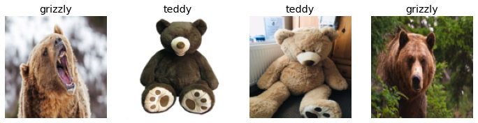
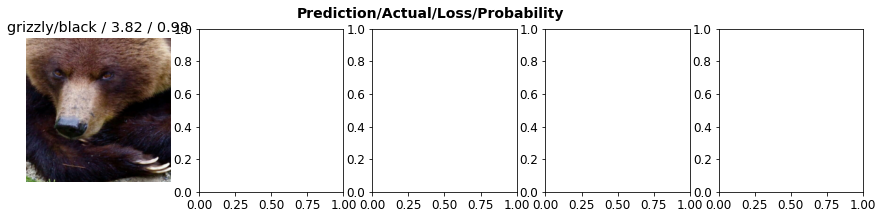

* [The Practice of Deep Learning](#the-practice-of-deep-learning)
* [Gathering Data](#gathering-data)
* [From Data to DataLoaders](#from-data-to-dataloaders)
* [Using a Model to Clean Your Data](#using-a-model-to-clean-your-data)
* [Turn Your Model into an Online Application](#turn-your-model-into-an-online-application)
* [How to Avoid Disaster](#how-to-avoid-disaster)
* [References](#references)


## The Practice of Deep Learning

- Keep an open mind
- Underestimating the constraints and overestimating the capabilities of deep learning may lead to poor results
- Overestimating the constraints and underestimating the capabilities of deep learning may lead prevent you from exploring solvable problems
- Design a process through which you can find the specific capabilities and constraints related to your particular problem

### Starting Your Project

- Data availability is the most important consideration when selecting a deep learning project
- Do not attempt to find the “perfect” dataset
    - Just get started and iterate

- Iterate from end-to-end
    - Don’t spend months fine-tuning your model, polishing the GUI, or labeling the perfect dataset
    - Complete every step as well as you can in a reasonable amount of time
    - If your final goal is an application that runs on a mobile phone, that should be what you have after each iteration
    - Can take shortcuts in early iterations like running the model on a remote server rather than on device
    - Iteration exposes the trickiest bits and which bits make the biggest difference to the final result
    - Gives you a better understanding of how much data you really need
    - Gives you a working prototype to demo your project
        - The secret to getting good organizational buy-in for a project
- It is easiest to get started on a project for which you already have available data
- Can sometimes find a relevant dataset created for a previous machine learning project
- Start with projects in areas that deep learning has already been shown to work

### The State of Deep Learning (Early 2020)

#### Computer Vision

- Deep learning has been shown to recognize items in an image at least as well as people in nearly every domain
    - Known as object recognition
- Deep learning is good at locating objects in an image
    - Known as object detection
    - Labeling images for object detection can be slow and expensive
- Deep learning models are generally not good at recognizing images that are significantly different in structure or style from those used to train the model
    - Color images vs black and white images
    - Real images vs hand drawn images
- It is often possible to represent data for a non-computer vision problem as an image

#### Text (Natural Language Processing)

- Deep learning is good at classifying both short and long documents based on categories
    - Spam vs not spam
    - Positive vs negative reviews
    - Author
    - Source website
- Deep learning is good at generating context-appropriate text
    - Replies to social media posts
    - Imitating a particular author’s style
- Deep learning is not good at generating correct responses
- We do not have a reliable way to combine a knowledge base with a deep learning model to generate factually accurate responses
- Danger of deep learning models being used at scale to generate context appropriate, highly compelling responses on social media to spread disinformation, create unrest and encourage conflict
    - Text generation models will always be a bit ahead of models for automatically recognizing generated text
    - Models for automatically recognizing generated text can be used to improve text generation models
- Deep learning has many applications in NLP
    - Translating text between languages
        - The translation might include completely incorrect information
    - Summarizing long documents
        - The translation might include completely incorrect information
    - Find all mentions of a concept of interest
- Avoid using deep learning as an entirely automated process when it is generating text that needs to be accurate
    - Instead use is as part of a process in which the model and a human user closely interact

#### Combining Text and Images

- Deep learning models can combine both text and images
    - Generate captions based on an input image

#### Tabular Data

- Deep learning has made significant improvements but is still used as part of an ensemble of multiple types of model
- Greatly increases the variety of columns that you can include
    - Columns containing natural language
        - Book titles
        - Reviews
    - High-cardinality categorical columns
        - Something that contains a large number of discrete choices
            - Zip code
            - Product id
- Deep learning models generally take longer to train than more traditional methods like random forests or gradient boosting machines
    - This is changing thanks to libraries such as [RAPIDS](https://rapids.ai/) which provides GPU acceleration

#### Recommendation Systems

- A special type of tabular data
    - Generally have a high-cardinality categorical variable representing users and another representing things to recommend (e.g. products)
- Deep learning models are good at handling recommendation systems since they are good at handling high-cardinality categorical variables
- Nearly all machine learning approaches have the downside that they tell you only which products  a particular user might like rather than what recommendation would be helpful to a user
    - A recommendation system might recommend nothing but hammers because you recently bought a hammer

#### Other Data Types

- Domain-specific data types often fit well into existing categories
    - Protein chains look a lot like natural language documents
        - Long sequences of discrete tokens with complex relationships and meaning throughout the sequence
    - Sounds can be represented in image format as spectrograms

### The Drivetrain Approach

- [Designing great data products](https://www.oreilly.com/radar/drivetrain-approach-data-products/)
- Data scientists need a systematic design approach to build increasingly sophisticated products
    - We use data to produce actionable outcomes
    - Practical implementation of models requires a lot more than just training the model
- Defined Objective → Levers → Data → Models
- Steps
    1. Defined Objective
        - Consider your objective
    2. Levers
        - What inputs can we control?
        - Think about what actions you can take to meet that objective
    3. Data
        - What inputs can we collect?
        - Think about what data you have or can acquire that can help
    4. Models
        - Build a model that you can use to determine the best actions to take to get the best results in terms of your objective
        - The models we can build are determined by the objective, available levers and available data


## Gathering Data

- Can often find the data you need for a project online
- [Bing Web Search API](https://www.microsoft.com/en-us/bing/apis/bing-web-search-api)
    - Can be used to download images from web searches
- Models can only reflect the data used to train them
    - Think carefully about the types of data that you expect to see in production and make sure all these types are reflected in your model’s source data
- [Actionable Auditing: Investigating the Impact of Publicly Naming Biased Performance Results of Commercial AI Products](https://dl.acm.org/doi/10.1145/3306618.3314244)

-----

```python
import pandas as pd
```


```python
import os
key = os.environ.get('AZURE_SEARCH_KEY', 'f4be28837a074dfa90a1b72900a971ef')
```

-----

```python
search_images_bing
```
```text
<function fastbook.search_images_bing(key, term, min_sz=128, max_images=150)>
```

-----
```python
results = search_images_bing(key, 'grizzly bear')
```

-----

```python
print(type(results))
print(f"Number of results: {len(results)}")
```

```text
<class 'fastcore.foundation.L'>
Number of results: 150
```

-----


```python
pd.DataFrame(results).head()
```

<div style="overflow-x:auto;">
<table border="1" class="dataframe">
  <thead>
    <tr style="text-align: right;">
      <th></th>
      <th>webSearchUrl</th>
      <th>name</th>
      <th>thumbnailUrl</th>
      <th>datePublished</th>
      <th>isFamilyFriendly</th>
      <th>contentUrl</th>
      <th>hostPageUrl</th>
      <th>contentSize</th>
      <th>encodingFormat</th>
      <th>hostPageDisplayUrl</th>
      <th>width</th>
      <th>height</th>
      <th>hostPageFavIconUrl</th>
      <th>hostPageDomainFriendlyName</th>
      <th>hostPageDiscoveredDate</th>
      <th>thumbnail</th>
      <th>imageInsightsToken</th>
      <th>insightsMetadata</th>
      <th>imageId</th>
      <th>accentColor</th>
      <th>creativeCommons</th>
    </tr>
  </thead>
  <tbody>
    <tr>
      <th>0</th>
      <td>https://www.bing.com/images/search?view=detailv2&amp;FORM=OIIRPO&amp;q=grizzly+bear&amp;id=4FE226180F7071D1B3F36B29C2EA074B00E3CBEC&amp;simid=607989609245709244</td>
      <td>Grizzly Bear Basic Facts And New Pictures | The Wildlife</td>
      <td>https://tse1.mm.bing.net/th?id=OIP.Mw_Mi-jVWv9_0SNTuiGaSQHaE8&amp;pid=Api</td>
      <td>2012-10-15T12:00:00.0000000Z</td>
      <td>True</td>
      <td>http://2.bp.blogspot.com/-NjMTuklENdE/UHzVv_8dIxI/AAAAAAAAA-U/tNBsQDn8kFI/s1600/Grizzly+Bear+Pic.jpg</td>
      <td>http://wildlifeanimalz.blogspot.com/2012/10/Grizzly-Bear.html</td>
      <td>332689 B</td>
      <td>jpeg</td>
      <td>wildlifeanimalz.blogspot.com/2012/10/Grizzly-Bear.html</td>
      <td>1600</td>
      <td>1068</td>
      <td>https://www.bing.com/th?id=ODF.kCKFU1-d0l3Elu2Vvbpmew&amp;pid=Api</td>
      <td>blogspot.com</td>
      <td>2012-10-15T12:00:00.0000000Z</td>
      <td>{'width': 474, 'height': 316}</td>
      <td>ccid_Mw/Mi+jV*cp_433560BB77158852D3AB8C7F61E351BF*mid_4FE226180F7071D1B3F36B29C2EA074B00E3CBEC*simid_607989609245709244*thid_OIP.Mw!_Mi-jVWv9!_0SNTuiGaSQHaE8</td>
      <td>{'recipeSourcesCount': 0, 'pagesIncludingCount': 37, 'availableSizesCount': 22}</td>
      <td>4FE226180F7071D1B3F36B29C2EA074B00E3CBEC</td>
      <td>8C623F</td>
      <td>NaN</td>
    </tr>
    <tr>
      <th>1</th>
      <td>https://www.bing.com/images/search?view=detailv2&amp;FORM=OIIRPO&amp;q=grizzly+bear&amp;id=753BAE8D7E8284DA0D378113DB437A15800814ED&amp;simid=608022027642737229</td>
      <td>The Legacy of Big Boy the Grizzly Bear | Blog | Nature | PBS</td>
      <td>https://tse4.mm.bing.net/th?id=OIP.P710tottl5nl_DmTEEDv-gHaEK&amp;pid=Api</td>
      <td>2018-08-22T02:23:00.0000000Z</td>
      <td>True</td>
      <td>http://www.pbs.org/wnet/nature/files/2018/07/Bear133.jpg</td>
      <td>http://www.pbs.org/wnet/nature/blog/legacy-big-boy-grizzly-bear/</td>
      <td>631006 B</td>
      <td>jpeg</td>
      <td>www.pbs.org/wnet/nature/blog/legacy-big-boy-grizzly-bear</td>
      <td>1920</td>
      <td>1080</td>
      <td>https://www.bing.com/th?id=ODF.6ks36T98eL13adVA4nwLZA&amp;pid=Api</td>
      <td>PBS</td>
      <td>2018-08-21T00:00:00.0000000Z</td>
      <td>{'width': 474, 'height': 266}</td>
      <td>ccid_P710tott*cp_0F0D46773348FABEE8C97ACBB9037F98*mid_753BAE8D7E8284DA0D378113DB437A15800814ED*simid_608022027642737229*thid_OIP.P710tottl5nl!_DmTEEDv-gHaEK</td>
      <td>{'pagesIncludingCount': 21, 'availableSizesCount': 10}</td>
      <td>753BAE8D7E8284DA0D378113DB437A15800814ED</td>
      <td>717C4F</td>
      <td>NaN</td>
    </tr>
    <tr>
      <th>2</th>
      <td>https://www.bing.com/images/search?view=detailv2&amp;FORM=OIIRPO&amp;q=grizzly+bear&amp;id=CB17B3DC66E2F4684C9CA770135FF2F3D1B2070D&amp;simid=608018286723871513</td>
      <td>Idaho Grizzly Bears are Waking Up, Emerging from Dens</td>
      <td>https://tse4.mm.bing.net/th?id=OIP.H3h0vO_c6L61im-L99pEegHaE8&amp;pid=Api</td>
      <td>2015-04-22T09:38:00.0000000Z</td>
      <td>True</td>
      <td>https://tetonvalleylodge.com/wp-content/uploads/2015/04/grizzly-bear-idaho.jpg</td>
      <td>https://tetonvalleylodge.com/grizzly-bears-idaho-are-waking-up/</td>
      <td>477917 B</td>
      <td>jpeg</td>
      <td>https://tetonvalleylodge.com/grizzly-bears-idaho-are-waking-up</td>
      <td>3150</td>
      <td>2100</td>
      <td>NaN</td>
      <td>NaN</td>
      <td>2015-04-22T09:38:24.0000000Z</td>
      <td>{'width': 474, 'height': 316}</td>
      <td>ccid_H3h0vO/c*cp_9AD6DD7A0450257A1DD35511F3C7D0B5*mid_CB17B3DC66E2F4684C9CA770135FF2F3D1B2070D*simid_608018286723871513*thid_OIP.H3h0vO!_c6L61im-L99pEegHaE8</td>
      <td>{'recipeSourcesCount': 0, 'pagesIncludingCount': 6, 'availableSizesCount': 3}</td>
      <td>CB17B3DC66E2F4684C9CA770135FF2F3D1B2070D</td>
      <td>846847</td>
      <td>NaN</td>
    </tr>
    <tr>
      <th>3</th>
      <td>https://www.bing.com/images/search?view=detailv2&amp;FORM=OIIRPO&amp;q=grizzly+bear&amp;id=92DD5424F3ECF22292A0A370FE25492F4057F1C6&amp;simid=608029569602050472</td>
      <td>Grizzly Bear forum Ellen downtown Bozeman – March 2, 2019</td>
      <td>https://tse3.mm.bing.net/th?id=OIP.zMGLZFixVpyMGWZOH8oe3QHaEN&amp;pid=Api</td>
      <td>2019-03-02T12:00:00.0000000Z</td>
      <td>True</td>
      <td>https://bozone.com/site/wp-content/uploads/2019/03/GRIZZLY.jpeg</td>
      <td>https://bozone.com/grizzly-bear-forum-ellen-downtown-bozeman-march-2-2019/</td>
      <td>655514 B</td>
      <td>jpeg</td>
      <td>https://bozone.com/grizzly-bear-forum-ellen-downtown-bozeman-march-2-2019</td>
      <td>2951</td>
      <td>1680</td>
      <td>NaN</td>
      <td>NaN</td>
      <td>2019-03-02T00:00:00.0000000Z</td>
      <td>{'width': 474, 'height': 269}</td>
      <td>ccid_zMGLZFix*cp_C07AA690D0C3FEF983C6BB52766E8160*mid_92DD5424F3ECF22292A0A370FE25492F4057F1C6*simid_608029569602050472*thid_OIP.zMGLZFixVpyMGWZOH8oe3QHaEN</td>
      <td>{'recipeSourcesCount': 0, 'pagesIncludingCount': 13, 'availableSizesCount': 6}</td>
      <td>92DD5424F3ECF22292A0A370FE25492F4057F1C6</td>
      <td>818843</td>
      <td>NaN</td>
    </tr>
    <tr>
      <th>4</th>
      <td>https://www.bing.com/images/search?view=detailv2&amp;FORM=OIIRPO&amp;q=grizzly+bear&amp;id=861CAB82AE35F116E2E1A1AAE921DEDFCD75B4BB&amp;simid=608013171422092302</td>
      <td>Grisly outlook: Bears kill more and more livestock as their population grows | TSLN.com</td>
      <td>https://tse3.mm.bing.net/th?id=OIP.G7bi9KTwAG79A0emOjD8IAHaE6&amp;pid=Api</td>
      <td>2019-04-11T21:24:00.0000000Z</td>
      <td>True</td>
      <td>https://www.tsln.com/wp-content/uploads/2018/10/bears-tsln-101318-1240x823.jpg</td>
      <td>https://www.tsln.com/news/wyoming-grizzly-bear-update/</td>
      <td>225897 B</td>
      <td>jpeg</td>
      <td>https://www.tsln.com/news/wyoming-grizzly-bear-update</td>
      <td>1240</td>
      <td>823</td>
      <td>https://www.bing.com/th?id=ODF.naaPSqp1Pz37bdCNwXhx_Q&amp;pid=Api</td>
      <td>Tri-State Livestock News</td>
      <td>2018-10-13T00:00:00.0000000Z</td>
      <td>{'width': 474, 'height': 314}</td>
      <td>ccid_G7bi9KTw*cp_268C8D29BC3775D345836BFB181C377D*mid_861CAB82AE35F116E2E1A1AAE921DEDFCD75B4BB*simid_608013171422092302*thid_OIP.G7bi9KTwAG79A0emOjD8IAHaE6</td>
      <td>{'recipeSourcesCount': 0, 'pagesIncludingCount': 67, 'availableSizesCount': 50}</td>
      <td>861CAB82AE35F116E2E1A1AAE921DEDFCD75B4BB</td>
      <td>91633A</td>
      <td>NaN</td>
    </tr>
  </tbody>
</table>
</div>


-----

```python
ims = results.attrgot('contentUrl')
len(ims)
```


```text
150
```

-----


```python
dest = 'images/grizzly.jpg'
```


```python
# Download `url` to `dest`
download_url(ims[0], dest)
```

```text
Path('images/grizzly.jpg')
```

-----


```python
im = Image.open(dest)
im.to_thumb(256,256)
```


```python
# Define the parent directory for the dataset
datasets_dir = "/mnt/980SSD/Datasets"
# Define the main directory for the dataset
path = Path(f'{datasets_dir}/bears')
print(path)
# Define the class subdirectories for the dataset
bear_types = 'grizzly','black','teddy'
for b in bear_types:
    print(f"{path}/{b}")
```

```text
/mnt/980SSD/Datasets/bears
/mnt/980SSD/Datasets/bears/grizzly
/mnt/980SSD/Datasets/bears/black
/mnt/980SSD/Datasets/bears/teddy
```

-----

```python
# Check if the path exists
if not path.exists():
    # Create a new directory at this given path
    print(f"Creating new directory: {path}")
    path.mkdir()
    for o in bear_types:
        # Define subdirectory name for bear type        
        dest = (path/o)
        # Create subdirectory for bear type
        print(f"\tCreating subdirectory: {dest}")
        dest.mkdir(exist_ok=True)
        # Search for images of bear type
        search_query = f'{o} bear'
        results = search_images_bing(key, search_query)
        # Download images from URL results
        print(f"\t\tDownloading results for search query: {search_query}")
        download_images(dest, urls=results.attrgot('contentUrl'))
```


```python
fns = get_image_files(path)
print(fns[:5])
```

```text
[Path('/mnt/980SSD/Datasets/bears/black/00000000.jpg'), Path('/mnt/980SSD/Datasets/bears/black/00000001.jpg'), Path('/mnt/980SSD/Datasets/bears/black/00000002.jpg'), Path('/mnt/980SSD/Datasets/bears/black/00000003.png'), Path('/mnt/980SSD/Datasets/bears/black/00000004.jpg')]
```

-----

```python
# Find images in `fns` that can't be opened
failed = verify_images(fns)
print(failed[:5])
```

```text
/home/innom-dt/miniconda3/envs/fastbook/lib/python3.9/site-packages/PIL/TiffImagePlugin.py:822: UserWarning: Corrupt EXIF data.  Expecting to read 2 bytes but only got 0. 
  warnings.warn(str(msg))
```


```text
[]
```

-----

```python
# Remove image files that failed verification
failed.map(Path.unlink);
```


## From Data to DataLoaders

#### DataLoaders

- A thin fastai class that just stores whatever DataLoader objects passed to it and makes them available as the properties `train` and `valid`
- Provides the data for your model

- Information needed to turn downloaded data into DataLoaders objects
    - The kind of data we are working with
    - How to get the list of items
    - How to label these items
    - How to create the validation set

#### DataLoader

- A class that provides batches of a few items at a time to the GPU

#### Data block API

- A flexible system to fully customize every stage of the creation of your DataLoaders
- Data block: a template for creating a DataLoaders object
- Independent variable: the thing we are using to make predictions
- Dependent variable: the target variable to predict
- Training data is fed to a model in batches
    - Each image in a batch needs to be the same size

-----


```python
# Generic container to quickly build `Datasets` and `DataLoaders`
bears = DataBlock(
    # Define blocks for the data and labels
    blocks=(
        # A `TransformBlock` for images
        ImageBlock, 
        # A `TransformBlock` for single-label categorical targets
        CategoryBlock
    ), 
    # Get image files in `path` recursively
    get_items=get_image_files, 
    # Create function that splits `items` between train/val with `valid_pct` randomly
    splitter=RandomSplitter(
        # Use 20% of data for validation set
        valid_pct=0.2, 
        # Set random seed to get the same split across different training sessions
        seed=42
    ),
    # Label `item` with the parent folder name
    get_y=parent_label,
    # Resize and crop image to 128x128
    item_tfms=Resize(128))
```


```python
# Create a `DataLoaders` object from `path`
dls = bears.dataloaders(path)
```


```python
# Show some samples from the validation set
dls.valid.show_batch(max_n=4, nrows=1)
```


-----

```python
# Create a new `DataBlock` that resizes and squishes images to 128x128
bears = bears.new(item_tfms=Resize(128, ResizeMethod.Squish))
```


```python
dls = bears.dataloaders(path)
dls.valid.show_batch(max_n=4, nrows=1)
```




-----

```python
# Create a new `DataBlock` that pads each image to squares with black pixels and resizes to 128x128
bears = bears.new(item_tfms=Resize(128, ResizeMethod.Pad, pad_mode='zeros'))
dls = bears.dataloaders(path)
dls.valid.show_batch(max_n=4, nrows=1)
```


-----

```python
# Create a new `DataBlock` that picks a random scaled crop of an image and resize it to 128x128
bears = bears.new(item_tfms=RandomResizedCrop(128, min_scale=0.3))
dls = bears.dataloaders(path)
# Show some unique random crops of a single sample from the validation set
dls.train.show_batch(max_n=4, nrows=1, unique=True)
```


### Data Augmentation

- Refers to creating random variations of our input data, such that they appear different but do not change the meaning of the data
- Common Types of Data Augmentation for Images
    - [rotation](https://docs.fast.ai/vision.augment.html#Rotate)
    - [flipping](https://docs.fast.ai/vision.augment.html#FlipItem)
    - [perspective warping](https://docs.fast.ai/vision.augment.html#Warping)
    - [brightness changes](https://docs.fast.ai/vision.augment.html#Brightness)
    - [contrast changes](https://docs.fast.ai/vision.augment.html#Contrast)

-----

```python
# Create a new `DataBlock` that crops and resizes each image to 128x128
# and applies a list of data augmentations including flip, rotate, zoom, warp, lighting transforms
# to each batch on the GPU
bears = bears.new(item_tfms=Resize(128), batch_tfms=aug_transforms(mult=2))
dls = bears.dataloaders(path)
dls.train.show_batch(max_n=8, nrows=2, unique=True)
```

```text
/home/innom-dt/miniconda3/envs/fastbook/lib/python3.9/site-packages/torch/_tensor.py:1051: UserWarning: torch.solve is deprecated in favor of torch.linalg.solveand will be removed in a future PyTorch release.
torch.linalg.solve has its arguments reversed and does not return the LU factorization.
To get the LU factorization see torch.lu, which can be used with torch.lu_solve or torch.lu_unpack.
X = torch.solve(B, A).solution
should be replaced with
X = torch.linalg.solve(A, B) (Triggered internally at  ../aten/src/ATen/native/BatchLinearAlgebra.cpp:766.)
  ret = func(*args, **kwargs)
```


## Using a Model to Clean Your Data
- Cleaning data and getting it ready for your model are two of the biggest challenges for data scientists
    - Data scientists say it takes 90% of their time
- Using the model for data cleaning
    1. Train the model on the current dataset
    2. Examine the incorrectly classified images with the highest confidence score
        - There might be images that were incorrectly labeled
    3. Examine the incorrectly labeled images with the lowest confidence scores
        - There might be poor quality images in the training set
    4. Move any misplaced images to the correct folder
    5. Remove any poor quality images
    6. Retrain model on updated dataset

-----


```python
bears = bears.new(
    item_tfms=RandomResizedCrop(224, min_scale=0.5),
    batch_tfms=aug_transforms())
dls = bears.dataloaders(path)
```


```python
learn = cnn_learner(dls, resnet18, metrics=error_rate)
```
```python
learn.fine_tune(4)
```
<div style="overflow-x:auto;">
    <table border="1" class="dataframe">
  <thead>
    <tr style="text-align: left;">
      <th>epoch</th>
      <th>train_loss</th>
      <th>valid_loss</th>
      <th>error_rate</th>
      <th>time</th>
    </tr>
  </thead>
  <tbody>
    <tr>
      <td>0</td>
      <td>1.493479</td>
      <td>0.147736</td>
      <td>0.057471</td>
      <td>00:05</td>
    </tr>
  </tbody>
</table>
<table border="1" class="dataframe">
  <thead>
    <tr style="text-align: left;">
      <th>epoch</th>
      <th>train_loss</th>
      <th>valid_loss</th>
      <th>error_rate</th>
      <th>time</th>
    </tr>
  </thead>
  <tbody>
    <tr>
      <td>0</td>
      <td>0.272248</td>
      <td>0.107368</td>
      <td>0.057471</td>
      <td>00:05</td>
    </tr>
    <tr>
      <td>1</td>
      <td>0.173436</td>
      <td>0.091117</td>
      <td>0.034483</td>
      <td>00:05</td>
    </tr>
    <tr>
      <td>2</td>
      <td>0.151810</td>
      <td>0.106020</td>
      <td>0.034483</td>
      <td>00:05</td>
    </tr>
    <tr>
      <td>3</td>
      <td>0.122778</td>
      <td>0.110871</td>
      <td>0.034483</td>
      <td>00:05</td>
    </tr>
  </tbody>
</table>
</div>

-----

```python
# Contains interpretation methods for classification models
interp = ClassificationInterpretation.from_learner(learn)
# Plot the confusion matrix
interp.plot_confusion_matrix()
```


-----

```python
interp.plot_top_losses(5, nrows=1)
```



-----


```python
cleaner = ImageClassifierCleaner(learn)
cleaner
```
```text
VBox(children=(Dropdown(options=('black', 'grizzly', 'teddy'), value='black'), Dropdown(options=('Train', 'Val…
```


-----

```python
# for idx in cleaner.delete(): cleaner.fns[idx].unlink()
# for idx,cat in cleaner.change(): shutil.move(str(cleaner.fns[idx]), path/cat)
```


## Turn Your Model into an Online Application

- inference: using a trained model to make predictions on new data

### Creating a Notebook App From the Model

- [IPython Widgets](https://ipywidgets.readthedocs.io/en/latest/)
    - GUI components that bring together JavaScript and Python functionality in a web browser
    - can be created and used within a Jupyter Notebook
- [Voila](https://voila.readthedocs.io/en/stable/index.html)
    - A system for making applications consisting of IPython widgets available to end users without them having to use Jupyter

### Deploying Your App

- Use a CPU for inference when a GPU is not required
- Need to be careful with managing GPU memory in production
- CPU inference is much cheaper than GPU
- There are often free CPU servers available for demoing prototype application
- Run your model on a server instead of an edge device when possible


## How to Avoid Disaster

- A deep learning model will be just one piece of a larger production system
- Building a data product requires thinking about the end-to-end process, from conception to use in production
- Managing deployed data products
    - Managing multiple versions of models
    - A/B testing
    - Canarying
    - Refreshing the data
        - Should we just continue adding to our datasets or should we regularly remove some of the old data?
    - Handling data labeling
    - Monitoring everything
    - Detecting model rot
    - etc.
- [Building Machine Learning Powered Applications](https://www.oreilly.com/library/view/building-machine-learning/9781492045106/)
- Understanding and testing the behavior of a deep learning model is much more difficult than with most other code you write
    - With normal software development, you can analyze the exact steps that the software is taking
    - With a neural network, the behavior emerges from the model’s attempt to match the training data, rather than being exactly defined
- A common problems with training a models on images people upload to the internet
    - The kinds of photos people upload are the kinds of photos  that do a good job of  clearly and artistically displaying their subject matter
        - This is not the kind of input a system is most likely going to encounter
- Out-of-domain data
    - There may be data that our model sees in production that is very different from what it saw during training
    - There is not a complete technical solution to this problem
    - Need to be careful about our approach to rolling out the model
- Domain shift
    - The type of data that our model sees changes over time, making the original training data irrelevant
- You can never fully understand all the possible behaviors of a neural network
    - A natural downside to their inherent flexibility

### Deployment Process

1. Manual Process
    - Run a model in parallel, but do not use directly to drive any actions
    - Humans check all predictions
        - look at the deep learning outputs and check whether they make sense
2. Limited scope deployment
    - Careful human supervision
    - Time or geography limited
3. Gradual Expansion
    - Good reporting systems needed
        - Make sure you  are aware of any significant changes to the actions being taken compared to your manual process
    - Consider what could go wrong
        - Think about what measure or report or picture could reflect that problem and ensure that your regular reporting includes that information

### Unforeseen Consequences and Feedback Loops

- One of the biggest challenges in rolling out a model is that your model may change the behavior of the system it is part of
- When bias is present, feedback loops can result in negative implications of that bias getting worse and worse
- Questions to consider when rolling out a significant machine learning system
    - What would happen if it went really, really well?
    - What if the predictive power was extremely high and its ability to influence behavior extremely significant?
    - Who would be most impacted?
    - What would the most extreme results potentially look like?
    - How would you know what was really going on?
- Make sure that reliable and resilient communication channels exist so that the right people will be aware of issues and will have the power to fix them


## References

* [Deep Learning for Coders with fastai & PyTorch](https://www.oreilly.com/library/view/deep-learning-for/9781492045519/)
* [The fastai book GitHub Repository](https://github.com/fastai/fastbook)


**Previous:** [Notes on fastai Book Ch. 1](../chapter-1/)

**Next:** [Notes on fastai Book Ch. 3](../chapter-3/)


<!-- Cloudflare Web Analytics --><script defer src='https://static.cloudflareinsights.com/beacon.min.js' data-cf-beacon='{"token": "56b8d2f624604c4891327b3c0d9f6703"}'></script><!-- End Cloudflare Web Analytics -->